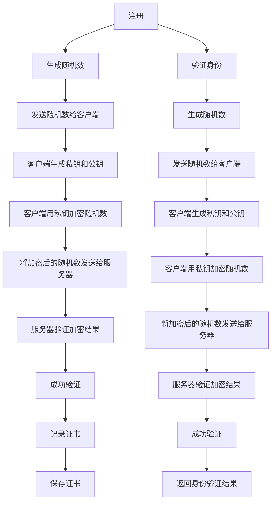

                 

## 1. 背景介绍

在数字化时代，用户身份验证已经成为了安全与便利的平衡点。传统的密码验证方式虽然简单，但容易忘记、被盗用或者遭受暴力破解，不法分子可以通过社会工程学手段获取密码。为了提高身份验证的安全性，出现了生物识别技术、令牌、一次性密码（OTP）等多种方式，这些方式虽然增强了安全性，但普遍存在使用复杂、易受攻击或者成本高等问题。

WebAuthn标准的出现就是为了解决这一难题。WebAuthn，全称为Web身份认证（Web Authentication），是一个旨在为Web应用程序提供简单、易用、可互操作的身份验证协议。它基于公钥密码学，利用现有的密码学技术，为用户提供可信的、基于用户硬件设备的身份验证方式。

## 2. 核心概念与联系

### 2.1 核心概念概述

WebAuthn标准的核心概念包括：

- **注册和验证**：用户在设备上注册新身份，并使用身份验证器（Authenticator）验证该身份。
- **公钥加密**：使用公钥和私钥加密传输的数据，确保通信安全。
- **证书（Credentials）**：用户身份的表示，包含公钥信息和设备信息。
- **认证器（Authenticator）**：用户用于身份验证的硬件设备，如U2F密钥、FIDO2密钥等。
- **认证器信息（Authenticator Information）**：认证器的硬件信息，用于与认证器建立连接。
- **挑战-响应（Challenge-Response）**：服务器生成随机数，发送给客户端，客户端用私钥加密后返回给服务器，验证用户身份。

### 2.2 核心概念原理和架构的 Mermaid 流程图



### 2.3 核心概念之间的关系

WebAuthn的认证过程主要包括以下几个步骤：

1. 用户在设备上注册新身份，生成公私钥对，并将公钥和设备信息封装成证书。
2. 用户使用身份验证器（如U2F密钥）存储证书，并在身份验证时，使用私钥加密服务器生成的随机数。
3. 服务器收到加密后的随机数后，使用相同的公钥解密，验证加密结果是否一致，从而确定用户身份。
4. 成功验证后，服务器将身份验证结果返回给客户端。

## 3. 核心算法原理 & 具体操作步骤

### 3.1 算法原理概述

WebAuthn利用公钥加密技术进行身份验证。具体来说，它通过以下几个算法实现：

1. **随机数生成算法**：服务器生成一个随机的挑战数（Challenge）。
2. **密钥对生成算法**：用户生成一对公私钥。
3. **加密算法**：用户使用私钥加密挑战数，生成一个响应数（Response）。
4. **解密算法**：服务器使用公钥解密响应数，验证加密结果是否一致。

这些算法保证了WebAuthn身份验证的安全性。

### 3.2 算法步骤详解

下面是WebAuthn身份验证的详细步骤：

1. **注册**：
    - 用户选择并配置身份验证器（Authenticator），如U2F密钥、FIDO2密钥等。
    - 用户向服务器注册，生成公私钥对，并将公钥和设备信息封装成证书（Credential）。
    - 服务器将证书存储在用户账户中。

2. **身份验证**：
    - 用户使用身份验证器登录到Web应用。
    - 服务器生成一个随机的挑战数（Challenge）。
    - 用户身份验证器使用私钥加密挑战数，生成响应数（Response）。
    - 服务器收到响应数后，使用公钥解密，验证加密结果是否一致，从而确认用户身份。

### 3.3 算法优缺点

#### 3.3.1 优点

1. **安全性高**：使用公钥加密技术，即使攻击者截获了传输数据，也无法解码出用户身份。
2. **易用性强**：用户只需配置一个身份验证器，即可在多个网站或应用中快速注册和登录。
3. **跨平台支持**：支持多种身份验证器，如U2F、FIDO2等，可以在不同设备上使用。
4. **标准统一**：遵循WebAuthn标准，可以与其他平台和设备无缝集成。

#### 3.3.2 缺点

1. **设备成本高**：支持WebAuthn的设备通常价格较高，用户需要额外投入。
2. **兼容性问题**：部分较老的Web应用可能不支持WebAuthn，用户需要手动配置或安装插件。
3. **学习成本高**：初次使用WebAuthn的用户可能需要一定的时间来熟悉流程和操作步骤。

### 3.4 算法应用领域

WebAuthn主要应用于以下领域：

1. **在线银行和金融服务**：用户需要验证身份才能进行交易操作，WebAuthn可以提供安全、便捷的登录方式。
2. **电子商务**：用户需要在多个在线商店中验证身份，WebAuthn可以简化登录流程。
3. **社交媒体**：用户需要验证身份才能使用某些高级功能，WebAuthn可以提高安全性。
4. **企业内部网络**：企业可以要求员工使用WebAuthn进行身份验证，提高安全性。

## 4. 数学模型和公式 & 详细讲解 & 举例说明

### 4.1 数学模型构建

WebAuthn的数学模型主要包括以下几个部分：

- **公钥加密算法**：使用RSA或ECC算法生成公私钥对。
- **哈希算法**：使用SHA-256等哈希算法生成挑战数和响应数的哈希值。
- **数字签名算法**：使用RSA等算法进行数字签名，验证加密结果。

### 4.2 公式推导过程

#### 4.2.1 公钥加密

假设用户公钥为$e$，私钥为$d$，服务器生成的挑战数为$r$，则用户对$r$进行加密的公式为：

$$
C = r^e \mod n
$$

其中$n$为模数，$e$为指数。

#### 4.2.2 数字签名

服务器收到响应数$C$后，使用公钥$e$和$n$验证$C$，公式为：

$$
r = C^d \mod n
$$

若$r$与服务器生成的$r$一致，则身份验证成功。

### 4.3 案例分析与讲解

假设服务器生成的挑战数为$r=10$，用户公钥为$e=7$，私钥为$d=5$，模数为$n=53$。用户使用私钥$d$加密挑战数$r$，生成响应数$C$，服务器使用公钥$e$和$n$验证$C$。

1. 用户生成响应数$C$：

$$
C = 10^7 \mod 53 = 25
$$

2. 服务器验证响应数$C$：

$$
r = 25^5 \mod 53 = 10
$$

若$r$与服务器生成的$r$一致，则身份验证成功。

## 5. 项目实践：代码实例和详细解释说明

### 5.1 开发环境搭建

WebAuthn的开发需要安装WebAuthn API支持的浏览器和身份验证器。以下是开发环境的搭建步骤：

1. 使用支持WebAuthn的浏览器，如Chrome、Firefox等。
2. 安装支持WebAuthn的身份验证器，如YubiKey、FIDO2密钥等。
3. 在服务器端实现WebAuthn认证API，如使用Node.js等技术。

### 5.2 源代码详细实现

以下是一个简单的Node.js实现WebAuthn身份验证的代码示例：

```javascript
const WebAuthn = require('webauthn-node');

const authenticator = new WebAuthn();

// 生成挑战数
const challenge = authenticator.challenge();

// 用户注册
authenticator.register({
    credential: {
        publicKey: {
            p: '公钥值',
            q: '模数值',
            d: '私钥值',
            n: '模数值',
            e: '指数值',
        },
        counter: 0,
    },
    rp: {
        name: 'My App',
        iconUrl: 'https://example.com/icon.png',
        challenge: challenge,
    },
    user: {
        credentialId: '用户ID',
        pubKeyCredParams: [
            {
                type: 'public-key',
                alg: 'ES256',
                keyUsages: ['authenticate'],
            },
        ],
        userVerification: 'required',
    },
    timeout: 30000,
})
.then(credential => {
    console.log('注册成功', credential);
});

// 用户身份验证
authenticator.authenticate({
    credential: credential,
    rp: {
        name: 'My App',
        iconUrl: 'https://example.com/icon.png',
        challenge: challenge,
    },
})
.then(authResult => {
    console.log('身份验证成功', authResult);
});
```

### 5.3 代码解读与分析

在上述代码中，我们使用webauthn-node库实现WebAuthn身份验证。以下是代码的详细解读：

- `challenge()`方法生成挑战数。
- `register()`方法实现用户注册，将公钥和证书存储在服务器端。
- `authenticate()`方法实现用户身份验证，使用挑战数和公钥进行加密和解密。
- `.then()`方法用于处理注册和验证的结果。

### 5.4 运行结果展示

注册和验证成功后，浏览器将弹出身份验证器设备，用户通过指纹、密码等方式进行身份验证，浏览器显示身份验证结果。

## 6. 实际应用场景

### 6.1 在线银行和金融服务

WebAuthn可以应用于在线银行和金融服务，提高用户身份验证的安全性。用户只需要一个身份验证器，如U2F密钥，即可在多个银行应用中快速注册和登录，而无需记忆多个密码。

### 6.2 电子商务

WebAuthn可以简化用户在多个电子商务网站上的登录流程。用户只需要使用一个身份验证器，即可在多个网站中进行身份验证，而无需重复输入密码。

### 6.3 社交媒体

WebAuthn可以用于社交媒体的身份验证，确保用户账户的安全性。用户只需要使用一个身份验证器，即可在多个社交媒体应用中快速登录。

### 6.4 企业内部网络

企业可以要求员工使用WebAuthn进行身份验证，提高内部网络的安全性。员工只需要一个身份验证器，即可在企业内部网络上进行身份验证，而无需使用复杂的密码。

## 7. 工具和资源推荐

### 7.1 学习资源推荐

为了更好地理解WebAuthn的原理和应用，以下是一些推荐的学习资源：

1. WebAuthn官方文档：提供详细的API文档和示例代码，帮助开发者快速上手。
2. WebAuthn标准文档：提供WebAuthn标准的技术细节，帮助开发者深入理解。
3. WebAuthn入门教程：适合初学者的WebAuthn入门教程，提供详细的步骤和代码示例。
4. WebAuthn实战项目：提供WebAuthn的实际应用项目，帮助开发者实践WebAuthn的实现。

### 7.2 开发工具推荐

WebAuthn的开发需要使用支持WebAuthn API的浏览器和身份验证器。以下是一些推荐的开发工具：

1. Chrome浏览器：支持WebAuthn API，易于使用和调试。
2. Firefox浏览器：支持WebAuthn API，易于使用和调试。
3. U2F密钥：支持WebAuthn的硬件身份验证器，易于使用和携带。
4. FIDO2密钥：支持WebAuthn的硬件身份验证器，易于使用和携带。

### 7.3 相关论文推荐

以下是一些关于WebAuthn的论文，推荐阅读：

1. FIDO Alliance: "FIDO2 Authentication Framework"。
2. WebAuthn标准文档：《Web Authentication API》。
3. WebAuthn技术报告：《Web Authentication Technology》。

## 8. 总结：未来发展趋势与挑战

### 8.1 研究成果总结

WebAuthn标准自发布以来，得到了广泛的应用和支持。通过使用公钥加密技术，WebAuthn提供了简单、易用、安全的身份验证方式。WebAuthn标准的统一性，使得不同设备和应用之间的互操作性得到了保障。

### 8.2 未来发展趋势

未来，WebAuthn将继续在以下几个方面发展：

1. **多因素认证**：WebAuthn将与其他身份验证技术（如短信验证、双因素认证等）结合，提供更加安全的身份验证方式。
2. **身份验证器普及**：随着身份验证器硬件的普及，WebAuthn将得到更广泛的应用。
3. **跨平台支持**：WebAuthn将支持更多平台和设备，包括移动设备、智能家居等。
4. **新兴技术融合**：WebAuthn将与其他新兴技术（如区块链、人工智能等）结合，提供更加智能和安全的身份验证方式。

### 8.3 面临的挑战

WebAuthn虽然有很多优点，但在推广应用过程中仍面临一些挑战：

1. **兼容性问题**：部分较老的Web应用可能不支持WebAuthn，用户需要手动配置或安装插件。
2. **设备成本高**：支持WebAuthn的设备通常价格较高，用户需要额外投入。
3. **学习成本高**：初次使用WebAuthn的用户可能需要一定的时间来熟悉流程和操作步骤。

### 8.4 研究展望

未来，WebAuthn研究需要在以下几个方面进行突破：

1. **用户体验提升**：提升WebAuthn的用户体验，使其更加便捷和易用。
2. **安全性增强**：进一步增强WebAuthn的安全性，防止身份验证过程中的安全漏洞。
3. **设备成本降低**：降低支持WebAuthn的设备成本，提高其普及率。
4. **跨平台集成**：实现WebAuthn在不同平台和设备之间的无缝集成。

## 9. 附录：常见问题与解答

**Q1: 什么是WebAuthn？**

A: WebAuthn是一种基于公钥密码学的身份验证协议，用于为Web应用程序提供简单、易用、可互操作的身份验证方式。

**Q2: WebAuthn的应用场景有哪些？**

A: WebAuthn主要应用于在线银行、电子商务、社交媒体和企业内部网络等领域，提供安全的身份验证方式。

**Q3: WebAuthn的优缺点有哪些？**

A: WebAuthn的优点包括安全性高、易用性强、跨平台支持等，缺点包括设备成本高、兼容性问题等。

**Q4: WebAuthn的实现需要哪些步骤？**

A: WebAuthn的实现主要包括以下步骤：生成挑战数、注册、身份验证等。

**Q5: 如何使用WebAuthn进行身份验证？**

A: 用户使用身份验证器（如U2F密钥、FIDO2密钥等）存储证书，并在身份验证时，使用私钥加密服务器生成的随机数。服务器使用公钥解密，验证加密结果，确认用户身份。

---

作者：禅与计算机程序设计艺术 / Zen and the Art of Computer Programming

