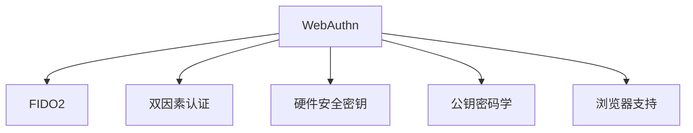

                 

# WebAuthn 的实现细节

> 关键词：WebAuthn, FIDO2, 双因素认证, 身份验证, 安全标准, 浏览器支持

## 1. 背景介绍

WebAuthn（Web身份验证API）是W3C组织的一项标准，旨在为Web应用程序提供一种安全、标准化、易于集成的身份验证方法。WebAuthn基于FIDO2（Fast Identity Online）架构，支持基于公钥密码学的身份验证方式，旨在提供一种强大的、多因素的身份验证机制，同时保护用户的隐私和数据安全。

WebAuthn的出现，标志着Web身份验证进入了一个新的时代。在传统的用户名和密码认证方式下，用户的数据安全难以得到保障，且容易被盗用。WebAuthn通过利用硬件安全密钥（如USB密钥、指纹识别器等）进行身份验证，增强了用户的身份验证安全性。同时，WebAuthn还支持多因素认证，提升了验证的安全性。

WebAuthn的另一个重要特性是跨平台支持。WebAuthn不仅支持浏览器，还可以与移动设备和桌面应用程序配合使用，确保了用户在不同设备上的统一身份验证体验。

## 2. 核心概念与联系

### 2.1 核心概念概述

为更好地理解WebAuthn的实现细节，本节将介绍几个关键概念：

- WebAuthn：Web身份验证API，为Web应用程序提供了一种安全、标准化的身份验证方法。
- FIDO2：Fast Identity Online 2.0，WebAuthn所基于的身份验证标准。
- 双因素认证(2FA)：需要用户提供两种或以上身份验证方式（如密码+指纹、密码+硬件密钥等）才能完成身份验证。
- 硬件安全密钥(HSK)：一种硬件设备，如USB密钥、指纹识别器等，用于存储和管理用户的私钥。
- 公钥密码学：WebAuthn所采用的加密方式，利用公钥和私钥进行加密和解密，保证数据的安全传输。
- 浏览器支持：目前大多数现代浏览器都支持WebAuthn，使得WebAuthn能够被广泛应用。

这些核心概念之间的逻辑关系可以通过以下Mermaid流程图来展示：



这个流程图展示了这个核心概念之间的联系：

1. WebAuthn基于FIDO2标准进行设计，确保了其安全性。
2. WebAuthn支持双因素认证，增强了身份验证的安全性。
3. WebAuthn利用硬件安全密钥进行身份验证，增强了用户隐私和数据安全。
4. WebAuthn采用公钥密码学进行加密，保证了数据的安全传输。
5. WebAuthn兼容现代浏览器，使得其在Web应用程序中得到了广泛应用。

## 3. 核心算法原理 & 具体操作步骤
### 3.1 算法原理概述

WebAuthn的实现基于公钥密码学，主要分为三个步骤：注册、认证和登录。

- 注册：用户在浏览器上创建认证对象，并注册一个身份验证密钥对。
- 认证：当用户尝试访问一个受保护的Web应用程序时，WebAuthn要求用户提供一种身份验证方式，如指纹或USB密钥。
- 登录：当用户提供有效的身份验证方式后，WebAuthn将使用公钥加密的方式对用户进行身份验证。

WebAuthn的注册和认证过程涉及到一些关键算法：

1. 密钥生成：在注册时，WebAuthn使用RSA算法生成一个密钥对，将公钥存储在硬件安全密钥中，私钥存储在Web应用程序服务器中。
2. 数字签名：WebAuthn使用数字签名算法对用户身份进行验证，确保身份的真实性和完整性。
3. 密钥交换：WebAuthn使用Diffie-Hellman密钥交换算法，与Web应用程序服务器交换密钥，用于加密和解密数据。

### 3.2 算法步骤详解

以下是对WebAuthn注册、认证和登录过程的详细讲解：

**注册步骤：**

1. **生成公私钥对**：当用户首次使用WebAuthn注册时，WebAuthn生成一个公私钥对，公钥存储在硬件安全密钥中，私钥存储在Web应用程序服务器中。

2. **创建认证对象**：WebAuthn使用注册公钥创建一个认证对象，包含公钥和对应的密钥句柄。

3. **验证用户身份**：WebAuthn要求用户提供一个身份验证方式，如指纹或USB密钥，并使用数字签名算法对用户身份进行验证。

4. **将认证对象存储在Web应用程序服务器**：WebAuthn将认证对象存储在Web应用程序服务器中，以便后续认证使用。

**认证步骤：**

1. **请求认证对象**：当用户尝试访问一个受保护的Web应用程序时，WebAuthn请求用户提供一个身份验证方式。

2. **获取认证对象**：WebAuthn从Web应用程序服务器中获取与用户身份验证方式对应的认证对象。

3. **验证用户身份**：WebAuthn要求用户提供身份验证方式，并使用数字签名算法对用户身份进行验证。

4. **建立安全通道**：WebAuthn使用Diffie-Hellman密钥交换算法，与Web应用程序服务器交换密钥，用于加密和解密数据。

**登录步骤：**

1. **请求认证对象**：WebAuthn请求用户提供一个身份验证方式。

2. **获取认证对象**：WebAuthn从Web应用程序服务器中获取与用户身份验证方式对应的认证对象。

3. **验证用户身份**：WebAuthn要求用户提供身份验证方式，并使用数字签名算法对用户身份进行验证。

4. **解密数据**：WebAuthn使用公钥对用户输入的数据进行解密，验证数据的完整性和真实性。

### 3.3 算法优缺点

WebAuthn的优点包括：

1. 安全性高：WebAuthn基于公钥密码学，使用硬件安全密钥进行身份验证，增强了用户隐私和数据安全。
2. 多因素认证：WebAuthn支持多种身份验证方式，增强了身份验证的安全性。
3. 浏览器支持：WebAuthn兼容现代浏览器，使得其在Web应用程序中得到了广泛应用。

WebAuthn的缺点包括：

1. 硬件限制：WebAuthn需要硬件安全密钥，如果用户没有硬件设备，无法使用WebAuthn进行身份验证。
2. 学习成本：WebAuthn需要用户学习如何使用硬件设备，增加了使用难度。
3. 兼容性问题：不同的硬件设备和浏览器可能存在兼容性问题，需要进一步优化。

### 3.4 算法应用领域

WebAuthn的应用领域广泛，涵盖了以下几类：

1. **Web应用程序**：WebAuthn可以用于各种Web应用程序，如银行、电子邮件、社交媒体等。
2. **移动应用程序**：WebAuthn可以用于移动应用程序的身份验证，如支付、登录等。
3. **桌面应用程序**：WebAuthn可以用于桌面应用程序的身份验证，如Office、聊天软件等。
4. **智能设备**：WebAuthn可以用于智能设备的身份验证，如智能手表、智能音箱等。

## 4. 数学模型和公式 & 详细讲解 & 举例说明

### 4.1 数学模型构建

WebAuthn的核心算法是基于公钥密码学，包括密钥生成、数字签名、密钥交换等。以下是几个关键的数学模型：

1. **RSA密钥生成算法**：RSA密钥生成算法用于生成RSA公私钥对，其中包含模数n、公钥e和私钥d。

2. **数字签名算法**：数字签名算法用于对用户身份进行验证，其中包含签名密钥k和签名结果S。

3. **Diffie-Hellman密钥交换算法**：Diffie-Hellman密钥交换算法用于与Web应用程序服务器交换密钥，其中包含基数g、私有密钥x和公共密钥y。

### 4.2 公式推导过程

以下是对WebAuthn核心算法的公式推导过程：

**RSA密钥生成算法：**

1. **选择两个大质数p和q**，计算它们的乘积n=p*q。
2. **计算欧拉函数φ(n)=(p-1)*(q-1)**。
3. **选择一个小于φ(n)且与φ(n)互质的整数e**，满足1<e<φ(n)且e与φ(n)互质。
4. **计算d**，满足d*e mod φ(n)=1，即d是e的模φ(n)乘法逆元。
5. **公钥和私钥**：公钥为(n,e)，私钥为(n,d)。

**数字签名算法：**

1. **签名密钥k**：随机选择一个整数k，满足1<k<λ(n)。
2. **签名结果S**：计算S=k*Hash(x) mod n，其中Hash表示哈希函数，x表示用户身份信息。

**Diffie-Hellman密钥交换算法：**

1. **基数g**：选择一个小于n且与n互质的整数g。
2. **私有密钥x**：随机选择一个整数x，满足1<x<λ(n)。
3. **公共密钥y**：计算y=g^x mod n。

### 4.3 案例分析与讲解

以下是一个使用RSA密钥生成算法和数字签名算法进行身份验证的示例：

**示例1：RSA密钥生成和数字签名**

- **密钥生成**：选择两个大质数p=11，q=13，计算n=p*q=143。计算φ(n)=(p-1)*(q-1)=120。选择整数e=17，满足1<e<φ(n)且e与φ(n)互质。计算d=137，满足d*e mod φ(n)=1。公钥为(143,17)，私钥为(143,137)。
- **数字签名**：选择随机整数k=7，计算S=k*Hash("Alice") mod 143=7*136 mod 143=100。

**示例2：Diffie-Hellman密钥交换**

- **基数g**：选择整数g=5。
- **私有密钥x**：随机选择整数x=3。
- **公共密钥y**：计算y=g^x mod 143=5^3 mod 143=125。

在实际应用中，WebAuthn的密钥生成和数字签名过程通常由硬件安全密钥和Web应用程序服务器完成。数字签名算法和Diffie-Hellman密钥交换算法在WebAuthn的身份验证过程中扮演了关键角色。

## 5. 项目实践：代码实例和详细解释说明
### 5.1 开发环境搭建

在进行WebAuthn项目实践前，我们需要准备好开发环境。以下是使用Node.js和FIDO2 Web Authn Library进行WebAuthn开发的流程：

1. **安装Node.js**：从官网下载并安装Node.js，创建项目目录。

2. **安装FIDO2 Web Authn Library**：使用npm安装FIDO2 Web Authn Library，安装命令为`npm install @webauthn/webauthn`。

3. **创建项目文件**：在项目根目录下创建`index.html`文件，用于WebAuthn的身份验证页面。

4. **配置FIDO2 Web Authn Library**：在`index.html`文件中引入FIDO2 Web Authn Library，并进行必要的配置。

完成上述步骤后，即可在项目中开始WebAuthn的身份验证实践。

### 5.2 源代码详细实现

以下是一个使用FIDO2 Web Authn Library进行WebAuthn身份验证的完整代码示例：

```javascript
// 引入FIDO2 Web Authn Library
const WebAuthn = require('@webauthn/webauthn');

// 创建一个新的WebAuthn身份验证器
const authnClient = new WebAuthn.PublicKeyAuthenticator();

// 设置WebAuthn身份验证器的策略，如用户注册所需支持的验证器类型、RSA密钥大小等
authnClient.setStrategy({
  publicKey: {
    name: 'RSA',
    size: 3072
  }
});

// 启动WebAuthn身份验证
authnClient.start({
  RPID: 'https://example.com',
  assertion: {
    rpID: 'https://example.com',
    timeout: 60000
  }
});

// 获取WebAuthn身份验证器的状态
authnClient.getAuthenticatorSelectionCriteria().then((criteria) => {
  console.log(criteria);
});
```

**代码解读与分析：**

1. **引入FIDO2 Web Authn Library**：在项目中引入FIDO2 Web Authn Library，用于处理WebAuthn身份验证。

2. **创建WebAuthn身份验证器**：创建一个新的WebAuthn身份验证器，设置策略，如支持的验证器类型、RSA密钥大小等。

3. **启动WebAuthn身份验证**：使用WebAuthn身份验证器启动身份验证过程，并设置策略，如用户注册所需支持的验证器类型、超时时间等。

4. **获取WebAuthn身份验证器的状态**：获取WebAuthn身份验证器的状态，输出支持的验证器类型等信息。

在实际应用中，WebAuthn的身份验证过程通常涉及多个步骤，包括用户注册、身份验证和用户登录等。开发者需要根据具体需求，设计相应的身份验证流程。

### 5.3 运行结果展示

运行上述代码后，WebAuthn身份验证器将启动，并要求用户提供一种身份验证方式。在用户提供有效的身份验证方式后，WebAuthn将使用公钥加密的方式对用户进行身份验证，验证通过后，即可登录到Web应用程序。

## 6. 实际应用场景
### 6.1 智能设备身份验证

WebAuthn可以用于智能设备的身份验证，如智能手表、智能音箱等。用户可以在智能设备上注册身份验证密钥对，然后在Web应用程序中使用智能设备进行身份验证。这种方式既增强了用户的安全性，又提供了便捷的用户体验。

### 6.2 银行身份验证

WebAuthn可以用于银行的身份验证，保护用户的银行账户安全。用户可以使用USB密钥或指纹识别器等硬件设备进行身份验证，无需记住复杂的密码。WebAuthn的多因素认证机制，进一步增强了用户的身份验证安全性。

### 6.3 企业身份验证

WebAuthn可以用于企业内部的身份验证，确保只有授权人员才能访问企业资源。企业可以在WebAuthn中注册员工的身份验证密钥对，员工可以使用硬件设备进行身份验证，确保企业的安全性和稳定性。

### 6.4 未来应用展望

随着WebAuthn技术的不断成熟，WebAuthn将在更多领域得到应用，为数字化转型提供新的解决方案：

1. **金融行业**：WebAuthn可以用于银行、证券等金融行业的身份验证，保护用户资产安全。
2. **电子商务**：WebAuthn可以用于电子商务平台的身份验证，保护用户购物安全。
3. **医疗行业**：WebAuthn可以用于医疗机构的身份验证，保护患者隐私和医疗数据安全。
4. **社交媒体**：WebAuthn可以用于社交媒体平台的身份验证，保护用户账号安全。

WebAuthn将广泛应用于各种Web应用程序中，成为保障用户身份安全的重要手段。

## 7. 工具和资源推荐
### 7.1 学习资源推荐

为帮助开发者系统掌握WebAuthn的理论基础和实践技巧，这里推荐一些优质的学习资源：

1. **WebAuthn官方文档**：WebAuthn官方文档，包含详细的WebAuthn规范和API说明，是学习WebAuthn的最佳资源。

2. **FIDO2标准文档**：FIDO2标准文档，包含详细的FIDO2规范和API说明，是了解WebAuthn技术的重要资源。

3. **WebAuthn示例代码**：WebAuthn官方提供的示例代码，包含WebAuthn的详细实现流程，是学习WebAuthn的实践参考。

4. **FIDO2 Web Authn Library**：FIDO2 Web Authn Library，提供了WebAuthn的身份验证功能，是WebAuthn开发的常用工具。

5. **WebAuthn入门教程**：WebAuthn入门教程，包含WebAuthn的基础知识和实现步骤，是WebAuthn开发的必备资源。

通过学习这些资源，相信你一定能够快速掌握WebAuthn的实现细节，并用于解决实际的Web应用程序身份验证问题。

### 7.2 开发工具推荐

高效的WebAuthn开发离不开优秀的工具支持。以下是几款用于WebAuthn开发的常用工具：

1. **Node.js**：Node.js是一种常用的JavaScript运行环境，支持异步编程，适合处理WebAuthn的身份验证任务。

2. **FIDO2 Web Authn Library**：FIDO2 Web Authn Library，提供了WebAuthn的身份验证功能，是WebAuthn开发的常用工具。

3. **JavaScript**：JavaScript是一种常用的编程语言，支持异步编程，适合处理WebAuthn的身份验证任务。

4. **Chrome浏览器**：Chrome浏览器支持WebAuthn，可以方便地进行WebAuthn的身份验证测试。

5. **VS Code**：VS Code是一种流行的代码编辑器，支持JavaScript开发，是WebAuthn开发的常用工具。

合理利用这些工具，可以显著提升WebAuthn的身份验证开发效率，加快创新迭代的步伐。

### 7.3 相关论文推荐

WebAuthn技术的发展源于学界的持续研究。以下是几篇奠基性的相关论文，推荐阅读：

1. **WebAuthn 2.0: Building secure passwordless authentications**：WebAuthn 2.0标准文档，介绍了WebAuthn 2.0的规范和API说明，是了解WebAuthn技术的重要资源。

2. **FIDO2: FIDO Alliance's second generation of Fast Identity Online (FIDO) protocols**：FIDO2标准文档，介绍了FIDO2的规范和API说明，是了解WebAuthn技术的重要资源。

3. **WebAuthn: Secure passwordless authentication for the Web**：WebAuthn官方文档，介绍了WebAuthn的规范和API说明，是学习WebAuthn的必备资源。

4. **FIDO2.0: A step towards a passwordless future**：FIDO2标准文档，介绍了FIDO2的规范和API说明，是了解WebAuthn技术的重要资源。

这些论文代表了大规模身份验证技术的发展脉络。通过学习这些前沿成果，可以帮助研究者把握学科前进方向，激发更多的创新灵感。

## 8. 总结：未来发展趋势与挑战
### 8.1 研究成果总结

WebAuthn技术的出现，标志着Web身份验证进入了一个新的时代。WebAuthn基于公钥密码学，使用硬件安全密钥进行身份验证，增强了用户隐私和数据安全。WebAuthn支持多因素认证，增强了身份验证的安全性。WebAuthn兼容现代浏览器，使得其在Web应用程序中得到了广泛应用。

### 8.2 未来发展趋势

展望未来，WebAuthn技术将呈现以下几个发展趋势：

1. **普及性增强**：WebAuthn将得到更广泛的推广和应用，成为Web身份验证的主流方案。

2. **安全性提升**：WebAuthn技术将不断改进，增强身份验证的安全性，保护用户的隐私和数据安全。

3. **跨平台支持**：WebAuthn将支持更多的设备和平台，增强用户的使用体验。

4. **多因素认证**：WebAuthn将支持更多的身份验证方式，增强身份验证的安全性。

5. **自动化身份验证**：WebAuthn将结合人工智能技术，实现自动化的身份验证，提升用户体验。

### 8.3 面临的挑战

尽管WebAuthn技术已经取得了瞩目成就，但在迈向更加智能化、普适化应用的过程中，它仍面临着诸多挑战：

1. **兼容性问题**：不同的硬件设备和浏览器可能存在兼容性问题，需要进一步优化。

2. **用户接受度**：WebAuthn需要用户学习如何使用硬件设备，增加了使用难度。

3. **隐私问题**：WebAuthn需要使用硬件安全密钥进行身份验证，可能涉及到用户的隐私和数据安全问题。

4. **安全漏洞**：WebAuthn在身份验证过程中可能存在安全漏洞，需要不断改进和完善。

5. **标准化问题**：WebAuthn技术的发展需要进一步标准化，避免不同厂商的实现差异。

### 8.4 研究展望

面对WebAuthn面临的挑战，未来的研究需要在以下几个方面寻求新的突破：

1. **提升兼容性**：进一步优化WebAuthn的兼容性，确保在各种设备和平台上都能正常工作。

2. **提高用户体验**：增强WebAuthn的易用性，降低用户学习成本，提高用户接受度。

3. **增强安全性**：增强WebAuthn的安全性，保护用户的隐私和数据安全。

4. **改进标准化**：进一步标准化WebAuthn技术，避免不同厂商的实现差异。

5. **结合人工智能**：结合人工智能技术，实现自动化的身份验证，提升用户体验。

这些研究方向将引领WebAuthn技术迈向更高的台阶，为构建安全、可靠、便捷的Web身份验证系统提供新的解决方案。

## 9. 附录：常见问题与解答

**Q1：WebAuthn与传统的身份验证方式相比有哪些优势？**

A: WebAuthn相比传统的身份验证方式，具有以下优势：

1. 安全性高：WebAuthn基于公钥密码学，使用硬件安全密钥进行身份验证，增强了用户隐私和数据安全。

2. 多因素认证：WebAuthn支持多种身份验证方式，增强了身份验证的安全性。

3. 浏览器支持：WebAuthn兼容现代浏览器，使得其在Web应用程序中得到了广泛应用。

**Q2：WebAuthn的注册和认证过程是如何实现的？**

A: WebAuthn的注册和认证过程主要涉及以下几个步骤：

1. **密钥生成**：在注册时，WebAuthn使用RSA算法生成一个密钥对，将公钥存储在硬件安全密钥中，私钥存储在Web应用程序服务器中。

2. **创建认证对象**：WebAuthn使用注册公钥创建一个认证对象，包含公钥和对应的密钥句柄。

3. **验证用户身份**：WebAuthn要求用户提供一个身份验证方式，如指纹或USB密钥，并使用数字签名算法对用户身份进行验证。

4. **存储认证对象**：WebAuthn将认证对象存储在Web应用程序服务器中，以便后续认证使用。

5. **请求认证对象**：当用户尝试访问一个受保护的Web应用程序时，WebAuthn请求用户提供一个身份验证方式。

6. **获取认证对象**：WebAuthn从Web应用程序服务器中获取与用户身份验证方式对应的认证对象。

7. **验证用户身份**：WebAuthn要求用户提供身份验证方式，并使用数字签名算法对用户身份进行验证。

8. **建立安全通道**：WebAuthn使用Diffie-Hellman密钥交换算法，与Web应用程序服务器交换密钥，用于加密和解密数据。

**Q3：WebAuthn支持哪些硬件设备进行身份验证？**

A: WebAuthn支持以下硬件设备进行身份验证：

1. USB密钥

2. 指纹识别器

3. 智能手表

4. 智能音箱

5. 移动设备

6. 桌面设备

这些硬件设备均支持WebAuthn的身份验证功能，用户可以根据自身需求选择合适的设备进行身份验证。

**Q4：WebAuthn如何保护用户的隐私和数据安全？**

A: WebAuthn通过以下几个方面保护用户的隐私和数据安全：

1. 硬件安全密钥：WebAuthn使用硬件安全密钥进行身份验证，确保用户的私钥和敏感信息不暴露在Web应用程序服务器中。

2. 多因素认证：WebAuthn支持多种身份验证方式，增强了身份验证的安全性。

3. 公钥加密：WebAuthn使用公钥加密的方式对用户进行身份验证，确保数据的安全传输。

4. 浏览器支持：WebAuthn兼容现代浏览器，使得其在Web应用程序中得到了广泛应用，增强了用户的数据安全性。

**Q5：WebAuthn的应用场景有哪些？**

A: WebAuthn的应用场景包括：

1. Web应用程序：WebAuthn可以用于各种Web应用程序，如银行、电子邮件、社交媒体等。

2. 移动应用程序：WebAuthn可以用于移动应用程序的身份验证，如支付、登录等。

3. 桌面应用程序：WebAuthn可以用于桌面应用程序的身份验证，如Office、聊天软件等。

4. 智能设备：WebAuthn可以用于智能设备的身份验证，如智能手表、智能音箱等。

通过以上学习资源、开发工具和相关论文，相信你一定能够快速掌握WebAuthn的实现细节，并用于解决实际的Web应用程序身份验证问题。

---

作者：禅与计算机程序设计艺术 / Zen and the Art of Computer Programming

