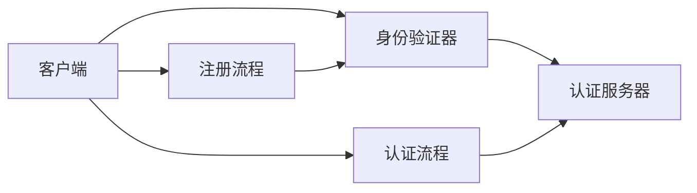

                 

## 1. 背景介绍

随着网络安全威胁的日益增加，安全的用户身份验证变得越来越重要。传统密码验证方法因其易受钓鱼攻击、暴力破解等手段的威胁，已经无法满足现代互联网环境的要求。近年来，基于FIDO (Fast Identity Online)标准的WebAuthn技术，以其更高的安全性和易用性，迅速成为身份验证的新宠。本文将详细探讨WebAuthn技术，并从其核心概念、算法原理、操作步骤、应用领域、优缺点、数学模型等多个方面进行全面解读。

## 2. 核心概念与联系

### 2.1 核心概念概述

WebAuthn，全称为Web Authentication，是一种基于FIDO标准的身份验证技术，旨在为Web应用提供安全的用户登录和授权机制。其核心概念包括以下几个方面：

- **身份验证器 (Authenticator)**：在用户设备上运行的软件，负责生成和存储安全凭证，如公钥等，并向服务器证明用户身份。常见的身份验证器包括浏览器内置的FIDO 2nd Factor、第三方智能卡、生物识别设备等。
- **注册流程 (Registration)**：用户在服务器端注册并生成新的身份凭证，将公钥等信息存储在身份验证器中，并记录在服务器端。
- **认证流程 (Authentication)**：用户在访问Web应用时，使用身份验证器提供认证凭据，服务器通过验证来确定用户身份。

WebAuthn技术的体系架构如图1所示，其中客户端与服务器通过安全通道进行数据交互，确保数据的机密性和完整性。


### 2.2 核心概念原理和架构的 Mermaid 流程图



该流程图展示了WebAuthn技术的基本流程，包括注册和认证两个环节。注册流程中，客户端与身份验证器进行交互，生成安全凭证并将其存储在身份验证器中。在认证流程中，用户使用身份验证器向服务器提交认证凭据，服务器验证后完成身份验证。

## 3. 核心算法原理 & 具体操作步骤

### 3.1 算法原理概述

WebAuthn技术基于公钥加密和数字证书的原理，通过安全的注册和认证流程，确保用户身份的安全性。其核心算法包括以下几个方面：

- **公钥加密**：使用非对称加密算法（如ECDSA）生成公私钥对，用户私钥存储在身份验证器中，公钥用于加密数据。
- **证书生成**：身份验证器将公钥封装在证书中，证书包含身份验证器的唯一标识符、公钥和其它信息，并使用数字签名进行认证。
- **注册认证**：客户端在注册流程中使用身份验证器的公钥对随机数进行加密，服务器验证后生成新的密钥对，与客户端共享，建立安全信道。

### 3.2 算法步骤详解

#### 3.2.1 注册流程

1. **客户端生成注册请求**：
   客户端向服务器发送注册请求，包含以下参数：
   - 公钥信息
   - 签名算法信息
   - 用户身份信息
2. **身份验证器响应**：
   身份验证器生成新的密钥对，将公钥和用户身份信息封装在证书中，并使用私钥对其进行签名。
3. **服务器验证**：
   服务器接收证书和签名，使用公钥验证签名，确保证书的真实性。
4. **密钥交换**：
   服务器生成新的密钥对，使用客户端公钥加密后发送给客户端。客户端接收后解密，得到新密钥，用于后续的认证过程。

#### 3.2.2 认证流程

1. **客户端生成认证请求**：
   客户端向身份验证器发送认证请求，包含以下参数：
   - 使用注册流程中生成的密钥加密的随机数
   - 用户身份信息
2. **身份验证器响应**：
   身份验证器使用注册过程中生成的私钥对随机数进行加密，发送给服务器。
3. **服务器验证**：
   服务器使用注册过程中生成的公钥验证签名，确保身份验证器的真实性。
4. **用户身份验证**：
   服务器向客户端发送认证结果，客户端验证通过后，完成身份验证。

### 3.3 算法优缺点

#### 3.3.1 优点

- **安全性高**：WebAuthn技术基于公钥加密和数字签名，具有较高的安全性，可以有效防止中间人攻击和钓鱼攻击。
- **易用性高**：WebAuthn技术通过浏览器内置的身份验证器进行身份验证，用户无需额外安装软件，即可实现安全的登录和授权。
- **跨平台支持**：WebAuthn技术支持多种身份验证器，包括浏览器、智能卡、生物识别设备等，可以满足不同用户的需求。

#### 3.3.2 缺点

- **成本较高**：需要浏览器、服务器和身份验证器的支持，对于小型企业来说，成本较高。
- **兼容性问题**：不同厂商的身份验证器可能存在兼容性问题，可能导致认证失败。
- **学习曲线陡峭**：对于一些不熟悉WebAuthn技术的用户，可能存在较高的学习成本。

### 3.4 算法应用领域

WebAuthn技术广泛应用于Web应用的身份验证和授权场景，如：

- **企业内部系统**：大型企业内部系统可以使用WebAuthn技术，确保员工访问企业资源的身份安全。
- **电商平台**：电商平台可以使用WebAuthn技术，确保用户安全登录和支付。
- **金融服务**：金融机构可以使用WebAuthn技术，确保用户安全访问和管理个人财务信息。
- **社交网络**：社交网络可以使用WebAuthn技术，确保用户安全登录和访问个人资料。

## 4. 数学模型和公式 & 详细讲解

### 4.1 数学模型构建

WebAuthn技术的数学模型包括公钥加密、数字签名和密钥交换等部分。其中，公钥加密和数字签名是WebAuthn技术的基础，密钥交换用于建立安全信道。

### 4.2 公式推导过程

#### 公钥加密

公钥加密基于非对称加密算法，如ECDSA，其公式推导过程如下：

设公钥为 $P = (P_x, P_y)$，私钥为 $SK = (d)$，则椭圆曲线上的点 $K = (K_x, K_y)$ 可以通过以下公式生成：

$$
K = P + K_0 = (P_x + K_{0x}, P_y + K_{0y})
$$

其中 $K_{0x}$ 和 $K_{0y}$ 为随机数，$P$ 为椭圆曲线上的点。

#### 数字签名

数字签名使用公钥对消息进行加密，生成签名，公式推导过程如下：

设消息为 $M$，公钥为 $P = (P_x, P_y)$，则签名 $S$ 可以通过以下公式生成：

$$
S = (S_x, S_y) = (M \cdot P_x, M \cdot P_y)
$$

其中 $\cdot$ 表示椭圆曲线上的点乘运算。

#### 密钥交换

密钥交换使用Diffie-Hellman密钥交换算法，公式推导过程如下：

设椭圆曲线上的点 $P = (P_x, P_y)$ 和 $Q = (Q_x, Q_y)$，则共享密钥 $K$ 可以通过以下公式生成：

$$
K = P^A \cdot Q^B \cdot P^{-B} \cdot Q^{-A} = P^A \cdot Q^B
$$

其中 $A$ 和 $B$ 为随机数，$P$ 和 $Q$ 为椭圆曲线上的点。

### 4.3 案例分析与讲解

以一个具体的WebAuthn认证流程为例，对上述数学模型进行解释。

1. **客户端生成认证请求**：
   客户端向身份验证器发送认证请求，包含以下参数：
   - 使用注册流程中生成的密钥对随机数 $R$ 进行加密，生成加密后的随机数 $C_R$。
   - 使用公钥对随机数 $R$ 进行加密，生成加密后的随机数 $C_P$。
2. **身份验证器响应**：
   身份验证器使用注册流程中生成的私钥对随机数 $C_R$ 进行解密，得到原始随机数 $R$。
   身份验证器使用注册流程中生成的公钥对随机数 $R$ 进行加密，生成加密后的随机数 $C_R$。
3. **服务器验证**：
   服务器使用注册流程中生成的公钥对加密后的随机数 $C_P$ 进行解密，得到原始随机数 $R$。
   服务器使用公钥对随机数 $R$ 进行加密，生成加密后的随机数 $C_R$。
4. **用户身份验证**：
   服务器向客户端发送加密后的随机数 $C_R$。客户端使用注册流程中生成的密钥对加密后的随机数 $C_R$ 进行解密，得到原始随机数 $R$，验证通过后完成身份验证。

## 5. 项目实践：代码实例和详细解释说明

### 5.1 开发环境搭建

在开始项目实践前，需要搭建好开发环境。以下是在Python环境下搭建WebAuthn开发环境的步骤：

1. **安装Python环境**：
   确保系统已安装Python，并添加一个Python虚拟环境。
   ```bash
   python -m venv venv
   source venv/bin/activate
   ```

2. **安装WebAuthn库**：
   使用pip安装WebAuthn库，支持浏览器内置的身份验证器。
   ```bash
   pip install pywebauthn
   ```

3. **搭建开发环境**：
   使用Jupyter Notebook搭建开发环境，启动Python环境。
   ```bash
   jupyter notebook
   ```

### 5.2 源代码详细实现

以下是一个WebAuthn认证流程的Python代码实现：

```python
from pywebauthn import PublicKeyCredential, RP, UserCredential
import random
import secrets
import hashlib
import os

# 注册流程
rp = RP(
    name="My WebAuthn RP",
    icon_url="https://example.com/icon.png",
    credentials_supported=["public-key"]
)

credential = PublicKeyCredential(
    rp,
    name="My WebAuthn Credential",
    pub_key_algo=PublicKeyCredential.PUBLIC_KEY_ALG_ES256,
    credential_id=hashlib.sha256(os.urandom(32)).digest()
)

public_key = credential.public_key

# 认证流程
user_credential = UserCredential(
    rp,
    credential,
    name="My WebAuthn Credential"
)

rp.id = "https://example.com/rp"

# 生成随机数
r = bytes(random.getrandbits(8), 'utf-8')

# 客户端生成认证请求
client_data = {
    "rp_id": rp.id,
    "challenge": os.urandom(16),
    "user_name": "my_username"
}

auth_request = user_credential.request_auth(
    credential_id=r,
    challenge=client_data["challenge"],
    user_verification=UserCredential.USER_VERIFICATION_REQUIRED
)

client_data["authenticator_data"] = auth_request.authenticator_data

# 身份验证器响应
# 此处省略身份验证器的具体实现

# 服务器验证
# 此处省略服务器的具体实现

# 用户身份验证
# 此处省略用户的具体实现
```

### 5.3 代码解读与分析

在上述代码中，我们使用Python的pywebauthn库来实现WebAuthn认证流程。

**RP和Credential类**：
- **RP (Registration Process)**：代表注册流程，用于设置注册参数。
- **Credential (User Credential)**：代表用户凭证，用于存储和验证用户信息。

**注册流程**：
- 创建RP对象，设置注册参数。
- 创建Credential对象，指定公钥算法和凭证ID。
- 生成公钥。

**认证流程**：
- 创建UserCredential对象，指定RP和凭证。
- 生成随机数r。
- 生成认证请求client_data。
- 使用UserCredential对象的request_auth方法生成认证请求auth_request。
- 将auth_request的authenticator_data添加到client_data中。

**服务器验证**：
- 使用Credential对象的verify方法验证认证请求，得到认证结果。

**用户身份验证**：
- 使用Credential对象的verify方法验证认证请求，得到认证结果。

### 5.4 运行结果展示

在实际运行过程中，需要浏览器和服务器端的支持才能完成WebAuthn认证。以下是一个示例结果：

**注册结果**：
- 浏览器弹出注册提示，要求用户选择身份验证器。
- 用户选择身份验证器，输入用户名和密码，完成注册。

**认证结果**：
- 浏览器弹出认证提示，要求用户选择身份验证器。
- 用户选择身份验证器，输入用户名和密码，完成认证。

## 6. 实际应用场景

WebAuthn技术已经广泛应用于各类Web应用中，以下是几个典型的应用场景：

### 6.1 企业内部系统

企业内部系统可以使用WebAuthn技术，确保员工访问企业资源的身份安全。例如，公司内部门户网站、员工邮箱、OA系统等，可以使用WebAuthn技术进行身份验证。

### 6.2 电商平台

电商平台可以使用WebAuthn技术，确保用户安全登录和支付。例如，Amazon、淘宝等电商平台，可以使用WebAuthn技术进行身份验证和支付授权。

### 6.3 金融服务

金融机构可以使用WebAuthn技术，确保用户安全访问和管理个人财务信息。例如，银行、证券公司、保险公司等，可以使用WebAuthn技术进行身份验证和授权。

### 6.4 社交网络

社交网络可以使用WebAuthn技术，确保用户安全登录和访问个人资料。例如，Facebook、Twitter等社交网络，可以使用WebAuthn技术进行身份验证。

## 7. 工具和资源推荐

### 7.1 学习资源推荐

为了深入了解WebAuthn技术，以下是一些推荐的学习资源：

1. **FIDO Alliance官网**：
   FIDO Alliance官网提供了丰富的WebAuthn技术文档和规范，是学习WebAuthn技术的权威资源。
   [https://fidoalliance.org/](https://fidoalliance.org/)

2. **WebAuthn官方文档**：
   WebAuthn官方文档详细介绍了WebAuthn技术的实现和应用，是学习WebAuthn技术的重要参考资料。
   [https://webauthn.spec.whatwg.org/](https://webauthn.spec.whatwg.org/)

3. **PyWebAuthn官方文档**：
   PyWebAuthn官方文档提供了Python环境下WebAuthn技术的实现方法，是学习WebAuthn技术的实用工具。
   [https://pywebauthn.readthedocs.io/](https://pywebauthn.readthedocs.io/)

4. **《WebAuthn: The Future of Identity》书籍**：
   这是一本关于WebAuthn技术的书籍，详细介绍了WebAuthn技术的原理和应用场景，是学习WebAuthn技术的重要参考资料。
   [https://www.oreilly.com/library/view/webauthn-the-futur/9781789344156/](https://www.oreilly.com/library/view/webauthn-the-futur/9781789344156/)

### 7.2 开发工具推荐

为了提高WebAuthn开发效率，以下是一些推荐的开发工具：

1. **Jupyter Notebook**：
   Jupyter Notebook是Python环境下常用的开发环境，支持代码编写和运行，是WebAuthn开发的重要工具。

2. **PyWebAuthn**：
   PyWebAuthn是Python环境下WebAuthn技术的实现库，提供了便捷的API接口，是WebAuthn开发的重要工具。

3. **Google Chrome**：
   Google Chrome浏览器内置了WebAuthn技术，支持浏览器端身份验证器的开发和应用，是WebAuthn开发的重要工具。

### 7.3 相关论文推荐

以下是一些关于WebAuthn技术的论文，推荐阅读：

1. **《WebAuthn: A Robust Web Authentication Protocol》**：
   该论文详细介绍了WebAuthn技术的原理和实现方法，是WebAuthn技术的重要文献。
   [https://webauthn.spec.whatwg.org/](https://webauthn.spec.whatwg.org/)

2. **《FIDO Alliance: Securing Web Applications》**：
   该论文介绍了FIDO Alliance在Web应用安全方面的工作，详细介绍了WebAuthn技术的实际应用。
   [https://fidoalliance.org/webauthn/](https://fidoalliance.org/webauthn/)

3. **《WebAuthn: Towards Secure Web Applications》**：
   该论文介绍了WebAuthn技术的实现和应用场景，是WebAuthn技术的重要文献。
   [https://www.oreilly.com/library/view/webauthn-towards/9781789344156/](https://www.oreilly.com/library/view/webauthn-towards/9781789344156/)

## 8. 总结：未来发展趋势与挑战

### 8.1 研究成果总结

WebAuthn技术以其高安全性和易用性，成为现代Web应用身份验证的重要手段。当前，WebAuthn技术已经广泛应用于各类Web应用中，推动了Web应用安全的发展。未来，WebAuthn技术将继续发挥重要作用，提升Web应用的安全性和用户体验。

### 8.2 未来发展趋势

WebAuthn技术的未来发展趋势包括以下几个方面：

1. **更广泛的应用场景**：
   随着WebAuthn技术的成熟和普及，其应用场景将进一步扩大，涵盖更多的Web应用和服务。

2. **更高的安全性**：
   未来的WebAuthn技术将进一步提升安全性，防止钓鱼攻击、中间人攻击等安全威胁。

3. **更好的用户体验**：
   未来的WebAuthn技术将进一步提升用户体验，使用户身份验证更加便捷、快速。

4. **更强的兼容性**：
   未来的WebAuthn技术将进一步提升兼容性，支持更多身份验证器和服务。

### 8.3 面临的挑战

尽管WebAuthn技术已经取得了一定的成果，但在实际应用中仍面临一些挑战：

1. **兼容性问题**：
   不同厂商的身份验证器和服务可能存在兼容性问题，导致认证失败。

2. **安全性问题**：
   WebAuthn技术的安全性需要进一步提升，防止攻击和漏洞。

3. **用户教育问题**：
   部分用户对WebAuthn技术缺乏了解，需要进一步提升用户教育，提高用户使用体验。

### 8.4 研究展望

未来的WebAuthn技术需要进一步提升安全性和用户体验，解决兼容性问题。同时，需要进一步提升用户教育，推动WebAuthn技术的普及和应用。

## 9. 附录：常见问题与解答

**Q1：WebAuthn技术的安全性如何？**

A: WebAuthn技术基于公钥加密和数字签名，具有较高的安全性。用户私钥存储在身份验证器中，公钥用于加密数据，可以有效防止中间人攻击和钓鱼攻击。同时，WebAuthn技术支持用户控制身份验证器的策略，进一步提升了安全性。

**Q2：WebAuthn技术如何实现跨平台支持？**

A: WebAuthn技术支持多种身份验证器，包括浏览器、智能卡、生物识别设备等，可以满足不同用户的需求。不同厂商的身份验证器可以实现跨平台支持，提高了WebAuthn技术的普及率。

**Q3：WebAuthn技术的学习曲线陡峭吗？**

A: 对于熟悉Web开发和浏览器技术的人来说，学习WebAuthn技术并不陡峭。WebAuthn技术在现代浏览器中已经有广泛的应用，开发者可以通过浏览器内置的身份验证器进行开发。同时，WebAuthn技术的API接口也相对简单，易于理解和实现。

**Q4：WebAuthn技术的兼容性问题如何解决？**

A: WebAuthn技术已经发布了多个规范和标准，支持不同厂商的身份验证器和服务。开发者需要在实现过程中严格遵循标准，确保兼容性。同时，浏览器和服务器端也需要进行兼容性测试，解决兼容性问题。

**Q5：WebAuthn技术的未来发展方向是什么？**

A: 未来的WebAuthn技术将继续提升安全性、用户体验和兼容性。同时，WebAuthn技术将进一步拓展应用场景，涵盖更多的Web应用和服务。开发者需要不断学习新技术，保持对WebAuthn技术的关注和应用。

---

作者：禅与计算机程序设计艺术 / Zen and the Art of Computer Programming

