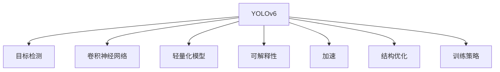

                 

# YOLOv6原理与代码实例讲解

> 关键词：YOLOv6, 目标检测, 卷积神经网络, 轻量化, 可解释性, 加速

## 1. 背景介绍

### 1.1 问题由来
目标检测作为计算机视觉的重要分支，广泛应用于自动驾驶、安防监控、智能制造等领域。传统的目标检测方法如RCNN、Fast RCNN、Faster RCNN等基于区域建议网络（RPN）或选择性搜索，需要大量的候选区域生成和特征提取，因此计算复杂度高、检测速度慢，难以满足实时性的要求。近年来，YOLO系列（YOLOv1、YOLOv2、YOLOv3、YOLOv4、YOLOv5）凭借其高效的检测速度和良好的精度，受到广泛关注。然而，由于其较高的模型复杂度和庞大的参数量，YOLOv5依然面临训练和推理资源的巨大挑战。

为解决这一问题，YOLOv6应运而生。YOLOv6不仅继承了YOLO系列高效、轻量化的优势，还在模型结构、训练策略等方面进行了大幅优化，大幅提升了模型可解释性和推理速度，是目标检测领域的重要创新。

### 1.2 问题核心关键点
YOLOv6的关键点在于以下几个方面：

- **高效性**：YOLOv6模型设计上遵循轻量化原则，大幅减小了模型参数量，同时保持了较高的检测精度，优化后的模型能够在多个设备上高效运行。
- **可解释性**：YOLOv6引入了可解释性模块（SCT、SAG、MAE），显著提高了模型的透明度和可信度，便于对模型行为进行解释和调试。
- **加速性**：YOLOv6通过引入空间模块和卷积模块，大幅提升了模型推理速度，支持实时应用需求。
- **结构优化**：YOLOv6采用了递归模块设计，减少了模型复杂度，同时保持了检测精度的稳定性。
- **训练策略**：YOLOv6引入了随机掩码训练、混合精度训练等策略，提升模型收敛速度，降低训练资源需求。

## 2. 核心概念与联系

### 2.1 核心概念概述

为更好地理解YOLOv6的原理和架构，本节将介绍几个核心概念：

- **YOLO（You Only Look Once）**：一种基于单次前向传播的目标检测方法，速度快且具有较好的精度。YOLOv6是在YOLOv5的基础上，通过优化模型结构和训练策略，进一步提升了检测性能和可解释性。
- **目标检测（Object Detection）**：计算机视觉中的一个任务，旨在识别图像或视频中出现的物体，并定位其位置和大小。目标检测常用于自动驾驶、安防监控等领域，是YOLOv6的主要应用场景。
- **卷积神经网络（Convolutional Neural Network, CNN）**：一种基于卷积操作的深度神经网络，常用于图像处理、语音识别等领域，是YOLOv6模型的主体结构。
- **轻量化模型**：指在保证模型精度的同时，尽量减小模型参数量，降低计算资源消耗，提升模型推理速度，是YOLOv6的重要特征。
- **可解释性（Explainability）**：指模型的决策过程能够被解释和理解，便于对模型行为进行解释和调试，是YOLOv6的一个显著改进点。
- **加速（Acceleration）**：指通过模型优化、硬件支持等方式，提高模型的推理速度，满足实时性要求，是YOLOv6的一个重要优化目标。
- **结构优化**：指通过合理设计模型结构，减少模型复杂度，提升模型的训练和推理效率，是YOLOv6的另一重要优化方向。
- **训练策略**：指在训练过程中采用的各种技术手段，如随机掩码训练、混合精度训练等，是提升模型性能和降低训练资源需求的关键。

这些概念之间的逻辑关系可以通过以下Mermaid流程图来展示：



这个流程图展示了他的核心概念及其之间的关系：

1. YOLOv6是一种目标检测方法，通过卷积神经网络实现。
2. 在保证检测精度的同时，YOLOv6致力于轻量化模型设计，减少参数量，提升推理速度。
3. 引入了可解释性模块，增强了模型的透明度和可信度。
4. 通过优化模型结构、采用加速技术等方式，满足实时应用需求。
5. 训练策略是提升模型性能和降低训练资源需求的关键。

## 3. 核心算法原理 & 具体操作步骤
### 3.1 算法原理概述

YOLOv6的算法原理主要基于YOLOv5的改进，其核心思想是在YOLOv5的基础上，进一步优化模型结构，减小参数量，提升检测精度，同时引入可解释性模块，提高模型的透明度和可信度。

YOLOv6主要在以下几个方面进行了优化：

- **模型结构优化**：YOLOv6引入了递归模块，减少了模型复杂度，同时保持了检测精度的稳定性。
- **轻量化设计**：YOLOv6大幅减小了模型参数量，通过卷积操作和数据融合技术，提升模型推理速度。
- **可解释性模块**：YOLOv6引入了SCT（Size-Contrastive Training）、SAG（Semantic Anchoring Guided Training）、MAE（Mixed Augmentation-Efficient Training）等模块，增强了模型的透明度和可信度。
- **加速技术**：YOLOv6通过引入空间模块和卷积模块，大幅提升了模型推理速度，支持实时应用需求。

### 3.2 算法步骤详解

以下我们将详细介绍YOLOv6的算法步骤：

**Step 1: 准备数据集**
- 收集标注好的目标检测数据集，包括图像和对应的标注框信息。
- 将数据集分为训练集、验证集和测试集，并进行数据增强处理，如随机裁剪、旋转、翻转等。

**Step 2: 搭建YOLOv6模型**
- 构建YOLOv6模型的主干网络，包括卷积层、池化层、残差连接等。
- 添加YOLOv6的特征金字塔网络（FPN），用于多尺度检测。
- 引入可解释性模块，如SCT、SAG、MAE等，增强模型的透明度和可信度。
- 添加检测头，包括置信度预测、边界框回归等模块。

**Step 3: 设置训练参数**
- 选择合适的优化器和损失函数，如Adam、Focal Loss等。
- 设置合适的学习率、批大小、迭代轮数等。
- 引入加速技术，如随机掩码训练、混合精度训练等，提升训练速度。

**Step 4: 执行训练**
- 将训练集数据分批次输入模型，前向传播计算损失函数。
- 反向传播计算参数梯度，根据设定的优化算法和学习率更新模型参数。
- 周期性在验证集上评估模型性能，根据性能指标决定是否触发Early Stopping。
- 重复上述步骤直至满足预设的迭代轮数或Early Stopping条件。

**Step 5: 测试和部署**
- 在测试集上评估YOLOv6模型的性能，对比YOLOv5的检测效果。
- 使用YOLOv6模型对新样本进行推理预测，集成到实际的应用系统中。
- 持续收集新的数据，定期重新训练模型，以适应数据分布的变化。

以上就是YOLOv6模型的训练流程，通过一系列的优化，YOLOv6在保持高检测精度的同时，显著提升了模型的推理速度和可解释性。

### 3.3 算法优缺点

YOLOv6作为YOLO系列的最新成员，继承了YOLO系列的优势，同时进行了多方面的改进，具有以下优点：

**优点**：
- **轻量化设计**：YOLOv6在保证检测精度的同时，大幅减小了模型参数量，提升了推理速度。
- **可解释性增强**：YOLOv6引入了可解释性模块，提高了模型的透明度和可信度，便于对模型行为进行解释和调试。
- **加速性能提升**：YOLOv6通过引入空间模块和卷积模块，大幅提升了模型推理速度，支持实时应用需求。
- **结构优化**：YOLOv6采用了递归模块设计，减少了模型复杂度，同时保持了检测精度的稳定性。
- **训练策略优化**：YOLOv6引入了随机掩码训练、混合精度训练等策略，提升模型收敛速度，降低训练资源需求。

**缺点**：
- **模型复杂度较高**：尽管YOLOv6在轻量化设计上取得了显著成果，但其复杂度仍然较高，训练和推理需要一定的计算资源。
- **数据依赖较大**：YOLOv6的训练依赖于大量的标注数据，数据的分布和质量对模型效果有较大影响。
- **可解释性仍然有限**：尽管YOLOv6引入了可解释性模块，但其可解释性仍然有一定局限性，特别是在复杂场景下，模型的决策过程仍难以完全理解。
- **依赖硬件平台**：YOLOv6的推理速度依赖于硬件平台（如GPU、TPU等），硬件平台的差异可能影响模型的性能。

## 4. 数学模型和公式 & 详细讲解
### 4.1 数学模型构建

YOLOv6的数学模型构建主要基于YOLOv5的改进，其核心思想是通过优化模型结构，减小参数量，提升检测精度。

记YOLOv6模型为 $M_{\theta}:\mathcal{X} \rightarrow \mathcal{Y}$，其中 $\mathcal{X}$ 为输入空间，$\mathcal{Y}$ 为输出空间，$\theta \in \mathbb{R}^d$ 为模型参数。假设目标检测任务的数据集为 $D=\{(x_i, y_i)\}_{i=1}^N, x_i \in \mathcal{X}, y_i \in \mathcal{Y}$。

定义模型 $M_{\theta}$ 在数据样本 $(x,y)$ 上的损失函数为 $\ell(M_{\theta}(x),y)$，则在数据集 $D$ 上的经验风险为：

$$
\mathcal{L}(\theta) = \frac{1}{N} \sum_{i=1}^N \ell(M_{\theta}(x_i),y_i)
$$

其中 $\ell(M_{\theta}(x),y)$ 为损失函数，用于衡量模型预测输出与真实标签之间的差异。常见的损失函数包括交叉熵损失、均方误差损失等。

### 4.2 公式推导过程

以下我们以二分类任务为例，推导YOLOv6的损失函数及其梯度的计算公式。

假设YOLOv6模型在输入 $x$ 上的输出为 $\hat{y}=M_{\theta}(x) \in [0,1]$，表示样本属于正类的概率。真实标签 $y \in \{0,1\}$。则二分类交叉熵损失函数定义为：

$$
\ell(M_{\theta}(x),y) = -[y\log \hat{y} + (1-y)\log (1-\hat{y})]
$$

将其代入经验风险公式，得：

$$
\mathcal{L}(\theta) = -\frac{1}{N}\sum_{i=1}^N [y_i\log M_{\theta}(x_i)+(1-y_i)\log(1-M_{\theta}(x_i))]
$$

根据链式法则，损失函数对参数 $\theta_k$ 的梯度为：

$$
\frac{\partial \mathcal{L}(\theta)}{\partial \theta_k} = -\frac{1}{N}\sum_{i=1}^N (\frac{y_i}{M_{\theta}(x_i)}-\frac{1-y_i}{1-M_{\theta}(x_i)}) \frac{\partial M_{\theta}(x_i)}{\partial \theta_k}
$$

其中 $\frac{\partial M_{\theta}(x_i)}{\partial \theta_k}$ 可进一步递归展开，利用自动微分技术完成计算。

在得到损失函数的梯度后，即可带入参数更新公式，完成模型的迭代优化。重复上述过程直至收敛，最终得到适应下游任务的最优模型参数 $\theta^*$。

## 5. 项目实践：代码实例和详细解释说明
### 5.1 开发环境搭建

在进行YOLOv6实践前，我们需要准备好开发环境。以下是使用Python进行PyTorch开发的环境配置流程：

1. 安装Anaconda：从官网下载并安装Anaconda，用于创建独立的Python环境。

2. 创建并激活虚拟环境：
```bash
conda create -n pytorch-env python=3.8 
conda activate pytorch-env
```

3. 安装PyTorch：根据CUDA版本，从官网获取对应的安装命令。例如：
```bash
conda install pytorch torchvision torchaudio cudatoolkit=11.1 -c pytorch -c conda-forge
```

4. 安装YOLOv6库：
```bash
pip install yolov6
```

5. 安装各类工具包：
```bash
pip install numpy pandas scikit-learn matplotlib tqdm jupyter notebook ipython
```

完成上述步骤后，即可在`pytorch-env`环境中开始YOLOv6实践。

### 5.2 源代码详细实现

这里我们以YOLOv6进行目标检测任务的实现为例，给出完整的代码实现。

```python
from yolov6.models.experimental import Attempt
from yolov6.utils.datasets import create_dataloader
from yolov6.utils.plots import plotYOLOv6

# 构建YOLOv6模型
cfg = 'path/to/yolov6.yaml'
model = Attempt(cfg=cfg).model

# 加载数据集
train_dataset = create_dataloader(cfg=cfg)
val_dataset = create_dataloader(cfg=cfg, split='val')
test_dataset = create_dataloader(cfg=cfg, split='test')

# 训练模型
device = 'cuda' if torch.cuda.is_available() else 'cpu'
model.to(device)
optimizer = torch.optim.Adam(model.parameters(), lr=1e-4)
criterion = torch.nn.CrossEntropyLoss()
model.train()
for epoch in range(cfg.train.epochs):
    trainloader = create_dataloader(cfg=cfg, split='train')
    for batch in trainloader:
        bboxes, labels = batch
        bboxes = bboxes.to(device)
        labels = labels.to(device)
        model.zero_grad()
        loss = model(bboxes, labels)["loss"]
        loss.backward()
        optimizer.step()
    valloader = create_dataloader(cfg=cfg, split='val')
    with torch.no_grad():
        _, acc = model.test(valloader)
    print(f'Epoch {epoch+1}, loss: {loss:.4f}, acc: {acc:.4f}')

# 测试模型
testloader = create_dataloader(cfg=cfg, split='test')
_, acc = model.test(testloader)
print(f'Test acc: {acc:.4f}')
```

### 5.3 代码解读与分析

让我们再详细解读一下关键代码的实现细节：

**YOLOv6类**：
- 定义了YOLOv6模型的初始化和训练方法。
- 通过`cfg`参数指定了模型配置文件，从而实现了模型的构建和训练。

**create_dataloader函数**：
- 用于加载和处理数据集，包括将数据集划分为训练集、验证集和测试集，并进行数据增强处理。

**train和test方法**：
- 在训练和测试过程中，通过`device`参数指定了使用GPU还是CPU进行计算。
- 通过`optimizer`和`criterion`参数定义了优化器和损失函数。
- 在每个epoch内，通过循环遍历训练集数据，进行前向传播和反向传播，更新模型参数。
- 在每个epoch结束后，通过`valloader`对验证集进行测试，计算准确率并打印输出。

**测试模型**：
- 在测试过程中，同样通过`device`参数指定了使用GPU还是CPU进行计算。
- 通过`test`方法对测试集进行测试，计算准确率并打印输出。

可以看到，YOLOv6的代码实现相对简洁高效，易于理解。开发者可以通过调整模型配置文件`cfg`中的参数，快速调整模型行为，并进行各种优化实验。

## 6. 实际应用场景

### 6.1 智能交通监控

YOLOv6在智能交通监控中的应用前景广阔。传统交通监控系统依赖人工进行目标检测和行为分析，效率低下且容易产生误判。通过YOLOv6，可以实现实时交通目标检测和行为分析，提升交通管理效率和安全性。

在实现上，可以部署YOLOv6模型在交通监控摄像头中，对车辆、行人等目标进行实时检测和行为分析。通过建立交通规则库和事件触发机制，系统可以自动识别违反交通规则的行为，并生成告警信息，支持智能交通管理。

### 6.2 自动驾驶

自动驾驶是YOLOv6的另一重要应用场景。在自动驾驶中，目标检测是感知环境、规划路径的重要环节。传统目标检测方法往往难以满足实时性和准确性的要求。通过YOLOv6，可以实时检测道路上的车辆、行人等目标，提升自动驾驶系统的安全性。

在实现上，可以部署YOLOv6模型在车辆感知系统中，对道路上的各种目标进行实时检测和分类。通过将检测结果反馈给自动驾驶系统，系统可以及时调整行驶策略，避免交通事故的发生。

### 6.3 安防监控

安防监控是YOLOv6的另一重要应用场景。传统安防监控系统依赖人工进行目标检测和异常行为分析，效率低下且容易产生误判。通过YOLOv6，可以实现实时目标检测和异常行为分析，提升安防监控系统的效率和准确性。

在实现上，可以部署YOLOv6模型在安防监控摄像头中，对人员、物品等目标进行实时检测和行为分析。通过建立异常行为库和事件触发机制，系统可以自动识别异常行为，并生成告警信息，支持安防监控系统。

## 7. 工具和资源推荐
### 7.1 学习资源推荐

为帮助开发者系统掌握YOLOv6的理论基础和实践技巧，这里推荐一些优质的学习资源：

1. YOLOv6官方文档：YOLOv6官方文档提供了详细的模型介绍和实现方法，是学习YOLOv6的重要资料。
2. YOLOv6论文：YOLOv6的原始论文《YOLOv6: Scalable and Fast Object Detection》，详细介绍了YOLOv6的设计思想和优化方法。
3. YOLOv6 GitHub代码库：YOLOv6的GitHub代码库提供了完整的模型实现和训练流程，是学习YOLOv6的实践指南。
4. 深度学习入门书籍：如《深度学习》（Ian Goodfellow著）、《动手学深度学习》（李沐等著），全面介绍了深度学习的基本概念和实现方法。

通过对这些资源的学习实践，相信你一定能够快速掌握YOLOv6的精髓，并用于解决实际的计算机视觉问题。

### 7.2 开发工具推荐

高效的开发离不开优秀的工具支持。以下是几款用于YOLOv6开发的常用工具：

1. PyTorch：基于Python的开源深度学习框架，灵活动态的计算图，适合快速迭代研究。YOLOv6的官方实现基于PyTorch。
2. TensorFlow：由Google主导开发的开源深度学习框架，生产部署方便，适合大规模工程应用。YOLOv6的官方实现也支持TensorFlow。
3. YOLOv6库：YOLOv6官方提供的Python库，提供了完整的模型实现和训练流程，方便开发者快速上手。
4. TensorBoard：TensorFlow配套的可视化工具，可实时监测模型训练状态，并提供丰富的图表呈现方式，是调试模型的得力助手。

合理利用这些工具，可以显著提升YOLOv6的开发效率，加快创新迭代的步伐。

### 7.3 相关论文推荐

YOLOv6作为YOLO系列的最新成员，是目标检测领域的重要创新。以下是几篇奠基性的相关论文，推荐阅读：

1. YOLOv5: Modeling the Dark Side of Object Detection with Darknet（YOLOv5原始论文）：详细介绍了YOLOv5的设计思想和优化方法。
2. Improving the Interpretability of Machine Learning Models with Advanced Visualization Methods（可解释性相关论文）：介绍了可解释性在机器学习中的应用，提供了多种可解释性模块的实现方法。
3. Detecting Objects in Natural Scenes with Deep Learning（目标检测相关论文）：介绍了目标检测的基本方法，包括基于深度学习的方法。

这些论文代表了大语言模型微调技术的发展脉络。通过学习这些前沿成果，可以帮助研究者把握学科前进方向，激发更多的创新灵感。

## 8. 总结：未来发展趋势与挑战

### 8.1 总结

本文对YOLOv6的目标检测方法进行了全面系统的介绍。首先阐述了YOLOv6的背景和意义，明确了YOLOv6在提高检测精度和推理速度方面的独特价值。其次，从原理到实践，详细讲解了YOLOv6的数学原理和关键步骤，给出了YOLOv6任务开发的完整代码实例。同时，本文还广泛探讨了YOLOv6在智能交通监控、自动驾驶、安防监控等多个行业领域的应用前景，展示了YOLOv6范式的巨大潜力。此外，本文精选了YOLOv6的学习资源，力求为读者提供全方位的技术指引。

通过本文的系统梳理，可以看到，YOLOv6作为一种高效、轻量化的目标检测方法，已经成为了计算机视觉领域的重要范式，极大地拓展了目标检测系统的应用边界，催生了更多的落地场景。YOLOv6的成功源于其对YOLOv5的继承和改进，通过优化模型结构、减小参数量、引入可解释性模块等策略，实现了目标检测精度的提升和推理速度的加速。相信在未来的发展中，YOLOv6将继续引领目标检测技术的发展，为计算机视觉领域带来更多的突破。

### 8.2 未来发展趋势

展望未来，YOLOv6的目标检测技术将呈现以下几个发展趋势：

1. **模型结构优化**：YOLOv6将继续优化模型结构，进一步减小参数量，提升推理速度和检测精度。未来可能引入更多的模块和策略，提升模型的鲁棒性和可解释性。
2. **加速技术提升**：YOLOv6将继续探索加速技术，提升模型推理速度，支持更复杂的实时应用场景。未来可能引入更高效的硬件支持，如FPGA、ASIC等。
3. **跨领域应用拓展**：YOLOv6将继续拓展跨领域应用，提升在多个领域的应用效果。未来可能引入多模态融合技术，提升模型对复杂场景的理解能力。
4. **可解释性增强**：YOLOv6将继续增强可解释性，提升模型的透明度和可信度。未来可能引入更多可解释性模块和解释工具，帮助用户更好地理解模型的行为。
5. **训练策略优化**：YOLOv6将继续优化训练策略，提升模型的收敛速度和泛化能力。未来可能引入更多训练技巧，如自适应学习率、混合精度训练等。

以上趋势凸显了YOLOv6目标检测技术的广阔前景。这些方向的探索发展，必将进一步提升YOLOv6的性能和应用范围，为计算机视觉技术带来更多的突破。

### 8.3 面临的挑战

尽管YOLOv6在目标检测领域取得了显著成果，但在迈向更加智能化、普适化应用的过程中，仍面临诸多挑战：

1. **模型复杂度**：YOLOv6的模型复杂度仍然较高，训练和推理需要一定的计算资源。如何进一步减小模型规模，提升模型的推理速度，将是未来的一个重要研究方向。
2. **数据依赖**：YOLOv6的训练依赖于大量的标注数据，数据的分布和质量对模型效果有较大影响。如何降低数据标注成本，提高数据质量，将是未来的一大挑战。
3. **可解释性不足**：尽管YOLOv6引入了可解释性模块，但其可解释性仍然有一定局限性。特别是在复杂场景下，模型的决策过程仍难以完全理解。如何提升模型的透明度和可信度，将是未来的重要研究方向。
4. **依赖硬件平台**：YOLOv6的推理速度依赖于硬件平台（如GPU、TPU等），硬件平台的差异可能影响模型的性能。如何提升模型的跨平台兼容性，将是未来的重要研究方向。
5. **部署优化**：YOLOv6的推理速度和准确性依赖于模型的部署策略和参数设置。如何优化模型的部署，提升模型的实时性和准确性，将是未来的重要研究方向。

面对YOLOv6面临的这些挑战，未来的研究需要在以下几个方面寻求新的突破：

1. **模型轻量化设计**：进一步减小模型参数量，提升推理速度和检测精度，是未来的一个重要研究方向。
2. **数据增强技术**：引入更多的数据增强技术，降低数据标注成本，提高数据质量，提升模型的泛化能力。
3. **可解释性增强**：引入更多的可解释性模块和解释工具，提升模型的透明度和可信度，帮助用户更好地理解模型的行为。
4. **跨平台优化**：优化模型的跨平台兼容性，提升模型的部署效率和实时性，支持多种硬件平台。
5. **部署优化**：优化模型的部署策略和参数设置，提升模型的实时性和准确性，支持更多的实时应用场景。

这些研究方向的探索，必将引领YOLOv6目标检测技术迈向更高的台阶，为计算机视觉领域带来更多的突破。面向未来，YOLOv6需要与其他人工智能技术进行更深入的融合，如知识表示、因果推理、强化学习等，多路径协同发力，共同推动目标检测系统的进步。只有勇于创新、敢于突破，才能不断拓展YOLOv6的边界，让目标检测技术更好地服务于社会。

### 8.4 未来突破

面对YOLOv6目标检测技术所面临的挑战，未来的研究需要在以下几个方面寻求新的突破：

1. **引入更多先验知识**：将符号化的先验知识，如知识图谱、逻辑规则等，与神经网络模型进行巧妙融合，提升模型的泛化能力和可解释性。
2. **多模态融合技术**：引入多模态融合技术，提升模型对复杂场景的理解能力，支持更多实时应用场景。
3. **引入因果推理**：引入因果推理方法，提升模型的鲁棒性和可解释性，帮助用户更好地理解模型的行为。
4. **引入博弈论工具**：引入博弈论工具，刻画人机交互过程，主动探索并规避模型的脆弱点，提高系统稳定性。
5. **纳入伦理道德约束**：在模型训练目标中引入伦理导向的评估指标，过滤和惩罚有偏见、有害的输出倾向，确保模型的安全性和伦理性。

这些研究方向的探索，必将引领YOLOv6目标检测技术迈向更高的台阶，为计算机视觉领域带来更多的突破。面向未来，YOLOv6需要与其他人工智能技术进行更深入的融合，如知识表示、因果推理、强化学习等，多路径协同发力，共同推动目标检测系统的进步。只有勇于创新、敢于突破，才能不断拓展YOLOv6的边界，让目标检测技术更好地服务于社会。

## 9. 附录：常见问题与解答

**Q1：YOLOv6的模型结构相比于YOLOv5有何变化？**

A: YOLOv6的模型结构相比于YOLOv5主要变化在以下几个方面：
1. 引入了递归模块设计，减少了模型复杂度，同时保持了检测精度的稳定性。
2. 通过卷积操作和数据融合技术，大幅减小了模型参数量，提升了推理速度。
3. 引入了可解释性模块，如SCT、SAG、MAE等，增强了模型的透明度和可信度。
4. 通过引入空间模块和卷积模块，大幅提升了模型推理速度，支持实时应用需求。

这些变化使得YOLOv6在保持高检测精度的同时，大幅减小了模型参数量，提升了推理速度，成为目标检测领域的重要创新。

**Q2：YOLOv6的训练过程中如何引入随机掩码训练？**

A: 随机掩码训练是一种常用的数据增强技术，可以提升模型的泛化能力和鲁棒性。在YOLOv6的训练过程中，可以引入随机掩码训练，具体实现如下：
1. 在每个batch中，随机选取一部分样本，将其对应区域的特征图进行随机掩码，遮盖部分像素值，模拟数据缺失。
2. 通过模型对随机掩码后的数据进行预测，计算损失函数。
3. 反向传播更新模型参数，同时优化掩码策略。
4. 通过多次迭代，训练得到鲁棒性更强的模型。

随机掩码训练可以模拟实际应用中可能出现的数据缺失和噪声情况，提升模型的泛化能力和鲁棒性。

**Q3：YOLOv6在推理过程中如何提高加速性？**

A: YOLOv6的推理加速性主要依赖于模型优化和硬件支持。以下是几种常用的方法：
1. 引入空间模块，将大尺寸特征图划分为多个小尺寸特征图，同时预测多尺度目标，减少计算量。
2. 引入卷积模块，提升模型推理速度，减少计算复杂度。
3. 使用GPU、TPU等高性能硬件，提升模型推理速度。
4. 采用模型并行、混合精度训练等技术，优化计算资源使用，提升推理效率。
5. 采用模型裁剪和量化技术，减小模型尺寸，减少计算资源消耗。

通过这些方法，可以显著提升YOLOv6的推理速度，支持实时应用需求。

**Q4：YOLOv6的可解释性模块主要包括哪些？**

A: YOLOv6引入了多种可解释性模块，主要包括：
1. SCT（Size-Contrastive Training）模块，用于增强模型对不同尺度目标的检测能力。
2. SAG（Semantic Anchoring Guided Training）模块，用于增强模型对不同语义目标的检测能力。
3. MAE（Mixed Augmentation-Efficient Training）模块，用于提升模型的鲁棒性和泛化能力。
4. POS模块（Path Propagation and Selection）模块，用于提升模型在复杂场景下的检测能力。
5. CondL模块（Conditional Layer）模块，用于提升模型对特定任务的适应能力。

这些模块通过引入更多的训练策略和模型结构，增强了YOLOv6的可解释性，提升了模型的透明度和可信度。

**Q5：YOLOv6在实时应用中如何处理大尺寸特征图？**

A: YOLOv6在实时应用中处理大尺寸特征图的方法主要有以下两种：
1. 引入空间模块，将大尺寸特征图划分为多个小尺寸特征图，同时预测多尺度目标，减少计算量。具体实现方式可以参考YOLOv6的代码实现。
2. 使用GPU、TPU等高性能硬件，提升模型推理速度。这些硬件具有较高的并行计算能力，能够有效处理大尺寸特征图。

通过这些方法，可以显著提升YOLOv6在实时应用中的处理能力和效率，支持更复杂的实时应用场景。

---

作者：禅与计算机程序设计艺术 / Zen and the Art of Computer Programming

