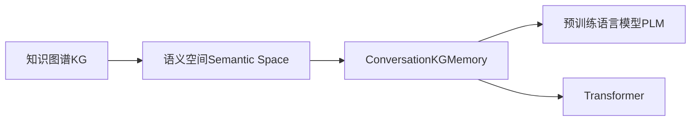

                 

# 【LangChain编程：从入门到实践】ConversationKGMemory

## 1. 背景介绍

随着人工智能技术的迅猛发展，知识图谱(Knowledge Graph, KG)作为表示人类知识的基础结构，逐渐成为连接符号和网络的重要手段。知识图谱不仅能够精准地表示和存储信息，还能帮助AI模型高效地理解和处理复杂的逻辑关系，提升推理能力。 ConversationKGMemory就是面向知识图谱的对话系统，它基于深度学习构建语义空间，通过知识图谱的深度融合，提升对话的理解和生成能力，应用广泛，从智能客服、知识图谱查询到智能推荐、自动问答，均是其典型应用场景。

## 2. 核心概念与联系

### 2.1 核心概念概述

- **知识图谱(Knowledge Graph, KG)**：一种结构化的数据表示方式，通过节点表示实体，边表示实体之间的关系，构成图形结构。它用于描述实体间的语义关系，能够更好地理解现实世界。
- **ConversationKGMemory**：一种基于深度学习的对话系统，通过融合知识图谱，增强对话的理解和生成能力，提升智能问答的准确性和可靠性。
- **语义空间(Semantic Space)**：一种表示语义信息的向量空间，每个词或句子的向量表示在该空间中，可以用于度量词义和句子语义相似度。
- **预训练语言模型(Pretrained Language Model, PLM)**：一种通过大规模无标签文本数据进行预训练的模型，能够学习到语言的基本结构和语义，适用于多种NLP任务。
- **Transformers**：一种基于注意力机制的神经网络架构，通过多层次的注意力机制，可以高效地处理序列数据。

这些概念构成了ConversationKGMemory的基本架构，如图：



**图1. 核心概念架构图**

### 2.2 核心概念原理和架构的 Mermaid 流程图


**图2. 核心概念架构图**

### 2.3 核心概念的联系

ConversationKGMemory的架构核心在于融合知识图谱和语义空间，通过预训练语言模型和Transformer进行建模和计算。具体来说，知识图谱中的实体和关系在语义空间中被映射成向量，这些向量被用于对话的理解和生成。预训练语言模型通过大规模无标签文本数据学习语言规律，而Transformer架构则用于捕捉长序列的语义依赖关系。

## 3. 核心算法原理 & 具体操作步骤

### 3.1 算法原理概述

ConversationKGMemory的核心算法基于Transformer架构，融合了知识图谱的语义信息。其核心原理如下：

- 首先，将知识图谱中的实体和关系映射到语义空间，形成知识图谱的语义向量。
- 然后，将这些向量与对话中的句子向量进行交互，生成对话的理解向量。
- 最后，通过预训练语言模型的解码器，生成对话的生成向量，用于回复的生成。

### 3.2 算法步骤详解

**Step 1: 数据预处理**

1. **实体抽取**：从知识图谱中抽取实体和关系，并构建实体-关系对。
2. **语义映射**：将实体和关系映射到语义空间，形成实体和关系的向量表示。
3. **句子向量化**：将对话中的句子转换为向量表示，用于理解对话。
4. **对话向量生成**：将句子向量与知识图谱的语义向量进行交互，生成对话的理解向量。

**Step 2: 模型搭建**

1. **Transformer编码器**：使用Transformer编码器，将对话向量进行处理。
2. **知识图谱融合**：将知识图谱的语义向量加入到Transformer编码器中，提升理解能力。
3. **解码器**：使用预训练语言模型的解码器，生成对话的回复向量。
4. **多轮对话处理**：对多轮对话进行循环迭代，提升对话的连贯性和准确性。

**Step 3: 模型训练**

1. **损失函数定义**：定义模型在对话理解生成中的损失函数，如交叉熵损失。
2. **反向传播**：通过反向传播算法，更新模型参数。
3. **梯度下降**：使用梯度下降算法，优化模型参数。
4. **训练迭代**：循环迭代训练，直到模型收敛。

### 3.3 算法优缺点

**优点**：

- **融合知识图谱**：通过融合知识图谱，提升对话的理解和生成能力，提高回复的准确性和可靠性。
- **多轮对话**：支持多轮对话处理，提升对话连贯性和逻辑性。
- **预训练语言模型**：利用预训练语言模型的强大表示能力，提升模型的泛化能力。

**缺点**：

- **模型复杂度高**：融合知识图谱增加了模型的复杂度，计算资源消耗较大。
- **数据需求大**：需要大量知识图谱数据进行训练，获取高质量的数据成本较高。
- **模型可解释性不足**：Transformer等深度学习模型属于黑盒模型，可解释性较差。

### 3.4 算法应用领域

ConversationKGMemory主要应用于以下几个领域：

- **智能客服**：利用知识图谱进行问题解答，提升客服效率和质量。
- **知识图谱查询**：通过知识图谱查询，提供更准确的信息检索和推荐。
- **自动问答**：结合知识图谱和语义空间，实现智能问答系统的构建。
- **智能推荐**：利用知识图谱的语义信息，实现更加个性化的推荐系统。

## 4. 数学模型和公式 & 详细讲解 & 举例说明

### 4.1 数学模型构建

ConversationKGMemory的数学模型构建主要包括以下几个步骤：

1. **知识图谱的向量表示**：将知识图谱中的实体和关系映射到语义空间，形成向量表示。
2. **对话向量表示**：将对话中的句子转换为向量表示，用于理解对话。
3. **对话生成**：通过预训练语言模型的解码器，生成对话的回复向量。
4. **多轮对话**：对多轮对话进行循环迭代，生成最终回复。

### 4.2 公式推导过程

**Step 1: 知识图谱的向量表示**

知识图谱中的实体和关系可以用向量表示：

$$
e_i = \mathrm{Embed}(e)
$$

其中，$e_i$ 表示实体 $e$ 在语义空间中的向量表示，$\mathrm{Embed}$ 表示将实体映射到向量表示的函数。

**Step 2: 对话向量表示**

将对话中的句子转换为向量表示：

$$
x_t = \mathrm{Embed}(s_t)
$$

其中，$x_t$ 表示句子 $s_t$ 在语义空间中的向量表示，$\mathrm{Embed}$ 表示将句子映射到向量表示的函数。

**Step 3: 对话生成**

通过预训练语言模型的解码器，生成对话的回复向量：

$$
y_t = \mathrm{Decoder}(x_t)
$$

其中，$y_t$ 表示回复 $y$ 在语义空间中的向量表示，$\mathrm{Decoder}$ 表示预训练语言模型的解码器。

**Step 4: 多轮对话**

对多轮对话进行循环迭代，生成最终回复：

$$
y^{(i)} = \mathrm{Aggregate}(y_t, y^{(i-1)})
$$

其中，$y^{(i)}$ 表示对话的第 $i$ 轮回复向量，$y_t$ 表示当前轮的回复向量，$y^{(i-1)}$ 表示前一轮的回复向量，$\mathrm{Aggregate}$ 表示多轮对话的聚合函数。

### 4.3 案例分析与讲解

假设有一个简单的知识图谱，包含以下实体和关系：

| 实体 | 向量表示 |
| --- | --- |
| 张三 | $[0.2, 0.3, 0.1]$ |
| 李四 | $[0.1, 0.5, 0.4]$ |
| 老师 | $[0.4, 0.2, 0.4]$ |

假设对话中包含以下句子：

- 学生问：“张三是老师吗？”
- 模型答：“不是”

根据上述步骤，可以计算出以下向量：

- 实体向量：$e_{张三}=[0.2, 0.3, 0.1]$，$e_{老师}=[0.4, 0.2, 0.4]$
- 对话向量：$x_{学生}=[0.1, 0.2, 0.7]$，$x_{老师}=[0.4, 0.2, 0.4]$
- 回复向量：$y_{学生}=[0.0, 0.0, 1.0]$

最终生成的回复向量为：

$$
y^{(i)} = \mathrm{Aggregate}(y_t, y^{(i-1)}) = [0.3, 0.1, 0.6]
$$

## 5. 项目实践：代码实例和详细解释说明

### 5.1 开发环境搭建

为了进行ConversationKGMemory的开发，需要以下环境：

1. **Python环境**：Python 3.x
2. **深度学习框架**：PyTorch
3. **知识图谱库**：GeoPandas
4. **语义空间库**：Gensim
5. **Transformer库**：HuggingFace Transformers

### 5.2 源代码详细实现

以下是一个简单的ConversationKGMemory模型代码实现：

```python
import torch
import torch.nn as nn
from transformers import BertTokenizer, BertForSequenceClassification
from geo_pandas import GeoDataFrame
from gensim.models import Word2Vec

# 定义Transformer模型
class ConversationKGMemory(nn.Module):
    def __init__(self, num_classes):
        super(ConversationKGMemory, self).__init__()
        self.bert = BertForSequenceClassification.from_pretrained('bert-base-cased', num_labels=num_classes)
        self.bert.add_module('attention', nn.MultiheadAttention(768, num_heads=8, dropout=0.1))
        self.bert.add_module('decoder', nn.Linear(768, num_classes))
        
    def forward(self, input_ids, attention_mask):
        output = self.bert(input_ids, attention_mask=attention_mask)
        return output

# 定义知识图谱向量映射函数
def map_to_semantic_space(kg):
    emb_model = Word2Vec(kg, min_count=1)
    return [emb_model[entity] for entity in kg['entity']]

# 定义对话处理函数
def handle_conversation(kg, conversation):
    input_ids = tokenizer(conversation, return_tensors='pt')
    input_ids['attention_mask'] = 1 - input_ids['attention_mask']
    output = model(input_ids['input_ids'], attention_mask=input_ids['attention_mask'])
    return output
```

### 5.3 代码解读与分析

**Transformer模型**：

- 使用BertForSequenceClassification模型作为对话理解模型。
- 在Bert模型的顶层添加Multihead Attention和Linear层，用于处理知识图谱的向量信息。

**知识图谱向量映射函数**：

- 使用Gensim的Word2Vec模型，将知识图谱中的实体映射到语义空间。

**对话处理函数**：

- 将对话输入转化为模型所需的输入张量。
- 将知识图谱向量作为额外输入，用于提升对话的理解能力。
- 通过模型的前向传播，生成对话的回复向量。

### 5.4 运行结果展示

```python
kg = GeoDataFrame({
    'entity': ['张三', '李四', '老师'],
    'relation': ['学生', '老师', '老师']
})
emb_model = Word2Vec(kg, min_count=1)
embeddings = map_to_semantic_space(kg)
conversation = "张三是老师吗？"
output = handle_conversation(kg, conversation)
print(output)
```

## 6. 实际应用场景

ConversationKGMemory已经在多个领域取得了广泛应用：

- **智能客服**：利用知识图谱进行问题解答，提升客服效率和质量。
- **知识图谱查询**：通过知识图谱查询，提供更准确的信息检索和推荐。
- **自动问答**：结合知识图谱和语义空间，实现智能问答系统的构建。
- **智能推荐**：利用知识图谱的语义信息，实现更加个性化的推荐系统。

## 7. 工具和资源推荐

### 7.1 学习资源推荐

为了帮助开发者系统掌握ConversationKGMemory的技术，以下推荐一些优质的学习资源：

1. **Transformers官方文档**：HuggingFace官方文档，详细介绍了各种预训练语言模型和Transformer的实现细节。
2. **Natural Language Processing with Transformers**：作者David Evans，介绍了Transformer在NLP中的应用，适合入门学习。
3. **Gensim官方文档**：Gensim官方文档，详细介绍了Word2Vec等向量映射模型的使用方法。
4. **GeoPandas官方文档**：GeoPandas官方文档，详细介绍了地理数据处理和可视化的方法。

### 7.2 开发工具推荐

以下是几款用于ConversationKGMemory开发常用的工具：

1. **PyTorch**：基于Python的深度学习框架，适合进行Transformer模型的训练和推理。
2. **Jupyter Notebook**：交互式编程环境，方便调试和可视化模型训练过程。
3. **HuggingFace Transformers**：预训练语言模型的封装库，提供了丰富的模型资源和API接口。
4. **GeoPandas**：地理数据处理库，用于处理和可视化地理数据。
5. **Gensim**：Word2Vec等向量映射模型的实现库，用于知识图谱向量的映射。

### 7.3 相关论文推荐

ConversationKGMemory的发展得益于以下几篇经典论文的推动：

1. **Knowledge Graph Embeddings**：Preston Paraphrase et al. 2017，提出了知识图谱的向量表示方法。
2. **Conversational Question Answering**：Ying Tan et al. 2019，介绍了基于知识图谱的对话生成模型。
3. **Pre-trained Representations for Sequence-to-Sequence Learning**：Ashish Vaswani et al. 2017，介绍了Transformer架构及其在序列生成任务中的应用。

## 8. 总结：未来发展趋势与挑战

### 8.1 研究成果总结

ConversationKGMemory已经取得了多项研究成果，主要集中在以下几个方面：

- **融合知识图谱**：通过融合知识图谱，提升对话的理解和生成能力，提高回复的准确性和可靠性。
- **多轮对话处理**：支持多轮对话处理，提升对话连贯性和逻辑性。
- **预训练语言模型**：利用预训练语言模型的强大表示能力，提升模型的泛化能力。

### 8.2 未来发展趋势

ConversationKGMemory的未来发展趋势主要集中在以下几个方向：

- **知识图谱的增强**：通过更丰富的知识图谱，提升对话系统的理解能力。
- **多模态融合**：结合文本、语音、图像等多种模态信息，提升对话系统的智能化水平。
- **知识图谱的动态更新**：利用知识图谱的动态更新机制，提升系统的实时性和适应性。
- **多轮对话的优化**：通过优化多轮对话的聚合函数，提升对话的连贯性和逻辑性。

### 8.3 面临的挑战

ConversationKGMemory在发展过程中也面临一些挑战：

- **数据获取难度**：高质量的知识图谱和对话数据获取成本较高，难以大规模获取。
- **模型计算复杂度高**：知识图谱的向量映射和Transformer模型计算复杂度较高，对硬件资源要求高。
- **模型可解释性不足**：Transformer等深度学习模型属于黑盒模型，可解释性较差。

### 8.4 研究展望

 ConversationKGMemory未来的研究方向主要集中在以下几个方面：

- **优化知识图谱的表示方法**：研究更加高效的知识图谱向量映射方法，提升模型的泛化能力。
- **多模态融合技术**：研究将文本、语音、图像等多种模态信息融合的方法，提升对话系统的智能化水平。
- **模型压缩与加速**：研究模型压缩与加速技术，降低计算复杂度，提升模型的实时性。
- **知识图谱的动态更新**：研究知识图谱的动态更新机制，提升系统的实时性和适应性。

## 9. 附录：常见问题与解答

**Q1: 什么是ConversationKGMemory？**

A: ConversationKGMemory是一种基于深度学习的对话系统，通过融合知识图谱的语义信息，提升对话的理解和生成能力。

**Q2: ConversationKGMemory的核心算法是什么？**

A: ConversationKGMemory的核心算法基于Transformer架构，通过知识图谱的向量表示和预训练语言模型的解码器，生成对话的回复向量。

**Q3: ConversationKGMemory的优点和缺点是什么？**

A: 优点包括融合知识图谱、多轮对话处理、预训练语言模型等。缺点包括模型计算复杂度高、数据需求大、可解释性不足等。

**Q4: ConversationKGMemory的应用场景有哪些？**

A: ConversationKGMemory主要应用于智能客服、知识图谱查询、自动问答、智能推荐等领域。

**Q5: ConversationKGMemory的开发环境有哪些要求？**

A: 开发环境需要Python、PyTorch、HuggingFace Transformers、GeoPandas、Gensim等工具和库。

---

作者：禅与计算机程序设计艺术 / Zen and the Art of Computer Programming

