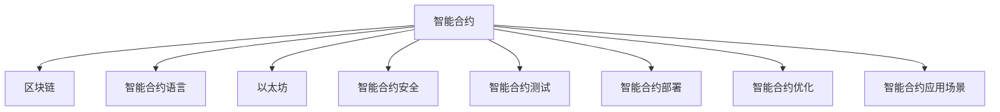

                 

# 【LangChain编程：从入门到实践】RunnableBranch

> 关键词：LangChain, 智能合约, 区块链, 智能合约编程, Solidity, 智能合约安全, 智能合约测试, 智能合约部署, 智能合约优化, 智能合约应用场景, 区块链应用

## 1. 背景介绍

### 1.1 问题由来

随着区块链技术的发展，智能合约（Smart Contracts）逐渐成为数字资产管理和自动化业务的关键组件。智能合约可以自动执行业务规则，保障交易的安全和透明度，实现业务自动化和去中心化。然而，智能合约编程的复杂性也随着其应用场景的扩大而增加。

本系列文章旨在帮助读者从入门到实践，逐步掌握智能合约的编程技巧。通过本系列文章，读者将了解智能合约的基本概念，掌握智能合约编程的基础语言Solidity，并能够实际动手编写、测试和部署智能合约。

### 1.2 问题核心关键点

智能合约编程的核心在于理解其基本原理和架构，掌握Solidity编程语言，以及进行高效、安全的智能合约编写和部署。此外，还需要了解区块链基础，了解智能合约安全性和测试方法，从而编写出安全、健壮、高效的智能合约。

智能合约编程需要结合实际应用场景，从金融、供应链管理、智能投票等多个领域寻找具体案例，了解智能合约的应用实践。

## 2. 核心概念与联系

### 2.1 核心概念概述

为更好地理解智能合约编程，本节将介绍几个密切相关的核心概念：

- 智能合约（Smart Contract）：在区块链上自动执行的代码。通过编程逻辑自动执行预设的交易规则，实现业务自动化和去中心化。
- 区块链（Blockchain）：去中心化的分布式账本，通过区块链技术实现数据的安全存储和不可篡改。
- 智能合约语言（Solidity）：以太坊等区块链平台常用的智能合约编程语言，基于ECMAScript语法。
- 以太坊（Ethereum）：目前最流行的智能合约平台，支持智能合约编程，提供了智能合约部署和执行的环境。
- 智能合约安全：智能合约编程中需要注意的安全问题，包括代码审计、重入攻击、溢出攻击等。
- 智能合约测试：智能合约编写完成后，通过自动化测试验证其正确性和健壮性。
- 智能合约部署：将编写的智能合约代码部署到区块链上，使其能够被自动化执行。
- 智能合约优化：通过智能合约编程技巧，提高智能合约的执行效率和资源使用效率。
- 智能合约应用场景：智能合约在不同领域的应用实践，如金融资产管理、供应链管理、智能投票等。

这些核心概念之间的逻辑关系可以通过以下Mermaid流程图来展示：



这个流程图展示了大语言模型的核心概念及其之间的关系：

1. 智能合约通过区块链技术在去中心化的环境中自动执行。
2. 以太坊平台提供了智能合约编程和部署的环境。
3. 智能合约编程语言Solidity是实现智能合约编程的工具。
4. 智能合约安全是编程中需要注意的重要问题。
5. 智能合约测试用于验证智能合约的正确性和健壮性。
6. 智能合约部署将编写好的智能合约代码部署到区块链上。
7. 智能合约优化提高了智能合约的执行效率和资源使用效率。
8. 智能合约应用场景展示了智能合约在不同领域的应用实践。

## 3. 核心算法原理 & 具体操作步骤

### 3.1 算法原理概述

智能合约编程的核心在于通过Solidity语言编写可自动执行的代码。智能合约的编写、部署、执行和测试是智能合约编程的关键步骤。

### 3.2 算法步骤详解

智能合约编程包括以下几个关键步骤：

**Step 1: 理解区块链基础**

- 了解区块链的基本概念和原理，掌握区块链的运作机制。
- 熟悉以太坊平台，了解其智能合约编程的环境和工具。

**Step 2: 学习Solidity编程**

- 学习Solidity语言的基础知识，包括变量、函数、事件、合约、模块等。
- 理解Solidity的ECMAScript语法，掌握Solidity的编程技巧和最佳实践。
- 编写基础的智能合约，如账户管理、资产交易等。

**Step 3: 进行智能合约安全分析**

- 学习智能合约安全的基本知识，了解常见的安全问题。
- 通过代码审计工具和安全分析工具，进行智能合约的安全分析和评估。
- 修复发现的安全漏洞，提高智能合约的安全性。

**Step 4: 进行智能合约测试**

- 编写智能合约测试用例，使用自动化测试工具进行测试。
- 测试智能合约的正确性、健壮性和性能，确保其满足业务需求。
- 持续集成（CI）工具，自动化测试智能合约，确保其持续稳定运行。

**Step 5: 进行智能合约部署**

- 使用以太坊智能合约部署工具，将编写好的智能合约部署到区块链上。
- 验证智能合约的部署结果，确保其正常运行。
- 监控智能合约的运行状态，及时处理异常和故障。

**Step 6: 进行智能合约优化**

- 优化智能合约的代码结构，提高执行效率和资源使用效率。
- 使用智能合约部署工具，对智能合约进行优化和调试。
- 持续改进智能合约的性能，提高用户体验。

### 3.3 算法优缺点

智能合约编程的优势在于其自动化执行的特性，降低了人为错误和操作风险。然而，智能合约编程也存在一定的挑战：

- 智能合约的安全性问题：智能合约的代码漏洞可能导致资产丢失、业务中断等严重后果。
- 智能合约的复杂性：智能合约的编程难度和复杂性较高，需要较高的技术水平。
- 智能合约的测试和部署难度：智能合约的测试和部署需要较高的技术水平和工具支持。

### 3.4 算法应用领域

智能合约编程在金融资产管理、供应链管理、智能投票等多个领域得到了广泛应用，为传统业务带来了新的突破：

- 金融资产管理：智能合约可以实现资产的自动化管理和交易，提高金融系统的安全性和效率。
- 供应链管理：智能合约可以自动化供应链的各个环节，提高供应链的透明度和效率。
- 智能投票：智能合约可以实现透明的投票过程，提高投票的公平性和公正性。
- 游戏和赌博：智能合约可以实现游戏规则和奖励的自动化执行，提高游戏的趣味性和公平性。

此外，智能合约在版权保护、房地产交易、电子投票等领域也有广泛的应用前景，展示了其强大的应用潜力。

## 4. 数学模型和公式 & 详细讲解 & 举例说明

### 4.1 数学模型构建

本节将使用数学语言对智能合约编程的整个过程进行更加严格的刻画。

假设智能合约的输入为 $x$，输出为 $y$，智能合约的计算公式为 $y = f(x)$，其中 $f$ 为智能合约的计算函数。智能合约的执行结果依赖于输入 $x$ 和智能合约的计算函数 $f$。

### 4.2 公式推导过程

假设智能合约的输入为账户余额 $x$，输出为账户余额转移后的新余额 $y$。智能合约的计算函数为：

$$
y = x - amount
$$

其中 $amount$ 为需要转移的金额。

在Solidity中，智能合约的代码实现为：

```solidity
pragma solidity ^0.8.0;

contract AccountManagement {
    address public owner;
    uint public balance;

    constructor() public {
        owner = msg.sender;
        balance = 0;
    }

    function withdraw(uint amount) public {
        require(msg.sender == owner, "Only the owner can withdraw.");
        require(balance >= amount, "Insufficient balance.");
        balance -= amount;
    }
}
```

### 4.3 案例分析与讲解

在上述智能合约代码中，构造函数和 `withdraw` 函数实现了账户余额的转移功能。构造函数初始化账户的拥有者和初始余额，`withdraw` 函数实现了账户余额的减少。智能合约的执行过程如下：

1. 用户调用 `withdraw` 函数，传递需要转移的金额。
2. 智能合约检查用户的身份和余额，确保操作合法。
3. 智能合约执行余额转移操作，减少用户余额，并将结果输出到区块链上。

通过这个简单的例子，可以看出智能合约的执行过程和计算函数的基本原理。

## 5. 项目实践：代码实例和详细解释说明

### 5.1 开发环境搭建

在进行智能合约编程实践前，我们需要准备好开发环境。以下是使用Solidity进行智能合约开发的环境配置流程：

1. 安装Solidity编译器：从官网下载并安装Solidity编译器，如Remix IDE或Truffle Suite等。
2. 安装以太坊测试网：从官网下载并安装以太坊测试网，如Geth或Ganache等。
3. 安装Git版本控制工具：如Git，用于管理智能合约代码的版本控制。
4. 安装IDE或编辑器：如VS Code或Atom等，用于编写和调试智能合约代码。

完成上述步骤后，即可在测试网中启动智能合约的开发和测试。

### 5.2 源代码详细实现

下面我们以以太坊上的账户余额转移智能合约为例，给出Solidity语言的实现代码。

```solidity
pragma solidity ^0.8.0;

contract AccountManagement {
    address public owner;
    uint public balance;

    constructor() public {
        owner = msg.sender;
        balance = 0;
    }

    function withdraw(uint amount) public {
        require(msg.sender == owner, "Only the owner can withdraw.");
        require(balance >= amount, "Insufficient balance.");
        balance -= amount;
    }

    function transfer(address _to, uint _value) public {
        require(msg.sender != owner, "Only the owner can transfer.");
        require(balance >= _value, "Insufficient balance.");
        owner = _to;
        balance -= _value;
    }
}
```

在上述代码中，构造函数初始化了账户的拥有者和初始余额，`withdraw` 函数实现了账户余额的减少，`transfer` 函数实现了账户余额的转移。这些函数共同构成了智能合约的基本功能。

### 5.3 代码解读与分析

让我们再详细解读一下关键代码的实现细节：

**AccountManagement合约**：
- `constructor` 方法：构造函数，初始化账户的拥有者和初始余额。
- `withdraw` 方法：用户调用该方法，传递需要转移的金额。
- `transfer` 方法：账户余额的转移方法，将余额从当前账户转移到指定的新账户。

**require语句**：
- `require(msg.sender == owner, "Only the owner can withdraw.")`：判断用户是否为账户拥有者，如果不是则抛出异常。
- `require(balance >= _value, "Insufficient balance.")`：判断账户余额是否足够，如果不足则抛出异常。

**函数参数**：
- `address _to`：目标账户地址。
- `uint _value`：需要转移的金额。

在智能合约中，函数的参数类型可以包括整数、字符串、数组等，不同的参数类型对应不同的数据类型。

## 6. 实际应用场景

### 6.1 智能合约在金融资产管理中的应用

在金融资产管理中，智能合约可以实现资产的自动化管理和交易，提高金融系统的安全性和效率。例如，智能合约可以用于自动执行贷款合同，当满足合同条件时，自动进行贷款发放和还款。智能合约可以自动记录贷款余额、还款计划、利息等数据，确保数据的透明和不可篡改。

在智能合约中，可以设计多个函数来实现贷款合同的自动化执行，如贷款发放、还款、违约处理等。智能合约可以根据贷款合同的条件自动执行相应的操作，无需人工干预。

### 6.2 智能合约在供应链管理中的应用

在供应链管理中，智能合约可以自动化供应链的各个环节，提高供应链的透明度和效率。例如，智能合约可以用于自动化供应链的物流跟踪、库存管理、采购订单等。智能合约可以自动记录供应链的数据，确保数据的一致性和透明性。

在智能合约中，可以设计多个函数来实现供应链管理的自动化执行，如物流跟踪、库存管理、采购订单等。智能合约可以根据供应链的业务规则自动执行相应的操作，确保供应链的顺畅运行。

### 6.3 智能合约在智能投票中的应用

在智能投票中，智能合约可以实现透明的投票过程，提高投票的公平性和公正性。例如，智能合约可以用于自动化投票过程，确保投票结果的透明和不可篡改。智能合约可以自动记录投票的数据，确保投票的公正性和公平性。

在智能合约中，可以设计多个函数来实现智能投票的自动化执行，如投票规则、投票结果计算、投票结果公布等。智能合约可以根据投票规则自动执行相应的操作，确保投票过程的公正性和透明性。

### 6.4 未来应用展望

随着区块链技术的发展，智能合约在各个领域的应用前景将更加广阔。未来，智能合约将在以下领域得到更广泛的应用：

- 金融资产管理：智能合约可以实现资产的自动化管理和交易，提高金融系统的安全性和效率。
- 供应链管理：智能合约可以自动化供应链的各个环节，提高供应链的透明度和效率。
- 智能投票：智能合约可以实现透明的投票过程，提高投票的公平性和公正性。
- 游戏和赌博：智能合约可以实现游戏规则和奖励的自动化执行，提高游戏的趣味性和公平性。
- 版权保护：智能合约可以用于自动化版权保护，确保版权的归属和使用。
- 房地产交易：智能合约可以用于自动化房地产交易，提高交易的透明度和效率。
- 电子投票：智能合约可以实现电子投票，确保投票过程的公正性和透明性。

此外，智能合约在教育、医疗、物流等多个领域也有广泛的应用前景，展示了其强大的应用潜力。

## 7. 工具和资源推荐

### 7.1 学习资源推荐

为了帮助开发者系统掌握智能合约编程的理论基础和实践技巧，这里推荐一些优质的学习资源：

1. Solidity官方文档：Solidity语言的官方文档，详细介绍了Solidity语言的基础知识和编程技巧。
2. Solidity权威指南：Solidity语言的权威指南，详细讲解了Solidity语言的使用方法和最佳实践。
3. Ethereum官方文档：Ethereum平台的官方文档，详细介绍了智能合约的部署和执行方法。
4. Solidity Security Best Practices：Solidity语言的安全指南，详细介绍了智能合约的安全编程技巧和最佳实践。
5. Remix IDE：基于Web的Solidity编译器，提供了实时的代码编译和调试功能。
6. Truffle Suite：基于Ethereum的智能合约开发工具，提供了完善的开发环境和测试工具。

通过对这些资源的学习实践，相信你一定能够快速掌握智能合约编程的精髓，并用于解决实际的区块链问题。

### 7.2 开发工具推荐

高效的开发离不开优秀的工具支持。以下是几款用于智能合约开发的常用工具：

1. Solidity编译器：用于编译Solidity代码，生成字节码和虚拟机代码。
2. Ethereum测试网：用于测试智能合约的运行环境和部署工具。
3. IDE或编辑器：如VS Code或Atom等，用于编写和调试智能合约代码。
4. Solidity审计工具：如MythX、Certik等，用于智能合约的安全分析和评估。
5. 智能合约测试工具：如Truffle、Ganache等，用于智能合约的自动化测试。
6. 智能合约部署工具：如MythX、Infura等，用于智能合约的部署和管理。

合理利用这些工具，可以显著提升智能合约编程的开发效率，加快创新迭代的步伐。

### 7.3 相关论文推荐

智能合约编程的研究源于学界的持续研究。以下是几篇奠基性的相关论文，推荐阅读：

1. Ethereum Whitepaper：Ethereum平台的原始白皮书，详细介绍了区块链和智能合约的基本概念和原理。
2. Smart Contracts: Secure, Optimal and Scalable Contracts for Blockchains：智能合约的研究综述论文，总结了智能合约的各类实现和优化方法。
3. Solidity Security Best Practices：Solidity语言的安全指南，详细介绍了智能合约的安全编程技巧和最佳实践。
4. Smart Contract Verification: A Survey：智能合约验证的研究综述论文，总结了智能合约验证的各类方法和工具。
5. The Good, Bad and the Ugly of Smart Contracts：智能合约的优缺点分析论文，探讨了智能合约的各类应用场景和挑战。

这些论文代表了大语言模型微调技术的发展脉络。通过学习这些前沿成果，可以帮助研究者把握学科前进方向，激发更多的创新灵感。

## 8. 总结：未来发展趋势与挑战

### 8.1 总结

本文对智能合约编程的基本概念和实践进行了全面系统的介绍。首先阐述了智能合约的基本原理和应用场景，明确了智能合约编程的重要性和发展方向。其次，从原理到实践，详细讲解了智能合约编程的数学模型和核心算法，给出了智能合约编程的完整代码实例。同时，本文还广泛探讨了智能合约编程在金融资产管理、供应链管理、智能投票等多个领域的应用前景，展示了智能合约编程的强大应用潜力。此外，本文精选了智能合约编程的学习资源，力求为读者提供全方位的技术指引。

通过本文的系统梳理，可以看出智能合约编程在区块链技术中的重要地位和广泛应用。智能合约编程为区块链应用提供了新的技术路径，将极大地推动区块链技术的产业化进程。未来，伴随区块链技术的发展，智能合约编程必将在更多领域得到应用，为区块链技术带来新的突破。

### 8.2 未来发展趋势

展望未来，智能合约编程的发展趋势如下：

1. 智能合约的自动化程度将不断提高。未来，智能合约将更加自动化、智能化，能够自动执行更复杂、更灵活的业务逻辑。
2. 智能合约的安全性将不断提升。智能合约的安全性将得到更多的关注和研究，防止智能合约的漏洞和攻击。
3. 智能合约的编程语言将更加丰富。未来，将会有更多的智能合约编程语言被引入，以满足不同业务场景的需求。
4. 智能合约的应用场景将更加广泛。智能合约将在金融、供应链、智能投票、版权保护等领域得到更广泛的应用，展示其强大的应用潜力。
5. 智能合约的优化将更加高效。智能合约的优化技术将不断进步，提高智能合约的执行效率和资源使用效率。

以上趋势凸显了智能合约编程的发展方向和潜力。这些方向的探索发展，必将进一步提升智能合约的性能和应用范围，为区块链技术带来新的突破。

### 8.3 面临的挑战

尽管智能合约编程已经取得了一定的成就，但在迈向更加智能化、普适化应用的过程中，它仍面临着诸多挑战：

1. 智能合约的安全性问题：智能合约的代码漏洞可能导致资产丢失、业务中断等严重后果。
2. 智能合约的编程难度和复杂性：智能合约的编程难度和复杂性较高，需要较高的技术水平。
3. 智能合约的测试和部署难度：智能合约的测试和部署需要较高的技术水平和工具支持。
4. 智能合约的性能和资源使用效率：智能合约的执行效率和资源使用效率需要进一步提升。
5. 智能合约的可扩展性和可维护性：智能合约的可扩展性和可维护性需要进一步改进，以适应未来业务的发展。

### 8.4 研究展望

面对智能合约编程所面临的挑战，未来的研究需要在以下几个方面寻求新的突破：

1. 探索无监督和半监督智能合约编程方法。摆脱对大规模标注数据的依赖，利用自监督学习、主动学习等无监督和半监督范式，最大限度利用非结构化数据，实现更加灵活高效的智能合约编程。
2. 研究智能合约编程语言和安全工具。开发更加灵活、安全的智能合约编程语言和安全分析工具，提高智能合约编程的安全性和可维护性。
3. 引入更多先验知识。将符号化的先验知识，如知识图谱、逻辑规则等，与智能合约编程语言进行巧妙融合，引导智能合约编程过程学习更准确、合理的智能合约。
4. 结合因果分析和博弈论工具。将因果分析方法引入智能合约编程，识别出智能合约编程决策的关键特征，增强智能合约编程输出解释的因果性和逻辑性。
5. 纳入伦理道德约束。在智能合约编程目标中引入伦理导向的评估指标，过滤和惩罚有偏见、有害的输出倾向，确保智能合约编程的伦理性和道德性。

这些研究方向将为智能合约编程提供新的突破，进一步提升智能合约的性能和应用范围，为区块链技术带来新的突破。只有勇于创新、敢于突破，才能不断拓展智能合约编程的边界，让智能合约编程更好地造福人类社会。

## 9. 附录：常见问题与解答

**Q1：智能合约编程是否适用于所有区块链平台？**

A: 智能合约编程可以适用于大多数支持智能合约编程的区块链平台，如Ethereum、Binance Smart Chain、Tron等。不同平台的智能合约编程语言和开发环境有所不同，但基本原理和实现方法类似。

**Q2：智能合约编程的学习门槛高吗？**

A: 智能合约编程的学习门槛相对较高，需要掌握Solidity语言和区块链基础。初学者可以从Solidity语言的基础知识入手，逐步掌握智能合约编程的各个环节，如部署、测试、优化等。

**Q3：智能合约编程的效率如何？**

A: 智能合约编程的效率相对较低，特别是在合约的部署和测试环节。为了提高效率，可以使用自动化测试工具和优化工具，如Truffle、MythX等。

**Q4：智能合约编程的安全性如何保障？**

A: 智能合约编程的安全性是编程中需要注意的重要问题。可以通过代码审计工具和安全分析工具，进行智能合约的安全分析和评估。同时，遵循智能合约编程的最佳实践和安全指南，可以有效提高智能合约的安全性。

**Q5：智能合约编程的部署难度大吗？**

A: 智能合约编程的部署难度较大，特别是在部署到主网之前需要进行充分的测试和验证。可以使用测试网进行测试和验证，确保智能合约的稳定性和安全性。

通过本文的系统梳理，可以看出智能合约编程在区块链技术中的重要地位和广泛应用。智能合约编程为区块链应用提供了新的技术路径，将极大地推动区块链技术的产业化进程。未来，伴随区块链技术的发展，智能合约编程必将在更多领域得到应用，为区块链技术带来新的突破。

