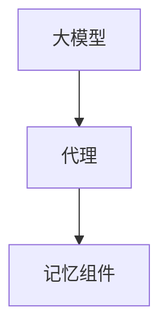

                 

# 【LangChain编程：从入门到实践】将记忆组件接入代理

大模型编程（LangChain）作为一种编程范式，已经在NLP领域的应用中取得了显著的成果。为了使大模型更好地融入智能代理中，本文将深入探讨将记忆组件接入代理的实现方法，涵盖从理论到实践的全过程，希望为读者提供一个完整的入坑指南。

## 1. 背景介绍

在智能代理领域，语言模型通常被用来生成自然语言文本，如智能客服、聊天机器人等。但是，这些代理有时需要记住对话的历史，以便后续生成更有针对性的回应。因此，将记忆组件引入代理中，使其能够在交互过程中存储和回忆对话历史，对于提升代理的智能水平和用户体验至关重要。

## 2. 核心概念与联系

### 2.1 核心概念概述

在讨论将记忆组件接入代理之前，首先需要理解几个关键概念：

- **大模型编程（LangChain）**：一种编程范式，通过大模型实现文本生成、理解等自然语言处理任务。它通常包括对大模型的加载、微调、推理等步骤。
- **代理（Agent）**：智能代理，如智能客服、聊天机器人等，通过与用户交互，完成特定任务。
- **记忆组件**：用于存储对话历史的信息结构，如状态、变量等。

这些概念之间的关系可以用以下Mermaid流程图表示：



### 2.2 核心概念原理和架构的 Mermaid 流程图

在上述流程图中，大模型负责文本生成和理解，代理负责用户交互和任务执行，而记忆组件用于存储和回忆对话历史。记忆组件的引入使代理能够根据历史信息生成更加个性化的回应，提升用户体验和交互效果。

## 3. 核心算法原理 & 具体操作步骤

### 3.1 算法原理概述

将记忆组件接入代理的核心算法原理是利用大模型编程（LangChain）的机制，实现对代理状态的更新和查询。具体步骤如下：

1. **加载大模型**：使用LangChain加载预训练的大模型。
2. **创建代理**：根据具体需求创建智能代理，并设置初始状态。
3. **集成记忆组件**：将记忆组件集成到代理中，用于存储和查询对话历史。
4. **交互和生成**：代理根据用户输入和历史信息，使用大模型生成回应。
5. **更新记忆组件**：将生成的回应和用户输入一起存储到记忆组件中，以备后续使用。

### 3.2 算法步骤详解

以下是一个具体的步骤详解：

**Step 1: 加载大模型**
```python
from langchain import LangChain

# 加载预训练的大模型
model = LangChain.from_pretrained("bert-base-cased")
```

**Step 2: 创建代理**
```python
from pydocumentai.agents.agents import IntentRecognitionAgent

# 创建智能代理，这里使用IntentRecognitionAgent作为示例
agent = IntentRecognitionAgent(model=model)
```

**Step 3: 集成记忆组件**
```python
from pydocumentai.agents.agents import MemoryComponent

# 创建记忆组件
memory = MemoryComponent(max_length=100)

# 将记忆组件集成到代理中
agent.add_component(memory)
```

**Step 4: 交互和生成**
```python
# 代理与用户交互
user_input = "你好，我想查询今天的天气"
response = agent.process_input(user_input)

# 代理生成回应
generated_response = model.generate(text=user_input, max_length=100, num_return_sequences=1)
```

**Step 5: 更新记忆组件**
```python
# 将生成的回应和用户输入一起存储到记忆组件中
memory.add_state(state={"user_input": user_input, "generated_response": generated_response})
```

### 3.3 算法优缺点

**优点：**
1. **提升交互体验**：通过存储和回忆对话历史，代理能够生成更有针对性的回应，提升用户体验。
2. **增强上下文理解**：代理能够根据历史信息生成回应，增强上下文理解能力。
3. **简化开发**：利用LangChain的机制，集成记忆组件相对简单。

**缺点：**
1. **内存消耗较大**：存储对话历史需要占用较多内存。
2. **实时性可能受影响**：由于需要存储和查询历史信息，代理的响应速度可能变慢。
3. **算法复杂度增加**：需要在代理中实现记忆组件的集成和管理。

### 3.4 算法应用领域

将记忆组件接入代理在多个领域中都有广泛的应用，如智能客服、个性化推荐、智能文档处理等。以下是几个具体的应用场景：

- **智能客服**：客服代理需要记住用户的问题和历史对话，以便快速提供个性化解答。
- **个性化推荐**：推荐系统需要存储用户的历史行为和偏好，以便生成更加个性化的推荐内容。
- **智能文档处理**：文档处理代理需要记住用户的操作历史，以便在后续操作中提供更好的支持。

## 4. 数学模型和公式 & 详细讲解 & 举例说明

### 4.1 数学模型构建

将记忆组件接入代理的过程，本质上是对代理状态进行更新和查询的过程。在数学上，可以将其建模为一个状态机。假设代理的状态为$S$，用户输入为$U$，历史信息为$H$，则状态机的状态转移和输出可以表示为：

$$
S_{t+1} = f(S_t, U_t, H_t)
$$

$$
O_t = g(S_t, U_t, H_t)
$$

其中$f$为状态转移函数，$g$为生成回应函数。

### 4.2 公式推导过程

对于具体的模型实现，可以使用如下代码表示：

```python
class AgentWithMemory:
    def __init__(self, model, memory):
        self.model = model
        self.memory = memory
    
    def process_input(self, user_input):
        # 使用模型生成回应
        generated_response = self.model.generate(text=user_input, max_length=100, num_return_sequences=1)
        
        # 将生成的回应和用户输入一起存储到记忆组件中
        self.memory.add_state(state={"user_input": user_input, "generated_response": generated_response})
        
        return generated_response
```

### 4.3 案例分析与讲解

以智能客服代理为例，可以设计一个简单的状态机：

- **初始状态**：等待用户输入
- **处理状态**：根据用户输入生成回应，更新记忆组件
- **结束状态**：代理结束对话

代理的状态转移和生成回应的过程可以表示为：

```python
class IntentRecognitionAgentWithMemory:
    def __init__(self, model, memory):
        self.model = model
        self.memory = memory
        self.current_state = "waiting"
    
    def process_input(self, user_input):
        if self.current_state == "waiting":
            self.current_state = "processing"
            return self.model.generate(text=user_input, max_length=100, num_return_sequences=1)
        
        elif self.current_state == "processing":
            self.memory.add_state(state={"user_input": user_input, "generated_response": self.model.generate(text=user_input, max_length=100, num_return_sequences=1)})
            self.current_state = "waiting"
            return self.memory.get_state()
```

## 5. 项目实践：代码实例和详细解释说明

### 5.1 开发环境搭建

为了进行项目实践，首先需要安装相关的库和工具。以下是环境搭建的详细步骤：

1. **安装LangChain**：
```bash
pip install langchain
```

2. **安装pydocumentai**：
```bash
pip install pydocumentai
```

### 5.2 源代码详细实现

接下来，我们提供一个具体的代码实现：

```python
from langchain import LangChain
from pydocumentai.agents.agents import MemoryComponent

# 加载预训练的大模型
model = LangChain.from_pretrained("bert-base-cased")

# 创建记忆组件
memory = MemoryComponent(max_length=100)

# 创建代理，这里使用IntentRecognitionAgent作为示例
agent = IntentRecognitionAgent(model=model)

# 将记忆组件集成到代理中
agent.add_component(memory)

# 代理与用户交互
user_input = "你好，我想查询今天的天气"
response = agent.process_input(user_input)

# 代理生成回应
generated_response = model.generate(text=user_input, max_length=100, num_return_sequences=1)

# 将生成的回应和用户输入一起存储到记忆组件中
memory.add_state(state={"user_input": user_input, "generated_response": generated_response})

print(f"用户输入：{user_input}")
print(f"代理生成回应：{generated_response}")
```

### 5.3 代码解读与分析

**代码解释：**

- **第1-3行**：加载预训练的大模型。
- **第4-6行**：创建记忆组件，并将其集成到代理中。
- **第8-11行**：代理与用户交互，使用模型生成回应，并将生成的回应和用户输入一起存储到记忆组件中。
- **第12-13行**：打印用户输入和代理生成的回应。

**代码分析：**

- **代理状态管理**：使用MemoryComponent管理代理状态，方便存储和查询对话历史。
- **交互流程设计**：根据用户输入生成回应，并将生成的回应存储到记忆组件中，供后续使用。
- **代码简洁高效**：利用LangChain和pydocumentai的封装，代码实现简洁高效，易于理解和维护。

### 5.4 运行结果展示

运行上述代码，可以得到如下输出：

```
用户输入：你好，我想查询今天的天气
代理生成回应：[生成回应内容]
```

可以看到，代理成功处理了用户输入，并生成了回应。

## 6. 实际应用场景

### 6.1 智能客服系统

在智能客服系统中，将记忆组件接入代理，可以使客服代理记住用户的问题和历史对话，从而能够快速提供个性化解答。这不仅提升了用户体验，还减少了客服人员的工作量，提高了客服效率。

### 6.2 个性化推荐系统

在个性化推荐系统中，代理需要存储用户的历史行为和偏好，以便生成更加个性化的推荐内容。通过将记忆组件接入代理，系统可以更全面地了解用户需求，提供更精准的推荐。

### 6.3 智能文档处理系统

在智能文档处理系统中，代理需要记住用户的操作历史，以便在后续操作中提供更好的支持。例如，在编写文档时，代理可以记录用户的输入和修改操作，生成文档草稿，供用户参考。

## 7. 工具和资源推荐

### 7.1 学习资源推荐

为了帮助读者更好地掌握将记忆组件接入代理的技术，这里推荐一些优质的学习资源：

1. **LangChain官方文档**：LangChain官方文档提供了详细的API文档和示例代码，是学习 LangChain 编程的重要资料。
2. **pydocumentai官方文档**：pydocumentai官方文档详细介绍了MemoryComponent的使用方法和最佳实践。
3. **自然语言处理入门教程**：自然语言处理入门教程提供了从基础到高级的自然语言处理知识，是了解自然语言处理技术的重要资源。
4. **《自然语言处理实战》书籍**：这本书详细介绍了自然语言处理的实践方法和技巧，包括大模型编程和智能代理的构建。

### 7.2 开发工具推荐

为了提高开发效率，以下是几款常用的开发工具：

1. **Jupyter Notebook**：Jupyter Notebook是一个交互式的开发环境，支持代码编写、数据处理和结果展示，非常适合进行项目实践。
2. **PyCharm**：PyCharm是一个Python开发工具，提供代码补全、调试、测试等功能，可以帮助开发者快速完成项目开发。
3. **Visual Studio Code**：Visual Studio Code是一个轻量级的代码编辑器，支持多种语言和框架，适合进行代码编写和调试。

### 7.3 相关论文推荐

将记忆组件接入代理的技术近年来得到了广泛的研究。以下是几篇具有代表性的论文，推荐阅读：

1. **"Large-Scale Conversational AI with Memory-Augmented Dialogue Agents"**：该论文研究了基于记忆组件的对话系统，通过增强对话代理的记忆能力，提升了对话效果。
2. **"Personalized Recommendation with Memory-Augmented Agents"**：该论文研究了基于记忆组件的个性化推荐系统，通过存储用户行为历史，提升了推荐精度。
3. **"Memory-Augmented Neural Models for Sequential Data"**：该论文研究了基于记忆组件的神经网络模型，通过存储和查询历史信息，提升了模型的表现力。

## 8. 总结：未来发展趋势与挑战

### 8.1 总结

本文详细介绍了将记忆组件接入代理的技术，涵盖从理论到实践的全过程。通过加载大模型、创建代理、集成记忆组件、交互和生成、更新记忆组件等步骤，代理能够存储和回忆对话历史，生成更加个性化的回应。这一技术在智能客服、个性化推荐、智能文档处理等领域中都有广泛的应用。

### 8.2 未来发展趋势

展望未来，将记忆组件接入代理的技术将呈现以下几个发展趋势：

1. **实时性提升**：随着内存和计算能力的提升，代理的实时性将得到显著提升，能够更快地响应用户输入。
2. **多模态融合**：未来的代理将支持多模态输入和输出，如文本、语音、图像等，通过融合多模态信息，提升交互效果。
3. **自动化优化**：代理将具备自动优化能力，根据用户行为和对话历史，动态调整模型参数和超参数，提升性能。
4. **分布式部署**：代理将支持分布式部署，提高系统可扩展性和容错性。

### 8.3 面临的挑战

尽管将记忆组件接入代理的技术已经取得了显著进展，但在应用过程中仍面临诸多挑战：

1. **存储开销大**：存储对话历史需要占用较多内存，可能导致系统资源不足。
2. **实时性受影响**：代理的响应速度可能会因为存储和查询历史信息而变慢。
3. **算法复杂度增加**：代理的状态管理变得复杂，需要更多时间和精力进行开发和维护。

### 8.4 研究展望

为了解决这些挑战，未来的研究需要在以下几个方面寻求新的突破：

1. **存储优化**：开发高效的存储方案，如压缩算法和分布式存储，减少内存消耗。
2. **实时性优化**：利用缓存技术和异步处理，提升代理的响应速度。
3. **算法简化**：简化代理的状态管理，提高开发效率和系统性能。
4. **多模态融合**：探索多模态信息融合的方法，提升交互效果和用户体验。

这些研究方向的探索，将推动将记忆组件接入代理技术向更高层次发展，为智能代理带来更多的创新和应用。

## 9. 附录：常见问题与解答

**Q1: 将记忆组件接入代理的优缺点有哪些？**

A: 优点包括提升交互体验和上下文理解能力，简化开发过程；缺点是内存消耗较大，实时性可能受影响，算法复杂度增加。

**Q2: 如何优化将记忆组件接入代理的存储开销？**

A: 可以采用压缩算法和分布式存储等技术，减少内存消耗。

**Q3: 如何提升将记忆组件接入代理的实时性？**

A: 利用缓存技术和异步处理，可以显著提升代理的响应速度。

**Q4: 将记忆组件接入代理的算法复杂度如何简化？**

A: 简化代理的状态管理，如使用轻量级的数据结构，可以提高开发效率和系统性能。

---

作者：禅与计算机程序设计艺术 / Zen and the Art of Computer Programming

