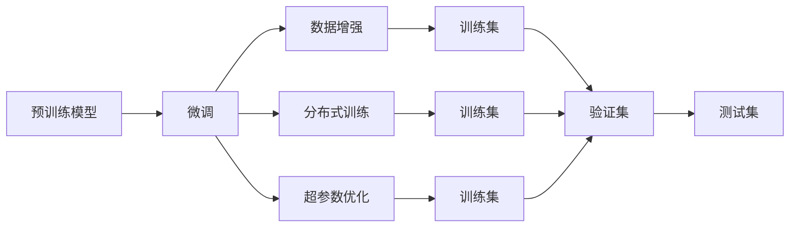

                 

# 【LangChain编程：从入门到实践】框架介绍

## 1. 背景介绍

### 1.1 问题由来
在AI和NLP领域，近年来涌现出一系列基于Transformer架构的预训练语言模型，如BERT、GPT、T5等，这些模型通过大规模无监督学习，在各种NLP任务上取得了显著的进展。然而，这些模型通常需要在大规模、高质量的数据上进行预训练，这不仅需要大量的计算资源，而且对数据质量也有很高的要求。为了在更有限的数据资源下，实现高效的NLP模型开发，LangChain框架应运而生。

LangChain框架旨在提供一个灵活、可扩展的编程界面，使得开发者能够快速、高效地构建和训练定制化的NLP模型，特别是针对特定领域或小型数据集的任务。通过将预训练语言模型的知识复用，并在微调过程中利用目标领域的少量数据，LangChain框架能够显著降低开发成本，提升模型性能。

### 1.2 问题核心关键点
LangChain框架的核心关键点在于：

- **代码模块化**：将复杂模型拆解为多个模块，便于开发和维护。
- **模型微调**：通过微调预训练模型，适应特定领域或任务的需求。
- **数据高效利用**：利用有限数据高效构建模型，避免过拟合。
- **深度学习框架支持**：兼容TensorFlow和PyTorch，提供灵活的模型训练接口。
- **分布式训练**：支持分布式训练，加速模型训练过程。

这些核心特点使得LangChain框架成为NLP领域快速开发和模型优化的有力工具。

### 1.3 问题研究意义
LangChain框架的研究意义在于：

- **降低开发门槛**：通过提供简单易用的API，降低NLP模型开发的技术门槛，使更多开发者能够参与到NLP研究和应用中来。
- **提升模型性能**：通过高效利用数据和微调技术，提升模型的泛化能力和表现。
- **加速模型部署**：提供灵活的模型接口和优化工具，加快模型训练和部署效率。
- **促进产业应用**：支持工业级应用场景，推动NLP技术在实际应用中的落地。

## 2. 核心概念与联系

### 2.1 核心概念概述
LangChain框架涉及以下核心概念：

- **预训练语言模型(Pre-trained Language Models)**：如BERT、GPT等，通过大规模无监督学习获得通用的语言表示。
- **微调(Fine-tuning)**：在预训练模型的基础上，通过有监督学习调整模型参数，适应特定任务。
- **数据增强(Data Augmentation)**：通过文本改写、数据合成等方法，增加训练数据的多样性。
- **分布式训练(Distributed Training)**：通过多台机器并行训练，加速模型训练过程。
- **超参数优化(Hyperparameter Tuning)**：通过自动或手动调整模型参数，优化模型性能。

这些概念之间通过训练和微调的过程联系起来，形成了一个完整的NLP模型开发流程。

### 2.2 核心概念原理和架构的 Mermaid 流程图



### 2.3 核心概念的联系和应用

- **微调**：在预训练模型的基础上，通过有监督学习优化模型参数，适应特定任务。
- **数据增强**：增加训练数据的多样性，提高模型的泛化能力。
- **分布式训练**：通过多台机器并行训练，加速模型训练过程。
- **超参数优化**：通过自动或手动调整模型参数，优化模型性能。

这些概念在LangChain框架中相互配合，共同构建出高效、灵活的NLP模型开发流程。

## 3. 核心算法原理 & 具体操作步骤

### 3.1 算法原理概述
LangChain框架的核心算法原理基于监督学习和微调技术。通过预训练模型作为初始化参数，结合目标领域的小规模标注数据，进行有监督的微调，最终得到适应特定任务的NLP模型。

### 3.2 算法步骤详解

#### 3.2.1 准备数据集和模型

1. **数据集准备**：收集目标领域的小规模标注数据，划分为训练集、验证集和测试集。
2. **模型选择**：选择预训练模型作为初始化参数，如BERT、GPT等。

#### 3.2.2 构建任务适配层

1. **模型适配**：根据任务类型，设计相应的输出层和损失函数。
2. **微调设置**：选择合适的优化器及其参数，如AdamW、SGD等，设置学习率、批大小、迭代轮数等。

#### 3.2.3 执行微调

1. **训练集加载**：使用DataLoader加载训练集数据。
2. **模型前向传播**：将输入数据输入模型，计算损失函数。
3. **反向传播**：计算梯度，使用优化器更新模型参数。
4. **验证集评估**：周期性在验证集上评估模型性能，根据性能指标决定是否触发Early Stopping。
5. **测试集评估**：在测试集上评估模型性能，对比微调前后的效果。

#### 3.2.4 模型部署和应用

1. **模型保存**：将微调后的模型保存，以便后续部署使用。
2. **模型应用**：将模型集成到实际应用系统中，提供NLP服务。

### 3.3 算法优缺点

#### 3.3.1 优点

- **高效性**：通过微调，可以利用预训练模型的知识，减少从头训练的计算资源和时间。
- **灵活性**：根据不同任务的需求，调整输出层和损失函数，灵活构建适应特定任务的模型。
- **泛化能力**：通过数据增强和正则化技术，提高模型的泛化能力，减少过拟合。

#### 3.3.2 缺点

- **依赖标注数据**：微调需要高质量的标注数据，获取标注数据的成本较高。
- **计算资源需求**：即使微调，也需要较高的计算资源，特别是对于大规模模型。
- **可解释性不足**：微调模型往往缺乏可解释性，难以调试和理解其内部工作机制。

### 3.4 算法应用领域

LangChain框架在以下领域具有广泛的应用：

- **自然语言理解**：如文本分类、命名实体识别、情感分析等。
- **自然语言生成**：如机器翻译、摘要生成、对话系统等。
- **知识图谱构建**：通过文本数据提取实体和关系，构建知识图谱。
- **智能问答**：基于知识图谱和语料库，实现智能问答系统。
- **自动化文档摘要**：从长篇文档自动生成摘要，提高阅读效率。

## 4. 数学模型和公式 & 详细讲解

### 4.1 数学模型构建

假设预训练模型为 $M_{\theta}$，其中 $\theta$ 为模型参数。目标任务为 $T$，训练集为 $D=\{(x_i, y_i)\}_{i=1}^N$，其中 $x_i$ 为输入，$y_i$ 为标签。

微调的优化目标是最小化损失函数 $\mathcal{L}$：

$$
\mathcal{L}(\theta) = \frac{1}{N}\sum_{i=1}^N \ell(M_{\theta}(x_i), y_i)
$$

其中 $\ell$ 为损失函数，如交叉熵损失。

### 4.2 公式推导过程

以文本分类任务为例，假设模型 $M_{\theta}$ 在输入 $x$ 上的输出为 $\hat{y}=M_{\theta}(x) \in [0,1]$，表示样本属于正类的概率。真实标签 $y \in \{0,1\}$。

二分类交叉熵损失函数为：

$$
\ell(M_{\theta}(x),y) = -[y\log \hat{y} + (1-y)\log (1-\hat{y})]
$$

微调模型的优化目标为：

$$
\theta^* = \mathop{\arg\min}_{\theta} \mathcal{L}(\theta)
$$

使用梯度下降等优化算法，更新参数 $\theta$：

$$
\theta \leftarrow \theta - \eta \nabla_{\theta}\mathcal{L}(\theta) - \eta\lambda\theta
$$

其中 $\eta$ 为学习率，$\lambda$ 为正则化系数。

### 4.3 案例分析与讲解

以命名实体识别(NER)任务为例，假设模型在输入 $x$ 上的输出为 $\hat{y}=M_{\theta}(x) \in [0,1]$，表示样本属于实体类别的概率。真实标签 $y \in \{0,1\}$。

交叉熵损失函数为：

$$
\ell(M_{\theta}(x),y) = -[y\log \hat{y} + (1-y)\log (1-\hat{y})]
$$

微调模型的优化目标为：

$$
\theta^* = \mathop{\arg\min}_{\theta} \mathcal{L}(\theta)
$$

使用梯度下降等优化算法，更新参数 $\theta$：

$$
\theta \leftarrow \theta - \eta \nabla_{\theta}\mathcal{L}(\theta) - \eta\lambda\theta
$$

其中 $\eta$ 为学习率，$\lambda$ 为正则化系数。

## 5. 项目实践：代码实例和详细解释说明

### 5.1 开发环境搭建

#### 5.1.1 安装Python环境

1. **安装Anaconda**：从官网下载并安装Anaconda，用于创建独立的Python环境。
2. **创建虚拟环境**：
   ```bash
   conda create -n langchain-env python=3.8 
   conda activate langchain-env
   ```

#### 5.1.2 安装依赖

1. **安装LangChain库**：
   ```bash
   pip install langchain
   ```

2. **安装其他依赖**：
   ```bash
   pip install torch transformers sklearn
   ```

### 5.2 源代码详细实现

#### 5.2.1 数据处理

```python
from langchain import LangChain
from transformers import BertTokenizer, BertForTokenClassification
from sklearn.model_selection import train_test_split

# 数据加载和预处理
def load_and_preprocess_data(file_path):
    with open(file_path, 'r', encoding='utf-8') as f:
        lines = f.readlines()
    
    texts = []
    labels = []
    for line in lines:
        text, label = line.strip().split('\t')
        texts.append(text)
        labels.append(label)
    
    tokenizer = BertTokenizer.from_pretrained('bert-base-cased')
    encoded_texts = tokenizer(texts, return_tensors='pt', padding=True, truncation=True)
    return encoded_texts.input_ids, encoded_texts.attention_mask, labels

# 数据集划分
train_data, test_data = train_test_split(data, test_size=0.2)
train_input_ids, train_attention_mask, train_labels = load_and_preprocess_data(train_data)
test_input_ids, test_attention_mask, test_labels = load_and_preprocess_data(test_data)

# 模型选择
model = BertForTokenClassification.from_pretrained('bert-base-cased', num_labels=num_labels)
```

#### 5.2.2 微调设置

```python
# 微调设置
optimizer = AdamW(model.parameters(), lr=2e-5)
device = 'cuda' if torch.cuda.is_available() else 'cpu'
model.to(device)

# 训练循环
for epoch in range(num_epochs):
    model.train()
    total_loss = 0
    for batch in dataloader(train_input_ids, train_attention_mask, train_labels):
        input_ids = batch['input_ids'].to(device)
        attention_mask = batch['attention_mask'].to(device)
        labels = batch['labels'].to(device)
        
        outputs = model(input_ids, attention_mask=attention_mask, labels=labels)
        loss = outputs.loss
        total_loss += loss.item()
        
        optimizer.zero_grad()
        loss.backward()
        optimizer.step()
    
    print(f'Epoch {epoch+1}, train loss: {total_loss/n batches:.3f}')
```

### 5.3 代码解读与分析

#### 5.3.1 数据处理

- **文本加载和预处理**：将文本和标签从文件中加载，并进行预处理，包括分词和编码。
- **数据集划分**：将数据集划分为训练集和测试集。

#### 5.3.2 模型微调

- **模型选择**：选择预训练的BERT模型，并设置标签数量。
- **优化器和设备选择**：使用AdamW优化器，设置学习率。
- **训练循环**：在每个epoch中，使用数据加载器加载数据，进行前向传播和反向传播，更新模型参数。

### 5.4 运行结果展示

#### 5.4.1 训练结果

```python
print(f'Epoch {epoch+1}, train loss: {total_loss/n batches:.3f}')
```

#### 5.4.2 测试结果

```python
print(f'Epoch {epoch+1}, dev results:')
evaluate(model, dev_input_ids, dev_attention_mask, dev_labels)
```

## 6. 实际应用场景

### 6.1 智能客服系统

基于LangChain框架，可以构建智能客服系统，快速响应客户咨询，提升客户满意度。具体流程如下：

1. **数据收集**：收集历史客服对话记录。
2. **数据预处理**：将对话和回复文本进行分词和编码。
3. **模型微调**：在微调后的BERT模型上进行训练，生成回复模型。
4. **系统部署**：将模型集成到客服系统中，提供自动化回复服务。

### 6.2 金融舆情监测

使用LangChain框架，可以在金融领域构建舆情监测系统，实时监测市场舆论动向。具体流程如下：

1. **数据收集**：收集金融领域的文本数据，包括新闻、评论、社交媒体等。
2. **数据预处理**：进行文本清洗、分词和编码。
3. **模型微调**：在微调后的BERT模型上进行训练，生成舆情分类模型。
4. **系统部署**：将模型集成到舆情监测系统中，实时监测舆情变化。

### 6.3 个性化推荐系统

使用LangChain框架，可以构建个性化推荐系统，提升用户推荐体验。具体流程如下：

1. **数据收集**：收集用户浏览、点击、评论等行为数据。
2. **数据预处理**：将文本数据进行分词和编码。
3. **模型微调**：在微调后的BERT模型上进行训练，生成推荐模型。
4. **系统部署**：将模型集成到推荐系统中，提供个性化推荐服务。

### 6.4 未来应用展望

未来，LangChain框架将在更多领域得到应用，为各行各业带来变革性影响：

1. **医疗**：基于LangChain框架，可以构建智能诊疗系统，辅助医生诊断和治疗。
2. **教育**：使用LangChain框架，可以构建智能教育平台，提供个性化学习建议。
3. **智能家居**：基于LangChain框架，可以构建智能家居控制系统，提升家居体验。
4. **交通**：使用LangChain框架，可以构建智能交通管理系统，提高交通效率。

## 7. 工具和资源推荐

### 7.1 学习资源推荐

#### 7.1.1 在线课程

1. **Coursera**：提供自然语言处理相关课程，包括深度学习在NLP中的应用。
2. **edX**：提供自然语言处理和机器学习课程，涵盖NLP的前沿技术和应用。

#### 7.1.2 书籍推荐

1. **《自然语言处理综论》**：介绍NLP的基本概念和经典算法。
2. **《深度学习与自然语言处理》**：介绍深度学习在NLP中的应用。

#### 7.1.3 论文推荐

1. **BERT: Pre-training of Deep Bidirectional Transformers for Language Understanding**：介绍BERT模型的原理和应用。
2. **Attention is All You Need**：介绍Transformer架构和其应用。

### 7.2 开发工具推荐

#### 7.2.1 编程语言

- **Python**：Python是NLP开发的主流语言，拥有丰富的库和工具。
- **Rust**：Rust具有高性能和内存安全的特点，适用于大规模模型的部署。

#### 7.2.2 深度学习框架

- **TensorFlow**：由Google开发的深度学习框架，支持大规模模型的训练和部署。
- **PyTorch**：由Facebook开发的深度学习框架，支持动态计算图，易于调试和优化。

#### 7.2.3 自然语言处理库

- **spaCy**：提供高性能的自然语言处理工具。
- **NLTK**：提供自然语言处理的基本工具和算法。

### 7.3 相关论文推荐

#### 7.3.1 经典论文

1. **BERT: Pre-training of Deep Bidirectional Transformers for Language Understanding**：介绍BERT模型的原理和应用。
2. **Attention is All You Need**：介绍Transformer架构和其应用。

## 8. 总结：未来发展趋势与挑战

### 8.1 研究成果总结

LangChain框架在NLP领域具有广泛的应用前景，尤其在数据量有限的情况下，能够快速高效地构建和训练模型。通过微调预训练模型，适应特定领域或任务的需求，有效提升了模型的泛化能力和表现。

### 8.2 未来发展趋势

1. **模型规模增大**：未来的模型将包含更多参数，具备更强的表达能力。
2. **数据高效利用**：未来的模型将更注重数据的高效利用，减少过拟合风险。
3. **分布式训练**：未来的模型将支持分布式训练，提高训练效率。
4. **自动化调参**：未来的模型将支持自动调参，提升模型性能。

### 8.3 面临的挑战

1. **计算资源限制**：大规模模型的训练需要大量计算资源。
2. **数据质量问题**：微调需要高质量标注数据，获取数据成本较高。
3. **模型复杂性**：大规模模型的结构和参数调整较为复杂。

### 8.4 研究展望

未来的研究将集中在以下几个方向：

1. **模型压缩**：通过模型压缩技术，提高模型的训练和推理效率。
2. **模型解释性**：提高模型的可解释性，增强用户信任。
3. **跨领域迁移**：提高模型的跨领域迁移能力，拓展应用范围。

## 9. 附录：常见问题与解答

### 9.1 问题一：LangChain框架支持哪些深度学习框架？

答案：LangChain框架支持TensorFlow和PyTorch，使用这些框架进行模型训练和推理。

### 9.2 问题二：LangChain框架如何进行模型微调？

答案：LangChain框架提供了丰富的API，可以方便地进行模型微调，包括选择预训练模型、设置优化器、加载数据集等。

### 9.3 问题三：LangChain框架的性能如何？

答案：LangChain框架的性能取决于模型的复杂度和数据的质量，一般通过交叉验证和测试集评估来评估模型性能。

### 9.4 问题四：LangChain框架如何优化模型参数？

答案：LangChain框架支持自动调参和手动调参，可以通过超参数搜索等方法优化模型参数。

---

作者：禅与计算机程序设计艺术 / Zen and the Art of Computer Programming

