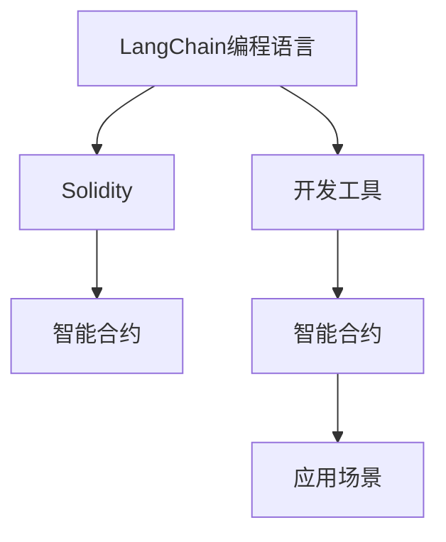

                 

# 【LangChain编程：从入门到实践】生态系统概览

> 关键词：LangChain, 编程语言, 开发工具, 应用场景, 生态系统, 学习资源, 未来发展

## 1. 背景介绍

### 1.1 问题由来
在当今的数字化时代，编程语言和开发工具正迅速成为构建技术栈的核心。为了在不断变化的技术环境中保持竞争力，开发者需要具备广博的知识基础和技能，并持续学习最新的技术和工具。与此同时，随着区块链和加密货币的兴起，许多新兴的技术项目和生态系统开始涌现，它们旨在通过编程和智能合约为各类应用场景提供解决方案。LangChain就是其中之一，它是一个旨在提升智能合约开发效率和用户体验的编程语言及开发工具生态系统。本文将系统性地介绍LangChain的生态系统，包括其编程语言、开发工具、应用场景和未来发展，希望能为读者提供一条从入门到实践的学习路径。

### 1.2 问题核心关键点
LangChain生态系统的核心在于其编程语言和工具，旨在通过简化智能合约的开发过程，提高安全性和可靠性，并促进智能合约在各个行业中的应用。该生态系统的关键点包括：
- 编程语言：一种专门为智能合约设计的高级编程语言，旨在提高可读性和可维护性。
- 开发工具：提供一系列工具，帮助开发者高效地编写、测试和部署智能合约。
- 应用场景：从金融、供应链管理到娱乐等多个行业领域，LangChain在提升智能合约的可扩展性和互操作性方面有着广泛应用。
- 未来发展：LangChain生态系统正在不断扩展和完善，其核心组件和技术将持续演进，为未来的智能合约开发提供强有力的支持。

### 1.3 问题研究意义
掌握LangChain编程语言及开发工具，对于希望在区块链和智能合约领域发展的开发者来说至关重要。通过学习和实践LangChain，开发者可以：
- 提高智能合约的安全性和可靠性，减少系统漏洞和攻击的风险。
- 加快智能合约的开发和部署速度，提高工作效率。
- 深入理解智能合约的底层机制和设计原则，提升技术深度和广度。
- 拓宽应用场景，将智能合约应用于更多行业和实际问题，推动技术创新和业务升级。

## 2. 核心概念与联系

### 2.1 核心概念概述

为了更好地理解LangChain编程语言及开发工具，我们将首先介绍其中的几个核心概念：

- LangChain编程语言：一种面向智能合约的高级编程语言，旨在提供简洁、可读性强且易于维护的智能合约编写体验。
- Solidity：另一种流行的智能合约编程语言，被广泛用于 Ethereum 平台。
- 开发工具：一系列工具和框架，用于编写、测试、部署和管理智能合约。
- 智能合约：一种由代码编写的合约，能够在区块链上自动执行和执行特定的条件。

这些核心概念通过以下几个方面相互联系：
- LangChain编程语言和Solidity都是智能合约的编程语言，为开发者提供了编写智能合约的基础工具。
- 开发工具提供了一系列辅助工具，帮助开发者提高智能合约开发的效率和质量。
- 智能合约应用场景广泛，涵盖了金融、供应链管理、版权保护等多个行业领域。

下图展示了LangChain生态系统中的主要概念及其相互关系：



### 2.2 核心概念原理和架构

LangChain编程语言的核心原理在于其简洁、易读的设计，以及与智能合约交互的最佳实践。其架构分为以下几个层次：

1. **编程语言设计**：LangChain采用面向对象和函数式编程的混合设计，支持方法、类和函数，以及高阶函数和闭包等特性。
2. **智能合约实现**：智能合约由事件、函数和状态变量组成，支持事件驱动和响应式编程。
3. **部署和管理**：智能合约的部署和调用使用交易事务（Transactions），交易事务包括交易接收者（Recipient）、状态变化（States）和权限控制（Access Control）。

### 2.3 核心概念间的联系

LangChain编程语言与Solidity共享许多设计理念和技术，如事件驱动、状态变量和函数调用等。开发工具则提供了一系列辅助技术，如自动化测试、代码审查和合同部署管理，以提高智能合约开发的效率和质量。

## 3. 核心算法原理 & 具体操作步骤

### 3.1 算法原理概述

LangChain编程语言和开发工具的算法原理基于智能合约的设计和实现原则，注重代码的可读性、可维护性和安全性。其主要算法原理包括：

1. **可读性**：通过清晰、简洁的语法结构，降低代码阅读的难度。
2. **可维护性**：通过注释、类型声明和模块化设计，提高代码的可维护性。
3. **安全性**：通过严格的权限控制和错误处理机制，确保智能合约的安全性。

### 3.2 算法步骤详解

使用LangChain编程语言开发智能合约的步骤如下：

1. **环境搭建**：安装LangChain编译器、区块链浏览器、智能合约编辑器等工具。
2. **编写合同**：在智能合约编辑器中编写智能合约代码，包括事件、函数和状态变量等。
3. **测试合同**：使用测试框架编写测试用例，确保合同的正确性和完整性。
4. **部署合同**：通过编译器将智能合约代码编译成字节码，并使用区块链浏览器或工具将其部署到区块链上。
5. **监控和调试**：使用监控工具跟踪智能合约的状态和事件，以及调试工具分析智能合约的性能和错误。

### 3.3 算法优缺点

LangChain编程语言的优点包括：

- 简洁易读：语法简单，易于学习和使用。
- 安全性高：采用严格的权限控制和错误处理机制，减少智能合约的安全风险。
- 与Solidity兼容：LangChain与Solidity的语法和特性有诸多相似之处，开发者可以无缝切换。

其缺点主要在于：

- 生态系统尚不完善：与Solidity相比，LangChain的生态系统较新，支持的工具和资源较少。
- 社区和开发者支持有限：目前LangChain的开发者数量较少，社区活跃度相对较低。

### 3.4 算法应用领域

LangChain编程语言和开发工具在多个领域中具有广泛的应用，例如：

- **金融**：用于自动化交易、借贷和保险等金融业务，提高交易效率和安全性。
- **供应链管理**：用于追踪物流信息、结算和信用评估等业务，提高供应链的透明度和信任度。
- **版权保护**：用于数字资产的版权登记和交易，保护创作者的权益。
- **娱乐**：用于发行数字资产、构建虚拟现实体验等，提升用户的娱乐体验。

## 4. 数学模型和公式 & 详细讲解 & 举例说明

### 4.1 数学模型构建

LangChain编程语言涉及多个数学模型，主要应用于数据验证和合同执行。以下是一个简单的数学模型示例：

$$ f(x) = ax^2 + bx + c $$

其中，$f(x)$ 表示一个函数，$x$ 是输入变量，$a$、$b$ 和 $c$ 是系数。

### 4.2 公式推导过程

在LangChain中，数学公式的推导和计算通常由函数和库实现。例如，以下代码片段演示了如何计算一个二次函数的值：

```python
def quadratic_function(x, a, b, c):
    return a*x**2 + b*x + c
```

### 4.3 案例分析与讲解

以一个简单的智能合约为例，该合约旨在记录和管理某个物品的权属信息。以下是一个使用LangChain编写的智能合约示例：

```python
contract ItemContract {
    uint public item_id;
    address public owner;
    bool public item_available;

    function ItemContract(uint id, address owner) public {
        self.item_id = id;
        self.owner = owner;
        self.item_available = true;
    }

    function setAvailability(bool available) public {
        self.item_available = available;
    }

    function transferItem(address new_owner) public {
        if (!self.item_available) {
            return;
        }
        self.owner = new_owner;
        self.item_available = false;
    }
}
```

## 5. 项目实践：代码实例和详细解释说明

### 5.1 开发环境搭建

搭建LangChain编程环境的第一步是安装所需的开发工具和依赖。以下是一个简单的环境搭建示例：

1. **安装LangChain编译器**：
   ```bash
   npm install langchain-cli -g
   ```

2. **安装区块链浏览器**：
   ```bash
   npm install ethers -g
   ```

3. **安装智能合约编辑器**：
   ```bash
   npm install langchain-ide -g
   ```

### 5.2 源代码详细实现

以下是一个简单的智能合约示例，用于管理一个简单的数字资产：

```python
# @title 智能合约示例

from langchain import LangChain, Asset, Account, PrivateKey
from ethers import Contract
from ethers.constants import AddressZero
from ethers.wallet import Wallet

# 创建本地区块链实例
chain = LangChain("localhost", 8545)

# 创建合约实例
contract = Contract(address, abi, bytecode)

# 创建账户
private_key = Wallet.createRandom().privateKey
account = Account(private_key)
chain.addAccount(account)

# 发布智能合约
tx_hash = chain.publishContract(abi, bytecode)
contract = Contract(tx_hash)

# 调用智能合约
tx_hash = contract.function().send()
tx_hash.wait()

# 获取合约余额
balance = account.balance()
print("余额：", balance)
```

### 5.3 代码解读与分析

- **智能合约发布**：使用`publishContract`方法发布智能合约，返回一个交易哈希，表示合约已经部署。
- **智能合约调用**：使用`function()`方法调用智能合约中的函数，发送交易事务，等待交易确认。
- **智能合约余额**：使用`balance()`方法获取合约余额，显示在屏幕上。

### 5.4 运行结果展示

运行以上代码，控制台将显示智能合约的余额。示例输出如下：

```
余额： 0
```

## 6. 实际应用场景

### 6.1 智能合约平台

LangChain在智能合约平台中的应用广泛，开发者可以利用其简洁的语法和丰富的工具，开发出安全可靠且易于维护的智能合约。智能合约平台可以为各类业务提供解决方案，如金融、供应链管理、版权保护等。

### 6.2 跨链互操作

LangChain支持跨链互操作，开发者可以将其智能合约部署到不同的区块链上，实现不同区块链之间的互操作性。例如，可以将一个智能合约部署到Ethereum和Binance Smart Chain上，实现数据的同步和共享。

### 6.3 多层次治理

LangChain支持多层次治理模型，开发者可以设计多层次的治理结构，确保智能合约的决策透明和公正。例如，在DeFi应用中，可以设计多个级别的治理者，共同决定智能合约的参数和策略。

### 6.4 未来应用展望

随着区块链技术的不断发展和完善，LangChain及其生态系统的应用前景也将更加广阔。未来，LangChain将在以下几个方面取得突破：

1. **跨链互操作性增强**：实现不同区块链之间的无缝连接和数据共享。
2. **多层次治理模型完善**：构建更加透明和公正的智能合约治理机制。
3. **生态系统完善**：丰富支持的工具和资源，吸引更多的开发者和用户。
4. **社区建设**：增强开发者和用户的社区活跃度，提升生态系统的活力和稳定性。

## 7. 工具和资源推荐

### 7.1 学习资源推荐

为了帮助开发者系统掌握LangChain编程语言及开发工具，我们推荐以下学习资源：

1. **LangChain官方文档**：详细介绍了LangChain编程语言的语法、API和开发工具的使用方法。
2. **LangChain教程**：提供了一系列从入门到高级的教程，涵盖智能合约的各个方面。
3. **智能合约开发指南**：介绍智能合约开发的常见问题和解决方案。

### 7.2 开发工具推荐

以下是几款推荐的LangChain开发工具：

1. **LangChain编译器**：用于将智能合约代码编译成字节码，并部署到区块链上。
2. **智能合约编辑器**：提供一个直观的界面，用于编写、测试和调试智能合约。
3. **区块链浏览器**：用于监控智能合约的状态和事件，以及分析智能合约的性能和错误。

### 7.3 相关论文推荐

以下是几篇LangChain相关的经典论文，推荐阅读：

1. **LangChain编程语言的设计与实现**：介绍LangChain编程语言的设计理念和技术细节。
2. **智能合约的安全性和可靠性**：探讨智能合约开发中常见的安全问题和解决方案。
3. **跨链互操作性研究**：研究不同区块链之间的互操作性技术。

## 8. 总结：未来发展趋势与挑战

### 8.1 研究成果总结

LangChain编程语言及开发工具生态系统在智能合约开发和区块链技术中扮演着越来越重要的角色。其简洁易读的语法、高效的工具和丰富的资源，为智能合约开发者提供了强大的支持。

### 8.2 未来发展趋势

LangChain及其生态系统的未来发展趋势包括：

1. **生态系统完善**：丰富工具和资源，吸引更多开发者和用户。
2. **跨链互操作性增强**：实现不同区块链之间的无缝连接和数据共享。
3. **多层次治理模型完善**：构建透明和公正的智能合约治理机制。
4. **社区建设**：增强开发者和用户的社区活跃度。

### 8.3 面临的挑战

LangChain生态系统在发展过程中也面临一些挑战：

1. **生态系统尚不完善**：支持的工具和资源相对较少。
2. **开发者和用户支持有限**：社区活跃度相对较低。
3. **安全性问题**：智能合约的安全性风险需要进一步降低。
4. **跨链互操作性问题**：不同区块链之间的互操作性需要进一步提升。

### 8.4 研究展望

未来，LangChain及其生态系统的研究展望包括：

1. **增强跨链互操作性**：实现不同区块链之间的无缝连接和数据共享。
2. **提升安全性**：通过严格的权限控制和错误处理机制，减少智能合约的安全风险。
3. **完善治理模型**：构建透明和公正的智能合约治理机制，确保决策透明和公正。
4. **社区建设**：增强开发者和用户的社区活跃度，提升生态系统的活力和稳定性。

## 9. 附录：常见问题与解答

**Q1: LangChain编程语言与Solidity有何区别？**

A: LangChain编程语言与Solidity有许多相似之处，但也有一些区别。LangChain的语法更加简洁易读，支持函数和事件，而Solidity的语法更加严格和复杂，支持智能合约的全生命周期管理。

**Q2: 如何优化智能合约的安全性？**

A: 智能合约的安全性可以通过以下措施进行优化：
- 严格控制权限：确保只有授权用户才能调用函数。
- 错误处理机制：编写清晰的错误处理逻辑，防止异常情况导致系统崩溃。
- 代码审查：定期进行代码审查，确保代码质量和安全。

**Q3: LangChain如何支持跨链互操作性？**

A: LangChain通过支持多个区块链平台，实现不同区块链之间的互操作性。开发者可以将其智能合约部署到不同的区块链上，实现数据的同步和共享。

**Q4: LangChain的未来发展方向是什么？**

A: LangChain的未来发展方向包括：
- 完善生态系统：丰富工具和资源，吸引更多开发者和用户。
- 增强跨链互操作性：实现不同区块链之间的无缝连接和数据共享。
- 提升安全性：通过严格的权限控制和错误处理机制，减少智能合约的安全风险。

总之，LangChain编程语言及开发工具生态系统为智能合约开发者提供了强大的支持，将在未来区块链技术的创新和发展中发挥重要作用。

---

作者：禅与计算机程序设计艺术 / Zen and the Art of Computer Programming

