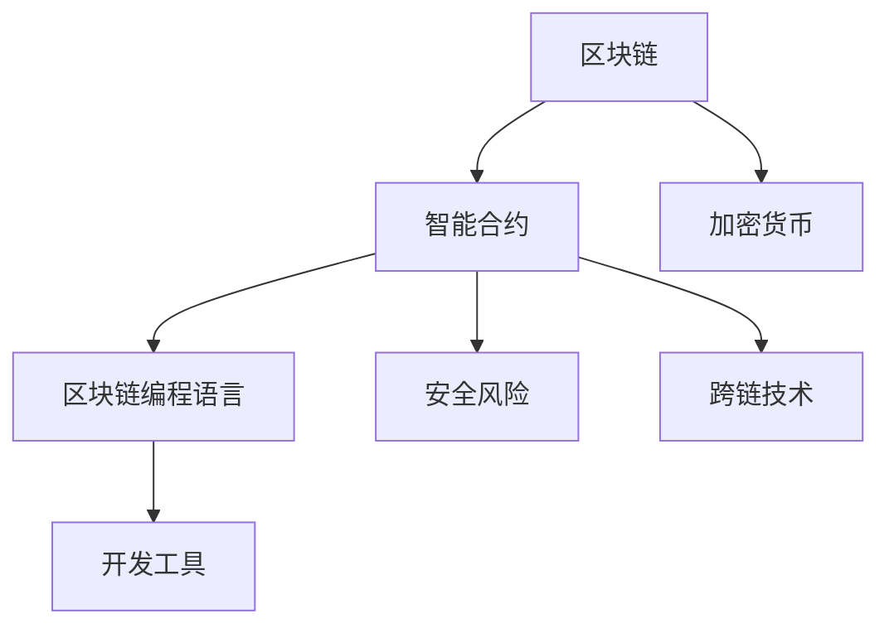

                 

# 【LangChain编程：从入门到实践】链模块

> 关键词：区块链,智能合约,加密货币,编程,编程语言,开发工具

## 1. 背景介绍

### 1.1 问题由来
随着区块链技术的发展，去中心化的分布式应用(DApps)越来越多地被用于金融、供应链、医疗、物联网等各个领域。在DApp中，智能合约是核心组件，它能够自动化执行交易、管理资产、治理协议等任务，具有高效、可信的特点。然而，智能合约的编写和调试并非易事，需要深入理解区块链原理、编程语言、安全风险等知识点。

### 1.2 问题核心关键点
本节将介绍区块链智能合约编程的基本概念和技术栈，帮助开发者从零开始构建DApp。智能合约的核心任务是实现资产的智能转移和管理，智能合约的编写和调试需要具备区块链编程语言和开发工具的基础知识。此外，还需要了解区块链的安全性、治理机制、跨链技术等知识点，以构建高效、可靠、安全的DApp。

### 1.3 问题研究意义
研究智能合约编程技术，对于拓展区块链应用场景，提升DApp的开发效率，加速区块链技术的产业化进程，具有重要意义：

1. 降低开发成本。基于智能合约的DApp可以快速构建并上线，减少传统应用的开发周期。
2. 提升应用效果。智能合约自动化执行交易和管理，避免人为操作失误，提升应用的安全性和可靠性。
3. 加速开发进度。结合开源工具和框架，智能合约编程变得更为方便快捷，加速DApp的开发和迭代。
4. 带来技术创新。智能合约编程引领了区块链编程语言、跨链技术等前沿研究，推动了区块链技术的持续演进。
5. 赋能产业升级。智能合约编程技术为各行各业带来了新的应用可能，推动了数字化转型的进程。

## 2. 核心概念与联系

### 2.1 核心概念概述

为更好地理解区块链智能合约编程，本节将介绍几个密切相关的核心概念：

- 区块链(Blockchain)：一种去中心化的分布式账本技术，通过共识机制确保数据的可信性、不可篡改性和可追溯性。
- 智能合约(Smart Contract)：一种在区块链上自动执行、控制资产转移和交互的代码合约。
- 加密货币(CryptoCurrency)：一种基于区块链技术的数字货币，用于支付和交易。
- 区块链编程语言(Solidity)：一种用于智能合约编程的高级语言，支持类、结构、函数、合约、事件等概念。
- 开发工具(Truffle, Remix)：用于智能合约编写、测试和调试的集成开发环境(IDE)。
- 安全风险(Reentrancy, Overflow)：智能合约编程中常见的安全漏洞，可能导致资产损失和系统崩溃。
- 跨链技术(Interchain Communication)：连接多个区块链网络，实现跨链资产转移和数据交互。

这些核心概念之间的逻辑关系可以通过以下Mermaid流程图来展示：



这个流程图展示了大语言模型的核心概念及其之间的关系：

1. 区块链通过智能合约实现自动化和智能化。
2. 智能合约由区块链编程语言实现。
3. 加密货币是智能合约运行的基础。
4. 开发工具帮助程序员编写和调试智能合约。
5. 安全风险是智能合约编程中需要避免的常见问题。
6. 跨链技术连接了多个区块链网络，扩大了智能合约的应用范围。

这些概念共同构成了区块链智能合约编程的框架，使其能够在各种场景下发挥强大的自动化和智能化功能。通过理解这些核心概念，我们可以更好地把握区块链智能合约编程的工作原理和优化方向。

## 3. 核心算法原理 & 具体操作步骤
### 3.1 算法原理概述

区块链智能合约编程的本质是使用区块链编程语言(Solidity等)编写可执行代码，并在区块链上部署运行。其核心任务是实现资产的智能转移和管理，通过自动化的执行，保障交易的透明性和安全性。

形式化地，假设智能合约为 $C$，其中包含一些初始状态变量，以及一组可执行的函数 $f_1, f_2, ..., f_n$。用户通过调用这些函数，实现特定的操作。例如，一个简单的转账智能合约可能包含以下函数：

- `transfer(address receiver, uint amount)`：将资金从调用者地址转移到接收者地址。
- `balance(address user)`：查询用户地址的余额。
- `totalSupply()`：查询智能合约中的总资金量。

智能合约的部署过程通常包括以下步骤：

1. 使用区块链编程语言编写智能合约代码。
2. 将智能合约编译成字节码。
3. 将字节码部署到区块链上，并通过加密方式打包。
4. 智能合约在区块链上运行，由合约自身的规则控制执行。

### 3.2 算法步骤详解

区块链智能合约编程一般包括以下几个关键步骤：

**Step 1: 准备区块链环境**
- 安装并配置区块链节点软件，如Ethereum。
- 创建一个新的以太账户，用于部署智能合约。

**Step 2: 编写智能合约代码**
- 使用区块链编程语言(Solidity)编写智能合约代码。
- 在合约中定义状态变量、函数和方法。
- 编写函数以实现特定的智能合约功能。

**Step 3: 编译智能合约**
- 使用Solidity编译器将合约代码编译成字节码。
- 生成合约部署字节码和ABI(应用程序二进制接口)。

**Step 4: 部署智能合约**
- 使用区块链开发工具(如Truffle, Remix)将合约部署到区块链上。
- 将智能合约字节码部署到区块链网络。
- 在区块链上创建智能合约实例，并通过合约地址调用。

**Step 5: 测试和优化**
- 编写测试用例，测试智能合约的正确性和安全性。
- 使用区块链测试网络(如Ropsten)测试智能合约的性能和稳定性。
- 根据测试结果进行优化和调整，完善智能合约代码。

**Step 6: 部署和监控**
- 将经过测试和优化的智能合约部署到主网。
- 使用区块链监控工具(如Etherscan)监控合约的运行状态和性能。
- 定期更新和维护智能合约，保持其稳定性和可靠性。

### 3.3 算法优缺点

区块链智能合约编程具有以下优点：
1. 自动化执行。智能合约一旦部署，将自动执行合同中的规定操作，无需人为干预。
2. 透明可信。区块链的公开透明性确保了智能合约的执行可追溯、不可篡改。
3. 去中心化。智能合约去中心化的特性，减少了传统中心化系统的单点故障和信任风险。
4. 可编程性。智能合约可以通过编程语言进行灵活定制，实现复杂的业务逻辑。

同时，该方法也存在一定的局限性：
1. 部署成本较高。智能合约的部署需要支付一定的网络费用。
2. 安全风险。智能合约中的漏洞可能导致严重的安全问题。
3. 扩展性不足。智能合约在链上运行，性能受限，扩展性较差。
4. 法律问题。智能合约的法律地位和执行效力在各国存在差异。
5. 技术门槛高。智能合约编程需要深入理解区块链原理和编程语言。

尽管存在这些局限性，但就目前而言，区块链智能合约编程仍是区块链技术应用的主流范式。未来相关研究的重点在于如何进一步降低部署成本，提高智能合约的安全性和扩展性，同时兼顾可解释性和法律合规性等因素。

### 3.4 算法应用领域

区块链智能合约编程已经在金融、供应链、保险、物联网等诸多领域得到了广泛的应用，为各种场景带来了新的解决方案：

- 金融领域：智能合约用于自动化支付、清算、结算等金融交易，提高交易效率和安全性。
- 供应链管理：智能合约用于跟踪货物运输、质量检测等供应链环节，提高供应链透明度和可追溯性。
- 保险行业：智能合约用于自动化理赔、理赔计算等保险业务，减少人为操作失误，提升理赔效率。
- 物联网：智能合约用于自动化资产管理、智能合约、数据交换等，提升物联网设备的互联互通能力。
- 游戏行业：智能合约用于自动化游戏道具管理、游戏货币发行等，提升游戏的公平性和安全性。

除了上述这些经典应用外，智能合约编程还被创新性地应用到更多场景中，如版权保护、身份认证、数据共享等，为区块链技术带来了新的应用可能。

## 4. 数学模型和公式 & 详细讲解
### 4.1 数学模型构建

本节将使用数学语言对区块链智能合约编程过程进行更加严格的刻画。

假设智能合约 $C$ 由 $n$ 个状态变量和 $m$ 个函数组成，其中 $s_1, s_2, ..., s_n$ 为状态变量，$f_1, f_2, ..., f_m$ 为函数。设用户 $u$ 初始状态为 $s_0$，执行函数 $f_k$ 后的状态为 $s_k$。智能合约的执行过程可表示为：

$$
s_k = f_k(s_{k-1})
$$

其中 $s_0$ 为合约初始状态，$s_n$ 为合约最终状态。

### 4.2 公式推导过程

以下我们以转账智能合约为例，推导其数学模型和执行过程。

假设智能合约 $C$ 包含一个余额变量 `balance`，表示用户 $u$ 的当前余额，初始化为 `100`。合约中定义了一个 `transfer` 函数：

```solidity
function transfer(address receiver, uint amount) public returns (bool) {
    require(balance >= amount);
    balance -= amount;
    receiver.balance += amount;
    return true;
}
```

上述代码使用Solidity语言定义了一个转账函数 `transfer`，用户调用该函数时，将资金从调用者地址转移到接收者地址，并更新两个地址的余额。

数学模型和执行过程如下：
1. 初始化智能合约的余额变量 `balance` 为 `100`。
2. 用户调用 `transfer(receiver, amount)` 函数，将资金从调用者地址转移到接收者地址。
3. 执行 `transfer` 函数时，首先将调用者地址的余额 `balance` 减去 `amount`，接收者地址的余额加上 `amount`，更新两个地址的余额。
4. 执行结束后，返回 `true`，表示操作成功。

以上数学模型描述了智能合约的执行过程，通过状态变量的传递和函数调用的执行，实现了智能合约的功能。

### 4.3 案例分析与讲解

假设智能合约 $C$ 包含一个自动贷款合约，用户可以向合约申请贷款，合约根据用户的信用记录和还款能力自动判断是否批准，并自动完成资金的借贷和归还操作。合约的代码如下：

```solidity
pragma solidity ^0.8.0;

contract LoanContract {
    address owner;
    uint initialBalance;
    uint loanAmount;
    uint interestRate;
    uint repayPeriod;
    uint balance;
    
    event LoanApproved(uint256 amount);
    event LoanRejected();
    
    constructor(uint initialBalance, uint loanAmount, uint interestRate, uint repayPeriod) public {
        owner = msg.sender;
        this.initialBalance = initialBalance;
        this.loanAmount = loanAmount;
        this.interestRate = interestRate;
        this.repayPeriod = repayPeriod;
        this.balance = initialBalance;
    }
    
    function applyLoan() public returns (bool) {
        require(msg.sender == owner, "Only the owner can apply for a loan.");
        
        uint totalAmount = loanAmount * repayPeriod * (1 + interestRate / 100);
        
        if (balance >= totalAmount) {
            balance -= totalAmount;
            LoanApproved(totalAmount);
        } else {
            LoanRejected();
        }
        return totalAmount >= balance;
    }
    
    function repayLoan(uint amount) public {
        require(msg.sender == owner, "Only the owner can repay the loan.");
        require(amount > 0, "Amount must be greater than 0.");
        
        balance += amount;
    }
}
```

在上述代码中，`LoanContract` 合约定义了一个 `applyLoan` 函数，用于申请贷款。合约通过判断用户的初始余额 `initialBalance` 是否足以覆盖贷款总额，来决定是否批准贷款申请。如果申请成功，合约将自动完成资金的借贷和归还操作，并触发 `LoanApproved` 事件。

数学模型和执行过程如下：
1. 初始化智能合约的余额变量 `balance` 为 `initialBalance`。
2. 用户调用 `applyLoan()` 函数，申请贷款。
3. 执行 `applyLoan` 函数时，判断用户的初始余额 `balance` 是否足以覆盖贷款总额 `totalAmount`，如果满足条件，则自动完成资金的借贷和归还操作，并触发 `LoanApproved` 事件。
4. 如果用户余额不足，则触发 `LoanRejected` 事件。
5. 函数执行结束后，返回贷款申请是否成功。

### 4.4 案例分析与讲解

## 5. 项目实践：代码实例和详细解释说明
### 5.1 开发环境搭建

在进行区块链智能合约编程实践前，我们需要准备好开发环境。以下是使用Solidity进行区块链编程的环境配置流程：

1. 安装Ethereum节点软件：从官网下载并安装Ethereum客户端，如Geth。
2. 创建并激活以太账户：在本地或测试网中创建以太账户，用于部署智能合约。
3. 安装Solidity编译器和开发工具：通过npm安装Solidity编译器，如solc，安装区块链开发工具，如Truffle, Remix。

完成上述步骤后，即可在本地环境中开始区块链智能合约编程实践。

### 5.2 源代码详细实现

下面我们以转账智能合约为例，给出使用Solidity语言编写的智能合约代码实现。

```solidity
pragma solidity ^0.8.0;

contract TransferContract {
    address payable owner;
    uint public balance;
    
    constructor(address payable _owner) payable {
        owner = _owner;
        balance = 0;
    }
    
    function transfer(address payable receiver, uint amount) public returns (bool) {
        require(owner == msg.sender, "Only the owner can transfer funds.");
        require(amount > 0, "Amount must be greater than 0.");
        
        uint txAmount = amount * 10**18;
        bool success = msg.sender.send(txAmount);
        if (success) {
            balance -= txAmount;
            receiver.balance += txAmount;
        }
        return success;
    }
    
    function balanceOf(address payable _owner) public view returns (uint balance) {
        return address(this).balance;
    }
}
```

在上述代码中，`TransferContract` 合约定义了一个 `transfer` 函数，用于转账操作。合约通过判断转账操作是否合法，将资金从调用者地址转移到接收者地址，并更新两个地址的余额。

### 5.3 代码解读与分析

让我们再详细解读一下关键代码的实现细节：

**TransferContract类**：
- `constructor`方法：初始化智能合约，将合约所有者设置为合约部署者。
- `transfer`方法：定义转账函数，接收接收者地址和转账金额。
- `balanceOf`方法：查询智能合约中特定地址的余额。

**代码解读**：
- `owner`变量：表示智能合约的所有者地址，在合约初始化时指定。
- `balance`变量：表示智能合约中的余额，使用 `uint` 类型表示。
- `msg.sender`：表示当前调用合约的地址，即转账操作的调用者地址。
- `receiver.balance`：表示接收者地址的余额，使用 `address payable` 类型表示。
- `msg.sender.send(txAmount)`：将资金从调用者地址转移到接收者地址。
- `success`：表示转账操作是否成功，返回值为布尔类型。

**代码分析**：
- 在 `transfer` 函数中，首先判断转账操作是否合法，即调用者地址是否为合约所有者，转账金额是否大于0。
- 计算转账金额 `txAmount`，单位为以太币。
- 使用 `msg.sender.send(txAmount)` 将资金从调用者地址转移到接收者地址，并返回转账操作是否成功。
- 在 `balanceOf` 函数中，查询智能合约中特定地址的余额，并返回结果。

### 5.4 运行结果展示

在上述代码的基础上，可以通过以下步骤在区块链上部署智能合约并进行测试：

1. 使用 Solidity 编译器将合约代码编译成字节码。
2. 使用 Truffle 开发工具将字节码部署到测试网络。
3. 使用 Remix IDE 进行测试和调试。

以下是部署和测试的示例代码：

```solidity
pragma solidity ^0.8.0;

contract TransferContract {
    address payable owner;
    uint public balance;
    
    constructor(address payable _owner) payable {
        owner = _owner;
        balance = 0;
    }
    
    function transfer(address payable receiver, uint amount) public returns (bool) {
        require(owner == msg.sender, "Only the owner can transfer funds.");
        require(amount > 0, "Amount must be greater than 0.");
        
        uint txAmount = amount * 10**18;
        bool success = msg.sender.send(txAmount);
        if (success) {
            balance -= txAmount;
            receiver.balance += txAmount;
        }
        return success;
    }
    
    function balanceOf(address payable _owner) public view returns (uint balance) {
        return address(this).balance;
    }
}

// 编译并部署智能合约
solc --output-sourcemaps --combined-json --optimize --target=es6 --abi --libraries .
truffle compile
truffle migrate --network=development

// 使用 Remix IDE 测试智能合约
```

在上述代码中，`Truffle` 和 `Remix` 工具的配合使用，大大简化了智能合约的开发和测试流程。开发者可以在 IDE 中进行代码编写、测试和调试，快速迭代智能合约的逻辑。

## 6. 实际应用场景
### 6.1 智能合约在供应链中的应用

区块链智能合约可以用于供应链管理，确保货物运输、质量检测等环节的透明性和可追溯性。例如，一家物流公司可以使用智能合约来自动化管理货物的运输和交付。货物在运输过程中，智能合约可以实时记录货物的位置、状态和流转信息，确保货物的安全和透明。一旦货物到达目的地，智能合约会自动触发支付操作，确保物流公司及时获得货款。

在技术实现上，可以设计一个智能合约，记录货物的初始状态、目的地、运输公司等信息，并在货物到达目的地时，自动触发支付操作。通过使用智能合约，物流公司可以实时跟踪货物的位置和状态，确保货物的安全和透明，同时提高物流管理的效率和安全性。

### 6.2 智能合约在保险中的应用

区块链智能合约可以用于保险理赔和理赔计算，提升保险公司的理赔效率和准确性。例如，一家保险公司可以使用智能合约来自动化处理车险理赔。在发生交通事故时，智能合约可以自动记录事故信息、车辆信息、保险公司等信息，并在保险公司确认理赔申请后，自动触发理赔操作。智能合约还可以自动计算理赔金额，确保理赔过程的透明和公正。

在技术实现上，可以设计一个智能合约，记录事故信息、车辆信息、保险公司等信息，并在保险公司确认理赔申请后，自动触发理赔操作。通过使用智能合约，保险公司可以实时处理理赔申请，提高理赔效率和准确性，同时确保理赔过程的透明和公正。

### 6.3 智能合约在供应链中的应用

智能合约还可以用于供应链管理，确保货物运输、质量检测等环节的透明性和可追溯性。例如，一家物流公司可以使用智能合约来自动化管理货物的运输和交付。货物在运输过程中，智能合约可以实时记录货物的位置、状态和流转信息，确保货物的安全和透明。一旦货物到达目的地，智能合约会自动触发支付操作，确保物流公司及时获得货款。

在技术实现上，可以设计一个智能合约，记录货物的初始状态、目的地、运输公司等信息，并在货物到达目的地时，自动触发支付操作。通过使用智能合约，物流公司可以实时跟踪货物的位置和状态，确保货物的安全和透明，同时提高物流管理的效率和安全性。

### 6.4 未来应用展望

随着区块链技术的发展，基于智能合约的应用场景将更加广泛，未来区块链智能合约编程也将迎来更多的创新和发展：

1. 跨链智能合约：通过跨链技术，连接多个区块链网络，实现跨链资产转移和数据交互，提升区块链网络的互操作性。
2. 去中心化金融(DeFi)：基于智能合约构建去中心化金融应用，如自动交易、稳定币、借贷等，提高金融服务的去中心化和效率。
3. 智能合约编程语言：开发更加易用、安全的区块链编程语言，提高智能合约编写的便捷性和安全性。
4. 智能合约治理：设计智能合约的治理机制，通过共识算法和社区投票等方式，实现智能合约的公平和透明。
5. 智能合约风险管理：开发智能合约风险评估和管理工具，提高智能合约的安全性和可靠性。

以上趋势凸显了区块链智能合约编程技术的广阔前景。这些方向的探索发展，必将进一步提升区块链智能合约的应用范围和性能，推动区块链技术的持续演进。

## 7. 工具和资源推荐
### 7.1 学习资源推荐

为了帮助开发者系统掌握区块链智能合约编程的理论基础和实践技巧，这里推荐一些优质的学习资源：

1. 《以太坊智能合约实战》书籍：深入浅出地介绍了以太坊智能合约的开发和应用，适合区块链初学者入门。
2. Solidity官方文档：Solidity编程语言的官方文档，提供了详细的教程和示例，帮助开发者快速上手Solidity。
3 《区块链编程入门》视频课程：由区块链专家主讲的视频课程，介绍了区块链基础和智能合约编程。
4 《智能合约安全指南》白皮书：介绍了智能合约编程中的常见安全问题和解决方案，帮助开发者提高智能合约的安全性。
5 Solidity社区：Solidity开发者社区，提供丰富的学习资源、技术交流和问题解答。

通过对这些资源的学习实践，相信你一定能够快速掌握区块链智能合约编程的精髓，并用于解决实际的区块链问题。
###  7.2 开发工具推荐

高效的开发离不开优秀的工具支持。以下是几款用于区块链智能合约编程的常用工具：

1. Truffle：区块链开发框架，集成了智能合约编译、部署、测试等功能，适合区块链开发者的需求。
2. Remix：区块链IDE，支持Solidity智能合约的编写、测试和调试，易于上手。
3. Solc：Solidity编译器，将Solidity智能合约代码编译成以太坊虚拟机(VM)字节码。
4. Web3.js：JavaScript库，提供与区块链网络交互的API，便于前端开发者的使用。
5. MetaMask：以太钱包和浏览器插件，支持智能合约的调用和交互，提高用户的操作便捷性。
6. Infura：以太链云服务，提供节点接入、网络监控等功能，方便区块链开发者进行开发测试。

合理利用这些工具，可以显著提升区块链智能合约编程的开发效率，加快创新迭代的步伐。

### 7.3 相关论文推荐

区块链智能合约编程技术的发展源于学界的持续研究。以下是几篇奠基性的相关论文，推荐阅读：

1. "Smart Contracts: Defined, Explained, Example, and Good Practices"：定义智能合约的概念、解释其工作原理、提供示例，并给出智能合约编程的最佳实践。
2. "Solidity 2.0 Alpha Release"：Solidity编程语言的最新版本，介绍了2.0版本的新特性和改进。
3 "Improving Security of Ethereum Smart Contracts"：介绍智能合约编程中的安全问题和解决方案，提出了几种改进措施。
4 "Blockchain Programming Languages"：讨论了区块链编程语言的发展历程和未来方向，介绍了几种流行的区块链编程语言。
5 "Decentralized Applications: Programming, Security, and Specification"：介绍了DApp编程的基本概念、安全性和规范性，提供了DApp编程的指南。

这些论文代表了大语言模型微调技术的发展脉络。通过学习这些前沿成果，可以帮助研究者把握学科前进方向，激发更多的创新灵感。

## 8. 总结：未来发展趋势与挑战

### 8.1 总结

本文对区块链智能合约编程技术进行了全面系统的介绍。首先阐述了区块链智能合约编程的基本概念和技术栈，帮助开发者从零开始构建DApp。其次，从原理到实践，详细讲解了区块链智能合约编程的数学模型和执行过程，给出了智能合约编程的代码实现。同时，本文还广泛探讨了智能合约在金融、供应链、保险等多个领域的应用前景，展示了智能合约编程的巨大潜力。此外，本文精选了智能合约编程的学习资源，力求为读者提供全方位的技术指引。

通过本文的系统梳理，可以看到，区块链智能合约编程技术正在成为区块链应用的主流范式，极大地拓展了区块链智能合约的应用边界，推动了区块链技术的产业化进程。未来，伴随智能合约编程语言和工具的不断进步，区块链智能合约编程必将在更多的领域发挥作用，为经济数字化转型提供新的技术支持。

### 8.2 未来发展趋势

展望未来，区块链智能合约编程技术将呈现以下几个发展趋势：

1. 编程语言创新。随着区块链技术的发展，新的智能合约编程语言将不断涌现，提升智能合约编写的便捷性和安全性。
2. 智能合约治理。设计更加灵活、高效的智能合约治理机制，提高智能合约的可操作性和可扩展性。
3. 跨链互操作。通过跨链技术，实现区块链网络的互操作性，提升智能合约的应用范围和性能。
4. DeFi金融服务。基于智能合约构建去中心化金融应用，提升金融服务的去中心化和效率。
5. 数据安全和隐私。设计更加安全和隐私保护的智能合约，确保用户数据的隐私和安全性。

以上趋势凸显了区块链智能合约编程技术的广阔前景。这些方向的探索发展，必将进一步提升区块链智能合约的应用范围和性能，推动区块链技术的持续演进。

### 8.3 面临的挑战

尽管区块链智能合约编程技术已经取得了瞩目成就，但在迈向更加智能化、普适化应用的过程中，它仍面临着诸多挑战：

1. 安全风险。智能合约中的漏洞可能导致严重的安全问题，如资金损失、系统崩溃等。
2. 扩展性不足。智能合约在链上运行，性能受限，扩展性较差。
3. 技术门槛高。智能合约编程需要深入理解区块链原理和编程语言。
4. 法律问题。智能合约的法律地位和执行效力在各国存在差异。
5. 智能合约治理。智能合约的设计和维护需要社区共识和持续优化。

尽管存在这些挑战，但区块链智能合约编程技术仍然具有巨大的潜力和市场前景。未来，需要开发更加易用、安全和高效的工具和平台，降低智能合约编程的门槛，提高智能合约的应用范围和性能。

### 8.4 研究展望

面向未来，区块链智能合约编程技术需要在以下几个方面寻求新的突破：

1. 开发更加易用、安全的智能合约编程语言。降低智能合约编程的门槛，提高智能合约的可操作性和可扩展性。
2. 设计更加灵活、高效的智能合约治理机制。通过社区共识和持续优化，提高智能合约的可操作性和可扩展性。
3. 实现跨链互操作。通过跨链技术，实现区块链网络的互操作性，提升智能合约的应用范围和性能。
4. 提升智能合约的安全性和可靠性。开发更加安全和隐私保护的智能合约，确保用户数据的隐私和安全性。
5. 开发智能合约风险评估和管理工具。提高智能合约的安全性和可靠性，降低智能合约编程的风险。

这些研究方向的探索，必将引领区块链智能合约编程技术迈向更高的台阶，为构建安全、可靠、高效的智能合约系统铺平道路。面向未来，区块链智能合约编程技术还需要与其他人工智能技术进行更深入的融合，如智能合约治理、智能合约风险管理等，多路径协同发力，共同推动区块链技术的持续演进。只有勇于创新、敢于突破，才能不断拓展区块链智能合约编程的边界，让智能合约技术更好地造福人类社会。

## 9. 附录：常见问题与解答

**Q1：区块链智能合约编程需要掌握哪些知识？**

A: 区块链智能合约编程需要掌握以下知识：
1. 区块链基本概念：了解区块链的技术原理和特点，包括共识算法、分布式账本、加密技术等。
2. 智能合约编程语言：掌握Solidity等智能合约编程语言的基本语法和编程范式。
3. 区块链开发工具：熟悉区块链开发工具，如Truffle、Remix等，能够进行智能合约的编写、测试和部署。
4. 区块链网络交互：了解区块链网络交互的基本原理和接口，能够进行智能合约的调用和交互。
5. 智能合约安全：掌握智能合约编程中的常见安全问题和解决方案，确保智能合约的安全性和可靠性。

通过掌握这些知识，开发者可以全面理解区块链智能合约编程的原理和实现，编写高效、安全、可靠的智能合约。

**Q2：智能合约中常见的安全问题有哪些？**

A: 智能合约编程中常见的安全问题包括：
1. 重入攻击(Reentrancy)：攻击者利用合约的函数调用机制，反复调用合约函数，导致合约资产的流失。
2. 溢出攻击(Overflow)：攻击者利用整数溢出漏洞，导致合约计算错误，甚至资产流失。
3. 未授权访问：攻击者通过攻击合约中的权限控制机制，未授权访问合约资产或函数。
4. 不变量修改：攻击者通过攻击合约中的不变量，导致合约状态的不正确性。
5. 高余额攻击：攻击者利用高余额账户，导致合约中大量资产的转移。

为了保障智能合约的安全性，开发者需要在编写合约时，严格遵循智能合约编程的最佳实践，如使用存入函数、避免未授权访问、使用安全库函数等。

**Q3：区块链智能合约的扩展性有哪些提升方向？**

A: 区块链智能合约的扩展性可以从以下几个方向进行提升：
1. 优化合约代码：减少合约中的计算量和存储量，提高合约的执行效率和存储效率。
2. 优化合约部署：减少合约的部署费用和交易手续费，提高合约的部署效率和交易效率。
3. 优化合约交互：减少合约间的交互次数和交互复杂度，提高合约的交互效率和安全性。
4. 优化合约治理：设计更加灵活、高效的合约治理机制，提高合约的可操作性和可扩展性。
5. 优化合约数据结构：使用更高效的数据结构和算法，提高合约的性能和安全性。

通过提升智能合约的扩展性，可以提高智能合约的应用范围和性能，满足更多场景的需求。

**Q4：区块链智能合约的测试方法有哪些？**

A: 区块链智能合约的测试方法包括：
1. 单元测试：对智能合约中的单个函数或模块进行测试，确保其功能正确性。
2. 集成测试：对智能合约中的多个函数或模块进行测试，确保其相互之间的协调性。
3. 系统测试：对整个智能合约进行测试，确保其功能完整性和安全性。
4. 性能测试：对智能合约的执行效率和性能进行测试，确保其满足业务需求。
5. 安全测试：对智能合约中的安全漏洞进行测试，确保其安全性。

通过多种测试方法的结合使用，可以提高智能合约的质量和可靠性，确保其在实际应用中的稳定性和安全性。

**Q5：区块链智能合约的部署流程有哪些步骤？**

A: 区块链智能合约的部署流程包括：
1. 编写智能合约代码：使用Solidity等智能合约编程语言编写智能合约代码。
2. 编译智能合约：使用Solidity编译器将合约代码编译成以太坊虚拟机(VM)字节码。
3. 部署智能合约：使用Truffle等区块链开发工具将合约部署到区块链网络。
4. 测试智能合约：在测试网络或主网中进行智能合约的测试和调试。
5. 监控智能合约：使用Etherscan等区块链监控工具监控智能合约的运行状态和性能。

通过按照上述流程进行智能合约的部署，可以确保智能合约在实际应用中的稳定性和安全性。

---

作者：禅与计算机程序设计艺术 / Zen and the Art of Computer Programming

