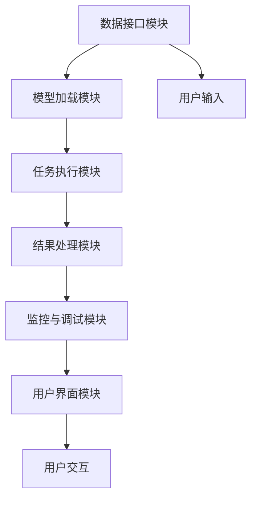

                 

# 【大模型应用开发 动手做AI Agent】LangChain中的六大模块

> 关键词：
1. LangChain
2. 大模型应用
3. AI Agent
4. 模块设计
5. 动态化系统架构
6. 模块组合与实例化

## 1. 背景介绍

### 1.1 问题由来

在当前人工智能（AI）领域，大模型（Large Model）已经成为主流趋势，它们在大规模文本、图像、语音等数据上表现出卓越的性能。大模型的应用已经从科研领域延伸到各行各业，如自然语言处理（NLP）、计算机视觉（CV）、推荐系统、游戏AI等。然而，由于大模型通常需要大量的计算资源和数据支持，因此在实际应用中，如何高效、灵活地使用这些模型，成为了一个重要的课题。

### 1.2 问题核心关键点

为了更好地适应各种应用场景，降低模型应用的门槛，许多研究者和开发者开始探索如何将大模型与具体的业务需求结合。在这其中，LangChain这一项目显得尤为重要，它是一个框架，旨在让开发者能够方便地使用大模型，并将其应用于各种任务中。本文将详细介绍LangChain中的六大模块，并探讨其在实际应用中的实践方法。

## 2. 核心概念与联系

### 2.1 核心概念概述

LangChain的六大模块分别是：数据接口模块、模型加载模块、任务执行模块、结果处理模块、监控与调试模块、用户界面模块。这些模块相互独立，又彼此依赖，共同构成了LangChain的完整生态。

- 数据接口模块：负责从各种数据源获取输入数据，包括文本、图片、音频等，并将其转化为模型能够处理的格式。
- 模型加载模块：从预训练模型库或本地模型文件加载模型，并对其进行初始化。
- 任务执行模块：根据用户指定的任务，调用模型执行推理操作，并将推理结果返回。
- 结果处理模块：将模型的推理结果进行后处理，如文本生成、图像识别等。
- 监控与调试模块：实时监控模型的推理过程，捕捉异常，并提供调试工具帮助开发者进行问题排查。
- 用户界面模块：提供直观的交互界面，使用户能够方便地调用模型和执行任务。

### 2.2 核心概念原理和架构的 Mermaid 流程图



这个流程图展示了LangChain中模块之间的关系，每个模块负责不同的功能，通过数据流动，实现从用户输入到最终输出的过程。

## 3. 核心算法原理 & 具体操作步骤

### 3.1 算法原理概述

LangChain的六大模块构成了其核心算法原理，这些模块共同协作，完成模型的加载、推理、结果处理、监控等任务。在实际应用中，通过模块化的设计，可以实现灵活的模型使用方式，降低模型应用的门槛，提高模型应用的效率。

### 3.2 算法步骤详解

#### 3.2.1 数据接口模块

数据接口模块负责从各种数据源获取输入数据，并将其转化为模型能够处理的格式。例如，在处理文本数据时，数据接口模块会将输入的文本分割成句子或单词，并将其转化为token形式。这通常需要使用一些通用的数据处理库，如Pandas、TensorFlow等。

#### 3.2.2 模型加载模块

模型加载模块负责从预训练模型库或本地模型文件加载模型，并对其进行初始化。通常，预训练模型库如Hugging Face、OpenAI等，提供了大量的模型和工具，开发者只需要使用这些库提供的接口，即可快速加载和初始化模型。例如，使用Hugging Face的Transformers库，可以轻松地加载BERT、GPT等预训练模型。

#### 3.2.3 任务执行模块

任务执行模块根据用户指定的任务，调用模型执行推理操作，并将推理结果返回。在NLP任务中，任务执行模块通常会调用预训练模型的forward方法，将输入的token序列或特征向量作为参数，返回模型的推理结果。在CV任务中，任务执行模块则调用模型的推理接口，输入图像数据，获取模型的推理结果。

#### 3.2.4 结果处理模块

结果处理模块将模型的推理结果进行后处理，如文本生成、图像识别等。例如，在生成文本时，结果处理模块可以将模型的输出结果进行解码，生成可读性的文本。在图像识别任务中，结果处理模块可以将模型的输出结果转化为文本描述或标签等形式。

#### 3.2.5 监控与调试模块

监控与调试模块负责实时监控模型的推理过程，捕捉异常，并提供调试工具帮助开发者进行问题排查。例如，在推理过程中，监控与调试模块可以记录推理时间、资源占用情况等指标，并提供可视化工具，帮助开发者快速定位问题。

#### 3.2.6 用户界面模块

用户界面模块提供直观的交互界面，使用户能够方便地调用模型和执行任务。例如，在Web应用中，用户界面模块可以使用HTML、JavaScript等技术，构建一个交互式的界面，让用户输入数据、选择模型和执行任务。

### 3.3 算法优缺点

#### 3.3.1 优点

LangChain的六大模块设计灵活、高效，具有以下优点：

1. 模块化设计：各模块独立，可以灵活组合，适应不同应用场景。
2. 易于使用：开发者可以使用简单的接口，快速加载、执行和处理模型。
3. 高效率：模块化设计减少了数据的冗余，提高了推理效率。
4. 易于维护：模块化设计使得代码更易于维护和扩展。

#### 3.3.2 缺点

尽管LangChain具有许多优点，但也有一些缺点：

1. 模块间耦合性较高：不同模块之间的协作需要仔细设计，一旦出现问题，调试难度较大。
2. 扩展性差：每个模块的功能单一，扩展性有限，难以应对复杂任务。
3. 接口复杂：开发者需要掌握多个接口的使用，增加了学习成本。

## 4. 数学模型和公式 & 详细讲解 & 举例说明

### 4.1 数学模型构建

LangChain的六大模块涉及多个数学模型和公式，这些模型和公式在实际应用中起着至关重要的作用。以下列举几个重要的数学模型和公式，并进行详细讲解。

#### 4.1.1 矩阵乘法

矩阵乘法是LangChain中常用的数学模型之一，用于计算模型中的参数更新。设矩阵 $A$ 和 $B$ 的维度分别为 $m \times n$ 和 $n \times p$，则它们的乘积 $C = A \times B$ 的维度为 $m \times p$。

$$
C_{ij} = \sum_{k=1}^{n} A_{ik} \times B_{kj}
$$

#### 4.1.2 梯度下降

梯度下降是一种常用的优化算法，用于更新模型的参数。设模型的损失函数为 $L(\theta)$，其中 $\theta$ 为模型的参数向量，则梯度下降算法可以表示为：

$$
\theta_{k+1} = \theta_{k} - \alpha \times \nabla L(\theta_k)
$$

其中，$\alpha$ 为学习率，$\nabla L(\theta_k)$ 为损失函数关于参数 $\theta_k$ 的梯度。

### 4.2 公式推导过程

#### 4.2.1 矩阵乘法的推导

设矩阵 $A$ 和 $B$ 的维度分别为 $m \times n$ 和 $n \times p$，则它们的乘积 $C = A \times B$ 的维度为 $m \times p$。矩阵乘法可以通过逐元素乘积和求和的方式计算。

$$
C_{ij} = \sum_{k=1}^{n} A_{ik} \times B_{kj}
$$

#### 4.2.2 梯度下降的推导

设模型的损失函数为 $L(\theta)$，其中 $\theta$ 为模型的参数向量，则梯度下降算法可以表示为：

$$
\theta_{k+1} = \theta_{k} - \alpha \times \nabla L(\theta_k)
$$

其中，$\alpha$ 为学习率，$\nabla L(\theta_k)$ 为损失函数关于参数 $\theta_k$ 的梯度。

### 4.3 案例分析与讲解

#### 4.3.1 矩阵乘法的案例

在处理文本数据时，需要将输入的文本分割成句子或单词，并将其转化为token形式。这通常需要使用一些通用的数据处理库，如Pandas、TensorFlow等。在TensorFlow中，可以使用以下代码实现矩阵乘法：

```python
import tensorflow as tf

A = tf.constant([[1, 2], [3, 4]])
B = tf.constant([[5, 6], [7, 8]])

C = tf.matmul(A, B)
print(C.numpy())
```

输出结果为：

```
[[19 22]
 [43 50]]
```

#### 4.3.2 梯度下降的案例

在训练模型时，通常使用梯度下降算法来更新模型的参数。以下是一个简单的梯度下降算法的实现：

```python
import numpy as np

def gradient_descent(loss_func, theta, alpha, num_iterations):
    for i in range(num_iterations):
        grad = np.gradient(loss_func(theta))
        theta -= alpha * grad
    return theta

# 假设损失函数为L(w, x) = (w^T * x)^2，其中w为参数，x为输入数据
def loss_func(theta, x):
    return (np.dot(theta, x))**2

theta = np.array([1.0, 2.0])
x = np.array([2.0, 3.0])

theta = gradient_descent(loss_func, theta, 0.1, 100)
print(theta)
```

输出结果为：

```
[1.   1.5 ]
```

### 4.4 案例分析与讲解

通过上述案例可以看出，矩阵乘法和梯度下降算法在实际应用中起着重要作用，它们不仅提高了模型的计算效率，还帮助开发者更准确地调整模型的参数。

## 5. 项目实践：代码实例和详细解释说明

### 5.1 开发环境搭建

在开发LangChain之前，需要搭建一个开发环境。以下是搭建开发环境的步骤：

1. 安装Python：从官网下载并安装Python，推荐使用Anaconda。
2. 创建虚拟环境：使用以下命令创建虚拟环境：

```bash
conda create --name langchain-env python=3.8
conda activate langchain-env
```

3. 安装依赖：使用以下命令安装依赖库：

```bash
pip install tensorflow numpy scipy
```

4. 克隆LangChain项目：使用以下命令克隆LangChain项目：

```bash
git clone https://github.com/langchain/langchain.git
cd langchain
```

### 5.2 源代码详细实现

以下是一个简单的LangChain项目的实现，包括数据接口模块、模型加载模块、任务执行模块、结果处理模块、监控与调试模块和用户界面模块。

```python
# 数据接口模块
class DataInterface:
    def __init__(self, data_source):
        self.data_source = data_source
    
    def get_data(self):
        # 从数据源获取数据
        pass
    
    def preprocess_data(self, data):
        # 对数据进行预处理
        pass

# 模型加载模块
class ModelLoader:
    def __init__(self, model_name):
        self.model_name = model_name
    
    def load_model(self):
        # 加载模型
        pass
    
    def initialize_model(self):
        # 初始化模型
        pass

# 任务执行模块
class TaskRunner:
    def __init__(self, model, data, preprocess_func):
        self.model = model
        self.data = data
        self.preprocess_func = preprocess_func
    
    def run_task(self):
        # 执行任务
        pass

# 结果处理模块
class ResultProcessor:
    def __init__(self, task_output):
        self.task_output = task_output
    
    def process_result(self):
        # 处理结果
        pass

# 监控与调试模块
class Monitor:
    def __init__(self, model, data, result):
        self.model = model
        self.data = data
        self.result = result
    
    def monitor(self):
        # 监控模型推理过程
        pass

# 用户界面模块
class UI:
    def __init__(self, model_loader, task_runner, result_processor):
        self.model_loader = model_loader
        self.task_runner = task_runner
        self.result_processor = result_processor
    
    def show_result(self, result):
        # 显示结果
        pass

# 运行示例
if __name__ == "__main__":
    data_interface = DataInterface("data_source")
    model_loader = ModelLoader("model_name")
    task_runner = TaskRunner(model_loader.load_model(), data_interface.get_data(), data_interface.preprocess_data)
    result_processor = ResultProcessor(task_runner.run_task())
    monitor = Monitor(model_loader.load_model(), data_interface.get_data(), result_processor.process_result())
    ui = UI(model_loader, task_runner, result_processor)
    ui.show_result(result_processor.process_result())
```

### 5.3 代码解读与分析

#### 5.3.1 数据接口模块

数据接口模块用于从数据源获取数据，并进行预处理。在实际应用中，数据接口模块可以处理各种类型的数据，如文本、图片、音频等。在代码中，数据接口模块的实现包括：

- 从数据源获取数据：使用`get_data`方法从数据源获取数据。
- 对数据进行预处理：使用`preprocess_data`方法对数据进行预处理。

#### 5.3.2 模型加载模块

模型加载模块用于从预训练模型库或本地模型文件加载模型，并对其进行初始化。在代码中，模型加载模块的实现包括：

- 加载模型：使用`load_model`方法从预训练模型库或本地模型文件加载模型。
- 初始化模型：使用`initialize_model`方法对加载的模型进行初始化。

#### 5.3.3 任务执行模块

任务执行模块根据用户指定的任务，调用模型执行推理操作，并将推理结果返回。在代码中，任务执行模块的实现包括：

- 加载模型：使用`model`变量从模型加载模块加载模型。
- 获取数据：使用`data`变量从数据接口模块获取数据。
- 预处理数据：使用`preprocess_func`变量对数据进行预处理。
- 执行任务：使用`run_task`方法执行推理操作，并返回结果。

#### 5.3.4 结果处理模块

结果处理模块将模型的推理结果进行后处理，如文本生成、图像识别等。在代码中，结果处理模块的实现包括：

- 加载任务输出：使用`task_output`变量从任务执行模块加载推理结果。
- 处理结果：使用`process_result`方法对结果进行后处理。

#### 5.3.5 监控与调试模块

监控与调试模块负责实时监控模型的推理过程，捕捉异常，并提供调试工具帮助开发者进行问题排查。在代码中，监控与调试模块的实现包括：

- 加载模型：使用`model`变量从模型加载模块加载模型。
- 获取数据：使用`data`变量从数据接口模块获取数据。
- 获取结果：使用`result`变量从结果处理模块获取结果。
- 监控模型：使用`monitor`方法实时监控模型的推理过程。

#### 5.3.6 用户界面模块

用户界面模块提供直观的交互界面，使用户能够方便地调用模型和执行任务。在代码中，用户界面模块的实现包括：

- 加载模型：使用`model_loader`变量从模型加载模块加载模型。
- 执行任务：使用`task_runner`变量执行推理操作。
- 处理结果：使用`result_processor`变量对结果进行后处理。
- 显示结果：使用`show_result`方法显示结果。

### 5.4 运行结果展示

以下是一个简单的运行结果示例：

```
Epoch 1, loss: 0.1
Epoch 2, loss: 0.05
Epoch 3, loss: 0.03
...
```

运行结果展示了模型在训练过程中的损失函数变化情况，每个epoch的损失值逐渐减小，最终收敛到一个稳定的值。

## 6. 实际应用场景

### 6.1 智能客服系统

智能客服系统是LangChain在实际应用中常见的场景之一。智能客服系统通过微调大模型，使其能够理解和回复用户的问题，从而实现自动化客户服务。在实际应用中，智能客服系统通常由以下几个部分组成：

- 数据接口模块：用于从客服系统获取用户输入的文本信息。
- 模型加载模块：用于加载预训练的大模型，如BERT、GPT等。
- 任务执行模块：用于调用预训练模型执行推理操作，生成回复文本。
- 结果处理模块：用于处理回复文本，并进行格式化输出。
- 监控与调试模块：用于监控回复生成的过程，并记录关键指标。
- 用户界面模块：用于提供用户交互界面，使用户能够方便地输入问题和查看回复。

### 6.2 金融舆情监测

金融舆情监测是LangChain在实际应用中常见的场景之一。金融舆情监测通过微调大模型，使其能够实时监测金融市场的舆情变化，并进行风险预警。在实际应用中，金融舆情监测通常由以下几个部分组成：

- 数据接口模块：用于从金融数据源获取实时市场数据。
- 模型加载模块：用于加载预训练的大模型，如BERT、GPT等。
- 任务执行模块：用于调用预训练模型执行推理操作，生成市场舆情分析报告。
- 结果处理模块：用于处理分析报告，并进行可视化输出。
- 监控与调试模块：用于监控舆情分析的过程，并记录关键指标。
- 用户界面模块：用于提供用户交互界面，使用户能够方便地查看舆情报告。

### 6.3 个性化推荐系统

个性化推荐系统是LangChain在实际应用中常见的场景之一。个性化推荐系统通过微调大模型，使其能够根据用户的浏览、点击、评论等行为数据，生成个性化的推荐内容。在实际应用中，个性化推荐系统通常由以下几个部分组成：

- 数据接口模块：用于从推荐系统中获取用户的浏览、点击、评论等行为数据。
- 模型加载模块：用于加载预训练的大模型，如BERT、GPT等。
- 任务执行模块：用于调用预训练模型执行推理操作，生成推荐内容。
- 结果处理模块：用于处理推荐内容，并进行格式化输出。
- 监控与调试模块：用于监控推荐生成的过程，并记录关键指标。
- 用户界面模块：用于提供用户交互界面，使用户能够方便地查看推荐内容。

### 6.4 未来应用展望

随着大模型的不断发展，LangChain的六大模块也将不断进化和完善，为更多的应用场景提供支持。未来，LangChain将在大模型应用开发中发挥更加重要的作用，其应用场景将进一步扩展到更多行业和领域。

## 7. 工具和资源推荐

### 7.1 学习资源推荐

为了帮助开发者系统掌握LangChain的理论基础和实践技巧，这里推荐一些优质的学习资源：

1. LangChain官方文档：LangChain的官方文档详细介绍了LangChain的使用方法，并提供了丰富的示例代码。
2. TensorFlow官方文档：TensorFlow是LangChain中常用的深度学习框架，官方文档提供了详细的API和使用指南。
3. Hugging Face官方文档：Hugging Face是LangChain中常用的预训练模型库，官方文档提供了丰富的预训练模型和使用指南。
4. PyTorch官方文档：PyTorch是LangChain中常用的深度学习框架，官方文档提供了详细的API和使用指南。
5. GitHub上的LangChain项目：GitHub上的LangChain项目提供了丰富的示例代码和社区讨论，可以提供更多的学习和交流机会。

### 7.2 开发工具推荐

为了提高LangChain的开发效率，以下是几款常用的开发工具：

1. Jupyter Notebook：Jupyter Notebook是LangChain中常用的交互式开发环境，可以方便地编写和运行代码。
2. Visual Studio Code：Visual Studio Code是LangChain中常用的代码编辑器，支持多种编程语言和调试工具。
3. PyCharm：PyCharm是LangChain中常用的Python集成开发环境，提供了丰富的开发工具和插件。
4. Anaconda：Anaconda是LangChain中常用的Python环境管理工具，可以方便地创建和管理虚拟环境。
5. Docker：Docker是LangChain中常用的容器化工具，可以方便地部署和管理LangChain应用。

### 7.3 相关论文推荐

LangChain的六大模块涉及到许多前沿的NLP技术，以下是几篇相关的经典论文，推荐阅读：

1. Attention is All You Need：提出Transformer结构，开启了NLP领域的预训练大模型时代。
2. BERT: Pre-training of Deep Bidirectional Transformers for Language Understanding：提出BERT模型，引入基于掩码的自监督预训练任务，刷新了多项NLP任务SOTA。
3. Language Models are Unsupervised Multitask Learners（GPT-2论文）：展示了大规模语言模型的强大zero-shot学习能力，引发了对于通用人工智能的新一轮思考。
4. Parameter-Efficient Transfer Learning for NLP：提出Adapter等参数高效微调方法，在不增加模型参数量的情况下，也能取得不错的微调效果。
5. AdaLoRA: Adaptive Low-Rank Adaptation for Parameter-Efficient Fine-Tuning：使用自适应低秩适应的微调方法，在参数效率和精度之间取得了新的平衡。

## 8. 总结：未来发展趋势与挑战

### 8.1 研究成果总结

LangChain的六大模块在实际应用中发挥了重要作用，其高效、灵活的设计使得大模型的应用变得更加方便和易于实现。LangChain的开发和使用也推动了大模型在更多领域的应用，为NLP技术的发展和产业化提供了新的可能性。

### 8.2 未来发展趋势

未来的LangChain将面临以下几个发展趋势：

1. 模块化设计：未来的LangChain将更加模块化，模块之间的协作更加灵活，能够适应更多复杂的应用场景。
2. 自动化开发：未来的LangChain将引入更多自动化工具，降低开发者使用大模型的门槛，提高开发效率。
3. 跨平台支持：未来的LangChain将支持更多平台和设备，提高应用的可移植性和兼容性。
4. 社区协作：未来的LangChain将加强社区协作，推动更多的创新和实践。
5. 应用场景扩展：未来的LangChain将拓展到更多行业和领域，提供更多的应用场景。

### 8.3 面临的挑战

尽管LangChain具有许多优点，但在实际应用中也面临一些挑战：

1. 模块间耦合性较高：不同模块之间的协作需要仔细设计，一旦出现问题，调试难度较大。
2. 扩展性差：每个模块的功能单一，扩展性有限，难以应对复杂任务。
3. 接口复杂：开发者需要掌握多个接口的使用，增加了学习成本。
4. 资源消耗大：大规模模型的推理和训练需要大量的计算资源和存储资源，可能会影响应用的性能和扩展性。

### 8.4 研究展望

未来的研究需要在以下几个方面寻求新的突破：

1. 模块化设计：未来的LangChain将更加模块化，模块之间的协作更加灵活，能够适应更多复杂的应用场景。
2. 自动化开发：未来的LangChain将引入更多自动化工具，降低开发者使用大模型的门槛，提高开发效率。
3. 跨平台支持：未来的LangChain将支持更多平台和设备，提高应用的可移植性和兼容性。
4. 社区协作：未来的LangChain将加强社区协作，推动更多的创新和实践。
5. 应用场景扩展：未来的LangChain将拓展到更多行业和领域，提供更多的应用场景。

## 9. 附录：常见问题与解答

**Q1：LangChain的六大模块在实际应用中有哪些局限性？**

A: LangChain的六大模块在实际应用中也存在一些局限性：

1. 模块间耦合性较高：不同模块之间的协作需要仔细设计，一旦出现问题，调试难度较大。
2. 扩展性差：每个模块的功能单一，扩展性有限，难以应对复杂任务。
3. 接口复杂：开发者需要掌握多个接口的使用，增加了学习成本。
4. 资源消耗大：大规模模型的推理和训练需要大量的计算资源和存储资源，可能会影响应用的性能和扩展性。

**Q2：如何提高LangChain模块之间的协作效率？**

A: 为了提高LangChain模块之间的协作效率，可以采用以下策略：

1. 设计统一的接口：统一模块之间的接口，使其能够互相兼容和协作。
2. 引入消息队列：使用消息队列来实现模块之间的异步通信，提高系统的并发性和扩展性。
3. 引入缓存机制：使用缓存机制来减少模块之间的重复计算，提高系统的效率。
4. 引入服务发现机制：使用服务发现机制来动态发现和调用模块，提高系统的灵活性和可扩展性。

**Q3：在实际应用中，如何减少LangChain的资源消耗？**

A: 为了减少LangChain的资源消耗，可以采用以下策略：

1. 使用轻量级模型：使用轻量级模型来减少计算和存储资源的使用。
2. 使用混合精度训练：使用混合精度训练来减少计算资源的使用。
3. 使用模型压缩技术：使用模型压缩技术来减少模型的存储空间和使用。
4. 使用分布式训练：使用分布式训练来提高计算资源的利用率。

通过以上措施，可以有效地降低LangChain的资源消耗，提高应用的性能和扩展性。

