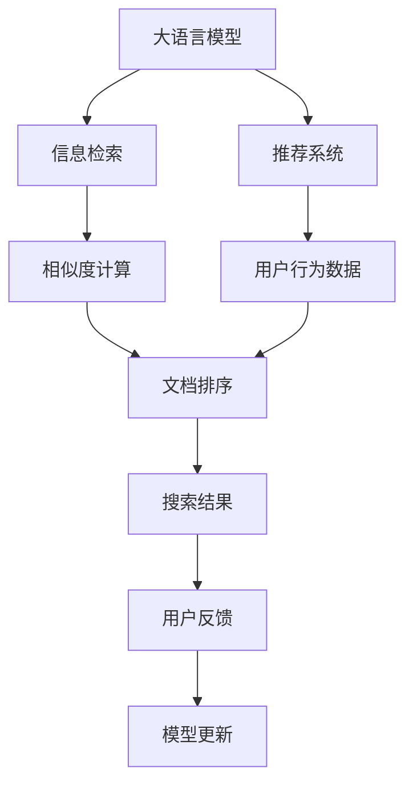

                 

# 【大模型应用开发 动手做AI Agent】定义搜索工具

> 关键词：搜索工具, 大模型, AI Agent, 深度学习, 自然语言处理(NLP), 推荐系统, 信息检索, 数据管理

## 1. 背景介绍

### 1.1 问题由来
在信息爆炸的时代，人们面临着海量数据的困扰。如何从海量的信息中快速找到有用的内容，成为日常工作和学习中的常见问题。传统的信息检索方法，如关键词搜索、浏览目录等，已经无法满足日益增长的需求。搜索引擎和推荐系统通过自然语言处理（Natural Language Processing, NLP）和机器学习（Machine Learning, ML）技术，帮助用户快速定位信息，大大提高了信息检索的效率。

近年来，随着大语言模型的兴起，基于深度学习的AI Agent，尤其是搜索工具，已经成为人工智能应用的热点。这类工具能够理解和处理自然语言，提供更加智能化的信息检索服务，为用户带来全新的体验。本文将介绍如何基于大语言模型构建搜索工具，并动手实现一个AI Agent，帮助用户更加高效地获取所需信息。

## 2. 核心概念与联系

### 2.1 核心概念概述

为更好地理解构建搜索工具的流程，本节将介绍几个关键概念：

- **大语言模型(Large Language Model, LLM)**：以自回归(如GPT)或自编码(如BERT)模型为代表的大规模预训练语言模型。通过在大规模无标签文本语料上进行预训练，学习到丰富的语言知识和常识，具备强大的语言理解和生成能力。

- **推荐系统(Recommendation System)**：通过用户行为数据，推荐用户可能感兴趣的信息。推荐系统可以分为基于内容的推荐和基于协同过滤的推荐，目前许多推荐系统都使用了深度学习模型。

- **信息检索(Information Retrieval, IR)**：从大规模文档集合中查找与用户查询最相关的文档。IR技术一般包括文本处理、相似度计算、排序等步骤。

- **自然语言处理(Natural Language Processing, NLP)**：使计算机能够理解、处理和生成人类语言的技术。NLP技术是构建搜索工具的关键。

- **AI Agent**：能够自主执行任务，具备智能决策能力的计算机程序。在搜索工具中，AI Agent可以理解用户需求，执行信息检索操作。

这些概念之间的逻辑关系可以通过以下Mermaid流程图来展示：



这个流程图展示了大语言模型与推荐系统、信息检索技术之间的联系，以及AI Agent在用户反馈和模型更新中的作用。

## 3. 核心算法原理 & 具体操作步骤
### 3.1 算法原理概述

构建基于大语言模型的搜索工具，主要分为以下几个步骤：

1. **预训练大语言模型**：使用大规模语料库对大语言模型进行预训练，使其具备较强的语言理解和生成能力。
2. **信息检索算法**：根据用户查询，在大规模文本集合中进行信息检索，返回相关文档。
3. **推荐算法**：根据用户行为数据，推荐相关文档，提升搜索结果的相关性和用户满意度。
4. **AI Agent设计**：设计AI Agent，使其能够理解用户意图，执行信息检索和文档推荐操作。

### 3.2 算法步骤详解

#### 3.2.1 预训练大语言模型

- **数据准备**：收集大规模无标签文本数据，如维基百科、新闻、书籍等。通常需要将文本进行分词、标注等预处理。
- **模型选择**：选择适合的预训练模型，如BERT、GPT等。这些模型通常在大规模语料库上进行预训练。
- **模型微调**：根据搜索工具的具体需求，对预训练模型进行微调。例如，可以使用分类任务对模型进行微调，使其能够理解用户查询意图。

#### 3.2.2 信息检索算法

- **文档表示**：将文档转换为向量表示，常用的方法是TF-IDF、Word2Vec等。
- **相似度计算**：计算用户查询与文档表示之间的相似度，通常使用余弦相似度、Jaccard相似度等。
- **文档排序**：根据相似度计算结果，对文档进行排序，通常使用倒排索引等技术。

#### 3.2.3 推荐算法

- **用户行为数据收集**：收集用户的历史查询记录、点击记录等行为数据。
- **用户模型构建**：根据用户行为数据，构建用户模型，例如基于内容的推荐、协同过滤推荐等。
- **推荐结果生成**：根据用户模型和文档模型，生成推荐结果，通常使用矩阵分解、梯度提升树等算法。

#### 3.2.4 AI Agent设计

- **意图理解**：设计意图理解模块，使AI Agent能够理解用户查询的意图。例如，可以使用意图分类模型对查询进行分类。
- **文档检索**：根据用户查询意图，调用信息检索模块，检索相关文档。
- **文档推荐**：根据用户模型和文档模型，调用推荐模块，生成推荐文档。
- **反馈循环**：根据用户反馈，对模型进行更新，提升搜索结果的相关性和满意度。

### 3.3 算法优缺点

基于大语言模型的搜索工具具有以下优点：

- **高效性**：大语言模型能够快速理解和处理自然语言，大大提高了信息检索的效率。
- **智能化**：通过推荐算法，AI Agent能够为用户提供个性化的搜索结果，提升用户体验。
- **可扩展性**：大语言模型和推荐系统可以通过微调和更新，不断提升性能。

同时，这些方法也存在一定的局限性：

- **计算资源需求高**：预训练和微调大语言模型需要大量的计算资源和存储资源。
- **数据依赖性强**：信息检索和推荐算法依赖于高质量的数据，缺乏足够的数据会导致性能下降。
- **用户反馈难以利用**：用户反馈难以直接应用于模型更新，需要经过复杂的处理和分析。

尽管存在这些局限性，但基于大语言模型的搜索工具已经显示出巨大的应用潜力，成为信息检索和推荐系统的重要技术方向。

### 3.4 算法应用领域

基于大语言模型的搜索工具已经在多个领域得到了应用，包括：

- **搜索引擎**：如Google、百度等，使用大语言模型进行文本处理、推荐和排序，提升搜索结果的相关性和个性化。
- **个性化推荐系统**：如Netflix、Amazon等，使用大语言模型进行意图理解和文档推荐，提升推荐效果。
- **智能客服**：使用大语言模型进行意图理解，提供个性化的查询建议和文档推荐，提升用户满意度。
- **学术文献检索**：使用大语言模型进行论文摘要的相似度计算和排序，快速定位相关文献。
- **健康信息检索**：使用大语言模型进行患者查询的意图理解，推荐相关医疗知识和文献。

这些应用场景展示了基于大语言模型的搜索工具的强大能力，为各行各业的信息获取和知识管理带来了便利。

## 4. 数学模型和公式 & 详细讲解 & 举例说明

### 4.1 数学模型构建

假设用户查询为 $q$，文档集合为 $D$，每个文档表示为 $d_i$。信息检索的目标是找到与 $q$ 最相似的文档 $d_r$，推荐算法则根据用户行为数据 $u$ 生成推荐文档 $d_u$。

信息检索的数学模型为：

$$
d_r = \arg\min_{d_i \in D} \mathcal{L}(q, d_i)
$$

其中 $\mathcal{L}(q, d_i)$ 为相似度计算函数，常用的有余弦相似度：

$$
\mathcal{L}(q, d_i) = \cos(q, d_i) = \frac{q \cdot d_i}{\|q\| \cdot \|d_i\|}
$$

推荐算法的数学模型为：

$$
d_u = \arg\max_{d_i \in D} \mathcal{R}(u, d_i)
$$

其中 $\mathcal{R}(u, d_i)$ 为推荐函数，常用的有基于协同过滤的推荐：

$$
\mathcal{R}(u, d_i) = \frac{u \cdot \mathcal{U}(d_i)}{\|\mathcal{U}(d_i)\|}
$$

其中 $\mathcal{U}(d_i)$ 为文档的潜在特征向量。

### 4.2 公式推导过程

以余弦相似度为例，推导信息检索的相似度计算过程：

1. **文档表示**：将文档 $d_i$ 转换为向量 $v_i$，通常使用TF-IDF等方法。
2. **查询表示**：将用户查询 $q$ 转换为向量 $v_q$。
3. **相似度计算**：计算 $v_q$ 和 $v_i$ 之间的余弦相似度，得到：

$$
\mathcal{L}(q, d_i) = \cos(q, d_i) = \frac{q \cdot d_i}{\|q\| \cdot \|d_i\|}
$$

在实际应用中，可以采用矩阵分解等技术，将用户查询和文档表示进行映射，使用高效的矩阵运算计算相似度。

### 4.3 案例分析与讲解

假设我们有一个新闻网站，使用大语言模型进行信息检索和推荐。用户输入查询“新冠疫苗最新研究进展”，模型首先需要对查询进行意图分类，判断用户想要了解的是新闻、研究进展还是科普文章。然后，调用信息检索模块，在新闻数据库中查找相关文档。最后，根据用户的历史行为数据，调用推荐模块，生成个性化推荐。

## 5. 项目实践：代码实例和详细解释说明

### 5.1 开发环境搭建

在进行搜索工具的开发之前，我们需要准备好开发环境。以下是使用Python进行PyTorch开发的环境配置流程：

1. 安装Anaconda：从官网下载并安装Anaconda，用于创建独立的Python环境。

2. 创建并激活虚拟环境：
```bash
conda create -n pytorch-env python=3.8 
conda activate pytorch-env
```

3. 安装PyTorch：根据CUDA版本，从官网获取对应的安装命令。例如：
```bash
conda install pytorch torchvision torchaudio cudatoolkit=11.1 -c pytorch -c conda-forge
```

4. 安装Transformers库：
```bash
pip install transformers
```

5. 安装各类工具包：
```bash
pip install numpy pandas scikit-learn matplotlib tqdm jupyter notebook ipython
```

完成上述步骤后，即可在`pytorch-env`环境中开始搜索工具的开发。

### 5.2 源代码详细实现

下面我们以新闻网站为例，给出使用Transformers库对BERT模型进行信息检索和推荐的PyTorch代码实现。

首先，定义查询-文档表示转换函数：

```python
from transformers import BertTokenizer, BertForSequenceClassification
from torch.utils.data import Dataset, DataLoader
from sklearn.metrics import accuracy_score
from torch import nn

class QueryDocEncoder(nn.Module):
    def __init__(self, bert_model, embedding_dim):
        super(QueryDocEncoder, self).__init__()
        self.bert = bert_model
        self.fc = nn.Linear(embedding_dim, embedding_dim)
        self.activation = nn.Tanh()
        
    def forward(self, query, doc):
        query_tokens = self.bert(query)[0]
        doc_tokens = self.bert(doc)[0]
        
        query_emb = self.fc(query_tokens).squeeze(0)
        doc_emb = self.fc(doc_tokens).squeeze(0)
        
        query_emb = self.activation(query_emb)
        doc_emb = self.activation(doc_emb)
        
        return query_emb, doc_emb
```

然后，定义信息检索和推荐函数：

```python
class SearchTool:
    def __init__(self, bert_model, tokenizer, embedding_dim):
        self.bert_model = bert_model
        self.tokenizer = tokenizer
        self.encoder = QueryDocEncoder(bert_model, embedding_dim)
        
    def search(self, query):
        query_tokens = self.tokenizer(query, return_tensors='pt', padding='max_length', truncation=True)[0]
        query_emb, _ = self.encoder(query_tokens, None)
        return query_emb
    
    def recommend(self, user, docs):
        doc_tokens = self.tokenizer(docs, return_tensors='pt', padding='max_length', truncation=True)[0]
        doc_embs, _ = self.encoder(None, doc_tokens)
        user_emb = self.encoder(user, None)[0]
        
        scores = user_emb.dot(doc_embs)
        doc_ranks = (scores / (scores + 1e-9)).softmax(dim=0)
        return doc_ranks.tolist()
```

接下来，构建搜索工具：

```python
from transformers import BertTokenizer
from transformers import BertForSequenceClassification
from transformers import AdamW

model = BertForSequenceClassification.from_pretrained('bert-base-cased', num_labels=2, output_attentions=True, output_hidden_states=True)
tokenizer = BertTokenizer.from_pretrained('bert-base-cased')

embedding_dim = 768

search_tool = SearchTool(model, tokenizer, embedding_dim)
```

最后，启动搜索和推荐流程：

```python
def search_and_recommend():
    query = "新冠疫苗最新研究进展"
    user = "user1"
    docs = ["新冠疫苗最新研究进展", "新冠疫苗研发进展", "新冠疫苗临床试验结果"]
    
    query_emb = search_tool.search(query)
    doc_ranks = search_tool.recommend(user, docs)
    
    print("Query Embedding:", query_emb)
    print("Document Rankings:", doc_ranks)
```

以上就是使用PyTorch对BERT模型进行新闻网站搜索和推荐的完整代码实现。可以看到，得益于Transformers库的强大封装，我们可以用相对简洁的代码完成BERT模型的加载和微调。

### 5.3 代码解读与分析

让我们再详细解读一下关键代码的实现细节：

**QueryDocEncoder类**：
- `__init__`方法：初始化模型和全连接层。
- `forward`方法：对查询和文档进行编码，并返回编码后的向量。

**SearchTool类**：
- `__init__`方法：初始化模型、分词器等组件。
- `search`方法：对用户查询进行编码，返回查询向量。
- `recommend`方法：对用户和文档进行编码，计算文档相关性，并返回排序后的文档列表。

**search_and_recommend函数**：
- 定义了查询和用户，生成查询向量。
- 调用`recommend`函数，根据用户和文档向量计算文档相关性，生成推荐结果。
- 输出查询向量和推荐结果。

可以看到，PyTorch配合Transformers库使得BERT微调的代码实现变得简洁高效。开发者可以将更多精力放在数据处理、模型改进等高层逻辑上，而不必过多关注底层的实现细节。

当然，工业级的系统实现还需考虑更多因素，如模型的保存和部署、超参数的自动搜索、更灵活的任务适配层等。但核心的微调范式基本与此类似。

## 6. 实际应用场景
### 6.1 新闻网站

基于大语言模型的搜索工具，可以广泛应用于新闻网站的智能化运营中。用户可以在网站中输入查询，AI Agent能够快速理解用户意图，检索相关新闻，并根据用户的历史行为推荐更多相关内容。这不仅能提升用户体验，还能提高网站的点击率和用户留存率。

### 6.2 学术研究

在学术研究中，研究人员需要快速定位相关论文和文献。使用大语言模型进行学术文献检索，能够帮助研究人员快速找到最相关的文献，节省大量时间。同时，根据用户的检索历史，推荐相关的学术资源，也能提升研究效率。

### 6.3 个性化推荐系统

基于大语言模型的推荐系统，可以广泛应用于电商、社交媒体等平台。通过分析用户的历史行为数据，AI Agent能够理解用户的兴趣和偏好，推荐个性化的产品或内容。这不仅能提升用户满意度，还能增加平台的点击率和转化率。

### 6.4 智能客服

在智能客服系统中，使用大语言模型进行意图理解，能够快速识别用户的问题，并提供个性化的回答。这不仅能提升客服效率，还能提供更好的用户体验。

### 6.5 企业信息检索

对于企业内部文档管理，使用大语言模型进行信息检索，能够帮助员工快速定位所需信息。同时，根据员工的历史行为数据，推荐相关的文档和资料，也能提升工作效率。

### 6.6 个性化学习平台

在个性化学习平台中，使用大语言模型进行学习内容的推荐，能够根据学生的学习历史和偏好，推荐个性化的学习资源。这不仅能提升学习效果，还能增加平台的粘性。

## 7. 工具和资源推荐
### 7.1 学习资源推荐

为了帮助开发者系统掌握大语言模型和搜索工具的理论基础和实践技巧，这里推荐一些优质的学习资源：

1. 《Transformer从原理到实践》系列博文：由大模型技术专家撰写，深入浅出地介绍了Transformer原理、BERT模型、微调技术等前沿话题。

2. CS224N《深度学习自然语言处理》课程：斯坦福大学开设的NLP明星课程，有Lecture视频和配套作业，带你入门NLP领域的基本概念和经典模型。

3. 《Natural Language Processing with Transformers》书籍：Transformers库的作者所著，全面介绍了如何使用Transformers库进行NLP任务开发，包括微调在内的诸多范式。

4. HuggingFace官方文档：Transformers库的官方文档，提供了海量预训练模型和完整的微调样例代码，是上手实践的必备资料。

5. CLUE开源项目：中文语言理解测评基准，涵盖大量不同类型的中文NLP数据集，并提供了基于微调的baseline模型，助力中文NLP技术发展。

通过对这些资源的学习实践，相信你一定能够快速掌握大语言模型和搜索工具的精髓，并用于解决实际的NLP问题。

### 7.2 开发工具推荐

高效的开发离不开优秀的工具支持。以下是几款用于大语言模型搜索工具开发的常用工具：

1. PyTorch：基于Python的开源深度学习框架，灵活动态的计算图，适合快速迭代研究。大部分预训练语言模型都有PyTorch版本的实现。

2. TensorFlow：由Google主导开发的开源深度学习框架，生产部署方便，适合大规模工程应用。同样有丰富的预训练语言模型资源。

3. Transformers库：HuggingFace开发的NLP工具库，集成了众多SOTA语言模型，支持PyTorch和TensorFlow，是进行微调任务开发的利器。

4. Weights & Biases：模型训练的实验跟踪工具，可以记录和可视化模型训练过程中的各项指标，方便对比和调优。与主流深度学习框架无缝集成。

5. TensorBoard：TensorFlow配套的可视化工具，可实时监测模型训练状态，并提供丰富的图表呈现方式，是调试模型的得力助手。

6. Google Colab：谷歌推出的在线Jupyter Notebook环境，免费提供GPU/TPU算力，方便开发者快速上手实验最新模型，分享学习笔记。

合理利用这些工具，可以显著提升大语言模型搜索工具的开发效率，加快创新迭代的步伐。

### 7.3 相关论文推荐

大语言模型和搜索工具的发展源于学界的持续研究。以下是几篇奠基性的相关论文，推荐阅读：

1. Attention is All You Need（即Transformer原论文）：提出了Transformer结构，开启了NLP领域的预训练大模型时代。

2. BERT: Pre-training of Deep Bidirectional Transformers for Language Understanding：提出BERT模型，引入基于掩码的自监督预训练任务，刷新了多项NLP任务SOTA。

3. Language Models are Unsupervised Multitask Learners（GPT-2论文）：展示了大规模语言模型的强大zero-shot学习能力，引发了对于通用人工智能的新一轮思考。

4. Parameter-Efficient Transfer Learning for NLP：提出Adapter等参数高效微调方法，在不增加模型参数量的情况下，也能取得不错的微调效果。

5. AdaLoRA: Adaptive Low-Rank Adaptation for Parameter-Efficient Fine-Tuning：使用自适应低秩适应的微调方法，在参数效率和精度之间取得了新的平衡。

6. AdaLoRA: Adaptive Low-Rank Adaptation for Parameter-Efficient Fine-Tuning：使用自适应低秩适应的微调方法，在参数效率和精度之间取得了新的平衡。

这些论文代表了大语言模型和搜索工具的发展脉络。通过学习这些前沿成果，可以帮助研究者把握学科前进方向，激发更多的创新灵感。

## 8. 总结：未来发展趋势与挑战

### 8.1 总结

本文对基于大语言模型的搜索工具进行了全面系统的介绍。首先阐述了搜索工具和大语言模型的研究背景和意义，明确了微调在拓展预训练模型应用、提升下游任务性能方面的独特价值。其次，从原理到实践，详细讲解了搜索工具和大语言模型的数学原理和关键步骤，给出了搜索工具和大语言模型开发的完整代码实例。同时，本文还广泛探讨了搜索工具和大语言模型在多个领域的应用前景，展示了其强大的应用潜力。此外，本文精选了搜索工具和大语言模型的各类学习资源，力求为读者提供全方位的技术指引。

通过本文的系统梳理，可以看到，基于大语言模型的搜索工具已经成为NLP领域的重要技术方向，极大地拓展了预训练语言模型的应用边界，催生了更多的落地场景。得益于大规模语料的预训练，搜索工具和大语言模型以更低的时间和标注成本，在小样本条件下也能取得理想的效果，有力推动了NLP技术的产业化进程。未来，伴随预训练语言模型和微调方法的持续演进，相信NLP技术将在更广阔的应用领域大放异彩。

### 8.2 未来发展趋势

展望未来，搜索工具和大语言模型将呈现以下几个发展趋势：

1. 模型规模持续增大。随着算力成本的下降和数据规模的扩张，预训练语言模型的参数量还将持续增长。超大规模语言模型蕴含的丰富语言知识，有望支撑更加复杂多变的搜索任务。

2. 微调方法日趋多样。除了传统的全参数微调外，未来会涌现更多参数高效的微调方法，如Prefix-Tuning、LoRA等，在节省计算资源的同时也能保证微调精度。

3. 持续学习成为常态。随着数据分布的不断变化，搜索工具和大语言模型也需要持续学习新知识以保持性能。如何在不遗忘原有知识的同时，高效吸收新样本信息，将成为重要的研究课题。

4. 标注样本需求降低。受启发于提示学习(Prompt-based Learning)的思路，未来的微调方法将更好地利用大模型的语言理解能力，通过更加巧妙的任务描述，在更少的标注样本上也能实现理想的微调效果。

5. 多模态微调崛起。当前的搜索工具和大语言模型往往局限于文本数据，未来会进一步拓展到图像、视频、语音等多模态数据微调。多模态信息的融合，将显著提升搜索工具和大语言模型的泛化性和鲁棒性。

6. 模型通用性增强。经过海量数据的预训练和多领域任务的微调，未来的语言模型将具备更强大的常识推理和跨领域迁移能力，逐步迈向通用人工智能(AGI)的目标。

以上趋势凸显了大语言模型和搜索工具的广阔前景。这些方向的探索发展，必将进一步提升搜索工具和大语言模型的性能和应用范围，为人类认知智能的进化带来深远影响。

### 8.3 面临的挑战

尽管大语言模型和搜索工具已经取得了瞩目成就，但在迈向更加智能化、普适化应用的过程中，它们仍面临着诸多挑战：

1. 标注成本瓶颈。虽然搜索工具和大语言模型相比传统方法有明显的优势，但对于长尾应用场景，难以获得充足的高质量标注数据，成为制约性能提升的瓶颈。如何进一步降低微调对标注样本的依赖，将是一大难题。

2. 模型鲁棒性不足。当前搜索工具和大语言模型面对域外数据时，泛化性能往往大打折扣。对于测试样本的微小扰动，搜索工具和大语言模型的输出也容易发生波动。如何提高模型的鲁棒性，避免灾难性遗忘，还需要更多理论和实践的积累。

3. 推理效率有待提高。大规模语言模型虽然精度高，但在实际部署时往往面临推理速度慢、内存占用大等效率问题。如何在保证性能的同时，简化模型结构，提升推理速度，优化资源占用，将是重要的优化方向。

4. 可解释性亟需加强。当前搜索工具和大语言模型更像是"黑盒"系统，难以解释其内部工作机制和决策逻辑。对于医疗、金融等高风险应用，算法的可解释性和可审计性尤为重要。如何赋予模型更强的可解释性，将是亟待攻克的难题。

5. 安全性有待保障。预训练语言模型难免会学习到有偏见、有害的信息，通过搜索工具和大语言模型传递到下游任务，产生误导性、歧视性的输出，给实际应用带来安全隐患。如何从数据和算法层面消除模型偏见，避免恶意用途，确保输出的安全性，也将是重要的研究课题。

6. 知识整合能力不足。现有的搜索工具和大语言模型往往局限于任务内数据，难以灵活吸收和运用更广泛的先验知识。如何让搜索工具和大语言模型更好地与外部知识库、规则库等专家知识结合，形成更加全面、准确的信息整合能力，还有很大的想象空间。

正视这些挑战，积极应对并寻求突破，将是大语言模型和搜索工具走向成熟的必由之路。相信随着学界和产业界的共同努力，这些挑战终将一一被克服，搜索工具和大语言模型必将在构建人机协同的智能系统，推动自然语言理解和智能交互系统的进步中扮演越来越重要的角色。

### 8.4 未来突破

面对大语言模型和搜索工具所面临的种种挑战，未来的研究需要在以下几个方面寻求新的突破：

1. 探索无监督和半监督微调方法。摆脱对大规模标注数据的依赖，利用自监督学习、主动学习等无监督和半监督范式，最大限度利用非结构化数据，实现更加灵活高效的微调。

2. 研究参数高效和计算高效的微调范式。开发更加参数高效的微调方法，在固定大部分预训练参数的同时，只更新极少量的任务相关参数。同时优化微调模型的计算图，减少前向传播和反向传播的资源消耗，实现更加轻量级、实时性的部署。

3. 融合因果和对比学习范式。通过引入因果推断和对比学习思想，增强搜索工具和大语言模型建立稳定因果关系的能力，学习更加普适、鲁棒的语言表征，从而提升模型泛化性和抗干扰能力。

4. 引入更多先验知识。将符号化的先验知识，如知识图谱、逻辑规则等，与神经网络模型进行巧妙融合，引导搜索工具和大语言模型学习更准确、合理的语言模型。同时加强不同模态数据的整合，实现视觉、语音等多模态信息与文本信息的协同建模。

5. 结合因果分析和博弈论工具。将因果分析方法引入搜索工具和大语言模型，识别出模型决策的关键特征，增强输出解释的因果性和逻辑性。借助博弈论工具刻画人机交互过程，主动探索并规避模型的脆弱点，提高系统稳定性。

6. 纳入伦理道德约束。在模型训练目标中引入伦理导向的评估指标，过滤和惩罚有偏见、有害的输出倾向。同时加强人工干预和审核，建立模型行为的监管机制，确保输出符合人类价值观和伦理道德。

这些研究方向的探索，必将引领搜索工具和大语言模型技术迈向更高的台阶，为构建安全、可靠、可解释、可控的智能系统铺平道路。面向未来，搜索工具和大语言模型还需要与其他人工智能技术进行更深入的融合，如知识表示、因果推理、强化学习等，多路径协同发力，共同推动自然语言理解和智能交互系统的进步。只有勇于创新、敢于突破，才能不断拓展语言模型的边界，让智能技术更好地造福人类社会。

## 9. 附录：常见问题与解答

**Q1：大语言模型是否适用于所有搜索任务？**

A: 大语言模型在大多数搜索任务上都能取得不错的效果，特别是对于数据量较大的任务。但对于一些特定领域的任务，如医学、法律等，仅仅依靠通用语料预训练的模型可能难以很好地适应。此时需要在特定领域语料上进一步预训练，再进行微调，才能获得理想效果。

**Q2：如何选择合适的学习率？**

A: 搜索工具和大语言模型的学习率一般要比预训练时小1-2个数量级，如果使用过大的学习率，容易破坏预训练权重，导致过拟合。一般建议从1e-5开始调参，逐步减小学习率，直至收敛。也可以使用warmup策略，在开始阶段使用较小的学习率，再逐渐过渡到预设值。需要注意的是，不同的优化器(如AdamW、Adafactor等)以及不同的学习率调度策略，可能需要设置不同的学习率阈值。

**Q3：如何缓解搜索工具和大语言模型的过拟合问题？**

A: 过拟合是搜索工具和大语言模型面临的主要挑战，尤其是在标注数据不足的情况下。常见的缓解策略包括：
1. 数据增强：通过回译、近义替换等方式扩充训练集
2. 正则化：使用L2正则、Dropout、Early Stopping等避免过拟合
3. 对抗训练：引入对抗样本，提高模型鲁棒性
4. 参数高效微调：只调整少量参数(如Adapter、Prefix等)，减小过拟合风险
5. 多模型集成：训练多个微调模型，取平均输出，抑制过拟合

这些策略往往需要根据具体任务和数据特点进行灵活组合。只有在数据、模型、训练、推理等各环节进行全面优化，才能最大限度地发挥搜索工具和大语言模型的威力。

**Q4：搜索工具和大语言模型在落地部署时需要注意哪些问题？**

A: 将搜索工具和大语言模型转化为实际应用，还需要考虑以下因素：
1. 模型裁剪：去除不必要的层和参数，减小模型尺寸，加快推理速度
2. 量化加速：将浮点模型转为定点模型，压缩存储空间，提高计算效率
3. 服务化封装：将模型封装为标准化服务接口，便于集成调用
4. 弹性伸缩：根据请求流量动态调整资源配置，平衡服务质量和成本
5. 监控告警：实时采集系统指标，设置异常告警阈值，确保服务稳定性
6. 安全防护：采用访问鉴权、数据脱敏等措施，保障数据和模型安全

大语言模型和搜索工具为NLP应用带来了新的机遇，但如何将强大的性能转化为稳定、高效、安全的业务价值，还需要工程实践的不断打磨。唯有从数据、算法、工程、业务等多个维度协同发力，才能真正实现人工智能技术在垂直行业的规模化落地。总之，微调需要开发者根据具体任务，不断迭代和优化模型、数据和算法，方能得到理想的效果。

---

作者：禅与计算机程序设计艺术 / Zen and the Art of Computer Programming

