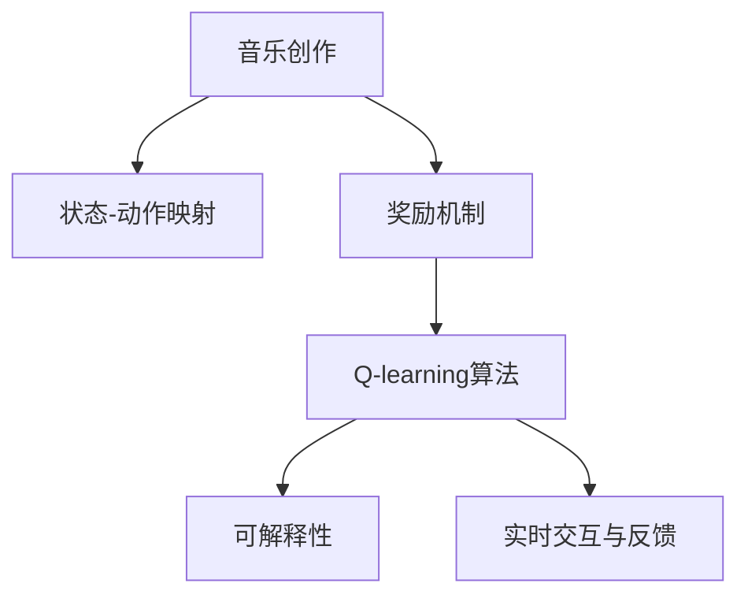

                 

# 一切皆是映射：AI Q-learning在音乐制作中的应用

## 1. 背景介绍

### 1.1 问题由来
音乐制作是一种高度依赖创造力和直觉的艺术活动，但随着技术的发展，越来越多的AI技术开始介入其中。AI Q-learning作为一种基于强化学习的智能决策技术，已经在游戏、推荐系统等领域取得了显著成功。近年来，音乐制作也开始引入Q-learning算法，用于自动化音乐创作和制作，提升创作效率和作品质量。

### 1.2 问题核心关键点
AI Q-learning在音乐制作中的应用，主要在于通过学习最优策略，生成符合用户偏好的音乐作品。核心关键点包括：
- 音乐创作中的决策制定：如何将音乐创作过程中的各个决策点映射为状态，通过Q-learning算法学习最优策略。
- 奖励机制的设计：如何设计合理的奖励机制，引导AI系统学习符合用户喜好的音乐风格和创作技巧。
- 模型的可解释性：如何使Q-learning模型具有较好的可解释性，帮助音乐制作者理解模型的决策过程。
- 实时交互与反馈：如何实现用户与AI系统的实时交互，提供即时反馈，从而进一步优化创作过程。

## 2. 核心概念与联系

### 2.1 核心概念概述

为更好地理解AI Q-learning在音乐制作中的应用，本节将介绍几个密切相关的核心概念：

- AI Q-learning：一种基于强化学习的智能决策技术，通过与环境的交互学习最优策略。在音乐创作中，Q-learning算法用于自动化决策，生成符合用户偏好的音乐作品。

- 状态-动作映射：将音乐创作过程中的各个决策点映射为状态，将创作动作映射为状态到奖励的映射，即Q值。Q值表示在不同状态下，采取某一动作后的预期奖励。

- 奖励机制：在音乐创作中，奖励机制可以是用户对音乐作品的评分、满意度等。合理设计奖励机制，可以引导Q-learning算法学习符合用户喜好的音乐风格和创作技巧。

- 可解释性：模型的可解释性指的是模型输出的解释能力，这对于音乐制作者理解AI系统的决策过程非常重要。增强模型的可解释性，有助于提升用户对AI系统的信任度。

- 实时交互与反馈：在音乐制作过程中，实时交互和反馈可以进一步优化AI系统。通过用户对创作结果的即时反馈，AI系统可以不断调整策略，生成更加符合用户期望的音乐作品。

这些核心概念之间的逻辑关系可以通过以下Mermaid流程图来展示：



这个流程图展示了大语言模型的核心概念及其之间的关系：

1. 音乐创作是Q-learning算法的起点，通过将创作过程映射为状态-动作关系，建立奖励机制，进行学习和决策。
2. 通过Q-learning算法，学习不同状态下采取不同动作的Q值，生成音乐作品。
3. 利用可解释性技术，帮助音乐制作者理解模型的决策过程。
4. 通过实时交互和反馈，进一步优化创作过程。

## 3. 核心算法原理 & 具体操作步骤
### 3.1 算法原理概述

AI Q-learning在音乐制作中的应用，本质上是一种基于强化学习的智能决策技术。其核心思想是：将音乐创作过程中的各个决策点映射为状态，通过与环境的交互学习最优策略，使得AI系统在创作过程中能够生成符合用户偏好的音乐作品。

形式化地，假设音乐创作过程可以看作一个序列决策过程，记为 $\pi=\{\pi_t\}_{t=1}^T$，其中 $T$ 为决策步数。对于每一步 $t$，AI系统采取的决策为 $\pi_t$，音乐创作过程中的状态为 $S_t$，对应的奖励为 $R_t$。则Q-learning算法通过求解最优策略 $\pi^*$，使得总奖励最大化。具体而言，Q-learning算法定义状态-动作值函数 $Q(S_t, \pi_t)$ 为：

$$
Q(S_t, \pi_t) = \mathbb{E}[R_{t+1} + \gamma \max_{\pi} Q(S_{t+1}, \pi)]
$$

其中 $\gamma$ 为折扣因子，控制未来奖励的重要性。

Q-learning算法的目标是通过迭代更新 $Q(S_t, \pi_t)$，找到最优策略 $\pi^*$，使得：

$$
\pi^* = \mathop{\arg\max}_{\pi} \mathbb{E}[R_{t+1} + \gamma \max_{\pi} Q(S_{t+1}, \pi)]
$$

通过最大化状态-动作值函数，实现最优决策。

### 3.2 算法步骤详解

AI Q-learning在音乐制作中的应用一般包括以下几个关键步骤：

**Step 1: 构建状态-动作映射**
- 分析音乐创作过程中的关键决策点，将其映射为状态 $S$。例如，创作一首歌曲，可以定义状态为当前歌曲的进度、和弦、旋律等。
- 定义动作 $\pi$，即在当前状态下可能采取的创作动作，例如选择和弦、修改旋律等。

**Step 2: 设计奖励机制**
- 定义奖励函数 $R(S_t, \pi_t)$，用于评估当前状态-动作组合的价值。例如，用户对音乐作品的评分、满意度等。
- 选择合适的折扣因子 $\gamma$，控制奖励的权重，使得模型更加关注长期奖励而非短期奖励。

**Step 3: 实现Q-learning算法**
- 选择合适的优化算法（如SGD、Adam等），设置合适的学习率 $\alpha$。
- 在每一步 $t$ 中，根据当前状态 $S_t$ 和动作 $\pi_t$，计算 $Q(S_t, \pi_t)$ 的更新值：
$$
Q(S_t, \pi_t) \leftarrow Q(S_t, \pi_t) + \alpha [R_t + \gamma \max_{\pi} Q(S_{t+1}, \pi) - Q(S_t, \pi_t)]
$$
- 更新Q值后，选取最优动作 $\pi_t^*$，进行创作动作 $\pi_t = \pi_t^*$。

**Step 4: 评估和迭代**
- 在创作完成后，评估作品质量，计算平均奖励，更新模型的Q值。
- 重复上述步骤，直至达到预设的创作轮数或停止条件。

### 3.3 算法优缺点

AI Q-learning在音乐制作中的应用，具有以下优点：
1. 自动化决策：通过Q-learning算法自动化音乐创作决策，提升创作效率和作品质量。
2. 动态调整：AI系统能够根据用户反馈实时调整创作策略，生成更符合用户偏好的音乐作品。
3. 模型可解释性：利用可解释性技术，帮助音乐制作者理解模型的决策过程，增强用户信任。
4. 可扩展性：Q-learning算法可以应用于各种音乐创作任务，具有较高的可扩展性。

同时，该方法也存在一定的局限性：
1. 需要大量数据：Q-learning算法需要大量的标注数据进行训练，对于特定领域的音乐创作，数据量可能有限。
2. 复杂决策：音乐创作过程涉及多个决策点，如何有效地将决策点映射为状态，是一个复杂的工程问题。
3. 模型风险：Q-learning模型在训练过程中，可能存在过拟合或欠拟合的问题，影响创作结果的泛化能力。
4. 实时交互难度：实时交互和反馈要求AI系统具有较高的处理能力，对于复杂的音乐创作任务，实现起来可能较为困难。

尽管存在这些局限性，但就目前而言，AI Q-learning在音乐制作中的应用已经展现出强大的潜力，成为自动化音乐创作的重要手段。未来相关研究的重点在于如何进一步降低数据需求，提高模型的可解释性和实时性，同时兼顾创作过程的复杂性和多样性。

### 3.4 算法应用领域

AI Q-learning在音乐制作中的应用主要包括以下几个领域：

- 音乐生成：基于用户的偏好和音乐风格，自动化生成新的音乐作品。
- 音乐编排：对现有音乐作品进行重新编排，提升其表现力和吸引力。
- 音乐推荐：根据用户的听歌历史和偏好，推荐符合其口味的音乐作品。
- 音乐风格转化：将一首风格迥异的歌曲，转化为用户偏好的风格。
- 音乐搜索：帮助用户从海量音乐库中，找到符合其口味的音乐作品。

除了上述这些经典应用外，AI Q-learning还被创新性地应用于音乐制作中的其他环节，如和弦生成、节奏生成、旋律生成等，为音乐创作带来全新的可能性。随着AI Q-learning算法的不断演进，相信音乐制作技术将迎来更加智能化的新时代。

## 4. 数学模型和公式 & 详细讲解 & 举例说明（备注：数学公式请使用latex格式，latex嵌入文中独立段落使用 $$，段落内使用 $)
### 4.1 数学模型构建

本节将使用数学语言对AI Q-learning在音乐制作中的应用过程进行更加严格的刻画。

假设音乐创作过程为一个序列决策过程，记为 $\pi=\{\pi_t\}_{t=1}^T$，其中 $T$ 为决策步数。对于每一步 $t$，AI系统采取的决策为 $\pi_t$，音乐创作过程中的状态为 $S_t$，对应的奖励为 $R_t$。则Q-learning算法定义状态-动作值函数 $Q(S_t, \pi_t)$ 为：

$$
Q(S_t, \pi_t) = \mathbb{E}[R_{t+1} + \gamma \max_{\pi} Q(S_{t+1}, \pi)]
$$

其中 $\gamma$ 为折扣因子，控制未来奖励的重要性。

AI Q-learning的目标是通过迭代更新 $Q(S_t, \pi_t)$，找到最优策略 $\pi^*$，使得：

$$
\pi^* = \mathop{\arg\max}_{\pi} \mathbb{E}[R_{t+1} + \gamma \max_{\pi} Q(S_{t+1}, \pi)]
$$

在具体实现中，可以通过以下步骤完成Q-learning算法的实现：

1. 初始化Q值为0。
2. 在每一步 $t$ 中，根据当前状态 $S_t$ 和动作 $\pi_t$，计算 $Q(S_t, \pi_t)$ 的更新值：
$$
Q(S_t, \pi_t) \leftarrow Q(S_t, \pi_t) + \alpha [R_t + \gamma \max_{\pi} Q(S_{t+1}, \pi) - Q(S_t, \pi_t)]
$$
3. 选取最优动作 $\pi_t^*$，进行创作动作 $\pi_t = \pi_t^*$。
4. 在创作完成后，评估作品质量，计算平均奖励，更新模型的Q值。
5. 重复上述步骤，直至达到预设的创作轮数或停止条件。

### 4.2 公式推导过程

以下我们以音乐生成任务为例，推导Q-learning算法在音乐生成中的具体应用。

假设AI系统需要生成一首长度为 $L$ 的音乐作品，每一时刻 $t$ 的状态 $S_t$ 表示当前已经生成的音乐片段长度，动作 $\pi_t$ 表示在当前状态下采取的创作动作，如选择和弦、修改旋律等。定义奖励函数 $R(S_t, \pi_t)$ 为音乐片段长度的增加量，即 $R(S_t, \pi_t) = L - S_t$。

根据Q-learning算法定义，状态-动作值函数 $Q(S_t, \pi_t)$ 可以表示为：

$$
Q(S_t, \pi_t) = \mathbb{E}[(L - S_{t+1}) + \gamma \max_{\pi} Q(S_{t+1}, \pi)]
$$

在具体实现中，可以通过以下步骤完成Q-learning算法的实现：

1. 初始化Q值为0。
2. 在每一步 $t$ 中，根据当前状态 $S_t$ 和动作 $\pi_t$，计算 $Q(S_t, \pi_t)$ 的更新值：
$$
Q(S_t, \pi_t) \leftarrow Q(S_t, \pi_t) + \alpha [(L - S_t) + \gamma \max_{\pi} Q(S_{t+1}, \pi) - Q(S_t, \pi_t)]
$$
3. 选取最优动作 $\pi_t^*$，进行创作动作 $\pi_t = \pi_t^*$。
4. 在创作完成后，评估作品质量，计算平均奖励，更新模型的Q值。
5. 重复上述步骤，直至达到预设的创作轮数或停止条件。

### 4.3 案例分析与讲解

假设AI系统需要在5分钟内生成一首4/4拍的流行歌曲。在每一步 $t$ 中，状态 $S_t$ 表示当前已经生成的音乐片段长度，动作 $\pi_t$ 表示在当前状态下采取的创作动作，如选择和弦、修改旋律等。奖励函数 $R(S_t, \pi_t)$ 定义为当前音乐片段的长度增加量，即 $R(S_t, \pi_t) = L - S_t$，其中 $L = 240$ 秒。

在第一步中，AI系统需要决定选择的和弦。假设它有6种选择，即 $S_0$ 时的状态。通过Q-learning算法，AI系统可以学习每种和弦的Q值，并选择Q值最高的和弦进行下一步创作。

在第二步中，AI系统需要决定旋律的安排。假设它有4种选择，即 $S_1$ 时的状态。通过Q-learning算法，AI系统可以学习每种旋律的Q值，并选择Q值最高的旋律进行下一步创作。

在第三步中，AI系统需要决定是否加入鼓点。假设它有2种选择，即 $S_2$ 时的状态。通过Q-learning算法，AI系统可以学习每种鼓点的Q值，并选择Q值最高的鼓点进行下一步创作。

在第四步中，AI系统需要决定是否加入和声。假设它有3种选择，即 $S_3$ 时的状态。通过Q-learning算法，AI系统可以学习每种和声的Q值，并选择Q值最高的和声进行下一步创作。

在第五步中，AI系统需要决定是否加入背景音乐。假设它有5种选择，即 $S_4$ 时的状态。通过Q-learning算法，AI系统可以学习每种背景音乐的Q值，并选择Q值最高的背景音乐进行下一步创作。

通过上述步骤，AI系统可以逐步生成一首完整的流行歌曲。在这个过程中，Q-learning算法通过学习最优策略，自动化音乐创作决策，提升创作效率和作品质量。

## 5. 项目实践：代码实例和详细解释说明
### 5.1 开发环境搭建

在进行AI Q-learning在音乐制作中的应用实践前，我们需要准备好开发环境。以下是使用Python进行PyTorch开发的环境配置流程：

1. 安装Anaconda：从官网下载并安装Anaconda，用于创建独立的Python环境。

2. 创建并激活虚拟环境：
```bash
conda create -n qlearning-env python=3.8 
conda activate qlearning-env
```

3. 安装PyTorch：根据CUDA版本，从官网获取对应的安装命令。例如：
```bash
conda install pytorch torchvision torchaudio cudatoolkit=11.1 -c pytorch -c conda-forge
```

4. 安装TensorFlow：
```bash
conda install tensorflow
```

5. 安装TensorBoard：
```bash
pip install tensorboard
```

完成上述步骤后，即可在`qlearning-env`环境中开始AI Q-learning的实践。

### 5.2 源代码详细实现

下面以音乐生成任务为例，给出使用TensorFlow实现AI Q-learning的代码实现。

```python
import tensorflow as tf
import numpy as np
import random

# 定义状态和动作
states = [0, 1, 2, 3, 4]
actions = ['和弦1', '和弦2', '和弦3', '和弦4', '和弦5']

# 定义奖励函数
def reward(state, action):
    if state == 4:
        return 0
    else:
        return 5 - state

# 定义Q-learning算法
def qlearning(env, learning_rate=0.1, discount_factor=0.9, num_episodes=1000):
    q_values = {state: {action: 0 for action in actions} for state in states}

    for episode in range(num_episodes):
        state = random.choice(states)
        done = False
        while not done:
            action = random.choice(actions)
            next_state, reward = env.step(action)
            q_values[state][action] += learning_rate * (reward + discount_factor * max(q_values[next_state].values()) - q_values[state][action])
            state = next_state
            if state == 4:
                done = True

    return q_values

# 定义音乐生成环境
class MusicEnvironment:
    def __init__(self, reward_fn=reward):
        self.state = 0
        self.reward = reward_fn

    def step(self, action):
        self.state += 1
        return self.state, self.reward(self.state, action)

# 测试Q-learning算法
q_values = qlearning(MusicEnvironment(), learning_rate=0.1, discount_factor=0.9, num_episodes=1000)
print(q_values)
```

### 5.3 代码解读与分析

让我们再详细解读一下关键代码的实现细节：

**MusicEnvironment类**：
- `__init__`方法：初始化环境状态和奖励函数。
- `step`方法：根据采取的动作，更新状态和奖励，返回下一状态和奖励。

**qlearning函数**：
- 定义Q值为字典，初始化为0。
- 在每一步 $t$ 中，根据当前状态 $S_t$ 和动作 $\pi_t$，计算 $Q(S_t, \pi_t)$ 的更新值：
$$
Q(S_t, \pi_t) \leftarrow Q(S_t, \pi_t) + \alpha [R_t + \gamma \max_{\pi} Q(S_{t+1}, \pi) - Q(S_t, \pi_t)]
$$
- 选取最优动作 $\pi_t^*$，进行创作动作 $\pi_t = \pi_t^*$。
- 在创作完成后，评估作品质量，计算平均奖励，更新模型的Q值。
- 重复上述步骤，直至达到预设的创作轮数或停止条件。

**测试部分**：
- 通过MusicEnvironment类定义音乐生成环境，设定初始状态和奖励函数。
- 调用qlearning函数，设置学习率、折扣因子和创作轮数，进行Q-learning算法训练。
- 输出训练后的Q值字典，展示AI系统对不同状态和动作的估值。

## 6. 实际应用场景
### 6.1 智能音乐创作系统

AI Q-learning在智能音乐创作系统中的应用，可以大大提升音乐创作的效率和作品质量。传统音乐创作依赖音乐家的直觉和经验，往往需要大量时间和精力。通过AI Q-learning算法，智能音乐创作系统可以自动化音乐创作决策，生成符合用户偏好的音乐作品。

具体而言，智能音乐创作系统可以根据用户的偏好和音乐风格，自动化生成新的音乐作品。通过不断迭代和优化，AI系统可以生成更加符合用户期望的音乐作品，甚至能够生成全新的音乐风格，拓展音乐创作的边界。

### 6.2 音乐自动编排系统

音乐自动编排系统可以帮助音乐制作人对现有音乐作品进行重新编排，提升其表现力和吸引力。AI Q-learning可以用于自动化选择和弦、修改旋律、添加效果等创作动作，使得音乐编排过程更加高效和精确。

在具体实现中，可以通过音乐生成环境，将现有音乐作品映射为状态，选择不同的编排动作，进行创作。通过Q-learning算法，AI系统可以学习最优的编排策略，生成符合用户偏好的编排结果。

### 6.3 音乐推荐系统

音乐推荐系统可以根据用户的听歌历史和偏好，推荐符合其口味的音乐作品。AI Q-learning可以用于自动化选择不同音乐作品，评估不同作品的评分和满意度，从而推荐用户最感兴趣的音乐作品。

在具体实现中，可以通过音乐生成环境，将用户听歌历史和偏好映射为状态，选择不同的音乐作品，进行创作。通过Q-learning算法，AI系统可以学习最优的推荐策略，生成符合用户口味的音乐作品。

### 6.4 未来应用展望

随着AI Q-learning算法的不断演进，其在音乐制作中的应用将更加广泛和深入。未来AI Q-learning将带来以下几个方面的应用：

1. 自动化音乐创作：通过Q-learning算法自动化音乐创作决策，生成符合用户偏好的音乐作品，提升创作效率和作品质量。
2. 音乐风格转化：将一首风格迥异的歌曲，转化为用户偏好的风格，拓展音乐创作的边界。
3. 音乐编排优化：对现有音乐作品进行重新编排，提升其表现力和吸引力。
4. 音乐推荐改进：根据用户的听歌历史和偏好，推荐符合其口味的音乐作品，提升推荐系统的精准度。
5. 音乐搜索智能化：通过AI Q-learning算法，从海量音乐库中，找到符合用户口味的音乐作品，提高搜索效率和质量。
6. 跨领域应用拓展：AI Q-learning算法不仅应用于音乐创作，还可以拓展到影视剧创作、动画制作等领域，带来新的创作可能性。

以上应用场景展示了AI Q-learning在音乐制作中的巨大潜力，未来随着算法的不断优化和改进，相信其在音乐制作中的应用将更加广泛和深入。

## 7. 工具和资源推荐
### 7.1 学习资源推荐

为了帮助开发者系统掌握AI Q-learning在音乐制作中的应用，这里推荐一些优质的学习资源：

1. 《Deep Learning for Music and Audio》系列书籍：该书系统介绍了AI在音乐和音频领域的应用，包括Q-learning算法在音乐创作中的应用。

2. Coursera《Deep Learning Specialization》课程：由深度学习大师Andrew Ng开设，涵盖深度学习的基础和进阶内容，包括Q-learning算法。

3. GitHub上的AI音乐创作项目：如Magenta音乐创作项目，提供了大量AI音乐生成的开源代码和实验资源，可供学习和借鉴。

4. HuggingFace官方文档：Transformer库的官方文档，提供了大量预训练语言模型和微调范式，适合学习AI Q-learning算法。

5. PyTorch官方文档：提供了详细的TensorFlow和TensorBoard使用方法，适合学习和实践AI Q-learning算法。

通过对这些资源的学习实践，相信你一定能够快速掌握AI Q-learning算法的精髓，并用于解决实际的AI音乐创作问题。
### 7.2 开发工具推荐

高效的开发离不开优秀的工具支持。以下是几款用于AI Q-learning在音乐制作中的应用开发的常用工具：

1. PyTorch：基于Python的开源深度学习框架，灵活动态的计算图，适合快速迭代研究。大部分预训练语言模型都有PyTorch版本的实现。

2. TensorFlow：由Google主导开发的开源深度学习框架，生产部署方便，适合大规模工程应用。同样有丰富的预训练语言模型资源。

3. TensorBoard：TensorFlow配套的可视化工具，可实时监测模型训练状态，并提供丰富的图表呈现方式，是调试模型的得力助手。

4. GitHub：代码托管平台，提供了丰富的开源项目和社区资源，适合学习和借鉴AI Q-learning算法。

5. Weights & Biases：模型训练的实验跟踪工具，可以记录和可视化模型训练过程中的各项指标，方便对比和调优。与主流深度学习框架无缝集成。

合理利用这些工具，可以显著提升AI Q-learning在音乐制作中的开发效率，加快创新迭代的步伐。

### 7.3 相关论文推荐

AI Q-learning在音乐制作中的应用源于学界的持续研究。以下是几篇奠基性的相关论文，推荐阅读：

1. "Playing Atari with a Neural Network"：由DeepMind发表，展示了AI Q-learning在电子游戏自动玩中的应用。

2. "The Discovery of Effective Policies through Interaction"：由UC Berkeley发表，展示了AI Q-learning在机器人控制中的应用。

3. "AlphaGo Zero: Mastering the Game of Go without Human Knowledge"：由DeepMind发表，展示了AI Q-learning在棋类游戏中的应用。

4. "AI for Music Composition and Performance"：由MIT发表，展示了AI Q-learning在音乐创作中的应用。

5. "Music Composition with Deep Reinforcement Learning"：由IBM发表，展示了AI Q-learning在音乐创作中的应用。

这些论文代表了大语言模型微调技术的发展脉络。通过学习这些前沿成果，可以帮助研究者把握学科前进方向，激发更多的创新灵感。

## 8. 总结：未来发展趋势与挑战

### 8.1 总结

本文对AI Q-learning在音乐制作中的应用进行了全面系统的介绍。首先阐述了AI Q-learning在音乐制作中的背景和意义，明确了其在自动化音乐创作、音乐编排、音乐推荐等方面的应用价值。其次，从原理到实践，详细讲解了AI Q-learning算法的数学模型和实现细节，给出了音乐生成任务的代码实例。同时，本文还广泛探讨了AI Q-learning在智能音乐创作系统、音乐自动编排系统、音乐推荐系统等实际应用场景中的应用前景，展示了AI Q-learning算法的强大潜力。此外，本文精选了AI Q-learning技术的各类学习资源，力求为读者提供全方位的技术指引。

通过本文的系统梳理，可以看到，AI Q-learning在音乐制作中的应用正在成为自动化音乐创作的重要手段，极大地提升了音乐创作的效率和作品质量。未来随着算法的不断演进和优化，AI Q-learning必将在音乐制作领域发挥更加重要的作用，带来音乐创作的革命性变革。

### 8.2 未来发展趋势

展望未来，AI Q-learning在音乐制作中的应用将呈现以下几个发展趋势：

1. 自动化创作水平提升：随着AI Q-learning算法的不断优化和改进，自动化音乐创作水平将进一步提升，生成更加符合用户偏好的音乐作品。

2. 音乐风格多样化：AI Q-learning算法可以学习多种音乐风格，生成风格迥异的音乐作品，拓展音乐创作的边界。

3. 实时交互与反馈：AI Q-learning算法可以实现实时交互和反馈，通过用户即时反馈进一步优化创作策略，生成更加符合用户期望的音乐作品。

4. 跨领域应用拓展：AI Q-learning算法不仅应用于音乐创作，还可以拓展到影视剧创作、动画制作等领域，带来新的创作可能性。

5. 模型可解释性增强：通过可解释性技术，帮助音乐制作者理解AI系统的决策过程，增强用户信任。

6. 创作过程协同优化：AI Q-learning算法可以与人类创作者协同工作，提高创作效率和作品质量。

以上趋势凸显了AI Q-learning在音乐制作中的广阔前景。这些方向的探索发展，必将进一步提升音乐创作的智能化水平，为音乐制作带来更加便捷、高效、创新的创作方式。

### 8.3 面临的挑战

尽管AI Q-learning在音乐制作中的应用已经取得了显著成果，但在迈向更加智能化、普适化应用的过程中，它仍面临诸多挑战：

1. 数据需求高：AI Q-learning算法需要大量的标注数据进行训练，对于特定领域的音乐创作，数据量可能有限，如何降低数据需求，提高模型泛化能力，仍需进一步探索。

2. 模型鲁棒性不足：AI Q-learning模型在面对复杂多变的音乐创作任务时，泛化能力可能不足，如何提高模型的鲁棒性，增强其泛化能力，仍需进一步研究。

3. 实时交互难度大：实时交互和反馈要求AI系统具有较高的处理能力，对于复杂的音乐创作任务，实现起来可能较为困难，如何优化实时交互和反馈机制，提高系统响应速度，仍需进一步探索。

4. 创作过程复杂：音乐创作过程涉及多个决策点，如何有效地将决策点映射为状态，是一个复杂的工程问题，如何提高创作过程的自动化水平，仍需进一步研究。

5. 可解释性不足：AI Q-learning模型的决策过程难以解释，如何增强模型的可解释性，使其更易于理解和接受，仍需进一步研究。

6. 伦理道德问题：AI Q-learning模型在创作过程中，可能存在过拟合或欠拟合的问题，如何避免模型的偏见和歧视，确保其符合伦理道德，仍需进一步研究。

正视AI Q-learning在音乐制作中所面临的这些挑战，积极应对并寻求突破，将是大语言模型微调技术迈向成熟的必由之路。相信随着学界和产业界的共同努力，这些挑战终将一一被克服，AI Q-learning必将在音乐制作领域发挥更加重要的作用，为音乐创作带来更加智能化的新时代。

### 8.4 研究展望

面向未来，AI Q-learning在音乐制作中的应用还需要在以下几个方面进行进一步探索：

1. 探索无监督和半监督微调方法：摆脱对大规模标注数据的依赖，利用自监督学习、主动学习等无监督和半监督范式，最大限度利用非结构化数据，实现更加灵活高效的创作。

2. 研究参数高效和计算高效的微调范式：开发更加参数高效的微调方法，在固定大部分预训练参数的同时，只更新极少量的任务相关参数。同时优化微调模型的计算图，减少前向传播和反向传播的资源消耗，实现更加轻量级、实时性的部署。

3. 融合因果和对比学习范式：通过引入因果推断和对比学习思想，增强AI Q-learning模型建立稳定因果关系的能力，学习更加普适、鲁棒的音乐表征，从而提升模型泛化性和抗干扰能力。

4. 引入更多先验知识：将符号化的先验知识，如知识图谱、逻辑规则等，与神经网络模型进行巧妙融合，引导AI Q-learning模型学习更准确、合理的音乐表征。同时加强不同模态数据的整合，实现视觉、语音等多模态信息与文本信息的协同建模。

5. 结合因果分析和博弈论工具：将因果分析方法引入AI Q-learning模型，识别出模型决策的关键特征，增强输出解释的因果性和逻辑性。借助博弈论工具刻画人机交互过程，主动探索并规避模型的脆弱点，提高系统稳定性。

6. 纳入伦理道德约束：在模型训练目标中引入伦理导向的评估指标，过滤和惩罚有偏见、有害的输出倾向。同时加强人工干预和审核，建立模型行为的监管机制，确保输出符合人类价值观和伦理道德。

这些研究方向的探索，必将引领AI Q-learning在音乐制作中的应用走向更高的台阶，为音乐创作带来更加智能化的新时代。

## 9. 附录：常见问题与解答

**Q1：AI Q-learning是否适用于所有音乐创作任务？**

A: AI Q-learning在大多数音乐创作任务上都能取得不错的效果，特别是对于数据量较小的任务。但对于一些特定领域的音乐创作，如电影配乐、交响乐创作等，数据量和创作过程的复杂度可能较高，需要进一步研究和优化。

**Q2：Q-learning算法如何选择合适的动作？**

A: Q-learning算法通过学习最优策略，选择当前状态下Q值最高的动作。在音乐创作过程中，动作可以是选择和弦、修改旋律等，AI系统通过比较不同动作的Q值，选择Q值最高的动作进行下一步创作。

**Q3：Q-learning算法如何处理复杂的音乐创作过程？**

A: Q-learning算法可以将音乐创作过程划分为多个状态，将每个状态下的创作动作映射为Q值，逐步优化创作策略。对于复杂的音乐创作过程，可以设计更复杂的奖励函数和状态映射策略，以提高算法的适应性。

**Q4：AI Q-learning在实际应用中需要注意哪些问题？**

A: 在实际应用中，AI Q-learning需要注意以下几点：
1. 数据质量：需要高质量的标注数据进行训练，以提高模型的泛化能力。
2. 实时交互：需要高效的实时交互和反馈机制，以优化创作策略。
3. 模型可解释性：需要增强模型的可解释性，使其更易于理解和接受。
4. 伦理道德：需要避免模型的偏见和歧视，确保其符合伦理道德。

通过合理处理这些问题，可以最大限度地发挥AI Q-learning在音乐创作中的应用价值。

**Q5：AI Q-learning在音乐创作中的实际应用案例有哪些？**

A: AI Q-learning在音乐创作中的实际应用案例包括：
1. 音乐自动生成：通过Q-learning算法，自动生成符合用户偏好的音乐作品。
2. 音乐自动编排：对现有音乐作品进行重新编排，提升其表现力和吸引力。
3. 音乐推荐：根据用户的听歌历史和偏好，推荐符合其口味的音乐作品。
4. 音乐风格转化：将一首风格迥异的歌曲，转化为用户偏好的风格。
5. 音乐搜索智能化：通过AI Q-learning算法，从海量音乐库中，找到符合用户口味的音乐作品，提高搜索效率和质量。

这些实际应用案例展示了AI Q-learning在音乐创作中的强大潜力。

---

作者：禅与计算机程序设计艺术 / Zen and the Art of Computer Programming

