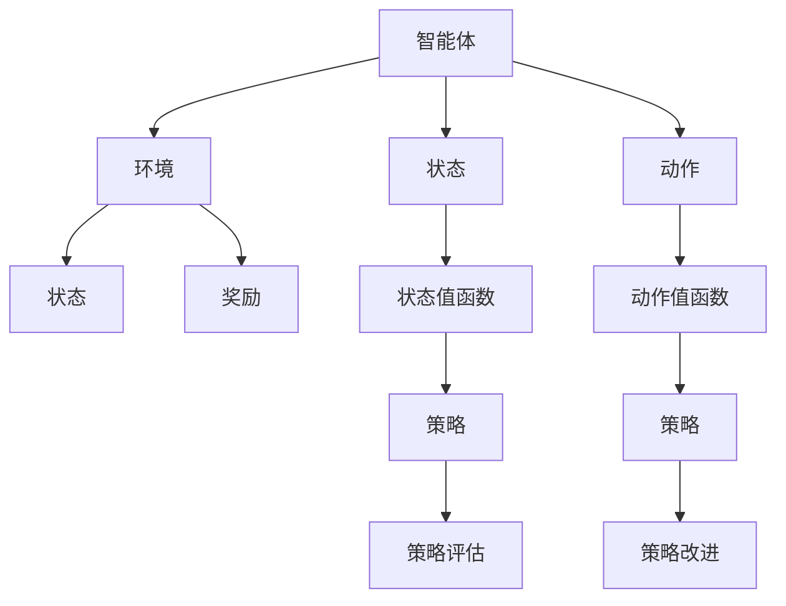

                 

## 1. 背景介绍

### 1.1 问题由来

随着人工智能（AI）技术的快速发展，强化学习（Reinforcement Learning, RL）已经成为一种高效解决复杂问题的手段。在众多强化学习算法中，Q-learning 因其简单直观、易于实现，以及具有较好的收敛性等特点，被广泛应用于自动控制、游戏AI、机器人学习等领域。本文将详细解析 Q-learning 的原理、操作步骤及应用场景，并结合数学模型和实际项目案例进行深入讲解。

### 1.2 问题核心关键点

Q-learning 是一种基于值函数的双重学习算法，其核心在于通过逐步迭代，使智能体（Agent）能够学习到从当前状态到下一状态的预期回报，从而选择最优策略。具体来说，Q-learning 将学习过程分解为两个子任务：策略评估（Value Function Estimation）和策略改进（Policy Improvement）。通过不断的评估和改进，智能体能够逐步优化其决策过程，达到接近最优策略的目标。

## 2. 核心概念与联系

### 2.1 核心概念概述

为更好地理解 Q-learning 的原理，本节将介绍几个核心概念及其相互联系：

- **智能体（Agent）**：在强化学习中，智能体指一个能够在环境中进行探索和学习的实体。其目标是通过学习策略，最大化累积奖励。
- **环境（Environment）**：智能体所处的外部世界，由状态、动作、奖励等组成。环境的状态向智能体提供信息，奖励则激励智能体的行为。
- **状态（State）**：环境中的一个描述性变量，代表了当前时刻或时段的特性。
- **动作（Action）**：智能体可采取的决策，通常对应于环境中的某些操作。
- **奖励（Reward）**：环境对智能体行为的即时反馈，用于指导其决策过程。
- **值函数（Value Function）**：评估当前状态下采取某个动作所期望获得的长期奖励。值函数分为状态值函数（State Value Function）和动作值函数（Action Value Function）。
- **策略（Policy）**：智能体选择动作的规则，通常是概率分布，描述了在每个状态下应采取动作的概率。
- **策略评估（Value Function Estimation）**：计算当前状态下每个动作的Q值，即从当前状态出发，采取该动作后，期望获得的长期奖励。
- **策略改进（Policy Improvement）**：通过比较不同动作的Q值，选择最大Q值对应的动作，作为当前状态下的最优动作，并更新策略。

这些核心概念之间的逻辑关系可以通过以下 Mermaid 流程图来展示：



这个流程图展示了我门如何通过智能体、环境、状态、动作、奖励、值函数、策略等概念，共同构成强化学习的基本框架。

## 3. 核心算法原理 & 具体操作步骤
### 3.1 算法原理概述

Q-learning 算法的核心在于构建和更新动作值函数 Q(s, a)，其中 s 表示状态，a 表示动作。Q(s, a) 代表在状态 s 下采取动作 a 的长期期望奖励。

形式化地，Q(s, a) 的更新公式如下：

$$
Q(s, a) \leftarrow Q(s, a) + \alpha [r + \gamma \max_a Q(s', a') - Q(s, a)]
$$

其中：
- α 为学习率，控制每次更新的幅度。
- r 为即时奖励。
- γ 为折扣因子，用于平衡即时奖励和长期奖励的关系。
- s' 为采取动作 a 后的下一个状态。
- a' 为在状态 s' 下的最优动作，即 $a' = \arg\max_a Q(s', a')$。

该公式的意义在于，智能体在状态 s 下采取动作 a 后，观察到即时奖励 r 和下一个状态 s'，通过比较当前动作值 Q(s, a) 和最优动作值 $Q(s', a')$，计算出新的动作值 Q(s, a)。通过这种迭代更新过程，智能体能够逐步学习到最优策略。

### 3.2 算法步骤详解

Q-learning 的实现过程主要分为以下几个步骤：

**Step 1: 初始化**
- 初始化值函数 Q(s, a) 为随机值。
- 选择一个初始策略 π，例如随机策略。

**Step 2: 策略评估**
- 从当前状态 s 出发，随机选择一个动作 a。
- 观察环境，得到即时奖励 r 和下一个状态 s'。
- 根据公式更新 Q(s, a) 的值。

**Step 3: 策略改进**
- 更新策略 π(s)，使得在状态 s 下采取的动作 a 最大化 Q(s, a)。
- 返回新策略，继续执行策略评估和策略改进，直至收敛。

在实际应用中，为了提高效率和稳定性，常常采用 $\epsilon$-greedy 策略，即在每次决策时以一定的概率 $\epsilon$ 随机选择动作，以 $\epsilon$ 的概率选择最优动作。这种策略可以在探索和利用之间找到一个平衡点，避免智能体陷入局部最优。

### 3.3 算法优缺点

Q-learning 算法具有以下优点：

- **简单直观**：算法实现简单，易于理解和实现。
- **收敛性好**：在合适的参数设置下，Q-learning 可以保证收敛到最优策略。
- **适用性强**：适用于连续和离散动作空间，以及非凸环境的强化学习问题。

同时，该算法也存在一些缺点：

- **对参数敏感**：学习率 α 和折扣因子 γ 的选择对算法效果有很大影响，需要仔细调整。
- **易受状态转移概率的影响**：当状态转移概率未知或不稳定时，可能导致策略学习不准确。
- **内存消耗大**：需要存储所有状态-动作对的 Q 值，在状态空间很大的情况下，内存开销较大。

## 4. 数学模型和公式 & 详细讲解

### 4.1 数学模型构建

为了更严谨地表述 Q-learning 算法，我们首先定义以下符号：

- $s$：当前状态。
- $a$：当前动作。
- $s'$：采取动作 $a$ 后的下一个状态。
- $a'$：在状态 $s'$ 下的最优动作。
- $r$：即时奖励。
- $γ$：折扣因子。
- $\alpha$：学习率。
- $Q(s, a)$：状态 $s$ 下采取动作 $a$ 的 Q 值。

### 4.2 公式推导过程

根据 Q-learning 的更新公式：

$$
Q(s, a) \leftarrow Q(s, a) + \alpha [r + \gamma \max_a Q(s', a') - Q(s, a)]
$$

将即时奖励 r 和下一个状态 s' 作为输入，计算当前状态 s 下采取动作 a 的 Q 值。

### 4.3 案例分析与讲解

考虑一个简单的迷宫问题，智能体需要在迷宫中找到出口。迷宫中有四个状态，智能体的动作只有向上、向下、向左、向右四个方向。每个状态都有不同的奖励，出口状态有最高奖励 100，其他状态有 -1 的奖励。

假设智能体当前状态为 s1，采取动作 a 后到达 s2，并观察到即时奖励 r 为 5，根据 Q-learning 更新公式，计算 Q(s1, a) 的值：

$$
Q(s1, a) \leftarrow Q(s1, a) + \alpha [5 + \gamma \max_{a'} Q(s2, a') - Q(s1, a)]
$$

其中，最大 Q 值对应于 s2 下的最优动作，即 $a' = \arg\max_a Q(s2, a)$。根据该动作计算出 $Q(s2, a')$ 的值，将其代入公式，得到 Q(s1, a) 的更新值。通过不断的迭代，智能体能够逐步学习到从起点到出口的最优路径。

## 5. 项目实践：代码实例和详细解释说明
### 5.1 开发环境搭建

在开始 Q-learning 实践前，我们需要准备好开发环境。以下是使用 Python 进行 Q-learning 开发的环境配置流程：

1. 安装 Python：可以从官网下载并安装 Python 3.7 或更高版本。
2. 安装 numpy：
```bash
pip install numpy
```

3. 安装 matplotlib：
```bash
pip install matplotlib
```

4. 安装 gym：
```bash
pip install gym
```

完成上述步骤后，即可在 Python 环境中开始 Q-learning 的实践。

### 5.2 源代码详细实现

下面以一个简单的迷宫问题为例，给出 Q-learning 的 Python 代码实现。

```python
import numpy as np
import matplotlib.pyplot as plt
import gym

env = gym.make('CartPole-v1')
env = gym.wrappers.Monitor(env, 'result.mp4', force=True)

# 定义 Q 值表
Q = np.zeros((env.observation_space.n, env.action_space.n))
epsilon = 0.1

# 定义训练参数
max_episodes = 2000
alpha = 0.1
gamma = 0.9

# 定义策略
def epsilon_greedy(Q, s, epsilon):
    if np.random.uniform() < epsilon:
        return env.action_space.sample()
    else:
        return np.argmax(Q[s, :])

# 定义训练函数
def train(env, Q, alpha, gamma, epsilon, max_episodes):
    for i in range(max_episodes):
        s = env.reset()
        done = False
        while not done:
            a = epsilon_greedy(Q, s, epsilon)
            s_prime, r, done, _ = env.step(a)
            Q[s, a] += alpha * (r + gamma * np.max(Q[s_prime, :]) - Q[s, a])
            s = s_prime
    return Q

# 训练 Q-learning 模型
Q = train(env, Q, alpha, gamma, epsilon, max_episodes)

# 绘制 Q 值表
plt.imshow(Q, cmap='gray')
plt.colorbar()
plt.show()
```

### 5.3 代码解读与分析

在上述代码中，我们首先使用 gym 库创建了一个经典的 CartPole 环境，并对其进行了录制。

然后，定义了一个 Q 值表，用于存储每个状态-动作对的 Q 值。在 Q-learning 训练过程中，我们使用了 $\epsilon$-greedy 策略，即以一定的概率随机选择动作，以 $\epsilon$ 的概率选择最优动作。

在训练函数中，我们通过不断迭代，更新 Q 值表，直到达到最大训练轮数。最后，使用 matplotlib 绘制了 Q 值表，展示了智能体在不同状态下的最优动作。

## 6. 实际应用场景

### 6.1 自动驾驶

Q-learning 在自动驾驶中有着广泛的应用，特别是在路径规划和交通控制等方面。自动驾驶系统需要实时地对周围环境进行感知和决策，Q-learning 能够帮助智能体（如自动驾驶车辆）学习到最优的行驶策略，避免交通事故，提高驾驶安全性。

### 6.2 机器人学习

Q-learning 在机器人学习中也得到了广泛应用。机器人需要在复杂的物理环境中完成各种任务，如抓取物体、行走、定位等。通过 Q-learning，机器人可以学习到最优的控制策略，提高任务完成效率和准确性。

### 6.3 金融市场交易

在金融市场交易中，Q-learning 被用来构建自动化交易策略。通过 Q-learning，智能体可以学习到最优的交易策略，根据市场变化及时调整买卖操作，最大化投资回报。

### 6.4 未来应用展望

随着强化学习技术的不断发展，Q-learning 的应用场景还将进一步拓展。未来，Q-learning 将不仅在传统的自动控制和机器人学习中得到应用，还将涉及到更多的复杂领域，如医疗、教育、物流等，为这些领域带来智能化的解决方案。

## 7. 工具和资源推荐

### 7.1 学习资源推荐

为了帮助开发者深入理解 Q-learning 的原理和实践技巧，这里推荐一些优质的学习资源：

1. 《强化学习：行动与决策》：由 Richard S. Sutton 和 Andrew G. Barto 所著的经典教材，全面介绍了强化学习的基本概念和算法，包括 Q-learning。
2. DeepMind 的论文和博客：DeepMind 在强化学习领域取得了多项突破，其研究成果和博客文章，可以为开发者提供丰富的实践经验和理论知识。
3. OpenAI Gym：一个开源的强化学习框架，提供了各种环境，方便开发者进行 Q-learning 等算法的实践。
4. TensorFlow 和 PyTorch 等深度学习框架的官方文档和教程：这些框架提供了丰富的工具和库，支持 Q-learning 等强化学习算法的实现。

通过学习这些资源，相信你一定能够全面掌握 Q-learning 的原理和应用技巧，并用于解决实际的强化学习问题。

### 7.2 开发工具推荐

Q-learning 的开发过程中，合理利用开发工具可以显著提高效率。以下是几款常用的工具：

1. Jupyter Notebook：一个交互式的编程环境，支持代码块、数学公式和图像展示，适合进行 Q-learning 等算法的实现和调试。
2. Anaconda：一个开源的数据科学平台，支持环境管理和包管理，方便 Q-learning 等算法的开发和部署。
3. VS Code：一个轻量级的代码编辑器，支持 Python 和相关库的安装和使用，适合进行 Q-learning 等算法的开发和调试。
4. PyCharm：一个专业的 Python IDE，支持 Q-learning 等算法的开发和调试，提供了丰富的功能和插件。

这些工具都能有效提升 Q-learning 的开发效率，帮助开发者更快速地实现和优化算法。

### 7.3 相关论文推荐

Q-learning 算法的发展历程中，涌现出了众多经典和前沿的研究论文。以下是几篇具有代表性的论文，推荐阅读：

1. "Q-learning for Robot Arm Movement and Object Manipulation"：提出了 Q-learning 在机器人手臂运动和对象操作中的应用，展示了其在自动化控制中的应用潜力。
2. "Playing Atari with deep reinforcement learning"：展示了 Q-learning 在 Atari 游戏中的应用，证明了其在高维状态空间中的有效性。
3. "Q-learning for Equilibrium Selection in Multi-Agent Systems"：探讨了 Q-learning 在多智能体系统中的应用，展示了其在协同学习和博弈论中的作用。
4. "Human-AI Collaborative Learning in Smart Grids"：讨论了 Q-learning 在智能电网中的应用，展示了其在复杂系统管理中的应用潜力。

这些论文代表了 Q-learning 算法的发展脉络，通过学习这些前沿成果，可以帮助研究者把握学科前进方向，激发更多的创新灵感。

## 8. 总结：未来发展趋势与挑战

### 8.1 总结

本文对 Q-learning 算法进行了全面系统的介绍。首先阐述了 Q-learning 算法的原理和操作步骤，通过数学模型和实际项目案例进行了详细讲解。其次，探讨了 Q-learning 在自动驾驶、机器人学习、金融市场交易等多个领域的应用前景，展示了其强大的应用潜力。

通过本文的系统梳理，可以看到，Q-learning 算法在强化学习领域具有重要的地位，为智能体的决策和学习提供了有力工具。未来的研究需要在参数设置、算法优化、应用场景扩展等方面不断深入，进一步拓展 Q-learning 算法的应用范围。

### 8.2 未来发展趋势

展望未来，Q-learning 算法的发展趋势如下：

1. **多智能体 Q-learning**：随着多智能体系统的复杂度增加，多智能体 Q-learning 将成为研究热点，用于解决多个智能体之间的协作与竞争问题。
2. **深度强化学习**：通过将深度神经网络与 Q-learning 结合，能够解决高维状态空间中的复杂决策问题，提高算法的泛化能力和稳定性。
3. **分布式强化学习**：在大规模分布式环境中，通过分布式 Q-learning 算法，能够实现多节点协作学习，提高算法的并行性和效率。
4. **鲁棒性强化学习**：在实际应用中，智能体需要面对多种不确定性和干扰，鲁棒性 Q-learning 算法将成为研究重点，增强算法的稳定性和鲁棒性。
5. **混合强化学习**：结合强化学习与其他学习方法，如蒙特卡洛树搜索（Monte Carlo Tree Search, MCTS）、进化算法（Evolutionary Algorithm, EA）等，能够提高算法的求解能力和适应性。

这些趋势将推动 Q-learning 算法向更加高效、普适、鲁棒的方向发展，为解决复杂的决策和控制问题提供新的方法。

### 8.3 面临的挑战

尽管 Q-learning 算法在强化学习领域取得了一定的进展，但在应用过程中仍面临一些挑战：

1. **参数设置复杂**：Q-learning 算法对参数 α、γ 的选择非常敏感，需要精心调整。参数设置不当可能导致算法性能下降甚至发散。
2. **高维状态空间**：在处理高维状态空间时，Q-learning 算法会面临计算复杂度和内存消耗大的问题，需要优化算法或采用其他方法。
3. **过拟合问题**：当训练数据较少时，Q-learning 算法容易出现过拟合现象，导致策略学习不准确。需要结合正则化技术和其他方法进行优化。
4. **鲁棒性和稳定性**：在实际应用中，环境变化和噪声干扰可能影响 Q-learning 算法的性能，需要进一步提高算法的鲁棒性和稳定性。
5. **计算资源需求大**：高维状态空间和复杂的决策问题需要大量的计算资源，需要优化算法和硬件配置。

这些挑战需要在算法优化、数据处理、资源优化等方面进行深入研究，以提高 Q-learning 算法的应用效果和稳定性。

### 8.4 研究展望

面对 Q-learning 算法所面临的挑战，未来的研究需要在以下几个方面寻求新的突破：

1. **自适应学习率**：引入自适应学习率算法，根据算法状态动态调整学习率，提高算法的收敛速度和稳定性。
2. **分布式优化**：通过分布式优化算法，实现多节点协作学习，提高算法的并行性和效率。
3. **模型压缩与加速**：采用模型压缩和加速技术，减少 Q-learning 算法的计算复杂度和内存消耗，提高算法的实际应用效率。
4. **多模态融合**：结合多模态数据，如视觉、语音等，提高 Q-learning 算法的环境感知能力和决策准确性。
5. **混合学习**：结合深度强化学习和其他学习方法，如蒙特卡洛树搜索、进化算法等，提高算法的求解能力和适应性。

这些研究方向的探索，将推动 Q-learning 算法向更加高效、普适、鲁棒的方向发展，为解决复杂的决策和控制问题提供新的方法。

## 9. 附录：常见问题与解答

**Q1：Q-learning 算法的参数 α 和 γ 应该如何选择？**

A: Q-learning 算法的参数 α 和 γ 的选择对算法性能有很大影响，通常需要根据具体问题和数据进行调整。一般情况下，可以通过以下步骤进行参数调优：

1. 固定 γ，选择合适的 α 值，观察算法收敛情况和性能指标。
2. 固定 α，选择合适的 γ 值，观察算法收敛情况和性能指标。
3. 结合实验结果，选择最优的 α 和 γ 组合。

**Q2：Q-learning 算法在处理高维状态空间时有什么问题？**

A: Q-learning 算法在处理高维状态空间时，会面临计算复杂度和内存消耗大的问题，通常有以下优化方法：

1. 函数逼近：使用神经网络等函数逼近方法，代替 Q 值表，提高算法的计算效率。
2. 特征提取：采用特征提取技术，将高维状态空间映射到低维空间，降低算法计算复杂度。
3. 稀疏化：对 Q 值表进行稀疏化处理，减少存储和计算开销。
4. 分布式优化：通过分布式优化算法，实现多节点协作学习，提高算法的并行性和效率。

**Q3：Q-learning 算法是否适用于连续动作空间？**

A: Q-learning 算法最初是针对离散动作空间设计的，但对于连续动作空间，可以使用函数逼近方法，如线性回归、神经网络等，将动作空间映射到离散状态空间，然后再应用 Q-learning 算法。

**Q4：Q-learning 算法在多智能体系统中的应用如何？**

A: Q-learning 算法在多智能体系统中的应用有待进一步研究，主要难点在于智能体之间的协作和竞争问题。常用的方法包括基于 Q-learning 的协同学习和竞争学习算法，如 Q-Mix、Q-Learning for Cooperative Multi-Agent Systems 等。

---

作者：禅与计算机程序设计艺术 / Zen and the Art of Computer Programming

