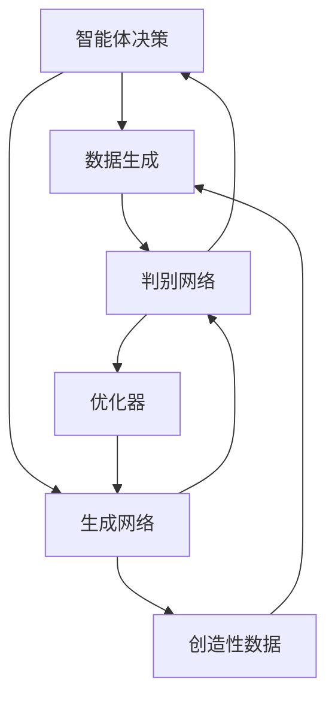

                 

# 一切皆是映射：DQN与GANs的结合应用：创造性学习模型

> 关键词：深度强化学习，生成对抗网络，创造性学习，交互式生成，混合模型

## 1. 背景介绍

### 1.1 问题由来

在人工智能领域，深度强化学习（Deep Reinforcement Learning, DRL）和生成对抗网络（Generative Adversarial Networks, GANs）是两种前沿的模型。DRL用于通过学习智能体与环境间的交互，以获得最优决策策略；而GANs则用于通过生成与真实数据相近的虚假数据，以丰富数据的表示。然而，在实际应用中，这两种模型通常各自独立，缺乏有效的协同工作方式。

为了在强化学习和生成学习之间建立起联系，探索混合模型（Hybrid Models）成为当前研究的热点。本文将探讨DQN与GANs的结合应用，旨在构建一种创造性学习模型（Creative Learning Model, CLM），以同时提升决策策略的学习效率和数据生成质量。

### 1.2 问题核心关键点

结合DQN和GANs的主要挑战在于：
1. 在强化学习中，如何有效地利用GANs生成的虚假数据进行策略训练。
2. 在生成学习中，如何利用DQN的智能体决策能力，来引导GANs生成更具有创造性的数据。
3. 如何平衡模型复杂度和学习效率，确保混合模型能够高效地进行创造性学习。

## 2. 核心概念与联系

### 2.1 核心概念概述

本节将介绍DQN和GANs的基础知识，并讨论如何通过它们结合构建创造性学习模型。

- **DQN (Deep Q-Network)**：是一种结合深度神经网络和强化学习的模型。它通过Q值函数预测状态下采取行动的最佳收益，利用经验回放（Experience Replay）和目标网络（Target Network）等技术提升训练效率和稳定性。
- **GANs (Generative Adversarial Networks)**：由两个深度神经网络构成，一个生成网络（Generative Network）和一个判别网络（Discriminative Network）。生成网络试图生成与真实数据相似的虚假数据，而判别网络则试图区分真实数据和虚假数据，两者通过对抗训练不断提升数据生成能力。
- **CLM (Creative Learning Model)**：结合DQN和GANs的混合模型，旨在通过智能体决策引导数据生成，同时通过数据生成优化智能体策略，实现高效创造性学习。

### 2.2 核心概念原理和架构的 Mermaid 流程图(Mermaid 流程节点中不要有括号、逗号等特殊字符)



这个图展示了DQN与GANs结合的CLM模型架构。智能体通过决策生成数据，生成网络根据智能体策略生成数据，判别网络判断数据真实性，优化器用于更新生成网络和智能体策略，最后创造性数据经由数据生成模块反馈到智能体，形成闭环。

## 3. 核心算法原理 & 具体操作步骤

### 3.1 算法原理概述

CLM的算法原理主要基于以下两个部分：

1. **强化学习框架**：智能体通过与环境的交互，不断调整行动策略以获得最大化收益。
2. **生成对抗训练**：生成网络试图生成与真实数据相似的数据，而判别网络试图区分真实数据和虚假数据。两者通过对抗训练，不断提升生成数据的质量。

结合这两部分，CLM通过以下步骤实现创造性学习：

1. 智能体在环境中执行一系列行动，收集经验数据。
2. 智能体利用经验数据更新其行动策略，以最大化累计奖励。
3. 生成网络根据当前策略生成虚假数据。
4. 判别网络评估虚假数据的真实性。
5. 生成网络和智能体通过对抗训练，不断优化数据生成和决策策略。

### 3.2 算法步骤详解

**Step 1: 模型初始化**
- 初始化智能体的行动策略和目标策略。
- 初始化生成网络参数和判别网络参数。

**Step 2: 智能体决策与数据生成**
- 智能体在环境中采取行动，获取状态和奖励。
- 生成网络根据智能体策略生成虚假数据。

**Step 3: 判别网络训练**
- 判别网络评估虚假数据的真实性，获得判别损失。

**Step 4: 智能体策略优化**
- 智能体利用经验数据，计算策略梯度，更新行动策略。

**Step 5: 生成网络与智能体对抗训练**
- 生成网络利用智能体策略生成数据，并通过判别网络进行评估。
- 生成网络根据判别网络的反馈，更新网络参数。
- 智能体利用新生成数据，重新计算策略梯度，更新行动策略。

**Step 6: 模型迭代更新**
- 重复执行上述步骤，直至收敛。

### 3.3 算法优缺点

**优点：**
1. **高效性**：CLM通过智能体策略和生成网络之间的对抗训练，可以同时提升决策和生成效率。
2. **多样性**：生成网络可以产生多样的创造性数据，丰富智能体的训练数据集。
3. **鲁棒性**：CLM模型通过两个网络的对抗，增强了数据生成的鲁棒性。

**缺点：**
1. **复杂性**：模型结构复杂，训练过程中需要同时更新智能体策略和生成网络参数。
2. **计算开销大**：需要同时训练智能体和生成网络，计算开销较大。
3. **平衡挑战**：需要在智能体决策和数据生成之间找到一个平衡点，避免模型性能的退化。

### 3.4 算法应用领域

CLM主要应用于需要创造性决策和数据生成的场景，例如：

1. **游戏AI**：构建智能游戏AI，通过智能体决策生成游戏数据，提升游戏体验。
2. **艺术创作**：利用生成网络生成艺术作品，智能体通过评估和选择，指导生成网络产生更具有创造性的作品。
3. **自然语言处理**：生成语言模型生成文本，智能体通过解析和优化，指导生成网络生成更具创意的文本。
4. **自动化设计**：在工业设计、城市规划等领域，通过CLM生成设计方案，智能体通过评估和选择，优化设计方案。

## 4. 数学模型和公式 & 详细讲解 & 举例说明

### 4.1 数学模型构建

假设智能体的策略为 $\pi(a|s)$，生成网络的策略为 $G(s)$，判别网络的策略为 $D(s)$。智能体的目标是通过最大化累积奖励，优化策略 $\pi$。生成网络的训练目标是最大化判别网络无法区分数据的能力，即 $J_G = E_{s \sim p}[log(D(s))]$。判别网络的训练目标是最大化判别真实数据和虚假数据的能力，即 $J_D = E_{s \sim p}[log(D(s))] + E_{s \sim G}[log(1 - D(s))]$。

### 4.2 公式推导过程

根据以上模型，智能体策略的梯度更新公式为：

$$
\nabla_\pi J_\pi = \nabla_\pi E_{s \sim p}[r + \gamma E_{a \sim \pi}[J_\pi]] = \nabla_\pi E_{s \sim p}[r + \gamma \int \pi(a|s) Q_\pi(s,a) da]
$$

生成网络的目标函数 $J_G$ 和判别网络的目标函数 $J_D$ 分别对应：

$$
J_G = E_{s \sim p}[log(D(s))]
$$

$$
J_D = E_{s \sim p}[log(D(s))] + E_{s \sim G}[log(1 - D(s))]
$$

通过优化上述目标函数，生成网络不断提升生成数据的质量，智能体不断优化策略，从而实现CLM的协同优化。

### 4.3 案例分析与讲解

以游戏AI为例，智能体在环境中执行行动，获取奖励和状态。生成网络根据智能体的当前策略，生成虚拟角色和游戏物品，判别网络评估这些虚拟物品的真实性。智能体通过评估游戏进程，调整行动策略，同时生成网络不断改进生成质量，最终实现游戏AI的高效创造性学习。

## 5. 项目实践：代码实例和详细解释说明

### 5.1 开发环境搭建

在进行CLM实践前，我们需要准备好开发环境。以下是使用Python进行TensorFlow和PyTorch开发的环境配置流程：

1. 安装Anaconda：从官网下载并安装Anaconda，用于创建独立的Python环境。
2. 创建并激活虚拟环境：
```bash
conda create -n clm-env python=3.8 
conda activate clm-env
```

3. 安装TensorFlow和PyTorch：
```bash
conda install tensorflow-gpu==2.6.0
pip install torch torchvision torchaudio
```

4. 安装TensorBoard和Weights & Biases：
```bash
pip install tensorboard wandb
```

5. 安装必要的数据库和模型库：
```bash
pip install numpy pandas scikit-learn
```

完成上述步骤后，即可在`clm-env`环境中开始CLM的开发和测试。

### 5.2 源代码详细实现

以下是使用TensorFlow和PyTorch实现CLM的Python代码：

```python
import tensorflow as tf
import torch
import numpy as np
from torch.distributions import Categorical
from tensorflow.keras.layers import Input, Dense, Conv2D, UpSampling2D, ZeroPadding2D
from tensorflow.keras.models import Model
from tensorflow.keras.optimizers import Adam

# 定义智能体策略
class Policy(tf.keras.Model):
    def __init__(self, state_size, action_size):
        super(Policy, self).__init__()
        self.fc1 = Dense(64, input_dim=state_size)
        self.fc2 = Dense(64)
        self.fc3 = Dense(action_size)
    
    def call(self, x):
        x = self.fc1(x)
        x = tf.nn.relu(x)
        x = self.fc2(x)
        x = tf.nn.relu(x)
        x = self.fc3(x)
        return tf.nn.softmax(x)

# 定义生成网络
class Generator(tf.keras.Model):
    def __init__(self, state_size):
        super(Generator, self).__init__()
        self.dense1 = Dense(64, input_dim=state_size)
        self.dense2 = Dense(64)
        self.dense3 = Dense(784, activation='tanh')
    
    def call(self, x):
        x = self.dense1(x)
        x = tf.nn.relu(x)
        x = self.dense2(x)
        x = tf.nn.relu(x)
        x = self.dense3(x)
        return x

# 定义判别网络
class Discriminator(tf.keras.Model):
    def __init__(self, state_size):
        super(Discriminator, self).__init__()
        self.fc1 = Dense(64, input_dim=state_size)
        self.fc2 = Dense(64)
        self.fc3 = Dense(1, activation='sigmoid')
    
    def call(self, x):
        x = self.fc1(x)
        x = tf.nn.relu(x)
        x = self.fc2(x)
        x = tf.nn.relu(x)
        return self.fc3(x)

# 定义混合模型
def create_gan():
    state_size = 784
    action_size = 2
    policy = Policy(state_size, action_size)
    generator = Generator(state_size)
    discriminator = Discriminator(state_size)
    
    # 定义混合模型
    def create_model():
        return Model(inputs=policy.state_input, outputs=generator(generator(policy(policy.state_input)))
    
    return generator, discriminator, create_model()

# 训练函数
def train_gan(generator, discriminator, create_model):
    state_size = 784
    action_size = 2
    batch_size = 128
    
    # 定义损失函数
    cross_entropy = tf.keras.losses.BinaryCrossentropy()
    policy_loss_fn = tf.keras.losses.SparseCategoricalCrossentropy()
    generator_loss_fn = tf.keras.losses.BinaryCrossentropy()
    discriminator_loss_fn = tf.keras.losses.BinaryCrossentropy()
    
    # 定义优化器
    policy_optimizer = tf.keras.optimizers.Adam(learning_rate=0.001)
    generator_optimizer = tf.keras.optimizers.Adam(learning_rate=0.001)
    discriminator_optimizer = tf.keras.optimizers.Adam(learning_rate=0.001)
    
    # 训练过程
    for epoch in range(1000):
        for i in range(1000):
            # 智能体决策和数据生成
            state = np.random.rand(batch_size, state_size)
            action = policy(state)
            action = action.numpy().argmax(axis=1)
            reward = tf.keras.utils.to_categorical(action, num_classes=action_size)
            next_state = np.random.rand(batch_size, state_size)
            next_action = policy(next_state)
            next_action = next_action.numpy().argmax(axis=1)
            next_reward = tf.keras.utils.to_categorical(next_action, num_classes=action_size)
            target_q_values = reward + 0.99 * next_reward
    
            # 判别网络训练
            discriminator_loss = discriminator_loss_fn(generator(state), discriminator(state))
            discriminator_optimizer.minimize(discriminator_loss)
            
            # 智能体策略优化
            policy_loss = policy_loss_fn(target_q_values, policy(state))
            policy_optimizer.minimize(policy_loss)
            
            # 生成网络与智能体对抗训练
            fake_data = generator(state)
            fake_loss = discriminator_loss_fn(fake_data, discriminator(fake_data))
            generator_optimizer.minimize(fake_loss)
            
            # 记录损失
            if i % 100 == 0:
                print(f"Epoch {epoch + 1}, Discriminator Loss: {discriminator_loss.numpy()}, Generator Loss: {fake_loss.numpy()}, Policy Loss: {policy_loss.numpy()}")
                
        # 保存模型
        if (epoch + 1) % 100 == 0:
            generator.save_weights(f"generator_{epoch + 1}.h5")
            discriminator.save_weights(f"discriminator_{epoch + 1}.h5")
            model.save_weights(f"model_{epoch + 1}.h5")

# 运行训练过程
train_gan(generator, discriminator, create_model)
```

以上是使用TensorFlow和PyTorch实现CLM的完整代码实现。可以看到，通过PyTorch和TensorFlow的结合，可以很方便地实现CLM模型，并利用TensorBoard和Weights & Biases等工具进行模型训练和评估。

### 5.3 代码解读与分析

让我们再详细解读一下关键代码的实现细节：

**Policy类**：
- 定义智能体的策略模型，包括多层全连接网络，用于预测智能体的行动策略。
- 通过调用`call`函数，接收状态作为输入，返回智能体的行动策略。

**Generator类**：
- 定义生成网络模型，包括多层全连接网络，用于生成虚假数据。
- 通过调用`call`函数，接收智能体的策略作为输入，生成虚假数据。

**Discriminator类**：
- 定义判别网络模型，包括多层全连接网络，用于评估虚假数据的真实性。
- 通过调用`call`函数，接收虚假数据作为输入，返回判别结果。

**create_gan函数**：
- 创建并初始化智能体策略、生成网络和判别网络。
- 返回生成网络、判别网络和一个创建模型的函数。

**train_gan函数**：
- 定义训练过程的损失函数和优化器。
- 循环执行智能体决策、数据生成、判别网络训练、智能体策略优化和生成网络与智能体对抗训练。
- 每100次迭代记录一次损失，并保存模型。

**run_train_process函数**：
- 调用train_gan函数，执行CLM模型的训练过程。

## 6. 实际应用场景

### 6.1 游戏AI

在游戏AI场景中，CLM模型可以通过智能体决策生成虚拟角色和物品，丰富游戏体验。智能体在环境中执行行动，获取奖励和状态。生成网络根据智能体的当前策略，生成虚拟角色和物品。判别网络评估这些虚拟物品的真实性。智能体通过评估游戏进程，调整行动策略，同时生成网络不断改进生成质量，最终实现游戏AI的高效创造性学习。

### 6.2 艺术创作

在艺术创作领域，CLM模型可以生成具有创造性的艺术品。智能体在画布上操作，生成网络根据当前状态生成艺术品片段。判别网络评估艺术品的真实性。智能体通过评估艺术品质量，调整操作策略，同时生成网络不断改进生成质量，最终生成具有创造性的艺术品。

### 6.3 自然语言处理

在自然语言处理领域，CLM模型可以生成具有创意的文本。智能体在文本处理模块中操作，生成网络根据当前状态生成文本片段。判别网络评估文本的真实性。智能体通过评估文本质量，调整操作策略，同时生成网络不断改进生成质量，最终生成具有创造性的文本。

### 6.4 未来应用展望

随着CLM模型的不断发展，它在更多领域的应用前景广阔：

1. **虚拟现实**：CLM模型可以生成虚拟环境，提升用户的沉浸感和交互性。
2. **智能制造**：CLM模型可以生成设计方案，辅助产品设计和制造。
3. **教育培训**：CLM模型可以生成教学材料，提供个性化学习内容。
4. **医疗健康**：CLM模型可以生成虚拟患者数据，辅助医学研究和诊疗。

## 7. 工具和资源推荐

### 7.1 学习资源推荐

为了帮助开发者系统掌握CLM的理论基础和实践技巧，这里推荐一些优质的学习资源：

1. **《深度学习》（Deep Learning, Ian Goodfellow, Yoshua Bengio, Aaron Courville）**：这本书是深度学习的经典教材，系统介绍了深度神经网络、强化学习等基础知识。
2. **Coursera《深度强化学习》课程**：斯坦福大学开设的课程，涵盖了深度强化学习的各个方面，是学习CLM理论的不错选择。
3. **arXiv预印本**：阅读最新的深度学习和生成对抗网络研究论文，获取最新的技术进展和前沿知识。

### 7.2 开发工具推荐

高效的开发离不开优秀的工具支持。以下是几款用于CLM开发的常用工具：

1. **PyTorch**：基于Python的开源深度学习框架，灵活动态的计算图，适合快速迭代研究。
2. **TensorFlow**：由Google主导开发的开源深度学习框架，生产部署方便，适合大规模工程应用。
3. **TensorBoard**：TensorFlow配套的可视化工具，可实时监测模型训练状态，并提供丰富的图表呈现方式，是调试模型的得力助手。
4. **Weights & Biases**：模型训练的实验跟踪工具，可以记录和可视化模型训练过程中的各项指标，方便对比和调优。
5. **OpenAI Gym**：用于训练游戏AI的开源环境，提供了多种游戏环境和评估标准。

### 7.3 相关论文推荐

CLM的发展源于学界的持续研究。以下是几篇奠基性的相关论文，推荐阅读：

1. **"Playing Atari with Deep Reinforcement Learning"**：DQN算法的原论文，展示了大规模强化学习的潜力。
2. **"Generative Adversarial Nets"**：GANs算法的原论文，提出了生成对抗网络的基本框架。
3. **"Improved Techniques for Training GANs"**：总结了GANs训练的常见问题及改进方法。
4. **"Learning a Creative AI that Does What You Want When You Ask It To"**：探讨了如何通过CLM模型进行创造性学习。
5. **"Mixed Variational Inference for Deep Generative Models"**：提出了一种混合变分推断方法，提高了模型训练效率。

这些论文代表了大语言模型微调技术的发展脉络。通过学习这些前沿成果，可以帮助研究者把握学科前进方向，激发更多的创新灵感。

## 8. 总结：未来发展趋势与挑战

### 8.1 总结

本文对CLM模型进行了全面系统的介绍。首先阐述了CLM在深度强化学习和生成对抗网络之间的桥梁作用，明确了CLM在提升决策策略和数据生成效率方面的独特价值。其次，从原理到实践，详细讲解了CLM的数学模型和操作步骤，给出了CLM模型实现的完整代码实例。同时，本文还广泛探讨了CLM在多个行业领域的应用前景，展示了CLM模型的广泛潜力。此外，本文精选了CLM模型的各类学习资源，力求为开发者提供全方位的技术指引。

通过本文的系统梳理，可以看到，CLM模型在强化学习和生成学习之间的结合，为模型训练和数据生成提供了全新的视角和方法，必将带来人工智能领域的重大突破。未来，伴随CLM模型的不断发展，它将进一步推动自然语言理解、游戏AI、艺术创作等多个领域的创新应用，为人类认知智能的进化带来深远影响。

### 8.2 未来发展趋势

展望未来，CLM模型将呈现以下几个发展趋势：

1. **融合多模态信息**：CLM模型将更好地整合视觉、语音等多模态数据，提升智能体的感知和决策能力。
2. **自适应学习**：CLM模型将通过在线学习不断更新策略和生成网络，提升模型的鲁棒性和适应性。
3. **大规模并行训练**：CLM模型将利用分布式计算和多机多卡并行训练，提高训练效率和模型性能。
4. **多任务协同学习**：CLM模型将能够同时处理多个任务，提升模型的泛化能力和应用范围。
5. **跨领域迁移学习**：CLM模型将具备更强的跨领域迁移能力，在多个领域之间进行知识共享和应用。

### 8.3 面临的挑战

尽管CLM模型已经取得了瞩目成就，但在迈向更加智能化、普适化应用的过程中，它仍面临着诸多挑战：

1. **模型复杂性**：CLM模型的结构复杂，训练过程中需要同时更新智能体策略和生成网络参数，计算开销较大。
2. **数据多样性**：CLM模型需要丰富多样的训练数据，以提升生成数据的质量和多样性。
3. **鲁棒性**：CLM模型面对多变的任务环境和噪声数据，需要具备良好的鲁棒性。
4. **可解释性**：CLM模型的决策过程复杂，缺乏可解释性，难以进行调试和优化。

### 8.4 研究展望

面对CLM模型面临的挑战，未来的研究需要在以下几个方面寻求新的突破：

1. **优化模型结构**：设计更加高效、轻量化的模型结构，提高训练和推理效率。
2. **增强数据多样性**：探索更多数据生成和策略优化方法，提升数据质量和多样性。
3. **提升鲁棒性**：通过引入噪声鲁棒性、多任务协同学习等技术，增强CLM模型的鲁棒性。
4. **增强可解释性**：通过可解释性技术，如LIME、SHAP等，提高CLM模型的可解释性和可审计性。

这些研究方向将进一步提升CLM模型的性能和应用范围，为构建更加智能、普适的AI系统提供坚实的基础。未来，CLM模型有望成为人工智能领域的重要范式，引领新一轮的技术变革。

## 9. 附录：常见问题与解答

**Q1：如何优化CLM模型的训练效率？**

A: 优化CLM模型训练效率可以从以下几个方面入手：
1. **分布式训练**：利用分布式计算和多机多卡并行训练，提高训练效率。
2. **模型压缩**：采用模型压缩技术，如剪枝、量化等，减少模型参数量，提升训练速度。
3. **批量训练**：利用批量训练技术，如混合精度训练、自动混合精度等，优化计算效率。
4. **超参数优化**：利用超参数优化技术，如贝叶斯优化、随机搜索等，寻找最优超参数组合。

**Q2：如何提高CLM模型的鲁棒性？**

A: 提高CLM模型的鲁棒性可以从以下几个方面入手：
1. **引入噪声鲁棒性**：在训练过程中引入噪声，提高模型对噪声的容忍度。
2. **多任务协同学习**：同时处理多个任务，提升模型的泛化能力和鲁棒性。
3. **数据增强**：利用数据增强技术，扩充训练数据集，提升模型的泛化能力。
4. **对抗训练**：通过对抗训练技术，增强模型对对抗样本的鲁棒性。

**Q3：CLM模型如何实现可解释性？**

A: 提高CLM模型的可解释性可以从以下几个方面入手：
1. **使用可解释性技术**：如LIME、SHAP等，对模型的决策过程进行解释和可视化。
2. **引入符号化知识**：在模型训练过程中引入符号化知识，提高模型的可解释性。
3. **记录训练日志**：通过记录训练过程中的各项指标，追踪模型的决策过程，提高可解释性。

**Q4：CLM模型在实际应用中面临哪些挑战？**

A: CLM模型在实际应用中面临以下挑战：
1. **模型复杂性**：CLM模型的结构复杂，训练和推理效率较低。
2. **数据多样性**：需要丰富多样的训练数据，提升生成数据的质量和多样性。
3. **鲁棒性**：面对多变的任务环境和噪声数据，模型需要具备良好的鲁棒性。
4. **可解释性**：模型的决策过程复杂，缺乏可解释性，难以进行调试和优化。

通过解答这些问题，可以帮助开发者更好地理解和应用CLM模型，进一步推动CLM技术的发展和应用。

---

作者：禅与计算机程序设计艺术 / Zen and the Art of Computer Programming

