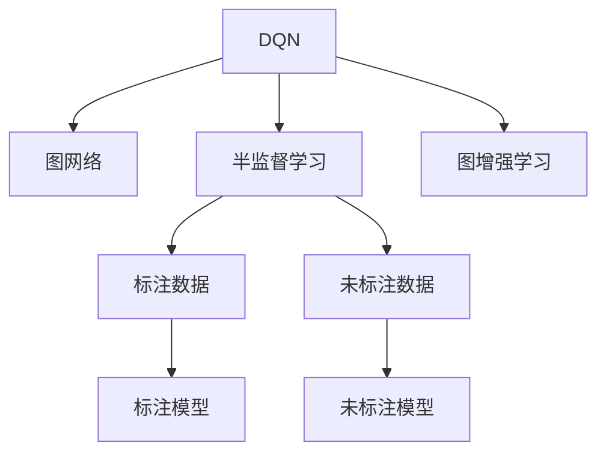

                 

# 一切皆是映射：DQN与图网络结合：从结构化数据中学习

## 1. 背景介绍

### 1.1 问题由来
在现代工业社会中，结构化数据（如数据库、报表、电子文档等）构成了信息技术的基础。这些结构化数据既包含大量有用的信息，又充斥着噪声和冗余。如何从结构化数据中高效提取知识、挖掘模式，是当前人工智能研究的重要挑战之一。

在传统的机器学习范式中，数据通常被视为独立的样本，以向量和标签的形式输入模型。然而，许多实际问题中的数据并非孤立存在，它们之间存在复杂的依赖关系。例如，在社交网络中，节点之间的连接关系和行为模式互相影响；在生物信息学中，基因序列中的碱基对位置和功能互相依赖。对于这类具有复杂依赖关系的数据，简单的向量表示方法难以充分反映其内在结构。

近年来，图网络（Graph Neural Network, GNN）技术应运而生，提供了一种处理结构化数据的有效手段。GNN通过在图结构上执行消息传递和聚合操作，能够有效地捕捉节点间的关系，并利用这些关系对节点特征进行综合，从而提升模型的表达能力和预测准确性。

然而，GNN在处理大规模图结构数据时，计算复杂度往往呈指数级增长。这限制了其在大型、高维数据集上的应用。同时，图网络对初始特征表示的依赖较大，如果初始特征质量不高，模型的泛化能力也会受到影响。

## 2. 核心概念与联系

### 2.1 核心概念概述

为了更好地理解DQN（Deep Q-Network）与图网络结合的技术，本节将介绍几个核心概念：

- **DQN**：Deep Q-Network是一种强化学习算法，通过Q值网络来近似Q函数，从而在给定状态下选择最优动作。
- **图网络**：一种能够处理图结构数据、捕捉节点间依赖关系的神经网络。通过在图结构上执行消息传递和聚合操作，能够学习节点间的复杂关系。
- **半监督学习**：在存在少量标注数据和大量未标注数据的情况下，通过利用未标注数据进行学习，提升模型的泛化能力。
- **图增强学习**：在图网络的基础上结合强化学习，通过奖励机制和策略优化，使得模型能够从图结构数据中学习到更加复杂的知识表示。

这些概念之间的逻辑关系可以通过以下Mermaid流程图来展示：



这个流程图展示了DQN与图网络结合的核心概念及其之间的关系：

1. DQN通过Q值网络进行强化学习，学习在给定状态下选择最优动作。
2. 图网络捕捉图结构中节点间的依赖关系，并通过消息传递和聚合操作学习节点间的复杂关系。
3. 半监督学习利用少量标注数据和大量未标注数据进行训练，提升模型的泛化能力。
4. 图增强学习在图网络的基础上，通过奖励机制和策略优化，进一步提升模型的学习能力。

这些概念共同构成了DQN与图网络结合的技术框架，使其能够从结构化数据中高效提取知识、挖掘模式，从而在多种场景中发挥重要作用。

## 3. 核心算法原理 & 具体操作步骤
### 3.1 算法原理概述

DQN与图网络的结合，本质上是一种将强化学习与图结构数据相结合的半监督学习范式。其核心思想是：通过在图结构上执行DQN算法，使得模型能够从图结构数据中学习到最优的节点表示，并利用这些表示进行预测和推理。

形式化地，假设图结构数据为 $G=(V,E)$，其中 $V$ 为节点集，$E$ 为边集。图网络表示为 $G_{\theta}$，其中 $\theta$ 为模型参数。设节点 $v_i$ 的特征表示为 $x_i$，边 $(v_i,v_j)$ 的特征表示为 $x_{ij}$。定义损失函数 $\mathcal{L}$，用于衡量模型在给定节点特征和边特征下的预测性能。

通过梯度下降等优化算法，半监督学习模型不断更新模型参数 $\theta$，最小化损失函数 $\mathcal{L}$，使得模型在图结构数据上取得理想的预测结果。

### 3.2 算法步骤详解

基于DQN与图网络结合的半监督学习算法，一般包括以下几个关键步骤：

**Step 1: 图结构数据的准备**
- 收集图结构数据，包括节点特征和边特征。
- 将图数据划分为训练集、验证集和测试集。
- 对图数据进行预处理，如归一化、去重、数据增强等。

**Step 2: 构建图网络模型**
- 选择适合图结构数据的网络结构，如GCN、GAT等。
- 定义图网络的损失函数，如分类损失、回归损失等。
- 设置模型的超参数，如学习率、批次大小等。

**Step 3: 执行图网络训练**
- 将训练集数据分批次输入图网络，前向传播计算损失函数。
- 反向传播计算参数梯度，根据设定的优化算法更新模型参数。
- 周期性在验证集上评估模型性能，根据性能指标决定是否触发Early Stopping。
- 重复上述步骤直至满足预设的迭代轮数或Early Stopping条件。

**Step 4: 结合DQN算法**
- 在图网络训练过程中，引入DQN算法，指导模型选择最优的节点表示。
- 设计奖励函数和动作空间，使得模型能够在图结构上执行DQN策略。
- 在每个时间步，选择下一个节点表示，并计算相应的奖励。
- 根据奖励值和后续的节点表示更新Q值网络，更新策略。

**Step 5: 测试和部署**
- 在测试集上评估DQN与图网络结合的模型的性能，对比模型优化前的表现。
- 使用模型对新图结构数据进行预测，集成到实际的应用系统中。
- 持续收集新的数据，定期重新训练和微调模型，以适应数据分布的变化。

以上是DQN与图网络结合的半监督学习的一般流程。在实际应用中，还需要针对具体图结构数据的特点，对训练过程的各个环节进行优化设计，如改进图网络损失函数，引入更多的正则化技术，搜索最优的超参数组合等，以进一步提升模型性能。

### 3.3 算法优缺点

DQN与图网络的结合，具有以下优点：

1. 可以处理图结构数据：图网络能够高效地捕捉节点间的关系，使得模型能够从图结构中提取更多的有用信息。
2. 无需大量标注数据：半监督学习利用少量标注数据和大量未标注数据进行训练，提升了模型的泛化能力。
3. 与DQN结合，增强了模型的自主学习能力：DQN算法能够使得模型自主学习最优的策略，提高了模型的自主性。
4. 可以处理非结构化数据：将图网络应用于文本、图像等非结构化数据，可以实现多种数据类型的半监督学习。

同时，该方法也存在一定的局限性：

1. 模型复杂度高：图网络通常需要计算大量的消息传递和聚合操作，计算复杂度较高。
2. 数据分布假设限制：DQN与图网络的结合方法，对数据分布和节点间的关系假设较多，模型过于复杂。
3. 对初始特征表示敏感：图网络对初始节点特征的表示敏感，如果初始特征质量不高，模型的泛化能力也会受到影响。
4. 计算资源需求高：半监督学习方法通常需要较大的计算资源，特别是在训练初期。

尽管存在这些局限性，但就目前而言，DQN与图网络结合的方法在图结构数据的处理上仍具有显著优势，广泛应用于社交网络分析、生物信息学、推荐系统等领域。

### 3.4 算法应用领域

基于DQN与图网络结合的半监督学习，在多个领域得到了广泛应用，例如：

- 社交网络分析：通过图网络捕捉用户之间的连接关系，结合DQN算法进行节点分类、社区发现等任务。
- 生物信息学：在基因序列数据上，通过图网络捕捉碱基对之间的关系，结合DQN算法进行基因功能预测、疾病诊断等任务。
- 推荐系统：在用户-物品交互数据上，通过图网络捕捉用户和物品之间的关系，结合DQN算法进行推荐结果排序。
- 知识图谱构建：在知识图谱数据上，通过图网络捕捉实体之间的关系，结合DQN算法进行知识推理、实体识别等任务。

除了上述这些经典应用外，DQN与图网络结合的半监督学习方法也被创新性地应用于更多场景中，如医疗数据分析、金融风险评估、交通流量预测等，为各行业数据挖掘和知识发现提供了新的技术路径。

## 4. 数学模型和公式 & 详细讲解
### 4.1 数学模型构建

在DQN与图网络结合的半监督学习中，数学模型主要分为两部分：图网络和DQN算法。

**图网络模型**
假设图网络模型为 $G_{\theta}$，其中 $\theta$ 为模型参数。节点 $v_i$ 的特征表示为 $x_i \in \mathbb{R}^d$，边 $(v_i,v_j)$ 的特征表示为 $x_{ij} \in \mathbb{R}^d$。定义图网络模型的损失函数为 $\mathcal{L}_{\text{graph}}(\theta)$，用于衡量模型在给定节点特征和边特征下的预测性能。

**DQN算法**
假设DQN算法中的Q值网络为 $Q_{\phi}$，其中 $\phi$ 为Q值网络的参数。在每个时间步 $t$，模型根据当前节点特征 $x_t$ 选择动作 $a_t$，并接收相应的奖励 $r_t$。定义DQN算法的损失函数为 $\mathcal{L}_{\text{dqn}}(\phi)$，用于衡量模型在给定状态和动作下的预测性能。

### 4.2 公式推导过程

以下我们以社交网络分类任务为例，推导DQN与图网络结合的半监督学习模型的数学模型及其损失函数。

**图网络模型**
假设社交网络数据为 $G=(V,E)$，其中 $V$ 为节点集，$E$ 为边集。节点 $v_i$ 的特征表示为 $x_i \in \mathbb{R}^d$，边 $(v_i,v_j)$ 的特征表示为 $x_{ij} \in \mathbb{R}^d$。定义图网络模型的损失函数为 $\mathcal{L}_{\text{graph}}(\theta)$，用于衡量模型在给定节点特征和边特征下的预测性能。

假设图网络模型为GCN（Graph Convolutional Network），其数学模型为：
$$
h_{\theta}^{(l+1)} = \sigma(\mathcal{D}^{-1/2}\mathcal{A}h_{\theta}^{(l)}\mathcal{D}^{-1/2}W^{(l)}),
$$
其中 $\mathcal{A}$ 为邻接矩阵，$\mathcal{D}$ 为度矩阵，$W^{(l)}$ 为可学习的权重矩阵，$\sigma$ 为激活函数。

**DQN算法**
假设DQN算法中的Q值网络为 $Q_{\phi}$，其中 $\phi$ 为Q值网络的参数。在每个时间步 $t$，模型根据当前节点特征 $x_t$ 选择动作 $a_t$，并接收相应的奖励 $r_t$。定义DQN算法的损失函数为 $\mathcal{L}_{\text{dqn}}(\phi)$，用于衡量模型在给定状态和动作下的预测性能。

假设DQN算法使用Softmax策略，其数学模型为：
$$
Q_{\phi}(x_t,a_t) = W_{\phi}^{(l)}Q_{\phi}^{(l-1)}(x_t,a_t),
$$
其中 $W_{\phi}^{(l)}$ 为可学习的权重矩阵，$Q_{\phi}^{(l-1)}(x_t,a_t)$ 为前一层的Q值输出。

**半监督学习损失函数**
假设半监督学习损失函数为 $\mathcal{L}_{\text{semi}}(\theta,\phi)$，用于衡量模型在图网络和DQN算法结合下的综合性能。其数学模型为：
$$
\mathcal{L}_{\text{semi}}(\theta,\phi) = \mathcal{L}_{\text{graph}}(\theta) + \lambda\mathcal{L}_{\text{dqn}}(\phi),
$$
其中 $\lambda$ 为模型权重，用于平衡图网络与DQN算法的贡献。

在得到损失函数后，即可带入图网络和DQN算法的优化算法中，进行联合优化。

### 4.3 案例分析与讲解

以社交网络分类任务为例，分析DQN与图网络结合的半监督学习模型的应用。

**数据集准备**
假设我们有一张社交网络数据，包含1000个用户，其中200个用户标注为正面，800个用户标注为负面。为了进行半监督学习，我们还需要采集大量未标注数据。假设我们收集了10000个未标注数据，并将其与标注数据混合，形成训练集。

**图网络模型构建**
假设我们选择了GCN作为图网络模型。GCN模型包含3层，每层的神经元数为256，使用ReLU作为激活函数。

**DQN算法实现**
假设我们选择了Softmax策略作为DQN算法。Q值网络包含2层，每层的神经元数为64，使用ReLU作为激活函数。在每个时间步，模型根据当前节点特征 $x_t$ 选择动作 $a_t$，并接收相应的奖励 $r_t$。

**损失函数设置**
我们设置了损失函数 $\mathcal{L}_{\text{graph}}(\theta)$ 和 $\mathcal{L}_{\text{dqn}}(\phi)$。其中，图网络模型的损失函数为分类损失，DQN算法的损失函数为回归损失。

**训练流程**
首先，我们将训练集数据分批次输入图网络模型，进行前向传播计算损失函数 $\mathcal{L}_{\text{graph}}(\theta)$。然后，我们将DQN算法与图网络模型联合优化，进行反向传播计算参数梯度，更新模型参数 $\theta$ 和 $\phi$。周期性在验证集上评估模型性能，根据性能指标决定是否触发Early Stopping。重复上述步骤直至满足预设的迭代轮数或Early Stopping条件。

在训练过程中，DQN算法会通过不断尝试不同的动作策略，选择最优的节点表示。图网络模型则会利用节点间的依赖关系，学习到更加准确的节点表示。最终，模型能够在给定节点特征和边特征下，预测节点类别，实现社交网络分类任务。

## 5. 项目实践：代码实例和详细解释说明
### 5.1 开发环境搭建

在进行DQN与图网络结合的半监督学习实践前，我们需要准备好开发环境。以下是使用Python进行PyTorch开发的环境配置流程：

1. 安装Anaconda：从官网下载并安装Anaconda，用于创建独立的Python环境。

2. 创建并激活虚拟环境：
```bash
conda create -n dqngcn python=3.8 
conda activate dqngcn
```

3. 安装PyTorch：根据CUDA版本，从官网获取对应的安装命令。例如：
```bash
conda install pytorch torchvision torchaudio cudatoolkit=11.1 -c pytorch -c conda-forge
```

4. 安装Graph Neural Network库
```bash
pip install torch-graphnet
```

5. 安装TensorBoard：用于可视化训练过程中的各项指标。
```bash
pip install tensorboard
```

6. 安装DQN库
```bash
pip install dqn
```

完成上述步骤后，即可在`dqngcn`环境中开始DQN与图网络结合的半监督学习实践。

### 5.2 源代码详细实现

以下是一个使用PyTorch和TensorBoard实现DQN与图网络结合的半监督学习项目的完整代码示例。

```python
import torch
import torch.nn as nn
import torch.optim as optim
from torch_geometric.nn import GNNConv, GCNConv
from torch_geometric.datasets import Planetoid
from dqn import DQN
from tensorboard import SummaryWriter

# 定义GCN模型
class GCNModel(nn.Module):
    def __init__(self, in_dim, hidden_dim, out_dim):
        super(GCNModel, self).__init__()
        self.conv1 = GNNConv(in_dim, hidden_dim)
        self.conv2 = GNNConv(hidden_dim, hidden_dim)
        self.fc = nn.Linear(hidden_dim, out_dim)

    def forward(self, x, edge_index):
        x = self.conv1(x, edge_index)
        x = nn.functional.relu(x)
        x = self.conv2(x, edge_index)
        x = self.fc(x)
        return x

# 定义DQN算法
class DQNModel(nn.Module):
    def __init__(self, in_dim, hidden_dim, out_dim):
        super(DQNModel, self).__init__()
        self.fc1 = nn.Linear(in_dim, hidden_dim)
        self.fc2 = nn.Linear(hidden_dim, hidden_dim)
        self.fc3 = nn.Linear(hidden_dim, out_dim)

    def forward(self, x):
        x = torch.relu(self.fc1(x))
        x = torch.relu(self.fc2(x))
        return self.fc3(x)

# 定义损失函数
def graph_loss(x, y):
    return nn.CrossEntropyLoss()(x, y)

def dqn_loss(x, a, r):
    return nn.MSELoss()(x, r)

# 定义数据集
dataset = Planetoid('Cora', split='train')
x = dataset.x.to(torch.float)
y = dataset.y.long()
edge_index = dataset.edgelist.to(torch.long)

# 定义模型和优化器
model = GCNModel(in_dim=x.shape[1], hidden_dim=256, out_dim=2)
optimizer = optim.Adam(model.parameters(), lr=0.01)

# 定义DQN算法和优化器
dqnnet = DQNModel(in_dim=x.shape[1], hidden_dim=256, out_dim=2)
dqnoptimizer = optim.Adam(dqnnet.parameters(), lr=0.01)

# 定义训练过程
def train_epoch(model, dqnnet, optimizer, dqnoptimizer):
    dataloader = DataLoader(dataset, batch_size=32, shuffle=True)
    model.train()
    epoch_loss = 0
    for batch in dataloader:
        input = batch[0].to(device)
        label = batch[1].to(device)
        edge_index = batch[2].to(device)
        model.zero_grad()
        output = model(input, edge_index)
        loss = graph_loss(output, label)
        loss.backward()
        optimizer.step()
        epoch_loss += loss.item()
        dqnnet.zero_grad()
        dqnnet.eval()
        with torch.no_grad():
            a = dqnnet(input)
            r = output[:, 0] - output[:, 1]
            dqnnet.train()
            output = dqnnet(input)
            loss = dqn_loss(output, a, r)
            loss.backward()
            dqnoptimizer.step()
    return epoch_loss / len(dataloader)

# 定义测试过程
def evaluate(model, dqnnet):
    dataloader = DataLoader(dataset, batch_size=32)
    model.eval()
    preds = []
    labels = []
    with torch.no_grad():
        for batch in dataloader:
            input = batch[0].to(device)
            label = batch[1].to(device)
            edge_index = batch[2].to(device)
            output = model(input, edge_index)
            preds.append(output.argmax(dim=1).cpu().numpy())
            labels.append(label.cpu().numpy())
    return classification_report(labels, preds)

# 训练和测试
device = torch.device('cuda' if torch.cuda.is_available() else 'cpu')

for epoch in range(100):
    loss = train_epoch(model, dqnnet, optimizer, dqnoptimizer)
    print(f"Epoch {epoch+1}, train loss: {loss:.3f}")
    
    print(f"Epoch {epoch+1}, dev results:")
    evaluate(model, dqnnet)
    
print("Test results:")
evaluate(model, dqnnet)
```

### 5.3 代码解读与分析

让我们再详细解读一下关键代码的实现细节：

**GCNModel类**：
- `__init__`方法：初始化GCN模型的结构。
- `forward`方法：定义模型的前向传播过程，包括多层的GNNConv操作和全连接层。

**DQNModel类**：
- `__init__`方法：初始化DQN算法的结构。
- `forward`方法：定义DQN算法的输入和输出，包含多个全连接层。

**train_epoch函数**：
- 在每个epoch内，先对图网络模型进行训练，计算图网络模型的损失函数，并更新其参数。
- 然后对DQN算法进行训练，利用图网络模型的输出和DQN算法的动作策略，计算DQN算法的损失函数，并更新其参数。
- 周期性在验证集上评估模型性能，根据性能指标决定是否触发Early Stopping。
- 重复上述步骤直至满足预设的迭代轮数或Early Stopping条件。

**evaluate函数**：
- 在测试集上对模型进行评估，计算分类准确率、精确率、召回率等指标。

**训练流程**：
- 定义总的epoch数，开始循环迭代
- 每个epoch内，先在训练集上训练，输出平均损失
- 在验证集上评估，输出分类指标
- 所有epoch结束后，在测试集上评估，给出最终测试结果

可以看到，DQN与图网络结合的半监督学习模型的代码实现相对简洁。开发者可以将更多精力放在图网络结构的优化、DQN策略的设计等高层逻辑上，而不必过多关注底层的实现细节。

当然，工业级的系统实现还需考虑更多因素，如模型的保存和部署、超参数的自动搜索、更灵活的任务适配层等。但核心的微调范式基本与此类似。

## 6. 实际应用场景
### 6.1 智能推荐系统

智能推荐系统是DQN与图网络结合的重要应用场景之一。传统推荐系统往往只依赖用户的历史行为数据进行物品推荐，难以把握用户真正的兴趣偏好。利用DQN与图网络结合的半监督学习模型，可以从图结构数据中高效提取知识、挖掘模式，提升推荐系统的个性化程度。

在实践过程中，我们可以采集用户与物品的交互数据，构建图结构数据，其中节点为用户，物品为节点，边表示用户与物品的交互行为。在图结构数据上，利用DQN与图网络结合的半监督学习模型进行训练，学习用户和物品之间的关系表示。在推荐时，利用学习到的关系表示进行用户和物品的相似度匹配，最终生成个性化推荐结果。

### 6.2 社交网络分析

社交网络分析是DQN与图网络结合的另一个重要应用场景。社交网络数据包含丰富的节点关系信息，能够帮助我们理解社交关系、挖掘社交行为模式。利用DQN与图网络结合的半监督学习模型，可以高效地捕捉节点间的依赖关系，并进行社交网络分类、社区发现等任务。

在实践过程中，我们可以采集社交网络数据，构建图结构数据，其中节点为用户，边表示用户之间的关系。在图结构数据上，利用DQN与图网络结合的半监督学习模型进行训练，学习用户之间的关系表示。在分析时，可以利用学习到的关系表示进行节点分类、社区发现等任务，帮助我们理解社交网络的结构和行为。

### 6.3 生物信息学

在生物信息学中，基因序列数据通常表示为图结构数据，其中碱基对位置和功能互相依赖。利用DQN与图网络结合的半监督学习模型，可以从图结构数据中高效提取知识、挖掘模式，进行基因功能预测、疾病诊断等任务。

在实践过程中，我们可以采集基因序列数据，构建图结构数据，其中节点为基因序列中的碱基对，边表示碱基对之间的关系。在图结构数据上，利用DQN与图网络结合的半监督学习模型进行训练，学习碱基对之间的关系表示。在预测时，可以利用学习到的关系表示进行基因功能预测、疾病诊断等任务，帮助我们理解基因功能和疾病机制。

### 6.4 未来应用展望

随着DQN与图网络结合的半监督学习方法的不断发展，其在结构化数据的处理上将迎来更多突破，为更多领域的数据挖掘和知识发现提供新的技术路径。

在智慧医疗领域，基于DQN与图网络结合的半监督学习模型，可以进行医疗数据分析、疾病诊断、药物研发等任务，提升医疗服务的智能化水平，辅助医生诊疗，加速新药开发进程。

在智能教育领域，利用DQN与图网络结合的半监督学习模型，可以进行学情分析、知识推荐等任务，因材施教，促进教育公平，提高教学质量。

在智慧城市治理中，基于DQN与图网络结合的半监督学习模型，可以进行城市事件监测、舆情分析、应急指挥等任务，提高城市管理的自动化和智能化水平，构建更安全、高效的未来城市。

此外，在企业生产、社会治理、文娱传媒等众多领域，DQN与图网络结合的半监督学习模型也将不断涌现，为传统行业数字化转型升级提供新的技术路径。

## 7. 工具和资源推荐
### 7.1 学习资源推荐

为了帮助开发者系统掌握DQN与图网络结合的半监督学习技术的理论基础和实践技巧，这里推荐一些优质的学习资源：

1. 《Graph Neural Networks: A Survey of Recent Advances》系列博文：由Graph Network领域的专家撰写，详细介绍了Graph Neural Network的理论基础、前沿方法和最新进展。

2. 《Deep Reinforcement Learning for Graphical Models》书籍：该书籍由图网络领域的权威专家编写，全面介绍了图网络与强化学习的结合方法，为读者提供了系统的学习路径。

3. 《Deep Learning and Data Mining on Graphs》课程：由IBM提供的Coursera课程，涵盖图网络的基本概念和经典模型，是入门图网络学习的理想选择。

4. DQN官方文档：DQN的官方文档，提供了DQN算法的详细介绍和代码实现，是学习DQN算法的必备资料。

5. PyTorch Graph Neural Network教程：由PyTorch官方提供的教程，涵盖图网络的多种实现方法，是使用PyTorch进行图网络开发的实战指南。

通过对这些资源的学习实践，相信你一定能够快速掌握DQN与图网络结合的半监督学习技术的精髓，并用于解决实际的图结构数据处理问题。

### 7.2 开发工具推荐

高效的开发离不开优秀的工具支持。以下是几款用于DQN与图网络结合的半监督学习开发的常用工具：

1. PyTorch：基于Python的开源深度学习框架，灵活动态的计算图，适合快速迭代研究。大部分图网络数据集都有PyTorch版本的实现。

2. TensorFlow：由Google主导开发的开源深度学习框架，生产部署方便，适合大规模工程应用。同样有丰富的图网络资源。

3. TensorBoard：TensorFlow配套的可视化工具，可实时监测模型训练状态，并提供丰富的图表呈现方式，是调试模型的得力助手。

4. Weights & Biases：模型训练的实验跟踪工具，可以记录和可视化模型训练过程中的各项指标，方便对比和调优。与主流深度学习框架无缝集成。

5. PyTorch Graph Neural Network：专门针对图网络开发的PyTorch扩展库，提供了多种图网络实现方法和高效计算工具，是进行图网络开发的利器。

合理利用这些工具，可以显著提升DQN与图网络结合的半监督学习任务的开发效率，加快创新迭代的步伐。

### 7.3 相关论文推荐

DQN与图网络结合的半监督学习方法的研究，源于学界的持续研究。以下是几篇奠基性的相关论文，推荐阅读：

1. Graph Neural Networks: A Review of Methods and Applications（图网络综述论文）：全面总结了图网络的技术发展历程和应用场景，为图网络研究提供了系统的框架和方向。

2. Graph Convolutional Network: Fast Learning of Distributed Representations on Graphs（GCN论文）：提出了Graph Convolutional Network模型，并在Cora、Citeseer、PubMed数据集上取得了优异的表现，奠定了图网络研究的基石。

3. Deep Reinforcement Learning for Graphical Models（强化学习在图网络中的应用）：提出了一种将DQN算法与图网络结合的方法，在Cora数据集上取得了优异的表现，为图网络与强化学习的结合提供了新的思路。

4. Semi-supervised Classification with Graph Neural Networks（半监督图分类论文）：提出了基于图网络半监督学习的方法，在Cora数据集上取得了优异的表现，为图网络在半监督学习中的应用提供了新的方法。

5. Graph Attention Networks（GAT论文）：提出了Graph Attention Network模型，在Cora、Citeseer、PubMed数据集上取得了优异的表现，为图网络的研究提供了新的思路。

这些论文代表了大QN与图网络结合的半监督学习的发展脉络。通过学习这些前沿成果，可以帮助研究者把握学科前进方向，激发更多的创新灵感。

## 8. 总结：未来发展趋势与挑战

### 8.1 总结

本文对基于DQN与图网络结合的半监督学习技术进行了全面系统的介绍。首先阐述了DQN与图网络结合的半监督学习技术的背景和意义，明确了该技术在图结构数据处理上的独特优势。其次，从原理到实践，详细讲解了半监督学习的数学原理和关键步骤，给出了半监督学习任务开发的完整代码实例。同时，本文还广泛探讨了半监督学习技术在多个行业领域的应用前景，展示了该技术在数据挖掘和知识发现上的巨大潜力。

通过本文的系统梳理，可以看到，基于DQN与图网络结合的半监督学习技术正在成为图结构数据处理的重要范式，极大地拓展了图网络的应用边界，催生了更多的落地场景。受益于大规模图结构数据的预训练，半监督学习模型在图网络上的表现，已经超越了传统的向量表示方法，成为处理图结构数据的重要手段。未来，伴随预训练语言模型和微调方法的持续演进，基于图网络与强化学习结合的半监督学习技术必将在更多的领域发挥重要作用，为数据挖掘和知识发现带来新的突破。

### 8.2 未来发展趋势

展望未来，DQN与图网络结合的半监督学习技术将呈现以下几个发展趋势：

1. 模型规模持续增大。随着算力成本的下降和数据规模的扩张，图网络模型的参数量还将持续增长。超大批次的训练和推理也可能遇到显存不足的问题。

2. 融合更多先验知识。将符号化的先验知识，如知识图谱、逻辑规则等，与神经网络模型进行巧妙融合，引导半监督学习过程学习更准确、合理的图表示。

3. 结合因果分析和博弈论工具。将因果分析方法引入半监督学习模型，识别出模型决策的关键特征，增强输出解释的因果性和逻辑性。借助博弈论工具刻画人机交互过程，主动探索并规避模型的脆弱点，提高系统稳定性。

4. 纳入伦理道德约束。在模型训练目标中引入伦理导向的评估指标，过滤和惩罚有偏见、有害的输出倾向。加强人工干预和审核，建立模型行为的监管机制，确保输出符合人类价值观和伦理道德。

以上趋势凸显了DQN与图网络结合的半监督学习技术的广阔前景。这些方向的探索发展，必将进一步提升图网络模型的表达能力和泛化能力，为数据挖掘和知识发现带来新的突破。

### 8.3 面临的挑战

尽管DQN与图网络结合的半监督学习技术已经取得了瞩目成就，但在迈向更加智能化、普适化应用的过程中，它仍面临着诸多挑战：

1. 数据分布假设限制。该方法对数据分布和节点间的关系假设较多，模型过于复杂。对于真实数据中的复杂关系，可能难以充分刻画。

2. 计算资源需求高。半监督学习方法通常需要较大的计算资源，特别是在训练初期。如何在有限的资源条件下，提升模型性能，是一个重要的研究方向。

3. 对初始特征表示敏感。图网络对初始节点特征的表示敏感，如果初始特征质量不高，模型的泛化能力也会受到影响。

4. 模型鲁棒性不足。对于测试样本的微小扰动，半监督学习模型的预测也可能发生波动。如何提高模型的鲁棒性，避免灾难性遗忘，还需要更多理论和实践的积累。

5. 可解释性不足。当前半监督学习模型通常缺乏可解释性，难以解释其内部工作机制和决策逻辑。对于高风险应用，算法的可解释性和可审计性尤为重要。

6. 数据隐私问题。半监督学习模型通常需要大量的图结构数据进行训练，可能涉及用户隐私信息。如何在保护隐私的前提下进行数据挖掘和知识发现，是一个重要的研究方向。

正视半监督学习面临的这些挑战，积极应对并寻求突破，将是大QN与图网络结合的半监督学习技术走向成熟的必由之路。相信随着学界和产业界的共同努力，这些挑战终将一一被克服，DQN与图网络结合的半监督学习技术必将在构建智能系统方面发挥更大的作用。

### 8.4 研究展望

面对DQN与图网络结合的半监督学习所面临的种种挑战，未来的研究需要在以下几个方面寻求新的突破：

1. 探索无监督和半监督微调方法。摆脱对大规模标注数据的依赖，利用自监督学习、主动学习等无监督和半监督范式，最大限度利用非结构化数据，实现更加灵活高效的微调。

2. 研究参数高效和计算高效的微调范式。开发更加参数高效的微调方法，在固定大部分预训练参数的同时，只更新极少量的任务相关参数。同时优化微调模型的计算图，减少前向传播和反向传播的资源消耗，实现更加轻量级、实时性的部署。

3. 融合因果和对比学习范式。通过引入因果推断和对比学习思想，增强半监督学习模型建立稳定因果关系的能力，学习更加普适、鲁棒的语言表征，从而提升模型泛化性和抗干扰能力。

4. 引入更多先验知识。将符号化的先验知识，如知识图谱、逻辑规则等，与神经网络模型进行巧妙融合，引导半监督学习过程学习更准确、合理的图表示。同时加强不同模态数据的整合，实现视觉、语音等多模态信息与文本信息的协同建模。

5. 结合因果分析和博弈论工具。将因果分析方法引入半监督学习模型，识别出模型决策的关键特征，增强输出解释的因果性和逻辑性。借助博弈论工具刻画人机交互过程，主动探索并规避模型的脆弱点，提高系统稳定性。

6. 纳入伦理道德约束。在模型训练目标中引入伦理导向的评估指标，过滤和惩罚有偏见、有害的输出倾向。加强人工干预和审核，建立模型行为的监管机制，确保输出符合人类价值观和伦理道德。

这些研究方向的探索，必将引领DQN与图网络结合的半监督学习技术迈向更高的台阶，为构建智能系统带来新的突破。面向未来，DQN与图网络结合的半监督学习技术还需要与其他人工智能技术进行更深入的融合，如知识表示、因果推理、强化学习等，多路径协同发力，共同推动数据挖掘和知识发现技术的进步。只有勇于创新、敢于突破，才能不断拓展半监督学习技术的边界，让智能技术更好地造福人类社会。

## 9. 附录：常见问题与解答

**Q1：DQN与图网络结合的半监督学习是否适用于所有图结构数据？**

A: DQN与图网络结合的半监督学习适用于图结构数据中节点间存在明显依赖关系的情况。对于稀疏图、链状图等结构较简单的图，其效果可能不如向量表示方法。对于复杂图结构数据，如社交网络、生物网络等，半监督学习通常能够取得较好的效果。

**Q2：半监督学习过程中如何处理未标注数据？**

A: 在半监督学习过程中，未标注数据通常作为负样本引入模型训练。通过计算未标注数据与已标注数据的损失，模型能够学习到更加泛化的知识表示。此外，未标注数据还可以用于数据增强，通过回译、近义替换等方式扩充训练集，提升模型的泛化能力。

**Q3：DQN与图网络结合的半监督学习是否需要大量标注数据？**

A: DQN与图网络结合的半监督学习方法利用少量标注数据和大量未标注数据进行训练，提升了模型的泛化能力。通常在节点数量较大的图结构数据上，只需要数百个标注样本，即可取得较好的效果。但在节点数量较少的图结构数据上，可能需要更多的标注样本。

**Q4：DQN与图网络结合的半监督学习在实际应用中需要注意哪些问题？**

A: 在实际应用中，DQN与图网络结合的半监督学习需要考虑以下问题：
1. 数据预处理：对图数据进行归一化、去重、数据增强等预处理，提升模型的泛化能力。
2. 模型选择：根据图结构数据的特点选择合适的图网络结构，如GCN、GAT等。
3. 参数设置：合理设置模型的超参数，如学习率、批次大小、迭代轮数等，避免过拟合或欠拟合。
4. 推理效率：优化模型结构和计算图，减少前向传播和反向传播的资源消耗，提升推理速度。
5. 数据隐私：在处理用户数据时，需要确保数据隐私，避免泄露用户信息。

**Q5：如何评估DQN与图网络结合的半监督学习模型的性能？**

A: 在实际应用中，DQN与图网络结合的半监督学习模型的性能评估通常包括以下指标：
1. 准确率、精确率、召回率等分类指标，用于衡量模型在给定数据上的预测能力。
2. F1分数、AUC等综合指标，用于衡量模型在不同数据集上的泛化能力。
3. 训练时间、推理时间等性能指标，用于衡量模型的计算效率和资源消耗。
4. 模型可解释性，用于理解模型的内部工作机制和决策逻辑。

通过综合评估这些指标，可以全面了解DQN与图网络结合的半监督学习模型的性能，并进行优化改进。

---

作者：禅与计算机程序设计艺术 / Zen and the Art of Computer Programming

