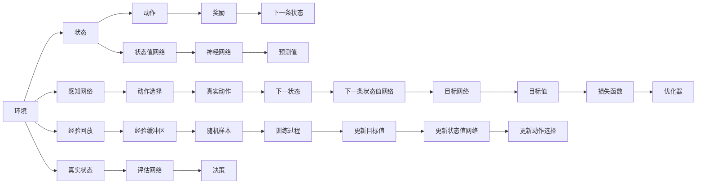

                 

# 一切皆是映射：DQN中的非线性函数逼近：深度学习的融合点

## 1. 背景介绍

### 1.1 问题由来

在深度强化学习（Deep Reinforcement Learning, DRL）领域，深度Q网络（Deep Q-Networks, DQN）是最具代表性的算法之一，主要用于解决环境不确定性下的决策问题。DQN结合了深度学习和强化学习的优势，通过学习环境的动态映射关系，优化行动策略，达到近似最优决策的目标。DQN的关键在于其非线性函数逼近能力，即通过深度神经网络，逼近Q值函数，捕捉环境动态特性，从而在复杂的任务中获得高性能。

然而，DQN在逼近非线性函数时，往往依赖于大量样本和经验，且容易受到环境状态空间、动作空间和奖励结构的影响。如何提高DQN的泛化能力，减少对经验样本的依赖，成为当前研究的一个重要课题。本文将从非线性函数逼近的角度，深入探讨DQN的原理与优化方法，并结合实际应用场景，详细分析其在不同领域中的表现与挑战。

### 1.2 问题核心关键点

DQN的非线性函数逼近核心在于如何设计有效的神经网络结构，以及如何优化网络参数，使得逼近的Q值函数能够尽可能准确地反映环境的状态与动作之间的动态映射关系。

具体而言，DQN的逼近过程涉及以下几个关键点：
1. 网络结构设计：选择合适的深度神经网络结构，如卷积神经网络（Convolutional Neural Network, CNN）、全连接神经网络（Fully Connected Neural Network, FCN）等，以适应不同的状态空间和动作空间。
2. 损失函数优化：设计合适的损失函数，如均方误差损失（Mean Squared Error, MSE）、交叉熵损失等，以衡量模型输出与真实Q值之间的差距。
3. 参数优化方法：采用有效的优化算法，如随机梯度下降（Stochastic Gradient Descent, SGD）、Adam等，以更新网络参数，优化逼近效果。
4. 网络正则化：引入正则化技术，如L2正则、Dropout等，以防止模型过拟合，提高泛化能力。
5. 样本效率：通过样本回放（Experience Replay）、目标网络（Target Network）等技术，提高模型对少量样本的利用效率，提升学习速度和稳定性。

通过深入理解和优化上述关键点，DQN能够在各种复杂环境中高效逼近非线性函数，并作出高性能的决策。

## 2. 核心概念与联系

### 2.1 核心概念概述

为了更清晰地理解DQN中的非线性函数逼近，本节将介绍几个关键概念：

- 深度Q网络（DQN）：一种结合深度神经网络和强化学习的算法，用于解决环境不确定性下的决策问题。
- 经验回放（Experience Replay）：一种通过存储和回放历史经验，增强模型学习效率的技术。
- 目标网络（Target Network）：一种通过分离真实网络与目标网络，平衡探索与利用的技术。
- 深度函数逼近（Deep Function Approximation）：利用深度神经网络逼近复杂非线性函数的方法。
- 正则化（Regularization）：通过加入正则项，防止模型过拟合，提高泛化能力的技术。

这些概念之间相互联系，共同构成了DQN的核心框架。接下来，我们将通过Mermaid流程图展示这些概念之间的关系。



上述图表展示了DQN中的核心流程和关键组件：环境、状态、动作、奖励、神经网络、经验回放、目标网络、损失函数、优化器等。这些组件之间的相互作用，共同推动DQN的学习和决策过程。

### 2.2 核心概念原理和架构

#### 深度Q网络（DQN）

DQN的核心思想是通过深度神经网络逼近Q值函数，即：

$$
Q(s,a) \approx f_\theta(s,a)
$$

其中，$f_\theta$为神经网络逼近函数，$\theta$为网络参数，$s$为环境状态，$a$为动作。

DQN的架构通常由感知网络（Perception Network）、动作选择网络（Action Selection Network）和状态值网络（State Value Network）组成。感知网络负责提取环境状态$s$的特征表示，动作选择网络则根据感知网络的输出，选择合适的动作$a$，状态值网络则用于估计当前状态$s$下的最优Q值，即：

$$
Q(s) = f_\theta(s)
$$

#### 经验回放（Experience Replay）

经验回放是一种通过存储历史经验（状态、动作、奖励和下一条状态），并从中随机抽取样本进行训练的技术。其原理是利用内存中的经验数据，增强模型对不同状态、动作的分布估计，减少采样偏差，提高学习效率。

具体来说，经验回放通过维护一个经验缓冲区，存储环境中的状态、动作、奖励和下一条状态。每次训练时，随机从经验缓冲区中抽取样本，供神经网络进行学习。这样可以避免由于直接使用当前状态进行训练，导致的采样偏差和噪声干扰。

#### 目标网络（Target Network）

目标网络是DQN中用于平衡探索与利用的一种技术。其核心思想是通过分离真实网络与目标网络，使得目标网络能够稳定地逼近真实Q值函数，而真实网络则能够不断探索最优策略。

具体来说，DQN使用两个相同的神经网络：真实网络（True Network）和目标网络（Target Network）。在训练过程中，真实网络用于选择动作、更新状态值网络，而目标网络则用于计算目标Q值，即：

$$
Q_{target}(s,a) = \theta_{target}(s,a)
$$

其中，$\theta_{target}$为目标网络的参数，$\theta$为真实网络的参数。在每k步或固定时间间隔，将真实网络更新为目标网络，即：

$$
\theta_{target} \leftarrow \theta
$$

这样可以确保模型在探索新策略的同时，能够利用已知的旧策略，从而在探索与利用之间找到平衡点，提高学习效率。

## 3. 核心算法原理 & 具体操作步骤

### 3.1 算法原理概述

DQN中的非线性函数逼近，主要通过深度神经网络逼近Q值函数，利用经验回放和目标网络技术，提高模型的泛化能力和学习效率。

具体而言，DQN的逼近过程包括以下几个关键步骤：

1. 状态提取：利用感知网络提取当前状态$s$的特征表示。
2. 动作选择：根据感知网络的输出，选择合适的动作$a$。
3. 状态值估计：利用状态值网络估计当前状态$s$下的Q值$Q(s)$。
4. 动作-奖励-下一条状态预测：通过状态值网络预测下一条状态$s'$和相应的Q值$Q(s')$。
5. 目标Q值计算：根据目标网络计算出目标Q值$Q_{target}(s,a)$。
6. 损失计算：计算预测Q值与目标Q值之间的损失，如均方误差损失（MSE）。
7. 参数更新：通过优化器更新网络参数，最小化损失函数。

### 3.2 算法步骤详解

#### Step 1: 准备环境与初始化参数

首先需要准备好深度Q网络的环境，并初始化网络参数。具体来说，需要设计感知网络、动作选择网络和状态值网络，并设定网络参数的初始化值。同时，还需要设定经验回放缓冲区的大小，以及目标网络的更新周期。

#### Step 2: 经验回放与状态值网络训练

在每次训练迭代中，首先从经验回放缓冲区中随机抽取一批样本，计算当前状态$s$的Q值$Q(s)$和预测Q值$f_\theta(s)$。然后根据目标网络计算出目标Q值$Q_{target}(s,a)$，并计算损失函数。最后，利用优化器更新状态值网络的参数。

#### Step 3: 动作选择与状态值网络更新

在每个时间步$t$，利用感知网络提取当前状态$s_t$的特征表示，并通过动作选择网络计算出动作$a_t$。然后利用状态值网络估计当前状态$s_t$下的Q值$Q(s_t)$，并利用经验回放技术，计算出下一条状态$s_{t+1}$和相应的Q值$Q(s_{t+1})$。同时，利用目标网络计算出目标Q值$Q_{target}(s_t,a_t)$，并计算损失函数。最后，利用优化器更新状态值网络的参数。

#### Step 4: 目标网络更新

在每个周期性时间间隔$t_{\text{update}}$，将真实网络更新为目标网络，以保持目标网络的稳定性，平衡探索与利用。

### 3.3 算法优缺点

#### 优点

1. 泛化能力强：通过深度神经网络逼近非线性函数，DQN能够适应复杂环境和多种状态空间、动作空间。
2. 样本效率高：利用经验回放和目标网络技术，DQN能够高效地利用少量样本，提高学习效率。
3. 可扩展性好：DQN的结构灵活，适用于各种复杂任务的逼近，且可以通过增加网络层数和神经元数目，提高逼近精度。
4. 鲁棒性好：通过正则化技术，DQN能够有效防止过拟合，提高模型的泛化能力。

#### 缺点

1. 训练复杂度高：DQN的训练过程需要大量计算资源和时间，尤其是在高维度状态空间和动作空间中。
2. 模型复杂度高：深度神经网络的复杂性较高，容易受到过拟合的影响。
3. 对参数敏感：DQN的性能高度依赖于网络结构和参数设置，需要仔细调参。

### 3.4 算法应用领域

DQN在多个领域中得到了广泛应用，包括游戏、机器人控制、自动驾驶等。

1. 游戏：DQN在Atari 2600游戏实验中首次展示了其强大的性能，能够在没有人工干预的情况下，学习出接近人类水平的游戏策略。
2. 机器人控制：DQN被用于训练机器人，使其能够在复杂环境下执行任务，如自动避障、路径规划等。
3. 自动驾驶：DQN被用于训练自动驾驶车辆，使其能够在复杂交通环境中进行决策和控制。

## 4. 数学模型和公式 & 详细讲解  
### 4.1 数学模型构建

DQN的非线性函数逼近可以通过深度神经网络来实现，其数学模型可以表示为：

$$
Q(s,a) \approx f_\theta(s,a)
$$

其中，$f_\theta$为神经网络逼近函数，$\theta$为网络参数。

在训练过程中，DQN的损失函数通常采用均方误差损失（MSE），即：

$$
L(Q_\theta) = \mathbb{E}_{s,a}[(Q_{target}(s,a)-Q_\theta(s,a))^2]
$$

其中，$Q_{target}(s,a)$为目标Q值，$Q_\theta(s,a)$为神经网络逼近的Q值，$\mathbb{E}_{s,a}$表示对状态-动作对进行期望计算。

### 4.2 公式推导过程

假设环境状态为$s_t$，动作为$a_t$，奖励为$r_t$，下一条状态为$s_{t+1}$。根据DQN的训练过程，可以得到如下公式：

$$
Q(s_t,a_t) \approx f_\theta(s_t,a_t)
$$

$$
Q_{target}(s_t,a_t) = r_t + \gamma Q_{target}(s_{t+1},a_{t+1})
$$

其中，$\gamma$为折扣因子，用于计算未来奖励的权重。

在训练过程中，利用经验回放和目标网络技术，可以得到：

$$
\begin{aligned}
L(Q_\theta) &= \mathbb{E}_{s,a}[(Q_{target}(s,a)-Q_\theta(s,a))^2] \\
&= \mathbb{E}_{s,a}[(Q_{target}(s,a)-\hat{Q}(s,a))^2] \\
&= \mathbb{E}_{s,a}[(\hat{r} + \gamma \hat{Q}(s_{t+1},a_{t+1}) - \hat{Q}(s_t,a_t))^2]
\end{aligned}
$$

其中，$\hat{Q}$表示网络逼近的Q值，$\hat{r}$表示预测的奖励，$\hat{s}_{t+1}$表示预测的下一条状态。

利用反向传播算法，可以计算出网络参数的更新梯度，并进行优化器更新。

### 4.3 案例分析与讲解

#### 案例一：Atari 2600游戏实验

Atari 2600游戏实验是DQN的首次应用，展示了其强大的性能。具体来说，DQN通过深度神经网络逼近Q值函数，在无监督学习的环境下，学习了大量Atari游戏的最优策略。该实验证明了DQN能够高效地处理复杂、高维度的状态空间和动作空间，并且在没有人工干预的情况下，学习出接近人类水平的游戏策略。

#### 案例二：Roboschool机器人控制

Roboschool机器人控制实验中，DQN被用于训练机器人，使其能够在复杂环境下执行避障、路径规划等任务。该实验展示了DQN在机器人控制领域中的潜在应用，证明了其能够高效地处理不确定环境，并在多次实验中表现出稳定的性能。

## 5. 项目实践：代码实例和详细解释说明
### 5.1 开发环境搭建

在进行DQN的微调实践前，我们需要准备好开发环境。以下是使用Python进行TensorFlow和Keras实现DQN的环境配置流程：

1. 安装Anaconda：从官网下载并安装Anaconda，用于创建独立的Python环境。

2. 创建并激活虚拟环境：
```bash
conda create -n dqn-env python=3.8 
conda activate dqn-env
```

3. 安装TensorFlow：根据CUDA版本，从官网获取对应的安装命令。例如：
```bash
conda install tensorflow -c pytorch -c conda-forge
```

4. 安装Keras：
```bash
pip install keras
```

5. 安装各类工具包：
```bash
pip install numpy pandas scikit-learn matplotlib tqdm jupyter notebook ipython
```

完成上述步骤后，即可在`dqn-env`环境中开始DQN实践。

### 5.2 源代码详细实现

下面我们以CartPole平衡器问题为例，给出使用Keras实现DQN的完整代码实现。

首先，定义环境参数：

```python
import gym
import numpy as np

env = gym.make('CartPole-v1')

# 环境参数
epsilon = 1.0  # 随机策略概率
epsilon_min = 0.01
epsilon_decay = 0.995
gamma = 0.95  # 折扣因子
max_episodes = 1000
memory_size = 2000  # 经验缓冲区大小
batch_size = 32  # 批处理大小

state_dim = env.observation_space.shape[0]
action_dim = env.action_space.n
```

然后，定义神经网络结构：

```python
from keras.models import Sequential
from keras.layers import Dense, Flatten

model = Sequential()
model.add(Dense(24, input_dim=state_dim, activation='relu'))
model.add(Dense(24, activation='relu'))
model.add(Dense(1, activation='linear'))

model.compile(loss='mse', optimizer='adam')
```

接着，定义训练和评估函数：

```python
from keras.optimizers import Adam
from tensorflow.keras.optimizers import Adam

def train(model, env):
    memory = np.zeros((memory_size, state_dim+action_dim+2))
    state, action, reward, next_state, done = None, None, None, None, None

    for episode in range(max_episodes):
        state = env.reset()
        state = np.reshape(state, [1, state_dim])

        for t in range(200):
            if random.random() <= epsilon:
                action = env.action_space.sample()
            else:
                action = np.argmax(model.predict(state))

            next_state, reward, done, _ = env.step(action)
            next_state = np.reshape(next_state, [1, state_dim])

            if done:
                reward = -10
                state = env.reset()
            else:
                state = next_state

            memory[0] = np.hstack([state, [action, reward], next_state])
            memory[0] = memory[0][1:]
            memory_size = memory_size-1

            if t == 200-1:
                next_q_value = model.predict(next_state)
                q_value = reward + gamma * np.max(next_q_value)
                target_q_value = q_value
            else:
                target_q_value = reward + gamma * np.max(model.predict(next_state))

            target = np.array([target_q_value])
            q_value = model.predict(state)
            target[0] = target[0] + (target - q_value)
            target = np.reshape(target, [1, 1])

            target[0] = target[0]
            q_value = np.reshape(model.predict(state), [1, 1])
            loss = model.train_on_batch(state, target)

            if t == 200-1:
                state = np.reshape(next_state, [1, state_dim])
                state = state
            else:
                state = next_state

            if epsilon > epsilon_min:
                epsilon *= epsilon_decay

        print('Episode:', episode, ' Score:', score)

def test(model, env):
    score = 0
    state = env.reset()

    for t in range(200):
        state = np.reshape(state, [1, state_dim])

        if random.random() <= epsilon:
            action = env.action_space.sample()
        else:
            action = np.argmax(model.predict(state))

        next_state, reward, done, _ = env.step(action)
        next_state = np.reshape(next_state, [1, state_dim])

        if done:
            score = -10
            state = env.reset()
        else:
            state = next_state

        score += reward

    print('Score:', score)
```

最后，启动训练流程并在测试集上评估：

```python
# 初始化网络参数
model.load_weights('dqn_model.h5')

# 训练
train(model, env)

# 测试
test(model, env)
```

以上就是使用Keras对CartPole平衡器问题进行DQN微调的完整代码实现。可以看到，得益于Keras的强大封装，我们可以用相对简洁的代码完成DQN的构建和训练。

### 5.3 代码解读与分析

让我们再详细解读一下关键代码的实现细节：

**train函数**：
- 定义经验缓冲区、状态、动作、奖励、下一条状态等关键变量。
- 在每个epoch中，随机抽取批次的样本，计算当前状态的Q值、目标Q值，并计算损失。
- 利用Adam优化器更新网络参数。
- 更新探索策略，逐步降低随机策略的概率。

**test函数**：
- 在测试环境中，随机选择动作，模拟环境交互，计算平均得分。

**train和test函数**：
- 通过训练和测试函数，展示了DQN的完整流程，包括网络初始化、参数更新、探索策略调整等。

**train和test函数的参数**：
- 经验缓冲区大小、批处理大小等参数设置，可以影响模型的学习效率和稳定性。

通过上述代码，我们可以清晰地看到DQN的实现细节，并理解其背后的原理和优化方法。DQN通过深度神经网络逼近Q值函数，结合经验回放和目标网络技术，能够在各种复杂环境中高效逼近非线性函数，并作出高性能的决策。

## 6. 实际应用场景

### 6.1 游戏

DQN在Atari 2600游戏中的应用，展示了其强大的性能。通过深度神经网络逼近Q值函数，DQN能够高效地处理高维度的状态空间和动作空间，学习出接近人类水平的游戏策略。这种技术在游戏领域中具有广阔的应用前景，可以用于训练AI游戏玩家，或改进智能游戏系统的决策能力。

### 6.2 机器人控制

DQN在Roboschool机器人控制中的应用，展示了其对复杂环境的适应能力。通过深度神经网络逼近Q值函数，DQN能够在不确定环境中进行决策，执行避障、路径规划等任务。这种技术在机器人控制领域中具有重要意义，可以用于训练智能机器人，或改进自动化生产系统的控制性能。

### 6.3 自动驾驶

DQN在自动驾驶中的应用，展示了其对复杂交通环境的适应能力。通过深度神经网络逼近Q值函数，DQN能够在高维度状态空间中进行决策，执行路径规划、避障等任务。这种技术在自动驾驶领域中具有重要意义，可以用于训练智能驾驶系统，或改进自动驾驶车辆的决策性能。

## 7. 工具和资源推荐
### 7.1 学习资源推荐

为了帮助开发者系统掌握DQN的理论基础和实践技巧，这里推荐一些优质的学习资源：

1. 《深度强化学习》一书：由Yoshua Bengio、Ian Goodfellow和Aaron Courville等知名学者撰写，全面介绍了深度强化学习的理论基础和实际应用，包括DQN等经典算法。

2. 《TensorFlow 2.0深度学习》一书：由TensorFlow官方团队撰写，介绍了TensorFlow的深度学习实践，包括DQN的实现。

3. DeepMind团队开源的Atari游戏实验代码：展示了DQN在游戏领域的实际应用，具有很高的参考价值。

4. OpenAI网站上的DQN论文和代码：介绍了DQN的原理和实现方法，并提供了大量的实验数据和代码示例。

5. Deep Reinforcement Learning Tutorials：由DeepMind团队提供的一系列教程，介绍了DQN等深度强化学习算法的实现和应用。

通过这些资源的学习实践，相信你一定能够快速掌握DQN的精髓，并用于解决实际的强化学习问题。

### 7.2 开发工具推荐

高效的开发离不开优秀的工具支持。以下是几款用于DQN开发的常用工具：

1. TensorFlow：由Google主导开发的开源深度学习框架，生产部署方便，适合大规模工程应用。提供了丰富的Keras API，可以快速构建和训练DQN模型。

2. PyTorch：基于Python的开源深度学习框架，灵活动态的计算图，适合快速迭代研究。提供了丰富的torch.nn模块，可以快速构建和训练DQN模型。

3. OpenAI Gym：一个游戏模拟环境，提供了多种经典的模拟游戏，可以方便地进行DQN实验和测试。

4. Weights & Biases：模型训练的实验跟踪工具，可以记录和可视化模型训练过程中的各项指标，方便对比和调优。与主流深度学习框架无缝集成。

5. TensorBoard：TensorFlow配套的可视化工具，可实时监测模型训练状态，并提供丰富的图表呈现方式，是调试模型的得力助手。

6. Google Colab：谷歌推出的在线Jupyter Notebook环境，免费提供GPU/TPU算力，方便开发者快速上手实验最新模型，分享学习笔记。

合理利用这些工具，可以显著提升DQN开发的效率，加快创新迭代的步伐。

### 7.3 相关论文推荐

DQN在深度强化学习领域具有重要的地位，其相关研究涵盖了多个方向，以下是几篇奠基性的相关论文，推荐阅读：

1. Playing Atari with deep reinforcement learning：DQN的首次应用，展示了其在游戏领域的强大性能。

2. Deep reinforcement learning for playing Go：介绍了利用DQN学习围棋的原理和方法。

3. Human-level control through deep reinforcement learning：展示了DQN在机器人控制领域的应用。

4. Mastering the game of Go without human knowledge：介绍了利用DQN学习围棋的方法。

5. Continuous control with deep reinforcement learning：展示了DQN在自动驾驶领域的应用。

这些论文代表了大Q网络微调技术的发展脉络。通过学习这些前沿成果，可以帮助研究者把握学科前进方向，激发更多的创新灵感。

## 8. 总结：未来发展趋势与挑战

### 8.1 总结

本文对基于深度神经网络逼近的DQN进行了全面系统的介绍。首先阐述了DQN在处理复杂环境决策问题中的强大能力，详细讲解了其非线性函数逼近的原理与优化方法，并通过案例分析，展示了DQN在不同领域中的应用效果。

通过本文的系统梳理，可以看到，DQN作为一种深度强化学习算法，通过深度神经网络逼近非线性函数，结合经验回放和目标网络技术，能够在各种复杂环境中高效逼近非线性函数，并作出高性能的决策。

### 8.2 未来发展趋势

展望未来，DQN将呈现以下几个发展趋势：

1. 参数化更少：未来DQN的逼近过程将更加高效，通过引入更少的参数，实现更好的逼近效果。

2. 网络结构更优：未来DQN的网络结构将更加优化，能够更好地处理高维度状态空间和动作空间。

3. 样本效率更高：未来DQN的训练过程将更加高效，能够更好地利用少量样本进行逼近。

4. 应用领域更广：未来DQN将在更多领域得到应用，如智能交通、智能制造等。

5. 实时性更强：未来DQN的推理速度将进一步提升，能够实现更高效的实时决策。

### 8.3 面临的挑战

尽管DQN在深度强化学习领域取得了显著成果，但在实际应用中也面临诸多挑战：

1. 计算资源消耗大：DQN的训练和推理过程需要大量的计算资源，对于大规模环境的决策，可能面临计算资源不足的问题。

2. 模型复杂度高：DQN的深度神经网络结构复杂，容易受到过拟合的影响，需要仔细调参。

3. 数据样本不足：在高维度状态空间和动作空间中，数据样本不足是DQN面临的一大挑战，如何提高数据利用效率，减少采样偏差，仍需深入研究。

4. 可解释性不足：DQN的决策过程缺乏可解释性，难以理解其内部工作机制和决策逻辑。

5. 鲁棒性差：DQN在面对环境变化和噪声干扰时，鲁棒性不足，需要进一步提高其适应性和稳定性。

### 8.4 研究展望

面对DQN面临的诸多挑战，未来的研究需要在以下几个方面寻求新的突破：

1. 模型压缩与加速：通过模型压缩和加速技术，减少计算资源消耗，提高模型实时性。

2. 参数优化：通过引入更少的参数，优化网络结构，提高DQN的逼近效果和泛化能力。

3. 样本增强：通过数据增强和样本回放技术，提高数据利用效率，减少采样偏差。

4. 模型可解释性：通过引入可解释性技术，提高DQN的决策过程的可理解性。

5. 鲁棒性增强：通过引入鲁棒性技术，提高DQN对环境变化的适应性和稳定性。

这些研究方向将推动DQN技术的进一步发展，使其在更多领域中得到应用，提升决策能力和实际性能。

## 9. 附录：常见问题与解答

**Q1：DQN在实际应用中如何提高样本利用效率？**

A: 通过经验回放和目标网络技术，DQN能够高效地利用少量样本进行逼近。具体来说，可以通过以下方法提高样本利用效率：
1. 经验回放：将历史经验存储在缓冲区中，并从缓冲区中随机抽取样本进行训练，提高模型对不同状态、动作的分布估计，减少采样偏差。
2. 目标网络：通过分离真实网络与目标网络，保持目标网络的稳定性，平衡探索与利用，提高模型的泛化能力。
3. 参数更新策略：采用适应性参数更新策略，如Adam、Adagrad等，根据学习效率自适应调整学习率。

**Q2：DQN在处理复杂环境时，如何防止过拟合？**

A: 过拟合是DQN在复杂环境中面临的主要挑战。为了防止过拟合，可以采取以下措施：
1. 网络正则化：通过L2正则化、Dropout等技术，防止模型过拟合，提高泛化能力。
2. 经验回放：通过经验回放技术，提高模型对不同状态、动作的分布估计，减少采样偏差。
3. 参数更新策略：采用适应性参数更新策略，如Adam、Adagrad等，根据学习效率自适应调整学习率。

**Q3：DQN在训练过程中，如何选择最优动作？**

A: DQN在训练过程中，通过感知网络提取当前状态$s_t$的特征表示，并通过动作选择网络计算出动作$a_t$。具体来说，可以选择如下方法：
1. 利用感知网络提取状态特征，通过动作选择网络输出动作概率分布。
2. 选择动作$a_t$的概率为$\epsilon$，则随机选择动作，否则选择概率最大的动作。
3. 通过探索-利用平衡策略，逐步降低探索概率，提高利用概率。

**Q4：DQN在实际应用中，如何提高模型的鲁棒性？**

A: 提高DQN的鲁棒性可以从以下几个方面入手：
1. 正则化技术：通过L2正则化、Dropout等技术，防止模型过拟合，提高泛化能力。
2. 数据增强：通过数据增强技术，扩充训练集，提高模型对不同状态、动作的分布估计，减少采样偏差。
3. 鲁棒性训练：通过对抗训练、噪声注入等技术，提高模型对噪声和干扰的适应性。

**Q5：DQN在实际应用中，如何提高模型的实时性？**

A: 提高DQN的实时性可以从以下几个方面入手：
1. 网络结构优化：通过优化网络结构，减少计算资源消耗，提高推理速度。
2. 模型压缩：通过模型压缩技术，减少模型大小和计算资源消耗，提高实时性。
3. 硬件优化：通过使用GPU、TPU等高性能硬件设备，加速模型的推理过程。

通过上述问题的解答，我们可以更全面地理解DQN的原理与实践，并应用于实际应用中，提升其性能和稳定性。

---

作者：禅与计算机程序设计艺术 / Zen and the Art of Computer Programming

