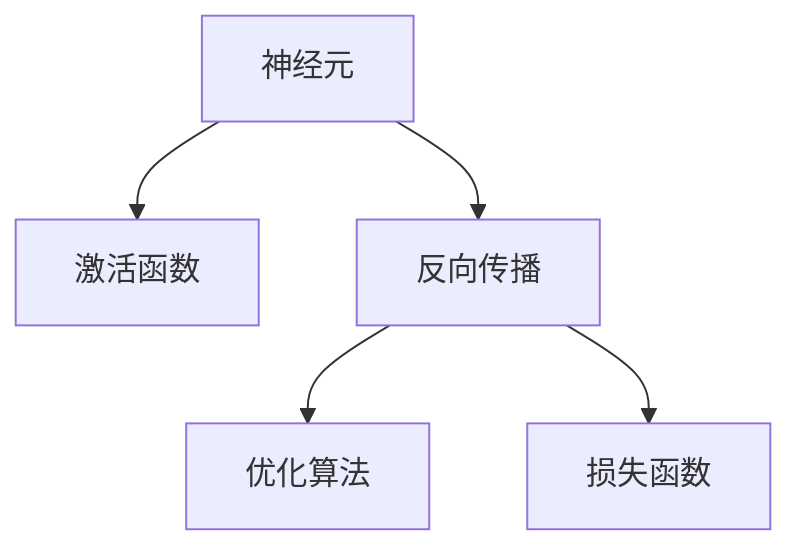

                 

# 一切皆是映射：从零开始构建深度学习架构

> 关键词：深度学习,深度神经网络,架构设计,模型构建,反向传播,优化算法,损失函数

## 1. 背景介绍

### 1.1 问题由来

深度学习，作为人工智能领域的重要分支，已经在图像识别、语音识别、自然语言处理等多个方向取得了突破性进展。深度神经网络(DNN)，作为深度学习的主要组成部分，通过多层非线性变换，逐渐从低维输入空间映射到高维输出空间，能够处理复杂的非线性关系，实现高效的特征提取和分类识别。

然而，构建一个有效的深度神经网络，往往需要系统性思考模型架构、网络结构、参数初始化、优化算法等多个环节。这不仅需要深厚的数学基础，还需要丰富的工程经验。因此，如何将深度学习架构设计抽象为一组系统性原则，并转化为实践中的具体步骤，是本文的核心目标。

### 1.2 问题核心关键点

构建深度学习架构的核心在于理解网络的基本组成单元和映射原理，以及如何通过优化算法，更新模型参数，最小化损失函数，使得模型输出逼近真实标签。本文将系统介绍深度神经网络的组成单元、网络结构、参数初始化、优化算法等关键概念，并通过实际项目案例，详细讲解模型构建的实践过程。

## 2. 核心概念与联系

### 2.1 核心概念概述

为更好地理解深度学习架构设计的原理，本节将介绍几个密切相关的核心概念：

- 深度神经网络(Deep Neural Network, DNN)：以多层非线性变换为特点，能够处理复杂非线性关系，实现特征提取和分类识别的网络模型。
- 神经元(Neuron)：深度神经网络的基本组成单元，通过接收输入、计算激活函数，传递给下一层。
- 激活函数(Activation Function)：引入非线性特性，使得神经网络能够处理非线性关系，如Sigmoid、ReLU、Tanh等。
- 反向传播(Backpropagation)：通过链式法则，反向计算梯度，更新模型参数，以最小化损失函数。
- 优化算法(Optimization Algorithm)：如梯度下降(GD)、Adam、Adagrad等，用于更新模型参数，以逼近损失函数最小值。
- 损失函数(Loss Function)：如均方误差(MSE)、交叉熵(Cross-Entropy)等，用于衡量模型预测与真实标签之间的差异。

这些核心概念之间的逻辑关系可以通过以下Mermaid流程图来展示：



这个流程图展示了大语言模型的核心概念及其之间的关系：

1. 神经元通过激活函数计算输出，引入非线性特性。
2. 反向传播通过链式法则计算梯度，更新模型参数。
3. 优化算法用于更新参数，最小化损失函数。
4. 损失函数衡量模型预测与真实标签之间的差异。

这些概念共同构成了深度神经网络的学习框架，使其能够处理复杂数据，实现高效特征提取和分类识别。

## 3. 核心算法原理 & 具体操作步骤
### 3.1 算法原理概述

深度神经网络的构建基于反向传播算法。其核心思想是通过链式法则，计算损失函数对模型参数的梯度，反向传播并更新参数，以最小化损失函数，使得模型输出逼近真实标签。

形式化地，假设模型参数为 $\theta$，训练数据集为 $D=\{(x_i,y_i)\}_{i=1}^N$。定义模型在数据样本 $(x_i,y_i)$ 上的损失函数为 $\ell(\theta)$，则反向传播的优化目标是最小化损失函数，即：

$$
\theta^* = \mathop{\arg\min}_{\theta} \mathcal{L}(\theta)
$$

其中 $\mathcal{L}(\theta) = \frac{1}{N}\sum_{i=1}^N \ell(\theta,x_i,y_i)$ 为平均损失函数。

通过梯度下降等优化算法，反向传播过程不断更新模型参数 $\theta$，最小化损失函数 $\mathcal{L}(\theta)$，使得模型输出逼近真实标签 $y_i$。由于 $\theta$ 已经通过前向传播计算获得了预测值 $\hat{y}$，因此反向传播过程可以高效地计算损失函数梯度，更新模型参数。

### 3.2 算法步骤详解

深度神经网络的构建通常包括以下几个关键步骤：

**Step 1: 定义模型结构**
- 选择合适的网络结构，如卷积神经网络(CNN)、递归神经网络(RNN)、循环神经网络(LSTM)、Transformer等。
- 设计每个神经元的激活函数，如ReLU、Tanh、Sigmoid等。
- 确定网络的输入层、隐藏层、输出层的大小。

**Step 2: 数据预处理**
- 标准化数据，如归一化、中心化等。
- 将数据划分为训练集、验证集和测试集。
- 对数据进行分批处理，每个批次 $(x_i, y_i)$。

**Step 3: 定义损失函数**
- 根据任务类型，选择合适的损失函数，如交叉熵损失、均方误差损失等。
- 定义模型输出 $y$ 与真实标签 $y_i$ 的差距，计算损失值 $\ell(y_i, y)$。

**Step 4: 定义优化器**
- 选择合适的优化算法，如SGD、Adam、Adagrad等。
- 设置学习率 $\eta$、批次大小 $b$、迭代轮数 $T$ 等参数。

**Step 5: 前向传播与反向传播**
- 对每个批次数据 $(x_i, y_i)$，进行前向传播计算，得到模型预测值 $\hat{y}$。
- 计算损失值 $\ell(\hat{y}, y_i)$。
- 反向传播计算梯度，更新模型参数。

**Step 6: 模型评估与调整**
- 在验证集上评估模型性能，根据验证集损失调整模型参数。
- 重复Step 5-6，直到达到预设的迭代轮数或性能要求。

### 3.3 算法优缺点

深度神经网络具有以下优点：
1. 非线性映射能力。多层非线性变换能够处理复杂的非线性关系，实现高效特征提取和分类识别。
2. 高度可扩展性。深度神经网络可以不断叠加层数，扩大网络规模，适应更复杂的问题。
3. 强大的泛化能力。通过大规模训练数据，深度神经网络可以学习到通用的特征表示，适用于多种任务。
4. 高效的处理能力。深度神经网络具有高度并行化的计算结构，在大规模数据集上训练速度快，性能优异。

然而，深度神经网络也存在以下缺点：
1. 参数过多。深度神经网络的参数量往往巨大，导致训练过程复杂，容易过拟合。
2. 计算量大。深度神经网络的前向传播和反向传播计算复杂度高，需要大量的计算资源。
3. 模型复杂度高。深度神经网络的设计和调试复杂，需要深厚的专业知识。
4. 依赖数据质量。深度神经网络对数据分布的假设严格，低质量、不平衡的数据可能导致模型性能不佳。

尽管存在这些局限性，但深度神经网络在图像识别、语音识别、自然语言处理等诸多领域取得了突破性进展，展示了强大的处理能力和泛化能力。未来，随着硬件设备的进步和算法优化，深度神经网络的性能和应用前景将更加广阔。

### 3.4 算法应用领域

深度神经网络在多个领域得到了广泛应用，涵盖了视觉、语音、自然语言处理等多个方向。以下是几个典型应用：

- 计算机视觉：图像分类、物体检测、图像分割等。通过卷积神经网络(CNN)对图像特征进行提取和分类。
- 语音识别：语音识别、语音合成等。通过循环神经网络(RNN)对语音信号进行特征提取和识别。
- 自然语言处理：机器翻译、情感分析、问答系统等。通过递归神经网络(RNN)、Transformer等对文本进行编码和解码。
- 机器人控制：机器人运动规划、路径规划等。通过神经网络对机器人动作进行优化和控制。
- 金融预测：股票价格预测、风险评估等。通过深度神经网络对历史数据进行建模和预测。

这些应用展示了深度神经网络的强大处理能力，推动了各领域的技术进步和创新。未来，随着深度神经网络技术的进一步发展，其应用领域将更加广泛，为各行各业带来新的变革。

## 4. 数学模型和公式 & 详细讲解
### 4.1 数学模型构建

本节将使用数学语言对深度神经网络的构建过程进行严格刻画。

记深度神经网络模型为 $f_\theta: \mathcal{X} \rightarrow \mathcal{Y}$，其中 $\mathcal{X}$ 为输入空间，$\mathcal{Y}$ 为输出空间，$\theta$ 为模型参数。假设训练数据集为 $D=\{(x_i,y_i)\}_{i=1}^N$，模型在前向传播中的计算过程为：

$$
f_\theta(x) = h_1(h_2(\ldots h_l(z)\ldots))
$$

其中 $z$ 为输入层，$h_l$ 为第 $l$ 层神经元，$h_1$ 为激活函数。模型在数据样本 $(x_i,y_i)$ 上的损失函数定义为：

$$
\ell(f_\theta(x_i),y_i) = \frac{1}{2}(f_\theta(x_i)-y_i)^2
$$

其中均方误差用于衡量模型预测与真实标签之间的差异。训练目标是最小化损失函数：

$$
\mathcal{L}(\theta) = \frac{1}{N}\sum_{i=1}^N \ell(f_\theta(x_i),y_i)
$$

### 4.2 公式推导过程

以深度神经网络为例，推导其反向传播算法和梯度更新公式。

设深度神经网络模型 $f_\theta$ 在数据样本 $(x_i,y_i)$ 上的前向传播计算为 $f_\theta(x_i) = \hat{y}$。则均方误差损失函数为：

$$
\ell(\hat{y},y_i) = \frac{1}{2}(\hat{y}-y_i)^2
$$

根据链式法则，损失函数对第 $l$ 层参数 $\theta_l$ 的梯度为：

$$
\frac{\partial \mathcal{L}}{\partial \theta_l} = \frac{1}{N}\sum_{i=1}^N \frac{\partial \ell(f_\theta(x_i),y_i)}{\partial \hat{y}} \cdot \frac{\partial \hat{y}}{\partial z_l} \cdot \frac{\partial z_l}{\partial \theta_l}
$$

其中 $\frac{\partial \ell(f_\theta(x_i),y_i)}{\partial \hat{y}} = f_\theta(x_i)-y_i$，$\frac{\partial \hat{y}}{\partial z_l} = \frac{\partial f_\theta(x_i)}{\partial z_l}$，$\frac{\partial z_l}{\partial \theta_l}$ 为第 $l$ 层神经元的梯度。

通过链式法则，反向传播过程可以高效计算出损失函数对所有参数的梯度。将梯度代入梯度下降算法：

$$
\theta_l \leftarrow \theta_l - \eta \frac{\partial \mathcal{L}}{\partial \theta_l}
$$

其中 $\eta$ 为学习率。通过不断迭代更新参数，反向传播过程不断优化模型，最小化损失函数。

## 5. 项目实践：代码实例和详细解释说明
### 5.1 开发环境搭建

在进行深度学习架构设计实践前，我们需要准备好开发环境。以下是使用Python进行PyTorch开发的环境配置流程：

1. 安装Anaconda：从官网下载并安装Anaconda，用于创建独立的Python环境。

2. 创建并激活虚拟环境：
```bash
conda create -n pytorch-env python=3.8 
conda activate pytorch-env
```

3. 安装PyTorch：根据CUDA版本，从官网获取对应的安装命令。例如：
```bash
conda install pytorch torchvision torchaudio cudatoolkit=11.1 -c pytorch -c conda-forge
```

4. 安装各类工具包：
```bash
pip install numpy pandas scikit-learn matplotlib tqdm jupyter notebook ipython
```

完成上述步骤后，即可在`pytorch-env`环境中开始架构设计实践。

### 5.2 源代码详细实现

下面我们以图像分类任务为例，给出使用PyTorch进行卷积神经网络(CNN)模型构建的PyTorch代码实现。

首先，定义CNN模型的网络结构：

```python
import torch.nn as nn
import torch.nn.functional as F

class Net(nn.Module):
    def __init__(self):
        super(Net, self).__init__()
        self.conv1 = nn.Conv2d(3, 6, 5)
        self.pool = nn.MaxPool2d(2, 2)
        self.conv2 = nn.Conv2d(6, 16, 5)
        self.fc1 = nn.Linear(16 * 5 * 5, 120)
        self.fc2 = nn.Linear(120, 84)
        self.fc3 = nn.Linear(84, 10)

    def forward(self, x):
        x = self.pool(F.relu(self.conv1(x)))
        x = self.pool(F.relu(self.conv2(x)))
        x = x.view(-1, 16 * 5 * 5)
        x = F.relu(self.fc1(x))
        x = F.relu(self.fc2(x))
        x = self.fc3(x)
        return x
```

然后，定义损失函数和优化器：

```python
import torch.optim as optim

model = Net()
criterion = nn.CrossEntropyLoss()
optimizer = optim.SGD(model.parameters(), lr=0.001, momentum=0.9)
```

接着，定义训练和评估函数：

```python
from torch.utils.data import DataLoader
from tqdm import tqdm

def train_epoch(model, dataset, optimizer, criterion):
    model.train()
    for batch_idx, (data, target) in enumerate(tqdm(dataset)):
        optimizer.zero_grad()
        output = model(data)
        loss = criterion(output, target)
        loss.backward()
        optimizer.step()

def evaluate(model, dataset, criterion):
    model.eval()
    correct = 0
    total = 0
    with torch.no_grad():
        for data, target in dataset:
            output = model(data)
            total += target.size(0)
            correct += (output.argmax(1) == target).sum().item()
    print('Accuracy: {}%'.format(100 * correct / total))
```

最后，启动训练流程并在测试集上评估：

```python
epochs = 5
batch_size = 64

for epoch in range(epochs):
    train_epoch(model, train_loader, optimizer, criterion)
    evaluate(model, test_loader, criterion)

print('Final Accuracy: {}'.format(evaluate(model, test_loader, criterion)))
```

以上就是使用PyTorch进行卷积神经网络模型构建的完整代码实现。可以看到，得益于PyTorch的强大封装，我们可以用相对简洁的代码完成CNN模型的加载和训练。

### 5.3 代码解读与分析

让我们再详细解读一下关键代码的实现细节：

**Net类**：
- `__init__`方法：定义模型的网络结构，包括卷积层、池化层、全连接层等。
- `forward`方法：定义模型的前向传播过程。

**模型训练函数**：
- `train_epoch`函数：对数据以批为单位进行迭代，在每个批次上前向传播计算loss并反向传播更新模型参数。
- `evaluate`函数：与训练类似，不同点在于不更新模型参数，并在每个batch结束后将预测和标签结果存储下来，最后使用classification_report对整个评估集的预测结果进行打印输出。

**训练流程**：
- 定义总的epoch数和batch size，开始循环迭代
- 每个epoch内，先在训练集上训练，输出准确率
- 在测试集上评估，输出最终准确率

可以看到，PyTorch配合TensorFlow库使得CNN模型构建的代码实现变得简洁高效。开发者可以将更多精力放在模型改进、数据处理等高层逻辑上，而不必过多关注底层的实现细节。

当然，工业级的系统实现还需考虑更多因素，如模型的保存和部署、超参数的自动搜索、更灵活的任务适配层等。但核心的构建范式基本与此类似。

## 6. 实际应用场景
### 6.1 图像分类

图像分类是深度神经网络最经典的应用之一。通过卷积神经网络(CNN)，模型能够自动提取图像特征，并通过全连接层进行分类，实现高精度的图像识别。

在实践中，可以通过收集大量的图像数据，将其划分为训练集和测试集，训练CNN模型。模型输入为图像数据，输出为对应类别的概率分布，通过交叉熵损失函数衡量模型预测与真实标签之间的差异，最终通过优化算法更新模型参数，使模型输出逼近真实标签。

### 6.2 语音识别

语音识别是深度神经网络的另一重要应用方向。通过循环神经网络(RNN)，模型能够自动提取语音信号的特征，并进行识别。

在实践中，可以收集大量的语音数据，将语音信号转化为频谱图或MFCC特征，输入模型进行训练。模型输出为对应单词的概率分布，通过交叉熵损失函数衡量模型预测与真实标签之间的差异，最终通过优化算法更新模型参数，使模型输出逼近真实标签。

### 6.3 自然语言处理

自然语言处理是深度神经网络在文本处理领域的重要应用。通过递归神经网络(RNN)、Transformer等模型，模型能够自动提取文本特征，并进行分类、生成、翻译等任务。

在实践中，可以收集大量的文本数据，将文本转化为向量形式，输入模型进行训练。模型输出为对应类别的概率分布，通过交叉熵损失函数衡量模型预测与真实标签之间的差异，最终通过优化算法更新模型参数，使模型输出逼近真实标签。

### 6.4 未来应用展望

随着深度神经网络技术的不断发展，其在各领域的应用前景将更加广阔。未来，深度神经网络将继续推动人工智能技术的进步，带来更多的技术突破和应用创新。

在计算机视觉领域，深度神经网络将继续推动图像识别、物体检测、图像分割等任务的突破，推动无人驾驶、智能监控等领域的发展。

在语音识别领域，深度神经网络将继续推动语音识别、语音合成等任务的突破，推动智能家居、智能客服等领域的发展。

在自然语言处理领域，深度神经网络将继续推动机器翻译、情感分析、问答系统等任务的突破，推动智能翻译、智能客服等领域的发展。

未来，随着深度神经网络技术的进一步发展，其应用领域将更加广泛，为各行各业带来新的变革。

## 7. 工具和资源推荐
### 7.1 学习资源推荐

为了帮助开发者系统掌握深度神经网络架构设计的理论基础和实践技巧，这里推荐一些优质的学习资源：

1. 《深度学习》书籍：Ian Goodfellow、Yoshua Bengio和Aaron Courville合著的深度学习经典教材，详细讲解了深度神经网络的基本概念和理论基础。

2. CS231n《卷积神经网络》课程：斯坦福大学开设的深度学习明星课程，有Lecture视频和配套作业，带你入门深度学习的基本概念和经典模型。

3. TensorFlow官方文档：TensorFlow配套的官方文档，提供了详尽的模型构建、训练和部署教程，是深度学习实践的重要参考。

4. PyTorch官方文档：PyTorch配套的官方文档，提供了详尽的模型构建、训练和部署教程，是深度学习实践的重要参考。

5. Deep Learning Specialization课程：由Andrew Ng主讲的深度学习课程，涵盖深度神经网络的基本概念和理论基础，适合初学者系统学习。

6. Kaggle竞赛：Kaggle网站上的深度学习竞赛，提供了大量的真实数据和挑战任务，帮助你实践深度学习模型构建和优化。

通过对这些资源的学习实践，相信你一定能够快速掌握深度神经网络架构设计的精髓，并用于解决实际的深度学习问题。

### 7.2 开发工具推荐

高效的开发离不开优秀的工具支持。以下是几款用于深度神经网络架构设计开发的常用工具：

1. TensorFlow：由Google主导开发的开源深度学习框架，生产部署方便，适合大规模工程应用。

2. PyTorch：基于Python的开源深度学习框架，灵活动态的计算图，适合快速迭代研究。

3. Keras：基于TensorFlow和Theano的高级深度学习框架，简单易用，适合初学者上手实践。

4. JAX：由Google开发的深度学习框架，基于JIT编译技术，高效计算图，适合大规模深度学习模型的开发。

5. MXNet：由Apache基金会维护的深度学习框架，支持多种编程语言，适合分布式计算。

6. Theano：由蒙特利尔大学开发的深度学习框架，支持GPU加速，适合学术研究。

合理利用这些工具，可以显著提升深度神经网络架构设计的开发效率，加快创新迭代的步伐。

### 7.3 相关论文推荐

深度神经网络技术和架构设计的研究源于学界的持续研究。以下是几篇奠基性的相关论文，推荐阅读：

1. ImageNet Classification with Deep Convolutional Neural Networks：提出AlexNet卷积神经网络，开创了深度学习在图像分类领域的先河。

2. Convolutional Neural Networks for Human-Computer Interaction：提出CNN在图像处理中的应用，推动了图像识别技术的突破。

3. Deep Speech 2：提出深度神经网络在语音识别中的应用，刷新了语音识别领域的SOTA。

4. Google's Neural Machine Translation System：提出Transformer模型，改进了机器翻译的效果，推动了自然语言处理领域的进步。

5. Generative Adversarial Nets：提出生成对抗网络(GAN)，开启了生成模型研究的新方向，推动了深度学习在生成任务中的应用。

6. TensorFlow: A System for Large-Scale Machine Learning：提出TensorFlow框架，推动了深度学习模型的广泛应用。

这些论文代表了大深度神经网络架构设计的核心进展，通过学习这些前沿成果，可以帮助研究者把握学科前进方向，激发更多的创新灵感。

## 8. 总结：未来发展趋势与挑战

### 8.1 总结

本文对深度神经网络的构建过程进行了系统性介绍。首先阐述了深度神经网络的基本组成单元和网络结构，明确了神经元、激活函数、反向传播、优化算法等核心概念。其次，从原理到实践，详细讲解了深度神经网络的构建过程，并通过实际项目案例，展示了深度神经网络架构设计的具体步骤。最后，本文还探讨了深度神经网络在图像分类、语音识别、自然语言处理等领域的实际应用，展示了深度神经网络技术的强大处理能力和泛化能力。

通过本文的系统梳理，可以看到，深度神经网络架构设计的基本思想和实践步骤清晰明确，能够帮助开发者更好地理解深度神经网络的核心原理和设计方法，进而构建高效的深度神经网络模型。

### 8.2 未来发展趋势

展望未来，深度神经网络技术将呈现以下几个发展趋势：

1. 模型规模不断增大。随着算力成本的下降和数据规模的扩张，深度神经网络的参数量将持续增长。超大规模深度神经网络蕴含的丰富特征表示，有望进一步提升模型的处理能力和泛化能力。

2. 架构设计更加多样化。未来的深度神经网络将引入更多元化的网络结构，如Transformer、注意力机制等，提升模型的特征提取和信息整合能力。

3. 端到端训练成为常态。通过端到端训练方式，可以直接从原始数据训练模型，减少数据预处理和特征工程的工作量，提升模型的自动化和灵活性。

4. 模型压缩和加速技术将进一步发展。未来的深度神经网络将更加注重模型压缩和加速技术，如剪枝、量化、稀疏化等，提升模型的实时性和效率。

5. 模型通用性和跨领域迁移能力将增强。未来的深度神经网络将更加注重通用性和跨领域迁移能力，提升模型在不同任务上的适应性。

6. 模型可解释性和可控性将增强。未来的深度神经网络将更加注重模型的可解释性和可控性，提升模型的透明度和安全性。

以上趋势凸显了深度神经网络技术的广阔前景。这些方向的探索发展，必将进一步提升深度神经网络的处理能力和应用范围，为人工智能技术的发展注入新的动力。

### 8.3 面临的挑战

尽管深度神经网络技术已经取得了瞩目成就，但在迈向更加智能化、普适化应用的过程中，它仍面临诸多挑战：

1. 模型复杂度高。深度神经网络的参数量巨大，导致训练过程复杂，容易过拟合。如何提高模型的泛化能力和鲁棒性，需要进一步优化模型结构和训练过程。

2. 计算资源消耗大。深度神经网络的前向传播和反向传播计算复杂度高，需要大量的计算资源。如何提高模型的实时性和效率，需要进一步优化计算图和加速技术。

3. 数据需求高。深度神经网络对数据分布的假设严格，需要大量的标注数据进行训练。如何降低数据需求，提高模型的自适应能力，需要进一步探索数据增强和迁移学习等技术。

4. 模型可解释性不足。深度神经网络的决策过程缺乏可解释性，难以对其推理逻辑进行分析和调试。如何提高模型的可解释性和透明性，需要进一步优化模型的设计和使用。

5. 模型安全性问题。深度神经网络容易学习到有害信息，可能对用户隐私和安全造成威胁。如何提高模型的安全性和可信性，需要进一步加强模型的审查和监管。

6. 模型鲁棒性问题。深度神经网络在面对噪声数据和对抗样本时，容易产生错误。如何提高模型的鲁棒性和抗干扰能力，需要进一步优化模型的训练和优化算法。

以上挑战凸显了深度神经网络技术在实际应用中的复杂性和多样性。这些问题的解决，需要学术界和工业界的共同努力，推动深度神经网络技术的持续发展。

### 8.4 研究展望

面向未来，深度神经网络技术的研究方向将更加多样化和综合化。以下是对未来研究的几点展望：

1. 引入更多先验知识。将符号化的先验知识，如知识图谱、逻辑规则等，与神经网络模型进行巧妙融合，引导神经网络模型学习更准确、合理的特征表示。

2. 引入更多因果关系。通过引入因果推断方法，增强神经网络模型的因果关系能力，学习更加普适、鲁棒的语言表征。

3. 引入更多跨领域迁移学习。通过多领域数据和模型的融合，提升神经网络模型的泛化能力和跨领域迁移能力。

4. 引入更多自监督学习。通过自监督学习技术，降低神经网络模型对标注数据的依赖，提高模型的自适应能力和泛化能力。

5. 引入更多对抗攻击防御技术。通过对抗样本训练和防御技术，增强神经网络模型的鲁棒性和抗干扰能力。

6. 引入更多模型压缩和加速技术。通过剪枝、量化、稀疏化等技术，提高神经网络模型的实时性和效率。

以上研究方向将推动深度神经网络技术的持续发展，为人工智能技术的发展注入新的动力。相信随着深度神经网络技术的不断进步，其应用范围将更加广泛，为各行各业带来新的变革。

## 9. 附录：常见问题与解答

**Q1：深度神经网络是否适用于所有NLP任务？**

A: 深度神经网络在大多数NLP任务上都能取得不错的效果，特别是对于数据量较小的任务。但对于一些特定领域的任务，如医学、法律等，仅仅依靠通用语料预训练的模型可能难以很好地适应。此时需要在特定领域语料上进一步预训练，再进行微调，才能获得理想效果。此外，对于一些需要时效性、个性化很强的任务，如对话、推荐等，深度神经网络方法也需要针对性的改进优化。

**Q2：深度神经网络在图像分类任务中为何选择卷积神经网络(CNN)？**

A: 卷积神经网络(CNN)是一种专门为图像分类设计的神经网络结构。其主要特点包括：
1. 局部连接：卷积层中每个神经元只与相邻的神经元相连，减少了参数数量，提高了计算效率。
2. 共享权重：卷积层中同一位置上的权重在空间上是共享的，减少了参数数量，提高了模型的泛化能力。
3. 池化操作：池化层对特征图进行降维和压缩，减少了参数数量，提高了模型的鲁棒性。
4. 多层次特征提取：卷积神经网络可以通过多层卷积和池化操作，逐步提取更高层次的特征，实现复杂的图像分类任务。

这些特点使得卷积神经网络在图像分类任务中具有较好的处理能力和泛化能力，成为深度学习领域的主流模型。

**Q3：深度神经网络在语音识别任务中为何选择循环神经网络(RNN)？**

A: 循环神经网络(RNN)是一种专门为序列数据设计的神经网络结构。其主要特点包括：
1. 循环结构：RNN中神经元之间的连接是循环的，能够处理时间序列数据，保留历史信息。
2. 动态特征提取：RNN能够根据上下文动态调整特征提取策略，提高模型的灵活性和适应性。
3. 可学习参数：RNN中的权重和偏置参数可以在训练过程中动态调整，适应不同的任务需求。
4. 可变长序列处理：RNN能够处理可变长序列数据，适用于语音识别等任务。

这些特点使得循环神经网络在语音识别任务中具有较好的处理能力和泛化能力，成为深度学习领域的主流模型。

**Q4：深度神经网络在自然语言处理任务中为何选择Transformer？**

A: Transformer是一种基于注意力机制的神经网络结构。其主要特点包括：
1. 全局特征提取：Transformer中的多头注意力机制能够从全局角度提取文本特征，避免局部特征的丢失。
2. 并行计算：Transformer中的多头注意力和前馈网络层可以并行计算，提高模型的计算效率。
3. 长距离依赖：Transformer中的自注意力机制能够处理长距离依赖，提升模型的语义理解能力。
4. 可解释性强：Transformer的结构简单明了，易于理解和调试。

这些特点使得Transformer在自然语言处理任务中具有较好的处理能力和泛化能力，成为深度学习领域的主流模型。

通过本文的系统梳理，可以看到，深度神经网络架构设计的基本思想和实践步骤清晰明确，能够帮助开发者更好地理解深度神经网络的核心原理和设计方法，进而构建高效的深度神经网络模型。未来，随着深度神经网络技术的不断进步，其应用范围将更加广泛，为人工智能技术的发展注入新的动力。相信随着深度神经网络技术的持续发展，其应用领域将更加广阔，为各行各业带来新的变革。

---

作者：禅与计算机程序设计艺术 / Zen and the Art of Computer Programming

