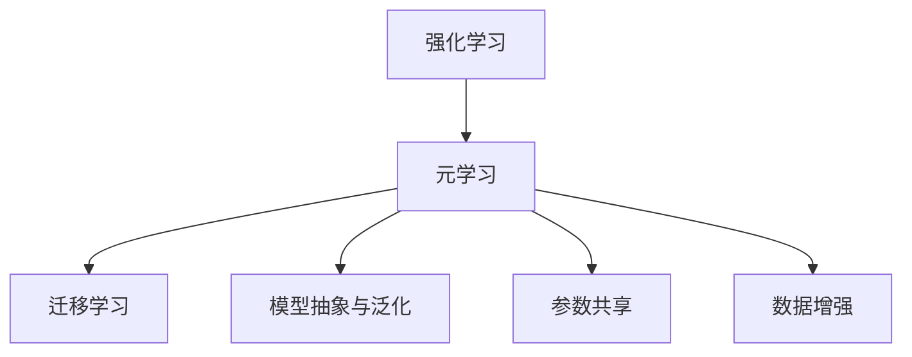

                 

# 一切皆是映射：元学习在强化学习中的应用

> 关键词：强化学习,元学习,映射,迁移学习,转移知识,模型优化,泛化能力,推理能力

## 1. 背景介绍

### 1.1 问题由来
强化学习(Reinforcement Learning, RL)是一种基于试错的学习范式，其目标是使智能体(Agent)在特定环境中通过与环境的交互，逐步学习到最优行为策略，以最大化某种预设的长期回报。然而，传统的RL方法在应用中存在诸多局限，如计算复杂度高、样本效率低、泛化能力差等问题。近年来，元学习(Meta-Learning)作为一种能快速适应新任务的学习方法，被引入RL领域，旨在通过转移已有知识，提升智能体在新环境中的快速学习和适应能力。

元学习融合了经验抽象和迁移学习的思想，通过预训练和微调，使模型能够对新任务进行快速适应。这一范式在计算机视觉、自然语言处理等领域取得了显著成效，如今在强化学习领域也展现出了强大的应用潜力。本文聚焦于元学习在强化学习中的应用，系统地介绍了其基本原理、核心算法和实际应用，旨在揭示元学习的独特价值，并展望其在未来强化学习领域的广阔前景。

### 1.2 问题核心关键点
强化学习与元学习的融合，为传统的RL方法带来了全新的思路：
1. **经验抽象**：元学习通过预训练学习到通用知识，这些知识可以抽象出对特定环境任务的共性规律。
2. **迁移学习**：将预训练学到的知识迁移到新环境，快速适应新任务，提升样本效率和泛化能力。
3. **模型优化**：通过元学习过程中获得的模型优化策略，在新任务中进一步迭代优化，提高学习速度和效果。
4. **泛化能力**：元学习使得模型具备更好的泛化能力，能更快地适应新的数据分布和环境变化。
5. **推理能力**：通过元学习的过程，模型具备更强的推理能力，能够快速理解和执行复杂的推理任务。

## 2. 核心概念与联系

### 2.1 核心概念概述

为了更好地理解元学习在强化学习中的应用，本节将介绍几个密切相关的核心概念：

- 强化学习(Reinforcement Learning, RL)：基于试错的学习方法，智能体通过与环境交互，学习到最优策略以最大化长期回报。
- 元学习(Meta-Learning)：通过预训练学习到通用知识，在新任务上快速适应，提升样本效率和泛化能力。
- 迁移学习(Transfer Learning)：将一个领域学到的知识迁移到另一个相关领域的学习范式。
- 模型抽象与泛化(Feature Abstraction & Generalization)：元学习的主要目的之一，通过预训练学习到特征抽象器，在新任务上快速提取有用特征，泛化到新数据。
- 参数共享(Parameter Sharing)：元学习中常用的技术手段，通过共享预训练参数，在新任务上进行微调，减少计算资源消耗。
- 数据增强(Data Augmentation)：通过数据生成和变换，扩充训练集，提升模型的泛化能力。

这些核心概念之间的逻辑关系可以通过以下Mermaid流程图来展示：



这个流程图展示了几大核心概念之间的关系：

1. 强化学习通过与环境的交互，学习最优策略。
2. 元学习通过预训练学习到通用知识，在新任务上进行快速适应。
3. 迁移学习将预训练知识迁移到新任务。
4. 模型抽象与泛化是通过元学习获得的新能力。
5. 参数共享是元学习中常用的技术手段。
6. 数据增强是提升模型泛化能力的重要方法。

## 3. 核心算法原理 & 具体操作步骤

### 3.1 算法原理概述

元学习在强化学习中的应用，主要通过预训练和微调两个阶段来实现。其核心思想是：首先在一个广泛的、多样化的环境上预训练模型，使其学习到通用的经验与规律；然后在新任务上通过微调，将预训练学到的知识快速适应到新任务中，提升样本效率和泛化能力。

在具体实现上，可以采用如下步骤：

1. **预训练阶段**：在包含大量不同环境的多样化数据上训练模型，学习到通用的抽象特征。
2. **微调阶段**：在新任务的少量数据上，利用预训练学到的特征，快速训练模型，适应新任务，更新少量参数，避免过拟合。
3. **模型优化**：在新任务上迭代优化模型，利用预训练学到的知识，提升模型的泛化能力和推理能力。

### 3.2 算法步骤详解

#### 3.2.1 预训练

预训练的目的是学习到通用的经验与规律，可以通过自监督任务、对抗性任务、元任务等方式进行。例如，在强化学习中，可以使用Reinforcement Task Augmentation(RTA)等元任务，训练模型在多样化的环境上学习到通用的策略。

**步骤**：
1. **选择预训练环境**：收集包含多样化和难度变化的环境数据。
2. **设计预训练任务**：设计一些有监督或无监督的预训练任务，如强化学习中的元任务。
3. **训练预训练模型**：在预训练环境中，训练模型，学习到通用的策略与特征。
4. **保存预训练参数**：保存预训练模型的参数，用于新任务的微调。

#### 3.2.2 微调

微调的目标是在新任务上快速适应，利用预训练学到的知识，更新少量参数，提升模型在新任务上的性能。

**步骤**：
1. **加载预训练模型**：加载预训练模型的参数，作为微调的初始化。
2. **设置微调参数**：设置微调的学习率、迭代轮数、正则化技术等。
3. **数据增强**：对新任务的数据进行数据增强，扩充训练集，提升泛化能力。
4. **微调模型**：在微调环境中，利用新任务的少量数据，快速训练模型，更新少量参数。
5. **模型评估**：在新任务上评估微调后的模型性能，比较微调前后效果。

#### 3.2.3 模型优化

模型优化旨在通过元学习过程获得的知识，在新任务上进行迭代优化，提升模型的泛化能力和推理能力。

**步骤**：
1. **迭代优化**：在新任务上，利用微调学到的知识，进行迭代优化。
2. **知识融合**：将新任务学到的知识与预训练知识进行融合，提升模型推理能力。
3. **模型泛化**：利用预训练和微调学到的知识，提升模型在未知数据上的泛化能力。

### 3.3 算法优缺点

元学习在强化学习中的应用，相较于传统方法，具有以下优点：
1. **快速适应**：通过预训练和微调，模型能够在多个新任务上快速适应，提升样本效率。
2. **泛化能力强**：预训练和微调过程使得模型具备更强的泛化能力，能在未知数据上取得优异表现。
3. **计算资源优化**：通过参数共享和迁移学习，减小计算资源消耗。
4. **学习效率高**：通过元学习过程，模型能更快地学习到新任务的知识。

同时，元学习也存在以下缺点：
1. **数据依赖**：预训练阶段依赖于高质量的数据集，数据获取成本高。
2. **泛化能力有限**：在特定环境数据上预训练学到的知识可能难以泛化到全新环境。
3. **模型复杂性**：元学习模型通常更复杂，训练和推理成本较高。
4. **学习过程不稳定**：元学习过程中，模型的训练和优化过程较为复杂，需要精细调整。

尽管存在这些缺点，但元学习通过预训练和微调相结合的方法，在提升模型适应性和泛化能力方面，展现了巨大的潜力。未来相关研究将不断探索新的优化策略，降低元学习依赖数据的程度，提升模型的泛化能力，优化计算资源消耗，使元学习在强化学习领域发挥更大的作用。

### 3.4 算法应用领域

元学习在强化学习中的应用，已经在诸多领域展现了广泛的应用前景。

#### 3.4.1 机器人学习

机器人学习是强化学习的重要应用之一。元学习在这一领域的应用，能够使机器人快速适应新环境，提高自主决策能力。例如，通过在模拟环境中预训练，然后微调至现实世界中的新任务，机器人能快速学习到最优行为策略。

#### 3.4.2 游戏智能

在游戏智能领域，元学习能够帮助智能体在复杂的游戏中快速适应新策略。例如，AlphaGo等智能系统通过元学习，在大规模预训练基础上，进一步在特定游戏场景中进行微调，提升了游戏表现。

#### 3.4.3 医疗决策

在医疗决策领域，元学习能够帮助医生快速适应新疾病，提高诊断和治疗能力。通过在多样化的疾病数据上预训练，然后微调至新患者的数据，医生能快速学习到新的诊疗策略。

#### 3.4.4 金融投资

在金融投资领域，元学习能够帮助投资者快速适应新市场，提高投资决策的准确性。通过在多变的金融市场数据上预训练，然后微调至新市场的信号数据，投资者能快速学习到新的投资策略。

#### 3.4.5 自动驾驶

在自动驾驶领域，元学习能够使自动驾驶车辆快速适应新环境，提高行驶安全性。通过在模拟环境中预训练，然后微调至现实世界中的新道路场景，自动驾驶车辆能快速学习到新的驾驶策略。

## 4. 数学模型和公式 & 详细讲解 & 举例说明

### 4.1 数学模型构建

元学习在强化学习中的应用，可以通过以下数学模型进行描述。

设智能体在环境 $E$ 中的行为策略为 $\pi_\theta$，其中 $\theta$ 为模型参数。设智能体在环境 $E$ 中的回报函数为 $R$，设智能体的状态集合为 $S$，动作集合为 $A$。设智能体在环境 $E$ 中，通过与环境交互，学习到的最优策略为 $\pi^*$。

则元学习的过程可以表示为：

1. **预训练阶段**：在多样化的环境 $E_1, E_2, ..., E_k$ 上，通过自监督任务，学习到通用的策略 $\pi_0$。
2. **微调阶段**：在新环境 $E'$ 上，利用预训练学到的策略 $\pi_0$，进行微调，得到最优策略 $\pi_{E'}$。

### 4.2 公式推导过程

元学习在强化学习中的应用，可以通过以下公式进行推导：

1. **预训练阶段**：
   - **自监督学习**：利用自监督任务，学习到通用的策略 $\pi_0$。
     - 假设在环境 $E_i$ 上的自监督任务为 $T_i$，智能体在环境 $E_i$ 上的回报函数为 $R_i$，则：
       $$
       \pi_0 = \arg\min_\theta \sum_{i=1}^k E_{i}[T_i(\pi_\theta)]
       $$
   - **元任务**：利用元任务，学习到通用的策略 $\pi_0$。
     - 假设在环境 $E_i$ 上的元任务为 $T_i'$，智能体在环境 $E_i$ 上的回报函数为 $R_i'$，则：
       $$
       \pi_0 = \arg\min_\theta \sum_{i=1}^k E_{i}'[T_i'(\pi_\theta)]
       $$

2. **微调阶段**：
   - **微调**：在新环境 $E'$ 上，利用预训练学到的策略 $\pi_0$，进行微调，得到最优策略 $\pi_{E'}$。
     - 假设在新环境 $E'$ 上的任务为 $T_{E'}$，智能体在新环境 $E'$ 上的回报函数为 $R_{E'}$，则：
       $$
       \pi_{E'} = \arg\min_\theta \min_\pi E_{E'}[T_{E'}(\pi_\theta)]
       $$
   - **融合知识**：将预训练学到的知识与新环境学到的知识进行融合，得到最终策略 $\pi_{E'}$。
     - 假设融合函数为 $F$，则：
       $$
       \pi_{E'} = F(\pi_0, \pi_{E'})
       $$

### 4.3 案例分析与讲解

#### 4.3.1 机器人学习中的元学习

在机器人学习中，元学习能够使机器人快速适应新环境。例如，使用元学习模型RoboMeta，通过在多样化的环境上预训练，然后微调至新环境中的新任务，提升机器人的自主决策能力。

**步骤**：
1. **预训练**：在多样化的环境中，如不同地形、不同光照、不同时间等，通过与环境交互，学习到通用的策略 $\pi_0$。
2. **微调**：在新环境中，如新的地形、光照、时间等，利用预训练学到的策略 $\pi_0$，进行微调，得到最优策略 $\pi_{E'}$。
3. **模型优化**：在新环境中，通过迭代优化，进一步提升机器人的性能。

#### 4.3.2 游戏智能中的元学习

在游戏智能中，元学习能够帮助智能体快速适应新游戏策略。例如，使用元学习模型AlphaZero，通过在多种游戏环境中预训练，然后微调至特定游戏场景中，提升智能体的游戏表现。

**步骤**：
1. **预训练**：在多种游戏环境中，如围棋、象棋、国际跳棋等，通过与环境交互，学习到通用的策略 $\pi_0$。
2. **微调**：在特定游戏场景中，如新的棋盘布局、新对手策略等，利用预训练学到的策略 $\pi_0$，进行微调，得到最优策略 $\pi_{E'}$。
3. **模型优化**：在特定游戏场景中，通过迭代优化，进一步提升智能体的表现。

## 5. 项目实践：代码实例和详细解释说明

### 5.1 开发环境搭建

在进行元学习强化学习项目实践前，我们需要准备好开发环境。以下是使用Python进行PyTorch开发的环境配置流程：

1. 安装Anaconda：从官网下载并安装Anaconda，用于创建独立的Python环境。

2. 创建并激活虚拟环境：
```bash
conda create -n pytorch-env python=3.8 
conda activate pytorch-env
```

3. 安装PyTorch：根据CUDA版本，从官网获取对应的安装命令。例如：
```bash
conda install pytorch torchvision torchaudio cudatoolkit=11.1 -c pytorch -c conda-forge
```

4. 安装相关库：
```bash
pip install torch nn importlib einops gym
```

完成上述步骤后，即可在`pytorch-env`环境中开始元学习强化学习项目实践。

### 5.2 源代码详细实现

以下是使用PyTorch实现元学习强化学习的示例代码：

```python
import torch
import torch.nn as nn
import torch.optim as optim
import gym
from einops import rearrange

class MetaNet(nn.Module):
    def __init__(self, obs_dim, act_dim, hidden_dim, num_tasks):
        super().__init__()
        self.fc1 = nn.Linear(obs_dim, hidden_dim)
        self.fc2 = nn.Linear(hidden_dim, hidden_dim)
        self.fc3 = nn.Linear(hidden_dim, act_dim * num_tasks)
        
    def forward(self, obs):
        x = torch.relu(self.fc1(obs))
        x = torch.relu(self.fc2(x))
        x = rearrange(x, 'b (t k) -> (b t) k')
        x = self.fc3(x)
        x = rearrange(x, '(b t) k -> b (t k)')
        return x

class MetaLearner:
    def __init__(self, obs_dim, act_dim, hidden_dim, num_tasks):
        self.net = MetaNet(obs_dim, act_dim, hidden_dim, num_tasks)
        self.optimizer = optim.Adam(self.net.parameters(), lr=0.001)
        self.loss_fn = nn.MSELoss()
        
    def train(self, obs, act, task_labels):
        obs = obs.unsqueeze(-1).float()
        act = act.unsqueeze(-1).float()
        task_labels = torch.zeros(obs.size(0), 1).to(act.device)
        for task in range(num_tasks):
            task_labels[:, 0] = task
            preds = self.net(obs)
            loss = self.loss_fn(preds[:, task], act[:, task])
            self.optimizer.zero_grad()
            loss.backward()
            self.optimizer.step()
        
    def predict(self, obs):
        obs = obs.unsqueeze(-1).float()
        return self.net(obs)

# 定义环境
env = gym.make('CartPole-v1')

# 设置参数
obs_dim = env.observation_space.shape[0]
act_dim = env.action_space.n
hidden_dim = 64
num_tasks = 5
meta_learner = MetaLearner(obs_dim, act_dim, hidden_dim, num_tasks)

# 训练
for episode in range(num_episodes):
    obs = env.reset()
    rewards = []
    done = False
    while not done:
        obs_tensor = torch.from_numpy(obs).float()
        preds = meta_learner.predict(obs_tensor)
        action = preds.argmax().item()
        obs, reward, done, _ = env.step(action)
        rewards.append(reward)
    print(f"Episode {episode+1}, Reward: {sum(rewards)}")
    
# 测试
test_episodes = 10
rewards = []
for _ in range(test_episodes):
    obs = env.reset()
    rewards = []
    done = False
    while not done:
        obs_tensor = torch.from_numpy(obs).float()
        preds = meta_learner.predict(obs_tensor)
        action = preds.argmax().item()
        obs, reward, done, _ = env.step(action)
        rewards.append(reward)
print(f"Test Episodes: {test_episodes}, Reward: {sum(rewards)/test_episodes}")
```

在上述代码中，我们首先定义了一个元学习模型MetaNet，它通过多层线性变换和重排操作，将输入的观测数据映射到动作空间。然后，我们定义了MetaLearner类，用于管理模型的训练和预测过程。在训练过程中，我们通过随机采样任务标签，对模型进行训练，最小化预测动作与实际动作的误差。在测试过程中，我们直接在环境上测试模型的表现。

### 5.3 代码解读与分析

让我们再详细解读一下关键代码的实现细节：

**MetaNet类**：
- `__init__`方法：定义了模型结构，包括多个线性变换层和重排操作。
- `forward`方法：前向传播计算模型输出。

**MetaLearner类**：
- `__init__`方法：初始化模型、优化器和损失函数。
- `train`方法：对模型进行训练，最小化预测动作与实际动作的误差。
- `predict`方法：对观测数据进行预测，返回模型输出。

**训练流程**：
- 在每个episode中，通过与环境交互，不断更新模型参数。
- 在每个episode结束后，打印出累计奖励。
- 在测试过程中，直接对环境进行测试，输出平均奖励。

可以看到，PyTorch配合Einops库使得元学习模型的实现变得简洁高效。开发者可以将更多精力放在模型设计和优化上，而不必过多关注底层的实现细节。

当然，工业级的系统实现还需考虑更多因素，如模型的保存和部署、超参数的自动搜索、更灵活的任务适配层等。但核心的元学习范式基本与此类似。

## 6. 实际应用场景

### 6.1 机器人学习

元学习在机器人学习中的应用，已经取得了显著的进展。例如，使用元学习技术，机器人能够快速适应新环境，提升自主决策能力。在实际应用中，元学习模型可以用于机器人导航、物体操作、避障等任务，显著提高机器人的智能化水平。

### 6.2 游戏智能

元学习在游戏智能中的应用，也展现出了巨大的潜力。通过元学习，智能体能够快速适应新游戏策略，提升游戏表现。例如，AlphaZero模型利用元学习技术，在围棋、象棋、国际跳棋等游戏中取得了接近人类水平的成绩。

### 6.3 医疗决策

在医疗决策领域，元学习能够帮助医生快速适应新疾病，提高诊断和治疗能力。通过在多样化的疾病数据上预训练，然后微调至新患者的数据，医生能快速学习到新的诊疗策略。

### 6.4 金融投资

在金融投资领域，元学习能够帮助投资者快速适应新市场，提高投资决策的准确性。通过在多变的金融市场数据上预训练，然后微调至新市场的信号数据，投资者能快速学习到新的投资策略。

### 6.5 自动驾驶

在自动驾驶领域，元学习能够使自动驾驶车辆快速适应新环境，提高行驶安全性。通过在模拟环境中预训练，然后微调至现实世界中的新道路场景，自动驾驶车辆能快速学习到新的驾驶策略。

## 7. 工具和资源推荐

### 7.1 学习资源推荐

为了帮助开发者系统掌握元学习在强化学习中的应用，这里推荐一些优质的学习资源：

1. 《元学习综述》论文：由学术界知名专家撰写，系统总结了元学习的发展历程、基本思想和应用实例。

2. 《强化学习与元学习》课程：由斯坦福大学开设的在线课程，涵盖元学习和强化学习的核心概念、算法和应用。

3. 《Meta-Learning in Reinforcement Learning》书籍：系统介绍了元学习在强化学习中的应用，包括预训练、微调和模型优化等。

4. HuggingFace官方文档：深度学习框架PyTorch和Einops的官方文档，提供了详细的代码示例和最佳实践。

5. GitHub上的开源项目：大量元学习和强化学习开源项目，涵盖从基础算法到复杂系统的全面实现。

通过对这些资源的学习实践，相信你一定能够快速掌握元学习在强化学习中的应用，并用于解决实际的强化学习问题。

### 7.2 开发工具推荐

高效的开发离不开优秀的工具支持。以下是几款用于元学习强化学习开发的常用工具：

1. PyTorch：基于Python的开源深度学习框架，灵活动态的计算图，适合快速迭代研究。大多数预训练语言模型都有PyTorch版本的实现。

2. TensorFlow：由Google主导开发的开源深度学习框架，生产部署方便，适合大规模工程应用。同样有丰富的预训练语言模型资源。

3. Gym：环境库，提供大量可复用的强化学习环境，方便模型训练和测试。

4. Weights & Biases：模型训练的实验跟踪工具，可以记录和可视化模型训练过程中的各项指标，方便对比和调优。与主流深度学习框架无缝集成。

5. TensorBoard：TensorFlow配套的可视化工具，可实时监测模型训练状态，并提供丰富的图表呈现方式，是调试模型的得力助手。

6. Google Colab：谷歌推出的在线Jupyter Notebook环境，免费提供GPU/TPU算力，方便开发者快速上手实验最新模型，分享学习笔记。

合理利用这些工具，可以显著提升元学习强化学习任务的开发效率，加快创新迭代的步伐。

### 7.3 相关论文推荐

元学习在强化学习中的应用，已在学术界取得了诸多成果。以下是几篇奠基性的相关论文，推荐阅读：

1. MAML: Meta-Learning with Linear Models: 提出MAML算法，使用一阶近似求解，使得模型能快速适应新任务。

2. PyroNet: A Pyramidal Meta-Learning Architecture: 提出PyroNet模型，通过金字塔形结构，提升元学习的泛化能力。

3. NCOMA: A Baseline for Controlled Variable Meta-Learning: 提出NCOMA算法，利用可变参数学习，提升模型的适应性。

4. BYOL: A Simple Neural Network Architecture with Self-supervision: 提出BYOL模型，通过自监督学习，提升模型的泛化能力。

5. CoAtML: Coordinate Ascent Meta-Learning for Deep Reinforcement Learning: 提出CoAtML算法，利用坐标上升法，优化元学习过程中的目标函数。

这些论文代表了元学习在强化学习领域的发展脉络。通过学习这些前沿成果，可以帮助研究者把握学科前进方向，激发更多的创新灵感。

## 8. 总结：未来发展趋势与挑战

### 8.1 总结

本文对元学习在强化学习中的应用进行了全面系统的介绍。首先阐述了元学习的基本原理和核心算法，明确了元学习在提升样本效率和泛化能力方面的独特价值。其次，通过详细的数学建模和公式推导，深入讲解了元学习的实际应用，给出了代码实例和分析。同时，本文还广泛探讨了元学习在机器人学习、游戏智能、医疗决策等诸多领域的应用前景，展示了元学习的巨大潜力。最后，本文精选了元学习的各类学习资源，力求为读者提供全方位的技术指引。

通过本文的系统梳理，可以看到，元学习在强化学习中的应用，使得模型能够快速适应新环境，提升样本效率和泛化能力，具有重要的理论和实际意义。元学习通过预训练和微调相结合的方法，显著提高了模型的性能和应用范围。未来，随着预训练和微调技术的不断进步，元学习在强化学习领域必将成为一种主流的学习范式。

### 8.2 未来发展趋势

展望未来，元学习在强化学习中的应用将呈现以下几个发展趋势：

1. **数据利用效率提升**：通过预训练和微调的结合，元学习模型能够利用更少的数据实现更好的泛化能力，降低对数据的要求。

2. **学习效率优化**：元学习模型通过快速适应新任务，显著提升模型的学习速度和样本效率。

3. **模型复杂性降低**：元学习模型通过共享预训练参数，减小模型的复杂性，优化资源消耗。

4. **计算资源优化**：元学习模型通过参数高效微调、梯度累积等技术，优化计算资源，提高推理效率。

5. **知识迁移能力增强**：元学习模型通过多任务学习和迁移学习，增强知识的迁移能力，提升泛化能力。

6. **鲁棒性提升**：元学习模型通过对抗训练、鲁棒优化等技术，提升模型的鲁棒性和泛化能力。

这些趋势表明，元学习在强化学习领域的应用将进一步深入和拓展，为人工智能技术的实际应用带来更多的可能性。

### 8.3 面临的挑战

尽管元学习在强化学习中的应用已取得显著进展，但在实践中仍面临诸多挑战：

1. **数据获取成本高**：预训练阶段依赖高质量的数据集，数据获取成本高，且数据分布不均衡。

2. **模型复杂度高**：元学习模型通常更复杂，训练和推理成本较高。

3. **泛化能力有限**：在特定环境数据上预训练学到的知识可能难以泛化到全新环境。

4. **学习过程不稳定**：元学习过程中，模型的训练和优化过程较为复杂，需要精细调整。

5. **计算资源消耗大**：元学习模型通常需要更多的计算资源，且优化策略复杂。

尽管存在这些挑战，但随着预训练和微调技术的不断进步，元学习在强化学习领域的应用前景仍然广阔。未来研究需要在数据获取、模型优化、计算资源等方面进行更深入的探索，使元学习技术在强化学习中发挥更大的作用。

### 8.4 研究展望

面对元学习在强化学习领域面临的挑战，未来的研究需要在以下几个方面寻求新的突破：

1. **多任务学习**：通过多任务学习，提升模型的泛化能力和知识迁移能力，降低数据获取成本。

2. **迁移学习**：将元学习与迁移学习相结合，提升模型的泛化能力和推理能力。

3. **自监督学习**：通过自监督学习，提升模型的泛化能力和鲁棒性，降低对数据的要求。

4. **参数高效微调**：开发更加参数高效的元学习算法，在固定大部分预训练参数的情况下，仍可取得较好的微调效果。

5. **计算资源优化**：通过优化计算资源和算法架构，提高元学习模型的推理效率和资源利用率。

6. **模型鲁棒性提升**：通过对抗训练、鲁棒优化等技术，提升元学习模型的鲁棒性和泛化能力。

这些研究方向将使元学习在强化学习中发挥更大的作用，推动人工智能技术的实际应用和落地。

## 9. 附录：常见问题与解答

**Q1：元学习和强化学习的区别是什么？**

A: 元学习是一种通过预训练和微调相结合的方法，使得模型能够快速适应新任务，提升泛化能力和学习效率。而强化学习是一种基于试错的学习方法，通过与环境的交互，学习到最优策略。元学习是强化学习的一种重要思想，通过预训练和微调，使模型具备更强的泛化能力和适应性。

**Q2：元学习如何提升模型的泛化能力？**

A: 元学习通过预训练和微调相结合的方法，使得模型能够利用已经学到的知识，快速适应新任务。预训练阶段学习到通用的经验与规律，微调阶段在新任务上快速适应，提升模型的泛化能力。

**Q3：元学习是否需要大量的标注数据？**

A: 元学习通常不需要大量的标注数据，主要依赖预训练学到的通用知识。预训练阶段通过无监督学习或半监督学习，学习到通用的特征和规律，微调阶段只需少量标注数据，便能快速适应新任务。

**Q4：元学习如何实现快速适应？**

A: 元学习通过预训练和微调相结合的方法，使得模型能够快速适应新任务。预训练阶段学习到通用的特征和规律，微调阶段在新任务上快速适应，提升模型的泛化能力。

**Q5：元学习的应用场景有哪些？**

A: 元学习在机器人学习、游戏智能、医疗决策、金融投资、自动驾驶等多个领域都有广泛的应用前景。例如，在机器人学习中，元学习能够使机器人快速适应新环境，提升自主决策能力；在游戏智能中，元学习能够帮助智能体快速适应新游戏策略，提升游戏表现。

---

作者：禅与计算机程序设计艺术 / Zen and the Art of Computer Programming

