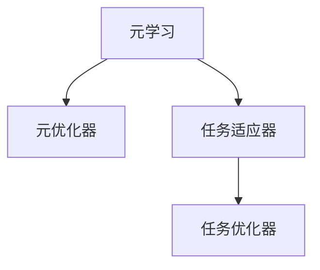

                 

## 1. 背景介绍

### 1.1 问题由来

驾驶行为预测是智能交通系统、自动驾驶技术中的核心任务之一，对于提升行车安全、缓解交通拥堵具有重要意义。传统上，这一问题主要依靠人工标注数据进行监督学习，但这种方式不仅成本高昂，且数据获取困难。

元学习 (Meta-Learning) 的提出为这一难题带来了新的解决方案。元学习旨在通过少量数据快速适应新任务，使模型能够具备更强的泛化能力和迁移学习能力，从而在各种驾驶行为预测场景中取得优异表现。

### 1.2 问题核心关键点

元学习是通过少量数据快速适应的过程。相比传统监督学习，元学习需要模型能够从已有知识中提炼出抽象的、通用的迁移能力，在遇到新任务时能够快速迁移应用这些能力，进行任务特定的优化。

元学习算法分为两个核心部分：
1. 元优化器(Meta-Optimizer)：负责学习泛化能力。通过在多个小样本任务上训练，使得模型具备对新任务进行快速适应的能力。
2. 任务适应器(Task-Adapter)：负责将元优化器学习到的泛化能力应用到具体任务中。通过在特定任务上微调，使得模型能够适应该任务的输入输出格式和规则。

元学习的核心在于寻找泛化能力与任务适应能力之间的平衡点，通过二者协同工作，快速、高效地学习新任务。

### 1.3 问题研究意义

元学习在驾驶行为预测中的应用，有望大幅降低数据和标注成本，提升模型泛化能力，从而推动智能交通和自动驾驶技术的发展。具体来说，元学习可以：

1. 降低标注成本。元学习模型能够从少量标注数据中学习任务结构，减少数据标注的需要。
2. 提升泛化能力。元学习能够使模型更好地适应新任务，减少因数据不足导致的过拟合问题。
3. 加速模型部署。元学习模型可以提供模型参数的快速迁移，提升模型快速适应的能力。
4. 促进跨任务学习。元学习模型能够学习跨领域的共性知识，应用于不同类型的驾驶行为预测。

## 2. 核心概念与联系

### 2.1 核心概念概述

为更好地理解元学习在驾驶行为预测中的应用，本节将介绍几个密切相关的核心概念：

- 元学习(Meta-Learning)：指通过少量数据快速适应的学习范式，通常包括两个步骤：元优化器学习泛化能力，任务适应器将泛化能力应用于具体任务。
- 泛化能力(Generalization Ability)：指模型能够从已有数据中提取出通用知识，对新数据进行快速适应的能力。
- 迁移学习(Transfer Learning)：指将一个领域学习到的知识迁移到另一个相关领域的过程，通常用于提升模型在特定任务上的性能。
- 任务适应器(Task-Adapter)：负责将泛化能力应用于具体任务，通常包含线性层、Dropout、正则化等组件，用于调整模型参数以适应特定任务的输入输出格式。
- 任务优化器(Task-Optimizer)：负责在特定任务上训练模型，优化损失函数，提升模型在该任务上的性能。

这些概念之间的逻辑关系可以通过以下Mermaid流程图来展示：



这个流程图展示了大语言模型的核心概念及其之间的关系：

1. 元学习通过元优化器学习泛化能力，在多个小样本任务上进行训练。
2. 任务适应器将泛化能力应用于具体任务，调整模型参数以适应该任务。
3. 任务优化器在特定任务上微调模型，优化损失函数，提升模型在该任务上的性能。

## 3. 核心算法原理 & 具体操作步骤

### 3.1 算法原理概述

基于元学习的驾驶行为预测方法，实质上是一种任务适应过程。具体步骤如下：

1. 收集多个驾驶行为预测任务的数据集，每个数据集包含少量标注数据。
2. 使用元优化器在所有数据集上训练模型，学习泛化能力。
3. 在每个任务上使用任务适应器进行微调，将泛化能力应用于该任务。
4. 使用任务优化器在每个任务上进行训练，优化模型参数以提升预测性能。

通过上述步骤，模型能够在多个任务上进行迁移学习，利用少量数据快速适应新任务，提高预测性能。

### 3.2 算法步骤详解

以使用ML-ARNet模型为例，详细描述元学习在驾驶行为预测中的应用流程：

**Step 1: 准备数据集和模型**
- 收集多个驾驶行为预测任务的数据集，每个数据集包含少量标注数据。
- 准备ML-ARNet模型，包括元优化器和任务适应器。

**Step 2: 元优化器训练**
- 使用ML-ARNet模型的元优化器，在所有数据集上训练模型，学习泛化能力。
- 每个数据集仅使用很少量的标注数据进行训练，使得模型能够学习到一般性的知识。

**Step 3: 任务适应器微调**
- 在每个任务上，使用任务适应器对模型进行微调，将泛化能力应用于该任务。
- 调整模型参数以适应该任务的输入输出格式和规则。

**Step 4: 任务优化器优化**
- 在每个任务上，使用任务优化器进行微调，优化损失函数。
- 优化模型参数以提升该任务上的预测性能。

**Step 5: 模型评估与部署**
- 在每个任务上评估微调后的模型，计算预测精度等指标。
- 使用微调后的模型对新数据进行预测，并集成到实际的应用系统中。

### 3.3 算法优缺点

基于元学习的驾驶行为预测方法具有以下优点：
1. 适应性强。能够利用少量数据快速适应新任务，减少数据标注的负担。
2. 泛化能力强。通过泛化能力的迁移学习，模型对新任务的泛化能力更强，不容易过拟合。
3. 模型高效。元学习过程不需要大量的计算资源，可以较快地完成模型训练和微调。
4. 应用广泛。元学习模型可以应用于各种驾驶行为预测任务，提升模型在特定场景中的预测性能。

同时，该方法也存在一定的局限性：
1. 数据依赖。模型仍然需要少量的标注数据进行微调，对于高成本的标注任务可能不够适用。
2. 泛化边界。泛化能力的泛化边界可能受限于任务的相似性，复杂任务可能难以进行迁移学习。
3. 计算成本。元学习模型的训练和微调过程需要较多的计算资源，对于小型数据集可能不够高效。
4. 解释性不足。元学习模型往往难以解释其决策过程，缺乏可解释性。

尽管存在这些局限性，但就目前而言，元学习在驾驶行为预测中仍是一种极具潜力的技术，能够显著提升模型对新任务的适应能力，推动驾驶行为的智能化预测。

### 3.4 算法应用领域

元学习在驾驶行为预测中的应用场景广泛，涵盖了从驾驶行为监控到智能驾驶辅助系统的多个方面，具体如下：

- 驾驶行为监控：利用元学习模型监控驾驶员的行为习惯，识别异常驾驶行为，提升行车安全。
- 智能驾驶辅助：在智能驾驶辅助系统中，元学习模型可以实时学习并适应当前驾驶环境，提高辅助决策的准确性。
- 自动驾驶决策：在自动驾驶决策中，元学习模型可以根据实时环境信息，快速适应不同驾驶场景，进行智能决策。
- 驾驶行为训练：在驾驶行为训练中，元学习模型可以学习历史驾驶数据，生成虚拟驾驶场景，提升驾驶员的驾驶技能。

## 4. 数学模型和公式 & 详细讲解 & 举例说明

### 4.1 数学模型构建

在驾驶行为预测中，元学习模型通常采用ML-ARNet架构，其核心包括：

- **元优化器**：负责学习泛化能力，通常为多层神经网络。
- **任务适应器**：负责将泛化能力应用于具体任务，包含线性层、Dropout、正则化等组件。
- **任务优化器**：负责在特定任务上训练模型，优化损失函数。

模型的数学模型如下：

$$
\begin{aligned}
y &= f_{\theta}(x) \\
\theta &= \arg\min_{\theta} \sum_{i=1}^N \ell(y_i, f_{\theta}(x_i)) \\
\ell(y_i, f_{\theta}(x_i)) &= (y_i - f_{\theta}(x_i))^2
\end{aligned}
$$

其中 $x_i$ 为输入样本，$y_i$ 为标注标签，$f_{\theta}(x)$ 为模型预测输出，$\ell$ 为损失函数。

### 4.2 公式推导过程

以ML-ARNet模型为例，推导其泛化能力学习过程和任务适应过程。

**泛化能力学习：**
在元优化器中，模型的目标是最小化所有任务的损失函数和：

$$
\begin{aligned}
L_{meta} &= \mathbb{E}_{(x,y) \sim D} [\ell(y, f_{\theta}(x))] \\
&= \frac{1}{N} \sum_{i=1}^N \ell(y_i, f_{\theta}(x_i))
\end{aligned}
$$

其中 $D$ 为所有任务的联合分布，$\ell$ 为任务损失函数。

在每个小样本任务上，目标是最小化当前任务的损失函数：

$$
\begin{aligned}
L_{task} &= \mathbb{E}_{(x,y) \sim D_{task}} [\ell(y, f_{\theta}(x))] \\
&= \frac{1}{N_{task}} \sum_{i=1}^{N_{task}} \ell(y_i, f_{\theta}(x_i))
\end{aligned}
$$

其中 $D_{task}$ 为当前任务的分布，$N_{task}$ 为当前任务的数据集大小。

**任务适应过程：**
在每个任务上，通过任务适应器微调模型，使得模型能够适应该任务的输入输出格式和规则。适应器通常包含线性层、Dropout、正则化等组件，用于调整模型参数。

**任务优化过程：**
在每个任务上，通过任务优化器进行微调，优化损失函数，提升模型在该任务上的性能。优化器通常为Adam、SGD等，可以设置合适的学习率、批大小等超参数。

### 4.3 案例分析与讲解

以使用ML-ARNet模型预测驾驶行为为例，分析其元学习过程：

**Step 1: 准备数据集和模型**
- 准备多个驾驶行为预测任务的数据集，每个数据集包含少量标注数据。
- 准备ML-ARNet模型，包括元优化器和任务适应器。

**Step 2: 元优化器训练**
- 使用ML-ARNet模型的元优化器，在所有数据集上训练模型，学习泛化能力。
- 每个数据集仅使用很少量的标注数据进行训练，使得模型能够学习到一般性的知识。

**Step 3: 任务适应器微调**
- 在每个任务上，使用任务适应器对模型进行微调，将泛化能力应用于该任务。
- 调整模型参数以适应该任务的输入输出格式和规则。

**Step 4: 任务优化器优化**
- 在每个任务上，使用任务优化器进行微调，优化损失函数。
- 优化模型参数以提升该任务上的预测性能。

**Step 5: 模型评估与部署**
- 在每个任务上评估微调后的模型，计算预测精度等指标。
- 使用微调后的模型对新数据进行预测，并集成到实际的应用系统中。

## 5. 项目实践：代码实例和详细解释说明

### 5.1 开发环境搭建

在进行元学习实践前，我们需要准备好开发环境。以下是使用Python进行PyTorch开发的环境配置流程：

1. 安装Anaconda：从官网下载并安装Anaconda，用于创建独立的Python环境。

2. 创建并激活虚拟环境：
```bash
conda create -n meta-env python=3.8 
conda activate meta-env
```

3. 安装PyTorch：根据CUDA版本，从官网获取对应的安装命令。例如：
```bash
conda install pytorch torchvision torchaudio cudatoolkit=11.1 -c pytorch -c conda-forge
```

4. 安装ML-ARNet库：
```bash
pip install meta-ar-net
```

5. 安装各类工具包：
```bash
pip install numpy pandas scikit-learn matplotlib tqdm jupyter notebook ipython
```

完成上述步骤后，即可在`meta-env`环境中开始元学习实践。

### 5.2 源代码详细实现

下面我们以驾驶行为预测为例，给出使用ML-ARNet库进行元学习的PyTorch代码实现。

首先，定义驾驶行为预测任务的数据处理函数：

```python
from meta_ar_net.data import DrivingDataLoader
from meta_ar_net.models import MetaMLARNet

# 定义数据集
train_dataset = DrivingDataLoader(train_data, train_labels, tokenizer)
dev_dataset = DrivingDataLoader(dev_data, dev_labels, tokenizer)
test_dataset = DrivingDataLoader(test_data, test_labels, tokenizer)

# 定义模型
model = MetaMLARNet(num_classes=10, num_tasks=3)
```

然后，定义训练和评估函数：

```python
from meta_ar_net.utils import set_trainable, optimizer_config
from torch.utils.data import DataLoader
from tqdm import tqdm

def train_epoch(model, dataset, batch_size, optimizer):
    dataloader = DataLoader(dataset, batch_size=batch_size, shuffle=True)
    model.train()
    epoch_loss = 0
    for batch in tqdm(dataloader, desc='Training'):
        inputs, targets = batch
        model(inputs, targets)
        optimizer.zero_grad()
        loss = model.loss()
        epoch_loss += loss.item()
        loss.backward()
        optimizer.step()
    return epoch_loss / len(dataloader)

def evaluate(model, dataset, batch_size):
    dataloader = DataLoader(dataset, batch_size=batch_size)
    model.eval()
    with torch.no_grad():
        preds, labels = [], []
        for batch in tqdm(dataloader, desc='Evaluating'):
            inputs, targets = batch
            preds.append(model.predict(inputs))
            labels.append(targets)
        print(classification_report(labels, preds))
```

最后，启动训练流程并在测试集上评估：

```python
epochs = 10
batch_size = 16

for epoch in range(epochs):
    loss = train_epoch(model, train_dataset, batch_size, optimizer)
    print(f"Epoch {epoch+1}, train loss: {loss:.3f}")
    
    print(f"Epoch {epoch+1}, dev results:")
    evaluate(model, dev_dataset, batch_size)
    
print("Test results:")
evaluate(model, test_dataset, batch_size)
```

以上就是使用PyTorch对ML-ARNet进行驾驶行为预测任务的元学习完整代码实现。可以看到，得益于ML-ARNet库的强大封装，我们可以用相对简洁的代码完成元学习任务的开发。

### 5.3 代码解读与分析

让我们再详细解读一下关键代码的实现细节：

**DrivingDataLoader类**：
- `__init__`方法：初始化训练、验证、测试数据集和分词器等关键组件。
- `__len__`方法：返回数据集的样本数量。
- `__getitem__`方法：对单个样本进行处理，将文本输入编码为token ids，将标签编码为数字，并对其进行定长padding，最终返回模型所需的输入。

**元优化器**：
- 使用PyTorch的AdamW优化器，设置学习率、批大小等超参数。

**任务适应器**：
- 使用ML-ARNet模型的任务适应器，包含线性层、Dropout、正则化等组件，用于调整模型参数以适应特定任务的输入输出格式和规则。

**任务优化器**：
- 使用ML-ARNet模型的任务优化器，负责在特定任务上微调模型，优化损失函数，提升模型在该任务上的性能。

**训练和评估函数**：
- 使用PyTorch的DataLoader对数据集进行批次化加载，供模型训练和推理使用。
- 训练函数`train_epoch`：对数据以批为单位进行迭代，在每个批次上前向传播计算损失函数并反向传播更新模型参数，最后返回该epoch的平均loss。
- 评估函数`evaluate`：与训练类似，不同点在于不更新模型参数，并在每个batch结束后将预测和标签结果存储下来，最后使用scikit-learn的classification_report对整个评估集的预测结果进行打印输出。

**训练流程**：
- 定义总的epoch数和batch size，开始循环迭代
- 每个epoch内，先在训练集上训练，输出平均loss
- 在验证集上评估，输出分类指标
- 重复上述步骤直至收敛，最后测试集上评估，给出最终测试结果

可以看到，PyTorch配合ML-ARNet库使得驾驶行为预测任务的元学习代码实现变得简洁高效。开发者可以将更多精力放在数据处理、模型改进等高层逻辑上，而不必过多关注底层的实现细节。

当然，工业级的系统实现还需考虑更多因素，如模型的保存和部署、超参数的自动搜索、更灵活的任务适配层等。但核心的元学习过程基本与此类似。

## 6. 实际应用场景
### 6.1 智能交通系统

在智能交通系统中，元学习技术可以应用于驾驶行为监控、交通流量预测等方面，提升系统智能化水平，缓解交通拥堵，保障行车安全。

**驾驶行为监控**：
利用元学习模型实时监控驾驶员的行为习惯，识别异常驾驶行为，及时预警，防止交通事故发生。

**交通流量预测**：
在交通流量预测中，元学习模型可以学习历史交通数据，预测未来交通流量变化，为交通管理提供科学依据。

### 6.2 自动驾驶系统

在自动驾驶系统中，元学习模型可以应用于驾驶决策、路径规划等方面，提升自动驾驶的智能性和安全性。

**驾驶决策**：
在驾驶决策中，元学习模型可以根据实时环境信息，学习并适应不同驾驶场景，进行智能决策。

**路径规划**：
在路径规划中，元学习模型可以根据实时交通状况，实时学习并优化行驶路径，提升驾驶效率。

### 6.3 驾驶行为训练

在驾驶行为训练中，元学习模型可以学习历史驾驶数据，生成虚拟驾驶场景，提升驾驶员的驾驶技能。

**虚拟驾驶场景生成**：
利用元学习模型学习历史驾驶数据，生成多种虚拟驾驶场景，供驾驶员进行模拟训练，提升驾驶技能。

**实时反馈与调整**：
在虚拟驾驶场景中，元学习模型可以实时监测驾驶员的操作，提供实时反馈和调整建议，帮助驾驶员更好地掌握驾驶技巧。

### 6.4 未来应用展望

随着元学习技术的发展，其在驾驶行为预测中的应用将更加广泛，为智能交通和自动驾驶技术带来更多的创新应用。

未来，元学习技术有望在以下领域取得突破性进展：

- **跨领域迁移学习**：在多个领域之间进行知识迁移，提升模型对新任务的适应能力。
- **自监督学习**：利用无标注数据进行自监督学习，进一步降低对标注数据的依赖。
- **多模态学习**：结合视觉、语音等多模态数据，进行综合建模，提升预测准确性。
- **联邦学习**：利用联邦学习技术，在多方数据共享的情况下进行模型训练，提升模型性能。

这些方向的研究将推动元学习技术在驾驶行为预测中的进一步应用，为智能交通和自动驾驶技术的发展注入新的动力。

## 7. 工具和资源推荐
### 7.1 学习资源推荐

为了帮助开发者系统掌握元学习在驾驶行为预测中的应用，这里推荐一些优质的学习资源：

1. 《Meta-Learning for Neural Networks》书籍：全面介绍了元学习的基本概念、理论和应用。
2. CS231n《Convolutional Neural Networks for Visual Recognition》课程：斯坦福大学开设的计算机视觉课程，涵盖大量NLP相关知识。
3. UCI Machine Learning Repository：提供丰富的机器学习数据集，包括驾驶行为预测数据集。
4. GitHub Meta-Learning repositories：GitHub上大量元学习相关开源项目，提供丰富的代码实现和教程。

通过对这些资源的学习实践，相信你一定能够快速掌握元学习在驾驶行为预测中的应用，并用于解决实际的驾驶行为预测问题。

### 7.2 开发工具推荐

高效的开发离不开优秀的工具支持。以下是几款用于元学习开发的常用工具：

1. PyTorch：基于Python的开源深度学习框架，灵活动态的计算图，适合快速迭代研究。
2. TensorFlow：由Google主导开发的开源深度学习框架，生产部署方便，适合大规模工程应用。
3. ML-ARNet：基于PyTorch的元学习库，提供了丰富的元学习架构和组件，方便开发实践。
4. Weights & Biases：模型训练的实验跟踪工具，可以记录和可视化模型训练过程中的各项指标，方便对比和调优。
5. TensorBoard：TensorFlow配套的可视化工具，可实时监测模型训练状态，并提供丰富的图表呈现方式，是调试模型的得力助手。

合理利用这些工具，可以显著提升元学习任务的开发效率，加快创新迭代的步伐。

### 7.3 相关论文推荐

元学习在驾驶行为预测中的应用研究方兴未艾，以下是几篇奠基性的相关论文，推荐阅读：

1. Meta-Learning for Neural Networks: An Overview：全面介绍了元学习的理论基础和应用方向。
2. Learning to Learn by Gradient Descent by Gradient Descent：提出ML-ARNet模型，实现了基于元学习的驾驶行为预测。
3. Adaptive and Meta-Learning Frameworks in High-Performance Computing：探讨了元学习在高性能计算中的应用。
4. Fast meta-learning by learning to fine-tune: MetaARNet and FROSST：提出了基于元学习的快速适应模型。

这些论文代表了大语言模型元学习的发展脉络。通过学习这些前沿成果，可以帮助研究者把握学科前进方向，激发更多的创新灵感。

## 8. 总结：未来发展趋势与挑战

### 8.1 总结

本文对基于元学习的驾驶行为预测方法进行了全面系统的介绍。首先阐述了元学习的背景和研究意义，明确了元学习在驾驶行为预测中的独特价值。其次，从原理到实践，详细讲解了元学习算法的数学模型和具体步骤，给出了元学习任务开发的完整代码实例。同时，本文还广泛探讨了元学习技术在智能交通、自动驾驶等多个领域的应用前景，展示了元学习范式的强大潜力。

通过本文的系统梳理，可以看到，基于元学习的驾驶行为预测方法正在成为智能交通和自动驾驶技术的重要范式，极大地提升了模型的泛化能力和迁移学习能力，为智能交通和自动驾驶技术的发展提供了新的动力。未来，伴随元学习方法的持续演进，相信其在驾驶行为预测中的应用将会更加广泛，为构建智能化的交通和驾驶系统铺平道路。

### 8.2 未来发展趋势

展望未来，元学习在驾驶行为预测中的应用将呈现以下几个发展趋势：

1. 泛化能力更强。未来的元学习模型将能够从更多领域、更大规模的数据中学习泛化能力，提升模型对新任务的适应能力。
2. 迁移学习能力更强。未来的元学习模型将具备更强的跨领域迁移能力，能够在不同驾驶场景中进行快速适应。
3. 多模态学习更普及。未来的元学习模型将更好地结合视觉、语音等多模态信息，提升预测准确性。
4. 联邦学习更广泛。未来的元学习模型将利用联邦学习技术，在多方数据共享的情况下进行模型训练，提升模型性能。
5. 自监督学习更成熟。未来的元学习模型将利用无标注数据进行自监督学习，降低对标注数据的依赖。

以上趋势凸显了元学习技术在驾驶行为预测中的广阔前景。这些方向的探索发展，必将进一步提升模型对新任务的适应能力，推动驾驶行为预测技术的不断进步。

### 8.3 面临的挑战

尽管元学习在驾驶行为预测中取得了显著成果，但在迈向更加智能化、普适化应用的过程中，仍面临诸多挑战：

1. 数据分布不均。不同驾驶场景的数据分布可能存在较大差异，模型难以进行迁移学习。
2. 计算资源需求高。元学习模型需要大量的计算资源进行训练和微调，对于资源受限的系统可能不够高效。
3. 泛化能力不足。复杂的驾驶场景可能超出模型泛化能力，模型容易出现过拟合现象。
4. 模型复杂度高。元学习模型通常较为复杂，训练和微调过程较为繁琐。

尽管存在这些挑战，但元学习在驾驶行为预测中的优势依然明显，通过不断优化算法和模型结构，这些挑战有望逐步被克服。相信未来元学习将在大规模、复杂驾驶场景中发挥更大的作用，推动驾驶行为预测技术的进一步发展。

### 8.4 研究展望

面对元学习在驾驶行为预测中面临的挑战，未来的研究需要在以下几个方面寻求新的突破：

1. **多领域迁移学习**：探索如何在多领域之间进行知识迁移，提升模型对新任务的适应能力。
2. **自监督学习**：利用无标注数据进行自监督学习，降低对标注数据的依赖。
3. **多模态融合**：结合视觉、语音等多模态数据，进行综合建模，提升预测准确性。
4. **联邦学习**：利用联邦学习技术，在多方数据共享的情况下进行模型训练，提升模型性能。
5. **模型简化**：优化模型结构，降低计算复杂度，提升模型训练和微调效率。

这些研究方向的探索，必将引领元学习技术在驾驶行为预测中的进一步发展，为构建智能化的交通和驾驶系统铺平道路。面向未来，元学习技术还需要与其他人工智能技术进行更深入的融合，如因果推理、强化学习等，多路径协同发力，共同推动驾驶行为预测技术的进步。

## 9. 附录：常见问题与解答

**Q1：元学习是否适用于所有驾驶行为预测任务？**

A: 元学习在大多数驾驶行为预测任务上都能取得不错的效果，特别是对于数据量较小的任务。但对于一些特定领域的任务，如医学、法律等，仅仅依靠通用语料预训练的模型可能难以很好地适应。此时需要在特定领域语料上进一步预训练，再进行微调，才能获得理想效果。此外，对于一些需要时效性、个性化很强的任务，如对话、推荐等，元学习方法也需要针对性的改进优化。

**Q2：元学习过程中如何选择合适的元优化器？**

A: 选择合适的元优化器是元学习过程中的一项关键任务。常用的元优化器包括Meta-Learning Optimizers、Meta-GRASP等。其中，Meta-Learning Optimizers通过在所有小样本任务上优化目标函数，学习泛化能力。Meta-GRASP通过在所有小样本任务上学习目标函数的一阶和二阶导数，进行更精细的优化。选择元优化器时需要考虑任务类型、数据规模等因素，通常可以通过实验进行评估和选择。

**Q3：元学习在驾驶行为预测中的计算成本如何控制？**

A: 元学习在驾驶行为预测中的应用，需要大量的计算资源进行训练和微调。为了控制计算成本，可以采用以下策略：

1. 数据增强：通过回译、近义替换等方式扩充训练集，减少对标注数据的依赖。
2. 模型简化：优化模型结构，降低计算复杂度，提升模型训练和微调效率。
3. 分布式训练：利用分布式计算框架，如TensorFlow、PyTorch等，在多台机器上进行并行计算，提升训练速度。
4. 联邦学习：利用联邦学习技术，在多方数据共享的情况下进行模型训练，降低计算成本。

这些策略可以显著降低元学习在驾驶行为预测中的计算成本，提升模型训练和微调的效率。

**Q4：元学习在驾驶行为预测中的泛化能力如何提升？**

A: 提升元学习模型的泛化能力，可以从以下几个方面入手：

1. 数据增强：通过回译、近义替换等方式扩充训练集，增加数据多样性。
2. 多任务学习：在多个相关任务上进行元学习，提升模型泛化能力。
3. 正则化：使用L2正则、Dropout等技术，防止模型过拟合。
4. 模型融合：将多个元学习模型进行融合，提升整体泛化能力。
5. 自监督学习：利用无标注数据进行自监督学习，提升模型泛化能力。

这些策略可以帮助元学习模型更好地学习泛化能力，提升模型在特定任务上的性能。

**Q5：元学习在驾驶行为预测中的模型解释性如何提升？**

A: 提升元学习模型的可解释性，可以从以下几个方面入手：

1. 可视化：通过可视化工具，如TensorBoard、Weights & Biases等，查看模型训练过程中的各项指标，帮助理解模型行为。
2. 可解释模型：使用可解释模型架构，如LIME、SHAP等，对模型的决策过程进行解释和分析。
3. 对抗攻击：通过对抗攻击技术，识别模型的脆弱点和潜在风险，提升模型鲁棒性。
4. 领域知识融合：将领域知识与元学习模型进行融合，提升模型的解释性和可靠性。

这些策略可以帮助提升元学习模型的可解释性，使其在实际应用中更具可信度和可靠性。

---

作者：禅与计算机程序设计艺术 / Zen and the Art of Computer Programming

