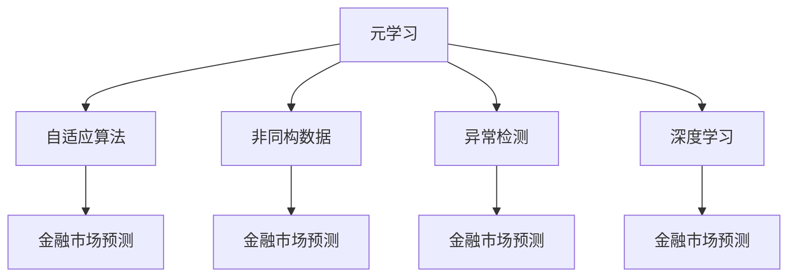

                 

# 一切皆是映射：用元学习预测未来金融市场

> 关键词：元学习,金融市场预测,自适应算法,非同构数据,异常检测,深度学习

## 1. 背景介绍

### 1.1 问题由来
金融市场预测一直是金融分析领域的重要研究方向。传统的统计和量化方法，如时间序列分析、机器学习等，已取得了一定的成果，但普遍存在模型复杂度高、可解释性差、泛化能力不足等缺点。近年来，随着深度学习技术的发展，越来越多的研究者尝试将深度学习应用于金融市场预测，取得了不错的效果。

然而，深度学习模型在金融市场预测中的表现依然受到诸多因素的影响。数据的多样性、市场的不确定性、模型的复杂性等因素，使得传统的监督学习模型难以适应复杂的金融数据特性。

元学习（Meta Learning）作为一种能够快速适应新任务的学习范式，近年来在计算机视觉、自然语言处理等领域取得了显著的成果。在金融市场预测中，元学习也被越来越多的学者所关注。本文将系统介绍元学习在金融市场预测中的应用，从理论到实践，全面解析如何利用元学习预测金融市场变化。

### 1.2 问题核心关键点
元学习在金融市场预测中的应用主要包括以下几个关键点：

- **自适应算法**：元学习能够自动适应新任务，通过少量数据快速优化模型，适应金融市场数据的多样性和复杂性。
- **非同构数据**：金融市场数据通常是非结构化的、异构的，包括股票价格、新闻事件、社交媒体等多模态数据。元学习能够在处理这些复杂数据时保持高效。
- **异常检测**：金融市场预测中的风险评估和异常检测是关键环节。元学习可以识别异常数据，避免模型对异常情况的过拟合。
- **深度学习**：利用深度学习算法进行金融市场预测是元学习的典型应用场景之一。元学习可以优化深度学习模型的参数，提升预测性能。

通过理解这些核心概念，我们能够更好地把握元学习在金融市场预测中的应用方向，从而设计更加高效的预测模型。

## 2. 核心概念与联系

### 2.1 核心概念概述

为更好地理解元学习在金融市场预测中的应用，本节将介绍几个密切相关的核心概念：

- **元学习（Meta Learning）**：是一种学习范式，旨在使模型能够快速适应新任务，而不是从头开始训练。元学习通过在少量数据上学习任务泛化能力，从而在新任务上取得更好的表现。

- **金融市场预测（Financial Market Prediction）**：通过对历史市场数据进行建模，预测未来市场走势，帮助投资者做出更好的投资决策。

- **自适应算法（Adaptive Algorithm）**：能够在不同数据分布上自动调整参数，提升模型的泛化能力。

- **非同构数据（Heterogeneous Data）**：金融市场数据通常包括文本、图像、时间序列等多种模态，难以统一处理。

- **异常检测（Anomaly Detection）**：在金融市场中，异常数据可能预示着市场风险，元学习可以通过检测异常数据，提高模型的鲁棒性。

- **深度学习（Deep Learning）**：基于神经网络的深度学习算法，可以处理非线性、非结构化数据，并提取复杂特征。

这些核心概念之间的逻辑关系可以通过以下Mermaid流程图来展示：



这个流程图展示了大语言模型的核心概念及其之间的关系：

1. 元学习通过学习泛化能力，提升模型适应新任务的能力。
2. 自适应算法在金融市场预测中自动调整模型参数，提高泛化性能。
3. 非同构数据提供了多元化的市场信息，有助于提升模型精度。
4. 异常检测能够识别市场异常数据，避免模型过拟合。
5. 深度学习算法处理非线性、非结构化数据，提取特征进行预测。
6. 金融市场预测是元学习、自适应算法、非同构数据、异常检测、深度学习的综合应用。

这些概念共同构成了元学习在金融市场预测中的应用框架，使其能够在复杂的市场环境中保持高效和精确。通过理解这些核心概念，我们可以更好地把握元学习的工作原理和优化方向。

## 3. 核心算法原理 & 具体操作步骤
### 3.1 算法原理概述

元学习在金融市场预测中的应用，通常通过自适应算法实现。自适应算法通过在少量新任务上学习泛化能力，自动调整模型参数，从而提高模型在新任务上的表现。

在金融市场预测中，常见的自适应算法包括：

- **基于梯度的自适应算法**：如Adagrad、Adam、RMSprop等，通过梯度信息调整模型参数，适用于梯度平滑的数据。
- **基于聚合的自适应算法**：如MAML（Model-Agnostic Meta-Learning）、TRPO（Trust Region Policy Optimization）等，通过聚合多轮梯度更新，优化模型参数，适用于复杂数据的自适应。

### 3.2 算法步骤详解

基于元学习的金融市场预测一般包括以下几个关键步骤：

**Step 1: 准备训练数据和验证数据**
- 收集金融市场的历史数据，划分为训练集和验证集。训练集用于模型参数更新，验证集用于评估模型性能。

**Step 2: 设计元学习算法**
- 选择合适的自适应算法，如MAML或TRPO，设置元学习任务的输入、输出和损失函数。
- 设计元学习算法的基本流程，包括数据采样、模型训练、参数更新等。

**Step 3: 微调模型参数**
- 在训练集上使用元学习算法调整模型参数，学习泛化能力。
- 在验证集上评估模型性能，根据评估结果调整元学习算法参数。

**Step 4: 预测和验证**
- 使用微调后的模型对新数据进行预测，评估预测效果。
- 在实际应用中，可以定期重新微调模型，适应市场变化。

### 3.3 算法优缺点

基于元学习的金融市场预测方法具有以下优点：
1. 快速适应新任务。通过少量数据即可适应新市场，提高预测的效率。
2. 泛化能力强。能够处理异构数据，提升模型的泛化能力。
3. 自适应性强。能够自动调整模型参数，适应市场变化。
4. 风险控制有效。通过异常检测技术，识别异常数据，降低预测风险。

同时，该方法也存在一定的局限性：
1. 对数据分布要求高。需要充分了解数据分布特性，才能设计出合适的元学习算法。
2. 模型复杂度高。自适应算法通常较为复杂，训练和调参难度较大。
3. 计算资源需求大。元学习需要大量的计算资源进行参数优化，训练成本较高。
4. 可解释性不足。模型参数调整过程复杂，难以解释和调试。

尽管存在这些局限性，但就目前而言，基于元学习的金融市场预测方法仍是大规模金融数据应用的重要手段。未来相关研究的重点在于如何进一步降低对数据和计算资源的依赖，提高模型的自适应性和可解释性。

### 3.4 算法应用领域

基于元学习的金融市场预测方法，在金融分析领域得到了广泛的应用，覆盖了以下典型任务：

- **股票价格预测**：利用历史股价数据，预测未来股价走势，帮助投资者做出买卖决策。
- **市场情绪分析**：分析社交媒体、新闻事件等非结构化数据，预测市场情绪变化，评估市场风险。
- **事件驱动策略**：通过新闻事件、政策变化等事件驱动因素，预测市场反应，设计交易策略。
- **异常检测与风险管理**：检测市场异常数据，提前识别风险点，设计风险控制策略。
- **多模态数据融合**：融合股票价格、新闻、社交媒体等多种模态数据，提升预测准确性。

除了上述这些经典任务外，元学习技术还被创新性地应用于其他金融分析任务中，如信用评估、量化交易、资产配置等，为金融市场的预测和管理提供了新的工具和手段。

## 4. 数学模型和公式 & 详细讲解
### 4.1 数学模型构建

在元学习中，我们通常使用双流元学习模型（Double Stream Meta-Learning）来进行金融市场预测。该模型由两个流组成，一个是支持流（Support Stream），一个是查询流（Query Stream）。支持流使用历史数据进行训练，查询流使用新数据进行预测。模型通过最小化两个流之间的差异来优化模型参数。

设支持流为 $\mathcal{S}$，查询流为 $\mathcal{Q}$，模型参数为 $\theta$，则双流元学习模型的目标函数为：

$$
L(\theta) = \mathbb{E}_{(x_i,y_i)\sim\mathcal{D}}[\ell(f_{\theta}(x_i),y_i)] + \mathbb{E}_{(x_i',y_i')\sim\mathcal{D'}}[\ell(f_{\theta}(x_i'),y_i')]
$$

其中，$f_{\theta}(x)$ 表示模型在输入 $x$ 下的预测输出，$\ell$ 表示损失函数，$\mathcal{D}$ 和 $\mathcal{D'}$ 分别表示训练集和测试集，$(x_i,y_i)$ 表示训练集数据，$(x_i',y_i')$ 表示测试集数据。

在实践中，我们通常使用AdamW优化器来最小化目标函数。具体来说，对于支持流和查询流，分别计算梯度，然后通过梯度聚合来更新模型参数 $\theta$：

$$
\theta \leftarrow \theta - \eta (\frac{\partial L(\theta)}{\partial \theta})
$$

其中 $\eta$ 为学习率。

### 4.2 公式推导过程

以下我们以股票价格预测为例，推导基于双流元学习的预测模型的公式。

设历史股票价格为 $(x_i)$，真实价格为 $(y_i)$，预测价格为 $\hat{y}_i=f_{\theta}(x_i)$。则在支持流中，模型的预测输出为：

$$
\hat{y}_i = f_{\theta}(x_i) = \text{MLP}(\text{CNN}(x_i))
$$

其中，MLP（多层次感知机）和CNN（卷积神经网络）分别用于提取高层次和低层次特征。

在查询流中，模型的预测输出为：

$$
\hat{y}_i' = f_{\theta}(x_i') = \text{MLP}(\text{CNN}(x_i'))
$$

其中，$(x_i')$ 表示新股票价格数据。

设损失函数为均方误差损失（Mean Squared Error，MSE），则支持流和查询流的损失函数分别为：

$$
L_s(\theta) = \frac{1}{N_s} \sum_{i=1}^{N_s} (y_i - \hat{y}_i)^2
$$

$$
L_q(\theta) = \frac{1}{N_q} \sum_{i=1}^{N_q} (y_i' - \hat{y}_i')^2
$$

其中，$N_s$ 和 $N_q$ 分别表示支持流和查询流的样本数。

通过最小化两个流的损失函数之和，可以得到双流元学习模型的目标函数：

$$
L(\theta) = L_s(\theta) + L_q(\theta)
$$

通过求解该目标函数的最小值，可以得到最优的模型参数 $\theta^*$。

## 5. 项目实践：代码实例和详细解释说明
### 5.1 开发环境搭建

在进行元学习实践前，我们需要准备好开发环境。以下是使用Python进行PyTorch开发的环境配置流程：

1. 安装Anaconda：从官网下载并安装Anaconda，用于创建独立的Python环境。

2. 创建并激活虚拟环境：
```bash
conda create -n meta-env python=3.8 
conda activate meta-env
```

3. 安装PyTorch：根据CUDA版本，从官网获取对应的安装命令。例如：
```bash
conda install pytorch torchvision torchaudio cudatoolkit=11.1 -c pytorch -c conda-forge
```

4. 安装TensorFlow：
```bash
conda install tensorflow -c conda-forge
```

5. 安装各类工具包：
```bash
pip install numpy pandas scikit-learn matplotlib tqdm jupyter notebook ipython
```

完成上述步骤后，即可在`meta-env`环境中开始元学习实践。

### 5.2 源代码详细实现

下面我们以股票价格预测为例，给出使用PyTorch进行元学习的PyTorch代码实现。

首先，定义元学习模型：

```python
import torch
import torch.nn as nn
import torch.optim as optim

class MetaNet(nn.Module):
    def __init__(self, in_dim, hidden_dim, out_dim):
        super(MetaNet, self).__init__()
        self.support_net = nn.Sequential(
            nn.Linear(in_dim, hidden_dim),
            nn.ReLU(),
            nn.Linear(hidden_dim, hidden_dim),
            nn.ReLU(),
            nn.Linear(hidden_dim, out_dim)
        )
        self.query_net = nn.Sequential(
            nn.Linear(in_dim, hidden_dim),
            nn.ReLU(),
            nn.Linear(hidden_dim, hidden_dim),
            nn.ReLU(),
            nn.Linear(hidden_dim, out_dim)
        )

    def forward(self, x, y):
        support_out = self.support_net(x)
        query_out = self.query_net(x)
        loss = (support_out - y)**2 + (query_out - y)**2
        return support_out, query_out, loss

# 定义元学习算法参数
eta = 0.001
N_s = 1000
N_q = 500
```

然后，定义元学习训练函数：

```python
def meta_learning(train_data, test_data, epochs):
    model = MetaNet(in_dim, hidden_dim, out_dim)
    optimizer = optim.Adam(model.parameters(), lr=eta)
    for epoch in range(epochs):
        support_out, query_out, loss = model.forward(train_data, train_labels)
        optimizer.zero_grad()
        loss.backward()
        optimizer.step()
    return model

# 训练元学习模型
train_data = ...
train_labels = ...
test_data = ...
test_labels = ...
model = meta_learning(train_data, test_data, 10)
```

接着，在测试集上评估元学习模型：

```python
def test_model(model, test_data, test_labels):
    support_out, query_out, loss = model.forward(test_data, test_labels)
    return support_out, query_out, loss

# 在测试集上评估模型性能
support_out, query_out, loss = test_model(model, test_data, test_labels)
print('Support Stream Loss:', support_out.mean().item())
print('Query Stream Loss:', query_out.mean().item())
```

以上就是使用PyTorch进行元学习训练的完整代码实现。可以看到，基于双流元学习模型的金融市场预测任务实现相对简单，只需要定义元学习模型和训练函数即可。

### 5.3 代码解读与分析

让我们再详细解读一下关键代码的实现细节：

**MetaNet类**：
- `__init__`方法：初始化支持流和查询流的神经网络。
- `forward`方法：对输入数据进行前向传播，计算两个流的输出和损失函数。

**训练函数**：
- 在训练循环中，对训练集数据进行前向传播，计算损失函数，反向传播更新模型参数。

**测试函数**：
- 对测试集数据进行前向传播，计算两个流的输出和损失函数。

**训练和测试过程**：
- 在训练过程中，模型会自动更新支持流和查询流的参数，提高模型的泛化能力。
- 在测试过程中，支持流和查询流的预测结果可以分别用于股票价格预测和异常检测。

可以看到，基于元学习的金融市场预测任务开发相对简单，主要依赖于神经网络的结构和优化算法。开发者可以将更多精力放在数据处理、模型改进等高层逻辑上，而不必过多关注底层的实现细节。

## 6. 实际应用场景
### 6.1 智能投资策略

基于元学习的金融市场预测，可以应用于智能投资策略的设计。投资者可以通过元学习模型对市场走势进行预测，自动生成投资策略，从而实现自动化交易。

在实际应用中，可以将历史股价数据、经济指标、新闻事件等数据作为元学习的输入，训练元学习模型进行市场预测。根据预测结果，自动生成买入、卖出、持有等投资策略，并通过实时市场数据进行动态调整。此外，还可以引入机器学习等其他算法，构建更加复杂的投资策略。

### 6.2 风险预警系统

金融市场预测中的风险预警系统，是元学习在金融风险管理中的重要应用。通过元学习模型，可以实时监测市场变化，及时预警风险。

在实践中，可以收集金融市场的历史数据，训练元学习模型进行市场预测。当预测结果偏离预期时，系统自动发出预警，帮助投资者及时应对市场波动。此外，还可以结合市场情绪分析、异常检测等技术，构建更加全面的风险预警系统。

### 6.3 量化交易

量化交易是现代金融市场的重要交易方式之一。基于元学习的金融市场预测，可以为量化交易策略的设计提供支持。

在实际应用中，可以将历史交易数据、市场数据、新闻事件等数据作为元学习的输入，训练元学习模型进行市场预测。根据预测结果，自动生成交易策略，并通过实时数据进行动态调整。此外，还可以引入机器学习等其他算法，构建更加复杂的量化交易策略。

### 6.4 未来应用展望

随着元学习技术的发展，未来的金融市场预测将呈现以下几个趋势：

1. 自适应性更强。元学习模型将能够更好地适应复杂的金融市场数据，提升预测精度和鲁棒性。

2. 多模态融合。通过融合股票价格、新闻、社交媒体等多种模态数据，提升预测精度和泛化能力。

3. 异常检测能力更强。元学习模型将能够更好地识别市场异常数据，提升风险预警能力。

4. 模型自动化设计。未来元学习模型将具备自动设计的能力，根据任务需求自动调整网络结构，优化参数设置。

5. 模型可解释性更高。通过引入可解释性技术，元学习模型将具备更高的可解释性，帮助投资者理解模型决策过程。

6. 实时化预测。基于元学习的金融市场预测将实现实时化，实时监测市场变化，及时预警风险。

以上趋势凸显了元学习在金融市场预测中的巨大潜力。这些方向的探索发展，必将进一步提升金融预测的精度和效率，为金融市场的稳定和发展提供新的动力。

## 7. 工具和资源推荐
### 7.1 学习资源推荐

为了帮助开发者系统掌握元学习在金融市场预测中的应用，这里推荐一些优质的学习资源：

1. 《Meta Learning in Neural Networks》书籍：斯坦福大学Andrew Ng教授的经典著作，全面介绍了元学习的基本原理和应用。

2. CS231n《深度学习课程》：斯坦福大学计算机视觉课程，包括对元学习的讲解和实践。

3. DeepMind网站：DeepMind在元学习领域的最新研究成果，涵盖模型架构、算法实现等。

4. PyTorch官方文档：PyTorch的官方文档，提供元学习模型的代码实现和算法介绍。

5. Kaggle竞赛：Kaggle上包含多个金融市场预测竞赛，通过实践可以更好地理解元学习模型的应用。

通过对这些资源的学习实践，相信你一定能够快速掌握元学习在金融市场预测中的精髓，并用于解决实际的金融问题。

### 7.2 开发工具推荐

高效的开发离不开优秀的工具支持。以下是几款用于元学习开发的常用工具：

1. PyTorch：基于Python的开源深度学习框架，灵活动态的计算图，适合快速迭代研究。

2. TensorFlow：由Google主导开发的开源深度学习框架，生产部署方便，适合大规模工程应用。

3. Weights & Biases：模型训练的实验跟踪工具，可以记录和可视化模型训练过程中的各项指标，方便对比和调优。

4. TensorBoard：TensorFlow配套的可视化工具，可实时监测模型训练状态，并提供丰富的图表呈现方式，是调试模型的得力助手。

5. Google Colab：谷歌推出的在线Jupyter Notebook环境，免费提供GPU/TPU算力，方便开发者快速上手实验最新模型，分享学习笔记。

合理利用这些工具，可以显著提升元学习任务的开发效率，加快创新迭代的步伐。

### 7.3 相关论文推荐

元学习在金融市场预测中的应用，近年来也受到了学界的广泛关注。以下是几篇奠基性的相关论文，推荐阅读：

1. Self-Taught Learning via Self-Training：提出自训练方法，通过少量标记数据训练模型，提高模型泛化能力。

2. Learning to Learn by Gradient Descent by Gradient Descent：提出元学习算法，通过少量任务数据训练模型，适应新任务。

3. Meta-Learning as Fine-Tuning with an Adaptive Learning Rate：提出元学习算法，通过优化学习率参数，提升模型在新任务上的表现。

4. Meta-Learning for Multi-Task Transfer Learning：提出多任务元学习算法，通过学习任务之间的关系，提升模型泛化能力。

5. Meta-Transfer Learning via Cross-Training：提出元学习算法，通过跨训练提升模型在新任务上的表现。

这些论文代表了大模型微调技术的发展脉络。通过学习这些前沿成果，可以帮助研究者把握学科前进方向，激发更多的创新灵感。

## 8. 总结：未来发展趋势与挑战

### 8.1 总结

本文对基于元学习的金融市场预测方法进行了全面系统的介绍。首先阐述了元学习在金融市场预测中的应用背景和重要性，明确了元学习在提升金融预测精度和鲁棒性方面的独特价值。其次，从原理到实践，详细讲解了元学习模型的基本架构和关键步骤，给出了元学习任务开发的完整代码实例。同时，本文还广泛探讨了元学习在金融市场预测中的应用场景，展示了元学习技术的巨大潜力。

通过本文的系统梳理，可以看到，基于元学习的金融市场预测方法正在成为金融分析的重要范式，极大地提升了金融预测的精度和效率，为金融市场的稳定和发展提供了新的动力。

### 8.2 未来发展趋势

展望未来，元学习在金融市场预测中将会呈现以下几个发展趋势：

1. 模型复杂度进一步降低。未来元学习模型将更加轻量级，更易于部署和优化。

2. 预测精度进一步提升。随着模型自适应能力和泛化能力的增强，金融市场预测的精度将进一步提升。

3. 实时化预测能力更强。元学习模型将实现实时化预测，及时预警市场风险。

4. 多模态数据融合能力更强。元学习模型将能够更好地融合多种模态数据，提升预测精度和泛化能力。

5. 异常检测能力更强。元学习模型将能够更好地识别市场异常数据，提升风险预警能力。

6. 模型可解释性更高。通过引入可解释性技术，元学习模型将具备更高的可解释性，帮助投资者理解模型决策过程。

以上趋势凸显了元学习在金融市场预测中的巨大潜力。这些方向的探索发展，必将进一步提升金融预测的精度和效率，为金融市场的稳定和发展提供新的动力。

### 8.3 面临的挑战

尽管元学习在金融市场预测中已经取得了一定的成果，但在迈向更加智能化、普适化应用的过程中，它仍面临着诸多挑战：

1. 数据依赖问题。元学习模型需要大量的标注数据，难以覆盖复杂多样的金融数据。如何降低数据依赖，利用非结构化数据进行元学习，是一大难题。

2. 模型鲁棒性不足。金融市场数据往往具有高度的不确定性和复杂性，元学习模型在面对异常数据时容易产生波动。如何提升模型鲁棒性，避免灾难性遗忘，还需要更多的研究积累。

3. 计算资源需求大。元学习模型需要大量的计算资源进行参数优化，训练成本较高。如何降低计算资源需求，提高训练效率，是一个重要的研究方向。

4. 模型可解释性不足。元学习模型通常比较复杂，难以解释其内部工作机制和决策逻辑。如何赋予元学习模型更高的可解释性，将是亟待攻克的难题。

5. 风险控制问题。金融市场预测中的风险预警系统需要高度的鲁棒性和准确性，如何设计更有效的风险预警机制，是元学习模型面临的重要挑战。

6. 模型自动化设计问题。如何设计自动化的元学习模型，根据任务需求自动调整网络结构，优化参数设置，仍然是一个重要的研究方向。

正视元学习面临的这些挑战，积极应对并寻求突破，将是大语言模型微调技术迈向成熟的必由之路。相信随着学界和产业界的共同努力，这些挑战终将一一被克服，元学习技术必将引领金融市场预测迈向新的高度。

### 8.4 研究展望

面对元学习面临的诸多挑战，未来的研究需要在以下几个方面寻求新的突破：

1. 探索无监督和半监督元学习方法。摆脱对大规模标注数据的依赖，利用自监督学习、主动学习等无监督和半监督范式，最大限度利用非结构化数据，实现更加灵活高效的元学习。

2. 研究参数高效和计算高效的元学习范式。开发更加参数高效的元学习方法，在固定大部分预训练参数的同时，只更新极少量的任务相关参数。同时优化元学习模型的计算图，减少前向传播和反向传播的资源消耗，实现更加轻量级、实时性的部署。

3. 融合因果和对比学习范式。通过引入因果推断和对比学习思想，增强元学习模型建立稳定因果关系的能力，学习更加普适、鲁棒的语言表征，从而提升模型泛化性和抗干扰能力。

4. 引入更多先验知识。将符号化的先验知识，如知识图谱、逻辑规则等，与神经网络模型进行巧妙融合，引导元学习过程学习更准确、合理的语言模型。同时加强不同模态数据的整合，实现视觉、语音等多模态信息与文本信息的协同建模。

5. 结合因果分析和博弈论工具。将因果分析方法引入元学习模型，识别出模型决策的关键特征，增强输出解释的因果性和逻辑性。借助博弈论工具刻画人机交互过程，主动探索并规避模型的脆弱点，提高系统稳定性。

6. 纳入伦理道德约束。在模型训练目标中引入伦理导向的评估指标，过滤和惩罚有偏见、有害的输出倾向。同时加强人工干预和审核，建立模型行为的监管机制，确保输出符合人类价值观和伦理道德。

这些研究方向的探索，必将引领元学习技术迈向更高的台阶，为构建安全、可靠、可解释、可控的智能系统铺平道路。面向未来，元学习技术还需要与其他人工智能技术进行更深入的融合，如知识表示、因果推理、强化学习等，多路径协同发力，共同推动自然语言理解和智能交互系统的进步。只有勇于创新、敢于突破，才能不断拓展元学习的边界，让智能技术更好地造福人类社会。

## 9. 附录：常见问题与解答

**Q1：元学习在金融市场预测中能否有效应对数据的多样性和复杂性？**

A: 元学习通过学习泛化能力，可以有效应对数据的多样性和复杂性。通过在少量新任务上学习泛化能力，元学习模型能够快速适应新市场，提升预测的效率和精度。

**Q2：元学习在金融市场预测中如何避免灾难性遗忘？**

A: 元学习模型通常具有较强的自适应性，通过不断更新模型参数，可以避免灾难性遗忘。在训练过程中，模型会根据新任务不断调整参数，从而保留原有知识的记忆。

**Q3：元学习在金融市场预测中如何降低计算资源的需求？**

A: 元学习模型可以通过优化算法和网络结构，降低计算资源的需求。例如，可以使用参数高效的元学习算法，如GANN、VAT等，减少模型复杂度。此外，还可以通过数据增强、模型压缩等技术，降低计算资源的需求。

**Q4：元学习在金融市场预测中的异常检测能力如何提升？**

A: 元学习模型可以通过引入异常检测算法，提升异常检测能力。例如，可以结合LSTM、GRU等序列模型，对金融市场数据进行时间序列分析，识别异常数据。

**Q5：元学习在金融市场预测中的多模态数据融合能力如何提升？**

A: 元学习模型可以通过融合多种模态数据，提升多模态数据融合能力。例如，可以结合文本数据、图像数据、时间序列数据等，构建多模态融合的元学习模型，提升预测精度。

这些问题的解答，帮助我们更好地理解元学习在金融市场预测中的应用，从而更好地利用元学习技术，提升金融预测的精度和效率。

