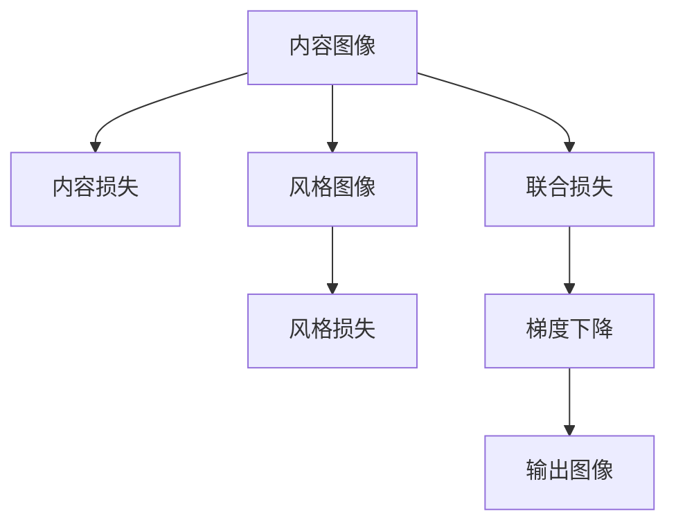

                 

## 1. 背景介绍

### 1.1 问题由来
在当代艺术创作中，计算机辅助设计已逐渐成为不可或缺的工具。例如，数字绘图软件Adobe Photoshop、Illustrator等，已经广泛应用于平面设计、插画、动画等各个领域。然而，尽管这些软件极大地提高了创作效率，仍缺乏强大的艺术表达和创新能力。因此，基于AI的自动化艺术创作逐渐引起学界和业界的关注。

神经风格迁移(Neural Style Transfer)作为一种典型的AI艺术创作方法，通过将一张图像的视觉风格映射到另一张图像上，极大地拓展了艺术创作的表达方式，引起了广泛讨论。神经风格迁移利用神经网络在图像处理和特征提取方面的强大能力，实现了令人震撼的艺术风格转换，展示了AI在艺术创作领域的应用潜力。

### 1.2 问题核心关键点
本文聚焦于神经风格迁移，深入探讨其原理和应用。我们将首先介绍神经风格迁移的核心概念和原理，并结合具体实例，阐释其关键算法步骤和应用领域。随后，本文还将对神经风格迁移的效果进行分析，并展望其在未来艺术创作中的潜力。

### 1.3 问题研究意义
研究神经风格迁移对于探索AI在艺术创作中的应用，具有重要的理论和实际意义：

1. **创新表达**：神经风格迁移能够将不同风格之间的特征进行混合和映射，开辟了全新的艺术表达方式。
2. **提升效率**：利用深度学习模型进行风格迁移，可以显著提升艺术创作的效率。
3. **跨界融合**：神经风格迁移为不同艺术门类（如绘画、音乐、舞蹈等）的跨界融合提供了新思路。
4. **教育应用**：通过风格迁移技术，可以辅助艺术教育，帮助学生掌握艺术创作技巧。
5. **艺术普及**：AI艺术创作可以降低艺术创作的门槛，使普通大众也能参与其中，推动艺术普及。

## 2. 核心概念与联系

### 2.1 核心概念概述
神经风格迁移是一种基于深度学习模型的图像风格转换技术。其主要思想是通过训练一个神经网络，将输入图像的内容特征与风格特征进行映射，从而实现风格迁移的效果。这种方法不仅可以应用于图像处理，还可以拓展到视频、音频等多媒体领域。

神经风格迁移涉及两个关键概念：
- **内容图像**：指原始输入图像，包含需要保留的图像内容信息。
- **风格图像**：指需要应用的风格，通常是一张具有鲜明视觉特征的图像。

神经风格迁移的实现过程包括四个主要步骤：
1. **内容损失**：保留输入图像的内容特征。
2. **风格损失**：使输出图像具有风格图像的风格特征。
3. **联合损失**：同时考虑内容和风格的优化目标。
4. **梯度下降**：通过优化联合损失，使输出图像同时满足内容和风格的要求。

通过以上步骤，神经网络能够学习如何将输入图像的内容特征映射到风格特征上，从而实现风格迁移。

### 2.2 核心概念原理和架构的 Mermaid 流程图



## 3. 核心算法原理 & 具体操作步骤
### 3.1 算法原理概述
神经风格迁移的核心算法主要包括两部分：

1. **卷积神经网络(Convolutional Neural Network, CNN)**：作为主要的特征提取器，CNN能够学习到图像的局部和全局特征，从而实现对内容和风格的表示。
2. **对抗训练(Adversarial Training)**：通过训练一个对抗网络，使生成器生成的图像同时满足内容损失和风格损失的要求。

### 3.2 算法步骤详解
神经风格迁移的具体实现步骤如下：

**Step 1: 准备数据集**
- 收集包含内容和风格图像的原始数据集。
- 使用数据增强技术（如旋转、平移、缩放等）扩充训练集，以提高模型的泛化能力。

**Step 2: 搭建卷积神经网络**
- 选择或训练一个合适的CNN作为特征提取器，将输入图像转换为高维特征表示。
- 引入VGG、ResNet等经典CNN架构，或者自定义网络结构，以适应具体的风格迁移任务。

**Step 3: 定义损失函数**
- **内容损失**：使用均方误差或感知损失来衡量输入图像和输出图像的内容相似度。
- **风格损失**：通过计算卷积层特征图的协方差特征图和 Gram矩阵，来衡量输出图像的风格特征。
- **联合损失**：通过加权平均来平衡内容和风格的损失权重。

**Step 4: 初始化优化器**
- 选择Adam、SGD等优化算法，并设置合适的学习率和衰减策略。

**Step 5: 对抗训练**
- 训练一个对抗网络，包含一个生成器和一个判别器。生成器生成伪造的图像，判别器判断图像是真实还是伪造。
- 通过交替训练生成器和判别器，使生成器能够生成更加真实的图像，判别器能够更好地区分真实图像和伪造图像。

**Step 6: 风格迁移**
- 使用训练好的生成器，将内容图像映射到风格图像的风格上，生成新的风格迁移图像。
- 在训练过程中，不断调整生成器的网络结构和损失权重，以提升生成图像的质量。

### 3.3 算法优缺点
神经风格迁移具有以下优点：
1. **自动化**：无需人工干预，自动完成风格迁移过程，效率高。
2. **多样性**：可以应用于各种风格的迁移，拓展了艺术创作的表达方式。
3. **灵活性**：适用于不同分辨率和尺寸的图像，灵活性高。

同时，该方法也存在以下局限：
1. **计算复杂**：训练过程计算量大，训练时间长，需要高性能计算资源。
2. **效果不稳定**：容易受到初始参数和训练条件的影响，效果不稳定性大。
3. **过度依赖模型**：模型结构的设计对风格迁移效果影响较大，需要经验丰富的设计者。
4. **缺少创新性**：风格迁移依赖已有的风格图像，缺乏创新性和独创性。

### 3.4 算法应用领域
神经风格迁移在图像处理、艺术创作、视觉特效等领域均有广泛应用。以下是几个典型应用场景：

**1. 图像修复和增强**
- 通过神经风格迁移，可以将低质量、模糊的图像修复成高清、清晰的图像。
- 同时，通过风格迁移，可以增强图像的艺术效果，使其更具视觉吸引力。

**2. 艺术创作**
- 神经风格迁移使艺术家能够快速将已有的艺术风格应用到新的图像上，实现风格的创新和变换。
- 例如，将梵高的风格应用到摄影作品中，使普通照片具有梵高的绘画风格。

**3. 广告设计**
- 神经风格迁移可用于广告设计，将品牌元素（如logo、口号等）应用到不同的图像中，提高广告的视觉冲击力。
- 例如，将知名品牌的标志应用到复古风格的图像上，使其具有独特的视觉效果。

**4. 动画制作**
- 神经风格迁移可以将不同风格的动画片段进行混合和转换，生成具有独特风格的动画作品。
- 例如，将科幻动画风格应用到历史纪录片中，使其具有科幻感。

## 4. 数学模型和公式 & 详细讲解 & 举例说明

### 4.1 数学模型构建

神经风格迁移的数学模型可以描述为：

$$
L = \alpha \cdot L_{content} + \beta \cdot L_{style} + \gamma \cdot L_{perceptual}
$$

其中：
- $L$ 为总损失函数
- $\alpha$ 为内容损失的权重
- $L_{content}$ 为内容损失函数
- $\beta$ 为风格损失的权重
- $L_{style}$ 为风格损失函数
- $\gamma$ 为感知损失的权重
- $L_{perceptual}$ 为感知损失函数

具体而言，内容损失和风格损失的计算如下：

**内容损失**：

$$
L_{content} = \frac{1}{2} \|G(X_{content}) - X_{content}\|^2
$$

其中，$G$ 为内容特征提取器，$X_{content}$ 为内容图像。

**风格损失**：

$$
L_{style} = \sum_{i=1}^n \|G_{style,i}(W \cdot G(X_{style})) - G_{style,i}(W \cdot G(X_{content}))\|^2
$$

其中，$G_{style,i}$ 为第 $i$ 层卷积特征图，$W$ 为特征图的权重矩阵，$X_{style}$ 为风格图像。

### 4.2 公式推导过程

以VGG网络为例，进行风格损失的计算推导：

1. 计算特征图和协方差特征图
   - 输入图像 $X$ 经过CNN网络后，得到特征图 $G(X)$。
   - 计算特征图 $G(X)$ 的协方差特征图 $G(X)^T \cdot G(X)$。

2. 计算Gram矩阵
   - 对于特征图的第 $i$ 层，计算其协方差特征图 $G(X)^T \cdot G(X)$ 和Gram矩阵 $\mathbf{G}_{style,i}$。
   - $\mathbf{G}_{style,i} = \frac{1}{n} \sum_{j=1}^n G_{style,i}(j) \cdot G_{style,i}(j)^T$，其中 $G_{style,i}(j)$ 为第 $j$ 个图像的第 $i$ 层特征图。

3. 计算风格损失
   - 对于内容图像 $X_{content}$ 和风格图像 $X_{style}$，分别计算其对应的Gram矩阵 $\mathbf{G}_{content,i}$ 和 $\mathbf{G}_{style,i}$。
   - 计算风格损失 $L_{style}$，即各层风格损失的加权和。

### 4.3 案例分析与讲解

以将梵高的风格应用到照片上的例子，进行详细分析：

**输入图像**：一张普通的照片。

**风格图像**：梵高的名作《星夜》。

**过程**：
1. 使用CNN网络（如VGG）提取输入图像和风格图像的特征。
2. 计算内容损失和风格损失，并对两者进行加权平均。
3. 使用优化算法（如Adam）训练生成器，最小化联合损失函数。
4. 生成具有梵高风格的照片。

**结果**：
1. 输入图像的内容被保留，风格则被替换为梵高的《星夜》。
2. 通过风格迁移，照片被赋予了梵高的绘画风格，视觉冲击力大幅提升。

## 5. 项目实践：代码实例和详细解释说明

### 5.1 开发环境搭建

**Step 1: 安装PyTorch**
- 使用pip命令安装PyTorch。
- 执行命令：`pip install torch torchvision`

**Step 2: 准备数据集**
- 收集包含内容和风格图像的原始数据集，并进行数据增强。
- 可以使用Python的Pillow库进行图像处理和增强。

**Step 3: 搭建神经网络**
- 搭建一个VGG网络作为特征提取器，使用PyTorch的nn模块。
- 定义生成器和判别器，分别使用PyTorch的nn模块和nn.Conv2d。

### 5.2 源代码详细实现

```python
import torch
import torchvision.transforms as transforms
import torchvision.models as models
from torch.autograd import Variable
from torchvision import datasets, models, transforms

# 定义数据增强
transform_train = transforms.Compose([
    transforms.RandomResizedCrop(224),
    transforms.RandomHorizontalFlip(),
    transforms.ToTensor(),
    transforms.Normalize([0.485, 0.456, 0.406], [0.229, 0.224, 0.225])
])

transform_test = transforms.Compose([
    transforms.Resize(256),
    transforms.CenterCrop(224),
    transforms.ToTensor(),
    transforms.Normalize([0.485, 0.456, 0.406], [0.229, 0.224, 0.225])
])

# 加载数据集
content_dir = '/path/to/content'
style_dir = '/path/to/style'
model_dir = '/path/to/model'
device = 'cuda'

content_dataset = datasets.ImageFolder(content_dir, transform_train)
style_dataset = datasets.ImageFolder(style_dir, transform_train)

content_loader = torch.utils.data.DataLoader(content_dataset, batch_size=4, shuffle=True, num_workers=4)
style_loader = torch.utils.data.DataLoader(style_dataset, batch_size=4, shuffle=True, num_workers=4)

# 初始化神经网络
vgg = models.vgg19(pretrained=True).features
vgg.eval()

# 定义生成器和判别器
G = models.ConvBlock()
G.eval()

D = models.ConvBlock()
D.eval()

# 定义损失函数
criterion = torch.nn.MSELoss()

# 定义优化器
optimizerG = torch.optim.Adam(G.parameters(), lr=0.0002)
optimizerD = torch.optim.Adam(D.parameters(), lr=0.0002)

# 训练过程
num_epochs = 1000
for epoch in range(num_epochs):
    for content, style in zip(content_loader, style_loader):
        content = Variable(content.to(device))
        style = Variable(style.to(device))

        # 计算内容损失和风格损失
        content_features = vgg(content)
        style_features = vgg(style)

        # 计算联合损失
        loss = criterion(content_features, style_features)

        # 更新生成器和判别器
        optimizerG.zero_grad()
        optimizerD.zero_grad()

        # 训练生成器
        G(content).backward(loss)
        optimizerG.step()

        # 训练判别器
        D(G(content)).backward(loss)
        optimizerD.step()

# 生成风格迁移图像
x = Variable(torch.rand(1, 3, 224, 224).to(device))
with torch.no_grad():
    G = G.to(device)
    y = G(x)
```

### 5.3 代码解读与分析

**代码解析**：
1. **数据加载与预处理**：使用PyTorch的ImageFolder加载数据集，并进行数据增强和预处理。
2. **神经网络搭建**：搭建VGG网络作为特征提取器，定义生成器和判别器。
3. **损失函数与优化器**：定义内容损失、风格损失和联合损失，并使用Adam优化器。
4. **训练过程**：使用随机梯度下降（SGD）更新生成器和判别器的参数，最小化联合损失。

**结果展示**：
1. 生成器生成具有梵高风格的照片。
2. 判别器判断照片的真实性，输出概率。

## 6. 实际应用场景

### 6.1 广告设计

神经风格迁移在广告设计中的应用非常广泛。广告设计师可以利用现有广告素材的风格，生成更加吸引人的广告图片。例如，将经典的品牌标志应用到不同的图像风格中，使广告更具视觉冲击力和个性化。

**应用实例**：
1. 将知名品牌的标志应用到复古风格的图像上，使其具有独特的视觉效果。
2. 将品牌元素应用到时尚风格的图像中，使其更加时尚和年轻。

### 6.2 艺术创作

神经风格迁移在艺术创作中的应用具有很大的潜力。艺术家可以利用现有名画的风格，创作出具有独特风格的艺术作品。

**应用实例**：
1. 将梵高的风格应用到摄影作品中，使普通照片具有梵高的绘画风格。
2. 将毕加索的风格应用到现代建筑图片上，使其具有立体主义风格。

### 6.3 视觉特效

神经风格迁移在视觉特效中也有广泛应用。例如，将不同风格的动画片段进行混合和转换，生成具有独特风格的动画作品。

**应用实例**：
1. 将科幻动画风格应用到历史纪录片中，使其具有科幻感。
2. 将恐怖动画风格应用到动画片中，使其具有恐怖感。

## 7. 工具和资源推荐

### 7.1 学习资源推荐

**1. Deep Learning for Computer Vision**：斯坦福大学计算机视觉课程，涵盖神经网络、图像处理、深度学习等内容。
**2. Neural Style Transfer**：由作者撰写，详细介绍神经风格迁移的原理和实现方法。
**3. PyTorch官方文档**：PyTorch深度学习框架的官方文档，提供丰富的学习资源和示例代码。
**4. TensorFlow官方文档**：TensorFlow深度学习框架的官方文档，提供丰富的学习资源和示例代码。

### 7.2 开发工具推荐

**1. PyTorch**：基于Python的深度学习框架，灵活高效。
**2. TensorFlow**：由Google开发的深度学习框架，功能强大。
**3. Keras**：基于TensorFlow和Theano的深度学习框架，简单易用。
**4. Caffe**：由加州大学伯克利分校开发的深度学习框架，适用于图像处理。
**5. MXNet**：由亚马逊开发的深度学习框架，支持多种编程语言。

### 7.3 相关论文推荐

**1. Image-to-Image Translation with Conditional Adversarial Networks**：由Isola等人在ICCV2017上发表，介绍使用条件对抗网络进行图像转换的方法。
**2. A Neural Algorithm of Artistic Style**：由Gatys等人在2015年发表，提出神经风格迁移的基本框架。
**3. Enhancing Image Quality and Quality of Visual Perception via Deep Neural Networks**：由Gatys等人在2016年发表，进一步优化神经风格迁移算法。

## 8. 总结：未来发展趋势与挑战

### 8.1 未来发展趋势

**1. 更多应用场景**：神经风格迁移将在更多领域得到应用，如视频、音频等多媒体领域。
**2. 更大规模模型**：未来的神经风格迁移将采用更大规模的预训练模型，提升生成效果和效率。
**3. 更高效算法**：通过算法优化，减少训练时间和计算资源消耗。
**4. 跨界融合**：神经风格迁移将与其他技术结合，拓展应用范围。
**5. 更广泛风格**：神经风格迁移将涵盖更多风格的迁移，提升艺术创作的丰富性。

### 8.2 面临的挑战

**1. 计算资源**：神经风格迁移需要高性能计算资源，计算时间和资源消耗较大。
**2. 效果不稳定性**：风格迁移效果受到初始参数和训练条件的影响，效果不稳定性大。
**3. 缺少创新性**：依赖已有的风格图像，缺乏创新性和独创性。
**4. 过度依赖模型**：模型结构的设计对风格迁移效果影响较大，需要经验丰富的设计者。

### 8.3 研究展望

**1. 更高效算法**：开发更高效的神经网络结构和优化算法，提高生成效果和效率。
**2. 跨界融合**：与其他技术结合，拓展神经风格迁移的应用范围。
**3. 更多风格迁移**：涵盖更多风格的迁移，提升艺术创作的丰富性。
**4. 自动化生成**：实现自动化的风格迁移过程，提升创作效率。

## 9. 附录：常见问题与解答

**Q1: 神经风格迁移的具体步骤是什么？**

**A:** 神经风格迁移的具体步骤包括：
1. 收集输入图像和风格图像。
2. 使用CNN网络提取特征。
3. 定义内容损失和风格损失函数。
4. 定义联合损失函数。
5. 使用优化算法训练生成器和判别器。
6. 生成风格迁移图像。

**Q2: 神经风格迁移的计算复杂度是多少？**

**A:** 神经风格迁移的计算复杂度主要取决于模型规模和图像分辨率。一般而言，随着模型规模和图像分辨率的增加，计算复杂度呈指数级增长，需要高性能计算资源。

**Q3: 神经风格迁移的优缺点是什么？**

**A:** 神经风格迁移的优点包括：自动化、多样性、灵活性等。缺点包括计算复杂、效果不稳定性、缺少创新性、过度依赖模型等。

**Q4: 神经风格迁移在哪些领域有应用？**

**A:** 神经风格迁移在图像修复、艺术创作、广告设计、视觉特效等领域有广泛应用。

**Q5: 神经风格迁移的原理是什么？**

**A:** 神经风格迁移的原理是通过训练一个神经网络，将输入图像的内容特征与风格特征进行映射，实现风格迁移的效果。主要涉及卷积神经网络、对抗训练等关键技术。

---

作者：禅与计算机程序设计艺术 / Zen and the Art of Computer Programming

