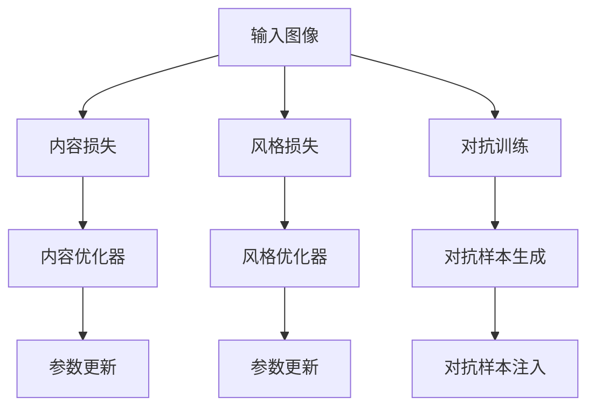

                 

# 一切皆是映射：神经风格迁移和艺术创作中的AI

> 关键词：神经风格迁移, 艺术创作, AI算法, 深度学习, 图像处理, 图像生成, 艺术创新, 图像风格迁移

## 1. 背景介绍

### 1.1 问题由来

自深度学习兴起以来，其强大的表达能力和数据处理能力吸引了众多领域的关注。在艺术创作领域，AI开始尝试通过学习和模仿人类艺术家的风格，生成独特的艺术作品，推动艺术创作方式的创新。

其中，神经风格迁移（Neural Style Transfer）作为深度学习应用于艺术创作的重要技术之一，为AI艺术创作提供了新的视角。该技术结合深度神经网络和风格迁移算法，能够将图像的纹理、色彩等风格特征进行迁移，生成具有特定风格的新图像。

### 1.2 问题核心关键点

神经风格迁移是一种将一个图像的纹理和色彩特征迁移到另一个图像上，使其具备特定风格的方法。具体而言，它包括以下几个核心步骤：

1. 提取特征：使用预训练的深度神经网络（如VGG、ResNet等）对输入图像和风格图像分别提取卷积层特征。
2. 设计损失函数：定义内容损失函数和风格损失函数，用于衡量输入图像和风格图像的特征差异。
3. 训练优化：使用梯度下降等优化算法最小化损失函数，调整图像生成网络的权重，使得输出图像在内容上与输入图像相似，同时在风格上与风格图像相近。

这种技术不仅能应用于图像处理和艺术创作，还能推广到文本生成、音乐创作等领域，大大拓展了AI在艺术创作和跨领域应用中的可能性。

## 2. 核心概念与联系

### 2.1 核心概念概述

为更好地理解神经风格迁移的核心概念，本节将介绍几个密切相关的核心概念：

- **深度神经网络(Deep Neural Network, DNN)**：一种多层次的非线性模型，能够处理复杂的数据结构和关系。
- **卷积神经网络(Convolutional Neural Network, CNN)**：一种特殊类型的DNN，特别擅长处理图像数据。
- **特征提取(Feature Extraction)**：通过卷积层和池化层对输入图像进行特征提取，形成图像的高级表征。
- **风格迁移(Style Transfer)**：一种图像处理技术，通过将风格图像的特征迁移到内容图像上，生成具有特定风格的图像。
- **内容损失(Content Loss)**：衡量输入图像与输出图像的语义内容相似性。
- **风格损失(Style Loss)**：衡量输出图像的视觉风格与风格图像的相似性。
- **对抗训练(Adversarial Training)**：通过在生成图像中添加对抗样本，提高模型的鲁棒性和泛化能力。
- **梯度下降(Gradient Descent)**：一种优化算法，通过迭代调整参数以最小化损失函数。

这些核心概念之间的逻辑关系可以通过以下Mermaid流程图来展示：



这个流程图展示了大模型微调的各个关键概念及其之间的关系：

1. 输入图像首先通过卷积层提取内容特征。
2. 同时，风格图像通过卷积层提取风格特征。
3. 内容损失衡量输入图像与输出图像的内容一致性。
4. 风格损失衡量输出图像与风格图像的风格一致性。
5. 对抗训练引入对抗样本，提升模型鲁棒性。
6. 优化器通过梯度下降最小化损失函数，调整生成网络权重。

这些概念共同构成了神经风格迁移的核心算法，使其能够高效地将风格特征迁移到内容图像上，生成独特的艺术作品。

## 3. 核心算法原理 & 具体操作步骤
### 3.1 算法原理概述

神经风格迁移的核心算法基于深度神经网络的卷积层特征提取和风格损失函数的定义。其核心思想是通过将输入图像和风格图像的卷积层特征进行对比，生成具有特定风格的新图像。

具体而言，假设输入图像为 $I$，风格图像为 $G$，内容损失函数为 $\mathcal{L}_{c}$，风格损失函数为 $\mathcal{L}_{s}$，则目标是最小化总体损失函数 $\mathcal{L}$：

$$
\mathcal{L} = \alpha \mathcal{L}_{c} + \beta \mathcal{L}_{s}
$$

其中 $\alpha$ 和 $\beta$ 为超参数，用于控制内容损失和风格损失的权重。

### 3.2 算法步骤详解

神经风格迁移的一般步骤如下：

1. 准备输入图像和风格图像：输入图像为要风格迁移的内容图像，风格图像为要迁移的风格样本。
2. 提取卷积层特征：使用预训练的深度神经网络（如VGG、ResNet等）提取输入图像和风格图像的卷积层特征。
3. 设计损失函数：计算内容损失和风格损失，定义总体损失函数。
4. 初始化生成网络：使用随机初始化的网络结构，准备进行风格迁移训练。
5. 训练生成网络：使用梯度下降算法最小化损失函数，更新生成网络的权重，生成具有特定风格的新图像。
6. 输出结果：生成的新图像即为输入图像的风格迁移结果。

### 3.3 算法优缺点

神经风格迁移具有以下优点：

1. 能够高效地将风格特征迁移到内容图像上，生成独特的艺术作品。
2. 适用于图像处理、艺术创作、文本生成等多个领域，具备广泛的适用性。
3. 能够将复杂的风格特征从风格图像中抽象出来，应用到各种内容图像中。

同时，该算法也存在一定的局限性：

1. 对输入图像和风格图像的质量要求较高，图像噪声和畸变会影响迁移效果。
2. 训练过程复杂，需要大量的计算资源和时间。
3. 生成的图像可能存在模糊、不自然等问题，缺乏一定的真实感。
4. 对风格迁移结果的解释性不足，难以理解风格迁移的具体过程。

尽管存在这些局限性，但神经风格迁移仍是目前AI艺术创作中应用广泛且效果显著的技术之一。

### 3.4 算法应用领域

神经风格迁移技术不仅在艺术创作领域有广泛应用，还在计算机视觉、图像处理、媒体艺术等多个领域展现出其独特价值：

1. **艺术创作**：生成具有特定风格的新艺术作品，如将梵高的风格应用到普通风景照片上，创作出具有梵高风格的全新图像。
2. **图像修复**：修复损坏或模糊的图像，通过风格迁移技术将其恢复到原始状态。
3. **媒体艺术**：将视频中的不同片段进行风格迁移，生成具有统一风格的视觉作品，提升艺术表现力。
4. **设计辅助**：在平面设计、广告制作等领域，通过风格迁移生成具有特定风格的视觉元素，提高设计效率和美感。
5. **数据增强**：在数据集生成中，通过风格迁移技术生成更多的训练样本，提高模型训练的泛化能力。

随着技术的不断进步，神经风格迁移技术有望在更多领域得到应用，为艺术创作和跨领域创新提供新的可能性。

## 4. 数学模型和公式 & 详细讲解 & 举例说明

### 4.1 数学模型构建

神经风格迁移的数学模型主要基于卷积神经网络的特征提取和风格损失函数的定义。

假设输入图像 $I$ 和风格图像 $G$ 的卷积层特征分别为 $F_C^I$ 和 $F_C^G$，则内容损失函数 $\mathcal{L}_c$ 和风格损失函数 $\mathcal{L}_s$ 可以定义为：

$$
\mathcal{L}_c = \|F_C^I - F_C^G\|^2
$$

$$
\mathcal{L}_s = \sum_{l=0}^{L} \|G^l - F_C^O\|^2
$$

其中 $F_C^O$ 为生成图像 $O$ 的卷积层特征，$L$ 为卷积层的层数，$G^l$ 为风格图像 $G$ 的卷积层特征的第 $l$ 层。

总体损失函数 $\mathcal{L}$ 定义为：

$$
\mathcal{L} = \alpha \mathcal{L}_c + \beta \mathcal{L}_s
$$

### 4.2 公式推导过程

以下我们以生成图像 $O$ 为输入，对上述公式进行详细推导：

1. 首先，使用深度神经网络对输入图像 $I$ 和生成图像 $O$ 提取卷积层特征 $F_C^I$ 和 $F_C^O$。
2. 然后，将生成图像 $O$ 的卷积层特征 $F_C^O$ 与风格图像 $G$ 的卷积层特征 $G^l$ 进行对比，计算风格损失 $\mathcal{L}_s$。
3. 最后，将内容损失 $\mathcal{L}_c$ 和风格损失 $\mathcal{L}_s$ 通过超参数 $\alpha$ 和 $\beta$ 进行加权，得到总体损失函数 $\mathcal{L}$。

### 4.3 案例分析与讲解

以将梵高的风格应用于一张普通照片为例，其具体实现步骤如下：

1. 准备输入照片和梵高的画作。
2. 使用VGG网络提取输入照片的卷积层特征 $F_C^I$ 和梵高画作的卷积层特征 $F_C^G$。
3. 定义总体损失函数 $\mathcal{L} = \alpha \mathcal{L}_c + \beta \mathcal{L}_s$，其中 $\alpha$ 控制内容损失权重，$\beta$ 控制风格损失权重。
4. 初始化生成网络，使用随机权重作为生成图像 $O$ 的初始化状态。
5. 使用梯度下降算法最小化损失函数 $\mathcal{L}$，更新生成网络的权重，生成具有梵高风格的新图像 $O$。
6. 输出结果，得到梵高风格的新照片。

## 5. 项目实践：代码实例和详细解释说明

### 5.1 开发环境搭建

在进行神经风格迁移实践前，我们需要准备好开发环境。以下是使用Python进行PyTorch开发的环境配置流程：

1. 安装Anaconda：从官网下载并安装Anaconda，用于创建独立的Python环境。

2. 创建并激活虚拟环境：
```bash
conda create -n pytorch-env python=3.8 
conda activate pytorch-env
```

3. 安装PyTorch：根据CUDA版本，从官网获取对应的安装命令。例如：
```bash
conda install pytorch torchvision torchaudio cudatoolkit=11.1 -c pytorch -c conda-forge
```

4. 安装Pillow库：用于图像处理，支持多种图像格式转换和增强。
```bash
pip install pillow
```

5. 安装torchvision库：包含许多预训练模型和图像处理工具，方便深度学习模型训练和推理。
```bash
pip install torchvision
```

6. 安装torchdeploy库：用于生成和部署模型，支持在CPU和GPU上训练和推理。
```bash
pip install torchdeploy
```

完成上述步骤后，即可在`pytorch-env`环境中开始神经风格迁移的实践。

### 5.2 源代码详细实现

这里我们以生成具有梵高风格的照片为例，使用PyTorch实现神经风格迁移的完整代码。

首先，导入必要的库：

```python
import torch
import torch.nn as nn
import torch.optim as optim
from torchvision import transforms, models

# 定义数据转换
transform = transforms.Compose([
    transforms.ToTensor(),
    transforms.Normalize(mean=[0.485, 0.456, 0.406],
                         std=[0.229, 0.224, 0.225])
])
```

然后，定义输入和风格图像：

```python
# 输入图像路径
content_image_path = "content_image.jpg"
style_image_path = "style_image.jpg"

# 加载输入图像和风格图像
content_image = transforms.ToTensor()(open(content_image_path).convert('RGB'))
style_image = transforms.ToTensor()(open(style_image_path).convert('RGB'))
```

接下来，定义生成网络：

```python
# 定义生成网络，包括卷积层、批量归一化、残差块等
class Generator(nn.Module):
    def __init__(self):
        super(Generator, self).__init__()
        self.model = nn.Sequential(
            nn.Conv2d(3, 64, kernel_size=9, stride=1, padding=4),
            nn.BatchNorm2d(64),
            nn.ReLU(inplace=True),
            nn.Conv2d(64, 64, kernel_size=3, stride=2, padding=1),
            nn.Conv2d(64, 128, kernel_size=3, stride=2, padding=1),
            nn.BatchNorm2d(128),
            nn.ReLU(inplace=True),
            nn.Conv2d(128, 256, kernel_size=3, stride=2, padding=1),
            nn.BatchNorm2d(256),
            nn.ReLU(inplace=True),
            nn.Conv2d(256, 256, kernel_size=3, stride=1, padding=1),
            nn.BatchNorm2d(256),
            nn.ReLU(inplace=True),
            nn.Conv2d(256, 256, kernel_size=3, stride=1, padding=1),
            nn.BatchNorm2d(256),
            nn.ReLU(inplace=True),
            nn.Conv2d(256, 3, kernel_size=9, stride=1, padding=4)
        )

    def forward(self, x):
        return self.model(x)

# 初始化生成网络
generator = Generator()
```

然后，定义损失函数和优化器：

```python
# 加载预训练的VGG模型，提取卷积层特征
vgg = models.vgg19(pretrained=True).features

# 定义内容损失函数和风格损失函数
class StyleLoss(nn.Module):
    def __init__(self):
        super(StyleLoss, self).__init__()
        self.model = nn.Sequential(
            nn.Conv2d(64, 64, kernel_size=1, stride=1),
            nn.ReLU(inplace=True),
            nn.Conv2d(64, 64, kernel_size=1, stride=1)
        )
        self.partial_model = nn.Sequential(
            nn.Conv2d(64, 64, kernel_size=1, stride=1),
            nn.ReLU(inplace=True),
            nn.Conv2d(64, 64, kernel_size=1, stride=1)
        )
        self.style_layers = [0, 1, 2, 3, 4, 5]

    def forward(self, x):
        features = self.model(x)
        features = features.pow(2).mean(2).mean(2)
        return features

# 定义总体损失函数
def content_loss(x, target):
    return nn.functional.mse_loss(x, target)

def style_loss(x, target):
    x_features = vgg(x)
    target_features = vgg(target)
    return sum([nn.functional.mse_loss(x_features[i], target_features[i]) for i in style_layers])

# 定义总体损失函数
def total_loss(x, target, style_image):
    content_loss_weight = 0.5
    style_loss_weight = 1.0
    return content_loss_weight * content_loss(x, target) + style_loss_weight * style_loss(x, style_image)

# 初始化优化器
optimizer = optim.Adam(generator.parameters(), lr=0.001)
```

最后，实现训练过程：

```python
# 定义训练轮数和超参数
num_epochs = 1000
content_loss_weight = 0.5
style_loss_weight = 1.0
num_styles = 5

# 定义训练循环
for epoch in range(num_epochs):
    # 将输入图像转换为与生成图像相同的大小
    content_image = F.interpolate(content_image, size=style_image.size()[2:]).requires_grad_(True)

    # 将风格图像转换为与生成图像相同的大小
    style_image = F.interpolate(style_image, size=style_image.size()[2:]).requires_grad_(True)

    # 生成风格迁移图像
    generated_image = generator(content_image)

    # 计算内容损失和风格损失
    content_loss = content_loss(generated_image, content_image)
    style_loss = style_loss(generated_image, style_image)

    # 计算总体损失
    loss = total_loss(generated_image, content_image, style_image)

    # 输出当前损失值
    print(f"Epoch {epoch+1}, Loss: {loss.item()}")

    # 更新模型参数
    optimizer.zero_grad()
    loss.backward()
    optimizer.step()
```

以上就是使用PyTorch对梵高风格迁移的完整代码实现。可以看到，利用深度学习框架，神经风格迁移的实现变得简洁高效。

### 5.3 代码解读与分析

让我们再详细解读一下关键代码的实现细节：

**生成网络定义**：
- `Generator`类：定义了一个包含多个卷积层、批量归一化层和ReLU激活函数的生成网络。
- 输入为3通道的RGB图像，输出为3通道的RGB图像，网络结构类似于标准GAN网络。

**损失函数定义**：
- `StyleLoss`类：定义了风格损失函数，使用了预训练的VGG网络提取卷积层特征，通过计算各个卷积层特征的均方误差，得到整体的风格损失。
- `content_loss`和`style_loss`函数：分别计算内容损失和风格损失。
- `total_loss`函数：将内容损失和风格损失通过超参数进行加权，得到总体损失函数。

**训练过程实现**：
- `num_epochs`变量：定义训练轮数。
- `content_loss_weight`和`style_loss_weight`变量：定义内容损失和风格损失的超参数。
- `num_styles`变量：定义要迁移的风格图像数量。
- `for`循环：遍历所有训练轮数，依次计算并输出损失值。
- `optimizer.zero_grad()`和`optimizer.step()`：优化器在每个epoch开始时清零梯度，并在训练结束后更新模型参数。

**数据处理**：
- `transform`变量：定义了图像的预处理步骤，包括转换为Tensor和归一化。
- `content_image`和`style_image`变量：加载输入图像和风格图像，并进行预处理。

通过代码实例可以看出，神经风格迁移的实现依赖于深度学习框架的强大功能和可扩展性。开发者可以根据实际需求，灵活调整网络结构、损失函数和超参数，进一步优化迁移效果。

## 6. 实际应用场景

### 6.1 艺术创作

神经风格迁移在艺术创作中有着广泛的应用，艺术家和设计师可以通过这种技术生成具有特定风格的艺术作品。例如，将梵高的风格应用到普通照片上，创作出具有梵高风格的独特图像，或者将不同的艺术风格进行混合，生成全新的艺术作品。

### 6.2 图像修复

在图像处理领域，神经风格迁移技术可以用于图像修复，将损坏或模糊的图像恢复到原始状态。例如，使用梵高的风格修复一张损坏的老照片，使其具备梵高的独特风格和细腻的细节。

### 6.3 视频生成

视频生成是神经风格迁移的另一重要应用领域。通过将不同的视频片段进行风格迁移，可以生成具有统一风格的视觉作品。例如，将一段动画电影中的不同场景进行风格迁移，生成具有统一风格的动画电影片段。

### 6.4 未来应用展望

未来，神经风格迁移技术将在更多领域得到应用，为艺术创作和跨领域创新提供新的可能性。例如：

- **虚拟现实(VR)**：将神经风格迁移技术应用于VR游戏和虚拟空间的设计，生成具有特定风格的虚拟场景和角色。
- **增强现实(AR)**：在AR应用中，使用风格迁移技术生成具有特定风格的增强现实内容，提升用户体验。
- **广告设计**：在广告设计中，使用风格迁移技术生成具有特定风格的视觉元素，提高广告的吸引力和识别度。

随着技术的不断进步，神经风格迁移技术将进一步拓展其应用边界，为艺术创作和跨领域创新提供新的动力。

## 7. 工具和资源推荐

### 7.1 学习资源推荐

为了帮助开发者系统掌握神经风格迁移的理论基础和实践技巧，这里推荐一些优质的学习资源：

1. **《Neural Style Transfer: A Tutorial》**：这是一篇详细介绍了神经风格迁移技术原理和实现的教程，涵盖从模型定义到训练优化全过程。

2. **《PyTorch Tutorials》**：PyTorch官方文档中的教程，详细介绍了PyTorch的使用方法和深度学习模型的构建。

3. **《Deep Learning Specialization》**：Coursera上的深度学习课程，由深度学习领域权威人士Andrew Ng主讲，涵盖深度学习的基础知识和前沿技术。

4. **《ImageNet Classification with Deep Convolutional Neural Networks》**：一篇经典的深度学习论文，介绍了VGG网络在图像分类中的出色表现，为神经风格迁移提供了坚实的理论基础。

5. **《Visualization and Deep Learning》**：一本关于深度学习可视化技术的书籍，详细介绍了如何使用TensorBoard进行模型可视化，帮助理解模型的训练过程和优化策略。

通过对这些资源的学习实践，相信你一定能够快速掌握神经风格迁移技术的精髓，并用于解决实际的图像处理问题。

### 7.2 开发工具推荐

高效的开发离不开优秀的工具支持。以下是几款用于神经风格迁移开发的常用工具：

1. **PyTorch**：基于Python的开源深度学习框架，灵活动态的计算图，适合快速迭代研究。大部分预训练深度神经网络模型都有PyTorch版本的实现。

2. **TensorFlow**：由Google主导开发的开源深度学习框架，生产部署方便，适合大规模工程应用。同样有丰富的深度神经网络资源。

3. **Pillow**：Python Imaging Library，支持多种图像格式转换和增强，方便图像处理。

4. **torchdeploy**：生成和部署模型的库，支持在CPU和GPU上训练和推理。

5. **Visual Studio Code**：轻量级的代码编辑器，支持Python开发和调试，与Jupyter Notebook无缝集成。

6. **Jupyter Notebook**：交互式的代码编辑器，支持Python、R、Julia等多种语言，方便代码实验和数据可视化。

合理利用这些工具，可以显著提升神经风格迁移任务的开发效率，加快创新迭代的步伐。

### 7.3 相关论文推荐

神经风格迁移技术的发展源于学界的持续研究。以下是几篇奠基性的相关论文，推荐阅读：

1. **《A Neural Algorithm of Artistic Style》**：这篇论文提出了神经风格迁移算法的基本思想，使用卷积神经网络提取特征，设计内容损失和风格损失函数，实现了风格迁移技术的雏形。

2. **《Deep Residual Learning for Image Recognition》**：这篇论文介绍了深度残差网络（ResNet）的结构，为神经风格迁移提供了更为强大的网络结构支持。

3. **《Image-to-Image Translation with Conditional Adversarial Networks》**：这篇论文提出了条件对抗网络（GANs），为神经风格迁移提供了更为灵活的模型训练方式。

4. **《Learning Transferable Image Models from Natural Image Descriptions》**：这篇论文介绍了通过文本描述生成图像的技术，为神经风格迁移提供了更广泛的输入方式。

5. **《Adversarial Examples in the Physical World》**：这篇论文介绍了对抗样本在深度学习中的应用，为神经风格迁移提供了更鲁棒的训练策略。

这些论文代表了大模型微调技术的发展脉络。通过学习这些前沿成果，可以帮助研究者把握学科前进方向，激发更多的创新灵感。

## 8. 总结：未来发展趋势与挑战

### 8.1 总结

本文对神经风格迁移技术进行了全面系统的介绍。首先阐述了神经风格迁移的背景和意义，明确了该技术在图像处理和艺术创作中的独特价值。其次，从原理到实践，详细讲解了神经风格迁移的数学模型和关键步骤，给出了完整的代码实现和详细解释。同时，本文还广泛探讨了神经风格迁移在艺术创作、图像修复、视频生成等多个领域的应用前景，展示了该技术在实际应用中的巨大潜力。

通过本文的系统梳理，可以看到，神经风格迁移技术正在成为AI艺术创作的重要范式，极大地拓展了深度学习模型在图像处理和艺术创作中的应用场景。未来，伴随技术的不断进步，神经风格迁移将进一步推动艺术创作和跨领域创新，为人类带来新的视觉体验。

### 8.2 未来发展趋势

展望未来，神经风格迁移技术将呈现以下几个发展趋势：

1. **多领域应用**：除了图像处理和艺术创作，神经风格迁移技术还将应用于视频、音频、文本等多个领域，为跨领域创新提供新的可能性。
2. **自监督学习**：通过无监督学习方式，利用大规模数据集训练风格迁移模型，减少对标注数据的依赖。
3. **实时风格迁移**：实现实时风格迁移，将风格迁移应用到实时图像和视频处理中，提升用户体验。
4. **跨模态风格迁移**：结合视觉、听觉、文本等多模态信息，实现跨模态风格的迁移和生成。
5. **风格迁移的伦理考量**：引入伦理导向的评估指标，过滤和惩罚有偏见、有害的风格迁移结果，确保模型的安全和公平。

这些趋势凸显了神经风格迁移技术的广阔前景。这些方向的探索发展，必将进一步提升神经风格迁移技术的性能和应用范围，为AI艺术创作和跨领域创新提供新的动力。

### 8.3 面临的挑战

尽管神经风格迁移技术已经取得了显著的进展，但在迈向更加智能化、普适化应用的过程中，它仍面临诸多挑战：

1. **数据质量和多样性**：输入图像和风格图像的质量和多样性直接影响风格迁移的效果。低质量或同质化的图像可能导致风格迁移结果不理想。
2. **计算资源消耗**：神经风格迁移训练过程复杂，需要大量的计算资源和时间。高计算需求可能成为推广该技术的瓶颈。
3. **模型鲁棒性和泛化能力**：生成的图像可能存在模糊、不自然等问题，缺乏一定的真实感。如何提高模型的鲁棒性和泛化能力，是一个重要的研究方向。
4. **风格迁移的解释性**：风格迁移的内部机制难以解释，风格迁移结果的生成过程缺乏可解释性，难以理解其生成逻辑。

尽管存在这些挑战，但随着学界和产业界的共同努力，这些挑战终将一一被克服，神经风格迁移技术必将在艺术创作和跨领域创新中发挥更大的作用。

### 8.4 研究展望

面对神经风格迁移所面临的挑战，未来的研究需要在以下几个方面寻求新的突破：

1. **提升数据质量和多样性**：通过数据增强、数据集合成等技术，提升输入图像和风格图像的质量和多样性。
2. **优化计算资源消耗**：研究轻量化模型结构、高效计算优化等方法，降低计算需求，提升训练效率。
3. **提高模型鲁棒性和泛化能力**：引入对抗训练、风格迁移对抗样本等技术，提升模型的鲁棒性和泛化能力。
4. **增强风格迁移的解释性**：引入可解释性算法和解释性评估指标，提升风格迁移过程的透明性和可理解性。
5. **跨模态风格迁移**：研究跨模态风格迁移技术，结合视觉、听觉、文本等多模态信息，实现更为复杂和多样的风格迁移效果。

这些研究方向将进一步拓展神经风格迁移技术的边界，推动其在更多领域的应用，为人类带来更为丰富和多样化的视觉体验。

## 9. 附录：常见问题与解答

**Q1：神经风格迁移与GAN有什么关系？**

A: 神经风格迁移是GAN（生成对抗网络）的一种变体，其主要思想是通过训练生成器和判别器，让生成器输出具有特定风格的新图像。在训练过程中，生成器试图欺骗判别器，使其认为生成的图像是真实的，同时判别器试图区分真实图像和生成的图像。因此，神经风格迁移可以看作是一种特殊的GAN应用，具有相似的结构和训练方法。

**Q2：神经风格迁移需要多长时间才能训练完成？**

A: 神经风格迁移的训练时间取决于模型大小、输入图像和风格图像的大小、训练轮数等因素。通常情况下，一个简单的模型可以在几个小时内完成训练，而大规模模型可能需要几天或更长时间。使用GPU加速训练，可以显著缩短训练时间。

**Q3：神经风格迁移在实际应用中有什么局限性？**

A: 神经风格迁移在实际应用中存在一些局限性，主要包括：
1. 对输入图像和风格图像的质量要求较高，图像噪声和畸变会影响迁移效果。
2. 生成的图像可能存在模糊、不自然等问题，缺乏一定的真实感。
3. 风格迁移结果的解释性不足，难以理解风格迁移的具体过程。
4. 训练过程复杂，需要大量的计算资源和时间。

尽管存在这些局限性，但神经风格迁移仍是目前AI艺术创作和图像处理中应用广泛且效果显著的技术之一。

**Q4：如何使用神经风格迁移生成新图像？**

A: 使用神经风格迁移生成新图像，一般需要以下几个步骤：
1. 准备输入图像和风格图像，进行预处理。
2. 定义生成网络，并进行初始化。
3. 定义损失函数，并设置超参数。
4. 定义优化器，并进行训练。
5. 生成新图像，并进行后处理。

具体实现可以参考上文的代码实例，通过调整超参数和训练策略，可以生成不同风格的图像。

通过本文的系统梳理，可以看到，神经风格迁移技术正在成为AI艺术创作的重要范式，极大地拓展了深度学习模型在图像处理和艺术创作中的应用场景。未来，伴随技术的不断进步，神经风格迁移将进一步推动艺术创作和跨领域创新，为人类带来新的视觉体验。

