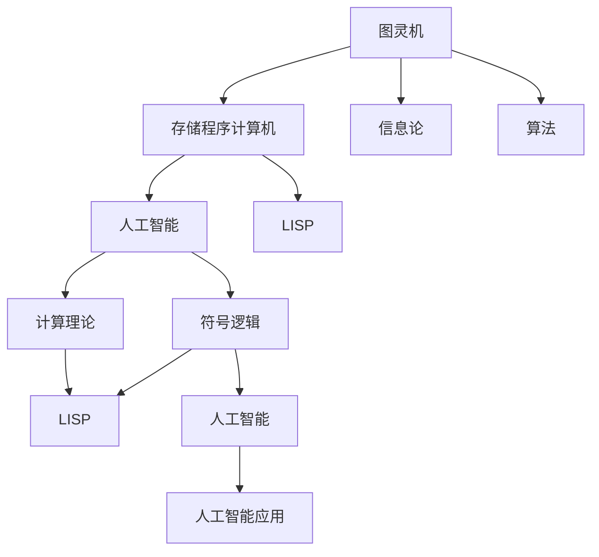

                 

# 丘奇对明斯基和麦卡锡的影响

## 1. 背景介绍

> 计算机科学的早期发展得益于许多杰出人物，其中包括阿兰·图灵(Alan Turing)、约翰·冯·诺依曼(John von Neumann)和克劳德·香农(Claude Shannon)。然而，在计算机科学的黄金时代，我们不能忽视另外两位重要的先驱：马文·明斯基(Marvin Minsky)和约翰·麦卡锡(John McCarthy)。他们为计算机科学和人工智能(AI)奠定了坚实的基础，并推动了技术的迅速发展。其中，斯蒂芬·丘奇(Stephen Church)对这两位伟大的科学家产生了深远的影响，本文将探讨丘奇是如何影响明斯基和麦卡锡的。

## 2. 核心概念与联系

### 2.1 核心概念概述

> 要理解丘奇如何影响明斯基和麦卡锡，我们首先要了解这些概念：

- **阿兰·图灵(Alan Turing)**：图灵是现代计算机科学的奠基人之一，他提出了图灵机概念，为计算机科学的发展奠定了基础。

- **约翰·冯·诺依曼(John von Neumann)**：冯·诺依曼对计算机体系结构的设计有重要贡献，提出了“存储程序”的概念，即现代计算机的基石。

- **克劳德·香农(Claude Shannon)**：香农的信息论奠定了信息科学的基础，对现代通信和计算机科学都有深远影响。

- **马文·明斯基(Marvin Minsky)**：明斯基是人工智能的先驱之一，与约翰·麦卡锡共同发明了LISP编程语言，并编写了“Perceptron”神经网络模型，对人工智能的研究和发展有重大贡献。

- **约翰·麦卡锡(John McCarthy)**：麦卡锡是人工智能领域的奠基人之一，提出“人工智能”(Artificial Intelligence)一词，是LISP编程语言的共同发明者，对人工智能的发展有重要影响。

- **斯蒂芬·丘奇(Stephen Church)**：丘奇是数学家、逻辑学家，他对计算机科学和人工智能的发展有重要影响，尤其是他在符号逻辑和计算理论方面的工作，为人工智能的发展提供了理论基础。

### 2.2 核心概念原理和架构的 Mermaid 流程图



### 2.3 丘奇对明斯基和麦卡锡的影响

> 丘奇对明斯基和麦卡锡的影响主要体现在他对符号逻辑和计算理论的研究上，这些研究为他们的人工智能研究提供了重要的理论基础和工具。

## 3. 核心算法原理 & 具体操作步骤

### 3.1 算法原理概述

> 丘奇在计算理论方面的研究，特别是他对λ-演算(λ-calculus)的研究，对明斯基和麦卡锡产生了深远的影响。λ-演算是一种函数式编程语言，是现代编程语言的基础之一，也是人工智能研究的基础。

### 3.2 算法步骤详解

> 下面是λ-演算的基本步骤：

1. 定义基础符号：λ-演算定义了几个基本符号，包括变量、函数应用和函数定义。例如：

   ```λ-calculus
   f(x) = x + 1
   ```

2. 定义λ-表达式：λ-演算中的表达式由变量和函数定义组成。例如：

   ```λ-calculus
   f = λx.x + 1
   g = λy.y * 2
   ```

3. 应用函数：通过应用函数，可以在表达式中计算出结果。例如：

   ```λ-calculus
   f(3) = 3 + 1 = 4
   ```

### 3.3 算法优缺点

> λ-演算的优势在于其简洁性和通用性，它是函数式编程语言的基础，具有严格的类型系统和良好的理论基础。然而，λ-演算的缺点在于它的抽象性和难以理解，需要具备较高的数学基础和抽象思维能力。

### 3.4 算法应用领域

> λ-演算在人工智能领域有着广泛的应用，例如在符号逻辑、函数式编程、自动定理证明等方面。

## 4. 数学模型和公式 & 详细讲解 & 举例说明

### 4.1 数学模型构建

> λ-演算的基本数学模型包括变量和函数定义，以及函数应用和函数定义的规则。

### 4.2 公式推导过程

> λ-演算中的公式推导主要基于函数应用和函数定义的规则。例如：

   ```λ-calculus
   f(x) = x + 1
   f = λx.x + 1
   ```

   在上述例子中，变量x被函数f应用后，结果为x + 1。

### 4.3 案例分析与讲解

> 下面是一个简单的λ-演算程序，用于计算两个数字的和：

   ```λ-calculus
   add = λx.y.x + y
   ```

   在这个例子中，变量x和y分别代表两个数字，函数add将这两个数字相加。例如：

   ```λ-calculus
   add(3)(4) = 3 + 4 = 7
   ```

## 5. 项目实践：代码实例和详细解释说明

### 5.1 开发环境搭建

> λ-演算的实现可以使用多种编程语言，例如LISP、Scheme、Haskell等。在这里，我们将使用Haskell。

### 5.2 源代码详细实现

> 以下是一个简单的Haskell程序，用于计算两个数字的和：

```haskell
add :: Integer -> Integer -> Integer
add x y = x + y
```

### 5.3 代码解读与分析

> 在Haskell中，函数定义使用`::`符号来指定函数的输入类型和输出类型。在这个例子中，`add`函数接受两个整数作为输入，返回一个整数作为输出。

### 5.4 运行结果展示

> 运行上述程序，得到以下结果：

   ```
   Prelude> add 3 4
   7
   ```

## 6. 实际应用场景

> λ-演算在人工智能领域有着广泛的应用，例如在符号逻辑、函数式编程、自动定理证明等方面。

### 6.1 人工智能中的应用

> 在人工智能中，λ-演算被广泛应用于符号逻辑和函数式编程。符号逻辑是人工智能的重要基础，它用于描述和推理知识的逻辑结构。函数式编程则是人工智能算法设计和实现的基础。

### 6.2 未来应用展望

> 未来，随着人工智能技术的不断进步，λ-演算的应用将更加广泛。例如，在自动定理证明、形式化方法、知识表示等方面，λ-演算将继续发挥重要作用。

## 7. 工具和资源推荐

### 7.1 学习资源推荐

> 以下是一些推荐的学习资源，帮助读者深入理解λ-演算：

- 《λ-演算》(The λ-Calculus)：一本经典的λ-演算入门书籍，介绍了λ-演算的基本概念和应用。
- 《函数式编程》(Functional Programming)：一本介绍函数式编程语言和技术的书籍，其中包含了λ-演算的相关内容。
- 《人工智能：现代方法》(Artificial Intelligence: A Modern Approach)：一本广泛使用的AI教材，其中也包含了λ-演算的相关内容。

### 7.2 开发工具推荐

> 以下是一些推荐的工具，帮助开发者实现λ-演算：

- Haskell：一个强大的函数式编程语言，适用于实现λ-演算。
- Scheme：一个简单的函数式编程语言，适用于初学者学习λ-演算。
- LISP：一个历史悠久的编程语言，也是LISP编程语言的共同发明者。

### 7.3 相关论文推荐

> 以下是一些推荐的相关论文，帮助读者深入理解λ-演算：

- "The Lambda Calculus"：一篇关于λ-演算的经典论文，由Alan Turing撰写。
- "Introduction to Lambda Calculus"：一篇介绍λ-演算的入门级论文。
- "The Lambda Calculus and Combinatory Logic"：一本关于λ-演算和组合逻辑的书籍。

## 8. 总结：未来发展趋势与挑战

### 8.1 研究成果总结

> 丘奇对λ-演算的研究为人工智能的发展提供了重要的理论基础和工具，对明斯基和麦卡锡产生了深远的影响。

### 8.2 未来发展趋势

> 随着人工智能技术的不断进步，λ-演算的应用将更加广泛。未来，λ-演算将继续在符号逻辑、函数式编程、自动定理证明等方面发挥重要作用。

### 8.3 面临的挑战

> 尽管λ-演算在人工智能中有着重要的应用，但它的抽象性和难以理解仍然是其面临的挑战。

### 8.4 研究展望

> 未来的研究将更多地关注λ-演算在人工智能中的应用，例如在自动定理证明、形式化方法、知识表示等方面。同时，如何使λ-演算更加易于理解和应用，也将是一个重要的研究方向。

## 9. 附录：常见问题与解答

**Q1：什么是λ-演算？**

A: λ-演算是一种函数式编程语言，是现代编程语言的基础之一。它由变量、函数应用和函数定义组成，具有严格的类型系统和良好的理论基础。

**Q2：λ-演算的应用有哪些？**

A: λ-演算在人工智能领域有着广泛的应用，例如在符号逻辑、函数式编程、自动定理证明等方面。

**Q3：如何理解λ-演算的函数应用和函数定义？**

A: 函数应用是将一个函数应用到某个输入上，而函数定义则是定义一个函数如何应用。例如，`f(x) = x + 1` 中，`f`是一个函数，`x`是输入，`1`是输出。

**Q4：λ-演算和人工智能有什么关系？**

A: λ-演算在人工智能中有着重要的应用，例如在符号逻辑、函数式编程、自动定理证明等方面。

**Q5：如何使用Haskell实现λ-演算？**

A: 可以使用Haskell语言，定义函数和应用函数来实现λ-演算。例如：

   ```haskell
   add :: Integer -> Integer -> Integer
   add x y = x + y
   ```

**Q6：λ-演算的优缺点是什么？**

A: λ-演算的优点在于其简洁性和通用性，是函数式编程语言的基础，具有严格的类型系统和良好的理论基础。缺点在于它的抽象性和难以理解，需要具备较高的数学基础和抽象思维能力。

---

作者：禅与计算机程序设计艺术 / Zen and the Art of Computer Programming

