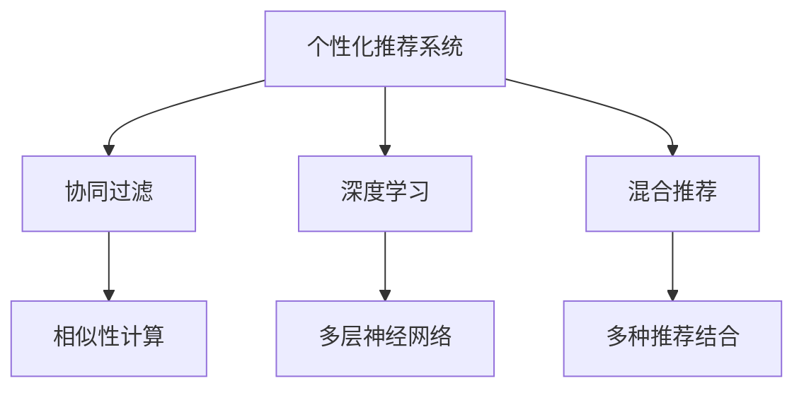

                 

## 1. 背景介绍

### 1.1 问题由来

随着互联网技术的迅速发展，信息量爆炸式增长，用户面临着前所未有的海量信息。如何从海量的数据中快速、准确地找到他们真正感兴趣的内容，成为了一个亟待解决的问题。个性化推荐系统应运而生，通过分析用户的行为数据，预测其偏好，自动推送个性化的内容，极大地提升了用户的信息获取效率和满意度。

从早期的协同过滤到深度学习范式，个性化推荐系统已经在电商、社交网络、在线媒体等多个领域得到了广泛应用，并取得了显著的成功。例如，亚马逊的推荐系统能够根据用户的历史浏览记录，实时推荐用户可能感兴趣的商品；Netflix通过推荐算法为用户推荐电影、电视剧；抖音根据用户的互动行为，推送个性化的视频内容等。

尽管如此，个性化推荐系统在实际应用中依然面临着诸多技术挑战。本文将从核心概念、算法原理、数学模型、项目实践、应用场景等多个方面，全面剖析个性化推荐系统的技术挑战，并给出相应的解决方案。

## 2. 核心概念与联系

### 2.1 核心概念概述

个性化推荐系统是一个多学科交叉的复杂系统，涉及机器学习、数据挖掘、自然语言处理、信号处理等多个领域。本节将介绍几个关键概念，帮助理解个性化推荐系统的核心原理。

- **个性化推荐系统**：通过分析用户的历史行为数据，预测其兴趣偏好，自动推荐个性化内容。
- **协同过滤**：一种推荐算法，通过用户之间的相似性，找到未交互的用户，预测其对某一内容的偏好。
- **深度学习**：一种机器学习算法，通过构建多层神经网络，学习数据的高级特征，实现更精确的预测。
- **混合推荐**：结合多种推荐方法，如协同过滤、深度学习、内容推荐等，充分发挥各自的优势，实现更全面、准确的推荐。

这些概念之间的逻辑关系可以通过以下Mermaid流程图来展示：



这个流程图展示了个性化推荐系统的核心概念及其之间的关系：

1. 个性化推荐系统通过协同过滤、深度学习和混合推荐等算法，预测用户对内容的偏好。
2. 协同过滤计算用户之间的相似性，发现相似用户和未交互用户。
3. 深度学习通过多层神经网络，学习数据的高维特征，实现更精确的预测。
4. 混合推荐结合多种推荐方法，提升推荐的全面性和准确性。

## 3. 核心算法原理 & 具体操作步骤
### 3.1 算法原理概述

个性化推荐系统的核心原理可以概括为以下几步：

1. **数据收集**：从用户行为中收集相关数据，如浏览记录、购买记录、评分记录等。
2. **特征提取**：将用户行为数据转换成模型可以处理的特征向量。
3. **模型训练**：在标注数据上训练推荐模型，如协同过滤、深度学习等。
4. **预测推荐**：使用训练好的模型，对新数据进行预测，生成推荐结果。
5. **评估反馈**：收集用户对推荐结果的反馈，不断调整模型参数，提升推荐效果。

这些步骤通过循环迭代，不断优化模型，最终实现高质量的个性化推荐。

### 3.2 算法步骤详解

个性化推荐系统的具体实现可以分为以下几个关键步骤：

**Step 1: 数据收集**

- 数据来源：从用户的各种行为中收集相关数据，如浏览记录、购买记录、评分记录等。
- 数据格式：将数据转换为向量形式，便于模型处理。例如，将浏览记录转换为向量表示，每个维度表示一个特征，如时间戳、浏览次数等。

**Step 2: 特征提取**

- 特征选择：选择对用户行为有重要影响的特征，如用户ID、商品ID、时间戳、浏览次数等。
- 特征编码：将选择的特征转换为数值形式，如One-Hot编码、稀疏矩阵等。
- 特征归一化：对特征向量进行归一化处理，使其具有相同的量级，避免某些特征对模型产生过大的影响。

**Step 3: 模型训练**

- 算法选择：根据任务特点选择合适的推荐算法，如协同过滤、深度学习等。
- 模型优化：使用优化算法，如梯度下降、Adam等，最小化损失函数，训练推荐模型。
- 超参数调优：调整模型的超参数，如学习率、批量大小、迭代轮数等，找到最优的模型配置。

**Step 4: 预测推荐**

- 输入数据：将新用户的特征向量输入训练好的模型，生成推荐结果。
- 推荐排序：根据推荐结果的分数，对推荐内容进行排序，生成推荐列表。
- 实时推荐：在实时场景中，根据用户行为数据，动态生成推荐结果。

**Step 5: 评估反馈**

- 用户反馈：收集用户对推荐结果的反馈，如点击率、购买率等。
- 模型评估：使用评估指标，如准确率、召回率、F1-score等，评估模型的推荐效果。
- 反馈调整：根据用户反馈，调整模型参数，不断提升推荐效果。

以上是个性化推荐系统的基本流程，通过这些步骤，可以构建高质量的推荐系统。

### 3.3 算法优缺点

个性化推荐系统有以下优点：

1. **提升用户满意度**：通过个性化推荐，用户可以更快地找到感兴趣的内容，提高信息获取效率和满意度。
2. **增加商业价值**：推荐系统能够帮助商家提升用户转化率和留存率，增加商业收益。
3. **减少人工干预**：自动化推荐系统减少了人工干预，降低了运营成本。

但同时也存在以下缺点：

1. **数据隐私问题**：用户的行为数据涉及隐私，收集和处理过程中需要遵守相关法律法规，保护用户隐私。
2. **冷启动问题**：对于新用户或新内容，缺乏历史数据，难以进行准确的推荐。
3. **过度个性化**：过度个性化的推荐可能导致信息茧房，让用户只能看到自己喜欢的内容，丧失了探索新事物的机会。
4. **计算成本高**：推荐系统需要处理大量数据，计算复杂度高，对硬件资源要求较高。

## 4. 数学模型和公式 & 详细讲解 & 举例说明

### 4.1 数学模型构建

个性化推荐系统的数学模型可以简化为以下形式：

$$
\hat{y} = f(x; \theta)
$$

其中，$x$ 表示用户的特征向量，$y$ 表示推荐的物品，$f$ 表示推荐函数，$\theta$ 表示模型的参数。推荐函数 $f$ 可以是协同过滤、深度学习等不同算法，每个算法的具体实现形式也不同。

### 4.2 公式推导过程

以协同过滤算法为例，其推荐函数可以表示为：

$$
\hat{y} = \frac{\sum_{i=1}^N \alpha_i x_i x_j}{\sqrt{\sum_{i=1}^N x_i^2}}
$$

其中，$N$ 表示用户总数，$x_i$ 和 $x_j$ 表示用户 $i$ 和 $j$ 的特征向量，$\alpha_i$ 表示用户 $i$ 与用户 $j$ 的相似度系数。该公式的推导基于用户之间的相似性，通过计算相似度系数 $\alpha_i$，找到未交互用户 $j$，从而推荐相似用户的物品 $y$。

### 4.3 案例分析与讲解

以Netflix推荐系统为例，其基于协同过滤和深度学习相结合的方式，实现个性化推荐。Netflix首先收集用户的历史观看记录，将其转换为向量形式。然后，使用协同过滤算法计算用户之间的相似度，找到未交互用户，推荐相似用户的电影。对于深度学习部分，Netflix使用卷积神经网络（CNN）和循环神经网络（RNN），学习用户对不同电影的偏好，生成推荐结果。Netflix还引入了混合推荐、分层采样等技术，进一步提升了推荐效果。

## 5. 项目实践：代码实例和详细解释说明
### 5.1 开发环境搭建

在进行个性化推荐系统开发时，需要配置好开发环境，以便进行模型训练和测试。

1. **安装Python**：
   - 安装Python 3.6及以上版本。
   - 使用pip安装必要的库，如numpy、pandas、scikit-learn等。

2. **安装TensorFlow或PyTorch**：
   - 根据项目需求，选择TensorFlow或PyTorch作为深度学习框架。
   - 安装相应的GPU驱动和CUDA库。

3. **安装TensorBoard或Weights & Biases**：
   - TensorBoard和Weights & Biases都是用于模型训练和可视化的工具。
   - TensorBoard集成在TensorFlow中，Weights & Biases则支持TensorFlow和PyTorch。

### 5.2 源代码详细实现

以下是一个基于深度学习的个性化推荐系统的示例代码，使用TensorFlow实现：

```python
import tensorflow as tf
import pandas as pd
import numpy as np

# 数据预处理
data = pd.read_csv('user_based_recomm.csv', delimiter=',')
user_features = data[['user_id', 'item_id', 'rating']] # 用户ID、物品ID、评分

# 特征编码
user_features = pd.get_dummies(user_features, columns=['user_id', 'item_id'], prefix=['user_', 'item_'])
user_features = np.array(user_features.drop('rating', axis=1)) # 去除评分列

# 模型构建
model = tf.keras.Sequential([
    tf.keras.layers.Dense(128, activation='relu', input_shape=(len(user_features[0]),)),
    tf.keras.layers.Dense(64, activation='relu'),
    tf.keras.layers.Dense(1, activation='sigmoid')
])

# 模型编译
model.compile(optimizer='adam', loss='binary_crossentropy', metrics=['accuracy'])

# 模型训练
model.fit(user_features, data['rating'], epochs=10, batch_size=32, validation_split=0.2)

# 推荐预测
test_features = pd.read_csv('test_user_based_recomm.csv', delimiter=',')
test_features = pd.get_dummies(test_features, columns=['user_id', 'item_id'], prefix=['user_', 'item_'])
test_features = np.array(test_features.drop('rating', axis=1))

predictions = model.predict(test_features)
```

### 5.3 代码解读与分析

以下是代码中关键部分的详细解读：

**数据预处理**：
- 从CSV文件中读取数据。
- 选择用户ID、物品ID和评分列，将其转换为特征向量。
- 使用One-Hot编码将用户ID和物品ID转换成数值形式。
- 去除评分列，只保留特征向量。

**模型构建**：
- 使用TensorFlow构建深度学习模型，包含3个全连接层。
- 第一层和第二层分别有128和64个神经元，使用ReLU激活函数。
- 输出层只有一个神经元，使用sigmoid激活函数，输出0到1之间的概率值。

**模型编译**：
- 使用adam优化器和二进制交叉熵损失函数，训练模型。
- 设置评价指标为准确率。

**模型训练**：
- 在训练集上训练模型，设置迭代轮数为10，批量大小为32。
- 设置验证集比例为20%，用于验证模型的训练效果。

**推荐预测**：
- 读取测试集数据，使用One-Hot编码将用户ID和物品ID转换为特征向量。
- 去除评分列，只保留特征向量。
- 使用训练好的模型进行预测，生成推荐结果。

## 6. 实际应用场景

### 6.1 电商平台推荐

电商平台如亚马逊、京东等，通过个性化推荐系统，为用户推荐商品。用户可以通过浏览记录、评分记录等行为数据，获得个性化的商品推荐，提高购物体验和转化率。

在实际应用中，电商平台可以根据用户的历史购买记录，结合当前浏览行为，实时生成推荐结果。例如，用户浏览某品牌鞋时，系统会推荐该品牌的其他商品，甚至推荐相似品牌或类型的商品。

### 6.2 社交网络推荐

社交网络如Facebook、Twitter等，通过个性化推荐系统，为用户推荐内容。用户可以通过点赞、分享、评论等行为数据，获得个性化的内容推荐，提高信息获取效率。

在实际应用中，社交网络可以根据用户的兴趣爱好，推荐相关的内容。例如，用户关注某类话题时，系统会推荐该话题下的其他内容，甚至推荐相似话题或作者的内容。

### 6.3 在线媒体推荐

在线媒体如YouTube、Netflix等，通过个性化推荐系统，为用户推荐视频内容。用户可以通过观看记录、评分记录等行为数据，获得个性化的视频推荐，提高观影体验。

在实际应用中，在线媒体可以根据用户的观看历史，推荐相似的视频内容。例如，用户观看某部影片时，系统会推荐该影片的导演、演员、同类影片等。

### 6.4 未来应用展望

未来，个性化推荐系统将继续在电商、社交网络、在线媒体等领域发挥重要作用。同时，随着技术的发展，推荐系统还将拓展到更多场景，如智能家居、智慧城市等。

在电商领域，推荐系统可以结合物联网设备，实现基于用户行为的智能推荐。例如，根据用户的家居环境，推荐合适的家居产品，提高生活质量。

在智慧城市领域，推荐系统可以结合交通数据、环境数据，为用户推荐最佳出行路线，优化城市交通管理。

## 7. 工具和资源推荐

### 7.1 学习资源推荐

为了帮助开发者系统掌握个性化推荐系统的技术，这里推荐一些优质的学习资源：

1. 《推荐系统实战》：介绍推荐系统的基本原理和实际应用，涵盖协同过滤、深度学习、混合推荐等算法。
2. 《Deep Learning for Recommendations》：讲解深度学习在推荐系统中的应用，涵盖神经网络、卷积神经网络、循环神经网络等。
3. 《Practical Recommender Systems》：讲解推荐系统的工程实现，涵盖推荐算法、特征工程、模型训练等。
4. Kaggle：提供丰富的推荐系统竞赛数据集，帮助开发者实践和验证推荐算法。

通过对这些资源的学习实践，相信你一定能够快速掌握个性化推荐系统的精髓，并用于解决实际的推荐问题。

### 7.2 开发工具推荐

为了提高开发效率，以下工具推荐用于个性化推荐系统的开发：

1. TensorFlow：基于数据流图的深度学习框架，支持多种深度学习算法，适用于推荐系统的构建。
2. PyTorch：基于动态图和静态图的深度学习框架，支持快速的模型构建和训练。
3. scikit-learn：提供简单易用的机器学习算法，适用于特征提取和模型训练。
4. Weights & Biases：用于模型训练和可视化的工具，提供丰富的图表和分析功能。
5. TensorBoard：用于模型训练和可视化的工具，支持实时的数据展示和分析。

合理利用这些工具，可以显著提升个性化推荐系统的开发效率，加快创新迭代的步伐。

### 7.3 相关论文推荐

个性化推荐系统的研究源于学界的持续努力。以下是几篇奠基性的相关论文，推荐阅读：

1. Contextual Bandits: Exploration, Exploitation, and Theory：介绍上下文感知推荐算法，用于解决个性化推荐中的探索与利用问题。
2. Collaborative Filtering for Implicit Feedback Datasets：介绍协同过滤算法，用于处理隐式反馈数据集，提升推荐效果。
3. Factorization Machines for Predictive Text Categorization and Recommendations：介绍因子分解机算法，用于处理高维稀疏数据，提升推荐效果。
4. Wide & Deep Learning for Recommender Systems：介绍宽深学习模型，用于结合宽特征和深度学习，提升推荐效果。
5. Top-K Recommendation Systems：介绍Top-K推荐算法，用于解决推荐结果的可解释性和多样性问题。

这些论文代表了个性化推荐系统的发展脉络。通过学习这些前沿成果，可以帮助研究者把握学科前进方向，激发更多的创新灵感。

## 8. 总结：未来发展趋势与挑战

### 8.1 总结

本文对个性化推荐系统的技术挑战进行了全面系统的介绍。首先阐述了个性化推荐系统的背景和意义，明确了推荐系统在提升用户满意度、增加商业价值等方面的独特价值。其次，从核心概念、算法原理、数学模型、项目实践、应用场景等多个方面，详细讲解了个性化推荐系统的技术挑战，并给出相应的解决方案。

通过本文的系统梳理，可以看到，个性化推荐系统是一个多学科交叉的复杂系统，涉及数据收集、特征提取、模型训练、预测推荐、评估反馈等多个环节。开发者需要综合考虑算法的复杂性、计算资源的需求、用户隐私的保障等各个方面，才能构建高质量的推荐系统。

### 8.2 未来发展趋势

展望未来，个性化推荐系统将继续在电商、社交网络、在线媒体等领域发挥重要作用。同时，随着技术的发展，推荐系统还将拓展到更多场景，如智能家居、智慧城市等。

在电商领域，推荐系统可以结合物联网设备，实现基于用户行为的智能推荐。例如，根据用户的家居环境，推荐合适的家居产品，提高生活质量。

在智慧城市领域，推荐系统可以结合交通数据、环境数据，为用户推荐最佳出行路线，优化城市交通管理。

### 8.3 面临的挑战

尽管个性化推荐系统已经取得了显著的成功，但在迈向更加智能化、普适化应用的过程中，它仍面临着诸多挑战：

1. **数据隐私问题**：用户的行为数据涉及隐私，收集和处理过程中需要遵守相关法律法规，保护用户隐私。
2. **冷启动问题**：对于新用户或新内容，缺乏历史数据，难以进行准确的推荐。
3. **过度个性化**：过度个性化的推荐可能导致信息茧房，让用户只能看到自己喜欢的内容，丧失了探索新事物的机会。
4. **计算成本高**：推荐系统需要处理大量数据，计算复杂度高，对硬件资源要求较高。

### 8.4 未来突破

面对个性化推荐系统所面临的挑战，未来的研究需要在以下几个方面寻求新的突破：

1. **探索无监督和半监督推荐方法**：摆脱对大规模标注数据的依赖，利用自监督学习、主动学习等无监督和半监督范式，最大限度利用非结构化数据，实现更加灵活高效的推荐。
2. **研究参数高效和计算高效的推荐范式**：开发更加参数高效的推荐方法，在固定大部分预训练参数的同时，只更新极少量的任务相关参数。同时优化推荐模型的计算图，减少前向传播和反向传播的资源消耗，实现更加轻量级、实时性的部署。
3. **融合因果和对比学习范式**：通过引入因果推断和对比学习思想，增强推荐模型建立稳定因果关系的能力，学习更加普适、鲁棒的用户行为模式，从而提升推荐泛化性和抗干扰能力。
4. **引入更多先验知识**：将符号化的先验知识，如知识图谱、逻辑规则等，与神经网络模型进行巧妙融合，引导推荐过程学习更准确、合理的用户行为模式。同时加强不同模态数据的整合，实现视觉、语音等多模态信息与文本信息的协同建模。
5. **结合因果分析和博弈论工具**：将因果分析方法引入推荐模型，识别出模型决策的关键特征，增强输出解释的因果性和逻辑性。借助博弈论工具刻画人机交互过程，主动探索并规避模型的脆弱点，提高系统稳定性。
6. **纳入伦理道德约束**：在推荐模型训练目标中引入伦理导向的评估指标，过滤和惩罚有害的输出倾向。同时加强人工干预和审核，建立推荐模型的监管机制，确保输出符合人类价值观和伦理道德。

这些研究方向的探索，必将引领个性化推荐系统技术迈向更高的台阶，为构建安全、可靠、可解释、可控的智能系统铺平道路。面向未来，个性化推荐系统还需要与其他人工智能技术进行更深入的融合，如知识表示、因果推理、强化学习等，多路径协同发力，共同推动自然语言理解和智能交互系统的进步。

## 9. 附录：常见问题与解答

**Q1：个性化推荐系统如何避免过拟合问题？**

A: 个性化推荐系统面临过拟合问题，通常可以采取以下几种方法来解决：

1. **数据增强**：通过数据增强技术，如回译、近义替换等，扩充训练数据，增加模型鲁棒性。
2. **正则化**：使用L2正则、Dropout等方法，防止模型过度拟合训练数据。
3. **早期停止**：在验证集上设置停止条件，避免模型过度拟合。
4. **模型简化**：简化模型结构，减少神经元数量，降低过拟合风险。
5. **多模型集成**：构建多个推荐模型，取平均或加权平均结果，避免单模型过拟合。

这些方法在实际应用中需要根据具体情况进行选择和调整，以确保推荐模型的泛化性能。

**Q2：推荐系统如何进行用户行为建模？**

A: 推荐系统通常使用协同过滤、深度学习等方法，对用户行为进行建模。以下是常见的用户行为建模方法：

1. **协同过滤**：通过计算用户之间的相似度，找到未交互用户，从而推荐相似用户的物品。
2. **深度学习**：使用多层神经网络，学习用户对不同物品的偏好，生成推荐结果。
3. **混合推荐**：结合协同过滤和深度学习，利用各自的优势，提升推荐效果。
4. **矩阵分解**：使用矩阵分解方法，如奇异值分解（SVD），对用户-物品矩阵进行低维表示，生成推荐结果。
5. **多模型集成**：构建多个推荐模型，取平均或加权平均结果，提升推荐效果。

这些方法在实际应用中需要根据数据特点进行选择和调整，以确保推荐模型的泛化性能。

**Q3：推荐系统如何处理冷启动问题？**

A: 冷启动问题是推荐系统面临的常见挑战之一，以下是几种常见的处理冷启动问题的方法：

1. **基于内容的推荐**：使用物品的特征向量，根据物品属性进行推荐。
2. **基于学习的推荐**：使用推荐模型，通过学习用户的历史行为，进行推荐。
3. **基于协同过滤的推荐**：通过计算用户之间的相似度，找到未交互用户，从而推荐相似用户的物品。
4. **基于混合的推荐**：结合多种推荐方法，利用各自的优势，提升推荐效果。
5. **基于用户画像的推荐**：根据用户的画像信息，进行推荐。

这些方法在实际应用中需要根据具体情况进行选择和调整，以确保推荐模型的泛化性能。

**Q4：推荐系统如何处理数据稀疏性问题？**

A: 推荐系统面临数据稀疏性问题，以下是几种常见的处理方法：

1. **矩阵分解**：使用矩阵分解方法，如奇异值分解（SVD），对用户-物品矩阵进行低维表示，生成推荐结果。
2. **基于内容的推荐**：使用物品的特征向量，根据物品属性进行推荐。
3. **基于学习的推荐**：使用推荐模型，通过学习用户的历史行为，进行推荐。
4. **基于协同过滤的推荐**：通过计算用户之间的相似度，找到未交互用户，从而推荐相似用户的物品。
5. **基于混合的推荐**：结合多种推荐方法，利用各自的优势，提升推荐效果。

这些方法在实际应用中需要根据具体情况进行选择和调整，以确保推荐模型的泛化性能。

**Q5：推荐系统如何评估推荐效果？**

A: 推荐系统通常使用以下指标来评估推荐效果：

1. **准确率**：推荐结果与用户真实偏好的匹配程度。
2. **召回率**：推荐结果中包含用户真实偏好的比例。
3. **F1-score**：综合考虑准确率和召回率，评估推荐效果。
4. **用户满意度**：通过用户反馈，评估推荐系统对用户的满意度。
5. **点击率**：推荐结果被用户点击的比例。

这些指标在实际应用中需要根据具体情况进行选择和调整，以确保推荐系统的性能。

---

作者：禅与计算机程序设计艺术 / Zen and the Art of Computer Programming

