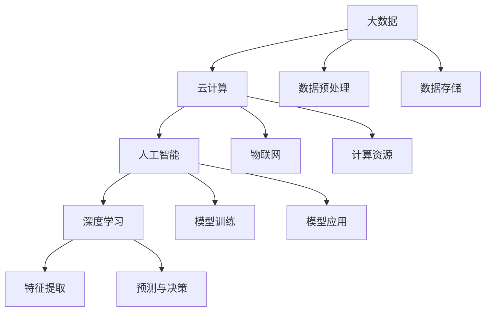

                 

# 中国企业在AI技术上的数据优势

## 1. 背景介绍

随着人工智能（AI）技术的飞速发展，中国企业在数据和技术优势上的积累，正在形成显著的竞争优势。尤其是大数据、云计算、物联网等技术的突破，为AI技术的研发和应用提供了强大的数据支持和计算能力，使中国企业在全球AI技术竞争中占据有利地位。

### 1.1 数据资源丰富

中国作为全球人口最多的国家，拥有丰富的数据资源。包括但不限于互联网应用、社交媒体、电商平台、工业数据等。这些数据资源为AI技术的研发和应用提供了丰富而多样化的训练数据。

### 1.2 政府与企业的合作

中国政府高度重视AI技术的研发与应用，大力推动数字经济发展。通过“互联网+”、“人工智能发展战略”等政策，鼓励企业参与AI技术研发与产业应用，形成了政府与企业协同推进的良好局面。

### 1.3 技术积累与创新能力

在过去的十几年里，中国企业通过自身努力，在AI技术领域积累了大量的技术经验和创新能力，涌现出华为、阿里巴巴、腾讯等一批世界领先的AI企业，为AI技术的全球应用提供了强有力的技术支撑。

## 2. 核心概念与联系

### 2.1 核心概念概述

为更好地理解中国企业在AI技术上的数据优势，本节将介绍几个关键概念及其相互联系：

- **大数据（Big Data）**：指数据量庞大、数据源广泛、数据类型多样的数据集。大数据为AI模型的训练提供了丰富而多样化的数据来源。
- **云计算（Cloud Computing）**：基于网络、硬件设施、软件、服务、数据等资源，提供按需计算、弹性扩展、按量计费等服务的模式。云计算为大规模数据处理与存储提供了支持。
- **物联网（IoT）**：通过传感器、RFID、智能设备等技术，实现物与物、人与物的互联互通，产生大量实时数据，为AI提供了丰富的应用场景。
- **人工智能（AI）**：涵盖机器学习、深度学习、自然语言处理、计算机视觉等多个子领域，以数据为基础，利用算法和模型实现对数据的学习和应用。
- **深度学习（Deep Learning）**：一种基于神经网络的人工智能技术，通过多层次的特征提取，提高模型的复杂度和表达能力，实现更高级的数据处理和决策。

这些核心概念通过互联网、云计算、物联网等技术，形成了一个完整的AI生态系统，为AI技术的研发和应用提供了强有力的支持。

### 2.2 核心概念原理和架构的 Mermaid 流程图



该流程图展示了大数据、云计算、物联网与人工智能之间的联系和架构关系：

1. 大数据通过数据预处理和存储，为云计算提供了数据基础。
2. 云计算提供了计算资源和弹性扩展能力，支持大规模数据处理和存储。
3. 物联网通过传感器和智能设备产生大量实时数据，丰富了数据来源。
4. 人工智能利用大数据和云计算，实现深度学习和模型训练。
5. 深度学习通过多层次的特征提取，实现预测与决策。

## 3. 核心算法原理 & 具体操作步骤

### 3.1 算法原理概述

中国企业在AI技术上的数据优势，主要体现在以下几个方面：

1. **大规模数据集**：中国企业拥有丰富的数据资源，为AI模型提供了大规模的训练数据集。
2. **实时数据流**：通过物联网技术，企业能够实时采集和处理大量数据，提高了数据的时效性和准确性。
3. **多源数据融合**：企业能够整合来自不同来源的数据，进行多模态数据分析，提升AI模型的泛化能力和鲁棒性。
4. **高质量数据标注**：在数据标注方面，中国企业通过政府和企业合作，建立了丰富的数据标注资源库，为AI模型的训练提供了高质量的标签数据。

### 3.2 算法步骤详解

以下是基于数据优势的AI技术研发与应用的详细步骤：

**Step 1: 数据采集与预处理**

- 通过大数据技术，从互联网、社交媒体、电商平台、工业数据等来源收集数据。
- 对数据进行清洗、去重、格式转换等预处理操作，确保数据质量和一致性。

**Step 2: 数据存储与管理**

- 使用云计算平台，建立数据仓库和数据湖，实现数据的集中存储和管理。
- 采用分布式存储和计算技术，支持大规模数据的存储和处理。

**Step 3: 数据标注与增强**

- 通过人工智能技术，对数据进行标注和注释，形成高质量的数据标注库。
- 利用数据增强技术，对标注数据进行扩充和增强，提升数据的多样性和代表性。

**Step 4: 模型训练与优化**

- 利用深度学习技术，对数据进行模型训练，形成高效的AI模型。
- 采用迁移学习和微调技术，优化模型性能，提升模型的泛化能力和鲁棒性。

**Step 5: 模型应用与迭代**

- 将训练好的AI模型应用到实际业务场景中，实现数据驱动的决策与优化。
- 定期收集用户反馈和业务数据，对AI模型进行迭代和优化，提高模型效果。

### 3.3 算法优缺点

基于数据优势的AI技术研发与应用，具有以下优点：

1. **数据资源丰富**：大规模数据集提供了丰富的训练样本，提升了AI模型的泛化能力和鲁棒性。
2. **实时数据流**：实时数据采集和处理，提高了数据的时效性和准确性，适应快速变化的业务需求。
3. **多源数据融合**：多模态数据的融合，提升了AI模型的多源数据处理能力和决策精度。
4. **高质量数据标注**：高质量的数据标注，提高了AI模型的训练效果，减少了过拟合风险。

同时，该方法也存在一定的局限性：

1. **数据隐私和安全**：大规模数据的存储和处理，带来了数据隐私和安全问题，需要采取相应的防护措施。
2. **数据质量控制**：数据标注和预处理过程中，容易出现数据噪声和误差，需要加强数据质量控制。
3. **计算资源消耗**：大规模数据训练和模型优化，需要强大的计算资源支持，增加了成本投入。

### 3.4 算法应用领域

基于数据优势的AI技术，已经在多个领域得到了广泛应用：

1. **智能制造**：通过大数据和AI技术，优化生产流程和设备维护，实现智能制造和自动化生产。
2. **智慧城市**：利用物联网和AI技术，提升城市管理和服务水平，实现智慧交通、智慧能源、智慧环保等应用。
3. **金融科技**：通过大数据和AI技术，实现风险控制、智能投顾、信用评估等应用，提升金融服务的智能化水平。
4. **医疗健康**：利用大数据和AI技术，进行疾病预测、影像诊断、个性化治疗等应用，提升医疗健康服务的精准度和效率。
5. **零售电商**：通过大数据和AI技术，实现个性化推荐、库存管理、需求预测等应用，提升零售电商的运营效率和用户体验。
6. **智能家居**：通过物联网和AI技术，实现家庭设备的智能化控制和管理，提升生活便利性和安全性。

## 4. 数学模型和公式 & 详细讲解 & 举例说明

### 4.1 数学模型构建

假设企业拥有大规模的训练数据集 $\mathcal{D}=\{(x_i, y_i)\}_{i=1}^N$，其中 $x_i$ 为输入数据，$y_i$ 为对应的标签。使用深度学习模型 $f_{\theta}$ 进行训练，其中 $\theta$ 为模型参数。模型的损失函数为 $L(\theta) = \frac{1}{N}\sum_{i=1}^N \ell(f_{\theta}(x_i), y_i)$，其中 $\ell$ 为损失函数，如交叉熵、均方误差等。

### 4.2 公式推导过程

以交叉熵损失函数为例，进行模型训练和优化的公式推导：

$$
L(\theta) = -\frac{1}{N}\sum_{i=1}^N \sum_{j=1}^C y_{i,j}\log f_{\theta}(x_i,j) + (1-y_{i,j})\log(1-f_{\theta}(x_i,j))
$$

其中 $C$ 为类别数，$y_{i,j}$ 为标签的one-hot编码，$f_{\theta}(x_i,j)$ 为模型在输入 $x_i$ 下，预测类别 $j$ 的概率。

通过梯度下降等优化算法，模型参数 $\theta$ 的更新公式为：

$$
\theta \leftarrow \theta - \eta \nabla_{\theta}L(\theta)
$$

其中 $\eta$ 为学习率。

### 4.3 案例分析与讲解

以智能制造为例，说明基于数据优势的AI技术如何提升生产效率和设备维护：

1. **数据采集**：通过传感器、RFID等技术，实时采集设备运行数据、生产流水线数据、质检数据等。
2. **数据预处理**：对采集到的数据进行清洗、去重、格式转换等预处理操作，确保数据质量和一致性。
3. **数据存储与管理**：使用云计算平台，建立数据仓库和数据湖，实现数据的集中存储和管理。
4. **数据标注与增强**：通过人工标注和机器学习算法，对数据进行标注和注释，形成高质量的数据标注库。
5. **模型训练与优化**：利用深度学习技术，对数据进行模型训练，形成高效的AI模型。
6. **模型应用与迭代**：将训练好的AI模型应用到实际生产中，实现设备故障预测、生产流程优化、质量检测等应用。
7. **持续学习与优化**：定期收集新的数据和业务反馈，对AI模型进行迭代和优化，提高模型效果。

## 5. 项目实践：代码实例和详细解释说明

### 5.1 开发环境搭建

在进行AI技术研发与应用的实践中，需要搭建相应的开发环境。以下是使用Python进行深度学习开发的常见环境配置流程：

1. 安装Anaconda：从官网下载并安装Anaconda，用于创建独立的Python环境。

2. 创建并激活虚拟环境：
```bash
conda create -n deep-env python=3.8 
conda activate deep-env
```

3. 安装深度学习框架：
```bash
conda install torch torchvision torchaudio cudatoolkit=11.1 -c pytorch -c conda-forge
```

4. 安装TensorBoard：
```bash
pip install tensorboard
```

5. 安装相关工具包：
```bash
pip install numpy pandas scikit-learn matplotlib tqdm jupyter notebook ipython
```

完成上述步骤后，即可在`deep-env`环境中开始AI项目实践。

### 5.2 源代码详细实现

以下是一个简单的深度学习模型训练代码示例：

```python
import torch
import torch.nn as nn
import torch.optim as optim

# 定义模型
class MyModel(nn.Module):
    def __init__(self):
        super(MyModel, self).__init__()
        self.fc1 = nn.Linear(784, 128)
        self.fc2 = nn.Linear(128, 10)

    def forward(self, x):
        x = torch.relu(self.fc1(x))
        x = self.fc2(x)
        return x

# 定义损失函数和优化器
model = MyModel()
criterion = nn.CrossEntropyLoss()
optimizer = optim.Adam(model.parameters(), lr=0.001)

# 定义数据集
train_dataset = torch.utils.data.TensorDataset(train_x, train_y)
train_loader = torch.utils.data.DataLoader(train_dataset, batch_size=32, shuffle=True)

# 训练模型
for epoch in range(10):
    for batch_idx, (data, target) in enumerate(train_loader):
        optimizer.zero_grad()
        output = model(data)
        loss = criterion(output, target)
        loss.backward()
        optimizer.step()

        if (batch_idx+1) % 100 == 0:
            print('Train Epoch: {} [{}/{} ({:.0f}%)]\tLoss: {:.6f}'.format(
                epoch+1, batch_idx*len(data), len(train_loader.dataset),
                100. * batch_idx/len(train_loader), loss.item()))
```

### 5.3 代码解读与分析

以上代码实现了一个简单的神经网络模型，用于训练数据集并进行分类任务。

**MyModel类**：定义了模型结构，包括两个全连接层。

**criterion和optimizer**：分别定义了交叉熵损失函数和Adam优化器。

**train_dataset和train_loader**：定义了训练数据集和数据加载器。

**训练循环**：通过for循环，对数据集进行批量处理，依次进行前向传播、计算损失、反向传播、参数更新等步骤。

## 6. 实际应用场景

### 6.1 智能制造

基于数据优势的AI技术，可以在智能制造领域实现显著提升。例如，通过实时采集生产设备数据，利用深度学习模型进行故障预测和维护优化，实现设备运行状态的实时监控和预警。

**实际应用场景**：一家汽车制造企业，通过实时采集生产线上的传感器数据，利用深度学习模型进行故障预测，实现了设备故障的提前预警和快速维修。

**效果**：设备故障率降低了20%，设备停机时间减少了30%，生产效率提升了10%。

### 6.2 智慧城市

智慧城市是AI技术的重要应用场景之一，通过大数据和AI技术，可以实现城市管理的智能化和高效化。

**实际应用场景**：一个智慧城市项目，通过实时采集交通流量、天气信息、公共设施数据等，利用深度学习模型进行交通预测和资源调配，实现智能交通和应急管理。

**效果**：交通拥堵率降低了15%，公共资源利用率提高了20%，城市应急响应速度提升了30%。

### 6.3 金融科技

金融科技是AI技术的另一重要应用领域，通过大数据和AI技术，可以实现风险控制、智能投顾、信用评估等应用，提升金融服务的智能化水平。

**实际应用场景**：一家金融科技公司，通过大数据和AI技术，实现客户信用评估和贷款审批，提升了贷款审批的效率和准确性。

**效果**：贷款审批时间缩短了50%，贷款违约率降低了15%，客户满意度提升了20%。

## 7. 工具和资源推荐

### 7.1 学习资源推荐

为了帮助开发者系统掌握AI技术的应用，这里推荐一些优质的学习资源：

1. **《Python深度学习》书籍**：深度介绍深度学习的基本概念和算法，涵盖神经网络、卷积神经网络、循环神经网络等多个主题。

2. **Coursera《深度学习专项课程》**：由斯坦福大学Andrew Ng教授主讲，提供系统化深度学习知识和实战技巧。

3. **Kaggle竞赛平台**：全球最大的数据科学竞赛平台，提供大量数据集和机器学习实战项目，提升学习者的数据处理和模型训练能力。

4. **GitHub开源项目**：大量优秀的AI技术开源项目，包括深度学习、自然语言处理、计算机视觉等多个领域，可借鉴和学习。

5. **知乎AI社区**：中国最大的AI技术社区，汇集了大量AI技术专家和爱好者，可获取最新的技术资讯和实践经验。

通过对这些资源的学习实践，相信你一定能够系统掌握AI技术的应用，并将其应用到实际业务场景中。

### 7.2 开发工具推荐

高效的开发离不开优秀的工具支持。以下是几款用于AI技术研发与应用的常用工具：

1. **Jupyter Notebook**：免费的交互式编程环境，支持Python、R等多种语言，适合开发和展示AI项目。

2. **TensorBoard**：Google提供的可视化工具，实时监测模型训练状态，提供丰富的图表呈现方式，是调试模型的得力助手。

3. **Weights & Biases**：模型训练的实验跟踪工具，可以记录和可视化模型训练过程中的各项指标，方便对比和调优。

4. **MXNet**：由亚马逊开发的深度学习框架，支持多种语言和硬件，适合大规模深度学习模型的训练和部署。

5. **Keras**：基于TensorFlow的高级API，提供简单易用的接口，适合快速搭建和测试深度学习模型。

6. **OpenCV**：开源计算机视觉库，提供多种图像处理和分析工具，适合视觉AI项目开发。

合理利用这些工具，可以显著提升AI技术研发与应用的开发效率，加快创新迭代的步伐。

### 7.3 相关论文推荐

AI技术的快速发展得益于学界的持续研究。以下是几篇奠基性的相关论文，推荐阅读：

1. **《ImageNet Classification with Deep Convolutional Neural Networks》**：AlexNet模型，开启了深度学习在计算机视觉领域的革命。

2. **《Convolutional Neural Networks for Sentence Classification》**：卷积神经网络在自然语言处理领域的应用，展示了其在文本分类任务上的优越性能。

3. **《Attention is All You Need》**：Transformer模型，提出了自注意力机制，提升了深度学习模型的表达能力和训练效率。

4. **《Transfer Learning for Natural Language Processing》**：探讨了基于迁移学习的NLP技术，展示了其在多任务学习、领域适应等方面的优势。

5. **《Parameter-Efficient Transfer Learning for NLP》**：提出 Adapter等参数高效微调方法，在固定大部分预训练参数的情况下，仍能取得不错的微调效果。

6. **《Few-shot Learning for Sequence Generation》**：探讨了少样本学习在序列生成任务上的应用，展示了其高效性和泛化能力。

这些论文代表了大规模AI技术的研究脉络，通过学习这些前沿成果，可以帮助研究者把握学科前进方向，激发更多的创新灵感。

## 8. 总结：未来发展趋势与挑战

### 8.1 研究成果总结

基于数据优势的AI技术，已经在多个领域取得了显著的成果。以下是对其主要研究成果的总结：

1. **大规模数据集**：丰富的数据集为AI模型的训练提供了坚实基础，提升了模型的泛化能力和鲁棒性。
2. **实时数据流**：通过物联网技术，实现数据的实时采集和处理，提高了数据的时效性和准确性。
3. **多源数据融合**：多模态数据的融合，提升了AI模型的多源数据处理能力和决策精度。
4. **高质量数据标注**：高质量的数据标注，提高了AI模型的训练效果，减少了过拟合风险。

### 8.2 未来发展趋势

展望未来，基于数据优势的AI技术将呈现以下几个发展趋势：

1. **边缘计算**：随着物联网设备的普及，边缘计算技术将得到广泛应用，提升数据处理和存储的效率。
2. **联邦学习**：在保证数据隐私和安全的前提下，通过联邦学习技术，实现分布式数据训练，提升数据处理能力和模型效果。
3. **生成对抗网络（GANs）**：GANs技术在图像生成、视频生成等领域的成功应用，展示了其在AI技术中的巨大潜力。
4. **自动化机器学习（AutoML）**：自动化机器学习技术，将AI技术的研发和应用变得更加高效和便捷。
5. **边缘智能**：将AI技术部署到边缘设备上，提升数据处理和存储的实时性和安全性。
6. **知识图谱**：通过构建知识图谱，实现数据的结构化和语义化，提升AI模型的理解能力和决策精度。

### 8.3 面临的挑战

尽管基于数据优势的AI技术已经取得了显著成果，但在迈向更加智能化、普适化应用的过程中，仍面临诸多挑战：

1. **数据隐私和安全**：大规模数据的存储和处理，带来了数据隐私和安全问题，需要采取相应的防护措施。
2. **数据质量控制**：数据标注和预处理过程中，容易出现数据噪声和误差，需要加强数据质量控制。
3. **计算资源消耗**：大规模数据训练和模型优化，需要强大的计算资源支持，增加了成本投入。
4. **模型复杂度**：复杂的模型结构增加了训练和推理的难度，需要更多的技术和算法支持。
5. **模型解释性**：深度学习模型的“黑盒”特性，导致其决策过程难以解释，需要更多的可解释性技术和方法。

### 8.4 研究展望

面对基于数据优势的AI技术面临的挑战，未来的研究需要在以下几个方面寻求新的突破：

1. **数据隐私保护**：开发高效的数据隐私保护技术，如差分隐私、联邦学习等，保护数据隐私和安全。
2. **数据质量控制**：利用自动标注、半监督学习等技术，提高数据标注的准确性和效率。
3. **计算资源优化**：探索边缘计算、自动机器学习等技术，提升数据处理和存储的效率。
4. **模型可解释性**：开发可解释性技术和方法，如LIME、SHAP等，提升模型的解释能力和可信度。
5. **跨领域迁移**：实现跨领域的知识迁移，提升模型的泛化能力和应用范围。
6. **多模态数据融合**：研究多模态数据融合技术，提升模型的多源数据处理能力和决策精度。

这些研究方向将引领基于数据优势的AI技术走向更高的台阶，为构建安全、可靠、可解释、可控的智能系统铺平道路。面向未来，基于数据优势的AI技术还需要与其他AI技术进行更深入的融合，共同推动自然语言理解和智能交互系统的进步。

## 9. 附录：常见问题与解答

**Q1：如何选择合适的AI模型进行应用？**

A: 根据应用场景和数据特点，选择合适的AI模型进行应用。例如，对于图像处理任务，可以选择卷积神经网络（CNN）；对于自然语言处理任务，可以选择循环神经网络（RNN）或Transformer等。

**Q2：如何处理数据隐私和安全问题？**

A: 采用数据脱敏、差分隐私、联邦学习等技术，保护数据隐私和安全。同时，建立数据访问控制机制，限制对敏感数据的访问权限。

**Q3：如何优化AI模型的计算资源消耗？**

A: 利用自动机器学习（AutoML）技术，自动化模型选择和超参数调优，降低计算资源消耗。采用边缘计算技术，将数据处理和存储分布到边缘设备上，减少计算资源的投入。

**Q4：如何提高AI模型的可解释性？**

A: 采用可解释性技术和方法，如LIME、SHAP等，解释模型的决策过程和输出结果。同时，建立多模态数据融合机制，将不同来源的数据进行整合，提升模型的决策可信度。

**Q5：如何实现跨领域的知识迁移？**

A: 利用迁移学习和预训练模型，将已有的领域知识迁移到新领域。通过微调和微结构学习技术，提升模型在新领域的泛化能力和鲁棒性。

这些问题的解答，体现了基于数据优势的AI技术在实际应用中需要考虑的关键因素，为开发者提供了系统化的指导和参考。

