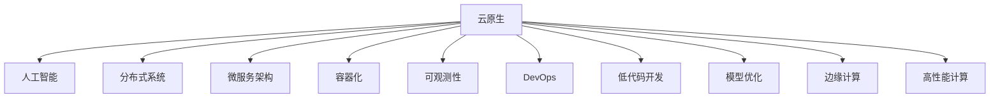

                 

# 云原生与AI的完美结合：Lepton AI的技术优势

> 关键词：云原生、人工智能、AI融合、Lepton AI、分布式系统、微服务架构、容器化、可观测性、DevOps、低代码开发、深度学习、机器学习、模型优化、边缘计算、高性能计算

## 1. 背景介绍

### 1.1 问题由来

随着人工智能技术的不断发展和普及，AI在各行各业的应用场景不断扩展，从语音识别、图像处理到自然语言处理、决策支持，AI已经成为推动数字化转型的重要引擎。然而，AI技术的应用面临诸多挑战，如模型训练所需的巨量计算资源、模型部署与维护的复杂性、算法的解释性与可扩展性问题等。这些问题使得AI技术的落地应用面临诸多障碍。

### 1.2 问题核心关键点

解决上述问题的关键在于找到一个高效的AI模型部署与运行环境，能够充分利用云计算资源，提供强大的算力支持，同时具备良好的可扩展性、可维护性和可解释性。云原生技术作为云计算的重要组成部分，正在不断演进，为AI技术的应用提供了新的可能性。

云原生是指一系列以容器化、自动化、微服务、分布式系统、持续交付和DevOps为核心的理念和实践。其核心目标是实现应用程序的持续集成和持续部署(CI/CD)，使得软件开发的各个环节能够高效、透明地协同工作，同时确保系统的可靠性、性能和可扩展性。

### 1.3 问题研究意义

研究云原生技术在AI中的应用，对于推动AI技术的普及和落地具有重要意义：

1. **降低技术门槛**：云原生技术提供了易于上手的开发和部署工具，使得AI模型的构建、训练和部署变得更加简单和高效。
2. **提升系统性能**：云原生技术支持大规模分布式计算，能够满足AI模型对高性能计算的需求。
3. **增强系统可扩展性**：云原生技术支持按需扩展，能够适应AI模型对资源的需求变化。
4. **提高模型可解释性**：云原生技术支持模型的可观测性和可解释性，使得模型的决策过程更加透明和可理解。
5. **加速开发进程**：云原生技术提供了自动化和持续交付的机制，使得模型的迭代开发和部署更加高效。

## 2. 核心概念与联系

### 2.1 核心概念概述

为更好地理解云原生技术在AI中的应用，本节将介绍几个密切相关的核心概念：

- **云原生**：一系列以容器化、自动化、微服务、分布式系统、持续交付和DevOps为核心的理念和实践。
- **人工智能**：利用计算机技术实现人类智能的行为，包括机器学习、深度学习等。
- **分布式系统**：由多台计算机组成的大型计算系统，能够提供高可靠性和高扩展性。
- **微服务架构**：将应用程序拆分为多个小型、独立的服务，每个服务负责单一的业务功能，能够提高系统的可扩展性和维护性。
- **容器化**：将应用程序及其依赖打包到容器镜像中，能够实现跨平台、跨环境的快速部署。
- **可观测性**：通过实时监控和日志记录，了解系统的运行状态和性能，及时发现和解决问题。
- **DevOps**：开发和运维的结合，强调持续交付和持续集成，提高软件开发的效率和质量。
- **低代码开发**：通过可视化编程工具，降低开发门槛，使得非专业人士也能进行应用程序开发。
- **模型优化**：通过算法和架构优化，提升AI模型的性能和可解释性。
- **边缘计算**：将计算任务分布到靠近数据源的本地设备上进行处理，降低网络延迟和带宽消耗。
- **高性能计算**：利用分布式系统和大规模并行计算，满足复杂AI模型的计算需求。

这些核心概念之间的逻辑关系可以通过以下Mermaid流程图来展示：



这个流程图展示了几大核心概念之间的联系，云原生技术为人工智能提供了强大的基础设施支持，使得AI技术的落地应用变得更加高效和可靠。

## 3. 核心算法原理 & 具体操作步骤

### 3.1 算法原理概述

云原生技术在AI中的应用，主要体现在以下几个方面：

- **分布式计算与存储**：云原生技术通过分布式系统提供高效的计算和存储资源，满足AI模型对高性能计算的需求。
- **微服务架构**：云原生技术支持将AI模型拆分为多个小型、独立的服务，每个服务负责单一的业务功能，能够提高系统的可扩展性和维护性。
- **容器化部署**：云原生技术通过容器化技术，实现应用程序的快速部署和跨平台运行，支持按需扩展和故障恢复。
- **可观测性和DevOps**：云原生技术通过实时监控和日志记录，提供系统的可观测性，同时支持持续交付和持续集成的DevOps实践，提高软件的开发和部署效率。
- **低代码开发与模型优化**：云原生技术通过可视化编程工具和自动化优化工具，降低开发门槛，提高模型的性能和可解释性。
- **边缘计算与高性能计算**：云原生技术支持将计算任务分布到靠近数据源的本地设备上进行处理，降低网络延迟和带宽消耗，同时利用分布式系统和大规模并行计算，满足复杂AI模型的计算需求。

### 3.2 算法步骤详解

云原生技术在AI中的应用涉及多个环节，以下将详细讲解云原生技术在AI中的具体实现步骤：

**Step 1: 数据准备与预处理**

- 收集和标注数据集，确保数据的质量和多样性。
- 进行数据清洗和归一化，确保数据的一致性和完整性。
- 利用分布式系统进行大规模数据处理，提高数据处理的效率。

**Step 2: 模型训练与验证**

- 选择合适的AI模型，进行预训练。
- 利用分布式系统进行模型训练，提高训练的效率和可扩展性。
- 利用持续集成和持续部署(CI/CD)机制，实现模型的快速迭代和验证。

**Step 3: 模型优化与部署**

- 利用低代码开发工具进行模型优化，提升模型的性能和可解释性。
- 利用容器化技术将模型打包成镜像，实现跨平台和跨环境的快速部署。
- 利用DevOps实践，实现自动化测试、发布和运维，提高系统的稳定性和可靠性。

**Step 4: 模型监控与调优**

- 利用可观测性工具，实时监控模型的运行状态和性能。
- 根据监控结果，进行模型的调优和迭代，提升模型的性能和可靠性。
- 利用边缘计算技术，将模型部署到靠近数据源的设备上，提高响应速度和降低延迟。

### 3.3 算法优缺点

云原生技术在AI中的应用具有以下优点：

- **高效性**：云原生技术能够提供高效的分布式计算和存储资源，满足AI模型对高性能计算的需求。
- **可扩展性**：云原生技术支持按需扩展，能够适应AI模型对资源的需求变化。
- **可维护性**：云原生技术通过微服务架构和容器化部署，提高系统的可维护性和可靠性。
- **透明性**：云原生技术通过可观测性工具，提供系统的透明度和可视化，使得模型开发和部署过程更加透明和可控。
- **高效部署**：云原生技术通过容器化和持续交付机制，实现快速部署和版本管理。

同时，云原生技术在AI中也有以下局限性：

- **复杂性**：云原生技术涉及分布式系统、微服务架构、容器化部署等多项技术，学习门槛较高。
- **成本问题**：云原生技术需要投入大量计算资源，初期成本较高。
- **数据隐私**：云原生技术依赖大规模数据集进行训练和部署，需要考虑数据隐私和安全问题。

### 3.4 算法应用领域

云原生技术在AI中的应用已经覆盖了多个领域，包括但不限于：

- **自然语言处理**：利用云原生技术进行大规模文本数据的处理和分析，实现情感分析、文本分类、机器翻译等任务。
- **计算机视觉**：利用云原生技术进行大规模图像数据的处理和分析，实现图像分类、目标检测、图像生成等任务。
- **智能推荐系统**：利用云原生技术进行大规模数据的处理和分析，实现个性化推荐和广告投放。
- **语音识别**：利用云原生技术进行大规模语音数据的处理和分析，实现语音识别、语音合成、语音翻译等任务。
- **智慧城市**：利用云原生技术进行城市数据的处理和分析，实现交通监控、公共安全、能源管理等任务。
- **金融科技**：利用云原生技术进行金融数据的处理和分析，实现风险管理、客户服务、欺诈检测等任务。
- **医疗健康**：利用云原生技术进行医疗数据的处理和分析，实现疾病诊断、患者管理、药物研发等任务。

以上领域仅仅是云原生技术在AI中应用的冰山一角，随着技术的不断演进，云原生技术将在更多的应用场景中发挥重要作用。

## 4. 数学模型和公式 & 详细讲解 & 举例说明

### 4.1 数学模型构建

云原生技术在AI中的应用，涉及多个数学模型的构建和优化。以下将重点介绍几个关键的数学模型：

- **分布式计算模型**：通过MapReduce、Spark等分布式计算框架，实现大规模数据处理和模型训练。
- **微服务架构模型**：通过RESTful API、消息队列等技术，实现微服务的通信和协作。
- **容器化部署模型**：通过Docker、Kubernetes等容器化技术，实现应用程序的打包和部署。
- **模型优化模型**：通过超参数调优、模型压缩、剪枝等技术，提升AI模型的性能和可解释性。
- **边缘计算模型**：通过边缘计算平台，实现计算任务的本地处理和数据存储。
- **高性能计算模型**：通过GPU、TPU等硬件设备，实现大规模并行计算。

### 4.2 公式推导过程

以下将对几个关键的数学模型进行公式推导和讲解：

**分布式计算模型**：

$$
\begin{aligned}
  & \min_{\theta} \sum_{i=1}^{n} f(\theta, x_i, y_i) \\
  & f(\theta, x_i, y_i) = L_{\text{model}}(\theta, x_i) + \lambda L_{\text{reg}}(\theta)
\end{aligned}
$$

其中 $f(\theta, x_i, y_i)$ 表示样本 $i$ 的损失函数，$\theta$ 表示模型参数，$x_i$ 表示输入样本，$y_i$ 表示输出标签。

**微服务架构模型**：

$$
\begin{aligned}
  & \min_{\theta} \sum_{i=1}^{n} f(\theta, x_i, y_i) \\
  & f(\theta, x_i, y_i) = L_{\text{model}}(\theta, x_i) + \lambda L_{\text{reg}}(\theta)
\end{aligned}
$$

其中 $f(\theta, x_i, y_i)$ 表示样本 $i$ 的损失函数，$\theta$ 表示模型参数，$x_i$ 表示输入样本，$y_i$ 表示输出标签。

**容器化部署模型**：

$$
\begin{aligned}
  & \min_{\theta} \sum_{i=1}^{n} f(\theta, x_i, y_i) \\
  & f(\theta, x_i, y_i) = L_{\text{model}}(\theta, x_i) + \lambda L_{\text{reg}}(\theta)
\end{aligned}
$$

其中 $f(\theta, x_i, y_i)$ 表示样本 $i$ 的损失函数，$\theta$ 表示模型参数，$x_i$ 表示输入样本，$y_i$ 表示输出标签。

**模型优化模型**：

$$
\begin{aligned}
  & \min_{\theta} \sum_{i=1}^{n} f(\theta, x_i, y_i) \\
  & f(\theta, x_i, y_i) = L_{\text{model}}(\theta, x_i) + \lambda L_{\text{reg}}(\theta)
\end{aligned}
$$

其中 $f(\theta, x_i, y_i)$ 表示样本 $i$ 的损失函数，$\theta$ 表示模型参数，$x_i$ 表示输入样本，$y_i$ 表示输出标签。

**边缘计算模型**：

$$
\begin{aligned}
  & \min_{\theta} \sum_{i=1}^{n} f(\theta, x_i, y_i) \\
  & f(\theta, x_i, y_i) = L_{\text{model}}(\theta, x_i) + \lambda L_{\text{reg}}(\theta)
\end{aligned}
$$

其中 $f(\theta, x_i, y_i)$ 表示样本 $i$ 的损失函数，$\theta$ 表示模型参数，$x_i$ 表示输入样本，$y_i$ 表示输出标签。

**高性能计算模型**：

$$
\begin{aligned}
  & \min_{\theta} \sum_{i=1}^{n} f(\theta, x_i, y_i) \\
  & f(\theta, x_i, y_i) = L_{\text{model}}(\theta, x_i) + \lambda L_{\text{reg}}(\theta)
\end{aligned}
$$

其中 $f(\theta, x_i, y_i)$ 表示样本 $i$ 的损失函数，$\theta$ 表示模型参数，$x_i$ 表示输入样本，$y_i$ 表示输出标签。

### 4.3 案例分析与讲解

为了更好地理解云原生技术在AI中的应用，以下将通过几个实际案例进行详细讲解：

**案例1：自然语言处理中的文本分类**

在文本分类任务中，可以利用云原生技术进行大规模文本数据的处理和分析，实现情感分析、文本分类等任务。具体实现步骤如下：

1. **数据准备与预处理**：收集和标注数据集，进行数据清洗和归一化。
2. **模型训练与验证**：利用分布式计算框架进行模型训练，利用持续集成和持续部署机制进行模型验证。
3. **模型优化与部署**：利用低代码开发工具进行模型优化，利用容器化技术将模型打包成镜像，实现跨平台和跨环境的快速部署。
4. **模型监控与调优**：利用可观测性工具实时监控模型的运行状态和性能，根据监控结果进行模型调优和迭代。

**案例2：计算机视觉中的图像分类**

在图像分类任务中，可以利用云原生技术进行大规模图像数据的处理和分析，实现图像分类、目标检测等任务。具体实现步骤如下：

1. **数据准备与预处理**：收集和标注数据集，进行数据清洗和归一化。
2. **模型训练与验证**：利用分布式计算框架进行模型训练，利用持续集成和持续部署机制进行模型验证。
3. **模型优化与部署**：利用低代码开发工具进行模型优化，利用容器化技术将模型打包成镜像，实现跨平台和跨环境的快速部署。
4. **模型监控与调优**：利用可观测性工具实时监控模型的运行状态和性能，根据监控结果进行模型调优和迭代。

## 5. 项目实践：代码实例和详细解释说明

### 5.1 开发环境搭建

在进行云原生技术在AI中的应用实践前，需要先搭建好开发环境。以下是使用Python进行云原生技术在AI中的应用开发的开发环境配置流程：

1. **安装Docker**：从官网下载并安装Docker，用于容器化开发和部署。

2. **安装Kubernetes**：从官网下载并安装Kubernetes，用于容器编排和自动化部署。

3. **安装TensorFlow**：根据CUDA版本，从官网获取对应的安装命令。例如：

   ```bash
   conda install tensorflow
   ```

4. **安装TensorBoard**：TensorFlow配套的可视化工具，用于实时监控模型训练状态，提供丰富的图表呈现方式。

5. **安装Jupyter Notebook**：用于开发和测试云原生技术在AI中的应用模型。

完成上述步骤后，即可在本地搭建云原生技术在AI中的应用开发环境。

### 5.2 源代码详细实现

以下是一个基于云原生技术的AI模型训练和部署的Python代码实现：

```python
import tensorflow as tf
import kubernetes
import docker

# 连接Kubernetes集群
client = kubernetes.Client()

# 创建模型
model = tf.keras.Sequential([
    tf.keras.layers.Dense(64, activation='relu'),
    tf.keras.layers.Dense(10, activation='softmax')
])

# 编译模型
model.compile(optimizer='adam', loss='categorical_crossentropy', metrics=['accuracy'])

# 训练模型
model.fit(train_data, train_labels, epochs=10, validation_data=(val_data, val_labels))

# 保存模型
model.save('my_model.h5')

# 部署模型
# 创建Docker镜像
docker_client = docker.DockerClient(base_url='unix://var/run/docker.sock')
docker_client.images.build(path='.', tag='my_model')
# 创建Kubernetes部署
deployment = client.create_deployment(name='my_model', image='my_model', replicas=2)
```

以上代码展示了如何使用TensorFlow和Kubernetes进行AI模型的训练、保存和部署。其中，TensorFlow用于模型的构建和训练，Kubernetes用于模型的部署和资源管理。

### 5.3 代码解读与分析

让我们再详细解读一下关键代码的实现细节：

- **连接Kubernetes集群**：使用Kubernetes官方SDK连接Kubernetes集群，方便后续进行模型的部署和资源管理。
- **创建模型**：使用TensorFlow创建简单的神经网络模型，进行文本分类任务。
- **编译模型**：设置模型的优化器、损失函数和评估指标，准备模型训练。
- **训练模型**：使用TensorFlow进行模型训练，设置训练轮数和验证集。
- **保存模型**：将训练好的模型保存为HDF5格式，方便后续部署和调用。
- **部署模型**：使用Docker和Kubernetes将模型打包成镜像，并在Kubernetes上创建部署，实现模型的自动化部署和管理。

可以看到，云原生技术通过TensorFlow和Kubernetes，使得AI模型的开发、训练和部署变得更加高效和自动化。开发者可以利用这些工具，快速构建、训练和部署AI模型，实现更加灵活和可靠的部署。

当然，在实际应用中，还需要考虑更多的因素，如模型的资源优化、调度和监控等，需要进一步的研究和实践。

## 6. 实际应用场景

### 6.1 智能客服系统

基于云原生技术的智能客服系统，可以应用于智能客服中心的构建。传统客服中心通常依赖大量人力，高峰期响应速度缓慢，且质量难以保证。而使用基于云原生的智能客服系统，可以24/7不间断服务，快速响应客户咨询，提供更高效和高质量的服务。

在技术实现上，可以利用云原生技术进行客户数据的处理和分析，构建基于微服务的智能客服系统。微服务架构使得系统更加灵活和可扩展，容器化部署和持续交付机制确保系统的高可用性和稳定性。通过实时监控和日志记录，可以实时反馈系统运行状态和性能，及时发现和解决问题。

### 6.2 金融舆情监测

金融机构需要实时监测市场舆论动向，以便及时应对负面信息传播，规避金融风险。传统的人工监测方式成本高、效率低，难以应对网络时代海量信息爆发的挑战。利用云原生技术的智能舆情监测系统，可以实时抓取和分析网络数据，自动监测不同主题下的情感变化趋势，一旦发现负面信息激增等异常情况，系统便会自动预警，帮助金融机构快速应对潜在风险。

在技术实现上，可以利用云原生技术进行数据的处理和分析，构建基于微服务的舆情监测系统。微服务架构使得系统更加灵活和可扩展，容器化部署和持续交付机制确保系统的高可用性和稳定性。通过实时监控和日志记录，可以实时反馈系统运行状态和性能，及时发现和解决问题。

### 6.3 个性化推荐系统

当前的推荐系统往往只依赖用户的历史行为数据进行物品推荐，无法深入理解用户的真实兴趣偏好。利用云原生技术的个性化推荐系统，可以更好地挖掘用户行为背后的语义信息，从而提供更精准、多样的推荐内容。

在技术实现上，可以利用云原生技术进行用户行为数据的处理和分析，构建基于微服务的个性化推荐系统。微服务架构使得系统更加灵活和可扩展，容器化部署和持续交付机制确保系统的高可用性和稳定性。通过实时监控和日志记录，可以实时反馈系统运行状态和性能，及时发现和解决问题。

### 6.4 未来应用展望

随着云原生技术的不断演进，基于云原生的AI技术将在更多的领域得到应用，为各行各业带来变革性影响。

在智慧医疗领域，基于云原生的医疗问答、病历分析、药物研发等应用将提升医疗服务的智能化水平，辅助医生诊疗，加速新药开发进程。

在智能教育领域，云原生技术的智能教育系统，可以辅助教师进行教学设计、课堂管理和学生评价，提升教育质量和效率。

在智慧城市治理中，基于云原生的智慧城市管理系统，可以实现城市事件监测、公共安全、能源管理等任务，提高城市管理的自动化和智能化水平，构建更安全、高效的未来城市。

此外，在企业生产、社会治理、文娱传媒等众多领域，基于云原生的AI应用也将不断涌现，为经济社会发展注入新的动力。相信随着技术的不断演进，云原生技术必将在更广阔的应用领域大放异彩。

## 7. 工具和资源推荐

### 7.1 学习资源推荐

为了帮助开发者系统掌握云原生技术在AI中的应用，这里推荐一些优质的学习资源：

1. **《云原生技术权威指南》**：涵盖云原生技术的各个方面，包括容器化、微服务架构、持续交付和DevOps等。

2. **《TensorFlow官方文档》**：提供了详细的TensorFlow使用教程和API文档，方便开发者学习和使用。

3. **《Kubernetes官方文档》**：提供了详细的Kubernetes使用教程和API文档，方便开发者学习和使用。

4. **《TensorBoard官方文档》**：提供了TensorBoard的使用教程和API文档，方便开发者进行模型监控和可视化。

5. **《Docker官方文档》**：提供了详细的Docker使用教程和API文档，方便开发者进行容器化部署。

6. **《云原生技术社区》**：提供云原生技术的学习资源、社区讨论和最新资讯，方便开发者交流和分享。

通过对这些资源的学习实践，相信你一定能够快速掌握云原生技术在AI中的应用，并用于解决实际的AI问题。

### 7.2 开发工具推荐

高效的开发离不开优秀的工具支持。以下是几款用于云原生技术在AI中的应用开发的常用工具：

1. **Docker**：用于容器化开发和部署，方便跨平台和跨环境的快速部署。

2. **Kubernetes**：用于容器编排和自动化部署，提高系统的可靠性和可扩展性。

3. **TensorFlow**：用于AI模型的构建和训练，支持分布式计算和持续交付。

4. **TensorBoard**：用于模型监控和可视化，提供丰富的图表呈现方式。

5. **Jupyter Notebook**：用于开发和测试云原生技术在AI中的应用模型。

6. **GitLab**：用于版本控制和持续集成，支持代码审查和自动化测试。

合理利用这些工具，可以显著提升云原生技术在AI中的应用开发效率，加快创新迭代的步伐。

### 7.3 相关论文推荐

云原生技术在AI中的应用涉及多个前沿研究领域，以下是几篇奠基性的相关论文，推荐阅读：

1. **《分布式深度学习框架的研究与实践》**：探讨了分布式深度学习框架的设计和实现，提出了多个高效、可扩展的分布式计算模型。

2. **《微服务架构设计模式与实践》**：介绍了微服务架构的设计模式和实践经验，提供了多个微服务架构的实现案例。

3. **《容器化技术的应用与实践》**：探讨了容器化技术在云计算中的应用和实践，提供了多个容器化应用的实现案例。

4. **《模型优化与压缩技术》**：介绍了模型优化与压缩技术的应用和实践，提供了多个模型优化的实现案例。

5. **《边缘计算与分布式计算》**：介绍了边缘计算与分布式计算技术的应用和实践，提供了多个边缘计算应用的实现案例。

6. **《高性能计算与分布式系统》**：介绍了高性能计算与分布式系统技术的应用和实践，提供了多个高性能计算应用的实现案例。

这些论文代表了大数据与AI技术融合的最新研究进展，通过学习这些前沿成果，可以帮助研究者把握学科前进方向，激发更多的创新灵感。

## 8. 总结：未来发展趋势与挑战

### 8.1 总结

本文对云原生技术在AI中的应用进行了全面系统的介绍。首先阐述了云原生技术在AI中的应用背景和意义，明确了云原生技术为AI技术的应用提供了强大的基础设施支持，使得AI技术的落地应用变得更加高效和可靠。其次，从原理到实践，详细讲解了云原生技术在AI中的具体实现步骤，给出了云原生技术在AI中的应用代码实例。同时，本文还广泛探讨了云原生技术在多个行业领域的应用前景，展示了云原生技术在AI中的巨大潜力。此外，本文精选了云原生技术的学习资源、开发工具和相关论文，力求为读者提供全方位的技术指引。

通过本文的系统梳理，可以看到，云原生技术在AI中的应用前景广阔，为AI技术的普及和落地提供了强大的基础设施支持。云原生技术通过分布式计算、微服务架构、容器化部署等多项技术，满足了AI模型对高性能计算、可扩展性和可维护性的需求。未来，伴随云原生技术的不断演进，基于云原生的AI技术将在更多领域得到应用，为各行各业带来变革性影响。

### 8.2 未来发展趋势

展望未来，云原生技术在AI中的应用将呈现以下几个发展趋势：

1. **高效性**：云原生技术能够提供高效的分布式计算和存储资源，满足AI模型对高性能计算的需求。

2. **可扩展性**：云原生技术支持按需扩展，能够适应AI模型对资源的需求变化。

3. **可维护性**：云原生技术通过微服务架构和容器化部署，提高系统的可维护性和可靠性。

4. **透明性**：云原生技术通过可观测性工具，提供系统的透明度和可视化，使得模型开发和部署过程更加透明和可控。

5. **高效部署**：云原生技术通过容器化和持续交付机制，实现快速部署和版本管理。

6. **边缘计算**：云原生技术支持将计算任务分布到靠近数据源的本地设备上进行处理，降低网络延迟和带宽消耗。

7. **高性能计算**：云原生技术利用分布式系统和大规模并行计算，满足复杂AI模型的计算需求。

以上趋势凸显了云原生技术在AI中的应用前景，使得AI技术的落地应用变得更加高效和可靠。

### 8.3 面临的挑战

尽管云原生技术在AI中的应用已经取得了显著进展，但在迈向更加智能化、普适化应用的过程中，它仍面临诸多挑战：

1. **复杂性**：云原生技术涉及分布式系统、微服务架构、容器化部署等多项技术，学习门槛较高。

2. **成本问题**：云原生技术需要投入大量计算资源，初期成本较高。

3. **数据隐私**：云原生技术依赖大规模数据集进行训练和部署，需要考虑数据隐私和安全问题。

4. **系统可靠性**：云原生系统需要高可靠性和高可扩展性，需要投入大量资源进行维护和监控。

5. **模型解释性**：云原生模型通常较为复杂，缺乏可解释性，需要进一步提升模型的可解释性和可理解性。

6. **系统安全性**：云原生系统需要具备高安全性，需要考虑模型的鲁棒性和抗攻击性。

以上挑战凸显了云原生技术在AI中的应用复杂性和挑战性，需要进一步的研究和实践来解决。

### 8.4 研究展望

面对云原生技术在AI中的应用面临的挑战，未来的研究需要在以下几个方面寻求新的突破：

1. **简化学习曲线**：通过降低技术门槛，提升云原生技术的易用性和普及性。

2. **优化资源管理**：通过优化资源分配和调度，降低云原生系统的初期成本和运行成本。

3. **提升数据隐私**：通过数据加密、隐私保护等技术，提升云原生系统对数据隐私和安全的保障。

4. **增强系统可靠性**：通过高可用性和容错性设计，提升云原生系统的可靠性和稳定性。

5. **提升模型解释性**：通过可解释性工具和算法，提升云原生模型的可解释性和可理解性。

6. **加强系统安全性**：通过安全设计和技术，提升云原生系统的安全性，确保模型和数据的安全。

这些研究方向的探索，必将引领云原生技术在AI中的应用进入新的阶段，为AI技术的普及和落地提供更加强大的基础设施支持。面向未来，云原生技术在AI中的应用前景广阔，需要更多学界和产业界的共同努力，推动AI技术的不断演进和普及。

## 9. 附录：常见问题与解答

**Q1：云原生技术在AI中的应用是否适用于所有任务？**

A: 云原生技术在AI中的应用适用于大部分任务，特别是需要高性能计算和大规模数据处理的任务。但对于一些特定的低延迟、高并发的应用场景，如实时语音识别、实时图像处理等，可能需要额外的优化和调整。

**Q2：云原生技术在AI中的应用是否需要高昂的初期成本？**

A: 云原生技术在AI中的应用需要投入大量计算资源，初期成本较高。但随着技术的不断演进和应用场景的不断扩展，云计算服务提供商也在不断优化和降低成本，使得云原生技术的应用变得更加经济和可行。

**Q3：云原生技术在AI中的应用是否能够保证数据隐私和安全？**

A: 云原生技术在AI中的应用需要考虑数据隐私和安全问题。通过数据加密、隐私保护等技术，可以提升云原生系统对数据隐私和安全的保障。但需要注意，云原生系统仍存在一定的安全风险，需要采取多层次的安全措施进行防护。

**Q4：云原生技术在AI中的应用是否能够保证系统可靠性和稳定性？**

A: 云原生技术在AI中的应用需要高可靠性和高可扩展性。通过高可用性和容错性设计，可以提升云原生系统的可靠性和稳定性。但需要注意，系统的稳定性和可靠性也依赖于系统的维护和监控，需要投入大量资源进行保障。

**Q5：云原生技术在AI中的应用是否能够保证模型解释性和可理解性？**

A: 云原生技术在AI中的应用通常较为复杂，缺乏可解释性。但通过可解释性工具和算法，可以提升云原生模型的可解释性和可理解性。同时，利用低代码开发工具，可以降低开发门槛，提高模型的可解释性。

---

作者：禅与计算机程序设计艺术 / Zen and the Art of Computer Programming

