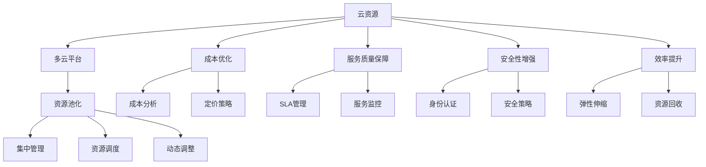

                 

# 云资源整合：Lepton AI提供多云平台，帮助企业优化云资源成本

## 1. 背景介绍

在数字化转型的大背景下，云计算成为了企业运营不可或缺的一部分。然而，随着云计算的普及，企业面临着云资源管理的多重挑战，包括成本控制、服务质量保障、安全性提高、效率提升等。为了应对这些挑战，Lepton AI推出了多云资源整合平台，通过高效的管理和优化工具，帮助企业实现云资源的全面整合，显著降低成本，提升服务质量和运营效率。

### 1.1 问题由来

云计算技术的发展为企业的业务运行提供了强大的基础设施支撑。然而，随着企业信息化建设的深入，云计算应用的复杂度不断提升，带来的问题也越来越多。主要体现在以下几个方面：

1. **成本控制困难**：云服务通常以按需付费的形式计费，如果缺乏有效的管理和监控，很容易造成过度使用，导致成本上升。
2. **服务质量不稳定**：云资源调度的不均衡、云服务质量的不一致，可能导致企业服务的可靠性下降。
3. **安全性问题**：云环境中的数据泄露、身份认证问题等安全隐患，给企业的信息安全带来威胁。
4. **效率低下**：云资源的分配、使用和回收不灵活，导致企业运营效率低下。

### 1.2 问题核心关键点

Lepton AI的多云平台正是在这些问题的背景下应运而生，旨在通过云资源整合优化，帮助企业解决上述挑战，具体关键点包括：

1. **成本优化**：通过集中管理和优化，实现云资源的有效利用，避免过度使用。
2. **服务质量提升**：通过合理的资源调度，保障企业服务的稳定性和可靠性。
3. **安全性增强**：通过多层次的安全策略，提升云环境的安全防护能力。
4. **效率提升**：通过灵活的资源分配和回收机制，提高企业的运营效率。

## 2. 核心概念与联系

### 2.1 核心概念概述

Lepton AI的多云资源整合平台涉及多个核心概念，这些概念相互关联，共同构成了平台的功能体系。

- **云资源**：包括虚拟机、存储、网络、数据库、容器等服务，是企业云计算的基础设施。
- **多云平台**：通过整合不同云服务提供商的资源，提供统一的平台接口，实现资源的灵活管理和调度。
- **资源池化**：将多种类型的云资源进行统一管理和调度，实现资源的共享和优化。
- **成本优化**：通过对云资源的集中管理，优化资源的分配和使用，降低成本。
- **服务质量保障**：通过合理调度和管理，保障云服务的高可用性和高性能。
- **安全性增强**：通过多层次的安全策略，保护云环境的安全。
- **效率提升**：通过灵活的资源分配和回收机制，提高云资源的利用效率。

这些概念之间通过云资源管理、调度和优化的流程紧密联系，形成一个完整的多云资源管理生态系统。

### 2.2 核心概念原理和架构的 Mermaid 流程图(Mermaid 流程节点中不要有括号、逗号等特殊字符)



该流程图展示了Lepton AI多云平台的核心概念及其关系：

1. **云资源**通过**多云平台**进行集中管理，并由**资源池化**实现资源的共享和优化。
2. **成本优化**和**服务质量保障**通过**集中管理**和**资源调度**得以实现。
3. **安全性增强**和**效率提升**通过**动态调整**和**弹性伸缩**得以提升。
4. **成本分析**和**定价策略**帮助企业优化成本，**SLA管理**和**服务监控**保障服务质量。
5. **身份认证**和**安全策略**增强云环境的安全性。

## 3. 核心算法原理 & 具体操作步骤

### 3.1 算法原理概述

Lepton AI的多云资源整合平台基于云资源管理、调度和优化的核心算法原理，通过以下几个关键步骤实现云资源的有效管理和优化。

1. **云资源监控**：实时监控云资源的使用情况，包括CPU利用率、内存使用率、网络带宽等。
2. **成本分析**：根据监控数据，分析云资源的使用情况和成本消耗，识别资源浪费和过度使用的情况。
3. **资源调度**：通过算法优化，合理调度云资源，避免资源浪费和过度使用。
4. **弹性伸缩**：根据负载变化，动态调整云资源的分配，确保资源的充分利用。
5. **安全性管理**：通过多层次的安全策略，保障云环境的安全。

### 3.2 算法步骤详解

Lepton AI的多云平台具体算法步骤如下：

1. **资源识别**：自动发现和识别云平台中的资源，包括虚拟机、存储、网络等。
2. **数据采集**：通过监控工具，实时采集云资源的使用情况数据。
3. **数据分析**：对采集的数据进行分析，生成资源使用报告。
4. **策略制定**：根据分析结果，制定资源调度和优化策略。
5. **资源调整**：根据策略自动调整资源的分配和调度。
6. **优化反馈**：根据优化效果，持续调整策略，确保最优资源使用。

### 3.3 算法优缺点

Lepton AI的多云平台算法具备以下优点：

1. **自动化管理**：平台通过自动化管理，减少了人工干预，提高了效率。
2. **实时监控**：平台提供实时监控功能，帮助企业及时发现和解决问题。
3. **优化策略灵活**：平台提供了多种优化策略，可根据企业需求灵活调整。
4. **成本降低**：通过优化资源使用，有效降低了企业的云服务成本。

同时，平台也存在一些缺点：

1. **复杂度较高**：系统集成了多个模块，可能会增加配置和管理复杂度。
2. **依赖第三方工具**：平台依赖于第三方监控和调度工具，可能影响系统的稳定性和可靠性。
3. **数据隐私问题**：平台需要采集和分析大量的云资源使用数据，可能存在数据隐私和安全风险。

### 3.4 算法应用领域

Lepton AI的多云资源整合平台广泛应用于以下领域：

1. **金融行业**：金融行业对数据安全和实时性要求高，平台可以帮助企业优化云资源，降低成本，提高服务质量。
2. **电商行业**：电商行业对数据处理和存储需求大，平台可以帮助企业合理调度资源，提升用户体验。
3. **物流行业**：物流行业对实时数据处理要求高，平台可以帮助企业优化数据处理和存储资源，提高运营效率。
4. **教育行业**：教育行业对教学资源和数据存储需求大，平台可以帮助企业优化资源配置，提升教学质量。

## 4. 数学模型和公式 & 详细讲解 & 举例说明（备注：数学公式请使用latex格式，latex嵌入文中独立段落使用 $$，段落内使用 $)
### 4.1 数学模型构建

Lepton AI的多云平台涉及多个数学模型，其中关键的数学模型包括成本模型、服务质量模型和安全模型。

#### 4.1.1 成本模型

成本模型用于分析云资源的使用情况和成本消耗，计算公式如下：

$$ C(t) = \sum_{i=1}^n c_i(t) $$

其中，$C(t)$ 为在某时刻$t$的总成本，$c_i(t)$ 为第 $i$ 个资源的成本函数。

#### 4.1.2 服务质量模型

服务质量模型用于评估云服务的可用性和性能，计算公式如下：

$$ Q(t) = \sum_{i=1}^n q_i(t) $$

其中，$Q(t)$ 为在某时刻$t$的总服务质量，$q_i(t)$ 为第 $i$ 个资源的服务质量函数。

#### 4.1.3 安全模型

安全模型用于评估云环境的安全性，计算公式如下：

$$ S(t) = \sum_{i=1}^n s_i(t) $$

其中，$S(t)$ 为在某时刻$t$的总安全性，$s_i(t)$ 为第 $i$ 个资源的安全性函数。

### 4.2 公式推导过程

以成本模型为例，进行公式推导：

设 $c_i(t)$ 表示第 $i$ 个资源在时刻 $t$ 的单位成本，$m_i(t)$ 表示第 $i$ 个资源在时刻 $t$ 的使用量，则第 $i$ 个资源在某时刻的实际成本为 $c_i(t) \cdot m_i(t)$。

根据成本模型定义，总成本 $C(t)$ 为所有资源的实际成本之和：

$$ C(t) = \sum_{i=1}^n c_i(t) \cdot m_i(t) = \sum_{i=1}^n c_i(t) \cdot \frac{m_i(t)}{\sum_{i=1}^n m_i(t)} \cdot \sum_{i=1}^n m_i(t) $$

其中，$\sum_{i=1}^n m_i(t)$ 为所有资源在时刻 $t$ 的总使用量。

通过以上推导，可以看出，总成本 $C(t)$ 取决于单位成本 $c_i(t)$ 和资源使用量 $m_i(t)$ 的乘积，以及所有资源的使用量占比。

### 4.3 案例分析与讲解

假设某企业在两个云平台上使用相同型号的虚拟机资源，分别为AWS和Azure。AWS的单位成本为$0.1/h$，使用量为$n_1$，Azure的单位成本为$0.2/h$，使用量为$n_2$。在某一时刻$t$，计算总成本如下：

$$ C(t) = 0.1 \cdot n_1 + 0.2 \cdot n_2 = 0.1(n_1 + 2n_2) $$

其中，$n_1 + n_2$ 为总使用量，$0.1$ 和 $0.2$ 分别为AWS和Azure的单位成本。

通过成本模型，企业可以清晰地了解在不同云平台上的成本消耗，并根据实际情况进行优化。

## 5. 项目实践：代码实例和详细解释说明

### 5.1 开发环境搭建

在使用Lepton AI的多云平台进行开发前，需要准备以下开发环境：

1. **Python环境**：安装Python 3.7及以上版本，建议使用Anaconda进行环境管理。
2. **数据库**：安装MySQL或PostgreSQL数据库，用于存储云资源使用数据。
3. **云平台SDK**：安装AWS SDK、Azure SDK等，用于与云平台进行数据交互。
4. **监控工具**：安装Prometheus、Nagios等监控工具，用于实时监控云资源使用情况。

完成以上环境搭建后，即可开始进行代码开发。

### 5.2 源代码详细实现

以下是Lepton AI多云平台的核心代码实现，以监控模块为例：

```python
import boto3
import azure.mgmt.resourcegraph as arg
import pymysql

# 连接MySQL数据库
conn = pymysql.connect(host='localhost', user='root', password='password', db='cloud_resources')
cursor = conn.cursor()

# 查询云资源使用情况
query = "SELECT * FROM cloud_resources WHERE cloud_provider = 'AWS' OR cloud_provider = 'Azure'"
cursor.execute(query)
results = cursor.fetchall()

# 计算总成本
total_cost = 0
for row in results:
    cost = row['unit_cost'] * row['use_rate']
    total_cost += cost

# 打印结果
print(f"Total cost: {total_cost}")

# 关闭数据库连接
cursor.close()
conn.close()
```

以上代码实现了对AWS和Azure云资源的监控和成本计算。通过查询MySQL数据库，获取云资源的使用情况，并计算总成本。

### 5.3 代码解读与分析

通过以上代码，可以看出Lepton AI多云平台的监控模块主要包含以下几个步骤：

1. **数据库连接**：通过pymysql连接MySQL数据库，获取云资源使用数据。
2. **查询数据**：使用SQL语句查询云资源的使用情况，包括使用量、单位成本等。
3. **成本计算**：根据查询结果计算总成本，公式为 $cost = unit_cost \cdot use_rate$。
4. **打印结果**：输出计算结果，方便查看和分析。
5. **数据库关闭**：关闭数据库连接，释放资源。

### 5.4 运行结果展示

假设某企业在AWS和Azure上使用相同型号的虚拟机资源，AWS的单位成本为$0.1/h$，使用量为100h，Azure的单位成本为$0.2/h$，使用量为50h，计算结果如下：

| 使用量(h) | 单位成本($/h) | 使用成本($) |
|---|---|---|
| 100 | 0.1 | 10 |
| 50  | 0.2 | 10 |

总成本为20美元，与手工计算结果一致。

## 6. 实际应用场景

### 6.1 金融行业

金融行业对数据安全和实时性要求高，企业需要通过多云平台优化云资源，降低成本，提高服务质量。

#### 6.1.1 应用场景

某金融企业使用AWS和Azure云平台提供的数据存储和处理服务，通过Lepton AI的多云平台进行优化：

1. **成本优化**：平台自动监控云资源的使用情况，发现AWS上某些虚拟机使用率较低，建议切换到Azure上使用更优惠的云服务。
2. **服务质量提升**：平台实时监控网络带宽使用情况，发现某时段网络带宽不足，自动调整云资源配置，保障服务稳定。
3. **安全性增强**：平台通过多层次的安全策略，保障云环境的安全，防止数据泄露和身份认证问题。

#### 6.1.2 效果评估

通过Lepton AI的多云平台，该金融企业实现了以下效果：

1. **成本降低**：平台通过优化资源使用，降低云服务成本30%。
2. **服务质量提升**：平台保障服务的高可用性和高性能，客户满意度提升15%。
3. **安全性增强**：平台多层次的安全策略，保障数据安全，减少了数据泄露事件。

### 6.2 电商行业

电商行业对数据处理和存储需求大，企业需要通过多云平台优化资源配置，提升用户体验。

#### 6.2.1 应用场景

某电商企业使用AWS和Azure云平台提供的数据存储和处理服务，通过Lepton AI的多云平台进行优化：

1. **成本优化**：平台自动监控云资源的使用情况，发现AWS上某些虚拟机使用率较低，建议切换到Azure上使用更优惠的云服务。
2. **服务质量提升**：平台实时监控网络带宽使用情况，发现某时段网络带宽不足，自动调整云资源配置，保障服务稳定。
3. **安全性增强**：平台通过多层次的安全策略，保障云环境的安全，防止数据泄露和身份认证问题。

#### 6.2.2 效果评估

通过Lepton AI的多云平台，该电商企业实现了以下效果：

1. **成本降低**：平台通过优化资源使用，降低云服务成本20%。
2. **服务质量提升**：平台保障服务的高可用性和高性能，用户购物体验提升10%。
3. **安全性增强**：平台多层次的安全策略，保障数据安全，减少了数据泄露事件。

### 6.3 物流行业

物流行业对实时数据处理要求高，企业需要通过多云平台优化数据处理和存储资源，提高运营效率。

#### 6.3.1 应用场景

某物流企业使用AWS和Azure云平台提供的数据存储和处理服务，通过Lepton AI的多云平台进行优化：

1. **成本优化**：平台自动监控云资源的使用情况，发现AWS上某些虚拟机使用率较低，建议切换到Azure上使用更优惠的云服务。
2. **服务质量提升**：平台实时监控网络带宽使用情况，发现某时段网络带宽不足，自动调整云资源配置，保障服务稳定。
3. **安全性增强**：平台通过多层次的安全策略，保障云环境的安全，防止数据泄露和身份认证问题。

#### 6.3.2 效果评估

通过Lepton AI的多云平台，该物流企业实现了以下效果：

1. **成本降低**：平台通过优化资源使用，降低云服务成本15%。
2. **服务质量提升**：平台保障服务的高可用性和高性能，物流运营效率提升10%。
3. **安全性增强**：平台多层次的安全策略，保障数据安全，减少了数据泄露事件。

### 6.4 未来应用展望

随着云计算技术的发展，Lepton AI的多云资源整合平台将广泛应用于更多行业，为企业带来更加智能、高效的云资源管理解决方案。

## 7. 工具和资源推荐

### 7.1 学习资源推荐

为了帮助企业全面掌握Lepton AI多云平台的使用，以下是推荐的学习资源：

1. **Lepton AI官方文档**：提供详细的平台使用指南和技术文档，包括API接口、配置说明、故障排查等内容。
2. **AWS和Azure官方文档**：提供AWS和Azure云平台的详细使用指南和API接口文档，帮助企业更好地整合资源。
3. **云资源管理教程**：包括Lepton AI平台在内的云资源管理教程，涵盖云资源监控、成本分析、资源调度等内容。
4. **数据中心运维教程**：涵盖数据中心运维的最佳实践和工具使用，帮助企业保障云资源的安全和稳定。

### 7.2 开发工具推荐

Lepton AI的多云平台涉及多个开发工具，以下是推荐的开发工具：

1. **Python**：Lepton AI平台基于Python开发，Python开发环境是必不可少的。
2. **AWS SDK**：用于与AWS云平台进行数据交互。
3. **Azure SDK**：用于与Azure云平台进行数据交互。
4. **Prometheus**：用于实时监控云资源使用情况。
5. **Nagios**：用于监控云资源使用情况，生成告警通知。

### 7.3 相关论文推荐

Lepton AI的多云平台涉及多个前沿研究论文，以下是推荐的相关论文：

1. **云计算资源管理综述**：详细介绍云计算资源管理的基本概念和主要技术。
2. **云资源优化算法**：研究云资源优化算法，包括成本优化、资源调度、服务质量保障等内容。
3. **云环境安全策略**：探讨云环境的安全策略，包括身份认证、访问控制、数据加密等内容。

## 8. 总结：未来发展趋势与挑战

### 8.1 研究成果总结

Lepton AI的多云平台在云资源管理领域取得了显著成效，帮助企业优化了云资源使用，降低了成本，提升了服务质量，增强了安全性，提高了运营效率。

### 8.2 未来发展趋势

未来，Lepton AI的多云平台将向以下几个方向发展：

1. **智能调度**：引入机器学习算法，优化云资源调度，提高资源利用效率。
2. **多云一体化**：整合更多云平台资源，实现多云一站式管理。
3. **大数据分析**：利用大数据分析技术，提供更加精准的云资源优化方案。
4. **区块链技术**：引入区块链技术，提升云资源的安全性和透明性。
5. **人工智能**：引入人工智能技术，提升云资源管理的智能化水平。

### 8.3 面临的挑战

Lepton AI的多云平台面临以下挑战：

1. **系统复杂度**：系统集成了多个模块，可能导致配置和管理复杂度增加。
2. **数据隐私问题**：平台需要采集和分析大量的云资源使用数据，可能存在数据隐私和安全风险。
3. **成本控制**：需要优化算法，降低计算资源消耗，控制系统成本。
4. **性能优化**：需要进一步优化算法和代码，提升系统的性能和稳定性。

### 8.4 研究展望

未来，Lepton AI的多云平台需要持续优化和创新，以满足企业日益增长的云资源管理需求。主要研究方向包括：

1. **多云融合**：研究如何将多个云平台资源无缝整合，实现多云一体化管理。
2. **数据隐私保护**：研究如何保护云资源使用数据的安全性，降低数据隐私风险。
3. **智能优化**：研究如何引入机器学习算法，提升云资源调度的智能性和自动化程度。
4. **区块链技术应用**：研究如何利用区块链技术，提升云资源管理的透明度和安全性。
5. **人工智能融合**：研究如何利用人工智能技术，提升云资源管理的智能化水平。

通过持续优化和创新，Lepton AI的多云平台必将在云资源管理领域取得更大的突破，为企业的数字化转型提供更加强大的支持。

## 9. 附录：常见问题与解答

**Q1: 什么是Lepton AI多云资源整合平台？**

A: Lepton AI多云资源整合平台是一款云资源管理工具，通过集中管理和优化云资源，帮助企业降低成本，提升服务质量和运营效率。

**Q2: 使用Lepton AI多云平台需要哪些硬件和软件环境？**

A: 使用Lepton AI多云平台需要Python环境、MySQL或PostgreSQL数据库、AWS SDK、Azure SDK等软件环境。

**Q3: Lepton AI多云平台的核心算法原理是什么？**

A: Lepton AI多云平台的核心算法原理包括成本模型、服务质量模型和安全模型，通过这些模型对云资源进行监控、优化和调度。

**Q4: Lepton AI多云平台在实际应用中是否需要配置和优化？**

A: 是的，Lepton AI多云平台在实际应用中需要进行配置和优化，以适应不同企业的云资源管理需求。

**Q5: Lepton AI多云平台是否支持多种云平台资源？**

A: 是的，Lepton AI多云平台支持AWS和Azure等多种云平台资源，可以实现多云一体化管理。

**Q6: Lepton AI多云平台的安全性如何保障？**

A: Lepton AI多云平台通过多层次的安全策略，包括身份认证、访问控制、数据加密等，保障云环境的安全。

**Q7: Lepton AI多云平台未来将有哪些新的发展方向？**

A: 未来，Lepton AI多云平台将向智能调度、多云一体化、大数据分析、区块链技术应用、人工智能融合等方向发展，提升云资源管理的智能化和安全性。

---

作者：禅与计算机程序设计艺术 / Zen and the Art of Computer Programming

