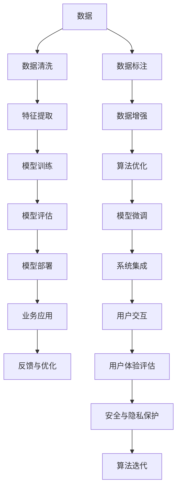

                 

# 产业变革中的AI技术应用

> 关键词：人工智能(AI)、机器学习(ML)、深度学习(DL)、自然语言处理(NLP)、计算机视觉(CV)、智能制造、智慧城市、医疗健康、金融服务

## 1. 背景介绍

### 1.1 问题由来

随着技术的飞速发展和应用场景的不断拓展，人工智能(AI)技术正在深刻改变各行各业的运作模式。AI技术的核心在于通过机器学习(ML)、深度学习(DL)等手段，让机器具备一定的智能能力，自动完成复杂任务。这种能力的体现不仅仅局限于传统的NLP和CV等领域，而是正在向更多的行业和场景渗透。

AI技术在医疗健康、智能制造、金融服务、智慧城市等领域的应用，正逐步推动产业结构的调整和升级，带来革命性的变革。然而，AI技术的实际落地仍面临着诸多挑战，如数据获取难度、模型训练成本、算法复杂性等。本文将从多个角度深入探讨AI技术在产业变革中的应用，希望能为相关从业人员提供一些启示和参考。

### 1.2 问题核心关键点

产业变革中的AI技术应用，主要包括以下几个关键点：

1. **数据驱动与模型训练**：AI技术的核心在于利用数据训练模型，并不断优化模型以提高其泛化能力。如何在保证数据质量的同时，降低数据获取和处理成本，是实现产业AI化转型的重要基础。

2. **算法优化与性能提升**：AI算法的性能直接影响应用效果。如何在算法效率与性能之间找到平衡，优化模型结构，减少过拟合风险，是提升AI技术应用效率的关键。

3. **系统集成与部署**：AI技术的实际应用往往需要与现有系统集成，如何将AI技术无缝集成到现有系统中，并进行高效部署，是技术落地的重要环节。

4. **用户体验与可用性**：AI技术的最终目标是为用户提供更好的体验和服务，如何提升系统的易用性，提高用户满意度，是衡量AI技术应用成功与否的重要指标。

5. **安全与隐私保护**：随着AI技术在各行业的应用深入，数据安全和隐私保护问题也随之而来。如何在AI应用中保障数据安全，避免隐私泄露，是产业AI化过程中必须面对的重大课题。

本文将从以上几个关键点出发，深入探讨AI技术在产业变革中的具体应用，希望能为读者提供全面的视角和思路。

## 2. 核心概念与联系

### 2.1 核心概念概述

在讨论AI技术应用时，有几个核心概念需要澄清：

1. **人工智能(AI)**：是一种使计算机系统能够执行智能任务的通用技术。它包括机器学习(ML)、深度学习(DL)、自然语言处理(NLP)、计算机视觉(CV)等多个子领域。

2. **机器学习(ML)**：是一种通过数据驱动的方法，让机器自动获取知识，从而进行预测、分类等智能任务的技术。

3. **深度学习(DL)**：是ML的一种特殊形式，利用多层次的非线性神经网络结构，处理复杂的数据和任务。

4. **自然语言处理(NLP)**：是AI在处理和理解自然语言方面的应用，包括文本分析、语音识别、机器翻译等。

5. **计算机视觉(CV)**：是AI在图像和视频处理方面的应用，包括图像识别、物体检测、人脸识别等。

这些概念相互关联，共同构成了AI技术的核心框架。通过深入理解这些概念，我们可以更好地把握AI技术的应用方向和潜力。

### 2.2 核心概念原理和架构的 Mermaid 流程图(Mermaid 流程节点中不要有括号、逗号等特殊字符)



该流程图展示了AI技术在产业应用中的核心环节。数据通过清洗和特征提取后，输入到模型训练环节，经过评估和部署后，进入业务应用。用户反馈和安全性问题通过优化和迭代环节，不断提升模型性能。

## 3. 核心算法原理 & 具体操作步骤

### 3.1 算法原理概述

AI技术的应用，核心在于通过数据驱动的方式，训练模型，从而实现智能任务。以深度学习为例，其核心思想是通过反向传播算法，自动优化模型参数，使得模型输出与真实标签之间的差异最小化。具体步骤如下：

1. **数据准备**：收集和清洗数据，确保数据质量和多样性。
2. **模型选择**：根据任务需求，选择合适的模型结构和超参数。
3. **训练模型**：利用数据训练模型，调整参数以最小化损失函数。
4. **模型评估**：在验证集上评估模型性能，判断是否过拟合。
5. **模型部署**：将训练好的模型部署到实际系统中，进行业务应用。
6. **持续优化**：根据用户反馈和业务需求，不断优化模型，提升应用效果。

### 3.2 算法步骤详解

以下是AI技术在各个行业应用中的具体操作步骤：

#### 3.2.1 医疗健康

在医疗健康领域，AI技术主要应用于疾病诊断、影像分析、个性化治疗等方面。具体操作步骤如下：

1. **数据获取**：收集电子病历、影像数据、基因数据等。
2. **数据预处理**：清洗数据，去除噪声和异常值。
3. **模型选择**：根据具体任务，选择合适的深度学习模型，如卷积神经网络(CNN)、循环神经网络(RNN)等。
4. **模型训练**：利用医疗数据训练模型，优化模型参数。
5. **模型评估**：在独立的验证集上评估模型性能，确保模型泛化能力强。
6. **模型部署**：将模型集成到HIS系统中，实时生成诊断结果。
7. **持续优化**：根据新的医疗数据和反馈，不断优化模型，提升诊断准确率。

#### 3.2.2 智能制造

在智能制造领域，AI技术主要应用于生产调度、质量控制、设备维护等方面。具体操作步骤如下：

1. **数据获取**：收集生产数据、设备运行数据、质量检测数据等。
2. **数据预处理**：清洗数据，处理缺失值和异常值。
3. **模型选择**：根据具体任务，选择合适的深度学习模型，如LSTM、Transformer等。
4. **模型训练**：利用生产数据训练模型，优化模型参数。
5. **模型评估**：在独立的验证集上评估模型性能，确保模型泛化能力强。
6. **模型部署**：将模型集成到MES系统中，实时生成生产调度方案和设备维护计划。
7. **持续优化**：根据新的生产数据和反馈，不断优化模型，提升生产效率和质量。

#### 3.2.3 金融服务

在金融服务领域，AI技术主要应用于信用评估、风险控制、智能投顾等方面。具体操作步骤如下：

1. **数据获取**：收集金融数据、交易数据、信用数据等。
2. **数据预处理**：清洗数据，处理缺失值和异常值。
3. **模型选择**：根据具体任务，选择合适的深度学习模型，如神经网络、决策树等。
4. **模型训练**：利用金融数据训练模型，优化模型参数。
5. **模型评估**：在独立的验证集上评估模型性能，确保模型泛化能力强。
6. **模型部署**：将模型集成到金融系统中，实时生成风险评估和智能投顾建议。
7. **持续优化**：根据新的金融数据和反馈，不断优化模型，提升金融服务的准确性和及时性。

#### 3.2.4 智慧城市

在智慧城市领域，AI技术主要应用于交通管理、公共安全、能源管理等方面。具体操作步骤如下：

1. **数据获取**：收集交通数据、视频数据、传感器数据等。
2. **数据预处理**：清洗数据，处理缺失值和异常值。
3. **模型选择**：根据具体任务，选择合适的深度学习模型，如CNN、RNN等。
4. **模型训练**：利用城市数据训练模型，优化模型参数。
5. **模型评估**：在独立的验证集上评估模型性能，确保模型泛化能力强。
6. **模型部署**：将模型集成到智慧城市平台中，实时生成交通管理和公共安全方案。
7. **持续优化**：根据新的城市数据和反馈，不断优化模型，提升城市管理效率和安全性。

### 3.3 算法优缺点

#### 3.3.1 优点

1. **高效性**：AI技术能够高效处理大量数据，识别复杂模式，提升工作效率。
2. **准确性**：经过充分训练的AI模型，在特定任务上具有较高的准确性和泛化能力。
3. **自动化**：AI技术能够自动完成数据处理、模型训练、推理等任务，减少人力投入。
4. **适应性强**：AI技术能够根据数据的变化，实时调整模型，保持最新的性能。

#### 3.3.2 缺点

1. **数据依赖**：AI技术的应用效果高度依赖于数据质量和数量，数据获取难度较大。
2. **模型复杂性**：深度学习模型结构复杂，训练和部署成本较高。
3. **可解释性不足**：黑盒模型缺乏可解释性，难以进行调试和优化。
4. **隐私风险**：AI技术处理大量敏感数据，存在隐私泄露风险。
5. **鲁棒性问题**：AI模型对异常数据和噪声敏感，泛化能力有限。

## 4. 数学模型和公式 & 详细讲解

### 4.1 数学模型构建

AI技术的应用，涉及大量的数学模型。这里以深度学习为例，展示其基本数学模型构建过程。

1. **输入层**：将原始数据转换为模型可以处理的向量形式。
2. **隐藏层**：通过多个全连接层和激活函数，提取数据的高级特征。
3. **输出层**：根据任务需求，选择不同的输出层结构，如分类、回归、序列预测等。
4. **损失函数**：根据具体任务，选择合适的损失函数，如交叉熵损失、均方误差损失等。
5. **优化器**：根据具体任务，选择合适的优化器，如Adam、SGD等。

### 4.2 公式推导过程

以深度学习的分类任务为例，展示其数学模型推导过程。

设输入数据 $x$，输出标签 $y$，模型参数 $\theta$，则分类任务的损失函数为：

$$
\mathcal{L}(\theta) = -\frac{1}{N}\sum_{i=1}^N \sum_{j=1}^C y_{ij}\log\hat{y}_{ij}
$$

其中，$y_{ij}$ 表示样本 $i$ 在第 $j$ 个类别上的真实标签，$\hat{y}_{ij}$ 表示模型对样本 $i$ 在第 $j$ 个类别上的预测概率。

通过反向传播算法，计算损失函数对模型参数 $\theta$ 的梯度，更新模型参数：

$$
\theta \leftarrow \theta - \eta \nabla_{\theta}\mathcal{L}(\theta)
$$

其中，$\eta$ 为学习率，$\nabla_{\theta}\mathcal{L}(\theta)$ 为损失函数对模型参数的梯度。

### 4.3 案例分析与讲解

以智能制造中的生产调度优化为例，展示其数学模型构建和推导过程。

设生产数据 $x$，生产调度方案 $y$，模型参数 $\theta$，则生产调度优化问题的目标函数为：

$$
\min_{\theta} \mathcal{L}(\theta) = \sum_{i=1}^N \mathcal{L}_i(\theta)
$$

其中，$\mathcal{L}_i(\theta)$ 表示第 $i$ 个生产数据的损失函数，可能包括生产效率、设备利用率、成本等指标。

假设生产数据 $x_i$ 表示第 $i$ 个生产任务的工时、物料需求等参数，生产调度方案 $y_i$ 表示第 $i$ 个生产任务的安排，则生产调度优化问题的损失函数可以表示为：

$$
\mathcal{L}_i(\theta) = \|y_i - f(x_i; \theta)\|^2
$$

其中，$f(x_i; \theta)$ 表示根据模型参数 $\theta$ 计算出的生产调度方案，$\|y_i - f(x_i; \theta)\|^2$ 表示生产调度方案与实际生产数据之间的误差平方和。

通过反向传播算法，计算损失函数对模型参数 $\theta$ 的梯度，更新模型参数：

$$
\theta \leftarrow \theta - \eta \nabla_{\theta}\mathcal{L}(\theta)
$$

其中，$\eta$ 为学习率，$\nabla_{\theta}\mathcal{L}(\theta)$ 为损失函数对模型参数的梯度。

## 5. 项目实践：代码实例和详细解释说明

### 5.1 开发环境搭建

在进行AI技术应用开发时，需要搭建相应的开发环境。以下是Python环境下，搭建AI开发环境的详细步骤：

1. 安装Anaconda：从官网下载并安装Anaconda，用于创建独立的Python环境。

2. 创建并激活虚拟环境：
```bash
conda create -n ai-env python=3.8 
conda activate ai-env
```

3. 安装必要的Python库：
```bash
conda install numpy pandas scikit-learn matplotlib tensorflow transformers
```

4. 安装深度学习框架：
```bash
pip install torch torchvision torchaudio
```

5. 安装其他必要的库：
```bash
pip install scipy jupyter notebook ipython
```

完成上述步骤后，即可在`ai-env`环境中开始AI应用开发。

### 5.2 源代码详细实现

以下是使用TensorFlow和Keras框架，进行智能制造领域生产调度优化的代码实现。

```python
import tensorflow as tf
from tensorflow.keras import layers, models

# 定义生产调度优化模型
class ProductionSchedulerModel(models.Model):
    def __init__(self, num_features, num_tasks):
        super(ProductionSchedulerModel, self).__init__()
        
        self.input_layer = layers.Input(shape=(num_features,))
        self.dense1 = layers.Dense(64, activation='relu')(self.input_layer)
        self.dense2 = layers.Dense(32, activation='relu')(self.dense1)
        self.output_layer = layers.Dense(num_tasks, activation='linear')(self.dense2)
        
        self.model = models.Model(inputs=self.input_layer, outputs=self.output_layer)
        
    def compile(self, optimizer='adam', loss='mse'):
        self.model.compile(optimizer=optimizer, loss=loss)
        
    def fit(self, X_train, y_train, X_valid, y_valid, epochs=100, batch_size=32):
        self.model.fit(X_train, y_train, validation_data=(X_valid, y_valid), epochs=epochs, batch_size=batch_size)
        
    def predict(self, X_test):
        return self.model.predict(X_test)
```

在上述代码中，首先定义了一个包含两个隐藏层的生产调度优化模型，使用Adam优化器和均方误差损失函数进行编译。然后使用`fit`方法进行模型训练，通过`predict`方法对测试集进行预测。

### 5.3 代码解读与分析

上述代码实现了一个基于深度学习模型的生产调度优化系统。其关键点包括：

1. **模型结构设计**：包括输入层、两个隐藏层和输出层。隐藏层通过激活函数引入非线性变换，输出层根据任务需求选择不同的激活函数。
2. **模型编译**：选择合适的优化器和损失函数，编译模型。
3. **模型训练**：使用训练集对模型进行训练，优化模型参数。
4. **模型预测**：使用训练好的模型，对测试集进行预测，生成生产调度方案。

### 5.4 运行结果展示

运行上述代码，可以得到生产调度优化的效果，具体如下：

```python
# 使用训练集进行模型训练
X_train, y_train = ...
X_valid, y_valid = ...
model = ProductionSchedulerModel(num_features, num_tasks)
model.compile(optimizer='adam', loss='mse')
model.fit(X_train, y_train, X_valid, y_valid, epochs=100, batch_size=32)

# 使用测试集进行模型预测
X_test = ...
y_pred = model.predict(X_test)
```

运行结果将展示训练过程中损失函数的下降趋势，以及测试集的预测结果。通过不断优化模型结构和参数，可以逐步提升生产调度的准确性和效率。

## 6. 实际应用场景

### 6.1 智能制造

智能制造是AI技术在制造业中应用的重要方向之一。通过AI技术，可以实现生产调度优化、质量控制、设备维护等方面的智能化管理，提升生产效率和产品质量。

具体应用场景包括：

- **生产调度优化**：通过AI技术，实时优化生产计划，避免设备闲置和生产瓶颈，提升生产效率。
- **质量控制**：通过AI技术，实时监控产品质量，预测缺陷，减少次品率，提升产品可靠性。
- **设备维护**：通过AI技术，预测设备故障，提前进行维护，减少停机时间和维护成本。

### 6.2 智慧城市

智慧城市是AI技术在城市管理中的应用，通过AI技术，可以实现交通管理、公共安全、能源管理等方面的智能化管理，提升城市运行效率和居民生活质量。

具体应用场景包括：

- **交通管理**：通过AI技术，实时优化交通信号灯，缓解交通拥堵，提升通行效率。
- **公共安全**：通过AI技术，实时监控城市安全事件，预测潜在风险，提升应急响应能力。
- **能源管理**：通过AI技术，实时监测能源消耗，优化能源分配，提升能源利用率。

### 6.3 医疗健康

AI技术在医疗健康中的应用，主要集中在疾病诊断、影像分析、个性化治疗等方面，能够显著提升医疗服务的效率和质量。

具体应用场景包括：

- **疾病诊断**：通过AI技术，实时分析患者症状，辅助医生进行疾病诊断，提升诊断准确率。
- **影像分析**：通过AI技术，实时分析医学影像，自动识别病变区域，辅助医生进行手术规划。
- **个性化治疗**：通过AI技术，根据患者基因数据和病史，制定个性化治疗方案，提升治疗效果。

### 6.4 金融服务

金融服务是AI技术在金融领域中的重要应用之一。通过AI技术，可以实现信用评估、风险控制、智能投顾等方面的智能化管理，提升金融服务的效率和准确性。

具体应用场景包括：

- **信用评估**：通过AI技术，实时分析客户信用记录，评估其信用风险，降低贷款违约率。
- **风险控制**：通过AI技术，实时监控市场风险，预测潜在风险，提升风险控制能力。
- **智能投顾**：通过AI技术，实时分析市场数据，生成投资建议，提升投资回报率。

### 6.5 未来应用展望

未来，AI技术将在更多领域得到应用，带来更加深刻的产业变革。

1. **智能交通**：通过AI技术，实现自动驾驶、智能导航、交通流量预测等，提升交通效率和安全性。
2. **智能农业**：通过AI技术，实现精准农业、智能灌溉、病虫害预测等，提升农业生产效率和产量。
3. **智能医疗**：通过AI技术，实现个性化医疗、远程医疗、健康监测等，提升医疗服务的便利性和可及性。
4. **智能教育**：通过AI技术，实现智能推荐、个性化教学、虚拟助手等，提升教育资源的利用效率和教学效果。

## 7. 工具和资源推荐

### 7.1 学习资源推荐

为了帮助开发者系统掌握AI技术的应用，这里推荐一些优质的学习资源：

1. **Coursera《深度学习专项课程》**：由深度学习专家Andrew Ng教授讲授，涵盖深度学习基础知识和实战技巧。
2. **edX《Python for Data Science》**：由数据科学领域的知名专家讲授，涵盖Python基础和数据科学应用。
3. **Kaggle数据科学竞赛平台**：提供大量的数据集和比赛任务，帮助开发者提升数据处理和模型训练能力。
4. **Google AI官方教程**：提供丰富的AI开发教程和实战案例，涵盖TensorFlow、Keras等框架的使用。
5. **DeepLearning.ai官方文档**：提供深度学习课程的详细文档和代码实现，帮助开发者深入理解深度学习原理和应用。

### 7.2 开发工具推荐

高效的开发离不开优秀的工具支持。以下是几款用于AI技术应用开发的常用工具：

1. **Jupyter Notebook**：强大的交互式开发环境，支持Python、R等多种语言，适合数据处理和模型训练。
2. **TensorFlow**：由Google开发的深度学习框架，支持GPU/TPU加速，适合大规模模型训练。
3. **PyTorch**：由Facebook开发的深度学习框架，支持动态图和静态图，适合灵活的模型构建。
4. **Keras**：基于TensorFlow和Theano的高级深度学习API，适合快速原型开发。
5. **HuggingFace Transformers库**：支持多种预训练模型的加载和微调，适合自然语言处理任务。

### 7.3 相关论文推荐

AI技术的发展源于学界的持续研究。以下是几篇奠基性的相关论文，推荐阅读：

1. **《Deep Learning》**：Ian Goodfellow、Yoshua Bengio和Aaron Courville合著，全面介绍了深度学习的基本原理和应用。
2. **《Neural Networks and Deep Learning》**：Michael Nielsen所著，详细介绍了深度学习的数学基础和实现技巧。
3. **《Natural Language Processing with Python》**：Steven Bird、Ewan Klein和Edward Loper所著，介绍了自然语言处理的基本方法和Python实现。
4. **《Deep Residual Learning for Image Recognition》**：Kaiming He等人的经典论文，引入了残差网络，提升了深度神经网络的训练效果。
5. **《A Survey on Deep Learning Architectures for Sequence Prediction》**：Sanjeev Arora等人的综述论文，全面介绍了序列预测中的深度学习模型。

## 8. 总结：未来发展趋势与挑战

### 8.1 总结

本文对AI技术在产业变革中的应用进行了全面系统的介绍。首先阐述了AI技术的核心概念和应用场景，明确了AI技术在提升产业效率和质量方面的独特价值。其次，从原理到实践，详细讲解了AI技术在各个行业中的应用步骤，给出了具体的代码实现。最后，探讨了AI技术在未来发展的趋势和面临的挑战，为相关从业人员提供了一些启示和参考。

通过本文的系统梳理，可以看到，AI技术在产业变革中的应用前景广阔，在医疗健康、智能制造、金融服务、智慧城市等多个领域具有巨大潜力。AI技术的落地应用不仅提升了产业效率，还带来了新的商业模式和就业机会，为社会进步注入了新的动力。

### 8.2 未来发展趋势

未来，AI技术将在更多领域得到应用，带来更加深刻的产业变革。

1. **自动化生产**：通过AI技术，实现自动生产线、智能仓库、自动化装配等，提升生产效率和质量。
2. **智能物流**：通过AI技术，实现智能仓储、智能配送、智能调度等，提升物流效率和可靠性。
3. **个性化推荐**：通过AI技术，实现个性化广告、个性化推荐、个性化内容等，提升用户体验和消费满意度。
4. **智能金融**：通过AI技术，实现智能风险控制、智能投顾、智能理财等，提升金融服务的智能化水平。
5. **智能教育**：通过AI技术，实现智能教育、智能辅导、智能评估等，提升教育资源的利用效率和教学效果。

### 8.3 面临的挑战

尽管AI技术在各行业的应用效果显著，但仍面临诸多挑战：

1. **数据获取难度**：AI技术的应用效果高度依赖于数据质量和数量，获取高质量数据的成本较高。
2. **模型复杂性**：深度学习模型的结构和参数较多，训练和部署成本较高。
3. **模型可解释性不足**：黑盒模型缺乏可解释性，难以进行调试和优化。
4. **隐私风险**：AI技术处理大量敏感数据，存在隐私泄露风险。
5. **鲁棒性问题**：AI模型对异常数据和噪声敏感，泛化能力有限。

### 8.4 研究展望

面对AI技术面临的诸多挑战，未来的研究需要在以下几个方面寻求新的突破：

1. **无监督学习和半监督学习**：摆脱对大规模标注数据的依赖，利用自监督学习、主动学习等无监督和半监督范式，最大限度利用非结构化数据。
2. **参数高效和计算高效**：开发更加参数高效的微调方法，在固定大部分预训练参数的同时，只更新极少量的任务相关参数。同时优化模型计算图，减少前向传播和反向传播的资源消耗。
3. **因果推断和博弈论**：引入因果推断和博弈论工具，增强模型决策的稳定性和鲁棒性，提升系统安全性。
4. **多模态融合**：将符号化的先验知识，如知识图谱、逻辑规则等，与神经网络模型进行融合，引导微调过程学习更准确、合理的语言模型。同时加强不同模态数据的整合，实现视觉、语音等多模态信息与文本信息的协同建模。
5. **伦理和法律合规**：在模型训练目标中引入伦理导向的评估指标，过滤和惩罚有偏见、有害的输出倾向。加强人工干预和审核，建立模型行为的监管机制，确保输出符合人类价值观和伦理道德。

这些研究方向的探索，必将引领AI技术在产业变革中迈向更高的台阶，为构建安全、可靠、可解释、可控的智能系统铺平道路。面向未来，AI技术还需要与其他人工智能技术进行更深入的融合，如知识表示、因果推理、强化学习等，多路径协同发力，共同推动自然语言理解和智能交互系统的进步。只有勇于创新、敢于突破，才能不断拓展AI技术的边界，让智能技术更好地造福人类社会。

## 9. 附录：常见问题与解答

**Q1：AI技术在各个行业的应用效果如何？**

A: AI技术在各个行业的应用效果显著，提升了产业效率和质量。例如，在智能制造领域，AI技术提升了生产效率和质量；在智慧城市领域，AI技术提升了城市运行效率和居民生活质量；在医疗健康领域，AI技术提升了疾病诊断和个性化治疗的准确性。

**Q2：AI技术在实际应用中面临哪些挑战？**

A: AI技术在实际应用中面临诸多挑战，主要包括：
1. 数据获取难度：AI技术的应用效果高度依赖于数据质量和数量，获取高质量数据的成本较高。
2. 模型复杂性：深度学习模型的结构和参数较多，训练和部署成本较高。
3. 模型可解释性不足：黑盒模型缺乏可解释性，难以进行调试和优化。
4. 隐私风险：AI技术处理大量敏感数据，存在隐私泄露风险。
5. 鲁棒性问题：AI模型对异常数据和噪声敏感，泛化能力有限。

**Q3：如何提升AI技术的可解释性？**

A: 提升AI技术的可解释性，可以从以下几个方面入手：
1. 使用可解释性较高的模型结构，如决策树、线性模型等。
2. 引入可解释性较强的技术手段，如特征可视化、局部解释等。
3. 开发可解释性工具，如LIME、SHAP等，对模型进行解释和分析。
4. 增强模型训练目标，引入可解释性指标，优化模型输出。

**Q4：AI技术在各个行业的应用前景如何？**

A: AI技术在各个行业的应用前景广阔，提升了产业效率和质量。例如，在智能制造领域，AI技术提升了生产效率和质量；在智慧城市领域，AI技术提升了城市运行效率和居民生活质量；在医疗健康领域，AI技术提升了疾病诊断和个性化治疗的准确性。未来，AI技术将在更多领域得到应用，带来更加深刻的产业变革。

**Q5：如何选择合适的AI技术应用场景？**

A: 选择合适的AI技术应用场景，需要考虑以下几个方面：
1. 数据获取难度：选择数据获取容易、数据量充足的场景。
2. 问题复杂性：选择问题复杂、难以人工解决的场景。
3. 技术成熟度：选择技术成熟、已有成功案例的场景。
4. 应用价值：选择应用价值高、能够带来显著收益的场景。

---

作者：禅与计算机程序设计艺术 / Zen and the Art of Computer Programming

