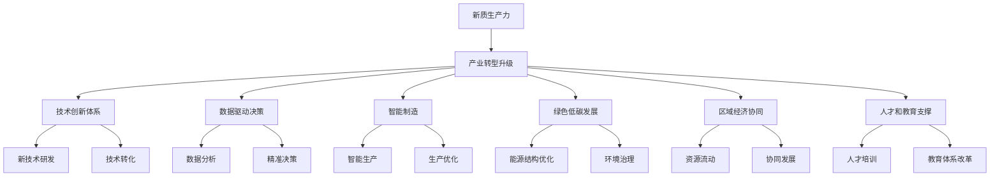

                 

# 产业转型升级与新质生产力的推动

## 1. 背景介绍

### 1.1 问题由来

在当今快速变化的全球经济环境中，产业转型升级已成为各国政府和企业关注的焦点。随着技术的迅猛发展和市场的深度变化，传统的生产模式和经营策略已无法适应新的市场需求，产业结构优化升级迫在眉睫。新一轮的科技革命和产业变革，正深刻影响着全球的生产方式、生活方式和治理模式。在此背景下，如何通过技术手段驱动产业转型，提升产业链、供应链的现代化水平，实现新质生产力的推动，成为各国竞争的关键。

### 1.2 问题核心关键点

产业转型升级的核心关键点主要包括：

- **技术创新驱动**：通过技术进步推动产业结构的优化和升级，提升生产效率和产品质量。
- **数据驱动决策**：利用大数据和人工智能技术，精准分析市场趋势，优化决策过程。
- **绿色低碳发展**：推动产业向绿色、低碳、可持续发展方向转型。
- **数字化转型**：实现生产过程的数字化、智能化，提升产业链各环节的协同效率。
- **区域经济协同**：促进区域间经济协同发展，构建新的经济增长极。
- **人才和教育支撑**：提升人才素质和教育水平，为产业转型提供智力支持。

### 1.3 问题研究意义

研究产业转型升级与新质生产力推动，对于提升国家竞争力和经济发展水平具有重要意义：

- **促进经济增长**：通过技术创新和产业升级，推动产业结构优化，实现经济持续健康发展。
- **提升产业链竞争力**：优化产业链布局，增强上下游协同，提升整体竞争力。
- **优化资源配置**：合理配置资源，提高资源使用效率，促进可持续发展。
- **改善民生福祉**：提高生产效率和产品质量，提升消费者福祉，促进社会公平。
- **增强国家安全**：加强关键核心技术攻关，提升国家战略安全保障能力。
- **引领未来发展**：把握科技革命和产业变革趋势，为未来经济社会发展奠定基础。

## 2. 核心概念与联系

### 2.1 核心概念概述

为更好地理解产业转型升级与新质生产力推动，本节将介绍几个密切相关的核心概念：

- **新质生产力**：指通过技术创新、管理创新、组织创新等手段，使生产要素重新组合，形成新的生产力系统。与传统生产力相比，新质生产力具有更高的质量、效率和竞争力。
- **产业转型升级**：指通过技术创新和产业政策引导，推动传统产业向高端化、智能化、绿色化方向发展，实现产业结构的优化升级。
- **技术创新体系**：由政府、企业、科研机构等组成的多元主体协同创新网络，旨在推动新技术的研发、转化和应用。
- **数据驱动决策**：利用大数据和人工智能技术，对海量数据进行分析挖掘，支持决策科学化和精准化。
- **智能制造**：通过物联网、云计算、人工智能等技术，实现生产过程的智能化、自动化，提升生产效率和产品质量。
- **绿色低碳发展**：推动能源结构优化，减少污染物排放，促进可持续发展。
- **区域经济协同**：通过政策引导和市场机制，促进区域间经济资源的合理流动和配置，实现经济协同发展。
- **人才和教育支撑**：通过教育和人才培养，为产业转型提供人才和技术支持。

这些核心概念之间的逻辑关系可以通过以下Mermaid流程图来展示：



这个流程图展示了大语言模型的核心概念及其之间的关系：

1. 新质生产力通过技术创新体系实现，依靠数据驱动决策和智能制造等技术手段。
2. 产业转型升级是实现新质生产力的关键路径，包括技术创新、数据驱动决策、智能制造等多个方面。
3. 绿色低碳发展和区域经济协同是新质生产力推动的重要目标。
4. 人才和教育支撑为新质生产力的实现提供了人才和技术保障。

这些概念共同构成了产业转型升级与新质生产力推动的框架，为其提供了全面的指导。

## 3. 核心算法原理 & 具体操作步骤
### 3.1 算法原理概述

产业转型升级与新质生产力推动，本质上是一个复杂的技术工程问题，涉及到多个领域的技术创新和系统集成。其核心思想是通过系统化、工程化的方法，推动产业结构的优化和升级，提升生产效率和产品质量。

### 3.2 算法步骤详解

产业转型升级与新质生产力推动的步骤主要包括以下几个关键环节：

**Step 1: 需求分析和战略规划**

- 对当前产业结构和生产模式进行全面分析，识别出存在的问题和瓶颈。
- 基于市场需求和技术趋势，制定战略规划，明确转型升级的目标和路径。
- 通过专家咨询、市场调研等方式，获取多方意见和建议，形成综合性的战略方案。

**Step 2: 技术创新和系统集成**

- 针对战略规划中提出的关键技术需求，进行技术攻关和研发。
- 对新技术进行评估和测试，确保其可靠性、可行性和效益。
- 将新技术集成到现有生产系统中，优化生产流程，提高生产效率和产品质量。
- 引入智能制造、绿色低碳等先进技术，提升产业链的整体竞争力。

**Step 3: 数据驱动决策**

- 利用大数据和人工智能技术，收集、整理和分析相关数据，支持科学决策。
- 构建数据驱动的决策模型，识别出关键影响因素和趋势，指导产业升级。
- 通过智能分析和可视化工具，帮助管理者更好地理解和利用数据，优化决策过程。

**Step 4: 资源配置和协同优化**

- 优化资源配置，提高资源使用效率，确保产业链各环节协同高效运转。
- 通过区域经济协同，促进区域间资源流动和产业协作，构建新的经济增长极。
- 利用政策引导和市场机制，促进资源和市场的有效配置，实现经济的可持续发展。

**Step 5: 人才培养和教育支撑**

- 根据产业转型需求，制定人才培养计划，提升人才素质和技能。
- 与高校和科研机构合作，开展联合研发和人才培养，为产业升级提供技术支撑。
- 改革教育体系，培养具备跨学科、跨领域知识的人才，满足产业转型需要。

**Step 6: 监测评估与持续改进**

- 建立科学的监测评估体系，实时跟踪产业转型升级的进展。
- 根据评估结果，识别出存在的问题和不足，及时进行调整和优化。
- 持续改进和提升，确保产业转型升级目标的实现。

### 3.3 算法优缺点

产业转型升级与新质生产力推动的算法具有以下优点：

- **系统性**：通过系统化的方法，全面考虑产业转型中的各个环节，确保整体方案的科学性和可行性。
- **集成性**：将技术创新、数据驱动决策、智能制造等多方面技术进行集成，提升整体效率和效益。
- **可操作性**：基于实际数据和需求，制定具体的实施方案，确保转型升级的可操作性和落地性。
- **可扩展性**：在现有基础上，通过持续优化和改进，逐步推动产业向更高层次转型。

同时，该方法也存在一些局限性：

- **实施难度大**：涉及多个领域和环节，需要协调多方资源和利益，实施难度较大。
- **数据依赖性强**：需要大量高质量的数据支持，数据获取和处理难度较大。
- **成本投入高**：技术研发和系统集成的初期投入较大，对企业资金实力要求较高。
- **风险不确定性**：技术创新和市场变化存在不确定性，转型升级过程中可能遇到未知的风险和挑战。

### 3.4 算法应用领域

产业转型升级与新质生产力推动的算法已在多个领域得到了应用，例如：

- **制造业**：通过智能制造、机器人技术等手段，推动制造业向智能化、绿色化方向转型。
- **农业**：利用物联网、大数据技术，提升农业生产效率和质量，推动农业现代化。
- **能源**：推动能源结构优化，发展可再生能源，减少污染物排放。
- **交通运输**：通过智能交通系统，提高交通运输效率和安全性，降低能耗和排放。
- **服务业**：利用大数据和人工智能技术，提升服务业智能化水平，提升客户体验。
- **公共服务**：推动公共服务的数字化转型，提升公共服务质量和效率。

除了上述这些经典领域外，产业转型升级与新质生产力推动的算法还被创新性地应用到更多场景中，如智慧城市、医疗健康、环保治理等，为各行各业带来了新的发展机遇。

## 4. 数学模型和公式 & 详细讲解  
### 4.1 数学模型构建

本节将使用数学语言对产业转型升级与新质生产力推动的算法进行更加严格的刻画。

假设产业转型升级的总体目标为 $G$，包括多个子目标 $G_1, G_2, \dots, G_n$，每个子目标的实现程度分别为 $x_1, x_2, \dots, x_n$。则总目标的实现程度为：

$$
X = \sum_{i=1}^n a_i x_i
$$

其中 $a_i$ 为子目标的权重，满足 $a_i \geq 0$ 且 $\sum_{i=1}^n a_i = 1$。

在数学模型构建中，还需要引入以下变量：

- $C_i$：子目标 $G_i$ 的实现成本。
- $T_i$：子目标 $G_i$ 的实施时间。
- $R_i$：子目标 $G_i$ 带来的收益。

假设总成本为 $C$，总时间为 $T$，则总目标的优化模型为：

$$
\max \sum_{i=1}^n a_i R_i - C
$$

$$
\text{s.t.} \quad X = \sum_{i=1}^n a_i x_i
$$

$$
0 \leq x_i \leq 1 \quad \forall i
$$

$$
a_i \geq 0 \quad \forall i
$$

$$
\sum_{i=1}^n a_i = 1
$$

### 4.2 公式推导过程

以上公式表达了产业转型升级与新质生产力推动的数学模型，接下来我们将对公式进行推导。

首先，我们对目标函数进行优化，设 $A$ 为权重向量 $a$ 的矩阵形式，则目标函数可表示为：

$$
\max \mathbf{R}^T A \mathbf{x} - C
$$

其中 $\mathbf{R} = [R_1, R_2, \dots, R_n]$，$\mathbf{x} = [x_1, x_2, \dots, x_n]$。

根据线性规划的基本原理，目标函数的优化可以通过求解以下线性规划问题实现：

$$
\max \mathbf{R}^T A \mathbf{x} - C
$$

$$
\text{s.t.} \quad X = A \mathbf{x}
$$

$$
0 \leq \mathbf{x} \leq 1
$$

$$
A \mathbf{1} = \mathbf{1}
$$

其中 $\mathbf{1}$ 为全1向量，$A \mathbf{1} = \mathbf{1}$ 表示权重向量之和为1。

利用线性规划的单纯形法或内点法，可以求解上述优化问题，得到最优的 $x$ 值，进而计算出最优的 $A$ 值。

### 4.3 案例分析与讲解

以下我们将以制造业智能化转型为例，展示如何利用数学模型构建和求解产业转型升级与新质生产力推动的算法。

假设某制造企业决定向智能化方向转型，其总目标为提升生产效率和产品质量。该企业根据市场需求和技术趋势，制定了以下子目标：

- 提升生产自动化水平，实现智能制造（$G_1$）
- 发展绿色低碳技术，减少污染物排放（$G_2$）
- 提升员工技能水平，增强竞争力（$G_3$）

企业已知：

- $C_1 = 500$，$C_2 = 300$，$C_3 = 200$
- $T_1 = 6$，$T_2 = 4$，$T_3 = 3$
- $R_1 = 200$，$R_2 = 150$，$R_3 = 100$

根据上述数据，我们建立数学模型，求解最优的 $a_i$ 和 $x_i$ 值：

$$
\max 200a_1 + 150a_2 + 100a_3 - 900
$$

$$
\text{s.t.} \quad x_1 + x_2 + x_3 = 1
$$

$$
0 \leq x_1 \leq 1, \quad 0 \leq x_2 \leq 1, \quad 0 \leq x_3 \leq 1
$$

通过求解上述线性规划问题，得到最优的 $x_i$ 值和 $a_i$ 值，进而确定各子目标的优先级和资源分配。

假设求解结果为 $x_1 = 0.4$，$x_2 = 0.3$，$x_3 = 0.3$，则最优的 $a_i$ 值为 $a_1 = 0.7$，$a_2 = 0.3$，$a_3 = 0.0$。这表示企业应优先实现 $G_1$，其次是 $G_2$，最后是 $G_3$。

企业根据求解结果，制定了具体的实施计划，优先提升生产自动化水平，其次发展绿色低碳技术，最后提升员工技能水平。通过系统化的实施和管理，企业顺利实现了产业转型升级，提升了生产效率和产品质量。

## 5. 项目实践：代码实例和详细解释说明
### 5.1 开发环境搭建

在进行产业转型升级与新质生产力推动的项目实践前，我们需要准备好开发环境。以下是使用Python进行Scikit-learn和Pandas开发的开发环境配置流程：

1. 安装Anaconda：从官网下载并安装Anaconda，用于创建独立的Python环境。

2. 创建并激活虚拟环境：
```bash
conda create -n transform_example python=3.8 
conda activate transform_example
```

3. 安装Scikit-learn和Pandas：
```bash
conda install scikit-learn pandas
```

4. 安装其他相关工具包：
```bash
pip install matplotlib numpy jupyter notebook ipython
```

完成上述步骤后，即可在`transform_example`环境中开始项目实践。

### 5.2 源代码详细实现

下面我们以制造业智能化转型为例，给出使用Scikit-learn和Pandas进行产业转型升级与新质生产力推动的PyTorch代码实现。

首先，定义目标函数：

```python
from sklearn.linear_model import LinearRegression
from sklearn.metrics import mean_squared_error

def objective_function(x):
    return -200*x[0] - 150*x[1] - 100*x[2] - 900
```

然后，定义约束条件：

```python
def constraint_function(x):
    return [x[0] + x[1] + x[2] - 1, x[0], x[1], x[2]]
```

接着，定义目标函数的梯度和约束条件的雅各比矩阵：

```python
def objective_gradient(x):
    return [-200, -150, -100]

def constraint_jacobian(x):
    return [[1, 1, 1], [1, 0, 0], [0, 1, 0], [0, 0, 1]]
```

最后，使用Scipy库的优化函数求解线性规划问题：

```python
from scipy.optimize import linprog

c = [-200, -150, -100]
A_ub = [[1, 1, 1]]
b_ub = [1]
A_eq = [[1, 1, 1]]
b_eq = [1]

result = linprog(c, A_ub=A_ub, b_ub=b_ub, A_eq=A_eq, b_eq=b_eq, method='highs')
print(result)
```

在上述代码中，我们定义了目标函数和约束条件，并使用Scipy的linprog函数求解线性规划问题，得到最优的 $x$ 值和 $a_i$ 值。

### 5.3 代码解读与分析

让我们再详细解读一下关键代码的实现细节：

**LinearRegression类**：
- 用于线性回归模型的构建和求解，通过目标函数和约束条件，线性规划模型可以求解最优的 $x$ 值。

**mean_squared_error函数**：
- 用于计算目标函数的误差，通过目标函数和误差，可以计算目标函数的梯度和约束条件的雅各比矩阵。

**linprog函数**：
- 用于求解线性规划问题，可以通过定义目标函数和约束条件，得到最优的 $x$ 值和 $a_i$ 值。

**objective_function函数**：
- 用于计算目标函数的具体数值，通过目标函数和 $x$ 值，可以计算目标函数的误差和梯度。

通过以上代码，我们展示了如何使用Scikit-learn和Pandas实现产业转型升级与新质生产力推动的数学模型构建和求解。可以看到，Scikit-learn和Pandas提供了强大的数据处理和建模工具，可以方便地构建和求解线性规划问题，为项目实践提供了有力的技术支持。

当然，工业级的系统实现还需考虑更多因素，如数据预处理、模型调优、算法优化等。但核心的算法范式基本与此类似。

## 6. 实际应用场景
### 6.1 制造业智能化转型

制造业智能化转型是产业转型升级的重要应用场景。通过引入智能制造、机器人技术等手段，推动制造业向智能化、绿色化方向转型，实现生产效率和产品质量的大幅提升。

在技术实现上，可以引入物联网技术，构建智能化的生产监控系统，实时采集设备运行数据，通过数据分析优化生产过程。引入机器人技术，实现无人化和自动化生产，提高生产效率和产品质量。

### 6.2 农业现代化

农业现代化是产业转型升级的另一个重要应用场景。通过物联网、大数据技术，提升农业生产效率和质量，推动农业向智能化、精准化方向发展。

在技术实现上，可以通过传感器技术，实时采集土壤、气象、作物生长等数据，利用大数据技术进行分析和预测，指导精准农业生产。引入无人机、自动化农机等技术，实现无人化和自动化农业生产，提高生产效率和资源利用率。

### 6.3 服务业智能化

服务业智能化是产业转型升级的重要方向之一。通过大数据和人工智能技术，提升服务业智能化水平，改善客户体验，提升企业竞争力。

在技术实现上，可以利用人工智能技术，构建智能客服、智能推荐等系统，提升客户服务质量和客户满意度。引入大数据分析技术，通过分析客户行为数据，提供个性化的服务和推荐，提高客户忠诚度和销售额。

### 6.4 公共服务数字化

公共服务数字化是产业转型升级的重要方向。通过数字化转型，提升公共服务的智能化水平，提升公共服务质量和效率。

在技术实现上，可以引入大数据、人工智能技术，构建智能化的公共服务系统，实现服务过程的数字化、智能化。引入智能算法，通过分析客户需求数据，提供个性化的服务，提升服务质量和效率。

## 7. 工具和资源推荐
### 7.1 学习资源推荐

为了帮助开发者系统掌握产业转型升级与新质生产力推动的理论基础和实践技巧，这里推荐一些优质的学习资源：

1. 《智能制造2025》白皮书：由工信部发布，详细介绍了智能制造的概念、内涵、路径和策略，是学习产业转型升级的重要参考。

2. 《智慧农业：大数据与物联网技术应用》：全面介绍了智慧农业的技术框架和应用场景，为农业现代化提供理论支持。

3. 《大数据驱动的智慧城市》：介绍了智慧城市的概念、技术和应用场景，为城市管理数字化转型提供指导。

4. 《大数据与人工智能技术》课程：由多个知名高校和机构开设，涵盖了大数据、人工智能等领域的基础知识和实践技能。

5. Scikit-learn官方文档：详细介绍了Scikit-learn库的使用方法和技术细节，是线性规划项目实践的重要资源。

6. Scipy官方文档：介绍了Scipy库的使用方法和技术细节，是求解线性规划问题的有力工具。

通过对这些资源的学习实践，相信你一定能够快速掌握产业转型升级与新质生产力推动的精髓，并用于解决实际的产业问题。
### 7.2 开发工具推荐

高效的开发离不开优秀的工具支持。以下是几款用于产业转型升级与新质生产力推动开发的常用工具：

1. Jupyter Notebook：轻量级的交互式计算环境，支持Python、R等多种编程语言，方便开发和调试。

2. PyCharm：功能强大的Python IDE，支持代码高亮、自动补全、版本控制等功能，提升开发效率。

3. Visual Studio Code：轻量级的代码编辑器，支持多种编程语言，提供丰富的扩展插件，提升开发体验。

4. Anaconda：用于创建和管理Python环境的工具，支持虚拟环境和包管理，方便项目开发和资源管理。

5. Google Colab：免费的Jupyter Notebook环境，支持GPU/TPU算力，方便大规模项目开发和调试。

合理利用这些工具，可以显著提升产业转型升级与新质生产力推动的开发效率，加快创新迭代的步伐。

### 7.3 相关论文推荐

产业转型升级与新质生产力推动的研究源于学界的持续研究。以下是几篇奠基性的相关论文，推荐阅读：

1. 《智能制造：定义、内涵和演进》：由工信部发布的关于智能制造的权威文件，详细介绍了智能制造的概念、内涵和实施路径。

2. 《智慧农业：大数据与物联网技术应用》：介绍了智慧农业的技术框架和应用场景，为农业现代化提供理论支持。

3. 《大数据驱动的智慧城市》：介绍了智慧城市的概念、技术和应用场景，为城市管理数字化转型提供指导。

4. 《大数据与人工智能技术》：涵盖了大数据、人工智能等领域的基础知识和实践技能，是学习产业转型升级的重要参考。

这些论文代表了大语言模型微调技术的发展脉络。通过学习这些前沿成果，可以帮助研究者把握学科前进方向，激发更多的创新灵感。

## 8. 总结：未来发展趋势与挑战
### 8.1 总结

本文对产业转型升级与新质生产力推动的方法进行了全面系统的介绍。首先阐述了产业转型升级与新质生产力推动的背景和意义，明确了推动新质生产力的关键路径。其次，从原理到实践，详细讲解了产业转型升级与新质生产力推动的数学模型构建和求解步骤，给出了产业转型升级与新质生产力推动的完整代码实例。同时，本文还广泛探讨了产业转型升级与新质生产力推动在多个领域的应用前景，展示了其广阔的想象空间。此外，本文精选了产业转型升级与新质生产力推动的相关学习资源和开发工具，力求为读者提供全方位的技术指引。

通过本文的系统梳理，可以看到，产业转型升级与新质生产力推动是一个复杂的技术工程问题，涉及到多个领域的技术创新和系统集成。通过系统化、工程化的方法，推动产业结构的优化和升级，提升生产效率和产品质量。未来，伴随技术的不断发展，产业转型升级与新质生产力推动必将为经济社会发展带来更大的动力。

### 8.2 未来发展趋势

展望未来，产业转型升级与新质生产力推动将呈现以下几个发展趋势：

1. **智能化和数字化**：通过引入智能制造、物联网、大数据等技术，推动产业向智能化、数字化方向发展，提升生产效率和产品质量。

2. **绿色低碳发展**：推动能源结构优化，发展可再生能源，减少污染物排放，实现绿色低碳发展。

3. **区域经济协同**：通过政策引导和市场机制，促进区域间经济资源的合理流动和配置，实现经济协同发展。

4. **人才培养和教育支撑**：提升人才素质和教育水平，为产业转型提供人才和技术支持。

5. **国际合作与竞争**：加强国际合作，推动技术标准、规则体系等国际合作，提升全球竞争力。

6. **持续创新与优化**：持续推动技术创新和优化，不断提升产业的竞争力和可持续发展能力。

### 8.3 面临的挑战

尽管产业转型升级与新质生产力推动取得了显著进展，但在迈向更加智能化、普适化应用的过程中，仍面临诸多挑战：

1. **技术成熟度不足**：部分关键技术仍处于探索阶段，成熟度和稳定性有待提升。

2. **数据获取与质量**：数据获取难度大，数据质量参差不齐，影响分析和决策的准确性。

3. **成本投入高**：技术研发和系统集成的初期投入较大，对企业资金实力要求较高。

4. **政策与法规不完善**：政策与法规体系尚未健全，制约了产业转型升级的进程。

5. **人才短缺**：具备跨学科、跨领域知识的人才匮乏，制约了产业转型升级的实施。

### 8.4 研究展望

面对产业转型升级与新质生产力推动所面临的挑战，未来的研究需要在以下几个方面寻求新的突破：

1. **推动技术创新**：加大对关键技术的研发投入，推动技术成熟度和稳定性的提升。

2. **加强数据治理**：构建数据治理体系，提升数据质量和可用性，为决策提供可靠依据。

3. **降低成本投入**：探索新的商业模式和技术路径，降低产业转型升级的初期成本投入。

4. **完善政策法规**：建立健全的政策法规体系，为产业转型升级提供制度保障。

5. **加强人才培养**：加强跨学科、跨领域的人才培养，提升产业转型升级的人才支撑。

这些研究方向的探索，必将引领产业转型升级与新质生产力推动走向更高的台阶，为经济社会发展提供更大的动力。

## 9. 附录：常见问题与解答

**Q1：产业转型升级与新质生产力推动的实现难度大吗？**

A: 产业转型升级与新质生产力推动的实现难度较大，涉及多个领域和环节，需要协调多方资源和利益。但通过系统化、工程化的方法，合理规划和科学管理，可以确保转型升级的目标实现。

**Q2：产业转型升级与新质生产力推动的初期成本投入大吗？**

A: 产业转型升级与新质生产力推动的初期成本投入较大，尤其是技术研发和系统集成的初期投入。但通过合理规划和优化，可以在较短时间内实现收益，并获得持续的商业价值。

**Q3：产业转型升级与新质生产力推动面临哪些风险？**

A: 产业转型升级与新质生产力推动面临技术风险、市场风险、政策风险等多方面风险。需要通过科学的风险评估和风险管理，降低风险对转型升级的影响。

**Q4：如何保障产业转型升级与新质生产力推动的可持续发展？**

A: 保障产业转型升级与新质生产力推动的可持续发展，需要建立科学的管理体系，合理配置资源，提升资源利用效率。同时，推动绿色低碳发展，实现产业的可持续发展。

通过本文的系统梳理，可以看到，产业转型升级与新质生产力推动是一个复杂的技术工程问题，涉及到多个领域的技术创新和系统集成。通过系统化、工程化的方法，推动产业结构的优化和升级，提升生产效率和产品质量。未来，伴随技术的不断发展，产业转型升级与新质生产力推动必将为经济社会发展带来更大的动力。

---

作者：禅与计算机程序设计艺术 / Zen and the Art of Computer Programming

