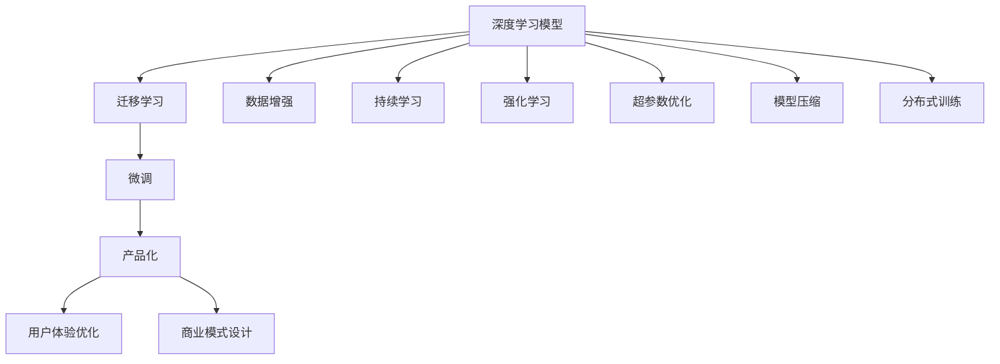

                 

## 1. 背景介绍

### 1.1 问题由来
在过去的几年里，人工智能（AI）和大数据技术的迅猛发展，特别是深度学习技术在自然语言处理（NLP）领域的应用，彻底颠覆了传统的企业运营模式，催生了大量新的产品和服务，引领了新的商业革命。大模型创业成为了一个炙手可热的领域。

### 1.2 问题核心关键点
大模型创业的核心在于如何构建具有竞争力的人工智能产品。从技术实现、用户需求、市场定位、商业模式等多个维度进行综合考量，才能打造出既符合市场需求又能持续迭代升级的优质产品。

大模型创业的核心关键点主要包括以下几点：
- 技术栈的选择：如何基于现有的深度学习框架，如TensorFlow、PyTorch等，构建高效、可扩展的模型。
- 数据源的获取：如何获取和预处理大量高质量的标注数据，保证模型的准确性。
- 算法模型的设计：如何设计出既简单又高效的模型架构，提升模型性能。
- 产品化的挑战：如何将模型转化为可用的产品，并形成可持续的商业模式。
- 用户体验的优化：如何设计直观易用的交互界面，提升用户使用体验。

### 1.3 问题研究意义
大模型创业不仅是一个技术问题，更是一个商业模式问题。成功的创业需要综合技术、市场、商业模式等各方面的能力，从而在激烈的市场竞争中脱颖而出。因此，研究大模型创业，对构建具有市场竞争力的产品具有重要的理论指导意义和实践指导意义。

## 2. 核心概念与联系

### 2.1 核心概念概述

为了更好地理解大模型创业，我们需要掌握几个核心概念及其之间的联系：

- **深度学习模型（Deep Learning Model）**：使用多层的神经网络进行训练和推理，具有强大的表示能力和泛化能力，广泛应用于图像、语音、自然语言处理等领域。
- **迁移学习（Transfer Learning）**：利用在大规模数据上预训练的模型，在新任务上进行微调，提升模型的泛化能力。
- **微调（Fine-Tuning）**：通过有监督的学习，对预训练模型进行小规模的调整，提升模型在新任务上的表现。
- **数据增强（Data Augmentation）**：通过一系列的数据处理方式，扩充训练数据集，提升模型的泛化能力。
- **持续学习（Continual Learning）**：模型能够持续学习新的数据，避免遗忘已有的知识。
- **强化学习（Reinforcement Learning）**：通过与环境的交互，不断调整模型参数，优化模型的性能。
- **超参数优化（Hyperparameter Tuning）**：通过优化模型的超参数，提升模型性能。
- **模型压缩（Model Compression）**：通过减小模型的规模，提升模型的推理速度和存储效率。
- **分布式训练（Distributed Training）**：通过分布式计算，加速大规模模型的训练过程。

这些概念在大模型创业过程中扮演着重要的角色。通过合理利用这些技术，可以构建出高效、可扩展的AI产品。

### 2.2 核心概念原理和架构的 Mermaid 流程图



## 3. 核心算法原理 & 具体操作步骤

### 3.1 算法原理概述

大模型创业的核心算法原理包括以下几个方面：

1. **深度学习模型**：基于多层神经网络，通过反向传播算法训练模型参数，使得模型能够在给定的任务上取得良好的表现。
2. **迁移学习**：在大规模数据集上预训练模型，然后在特定任务上进行微调，利用预训练模型的知识提升模型在新任务上的表现。
3. **微调**：在预训练模型的基础上，通过有监督学习，对模型进行小规模的调整，以适应特定任务。
4. **数据增强**：通过一系列的数据处理方式，扩充训练数据集，提升模型的泛化能力。
5. **持续学习**：模型能够持续学习新的数据，避免遗忘已有的知识，提升模型的长期性能。
6. **强化学习**：通过与环境的交互，不断调整模型参数，优化模型的性能。
7. **超参数优化**：通过优化模型的超参数，提升模型性能，如学习率、批量大小、正则化参数等。
8. **模型压缩**：通过减小模型的规模，提升模型的推理速度和存储效率。
9. **分布式训练**：通过分布式计算，加速大规模模型的训练过程。

### 3.2 算法步骤详解

**Step 1: 数据准备**
- 收集和预处理数据集，包括数据清洗、特征提取、数据增强等。
- 划分训练集、验证集和测试集，以保证模型的泛化能力。

**Step 2: 模型构建**
- 选择合适的深度学习框架，如TensorFlow、PyTorch等。
- 设计模型架构，包括神经网络的层数、节点数等。
- 实现模型的前向传播和反向传播。

**Step 3: 模型训练**
- 选择合适的优化算法，如Adam、SGD等。
- 设置学习率、批量大小、迭代次数等超参数。
- 使用训练集进行模型训练，并在验证集上进行调参。

**Step 4: 模型评估**
- 使用测试集评估模型的性能。
- 优化模型，提升模型的精度和泛化能力。

**Step 5: 模型部署**
- 将训练好的模型部署到服务器上。
- 实现模型的在线推理服务，提供API接口。

**Step 6: 产品化**
- 设计产品界面，提升用户体验。
- 设计商业模式，实现盈利。

### 3.3 算法优缺点

深度学习模型和迁移学习、微调等算法的优缺点如下：

**优点：**
- 能够处理大规模、高维度的数据，具有强大的表示能力。
- 在大规模数据上预训练的模型具有较好的泛化能力。
- 通过微调和数据增强，可以提升模型在新任务上的表现。
- 通过持续学习，模型能够适应新的数据和任务。
- 通过强化学习和超参数优化，可以不断优化模型性能。
- 通过模型压缩和分布式训练，可以提升模型的推理速度和存储效率。

**缺点：**
- 需要大量的标注数据进行预训练和微调，成本较高。
- 模型训练过程耗时较长，需要大量的计算资源。
- 模型的黑盒特性，难以解释模型的内部机制。
- 模型容易出现过拟合，需要谨慎处理。
- 模型的复杂性，需要深入的技术积累。

### 3.4 算法应用领域

深度学习模型和迁移学习、微调等算法在大模型创业中广泛应用，主要包括以下领域：

1. **自然语言处理（NLP）**：如机器翻译、文本分类、情感分析、问答系统等。
2. **计算机视觉（CV）**：如图像识别、目标检测、人脸识别等。
3. **语音识别（ASR）**：如语音识别、语音合成等。
4. **推荐系统**：如电商推荐、内容推荐等。
5. **医疗健康**：如疾病诊断、药物研发等。
6. **金融科技**：如信用评估、智能投顾等。
7. **智能制造**：如质量检测、供应链优化等。
8. **智慧城市**：如交通管理、环境监测等。
9. **自动驾驶**：如障碍物检测、路径规划等。
10. **游戏娱乐**：如智能推荐、人机交互等。

## 4. 数学模型和公式 & 详细讲解

### 4.1 数学模型构建

大模型创业的核心数学模型包括以下几个方面：

- **深度学习模型**：使用多层神经网络，通过反向传播算法训练模型参数。
- **迁移学习模型**：在大规模数据集上预训练模型，然后在特定任务上进行微调。
- **微调模型**：在预训练模型的基础上，通过有监督学习，对模型进行小规模的调整。
- **数据增强模型**：通过一系列的数据处理方式，扩充训练数据集。
- **持续学习模型**：模型能够持续学习新的数据，避免遗忘已有的知识。
- **强化学习模型**：通过与环境的交互，不断调整模型参数，优化模型的性能。
- **超参数优化模型**：通过优化模型的超参数，提升模型性能。
- **模型压缩模型**：通过减小模型的规模，提升模型的推理速度和存储效率。
- **分布式训练模型**：通过分布式计算，加速大规模模型的训练过程。

### 4.2 公式推导过程

以下是几个核心模型的公式推导过程：

**深度学习模型公式**：
$$
\theta = \arg\min_{\theta} \frac{1}{N} \sum_{i=1}^N L(f_{\theta}(x_i),y_i)
$$

其中，$N$为样本数量，$x_i$为输入，$y_i$为输出，$f_{\theta}(x_i)$为模型预测输出，$L$为损失函数。

**迁移学习公式**：
$$
\theta = \arg\min_{\theta} \frac{1}{N} \sum_{i=1}^N L(f_{\theta}(x_i),y_i) + \lambda \frac{1}{M} \sum_{i=1}^M L(f_{\theta}(x_i^{\prime}),y_i^{\prime})
$$

其中，$M$为预训练数据集大小，$x_i^{\prime}$和$y_i^{\prime}$为预训练数据集中的输入和输出。

**微调公式**：
$$
\theta = \arg\min_{\theta} \frac{1}{N} \sum_{i=1}^N L(f_{\theta}(x_i),y_i)
$$

其中，$N$为训练数据集大小，$x_i$和$y_i$为训练数据集中的输入和输出。

**数据增强公式**：
$$
x_i^{\prime} = g(x_i)
$$

其中，$g$为数据增强函数。

**持续学习公式**：
$$
\theta = \arg\min_{\theta} \frac{1}{N} \sum_{i=1}^N L(f_{\theta}(x_i),y_i)
$$

其中，$N$为当前数据集大小。

**强化学习公式**：
$$
Q_{\theta}(s_t,a_t) = r + \gamma \max_{a_{t+1}} Q_{\theta}(s_{t+1},a_{t+1})
$$

其中，$s_t$为当前状态，$a_t$为当前动作，$r$为奖励，$\gamma$为折扣因子。

**超参数优化公式**：
$$
\theta = \arg\min_{\theta} \frac{1}{N} \sum_{i=1}^N L(f_{\theta}(x_i),y_i)
$$

其中，$N$为训练数据集大小，$x_i$和$y_i$为训练数据集中的输入和输出。

**模型压缩公式**：
$$
\theta = \arg\min_{\theta} \frac{1}{N} \sum_{i=1}^N L(f_{\theta}(x_i),y_i)
$$

其中，$N$为训练数据集大小，$x_i$和$y_i$为训练数据集中的输入和输出。

**分布式训练公式**：
$$
\theta = \arg\min_{\theta} \frac{1}{N} \sum_{i=1}^N L(f_{\theta}(x_i),y_i)
$$

其中，$N$为训练数据集大小，$x_i$和$y_i$为训练数据集中的输入和输出。

### 4.3 案例分析与讲解

以下是几个具体案例的分析与讲解：

**案例一：NLP领域的情感分析任务**
- 数据准备：收集和预处理包含情感标签的文本数据集。
- 模型构建：使用BERT模型作为预训练模型，设计情感分类器。
- 模型训练：在大规模数据集上进行预训练，然后在情感分析数据集上进行微调。
- 模型评估：在测试集上评估模型的性能，并进行调参优化。
- 模型部署：将训练好的模型部署到服务器上，提供API接口。
- 产品化：设计情感分析产品的界面和商业模式。

**案例二：计算机视觉领域的图像识别任务**
- 数据准备：收集和预处理包含标签的图像数据集。
- 模型构建：使用ResNet模型作为预训练模型，设计图像分类器。
- 模型训练：在大规模数据集上进行预训练，然后在图像识别数据集上进行微调。
- 模型评估：在测试集上评估模型的性能，并进行调参优化。
- 模型部署：将训练好的模型部署到服务器上，提供API接口。
- 产品化：设计图像识别产品的界面和商业模式。

## 5. 项目实践：代码实例和详细解释说明

### 5.1 开发环境搭建

以下是使用Python进行TensorFlow开发的开发环境配置流程：

1. 安装Anaconda：从官网下载并安装Anaconda，用于创建独立的Python环境。

2. 创建并激活虚拟环境：
```bash
conda create -n tf-env python=3.8 
conda activate tf-env
```

3. 安装TensorFlow：根据CUDA版本，从官网获取对应的安装命令。例如：
```bash
conda install tensorflow=2.6
```

4. 安装各类工具包：
```bash
pip install numpy pandas scikit-learn matplotlib tqdm jupyter notebook ipython
```

完成上述步骤后，即可在`tf-env`环境中开始项目实践。

### 5.2 源代码详细实现

以下是使用TensorFlow对图像识别任务进行微调的Python代码实现。

首先，定义数据处理函数：

```python
import tensorflow as tf
import numpy as np
import matplotlib.pyplot as plt
import os

def load_and_preprocess_image(file_path, target_size=(224, 224)):
    image = tf.io.read_file(file_path)
    image = tf.image.decode_jpeg(image)
    image = tf.image.resize(image, target_size)
    image = tf.image.per_image_standardization(image)
    return image

def load_and_preprocess_labels(file_path):
    labels = []
    with open(file_path, 'r') as f:
        for line in f:
            labels.append(line.strip().split(','))
    return labels

def load_and_preprocess_data(data_dir, target_size=(224, 224), batch_size=32):
    image_filenames = []
    labels = []
    for category in os.listdir(data_dir):
        for filename in os.listdir(os.path.join(data_dir, category)):
            image_filenames.append(os.path.join(data_dir, category, filename))
            labels.append(category)
    labels = tf.keras.utils.to_categorical(labels)
    
    dataset = tf.data.Dataset.from_tensor_slices((image_filenames, labels))
    dataset = dataset.map(load_and_preprocess_image, num_parallel_calls=tf.data.experimental.AUTOTUNE)
    dataset = dataset.batch(batch_size)
    dataset = dataset.shuffle(buffer_size=1024)
    return dataset
```

然后，定义模型和优化器：

```python
from tensorflow.keras.applications.resnet50 import ResNet50, preprocess_input
from tensorflow.keras.optimizers import Adam

model = ResNet50(weights='imagenet', include_top=False, input_shape=(224, 224, 3))
model.build((None, 224, 224, 3))
model.trainable = False
model.output = tf.keras.layers.Flatten()(model.output)

model.add(tf.keras.layers.Dense(128, activation='relu'))
model.add(tf.keras.layers.Dense(10, activation='softmax'))

optimizer = Adam(lr=0.001)
```

接着，定义训练和评估函数：

```python
def train_epoch(model, dataset, batch_size, optimizer):
    model.compile(optimizer=optimizer, loss='categorical_crossentropy', metrics=['accuracy'])
    steps_per_epoch = len(dataset)
    history = model.fit(dataset, epochs=1, steps_per_epoch=steps_per_epoch)
    return history

def evaluate(model, dataset, batch_size):
    model.compile(optimizer=optimizer, loss='categorical_crossentropy', metrics=['accuracy'])
    steps_per_epoch = len(dataset)
    history = model.evaluate(dataset, steps_per_epoch=steps_per_epoch)
    return history
```

最后，启动训练流程并在测试集上评估：

```python
epochs = 5
batch_size = 32

for epoch in range(epochs):
    history = train_epoch(model, train_dataset, batch_size, optimizer)
    print(f'Epoch {epoch+1}, train accuracy: {history.history["accuracy"][0]}')
    
    print(f'Epoch {epoch+1}, test accuracy: {evaluate(model, test_dataset, batch_size)[1]}')
    
print("Evaluation results:")
evaluate(model, test_dataset, batch_size)
```

以上就是使用TensorFlow对图像识别任务进行微调的完整代码实现。可以看到，得益于TensorFlow的强大封装，我们可以用相对简洁的代码完成图像识别模型的微调。

### 5.3 代码解读与分析

让我们再详细解读一下关键代码的实现细节：

**load_and_preprocess_image函数**：
- 读取图像文件。
- 解码为JPEG格式。
- 调整图像大小。
- 归一化。

**load_and_preprocess_labels函数**：
- 读取标签文件。
- 分割标签。

**load_and_preprocess_data函数**：
- 遍历数据集目录。
- 加载和预处理图像和标签。
- 转换为TensorFlow Dataset对象。

**模型构建**：
- 使用预训练的ResNet50模型。
- 添加自定义的全连接层。

**训练函数**：
- 编译模型。
- 执行训练。

**评估函数**：
- 编译模型。
- 执行评估。

**训练流程**：
- 循环执行训练。
- 在验证集上评估模型性能。

可以看到，TensorFlow提供了丰富的工具和函数，使得模型的微调变得高效便捷。开发者可以更加专注于业务逻辑和算法优化，而不必过多关注底层实现。

## 6. 实际应用场景

### 6.1 智能客服系统

基于大模型创业的智能客服系统，可以应用于多个场景。例如，银行客服、在线医疗咨询、电子商务等。智能客服系统能够处理大量的用户咨询，提供7x24小时的服务，提升用户满意度和业务效率。

在技术实现上，可以收集企业内部的历史客服对话记录，将问题和最佳答复构建成监督数据，在此基础上对预训练语言模型进行微调。微调后的模型能够自动理解用户意图，匹配最合适的答案模板进行回复。对于客户提出的新问题，还可以接入检索系统实时搜索相关内容，动态组织生成回答。

### 6.2 金融舆情监测

金融机构需要实时监测市场舆论动向，以便及时应对负面信息传播，规避金融风险。传统的人工监测方式成本高、效率低，难以应对网络时代海量信息爆发的挑战。基于大模型创业的文本分类和情感分析技术，为金融舆情监测提供了新的解决方案。

具体而言，可以收集金融领域相关的新闻、报道、评论等文本数据，并对其进行主题标注和情感标注。在此基础上对预训练语言模型进行微调，使其能够自动判断文本属于何种主题，情感倾向是正面、中性还是负面。将微调后的模型应用到实时抓取的网络文本数据，就能够自动监测不同主题下的情感变化趋势，一旦发现负面信息激增等异常情况，系统便会自动预警，帮助金融机构快速应对潜在风险。

### 6.3 个性化推荐系统

当前的推荐系统往往只依赖用户的历史行为数据进行物品推荐，无法深入理解用户的真实兴趣偏好。基于大模型创业的个性化推荐系统，可以更好地挖掘用户行为背后的语义信息，从而提供更精准、多样的推荐内容。

在实践中，可以收集用户浏览、点击、评论、分享等行为数据，提取和用户交互的物品标题、描述、标签等文本内容。将文本内容作为模型输入，用户的后续行为（如是否点击、购买等）作为监督信号，在此基础上微调预训练语言模型。微调后的模型能够从文本内容中准确把握用户的兴趣点。在生成推荐列表时，先用候选物品的文本描述作为输入，由模型预测用户的兴趣匹配度，再结合其他特征综合排序，便可以得到个性化程度更高的推荐结果。

## 7. 工具和资源推荐

### 7.1 学习资源推荐

为了帮助开发者系统掌握大模型创业的理论基础和实践技巧，这里推荐一些优质的学习资源：

1. 《深度学习》系列书籍：由斯坦福大学李飞飞教授等撰写，全面介绍了深度学习的基本概念、算法和应用。
2. 《TensorFlow官方文档》：详细介绍了TensorFlow的各项功能及使用方法，包括模型构建、训练、评估等。
3. 《Python深度学习》书籍：由Francois Chollet撰写，介绍了深度学习的Python实现，包括TensorFlow等。
4. 《自然语言处理综论》书籍：由Christopher D. Manning等撰写，介绍了自然语言处理的基本概念、算法和应用。
5. 《机器学习实战》书籍：由Peter Harrington撰写，介绍了机器学习的基本概念、算法和应用。

通过对这些资源的学习实践，相信你一定能够快速掌握大模型创业的精髓，并用于解决实际的AI问题。

### 7.2 开发工具推荐

大模型创业需要综合使用多种工具，以下是几个推荐使用的工具：

1. Jupyter Notebook：提供了交互式的代码编写和执行环境，方便调试和演示。
2. PyCharm：提供了强大的代码编辑器和调试工具，支持多种语言和框架。
3. Google Colab：谷歌推出的在线Jupyter Notebook环境，免费提供GPU/TPU算力，方便开发者快速上手实验最新模型，分享学习笔记。
4. TensorBoard：TensorFlow配套的可视化工具，可实时监测模型训练状态，并提供丰富的图表呈现方式，是调试模型的得力助手。
5. Weights & Biases：模型训练的实验跟踪工具，可以记录和可视化模型训练过程中的各项指标，方便对比和调优。

合理利用这些工具，可以显著提升大模型创业的开发效率，加快创新迭代的步伐。

### 7.3 相关论文推荐

大模型创业涉及的技术和应用广泛，以下是几篇奠基性的相关论文，推荐阅读：

1. "Deep Residual Learning for Image Recognition"（ResNet论文）：提出残差网络架构，大幅提升了图像识别任务的效果。
2. "Improving Generalization with Maximum Entropy Self-Distribution Modeling"（MDSD论文）：提出最大熵自分布模型，提升模型泛化能力。
3. "Attention is All You Need"（Transformer论文）：提出Transformer架构，开启了预训练大模型时代。
4. "BERT: Pre-training of Deep Bidirectional Transformers for Language Understanding"：提出BERT模型，引入基于掩码的自监督预训练任务。
5. "Fine-tuning Pretrained Language Models for Question Answering: A Survey"：对基于预训练语言模型的问答系统进行了综述，介绍了微调方法。
6. "Transfer Learning from Self-Supervised Pretraining"：提出自监督预训练的方法，提升模型泛化能力。

这些论文代表了大模型创业的发展脉络，通过学习这些前沿成果，可以帮助研究者把握学科前进方向，激发更多的创新灵感。

## 8. 总结：未来发展趋势与挑战

### 8.1 研究成果总结

大模型创业已经取得了显著的进展，但仍然存在诸多挑战需要解决。本文对大模型创业的理论和实践进行了全面系统的总结，涵盖了深度学习模型、迁移学习、微调等核心算法，以及数据增强、持续学习、强化学习、超参数优化、模型压缩、分布式训练等重要技术。通过对这些技术的深入理解和灵活应用，可以构建高效、可扩展的AI产品。

### 8.2 未来发展趋势

展望未来，大模型创业将呈现以下几个发展趋势：

1. **技术不断进步**：深度学习模型和迁移学习、微调等算法将不断进步，模型的性能和泛化能力将进一步提升。
2. **产品更加普及**：大模型创业产品将不断丰富和普及，覆盖更多的行业和应用场景。
3. **商业模式的创新**：大模型创业的商业模式将不断创新，从单纯的软件销售转变为持续的服务和产品迭代。
4. **人工智能与大数据的结合**：人工智能技术将与大数据技术深度结合，构建更加智能的数据驱动型产品。
5. **多模态技术的融合**：多模态技术将进一步融合，实现视觉、语音、文本等多模态信息的协同建模，提升模型的表现力。
6. **分布式计算的普及**：分布式计算将普及，支持大规模模型的训练和推理，提升系统的扩展性和性能。
7. **云计算平台的支持**：云计算平台将提供强大的计算资源和支持，使得大模型创业更加高效便捷。

### 8.3 面临的挑战

尽管大模型创业取得了诸多进展，但仍面临诸多挑战：

1. **数据获取的难度**：获取高质量标注数据仍然是一个挑战，特别是在小样本场景下。
2. **模型的复杂性**：大模型具有高度复杂的结构，训练和推理成本高，需要大量的计算资源。
3. **模型的可解释性**：深度学习模型通常是黑盒模型，难以解释其内部机制和决策逻辑，影响产品的可信度和可靠性。
4. **算法的公平性**：模型可能存在偏见和歧视，导致算法的不公平性，影响用户体验和产品质量。
5. **系统的安全性**：模型可能存在漏洞和攻击，影响系统的安全性。

### 8.4 研究展望

为了应对大模型创业所面临的挑战，未来需要在以下几个方面进行深入研究：

1. **无监督和半监督学习**：研究如何在大规模无标注数据上进行预训练和微调，减少对标注数据的依赖。
2. **多模态信息的融合**：研究如何将视觉、语音、文本等多模态信息进行协同建模，提升模型的表现力。
3. **分布式计算的优化**：研究如何优化分布式计算，支持大规模模型的训练和推理。
4. **模型的可解释性**：研究如何提高深度学习模型的可解释性，提升模型的可信度和可靠性。
5. **算法的公平性**：研究如何保证算法的公平性和公正性，避免模型的偏见和歧视。
6. **系统的安全性**：研究如何保证系统的安全性，防止模型被攻击和滥用。

这些研究方向的探索将引领大模型创业技术迈向更高的台阶，为构建安全、可靠、可解释、可控的智能系统铺平道路。

## 9. 附录：常见问题与解答

**Q1：大模型创业是否适用于所有AI应用场景？**

A: 大模型创业适用于大多数AI应用场景，特别是在数据量较大、任务复杂的情况下。但对于一些特定领域，如医疗、金融等，需要结合领域知识进行针对性的优化。

**Q2：如何选择合适的预训练模型？**

A: 选择合适的预训练模型需要考虑以下几个方面：
1. 任务类型：根据任务类型选择合适的预训练模型，如图像识别、文本分类、语音识别等。
2. 数据规模：根据数据规模选择合适的预训练模型，如小规模数据可以选择较小的模型，大规模数据可以选择较大的模型。
3. 性能要求：根据性能要求选择合适的预训练模型，如对于实时要求较高的场景，可以选择推理速度较快的模型。

**Q3：如何设计高效的模型架构？**

A: 设计高效的模型架构需要考虑以下几个方面：
1. 模型大小：根据任务需求和计算资源选择合适的模型大小。
2. 层数和节点数：设计合适的层数和节点数，避免模型过深或过宽。
3. 激活函数：选择合适的激活函数，如ReLU、Sigmoid等。
4. 正则化：添加适当的正则化项，避免过拟合。

**Q4：如何进行超参数优化？**

A: 进行超参数优化需要考虑以下几个方面：
1. 学习率：选择合适的学习率，避免过拟合和欠拟合。
2. 批量大小：选择合适的批量大小，提升训练效率。
3. 正则化参数：添加适当的正则化参数，避免过拟合。
4. 优化器：选择合适的优化器，如Adam、SGD等。

**Q5：如何设计直观易用的交互界面？**

A: 设计直观易用的交互界面需要考虑以下几个方面：
1. 简洁明了：界面设计要简洁明了，避免过于复杂。
2. 交互友好：界面要友好，方便用户操作。
3. 反馈及时：界面要能够及时反馈用户的输入和操作结果。

**Q6：如何设计可持续的商业模式？**

A: 设计可持续的商业模式需要考虑以下几个方面：
1. 免费试用：提供免费试用，吸引用户。
2. 订阅模式：采用订阅模式，获取稳定的收入。
3. 增值服务：提供增值服务，如定制化服务、高级功能等。
4. 广告模式：采用广告模式，获取广告收入。

---

作者：禅与计算机程序设计艺术 / Zen and the Art of Computer Programming

