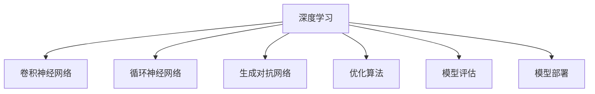

                 

# 人工智能 原理与代码实例讲解

> 关键词：人工智能, 深度学习, 机器学习, 深度神经网络, 卷积神经网络, 循环神经网络, 强化学习, 优化算法, 模型评估, 模型部署

## 1. 背景介绍

### 1.1 问题由来
人工智能（Artificial Intelligence, AI）是计算机科学和数学的一个分支，旨在创建能够执行人类智能任务的机器。AI的发展经历了从规则系统、专家系统到机器学习的几个重要阶段。其中，深度学习和机器学习是目前最为前沿的技术。

深度学习作为机器学习的一种，通过构建多层神经网络，自动学习特征和模型参数，从而实现对复杂数据的高效处理和智能化决策。卷积神经网络（Convolutional Neural Networks, CNNs）、循环神经网络（Recurrent Neural Networks, RNNs）和生成对抗网络（Generative Adversarial Networks, GANs）等深度学习模型已经在图像识别、语音识别、自然语言处理（Natural Language Processing, NLP）等领域取得了巨大的突破。

### 1.2 问题核心关键点
深度学习模型的训练过程涉及大量的数学理论和算法，包括前向传播、反向传播、梯度下降等。模型的性能高度依赖于数据的预处理、网络架构的设计、损失函数的设定、优化算法的选择以及模型评估和调优等多个环节。因此，理解和掌握深度学习模型的原理和实现方法，对于开发高效、准确的人工智能应用至关重要。

本文将从深度学习的基本原理、核心算法、具体操作步骤、数学模型、代码实例、实际应用场景、工具和资源推荐等多个方面，深入讲解人工智能的核心技术和实践方法。

## 2. 核心概念与联系

### 2.1 核心概念概述

为更好地理解人工智能的核心技术，本节将介绍几个密切相关的核心概念：

- 深度学习（Deep Learning, DL）：通过构建多层神经网络，实现对复杂数据的自动学习和特征提取。
- 卷积神经网络（Convolutional Neural Networks, CNNs）：一种专门用于处理图像、视频等网格状数据的深度学习模型。
- 循环神经网络（Recurrent Neural Networks, RNNs）：一种能够处理序列数据的深度学习模型，适用于自然语言处理、时间序列预测等任务。
- 生成对抗网络（Generative Adversarial Networks, GANs）：一种生成模型，通过对抗训练生成高质量的图像、音频等数据。
- 优化算法（Optimization Algorithms）：用于调整模型参数以最小化损失函数的算法，如梯度下降、Adam、SGD等。
- 模型评估（Model Evaluation）：通过各种指标评估模型性能，如准确率、召回率、F1分数等。
- 模型部署（Model Deployment）：将训练好的模型集成到实际应用中，进行推理预测。

这些核心概念之间的逻辑关系可以通过以下Mermaid流程图来展示：



这个流程图展示了大语言模型的核心概念及其之间的关系：

1. 深度学习是其他所有深度学习模型的基础。
2. CNNs、RNNs、GANs等是深度学习的具体模型形式，适用于不同类型的数据和任务。
3. 优化算法用于训练模型，最小化损失函数。
4. 模型评估用于评估模型性能，指导模型的优化。
5. 模型部署将训练好的模型集成到实际应用中。

这些概念共同构成了深度学习模型的学习和应用框架，使其能够在各种场景下发挥强大的数据处理和智能决策能力。

## 3. 核心算法原理 & 具体操作步骤
### 3.1 算法原理概述

深度学习模型的训练过程基于反向传播算法（Backpropagation）和优化算法，通过前向传播计算模型预测，反向传播计算梯度，并使用优化算法更新模型参数。

以CNN为例，假设输入数据为$x$，输出为$y$，模型参数为$\theta$，则模型的前向传播过程如下：

$$
y = f(\theta \cdot x)
$$

其中$f$为激活函数，$\cdot$表示矩阵乘法。模型的预测结果为$y$，将其与真实标签$y'$进行比较，得到损失函数$\mathcal{L}$：

$$
\mathcal{L} = \frac{1}{2}(y - y')^2
$$

反向传播过程中，损失函数对$\theta$的梯度$\frac{\partial \mathcal{L}}{\partial \theta}$通过链式法则计算得到：

$$
\frac{\partial \mathcal{L}}{\partial \theta} = \frac{\partial \mathcal{L}}{\partial y} \cdot \frac{\partial y}{\partial \theta}
$$

最后，优化算法如梯度下降（Gradient Descent, GD）根据梯度方向调整模型参数$\theta$，最小化损失函数$\mathcal{L}$：

$$
\theta \leftarrow \theta - \eta \cdot \frac{\partial \mathcal{L}}{\partial \theta}
$$

其中$\eta$为学习率，控制每次参数更新的步长。

### 3.2 算法步骤详解

深度学习模型的训练过程包括数据预处理、模型搭建、模型训练和模型评估等多个步骤。以CNN为例，其训练过程如下：

**Step 1: 数据预处理**
- 将原始数据转换为模型所需的格式，如将图像数据归一化、标准化，将文本数据转化为向量。

**Step 2: 模型搭建**
- 设计CNN模型的网络结构，包括卷积层、池化层、全连接层等，选择合适的激活函数、损失函数和优化算法。

**Step 3: 模型训练**
- 将训练数据输入模型，进行前向传播和反向传播，计算梯度和损失函数，使用优化算法更新模型参数。
- 重复上述过程，直至损失函数收敛或达到预设的迭代次数。

**Step 4: 模型评估**
- 使用测试数据集评估模型性能，计算准确率、召回率、F1分数等指标。
- 根据评估结果，调整模型超参数和结构，进一步优化模型性能。

### 3.3 算法优缺点

深度学习模型的训练过程涉及大量数据和计算资源，具有以下优点：

1. 自动特征提取：深度学习模型能够自动学习数据中的特征，避免了手动设计特征的繁琐过程。
2. 高性能：深度学习模型在大规模数据上训练效果显著，能够处理复杂非线性的数据关系。
3. 可扩展性：深度学习模型易于扩展，通过增加网络层数和节点数，可以提高模型的复杂度和性能。

同时，深度学习模型也存在以下缺点：

1. 过拟合：深度学习模型容易过拟合，特别是在数据量不足的情况下。
2. 计算资源需求高：深度学习模型的训练和推理需要大量计算资源，对硬件要求较高。
3. 黑盒性质：深度学习模型的内部工作机制不透明，难以解释和调试。
4. 依赖数据：深度学习模型的性能高度依赖于数据的质量和数量。

### 3.4 算法应用领域

深度学习模型已经在计算机视觉、自然语言处理、语音识别等多个领域取得了广泛应用，具体如下：

- 计算机视觉：图像分类、目标检测、人脸识别、图像分割等任务。
- 自然语言处理：机器翻译、文本生成、情感分析、问答系统等任务。
- 语音识别：语音识别、语音合成、语音转换等任务。
- 推荐系统：个性化推荐、广告推荐、搜索排序等任务。
- 医疗影像分析：疾病诊断、图像识别、病历分析等任务。
- 游戏AI：玩家行为预测、游戏策略优化等任务。

## 4. 数学模型和公式 & 详细讲解  
### 4.1 数学模型构建

深度学习模型的训练过程涉及大量数学模型和公式，以下是几个关键模型的数学构建和公式推导。

**卷积神经网络（CNNs）**
- 假设输入数据为$x$，输出为$y$，卷积核为$k$，模型参数为$\theta$，则卷积操作可以表示为：

$$
y = k \cdot x
$$

其中$k$表示卷积核矩阵，$x$表示输入数据矩阵。

- 卷积操作后的激活函数通常为ReLU，即：

$$
y' = f(\theta \cdot y)
$$

其中$f$为ReLU函数，$\cdot$表示矩阵乘法。

**循环神经网络（RNNs）**
- 假设输入数据序列为$x_1, x_2, ..., x_t$，输出序列为$y_1, y_2, ..., y_t$，模型参数为$\theta$，则RNN的前向传播过程可以表示为：

$$
h_t = f(\theta \cdot h_{t-1} \cdot x_t)
$$

其中$h_t$表示t时刻的隐藏状态，$f$为激活函数，$\cdot$表示矩阵乘法。

- 梯度下降更新参数的公式为：

$$
\theta \leftarrow \theta - \eta \cdot \frac{\partial \mathcal{L}}{\partial \theta}
$$

其中$\eta$为学习率，$\mathcal{L}$为损失函数。

**生成对抗网络（GANs）**
- GANs由两个网络组成：生成器$G$和判别器$D$。生成器的输入为噪声向量$z$，输出为生成的数据$y$，判别器的输入为真实数据$x$和生成的数据$y$，输出为真实数据和生成的数据的概率。GANs的训练过程如下：

$$
\begin{aligned}
G: & y = G(z) \\
D: & \mathcal{L}_D = E_D \log D(x) + E_G \log (1 - D(y)) \\
\mathcal{L}_G = E_G \log D(y) \\
\end{aligned}
$$

其中$E_D$和$E_G$表示期望值，$z$表示噪声向量，$x$表示真实数据，$y$表示生成数据，$D$表示判别器，$G$表示生成器，$\mathcal{L}_D$和$\mathcal{L}_G$表示判别器和生成器的损失函数。

### 4.2 公式推导过程

**卷积神经网络（CNNs）**
- 假设输入数据为$x$，输出为$y$，卷积核为$k$，模型参数为$\theta$，则卷积操作可以表示为：

$$
y = k \cdot x
$$

其中$k$表示卷积核矩阵，$x$表示输入数据矩阵。

**循环神经网络（RNNs）**
- 假设输入数据序列为$x_1, x_2, ..., x_t$，输出序列为$y_1, y_2, ..., y_t$，模型参数为$\theta$，则RNN的前向传播过程可以表示为：

$$
h_t = f(\theta \cdot h_{t-1} \cdot x_t)
$$

其中$h_t$表示t时刻的隐藏状态，$f$为激活函数，$\cdot$表示矩阵乘法。

**生成对抗网络（GANs）**
- GANs由两个网络组成：生成器$G$和判别器$D$。生成器的输入为噪声向量$z$，输出为生成的数据$y$，判别器的输入为真实数据$x$和生成的数据$y$，输出为真实数据和生成的数据的概率。GANs的训练过程如下：

$$
\begin{aligned}
G: & y = G(z) \\
D: & \mathcal{L}_D = E_D \log D(x) + E_G \log (1 - D(y)) \\
\mathcal{L}_G = E_G \log D(y) \\
\end{aligned}
$$

其中$E_D$和$E_G$表示期望值，$z$表示噪声向量，$x$表示真实数据，$y$表示生成数据，$D$表示判别器，$G$表示生成器，$\mathcal{L}_D$和$\mathcal{L}_G$表示判别器和生成器的损失函数。

### 4.3 案例分析与讲解

**案例分析：图像分类**
- 假设我们使用CNN模型进行图像分类任务，输入数据为$x$，输出为$y$，模型参数为$\theta$，则卷积操作可以表示为：

$$
y = k \cdot x
$$

其中$k$表示卷积核矩阵，$x$表示输入数据矩阵。通过多层的卷积、池化、全连接操作，最后使用Softmax函数进行分类预测：

$$
\hat{y} = \text{Softmax}(\theta \cdot h_t)
$$

其中$h_t$表示t时刻的隐藏状态，$\cdot$表示矩阵乘法，$\text{Softmax}$表示Softmax函数。

## 5. 项目实践：代码实例和详细解释说明
### 5.1 开发环境搭建

在进行深度学习项目开发前，我们需要准备好开发环境。以下是使用Python进行TensorFlow开发的环境配置流程：

1. 安装Anaconda：从官网下载并安装Anaconda，用于创建独立的Python环境。

2. 创建并激活虚拟环境：
```bash
conda create -n tf-env python=3.8 
conda activate tf-env
```

3. 安装TensorFlow：根据CUDA版本，从官网获取对应的安装命令。例如：
```bash
conda install tensorflow -c pytorch -c conda-forge
```

4. 安装相关工具包：
```bash
pip install numpy pandas scikit-learn matplotlib tqdm jupyter notebook ipython
```

完成上述步骤后，即可在`tf-env`环境中开始深度学习项目开发。

### 5.2 源代码详细实现

这里我们以图像分类任务为例，给出使用TensorFlow进行CNN模型训练的Python代码实现。

```python
import tensorflow as tf
import numpy as np
import matplotlib.pyplot as plt

# 加载数据集
(x_train, y_train), (x_test, y_test) = tf.keras.datasets.cifar10.load_data()

# 数据预处理
x_train = x_train / 255.0
x_test = x_test / 255.0

# 定义模型
model = tf.keras.Sequential([
    tf.keras.layers.Conv2D(32, (3, 3), activation='relu', input_shape=(32, 32, 3)),
    tf.keras.layers.MaxPooling2D((2, 2)),
    tf.keras.layers.Flatten(),
    tf.keras.layers.Dense(10, activation='softmax')
])

# 编译模型
model.compile(optimizer='adam',
              loss='sparse_categorical_crossentropy',
              metrics=['accuracy'])

# 训练模型
history = model.fit(x_train, y_train, epochs=10, validation_data=(x_test, y_test))

# 评估模型
test_loss, test_acc = model.evaluate(x_test, y_test, verbose=2)
print('Test accuracy:', test_acc)

# 绘制训练曲线
plt.plot(history.history['accuracy'])
plt.plot(history.history['val_accuracy'])
plt.title('model accuracy')
plt.ylabel('accuracy')
plt.xlabel('epoch')
plt.legend(['train', 'test'], loc='upper left')
plt.show()

# 绘制损失曲线
plt.plot(history.history['loss'])
plt.plot(history.history['val_loss'])
plt.title('model loss')
plt.ylabel('loss')
plt.xlabel('epoch')
plt.legend(['train', 'test'], loc='upper left')
plt.show()
```

在这个示例中，我们使用了TensorFlow的Keras API来构建、编译和训练CNN模型。通过这个示例，你可以了解如何使用TensorFlow进行基本的数据预处理、模型定义、模型编译、模型训练和模型评估。

### 5.3 代码解读与分析

让我们再详细解读一下关键代码的实现细节：

**数据预处理**
- 使用`tf.keras.datasets.cifar10.load_data()`加载CIFAR-10数据集，并将其标准化处理。

**模型定义**
- 使用`tf.keras.Sequential()`定义一个序列模型，包含卷积层、池化层和全连接层。
- 使用`tf.keras.layers.Conv2D()`定义卷积层，使用`tf.keras.layers.MaxPooling2D()`定义池化层，使用`tf.keras.layers.Flatten()`将池化层的输出扁平化，使用`tf.keras.layers.Dense()`定义全连接层。

**模型编译**
- 使用`model.compile()`编译模型，指定优化器、损失函数和评估指标。

**模型训练**
- 使用`model.fit()`训练模型，指定训练数据、标签、训练轮数和验证数据。

**模型评估**
- 使用`model.evaluate()`评估模型，输出测试集上的准确率。

**训练曲线绘制**
- 使用`plt.plot()`绘制训练集和验证集的准确率和损失曲线。

**运行结果展示**
- 在训练结束后，使用`plt.show()`展示训练曲线，帮助分析模型的训练效果。

以上代码展示了使用TensorFlow进行CNN模型训练的基本步骤，你可以根据实际任务进行适当调整。

## 6. 实际应用场景
### 6.1 图像分类
- 图像分类是计算机视觉领域的基本任务，广泛应用于自动驾驶、医疗影像分析、安防监控等领域。
- 使用CNN模型对图像进行分类，可以识别不同类别的物体，如车辆、行人、交通标志等。
- 通过微调模型，可以针对特定场景进行优化，如在医疗影像分析任务中，微调模型可以更好地识别病变区域。

### 6.2 自然语言处理
- 自然语言处理（NLP）是人工智能的重要分支，包括文本分类、情感分析、机器翻译、问答系统等任务。
- 使用RNN模型进行NLP任务，可以处理序列数据，如文本、时间序列等。
- 通过微调模型，可以针对特定领域进行优化，如在情感分析任务中，微调模型可以更好地理解不同情感表达。

### 6.3 语音识别
- 语音识别是人工智能在语音处理领域的应用，可以用于语音助手、语音搜索、语音转换等任务。
- 使用RNN模型进行语音识别，可以处理语音信号序列。
- 通过微调模型，可以针对特定应用场景进行优化，如在语音助手任务中，微调模型可以更好地理解自然语言指令。

## 7. 工具和资源推荐
### 7.1 学习资源推荐

为了帮助开发者系统掌握深度学习的基本原理和实践技巧，这里推荐一些优质的学习资源：

1. 《深度学习》（Ian Goodfellow, Yoshua Bengio, Aaron Courville）：深度学习的经典教材，涵盖深度学习的基本概念和算法。

2. 《TensorFlow官方文档》：TensorFlow的官方文档，提供了详细的API文档和教程，帮助你快速上手TensorFlow。

3. 《PyTorch官方文档》：PyTorch的官方文档，提供了丰富的教程和示例，帮助你快速上手PyTorch。

4. Kaggle竞赛平台：Kaggle是一个数据科学竞赛平台，提供了大量的竞赛项目和数据集，帮助你实践深度学习模型。

5. Google Colab：Google提供的在线Jupyter Notebook环境，免费提供GPU/TPU算力，方便开发者快速实验最新模型，分享学习笔记。

通过对这些资源的学习实践，相信你一定能够快速掌握深度学习的基本原理和实践方法。

### 7.2 开发工具推荐

高效的开发离不开优秀的工具支持。以下是几款用于深度学习项目开发的常用工具：

1. TensorFlow：由Google主导开发的开源深度学习框架，生产部署方便，适合大规模工程应用。

2. PyTorch：Facebook开发的开源深度学习框架，灵活度高，适合研究和小规模工程应用。

3. Keras：基于TensorFlow和Theano的高级神经网络API，简单易用，适合快速原型开发。

4. Weights & Biases：模型训练的实验跟踪工具，可以记录和可视化模型训练过程中的各项指标，方便对比和调优。

5. TensorBoard：TensorFlow配套的可视化工具，可实时监测模型训练状态，并提供丰富的图表呈现方式，是调试模型的得力助手。

6. PyTorch Lightning：基于PyTorch的轻量级深度学习框架，自动构建训练流程，减少开发成本。

合理利用这些工具，可以显著提升深度学习项目开发效率，加快创新迭代的步伐。

### 7.3 相关论文推荐

深度学习的发展离不开学界的持续研究。以下是几篇奠基性的相关论文，推荐阅读：

1. ImageNet Classification with Deep Convolutional Neural Networks（AlexNet论文）：提出卷积神经网络，在ImageNet图像分类任务上取得了突破性成果。

2. A Tutorial on Convolutional Neural Networks for Sentence Classification（CNNs in NLP）：介绍CNN在NLP任务中的应用，展示了CNN在文本分类任务上的优势。

3. Attention is All You Need（即Transformer原论文）：提出Transformer模型，开启了深度学习的新时代。

4. Deep Residual Learning for Image Recognition（ResNet论文）：提出残差网络，解决了深度神经网络训练中的梯度消失问题。

5. Generative Adversarial Nets（GANs论文）：提出生成对抗网络，在图像生成和数据增强等领域取得了显著效果。

这些论文代表了大深度学习的发展脉络。通过学习这些前沿成果，可以帮助研究者把握学科前进方向，激发更多的创新灵感。

## 8. 总结：未来发展趋势与挑战
### 8.1 研究成果总结

本文从深度学习的基本原理、核心算法、操作步骤、数学模型、代码实例、实际应用场景、工具和资源推荐等多个方面，深入讲解了人工智能的核心技术和实践方法。通过本文的系统梳理，可以看到，深度学习模型在计算机视觉、自然语言处理、语音识别等领域取得了巨大的突破，广泛应用于各种实际应用中。

### 8.2 未来发展趋势

深度学习模型将继续向更复杂、更高效、更智能的方向发展，其未来发展趋势包括：

1. 深度学习模型的规模将不断扩大，参数量将持续增长，模型复杂度将不断提高。
2. 深度学习模型将更多地与其他人工智能技术融合，如强化学习、知识表示等，形成更全面的人工智能系统。
3. 深度学习模型将向更普适、更鲁棒的方向发展，具备更好的跨领域迁移能力和泛化能力。
4. 深度学习模型的训练过程将更多地采用无监督学习和半监督学习，降低对标注数据的需求。
5. 深度学习模型将更多地应用到大规模、高复杂度的任务中，如自然语言理解、语音识别等。
6. 深度学习模型的推理过程将更加高效、可解释，满足实际应用需求。

### 8.3 面临的挑战

尽管深度学习模型已经取得了显著成果，但在迈向更加智能化、普适化应用的过程中，仍面临诸多挑战：

1. 数据需求高：深度学习模型的训练需要大量高质量标注数据，难以获取和处理。
2. 计算资源消耗大：深度学习模型的训练和推理需要大量计算资源，硬件成本高。
3. 模型可解释性差：深度学习模型的内部工作机制不透明，难以解释和调试。
4. 模型鲁棒性不足：深度学习模型在面对复杂数据和噪声时，泛化性能往往较差。
5. 模型参数量庞大：深度学习模型的参数量往往很大，导致模型复杂度较高，难以优化。

### 8.4 研究展望

面向未来，深度学习模型的研究需要从以下几个方向进行突破：

1. 发展更加高效、可解释的模型，降低对标注数据的需求，提高模型泛化能力。
2. 引入更多先验知识，如符号化知识库、逻辑规则等，与神经网络模型进行融合，形成更全面、准确的信息整合能力。
3. 发展更加灵活、可扩展的模型，能够快速适应不同应用场景和任务需求。
4. 探索更多的优化算法和训练策略，提高模型训练效率，降低计算资源消耗。
5. 提高模型的鲁棒性和稳定性，使其能够在复杂和噪声环境下保持稳定性能。
6. 开发更加普适、智能的模型，能够解决复杂问题，满足不同应用场景的需求。

这些研究方向将引领深度学习模型的未来发展，推动人工智能技术在更多领域的应用和普及。相信随着学界和产业界的共同努力，深度学习模型将进一步拓展其应用边界，成为构建智能系统的核心技术。

## 9. 附录：常见问题与解答

**Q1：深度学习模型的训练过程需要多长时间？**

A: 深度学习模型的训练时间取决于模型的复杂度、数据量和计算资源等因素。一般而言，简单的模型训练时间较短，复杂的模型训练时间较长。可以通过增加并行训练、使用GPU/TPU等硬件加速等方式，缩短训练时间。

**Q2：深度学习模型如何进行模型压缩和优化？**

A: 深度学习模型可以通过剪枝、量化、蒸馏等方法进行模型压缩和优化。剪枝方法可以去除冗余的参数和连接，减少模型大小和计算量。量化方法可以将浮点模型转换为定点模型，减小内存占用和计算速度。蒸馏方法可以将大模型压缩成更小的模型，同时保持其性能。

**Q3：深度学习模型如何进行迁移学习？**

A: 迁移学习是指将在大规模数据上预训练的模型应用于小规模数据上的任务。通过迁移学习，可以充分利用预训练模型学到的知识，减少在小规模数据上从头训练的时间。可以通过微调、特征提取等方式进行迁移学习，具体方法取决于任务的特点和数据量。

**Q4：深度学习模型如何进行超参数调优？**

A: 深度学习模型的超参数调优是一个关键环节，影响模型的性能和训练效果。常用的超参数调优方法包括网格搜索、随机搜索、贝叶斯优化等。可以通过交叉验证、学习曲线等方法评估不同超参数组合的性能，找到最优的超参数设置。

**Q5：深度学习模型如何进行模型集成？**

A: 深度学习模型可以通过集成多个模型进行性能提升。常用的集成方法包括Bagging、Boosting、Stacking等。可以通过训练多个模型，取其预测结果的平均值、投票结果等进行集成，提升模型的鲁棒性和泛化能力。

通过这些问题的解答，可以帮助你更好地理解深度学习模型的训练和优化过程，从而在实际项目中取得更好的性能和效果。

---

作者：禅与计算机程序设计艺术 / Zen and the Art of Computer Programming

