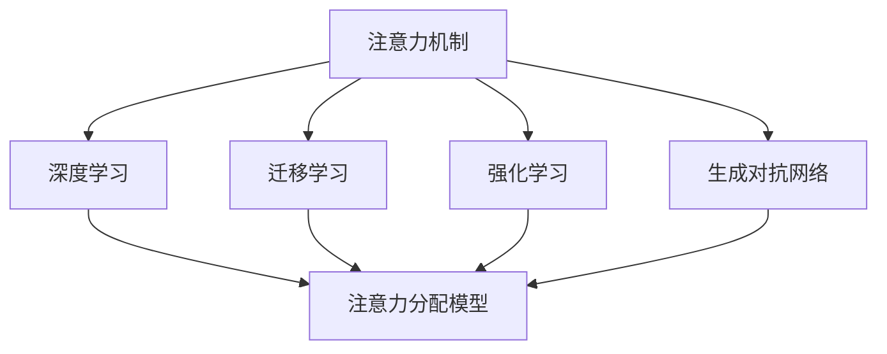

                 

# 人工智能如何重塑注意力分配模式

## 1. 背景介绍

### 1.1 问题由来
在信息爆炸的时代，人类面对海量的数据和信息流，如何高效、精准地筛选和利用信息，成为了一个重要且紧迫的问题。人工智能（AI）技术，尤其是深度学习和机器学习技术，通过自动化算法和大规模数据处理能力，为信息筛选和注意力分配带来了新的可能性。

具体而言，人工智能通过分析数据特征，识别关键信息，并将资源和注意力集中在最有价值的部分，从而显著提高了信息处理效率和决策质量。在医疗、金融、营销、智能制造等多个领域，AI技术已经开始被广泛应用于提升信息筛选和注意力分配的准确性、效率和自动化水平。

### 1.2 问题核心关键点
人工智能重塑注意力分配模式的核心关键点包括：

- **数据驱动决策**：AI系统能够通过分析大量数据，识别出最具价值的信息源，并将注意力聚焦在这些信息源上，以实现更精确、高效的决策。
- **自动化注意力分配**：AI算法能够根据预定义的规则或学习到的模式，自动进行注意力分配，减少人为干预，提升决策速度和准确性。
- **多模态融合**：AI系统可以综合处理文本、图像、声音等多种信息模态，提供更加全面、准确的信息感知和分析能力。
- **上下文理解**：通过结合上下文信息，AI系统可以更好地理解信息的意义，从而做出更合理的决策。
- **自适应学习**：AI系统能够通过持续学习，不断优化其注意力分配策略，适应不同的数据分布和变化。

这些关键点共同构成了AI技术在注意力分配模式重塑过程中的核心优势，通过这些优势，AI能够在多个领域中大幅提升信息处理的效率和效果。

## 2. 核心概念与联系

### 2.1 核心概念概述

为更好地理解AI如何重塑注意力分配模式，本节将介绍几个密切相关的核心概念：

- **注意力机制（Attention Mechanism）**：一种通过计算输入数据中各部分与目标之间的关联度，从而确定重点关注区域的技术。常见的注意力机制包括自注意力机制、多头注意力机制等。
- **深度学习（Deep Learning）**：基于多层神经网络的人工智能技术，能够从大规模数据中学习出复杂的特征表示，适用于处理复杂的非线性问题。
- **迁移学习（Transfer Learning）**：将一个领域学习到的知识迁移到另一个领域，以加速新任务的学习。
- **强化学习（Reinforcement Learning）**：通过与环境的交互，不断调整策略以最大化累积奖励的机器学习范式，适用于需要长期决策的注意力分配问题。
- **生成对抗网络（Generative Adversarial Networks, GANs）**：通过两个对抗的神经网络生成和鉴别样本来学习数据的生成模型，适用于生成高质量的注意力分配策略。

这些核心概念之间的逻辑关系可以通过以下Mermaid流程图来展示：



这个流程图展示了大语言模型的核心概念及其之间的关系：

1. 注意力机制通过深度学习网络进行实现，学习输入数据与目标之间的关联。
2. 迁移学习通过预训练和微调，使模型在不同任务间迁移知识。
3. 强化学习通过与环境的交互，调整策略以优化注意力分配。
4. 生成对抗网络通过生成高质量的样本，改进注意力分配策略。

这些概念共同构成了AI技术在注意力分配模式重塑过程中的技术基础。通过理解这些核心概念，我们可以更好地把握AI技术的工作原理和优化方向。

## 3. 核心算法原理 & 具体操作步骤
### 3.1 算法原理概述

AI技术重塑注意力分配模式的本质，是通过设计高效的注意力机制，在输入数据中找到最具价值的部分，并将资源和注意力集中于此。具体而言，这个过程包括两个主要步骤：特征提取和注意力计算。

1. **特征提取**：使用深度学习模型对输入数据进行编码，学习出数据的高层次特征表示。
2. **注意力计算**：通过计算不同特征之间的关联度，确定每个特征的重要性和权重，从而决定哪些特征需要重点关注。

### 3.2 算法步骤详解

基于注意力机制的AI系统通常包括以下几个关键步骤：

**Step 1: 准备数据集和模型**

- 收集与目标任务相关的数据集，包括文本、图像、音频等多种类型。
- 选择合适的深度学习模型（如卷积神经网络CNN、循环神经网络RNN、Transformer等）作为注意力分配模型。

**Step 2: 设计注意力机制**

- 根据任务特点选择合适的注意力机制（如自注意力、多头注意力、位置注意力等）。
- 定义注意力计算函数，计算每个特征与目标之间的关联度。
- 确定注意力分配权重，通常使用softmax函数对计算出的关联度进行归一化。

**Step 3: 训练模型**

- 使用训练集对模型进行训练，最小化目标任务上的损失函数。
- 在训练过程中，逐步调整注意力分配策略，优化模型的注意力权重。
- 引入正则化技术（如L2正则、Dropout等）防止过拟合。

**Step 4: 评估与优化**

- 在验证集上评估模型性能，计算精度、召回率、F1分数等指标。
- 根据评估结果，调整模型参数和注意力分配策略。
- 重复以上步骤直至模型达到满意效果。

**Step 5: 部署与应用**

- 将训练好的模型部署到实际应用系统中。
- 使用测试集对模型进行最终测试，确保其性能稳定。
- 在生产环境中持续收集反馈，不断优化模型和注意力分配策略。

### 3.3 算法优缺点

基于注意力机制的AI系统具有以下优点：

- **高效信息处理**：通过计算输入数据中各部分与目标之间的关联度，有效过滤无用信息，提升信息处理效率。
- **自适应学习**：模型能够通过持续学习，适应不同的数据分布和变化，优化注意力分配策略。
- **多模态融合**：能够处理文本、图像、声音等多种信息模态，提供更加全面、准确的信息感知和分析能力。

同时，这些系统也存在一些局限性：

- **计算复杂度高**：注意力计算和特征提取过程较为复杂，需要大量计算资源。
- **数据依赖性强**：模型效果依赖于数据质量，低质量或噪声数据可能影响模型性能。
- **模型泛化能力**：在大规模数据集上的训练效果可能优于小规模数据集，对数据分布的变化适应性有待提高。
- **可解释性不足**：注意力分配过程较为复杂，难以直接解释和调试，缺乏透明度。

尽管存在这些局限性，但就目前而言，基于注意力机制的AI系统在信息处理和注意力分配方面表现出色，已成为现代AI技术的重要组成部分。未来相关研究的主要方向在于如何进一步提升模型的计算效率、降低数据依赖性、增强可解释性和泛化能力，以实现更广泛的应用和优化。

### 3.4 算法应用领域

基于注意力机制的AI系统已经广泛应用于多个领域，以下是一些典型应用：

- **自然语言处理（NLP）**：用于文本分类、情感分析、机器翻译等任务。通过自注意力机制和Transformer结构，显著提升了NLP任务的精度和效率。
- **计算机视觉（CV）**：用于图像分类、目标检测、图像生成等任务。通过卷积神经网络和注意力机制，实现了图像处理的自动化和智能化。
- **智能推荐系统**：用于电商、新闻、音乐等领域的个性化推荐。通过用户行为数据和物品特征的深度学习，实现高效、个性化的推荐。
- **智能制造**：用于设备监控、故障预测、生产调度等任务。通过传感器数据和机器学习的结合，优化生产流程和资源分配。
- **金融风控**：用于信用评估、风险预警、反欺诈等任务。通过多模态数据和深度学习模型的结合，提升风险预测的准确性和及时性。

除了上述这些典型应用外，AI技术在注意力分配方面的研究也在不断扩展，未来有望在更多领域中发挥重要作用。

## 4. 数学模型和公式 & 详细讲解 & 举例说明
### 4.1 数学模型构建

基于注意力机制的AI系统通常使用如下的数学模型进行建模：

- **输入数据表示**：将输入数据（如文本、图像）编码为向量形式，记为 $x \in \mathbb{R}^d$。
- **注意力权重计算**：计算输入数据中每个特征与目标之间的关联度，记为 $a_{ij} \in \mathbb{R}$。
- **注意力分配**：根据计算出的关联度，对输入数据进行加权，记为 $c_j = \sum_{i=1}^n a_{ij} x_i$。

### 4.2 公式推导过程

以下是注意力机制的详细数学推导过程：

1. **自注意力计算**：
   - **计算注意力权重**：
     \[
     a_{ij} = \frac{e^{\frac{1}{\sqrt{d_k}} \text{dot}(x_i, x_j^T)}}{\sum_{k=1}^n e^{\frac{1}{\sqrt{d_k}} \text{dot}(x_i, x_j^T)}}
     \]
   - **计算注意力向量**：
     \[
     c_j = \sum_{i=1}^n a_{ij} x_i
     \]

2. **多头注意力计算**：
   - **多头注意力计算**：
     \[
     c_j^l = \text{Softmax}(Q^l K^l V^l)
     \]
   - **线性变换**：
     \[
     W^l c_j^l = \sum_{l=1}^h W^l c_j^l
     \]

3. **注意力机制与深度学习模型结合**：
   - **输入表示**：
     \[
     x_i = f(W_i x)
     \]
   - **输出表示**：
     \[
     \hat{y} = W_O h
     \]

其中，$x$ 为输入数据，$h$ 为深度学习模型的输出，$W$ 为权重矩阵，$d_k$ 为注意力机制的注意力头数，$h$ 为模型输出，$K^l$ 和 $V^l$ 为注意力机制的查询和值向量。

### 4.3 案例分析与讲解

以自然语言处理中的机器翻译为例，机器翻译的注意力机制可以分为编码器和解码器两部分。

**编码器**：
- **输入表示**：将源语言句子编码成固定长度的向量表示。
- **自注意力计算**：计算每个单词与其自身和其他单词之间的关联度。
- **输出表示**：将编码后的向量进行变换，生成上下文表示。

**解码器**：
- **输入表示**：将目标语言句子中的每个单词作为输入，与上下文表示进行计算。
- **多头注意力计算**：根据上下文表示和当前单词，计算与源语言句子的关联度。
- **输出表示**：计算当前单词的概率分布，生成翻译结果。

通过以上步骤，机器翻译模型能够自动学习和关注源语言句子的关键信息，并将其映射到目标语言句子中，实现高效的翻译任务。

## 5. 项目实践：代码实例和详细解释说明
### 5.1 开发环境搭建

在进行注意力分配模型的开发前，我们需要准备好开发环境。以下是使用Python进行TensorFlow开发的环境配置流程：

1. 安装Anaconda：从官网下载并安装Anaconda，用于创建独立的Python环境。

2. 创建并激活虚拟环境：
```bash
conda create -n attention-env python=3.8 
conda activate attention-env
```

3. 安装TensorFlow：根据CUDA版本，从官网获取对应的安装命令。例如：
```bash
conda install tensorflow tensorflow-gpu=2.8.0 -c conda-forge
```

4. 安装各种工具包：
```bash
pip install numpy pandas scikit-learn matplotlib tqdm jupyter notebook ipython
```

完成上述步骤后，即可在`attention-env`环境中开始模型开发。

### 5.2 源代码详细实现

下面以卷积神经网络（CNN）在图像分类任务中的应用为例，给出使用TensorFlow对注意力分配模型进行实现的PyTorch代码实现。

首先，定义CNN模型：

```python
import tensorflow as tf
from tensorflow.keras import layers, models

def build_cnn_model():
    model = models.Sequential([
        layers.Conv2D(32, (3, 3), activation='relu', input_shape=(32, 32, 3)),
        layers.MaxPooling2D((2, 2)),
        layers.Conv2D(64, (3, 3), activation='relu'),
        layers.MaxPooling2D((2, 2)),
        layers.Conv2D(128, (3, 3), activation='relu'),
        layers.MaxPooling2D((2, 2)),
        layers.Flatten(),
        layers.Dense(128, activation='relu'),
        layers.Dense(10, activation='softmax')
    ])
    return model
```

然后，定义注意力机制：

```python
class Attention(tf.keras.layers.Layer):
    def __init__(self, attention_size, **kwargs):
        super(Attention, self).__init__(**kwargs)
        self.attention_size = attention_size
        self.query = tf.keras.layers.Dense(attention_size, use_bias=False)
        self.key = tf.keras.layers.Dense(attention_size, use_bias=False)
        self.value = tf.keras.layers.Dense(attention_size, use_bias=False)
        self.vocab_size = 10
        self.temperature = tf.cast(tf.sqrt(tf.cast(self.attention_size, tf.float32)), tf.float32)
    
    def call(self, inputs, attention_mask=None):
        query = self.query(inputs)
        key = self.key(inputs)
        value = self.value(inputs)
        scores = tf.matmul(query, key, transpose_b=True)
        scores = scores / self.temperature
        if attention_mask is not None:
            scores += (1 - tf.cast(attention_mask, tf.float32))
        attention_weights = tf.nn.softmax(scores, axis=-1)
        context = tf.matmul(attention_weights, value)
        return context, attention_weights
```

接着，定义注意力分配层：

```python
class AttentionLayer(tf.keras.layers.Layer):
    def __init__(self, attention_size, **kwargs):
        super(AttentionLayer, self).__init__(**kwargs)
        self.attention = Attention(attention_size, name='attention')
    
    def call(self, inputs):
        context, attention_weights = self.attention(inputs)
        return context, attention_weights
```

最后，构建整个模型并编译：

```python
model = build_cnn_model()
attention_layer = AttentionLayer(attention_size=128, name='attention')
model.add(attention_layer)
model.compile(optimizer='adam', loss='categorical_crossentropy', metrics=['accuracy'])

# 训练模型
model.fit(train_images, train_labels, epochs=10, validation_data=(val_images, val_labels))
```

以上就是使用TensorFlow对注意力分配模型进行图像分类任务开发的完整代码实现。可以看到，通过定义CNN模型、注意力机制和注意力分配层，我们构建了一个简单的注意力分配模型，用于图像分类任务。

### 5.3 代码解读与分析

让我们再详细解读一下关键代码的实现细节：

**Attention类**：
- **初始化函数**：定义了注意力机制的核心组件，包括查询层、键层、值层等。
- **call函数**：计算注意力权重，并将查询结果与注意力权重进行乘积，得到上下文向量。

**AttentionLayer类**：
- **初始化函数**：初始化注意力层，连接注意力机制。
- **call函数**：调用注意力机制，返回上下文向量和注意力权重。

**模型构建与训练**：
- **build_cnn_model函数**：定义了一个简单的卷积神经网络模型，用于图像分类任务。
- **AttentionLayer类**：将注意力层添加到卷积神经网络中，形成完整的注意力分配模型。
- **模型编译与训练**：使用TensorFlow的API编译模型，并进行训练。

可以看到，通过TensorFlow的高级API，我们能够很方便地构建并训练注意力分配模型。尽管代码实现相对简单，但原理和思路具有一定的普适性，可用于解决其他NLP、CV等领域的注意力分配问题。

## 6. 实际应用场景
### 6.1 智能客服系统

基于深度学习和注意力机制的智能客服系统，通过自动分析和理解用户输入，快速匹配出最佳答案。智能客服系统能够处理多种语言、多种口音，并支持多轮对话，提供更加自然、高效的服务体验。

在技术实现上，可以收集企业内部的历史客服对话记录，将问题和最佳答复构建成监督数据，在此基础上对预训练模型进行微调。微调后的模型能够自动理解用户意图，匹配最合适的答案模板进行回复。对于客户提出的新问题，还可以接入检索系统实时搜索相关内容，动态组织生成回答。如此构建的智能客服系统，能大幅提升客户咨询体验和问题解决效率。

### 6.2 金融舆情监测

金融机构需要实时监测市场舆论动向，以便及时应对负面信息传播，规避金融风险。传统的人工监测方式成本高、效率低，难以应对网络时代海量信息爆发的挑战。基于深度学习和注意力机制的文本分类和情感分析技术，为金融舆情监测提供了新的解决方案。

具体而言，可以收集金融领域相关的新闻、报道、评论等文本数据，并对其进行主题标注和情感标注。在此基础上对预训练语言模型进行微调，使其能够自动判断文本属于何种主题，情感倾向是正面、中性还是负面。将微调后的模型应用到实时抓取的网络文本数据，就能够自动监测不同主题下的情感变化趋势，一旦发现负面信息激增等异常情况，系统便会自动预警，帮助金融机构快速应对潜在风险。

### 6.3 个性化推荐系统

当前的推荐系统往往只依赖用户的历史行为数据进行物品推荐，无法深入理解用户的真实兴趣偏好。基于深度学习和注意力机制的个性化推荐系统，可以更好地挖掘用户行为背后的语义信息，从而提供更加精准、多样的推荐内容。

在实践中，可以收集用户浏览、点击、评论、分享等行为数据，提取和用户交互的物品标题、描述、标签等文本内容。将文本内容作为模型输入，用户的后续行为（如是否点击、购买等）作为监督信号，在此基础上微调预训练语言模型。微调后的模型能够从文本内容中准确把握用户的兴趣点。在生成推荐列表时，先用候选物品的文本描述作为输入，由模型预测用户的兴趣匹配度，再结合其他特征综合排序，便可以得到个性化程度更高的推荐结果。

### 6.4 未来应用展望

随着深度学习技术的发展，基于注意力机制的AI系统将在更多领域得到应用，为传统行业带来变革性影响。

在智慧医疗领域，基于深度学习和注意力机制的诊断系统，能够通过分析患者的病历、检查报告等文本数据，快速识别出关键症状和诊断结果，辅助医生诊疗，提高诊断的准确性和效率。

在智能教育领域，基于深度学习和注意力机制的智能辅导系统，能够根据学生的学习行为和反馈，自动调整教学策略，提供个性化的学习路径，提升学习效果。

在智慧城市治理中，基于深度学习和注意力机制的城市事件监测系统，能够实时识别出城市中的异常事件，如火灾、事故、犯罪等，及时采取应对措施，保障城市安全。

此外，在企业生产、社会治理、文娱传媒等众多领域，基于深度学习和注意力机制的AI应用也将不断涌现，为经济社会发展注入新的动力。相信随着技术的日益成熟，注意力分配模式将进一步提升AI系统的性能和应用范围，构建人机协同的智能时代。

## 7. 工具和资源推荐
### 7.1 学习资源推荐

为了帮助开发者系统掌握深度学习和注意力分配模型的理论基础和实践技巧，这里推荐一些优质的学习资源：

1. 《深度学习》系列书籍：如《深度学习入门》、《深度学习实战》等，提供了丰富的理论知识和实战案例。
2. TensorFlow官方文档：TensorFlow的详细API文档和教程，帮助开发者快速上手深度学习框架。
3. PyTorch官方文档：PyTorch的详细API文档和教程，帮助开发者快速上手深度学习框架。
4. Coursera深度学习课程：斯坦福大学开设的深度学习课程，提供了系统的深度学习理论知识。
5. Fast.ai课程：Fast.ai的深度学习课程，侧重于深度学习的应用实践，适合实战学习。

通过对这些资源的学习实践，相信你一定能够快速掌握深度学习和注意力分配模型的精髓，并用于解决实际的AI问题。
###  7.2 开发工具推荐

高效的开发离不开优秀的工具支持。以下是几款用于深度学习和注意力分配模型开发的常用工具：

1. TensorFlow：由Google主导开发的开源深度学习框架，生产部署方便，适合大规模工程应用。
2. PyTorch：基于Python的开源深度学习框架，灵活动态的计算图，适合快速迭代研究。
3. Keras：高层次的深度学习框架，提供简单易用的API，帮助开发者快速上手深度学习模型。
4. Jupyter Notebook：交互式的编程环境，支持多种编程语言，方便开发者编写、调试代码。
5. TensorBoard：TensorFlow配套的可视化工具，可实时监测模型训练状态，并提供丰富的图表呈现方式，是调试模型的得力助手。

合理利用这些工具，可以显著提升深度学习和注意力分配模型的开发效率，加快创新迭代的步伐。

### 7.3 相关论文推荐

深度学习和注意力分配模型的研究源于学界的持续研究。以下是几篇奠基性的相关论文，推荐阅读：

1. Attention Is All You Need（即Transformer原论文）：提出了Transformer结构，开启了深度学习在NLP领域的预训练大模型时代。
2. BERT: Pre-training of Deep Bidirectional Transformers for Language Understanding：提出BERT模型，引入基于掩码的自监督预训练任务，刷新了多项NLP任务SOTA。
3. Self-Attention with Transformer-based Models in NLP：详细介绍了自注意力机制在NLP中的应用，包括机器翻译、文本分类等任务。
4. Transformer-based Attention Mechanisms for Image Processing：介绍了Transformer在图像处理中的应用，包括图像分类、目标检测等任务。
5. Attention Mechanisms for Learning Interpretable Interactions：研究了注意力机制在推荐系统中的应用，提高了推荐模型的可解释性和精度。

这些论文代表了大语言模型注意力分配机制的发展脉络。通过学习这些前沿成果，可以帮助研究者把握学科前进方向，激发更多的创新灵感。

## 8. 总结：未来发展趋势与挑战
### 8.1 总结

本文对基于深度学习和注意力机制的AI系统进行了全面系统的介绍。首先阐述了深度学习和注意力机制在注意力分配模式重塑过程中的核心作用，明确了其在信息筛选和决策优化方面的独特价值。其次，从原理到实践，详细讲解了深度学习模型和注意力机制的数学原理和关键步骤，给出了模型开发的完整代码实例。同时，本文还广泛探讨了注意力分配系统在多个领域的应用前景，展示了其在提升信息处理效率和决策质量方面的巨大潜力。

通过本文的系统梳理，可以看到，基于深度学习和注意力机制的AI系统在注意力分配模式重塑过程中展现了强大的能力，极大地提升了信息处理效率和决策效果。未来，伴随深度学习技术的发展和优化，基于注意力机制的AI系统必将在更多领域中发挥重要作用，为人类认知智能的进化带来深远影响。

### 8.2 未来发展趋势

展望未来，深度学习和注意力机制在注意力分配模式重塑方面将呈现以下几个发展趋势：

1. **计算资源优化**：随着计算资源的不断提升，深度学习模型将进一步扩大规模，提升精度和效率。计算优化技术，如分布式训练、混合精度训练等，将加速模型的训练和推理过程。
2. **多模态融合**：未来的AI系统将能够处理多种数据模态，如文本、图像、声音、视频等，实现更加全面、准确的信息感知和分析能力。多模态融合技术，如跨模态匹配、联合嵌入等，将推动AI系统向更智能的方向发展。
3. **自适应学习**：未来的AI系统将具备更强的自适应学习能力，能够根据不同的数据分布和变化，动态调整模型参数和注意力分配策略。自适应学习算法，如在线学习、增量学习等，将进一步提升AI系统的灵活性和泛化能力。
4. **可解释性增强**：未来的AI系统将具备更高的可解释性，通过可视化、可解释的模型架构和参数，帮助用户理解AI系统的决策过程。可解释性增强技术，如注意力可视化、梯度可视等，将提升AI系统的可信度和透明度。
5. **伦理道德考量**：未来的AI系统将更加注重伦理道德问题，通过引入伦理导向的评估指标和监督机制，避免算法偏见和有害信息传播。伦理道德约束，如公平性、隐私保护等，将成为AI系统设计的重要考量因素。

以上趋势凸显了深度学习和注意力机制在注意力分配模式重塑过程中的广阔前景。这些方向的探索发展，必将进一步提升AI系统的性能和应用范围，为构建安全、可靠、可解释、可控的智能系统铺平道路。面向未来，深度学习和注意力机制还需要与其他AI技术进行更深入的融合，如知识表示、因果推理、强化学习等，多路径协同发力，共同推动自然语言理解和智能交互系统的进步。只有勇于创新、敢于突破，才能不断拓展深度学习和注意力机制的边界，让智能技术更好地造福人类社会。

### 8.3 面临的挑战

尽管深度学习和注意力机制在注意力分配模式重塑过程中取得了显著进展，但在迈向更加智能化、普适化应用的过程中，仍面临诸多挑战：

1. **计算资源瓶颈**：当前深度学习模型通常需要大量的计算资源进行训练和推理，大规模数据的处理和存储也带来了存储成本的增加。如何高效利用计算资源，优化模型架构，提高模型效率，仍是未来需要解决的重要问题。
2. **数据质量问题**：深度学习模型依赖于高质量的数据，低质量或噪声数据可能影响模型性能。如何保证数据质量，优化数据预处理流程，是提高模型效果的关键。
3. **模型泛化能力**：在大规模数据集上的训练效果可能优于小规模数据集，模型对数据分布的变化适应性有待提高。如何提升模型的泛化能力，实现更广泛的应用，仍需进一步研究。
4. **可解释性不足**：深度学习和注意力机制的决策过程较为复杂，难以直接解释和调试，缺乏透明度。如何赋予模型更强的可解释性，是未来研究的重要方向。
5. **伦理道德问题**：深度学习模型可能会学习到有害的信息，甚至产生误导性输出。如何从数据和算法层面消除模型偏见，避免有害信息的传播，确保系统的安全性，是未来的重要课题。

这些挑战需要在技术创新和伦理考量之间找到平衡，只有不断优化和改进，才能让深度学习和注意力机制在注意力分配模式重塑过程中发挥更大的作用。

### 8.4 研究展望

面对深度学习和注意力机制在注意力分配模式重塑过程中面临的挑战，未来的研究需要在以下几个方面寻求新的突破：

1. **计算资源优化**：研究分布式训练、混合精度训练、模型压缩等技术，进一步提升模型的训练和推理效率，降低计算成本。
2. **数据质量提升**：探索数据清洗、数据增强、数据合成等技术，提高数据质量和多样性，确保模型的训练效果。
3. **模型泛化能力增强**：研究自适应学习、增量学习、对抗训练等技术，提升模型对不同数据分布的适应性和泛化能力。
4. **可解释性增强**：研究可视化、可解释的模型架构和参数，提升模型的可解释性和透明度，增强用户信任。
5. **伦理道德约束**：引入伦理导向的评估指标和监督机制，优化模型设计，避免有害信息的传播，确保系统的安全性。

这些研究方向的探索，必将引领深度学习和注意力机制在注意力分配模式重塑过程中迈向更高的台阶，为构建安全、可靠、可解释、可控的智能系统铺平道路。面向未来，深度学习和注意力机制还需要与其他AI技术进行更深入的融合，如知识表示、因果推理、强化学习等，多路径协同发力，共同推动自然语言理解和智能交互系统的进步。只有勇于创新、敢于突破，才能不断拓展深度学习和注意力机制的边界，让智能技术更好地造福人类社会。

## 9. 附录：常见问题与解答

**Q1：深度学习和注意力机制是否适用于所有NLP任务？**

A: 深度学习和注意力机制在大多数NLP任务上都能取得不错的效果，特别是对于数据量较大的任务。但对于一些特定领域的任务，如医学、法律等，仅仅依靠通用语料预训练的模型可能难以很好地适应。此时需要在特定领域语料上进一步预训练，再进行微调，才能获得理想效果。此外，对于一些需要时效性、个性化很强的任务，如对话、推荐等，深度学习和注意力机制也需要针对性的改进优化。

**Q2：在训练深度学习模型时，如何避免过拟合？**

A: 深度学习模型容易在训练过程中过拟合，尤其是在数据量较少的情况下。常见的缓解策略包括：
1. 数据增强：通过回译、近义替换等方式扩充训练集。
2. 正则化技术：使用L2正则、Dropout、Early Stopping等避免过拟合。
3. 模型集成：训练多个深度学习模型，取平均输出，抑制过拟合。

这些策略往往需要根据具体任务和数据特点进行灵活组合。只有在数据、模型、训练、推理等各环节进行全面优化，才能最大限度地发挥深度学习和注意力机制的威力。

**Q3：在注意力分配模型中，如何提高模型的可解释性？**

A: 深度学习和注意力机制的决策过程较为复杂，难以直接解释和调试，缺乏透明度。以下是几种提高模型可解释性的方法：
1. 可视化技术：通过可视化注意力权重和中间结果，帮助用户理解模型的工作机制。
2. 可解释模型架构：设计简单的模型架构，使得模型决策过程透明可解释。
3. 特征重要性分析：通过计算模型中各个特征的重要性，帮助用户理解模型关注的关键部分。
4. 可解释参数优化：优化模型参数，使得模型输出更加可解释和透明。

这些方法可以帮助开发者和用户更好地理解深度学习和注意力机制的决策过程，提高模型的可信度和透明度。

**Q4：在多模态数据处理中，如何实现多模态信息的融合？**

A: 多模态信息的融合是未来深度学习和注意力机制的一个重要研究方向。以下是几种常见的多模态融合方法：
1. 跨模态嵌入：将不同模态的数据表示成共同的嵌入空间，便于信息融合。
2. 联合嵌入：直接将多模态数据融合为一个联合嵌入向量，进行统一处理。
3. 层次融合：先分别处理不同模态的数据，再将处理结果融合。
4. 注意力融合：根据不同模态数据的重要性，动态调整其权重，进行融合。

这些方法可以结合具体的任务和数据特点，选择合适的方法进行多模态信息的融合，提升系统的综合感知和分析能力。

**Q5：在推荐系统中，如何提升推荐模型的精度和多样性？**

A: 在推荐系统中，提升推荐模型的精度和多样性是提升用户体验的关键。以下是几种提升推荐模型的方法：
1. 深度学习模型：使用深度学习模型进行推荐，能够捕捉用户和物品之间的复杂关系，提升推荐精度。
2. 多任务学习：将推荐任务和其他任务（如情感分析、评分预测等）联合训练，提升推荐模型的多样性和泛化能力。
3. 注意力机制：引入注意力机制，动态调整推荐结果的重要性，提升推荐效果。
4. 用户画像建模：通过用户行为数据和属性信息，构建用户画像，提升推荐模型的个性化能力。

这些方法可以结合具体的任务和数据特点，选择合适的方法进行推荐模型的优化，提升推荐系统的效果。

---

作者：禅与计算机程序设计艺术 / Zen and the Art of Computer Programming

