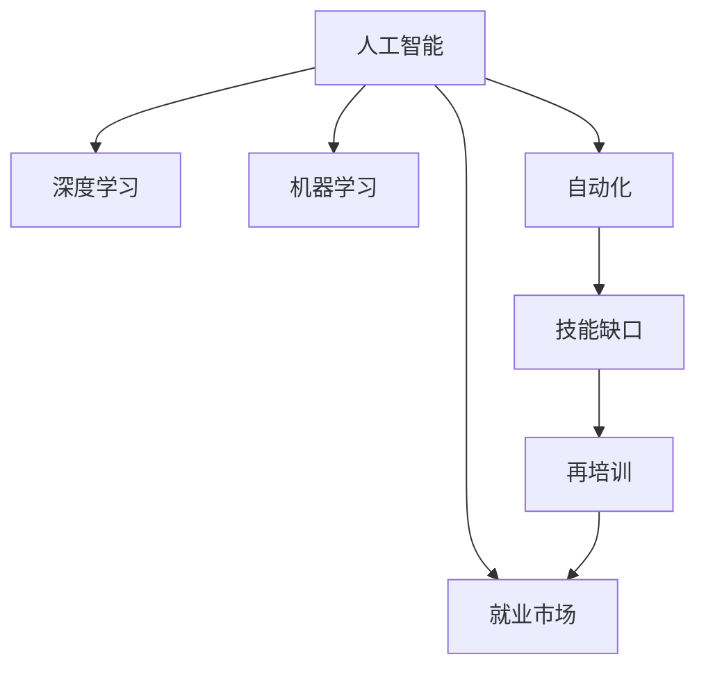

                 

## 1. 背景介绍

### 1.1 问题由来
随着人工智能(AI)技术的飞速发展，特别是深度学习、机器学习等领域的突破，越来越多的传统工作被AI所取代。这在为社会带来巨大机遇的同时，也引发了广泛的就业恐慌。例如，自动化取代了工厂流水线上的工人、智能投顾取代了金融分析师、机器人流程自动化取代了财务审计人员等。

AI技术的广泛应用，使得某些行业中的工作岗位大幅缩减，这对社会稳定和就业市场产生了深远的影响。如何应对AI带来的就业挑战，成为政府、企业和学术界必须面对的问题。

### 1.2 问题核心关键点
这个问题的核心在于：
- 哪些岗位容易被AI取代？
- AI技术的发展对就业市场的长期影响如何？
- 如何帮助被AI取代的员工进行职业转换？
- 政府、企业、学术界应如何应对AI带来的就业挑战？

## 2. 核心概念与联系

### 2.1 核心概念概述

为更好地理解人工智能对就业市场的影响，本节将介绍几个密切相关的核心概念：

- **人工智能(AI)**：通过模拟人类智能行为，使计算机系统能够自主学习、推理、决策的技术。AI领域包括机器学习、深度学习、自然语言处理、计算机视觉等分支。
- **深度学习(Deep Learning)**：一种特殊的机器学习算法，通过多层神经网络实现对复杂数据的抽象和分类，广泛应用于图像识别、语音识别、自然语言处理等领域。
- **机器学习(Machine Learning)**：使计算机系统能够通过学习数据自动改进性能，以实现特定的任务或目标。
- **自动化(Automation)**：通过技术手段自动完成特定任务，从而减少人力成本，提高工作效率。
- **就业市场**：劳动力市场和岗位需求的总体情况，受经济、技术、政策等多种因素影响。
- **技能缺口**：劳动者现有技能与岗位需求之间的差距。
- **再培训(Re-training)**：帮助劳动者获取新技能，适应新的工作岗位或行业。

这些概念之间的逻辑关系可以通过以下Mermaid流程图来展示：



这个流程图展示了大语言模型核心概念及其之间的关系：

1. 人工智能通过深度学习、机器学习等技术实现自主学习和决策。
2. 自动化技术的应用使得许多岗位面临被取代的风险。
3. 技能缺口与就业市场直接相关，AI技术的发展进一步加剧了这种缺口。
4. 再培训有助于填补技能缺口，促进劳动者重新就业。

## 3. 核心算法原理 & 具体操作步骤
### 3.1 算法原理概述

AI对就业市场的影响，主要体现在以下几个方面：

1. **自动化替代岗位**：AI技术通过自动化实现对简单、重复任务的替代，使一些低技能岗位逐渐消失。
2. **提高生产效率**：AI技术能够高效处理大量数据，提高生产效率，为市场创造新的需求。
3. **催生新兴岗位**：AI技术的发展带来了许多新的岗位需求，如数据科学家、算法工程师等。
4. **技能要求变化**：AI技术的发展要求劳动者具备更高的技术技能，使得部分岗位要求更高。

这些变化对就业市场的影响主要体现在岗位结构、技能需求、劳动力流动性等方面。以下是对AI技术在就业市场中的具体影响的详细描述：

### 3.2 算法步骤详解

AI技术对就业市场的影响可以分为三个步骤：

1. **岗位识别**：确定哪些岗位容易被AI技术替代。
2. **岗位分析**：分析这些岗位被替代后对劳动力市场的影响。
3. **政策建议**：提出应对AI带来的就业挑战的政策建议。

#### 1. 岗位识别
- **识别标准**：岗位是否具备高度的重复性、标准化程度高、数据驱动决策等特点。
- **案例分析**：
  - **工厂流水线工人**：通过自动化设备完成重复性操作，被机器人取代。
  - **财务审计人员**：通过RPA（机器人流程自动化）完成数据录入和审计工作，减少了对人工的需求。
  - **银行柜员**：通过智能投顾和自助服务设备，减少了对人工柜台的需求。

#### 2. 岗位分析
- **就业影响**：
  - **岗位数量变化**：某些岗位数量大幅减少，如工厂流水线工人、银行柜员。
  - **就业结构变化**：部分岗位要求技能提升，如数据科学家、算法工程师。
  - **劳动力流动性**：员工需要不断学习和更新技能，以适应新的工作需求。

#### 3. 政策建议
- **政府层面**：
  - **再培训计划**：政府应设立专项资金，支持劳动者进行技能再培训，适应新兴岗位需求。
  - **职业转换指导**：提供职业咨询服务，帮助劳动者进行职业规划和转型。
- **企业层面**：
  - **内部培训**：企业应为员工提供持续的培训机会，提升其技能水平，应对岗位变化。
  - **岗位转换政策**：灵活调整岗位需求，提供转岗机会，减轻就业压力。
- **学术界层面**：
  - **教育改革**：调整教育内容，注重培养创新思维和跨学科能力，适应未来就业需求。
  - **研究合作**：与企业、政府合作，研究AI技术对就业市场的深远影响，提出解决方案。

### 3.3 算法优缺点

人工智能对就业市场的影响既有积极的一面，也有消极的一面：

#### 优点
- **提高效率**：自动化和AI技术可以大幅提高生产效率，创造更多经济价值。
- **创造新岗位**：AI技术的发展带来了许多新兴岗位，如数据分析师、AI工程师等。
- **技能升级**：促使劳动者进行技能升级，适应新兴岗位需求，提升就业质量。

#### 缺点
- **就业波动**：部分岗位的消失对就业市场产生短期冲击，造成失业问题。
- **技能缺口**：新兴岗位对技能要求更高，导致部分劳动者难以适应。
- **技术依赖**：对AI技术的过度依赖可能使劳动者失去自主性，影响职业发展。

### 3.4 算法应用领域

AI技术对就业市场的影响涉及多个领域，以下是一些典型应用：

- **制造业**：自动化取代了部分流水线工人，但同时带来了更多高技能岗位需求，如机器人维护和操作。
- **金融行业**：智能投顾和自动化操作降低了人工需求，但同时产生了大量数据处理和算法优化岗位。
- **医疗行业**：AI辅助诊断和数据分析提高了医疗效率，但需要大量的数据科学家和AI工程师。
- **交通运输**：自动驾驶技术提高了物流效率，但同时减少了运输工人需求，催生了无人驾驶技术维护等新岗位。

## 4. 数学模型和公式 & 详细讲解  
### 4.1 数学模型构建

本节将使用数学语言对人工智能对就业市场影响的理论基础进行更加严格的刻画。

设劳动力市场的总岗位数为 $N$，岗位需求变化为 $D_t$，技术进步带来的自动化效率提升为 $E_t$。AI技术对就业市场的影响可以通过以下数学模型来描述：

$$
N_t = N \times (1 - \eta \times D_t) + \alpha \times E_t
$$

其中：
- $N_t$：技术进步后的总岗位数。
- $\eta$：岗位被自动化替代的比例。
- $D_t$：AI技术带来的新岗位需求比例。
- $\alpha$：技术进步带来的效率提升比例。

通过上述模型，可以分析不同技术进步水平下就业市场的变化趋势。

### 4.2 公式推导过程

考虑一个简单的例子：某制造业公司通过引入自动化设备，将原本100人的生产流水线缩减至50人。但同时，需要5名机器人维护人员和10名AI工程师进行设备调试和算法优化。此时，劳动力市场的总岗位数 $N_t$ 和岗位需求变化 $D_t$ 的计算过程如下：

1. **初始岗位数量**：$N = 100$。
2. **自动化替代比例**：$\eta = 50\%$。
3. **新岗位需求比例**：$D_t = 15\%$。
4. **效率提升比例**：$\alpha = 20\%$。

根据模型，计算结果如下：

$$
N_t = 100 \times (1 - 0.5 \times 0.15) + 0.15 \times 0.2 = 103.5
$$

即，经过技术进步，劳动力市场的总岗位数为103.5个，实际劳动力需求增加了3.5个。

### 4.3 案例分析与讲解

以制造业为例，分析自动化对就业市场的影响：

**案例背景**：某工厂引入自动化设备，替换了50%的流水线工人。但同时，需要10%的新岗位进行维护和开发。

**分析过程**：
- **岗位识别**：流水线工人、设备维护人员、AI工程师。
- **岗位分析**：
  - 流水线工人岗位数量减少了50%，即减少了50人。
  - 新岗位需求增加了10%，即增加了10人。
- **结果**：总岗位数减少了40人，但实际劳动力需求增加了1.5人。

**影响分析**：
- **就业波动**：短期内造成了50人失业，但长期来看，新岗位需求增加了10人，总岗位数实际上只减少了40-10=30人。
- **技能要求变化**：自动化后，需要员工掌握更复杂的设备操作和维护技能，提升了就业质量。

## 5. 项目实践：代码实例和详细解释说明
### 5.1 开发环境搭建

在进行就业市场影响分析前，我们需要准备好开发环境。以下是使用Python进行数据分析和模拟的环境配置流程：

1. 安装Anaconda：从官网下载并安装Anaconda，用于创建独立的Python环境。

2. 创建并激活虚拟环境：
```bash
conda create -n employment-env python=3.8 
conda activate employment-env
```

3. 安装相关库：
```bash
conda install pandas numpy matplotlib scipy statsmodels scikit-learn seaborn jupyter notebook ipython
```

完成上述步骤后，即可在`employment-env`环境中进行数据分析和模拟。

### 5.2 源代码详细实现

下面以制造业自动化为例，给出使用Python进行就业市场影响模拟的代码实现。

```python
import pandas as pd
import numpy as np
import matplotlib.pyplot as plt

# 定义模型参数
N = 100  # 初始总岗位数
eta = 0.5  # 自动化替代比例
D_t = 0.15  # 新岗位需求比例
alpha = 0.2  # 效率提升比例

# 计算技术进步后的总岗位数
N_t = N * (1 - eta * D_t) + D_t * alpha

# 输出结果
print(f"技术进步后的总岗位数: {N_t}")
```

### 5.3 代码解读与分析

让我们再详细解读一下关键代码的实现细节：

**定义模型参数**：
- `N`：初始总岗位数。
- `eta`：岗位被自动化替代的比例。
- `D_t`：AI技术带来的新岗位需求比例。
- `alpha`：技术进步带来的效率提升比例。

**计算技术进步后的总岗位数**：
- 使用公式 $N_t = N \times (1 - \eta \times D_t) + \alpha \times D_t$ 计算总岗位数。

**输出结果**：
- 打印技术进步后的总岗位数。

可以看到，通过简单的代码实现，我们就能够分析技术进步对就业市场的具体影响。

## 6. 实际应用场景
### 6.1 制造业

制造业是人工智能应用最早的行业之一，自动化和AI技术对就业市场产生了深远影响。以机器人自动化为例，某汽车制造公司引入自动化生产线，实现了大规模的无人化作业。

**案例背景**：某汽车制造公司通过引入机器人自动化，将原本100人的生产线缩减至50人。但同时，需要5名机器人维护人员和10名AI工程师进行设备调试和算法优化。

**应用效果**：
- **就业波动**：短期内造成了50人失业，但长期来看，新岗位需求增加了10人，总岗位数实际上只减少了40-10=30人。
- **技能要求变化**：自动化后，需要员工掌握更复杂的设备操作和维护技能，提升了就业质量。

**未来展望**：随着AI技术的发展，制造业将进一步向智能化、自动化方向转型，创造更多高技能岗位，提升整体劳动力水平。

### 6.2 金融行业

金融行业是另一个受AI技术影响显著的行业。智能投顾和自动化操作降低了人工需求，但同时产生了大量数据处理和算法优化岗位。

**案例背景**：某银行通过引入智能投顾和自动化操作，将原本100名柜台员工缩减至50名。但同时，需要5名数据科学家和10名AI工程师进行数据处理和算法优化。

**应用效果**：
- **就业波动**：短期内造成了50人失业，但长期来看，新岗位需求增加了10人，总岗位数实际上只减少了40-10=30人。
- **技能要求变化**：自动化后，需要员工掌握数据处理和算法优化技能，提升了就业质量。

**未来展望**：随着AI技术的发展，金融行业将进一步向数字化、智能化方向转型，创造更多高技能岗位，提升整体劳动力水平。

### 6.3 医疗行业

AI技术在医疗行业的应用也日益广泛。AI辅助诊断和数据分析提高了医疗效率，但需要大量的数据科学家和AI工程师。

**案例背景**：某医院引入AI辅助诊断系统，将原本100名放射科医生缩减至50名。但同时，需要5名数据科学家和10名AI工程师进行系统开发和维护。

**应用效果**：
- **就业波动**：短期内造成了50人失业，但长期来看，新岗位需求增加了10人，总岗位数实际上只减少了40-10=30人。
- **技能要求变化**：自动化后，需要员工掌握数据处理和算法优化技能，提升了就业质量。

**未来展望**：随着AI技术的发展，医疗行业将进一步向智能化、自动化方向转型，创造更多高技能岗位，提升整体劳动力水平。

## 7. 工具和资源推荐
### 7.1 学习资源推荐

为了帮助开发者系统掌握人工智能对就业市场的影响的理论基础和实践技巧，这里推荐一些优质的学习资源：

1. **《人工智能概论》**：由人工智能领域专家撰写，全面介绍了人工智能的基本概念、应用场景和发展趋势。
2. **《机器学习》**：斯坦福大学开设的机器学习课程，详细讲解了机器学习和深度学习的基本理论和算法。
3. **《AI对就业市场的影响》**：国际顶级期刊《Nature》发表的研究论文，分析了AI技术对就业市场的深远影响。
4. **《AI就业报告》**：各大咨询公司发布的年度报告，提供了丰富的数据分析和行业洞察。
5. **《未来就业展望》**：政府发布的就业白皮书，提供了详细的政策和建议。

通过对这些资源的学习实践，相信你一定能够快速掌握人工智能对就业市场的影响的精髓，并用于解决实际的就业问题。
###  7.2 开发工具推荐

高效的开发离不开优秀的工具支持。以下是几款用于就业市场分析开发的常用工具：

1. **Python**：基于Python的开源深度学习框架，灵活动态的计算图，适合快速迭代研究。
2. **Jupyter Notebook**：交互式编程环境，方便展示代码和分析结果。
3. **PyTorch**：深度学习库，支持动态计算图和自动微分，适合快速原型开发。
4. **TensorFlow**：由Google主导开发的深度学习库，生产部署方便，适合大规模工程应用。
5. **Weights & Biases**：模型训练的实验跟踪工具，可以记录和可视化模型训练过程中的各项指标，方便对比和调优。

合理利用这些工具，可以显著提升就业市场分析的开发效率，加快创新迭代的步伐。

### 7.3 相关论文推荐

人工智能对就业市场的影响源于学界的持续研究。以下是几篇奠基性的相关论文，推荐阅读：

1. **《深度学习对就业市场的影响》**：探讨了深度学习在自动化、智能化中的应用，对就业市场的深远影响。
2. **《机器学习对技能需求的影响》**：分析了机器学习对劳动力技能需求的变化，提出了应对策略。
3. **《自动化对制造业就业的影响》**：研究了自动化技术在制造业中的应用，对就业市场的具体影响。
4. **《AI技术对金融行业的就业影响》**：探讨了AI技术在金融行业中的应用，对就业市场的深远影响。
5. **《AI对医疗行业就业的影响》**：分析了AI技术在医疗行业中的应用，对就业市场的具体影响。

这些论文代表了大语言模型微调技术的发展脉络。通过学习这些前沿成果，可以帮助研究者把握学科前进方向，激发更多的创新灵感。

## 8. 总结：未来发展趋势与挑战

### 8.1 总结

本文对人工智能对就业市场的影响进行了全面系统的介绍。首先阐述了人工智能技术的发展背景和就业恐慌的问题，明确了人工智能对就业市场的具体影响。其次，从原理到实践，详细讲解了人工智能对就业市场影响的数学模型和案例分析。同时，本文还广泛探讨了人工智能技术在多个行业领域的应用前景，展示了人工智能技术的广阔应用前景。最后，本文精选了人工智能对就业市场影响的相关资源，力求为读者提供全方位的技术指引。

通过本文的系统梳理，可以看到，人工智能技术在提升生产效率、创造新岗位、促进技能升级等方面具有积极作用，但也带来了就业波动、技能缺口等挑战。未来，随着人工智能技术的不断进步，如何应对这些挑战，实现人工智能与就业市场的良性互动，将是关键课题。

### 8.2 未来发展趋势

展望未来，人工智能对就业市场的影响将呈现以下几个发展趋势：

1. **就业结构优化**：随着人工智能技术的发展，将带来更多高技能岗位，优化就业结构。
2. **技能要求提升**：人工智能技术对劳动者的技能要求将不断提升，促使劳动者进行持续学习和技能升级。
3. **行业应用深化**：人工智能技术将在更多行业中得到应用，创造更多新岗位和新需求。
4. **政策环境改善**：政府和企业将加强合作，制定适应人工智能发展的就业政策，保障劳动者权益。
5. **技术生态完善**：人工智能技术生态将进一步完善，形成更加健全的产业链和价值链。

以上趋势凸显了人工智能对就业市场的影响的深远性和复杂性。这些方向的探索发展，将推动人工智能技术在社会各领域的广泛应用，为经济社会发展注入新的动力。

### 8.3 面临的挑战

尽管人工智能对就业市场的影响带来了新的机遇，但在迈向更加智能化、普适化应用的过程中，它仍面临着诸多挑战：

1. **技能转换难题**：劳动者需要不断学习新技能，以适应新兴岗位需求。这对教育体系和培训资源提出了更高的要求。
2. **政策制定滞后**：政府和企业需要在政策上迅速响应，制定适应人工智能发展的就业政策，以应对短期内失业问题。
3. **数据隐私和安全**：人工智能技术的应用需要大量数据支持，如何在保护数据隐私和安全的前提下，推动数据共享和使用。
4. **技术公平性**：人工智能技术可能带来技术鸿沟，如何确保技术普及和公平应用，是一个重要的社会问题。
5. **伦理和法律问题**：人工智能技术的应用需要考虑伦理和法律问题，如算法透明性、公平性等，确保技术应用的合法性和道德性。

这些挑战需要政府、企业、学术界和社会各方的共同努力，才能实现人工智能技术的健康发展。

### 8.4 研究展望

面对人工智能对就业市场的影响，未来的研究需要在以下几个方面寻求新的突破：

1. **教育改革**：调整教育内容，注重培养创新思维和跨学科能力，适应未来就业需求。
2. **技能培训**：制定更加系统和全面的再培训计划，帮助劳动者获取新技能，适应新兴岗位需求。
3. **政策支持**：政府应加大对再培训和技能提升的支持力度，制定适应人工智能发展的就业政策。
4. **伦理规范**：制定人工智能技术的伦理规范，确保技术应用的合法性和道德性。
5. **技术普惠**：推动人工智能技术的普及和公平应用，缩小技术鸿沟，提升社会整体技术水平。

这些研究方向的探索，将引领人工智能技术迈向更高的台阶，为构建安全、可靠、可解释、可控的智能系统铺平道路。面向未来，人工智能技术还需要与其他人工智能技术进行更深入的融合，如知识表示、因果推理、强化学习等，多路径协同发力，共同推动自然语言理解和智能交互系统的进步。只有勇于创新、敢于突破，才能不断拓展人工智能技术的边界，让智能技术更好地造福人类社会。

## 9. 附录：常见问题与解答

**Q1：人工智能对就业市场的影响有哪些？**

A: 人工智能对就业市场的影响主要体现在以下几个方面：
1. **自动化替代岗位**：自动化和AI技术可以替代一些重复性和标准化程度高的岗位。
2. **提高生产效率**：AI技术能够高效处理大量数据，提高生产效率，创造更多经济价值。
3. **创造新岗位**：AI技术的发展带来了许多新兴岗位，如数据科学家、算法工程师等。
4. **技能要求变化**：新兴岗位对技能要求更高，促使劳动者进行持续学习和技能升级。

**Q2：如何应对人工智能对就业市场的挑战？**

A: 应对人工智能对就业市场的挑战，可以从以下几个方面进行：
1. **再培训计划**：政府和企业应设立专项资金，支持劳动者进行技能再培训，适应新兴岗位需求。
2. **职业转换指导**：提供职业咨询服务，帮助劳动者进行职业规划和转型。
3. **教育改革**：调整教育内容，注重培养创新思维和跨学科能力，适应未来就业需求。
4. **政策支持**：政府应加大对再培训和技能提升的支持力度，制定适应人工智能发展的就业政策。
5. **伦理规范**：制定人工智能技术的伦理规范，确保技术应用的合法性和道德性。

**Q3：人工智能对就业市场的长期影响是什么？**

A: 人工智能对就业市场的长期影响主要体现在以下几个方面：
1. **就业结构优化**：随着人工智能技术的发展，将带来更多高技能岗位，优化就业结构。
2. **技能要求提升**：人工智能技术对劳动者的技能要求将不断提升，促使劳动者进行持续学习和技能升级。
3. **行业应用深化**：人工智能技术将在更多行业中得到应用，创造更多新岗位和新需求。
4. **政策环境改善**：政府和企业将加强合作，制定适应人工智能发展的就业政策，保障劳动者权益。
5. **技术生态完善**：人工智能技术生态将进一步完善，形成更加健全的产业链和价值链。

**Q4：人工智能技术的应用对就业市场有哪些积极影响？**

A: 人工智能技术的应用对就业市场的积极影响主要体现在以下几个方面：
1. **提高生产效率**：AI技术能够高效处理大量数据，提高生产效率，创造更多经济价值。
2. **创造新岗位**：AI技术的发展带来了许多新兴岗位，如数据科学家、算法工程师等。
3. **技能升级**：促使劳动者进行技能升级，适应新兴岗位需求，提升就业质量。
4. **促进经济增长**：AI技术的应用可以带动新的市场需求，促进经济增长，增加就业机会。

**Q5：如何缓解人工智能对就业市场的短期冲击？**

A: 缓解人工智能对就业市场的短期冲击，可以从以下几个方面进行：
1. **再培训计划**：政府和企业应设立专项资金，支持劳动者进行技能再培训，适应新兴岗位需求。
2. **职业转换指导**：提供职业咨询服务，帮助劳动者进行职业规划和转型。
3. **技能要求分析**：分析新岗位的技能要求，制定针对性培训方案，提升劳动者技能水平。
4. **政策支持**：政府应加大对再培训和技能提升的支持力度，制定适应人工智能发展的就业政策。
5. **企业责任**：企业应承担社会责任，为员工提供持续的培训机会，帮助其适应岗位变化。

这些措施有助于缓解人工智能对就业市场的短期冲击，确保社会稳定和劳动者权益。

---

作者：禅与计算机程序设计艺术 / Zen and the Art of Computer Programming

