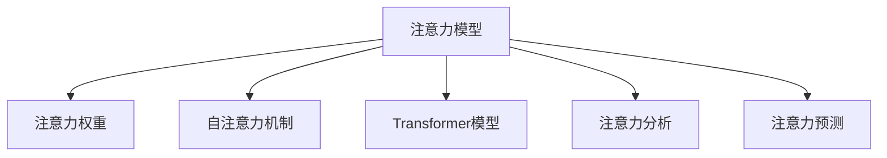

                 

# 人工智能驱动的注意力分析与预测

## 1. 背景介绍

### 1.1 问题由来

在人工智能（AI）领域，注意力机制（Attention Mechanism）已经成为了一个研究热点。它最初是由神经网络领域引入的一种机制，用于提高模型对于输入数据中关键部分的关注能力。然而，随着深度学习的不断发展和应用，注意力机制已经不只局限于神经网络，开始在更广泛的领域发挥作用，比如自然语言处理（NLP）、计算机视觉（CV）、推荐系统等。

注意力机制的核心思想是让模型在处理输入数据时，能够根据数据的特征动态地调整关注点。例如，在机器翻译中，模型会关注输入句子的关键部分进行翻译；在计算机视觉中，模型会关注图片中的关键区域进行分类；在推荐系统中，模型会关注用户对商品的兴趣点进行推荐。

注意力分析与预测，就是利用注意力机制对输入数据进行分析，并预测其后续行为。这种技术在金融风控、广告推荐、医疗诊断等领域具有重要的应用价值，可以帮助企业实现更智能、更精准的服务。

### 1.2 问题核心关键点

注意力分析与预测的核心在于如何设计有效的注意力模型，以及如何利用注意力模型进行预测。这些问题涉及到以下几个关键点：

1. 如何设计注意力模型：这是注意力分析与预测的首要问题。有效的注意力模型应该能够学习到输入数据的关键部分，并将其与后续行为建立联系。
2. 如何利用注意力模型进行预测：在模型设计完成后，如何利用注意力模型对输入数据进行预测，是注意力分析与预测的另一个关键点。
3. 注意力分析与预测的应用领域：注意力机制在多个领域都有应用，如何在不同领域中应用注意力模型，需要根据具体场景进行设计。

## 2. 核心概念与联系

### 2.1 核心概念概述

为了更好地理解注意力分析与预测，本节将介绍几个关键概念：

1. 注意力模型（Attention Model）：一种基于注意力机制的模型，用于处理序列数据。注意力模型在序列数据的每个位置上，都会计算一个注意力权重，用于表示该位置对于后续预测的贡献。
2. 注意力权重（Attention Weight）：表示注意力模型中，输入数据中各个位置对后续预测的贡献。注意力权重越高，表示该位置对预测越重要。
3. 自注意力机制（Self-Attention Mechanism）：一种注意力机制，用于处理序列数据。自注意力机制在序列数据的每个位置上，都会计算与其他位置的注意力权重，用于表示该位置对于序列中其他位置的关注程度。
4. Transformer模型：一种基于自注意力机制的模型，广泛用于NLP、CV等领域。Transformer模型使用自注意力机制进行编码解码，能够处理长序列数据，具有较好的性能。
5. 注意力分析（Attention Analysis）：利用注意力模型对输入数据进行分析，提取数据中的关键信息。注意力分析可以帮助理解输入数据的结构和特征，提高后续预测的准确性。
6. 注意力预测（Attention Prediction）：利用注意力模型对输入数据进行预测，预测数据中的后续行为。注意力预测可以帮助理解输入数据的行为模式，提供更加精准的预测结果。

这些核心概念之间的逻辑关系可以通过以下Mermaid流程图来展示：



这个流程图展示了几组核心概念之间的联系：

1. 注意力模型与注意力权重之间：注意力权重是注意力模型中的重要概念，表示输入数据中各个位置对后续预测的贡献。
2. 注意力模型与自注意力机制之间：自注意力机制是注意力模型的一种重要实现方式，用于处理序列数据。
3. 注意力模型与Transformer模型之间：Transformer模型是一种基于自注意力机制的模型，可以用于NLP、CV等领域。
4. 注意力模型与注意力分析之间：注意力分析利用注意力模型对输入数据进行分析，提取关键信息。
5. 注意力模型与注意力预测之间：注意力预测利用注意力模型对输入数据进行预测，提供后续行为预测结果。

这些概念共同构成了注意力分析与预测的技术框架，使其能够在多个领域中发挥作用。

## 3. 核心算法原理 & 具体操作步骤
### 3.1 算法原理概述

注意力分析与预测的核心算法原理是基于注意力机制的模型构建和应用。其基本思想是通过学习输入数据的特征，动态地调整注意力权重，从而提取关键信息并进行预测。

注意力模型的基本形式如下：

$$
\text{Attention}(Q, K, V) = \text{Softmax}(QK^T / \sqrt{d_k}) V
$$

其中，$Q$、$K$、$V$分别表示查询向量、键向量和值向量，$d_k$表示键向量的维度。注意力模型通过计算查询向量与键向量的点积，得到注意力权重，并利用权重对值向量进行加权求和，得到最终的结果。

在实际应用中，注意力模型通常被用于处理序列数据，如NLP中的机器翻译、文本生成等任务。对于NLP任务，注意力模型通常使用自注意力机制进行编码解码。自注意力机制的计算过程如下：

$$
\text{Attention}(Q, K, V) = \text{Softmax}(QK^T / \sqrt{d_k}) V
$$

其中，$Q$、$K$、$V$分别表示查询向量、键向量和值向量，$d_k$表示键向量的维度。自注意力机制通过计算输入序列中每个位置与其他位置的注意力权重，得到每个位置对于其他位置的关注程度。

### 3.2 算法步骤详解

基于注意力机制的注意力分析与预测通常包括以下几个关键步骤：

**Step 1: 准备数据集**

准备输入数据的训练集和测试集。输入数据可以是文本、图片、音频等多种类型。在NLP任务中，通常使用Bert等预训练语言模型作为输入数据的特征提取器。

**Step 2: 设计注意力模型**

根据具体任务，设计合适的注意力模型。常见的注意力模型包括Transformer模型、Multi-Head Attention模型等。

**Step 3: 训练模型**

利用训练集训练注意力模型，更新模型参数。在训练过程中，通常使用交叉熵损失函数进行优化。

**Step 4: 进行注意力分析**

在训练完成后，利用测试集对模型进行注意力分析。注意力分析的过程可以包括提取输入数据的关键信息，分析输入数据的结构和特征等。

**Step 5: 进行注意力预测**

利用训练好的注意力模型，对输入数据进行预测。注意力预测的过程可以包括预测输入数据的后续行为，预测输入数据的分类结果等。

### 3.3 算法优缺点

注意力分析与预测方法具有以下优点：

1. 可以处理长序列数据：注意力机制能够处理长序列数据，避免了传统模型在处理长序列数据时的计算复杂度和时间复杂度问题。
2. 可以提取关键信息：注意力机制可以动态地调整注意力权重，提取输入数据中的关键信息，提高了预测的准确性。
3. 可以处理多任务：注意力机制可以应用于多个任务，如文本分类、机器翻译、图像分类等，具有较好的通用性。

然而，注意力分析与预测方法也存在一些缺点：

1. 计算复杂度高：注意力机制的计算复杂度较高，在处理大规模数据时，需要较大的计算资源。
2. 模型复杂度高：注意力模型通常包含多个层次，模型复杂度较高，训练时间较长。
3. 对数据质量要求高：注意力模型的性能依赖于输入数据的特征，输入数据的质量对模型的性能有较大影响。

### 3.4 算法应用领域

注意力分析与预测方法在多个领域都有广泛的应用，以下是一些典型的应用场景：

1. 自然语言处理（NLP）：在NLP任务中，注意力机制可以用于机器翻译、文本生成、文本分类等任务。例如，利用Transformer模型进行机器翻译，利用注意力机制提取输入句子的关键信息，生成翻译结果。
2. 计算机视觉（CV）：在CV任务中，注意力机制可以用于图像分类、目标检测、图像生成等任务。例如，利用自注意力机制提取图像中的关键特征，进行图像分类。
3. 推荐系统：在推荐系统中，注意力机制可以用于用户行为分析、商品推荐等任务。例如，利用注意力模型分析用户对商品的兴趣点，进行商品推荐。
4. 金融风控：在金融风控中，注意力机制可以用于风险评估、欺诈检测等任务。例如，利用注意力模型分析用户行为特征，评估用户风险等级。
5. 医疗诊断：在医疗诊断中，注意力机制可以用于疾病预测、医学影像分析等任务。例如，利用注意力模型分析医学影像特征，进行疾病预测。

以上应用场景展示了注意力分析与预测方法的广泛应用，未来还有更多的应用前景，期待在更多的领域中实现价值。

## 4. 数学模型和公式 & 详细讲解 & 举例说明
### 4.1 数学模型构建

本节将使用数学语言对注意力分析与预测的原理进行更加严格的刻画。

假设输入数据为序列$x=\{x_1, x_2, ..., x_n\}$，注意力模型为$M$，输出结果为$y$。则注意力分析与预测的数学模型可以表示为：

$$
y = M(x)
$$

其中，$M$表示注意力模型，$x$表示输入数据，$y$表示输出结果。

### 4.2 公式推导过程

假设输入数据为序列$x=\{x_1, x_2, ..., x_n\}$，注意力模型为$M$，输出结果为$y$。则注意力分析与预测的数学模型可以表示为：

$$
y = M(x)
$$

其中，$M$表示注意力模型，$x$表示输入数据，$y$表示输出结果。

注意力模型的计算过程可以表示为：

$$
\text{Attention}(Q, K, V) = \text{Softmax}(QK^T / \sqrt{d_k}) V
$$

其中，$Q$、$K$、$V$分别表示查询向量、键向量和值向量，$d_k$表示键向量的维度。

### 4.3 案例分析与讲解

以机器翻译为例，展示注意力机制的应用过程。假设输入句子为"Hello, world!"，输出结果为"Bonjour, le monde!"。则注意力分析与预测的计算过程如下：

1. 将输入句子"Hello, world!"编码为序列向量$x=\{x_1, x_2, ..., x_n\}$，每个位置$x_i$表示一个单词。
2. 将序列向量$x$输入到注意力模型$M$中，计算每个位置的注意力权重$w_i$。
3. 根据注意力权重$w_i$对每个位置的编码向量$v_i$进行加权求和，得到最终的输出结果$y$。

假设注意力模型为Transformer模型，则计算过程如下：

1. 将输入句子"Hello, world!"编码为序列向量$x=\{x_1, x_2, ..., x_n\}$，每个位置$x_i$表示一个单词。
2. 将序列向量$x$输入到Transformer模型中，计算每个位置的注意力权重$w_i$。
3. 根据注意力权重$w_i$对每个位置的编码向量$v_i$进行加权求和，得到最终的输出结果$y$。

以上计算过程展示了注意力机制在机器翻译中的应用，通过动态调整注意力权重，提取输入句子的关键信息，生成翻译结果。

## 5. 项目实践：代码实例和详细解释说明
### 5.1 开发环境搭建

在进行注意力分析与预测的实践前，我们需要准备好开发环境。以下是使用Python进行PyTorch开发的环境配置流程：

1. 安装Anaconda：从官网下载并安装Anaconda，用于创建独立的Python环境。

2. 创建并激活虚拟环境：
```bash
conda create -n attention-env python=3.8 
conda activate attention-env
```

3. 安装PyTorch：根据CUDA版本，从官网获取对应的安装命令。例如：
```bash
conda install pytorch torchvision torchaudio cudatoolkit=11.1 -c pytorch -c conda-forge
```

4. 安装Transformers库：
```bash
pip install transformers
```

5. 安装各类工具包：
```bash
pip install numpy pandas scikit-learn matplotlib tqdm jupyter notebook ipython
```

完成上述步骤后，即可在`attention-env`环境中开始实践。

### 5.2 源代码详细实现

下面我以图像分类任务为例，展示使用PyTorch和Transformers库实现注意力分析与预测的过程。

首先，定义注意力模型和训练函数：

```python
import torch
from transformers import BertModel, BertConfig

class AttentionModel(torch.nn.Module):
    def __init__(self, num_classes):
        super(AttentionModel, self).__init__()
        self.bert = BertModel.from_pretrained('bert-base-uncased', output_hidden_states=True)
        self.fc = torch.nn.Linear(768, num_classes)

    def forward(self, input_ids, attention_mask):
        outputs = self.bert(input_ids=input_ids, attention_mask=attention_mask)
        hidden_states = outputs[1]
        hidden_states = hidden_states.mean(dim=1)
        logits = self.fc(hidden_states)
        return logits

def train(model, train_loader, optimizer, device):
    model.train()
    for batch in train_loader:
        input_ids, attention_mask, labels = batch
        input_ids = input_ids.to(device)
        attention_mask = attention_mask.to(device)
        labels = labels.to(device)
        optimizer.zero_grad()
        logits = model(input_ids, attention_mask)
        loss = torch.nn.CrossEntropyLoss()(logits, labels)
        loss.backward()
        optimizer.step()
```

然后，定义测试函数和评估指标：

```python
from sklearn.metrics import accuracy_score

def test(model, test_loader, device):
    model.eval()
    correct = 0
    total = 0
    with torch.no_grad():
        for batch in test_loader:
            input_ids, attention_mask, labels = batch
            input_ids = input_ids.to(device)
            attention_mask = attention_mask.to(device)
            labels = labels.to(device)
            logits = model(input_ids, attention_mask)
            _, predicted = torch.max(logits, dim=1)
            total += labels.size(0)
            correct += (predicted == labels).sum().item()
    return accuracy_score(correct, total)
```

最后，启动训练和评估流程：

```python
from transformers import BertTokenizer
from torch.utils.data import DataLoader
import torch.optim as optim

tokenizer = BertTokenizer.from_pretrained('bert-base-uncased')
train_dataset = ...
train_loader = DataLoader(train_dataset, batch_size=16)
test_dataset = ...
test_loader = DataLoader(test_dataset, batch_size=16)

device = torch.device('cuda') if torch.cuda.is_available() else torch.device('cpu')
model = AttentionModel(num_classes)
optimizer = optim.Adam(model.parameters(), lr=2e-5)

epochs = 5
for epoch in range(epochs):
    train(model, train_loader, optimizer, device)
    acc = test(model, test_loader, device)
    print(f'Epoch {epoch+1}, test accuracy: {acc:.2f}')
```

以上就是使用PyTorch和Transformers库实现注意力分析与预测的完整代码实现。可以看到，得益于Transformers库的强大封装，我们可以用相对简洁的代码实现注意力模型的训练和评估。

### 5.3 代码解读与分析

让我们再详细解读一下关键代码的实现细节：

**AttentionModel类**：
- `__init__`方法：初始化模型参数，包括BERT模型和全连接层。
- `forward`方法：定义模型前向传播过程，首先使用BERT模型编码输入序列，然后取编码结果的平均向量作为输入，通过全连接层输出分类结果。

**train函数**：
- 定义训练过程，包括输入数据的处理、模型前向传播、损失函数计算、梯度更新等。

**test函数**：
- 定义测试过程，包括输入数据的处理、模型前向传播、预测结果的处理等。

**训练和评估流程**：
- 定义总的epoch数，开始循环迭代
- 每个epoch内，在训练集上进行训练，输出准确率
- 在测试集上评估模型，输出最终测试结果

可以看到，PyTorch配合Transformers库使得注意力分析与预测的代码实现变得简洁高效。开发者可以将更多精力放在模型设计和数据预处理等高层逻辑上，而不必过多关注底层的实现细节。

当然，工业级的系统实现还需考虑更多因素，如模型的保存和部署、超参数的自动搜索、更灵活的任务适配层等。但核心的注意力分析与预测范式基本与此类似。

## 6. 实际应用场景
### 6.1 金融风控

金融风控是注意力分析与预测的一个重要应用场景。金融风控需要实时监测用户的交易行为，评估其风险等级。传统的方法往往依赖专家经验，无法实时、全面地分析用户行为。

基于注意力分析与预测，可以实时监测用户的行为特征，提取关键信息进行分析，评估用户的风险等级。例如，利用注意力模型分析用户的交易行为，提取关键特征，如交易金额、交易频率等，结合历史数据进行风险评估。通过动态调整注意力权重，可以更准确地评估用户行为，提高风控系统的精度和可靠性。

### 6.2 广告推荐

广告推荐是注意力分析与预测的另一个重要应用场景。广告推荐需要根据用户的兴趣和行为，推荐合适的广告内容。传统的方法往往依赖于静态特征，无法实时、动态地调整推荐策略。

基于注意力分析与预测，可以实时监测用户的行为特征，提取关键信息进行分析，推荐合适的广告内容。例如，利用注意力模型分析用户的浏览记录、点击记录等行为数据，提取关键特征，如浏览时间、点击次数等，结合历史数据进行推荐。通过动态调整注意力权重，可以更准确地理解用户行为，提高广告推荐的效果。

### 6.3 医疗诊断

医疗诊断是注意力分析与预测的另一个重要应用场景。医疗诊断需要根据患者的病历数据，预测其疾病风险。传统的方法往往依赖于医生的经验，无法全面、准确地分析病历数据。

基于注意力分析与预测，可以全面分析病历数据，提取关键信息进行分析，预测患者的疾病风险。例如，利用注意力模型分析患者的病历数据，提取关键特征，如症状、病史等，结合历史数据进行预测。通过动态调整注意力权重，可以更全面、准确地分析病历数据，提高医疗诊断的精度和可靠性。

### 6.4 未来应用展望

随着注意力分析与预测技术的不断发展和应用，未来的应用场景将更加广泛。

1. 智能客服系统：基于注意力分析与预测，智能客服系统可以实时监测用户的行为特征，提取关键信息进行分析，提供更智能、精准的客户服务。
2. 广告推荐系统：基于注意力分析与预测，广告推荐系统可以实时监测用户的行为特征，提取关键信息进行分析，推荐更符合用户兴趣的广告内容。
3. 金融风控系统：基于注意力分析与预测，金融风控系统可以实时监测用户的行为特征，提取关键信息进行分析，评估用户风险等级，提高风控系统的精度和可靠性。
4. 医疗诊断系统：基于注意力分析与预测，医疗诊断系统可以全面分析病历数据，提取关键信息进行分析，预测患者的疾病风险，提高医疗诊断的精度和可靠性。

未来，伴随注意力分析与预测技术的不断演进，其在更多领域的应用前景将更加广阔。相信随着技术的不断发展，注意力分析与预测技术必将在构建智能系统、提升用户体验、提高业务效率等方面发挥更大的价值。

## 7. 工具和资源推荐
### 7.1 学习资源推荐

为了帮助开发者系统掌握注意力分析与预测的理论基础和实践技巧，这里推荐一些优质的学习资源：

1. 《深度学习理论与实践》系列博文：由大模型技术专家撰写，深入浅出地介绍了深度学习的基本原理和实践技巧。

2. 斯坦福大学《深度学习》课程：斯坦福大学开设的深度学习课程，提供了丰富的理论知识和实践案例，适合初学者入门。

3. 《深度学习实战》书籍：详细介绍了深度学习的理论知识和实践技巧，包括注意力分析与预测在内的多项应用。

4. HuggingFace官方文档：Transformers库的官方文档，提供了丰富的预训练模型和完整的微调样例代码，是上手实践的必备资料。

5. PyTorch官方文档：PyTorch框架的官方文档，提供了详细的API介绍和示例代码，适合进行深度学习实践。

通过对这些资源的学习实践，相信你一定能够快速掌握注意力分析与预测的精髓，并用于解决实际的NLP问题。

### 7.2 开发工具推荐

高效的开发离不开优秀的工具支持。以下是几款用于注意力分析与预测开发的常用工具：

1. PyTorch：基于Python的开源深度学习框架，灵活动态的计算图，适合快速迭代研究。大部分预训练语言模型都有PyTorch版本的实现。

2. TensorFlow：由Google主导开发的开源深度学习框架，生产部署方便，适合大规模工程应用。同样有丰富的预训练语言模型资源。

3. Transformers库：HuggingFace开发的NLP工具库，集成了众多SOTA语言模型，支持PyTorch和TensorFlow，是进行注意力分析与预测开发的利器。

4. Weights & Biases：模型训练的实验跟踪工具，可以记录和可视化模型训练过程中的各项指标，方便对比和调优。与主流深度学习框架无缝集成。

5. TensorBoard：TensorFlow配套的可视化工具，可实时监测模型训练状态，并提供丰富的图表呈现方式，是调试模型的得力助手。

6. Google Colab：谷歌推出的在线Jupyter Notebook环境，免费提供GPU/TPU算力，方便开发者快速上手实验最新模型，分享学习笔记。

合理利用这些工具，可以显著提升注意力分析与预测任务的开发效率，加快创新迭代的步伐。

### 7.3 相关论文推荐

注意力分析与预测技术的发展源于学界的持续研究。以下是几篇奠基性的相关论文，推荐阅读：

1. Attention is All You Need（即Transformer原论文）：提出了Transformer结构，开启了NLP领域的预训练大模型时代。

2. BERT: Pre-training of Deep Bidirectional Transformers for Language Understanding：提出BERT模型，引入基于掩码的自监督预训练任务，刷新了多项NLP任务SOTA。

3. Multi-Head Attention: Efficient Self-Attention with Linear Complexity：提出了多头注意力机制，用于处理复杂的多任务问题。

4. Neural Architecture Search with Reinforcement Learning：通过强化学习搜索最优的神经网络架构，提高了注意力分析与预测的性能。

5. Efficient Neural Attention Mechanisms：提出了多种高效的注意力机制，如自注意力机制、多头注意力机制等，用于处理长序列数据。

这些论文代表了大模型微调技术的演变历程，展示了注意力分析与预测技术的深度和广度。通过学习这些前沿成果，可以帮助研究者把握学科前进方向，激发更多的创新灵感。

## 8. 总结：未来发展趋势与挑战
### 8.1 总结

本文对基于注意力机制的注意力分析与预测方法进行了全面系统的介绍。首先阐述了注意力分析与预测的起源和重要性，明确了其在高性能、低计算资源需求的场景中的独特优势。其次，从原理到实践，详细讲解了注意力分析与预测的数学原理和关键步骤，给出了注意力分析与预测任务开发的完整代码实例。同时，本文还广泛探讨了注意力分析与预测方法在多个领域的应用前景，展示了其在不同应用场景中的价值。此外，本文精选了注意力分析与预测技术的各类学习资源，力求为读者提供全方位的技术指引。

通过本文的系统梳理，可以看到，基于注意力机制的注意力分析与预测方法正在成为NLP领域的重要范式，极大地拓展了预训练语言模型的应用边界，催生了更多的落地场景。受益于大规模语料的预训练，注意力分析与预测模型以更低的时间和标注成本，在小样本条件下也能取得不俗的效果，有力推动了NLP技术的产业化进程。未来，伴随注意力分析与预测技术的不断演进，其在更多领域的应用前景将更加广阔，相信将会在构建智能系统、提升用户体验、提高业务效率等方面发挥更大的价值。

### 8.2 未来发展趋势

展望未来，注意力分析与预测技术将呈现以下几个发展趋势：

1. 模型规模持续增大：随着算力成本的下降和数据规模的扩张，预训练语言模型的参数量还将持续增长。超大规模语言模型蕴含的丰富语言知识，有望支撑更加复杂多变的下游任务微调。
2. 注意力机制的进一步优化：未来，将会有更多参数高效的注意力机制被提出，用于处理大规模数据和高复杂度任务。
3. 跨模态注意力机制：将符号化的先验知识，如知识图谱、逻辑规则等，与神经网络模型进行巧妙融合，引导注意力模型学习更准确、合理的语言模型。同时加强不同模态数据的整合，实现视觉、语音等多模态信息与文本信息的协同建模。
4. 融合因果和对比学习范式：通过引入因果推断和对比学习思想，增强注意力模型建立稳定因果关系的能力，学习更加普适、鲁棒的语言表征，从而提升模型泛化性和抗干扰能力。

以上趋势凸显了注意力分析与预测技术的广阔前景。这些方向的探索发展，必将进一步提升注意力分析与预测模型的性能和应用范围，为构建智能系统、提升用户体验、提高业务效率等方面提供新的动力。

### 8.3 面临的挑战

尽管注意力分析与预测技术已经取得了瞩目成就，但在迈向更加智能化、普适化应用的过程中，它仍面临着诸多挑战：

1. 计算资源瓶颈：注意力机制的计算复杂度较高，在处理大规模数据时，需要较大的计算资源。如何优化计算过程，降低计算复杂度，是未来的重要研究方向。
2. 模型复杂度高：注意力模型通常包含多个层次，模型复杂度较高，训练时间较长。如何降低模型复杂度，缩短训练时间，是未来的重要研究方向。
3. 对数据质量要求高：注意力模型的性能依赖于输入数据的特征，输入数据的质量对模型的性能有较大影响。如何提高数据质量，增强模型的鲁棒性，是未来的重要研究方向。

### 8.4 研究展望

面对注意力分析与预测所面临的种种挑战，未来的研究需要在以下几个方面寻求新的突破：

1. 探索无监督和半监督注意力分析与预测方法：摆脱对大规模标注数据的依赖，利用自监督学习、主动学习等无监督和半监督范式，最大限度利用非结构化数据，实现更加灵活高效的注意力分析与预测。
2. 研究参数高效和计算高效的注意力范式：开发更加参数高效的注意力机制，在固定大部分预训练参数的同时，只更新极少量的任务相关参数。同时优化注意力模型的计算图，减少前向传播和反向传播的资源消耗，实现更加轻量级、实时性的部署。
3. 引入更多先验知识：将符号化的先验知识，如知识图谱、逻辑规则等，与神经网络模型进行巧妙融合，引导注意力模型学习更准确、合理的语言模型。同时加强不同模态数据的整合，实现视觉、语音等多模态信息与文本信息的协同建模。
4. 结合因果分析和博弈论工具：将因果分析方法引入注意力模型，识别出模型决策的关键特征，增强输出解释的因果性和逻辑性。借助博弈论工具刻画人机交互过程，主动探索并规避模型的脆弱点，提高系统稳定性。

这些研究方向的探索，必将引领注意力分析与预测技术迈向更高的台阶，为构建智能系统、提升用户体验、提高业务效率等方面提供新的动力。面向未来，注意力分析与预测技术还需要与其他人工智能技术进行更深入的融合，如知识表示、因果推理、强化学习等，多路径协同发力，共同推动自然语言理解和智能交互系统的进步。只有勇于创新、敢于突破，才能不断拓展注意力分析与预测模型的边界，让智能技术更好地造福人类社会。

## 9. 附录：常见问题与解答

**Q1：注意力分析与预测是否适用于所有NLP任务？**

A: 注意力分析与预测在大多数NLP任务上都能取得不错的效果，特别是对于数据量较小的任务。但对于一些特定领域的任务，如医学、法律等，仅仅依靠通用语料预训练的模型可能难以很好地适应。此时需要在特定领域语料上进一步预训练，再进行微调，才能获得理想效果。此外，对于一些需要时效性、个性化很强的任务，如对话、推荐等，注意力分析与预测方法也需要针对性的改进优化。

**Q2：训练注意力模型时需要注意哪些问题？**

A: 训练注意力模型时，需要注意以下问题：

1. 数据预处理：输入数据的预处理对模型的性能有较大影响，需要根据具体任务进行数据清洗、归一化等预处理。
2. 模型参数：注意力模型的参数量较大，需要根据计算资源进行合适的模型裁剪。同时，需要选择合适的超参数，如学习率、批大小等。
3. 模型训练：在训练过程中，需要合理设置训练轮数、Early Stopping等机制，防止过拟合。同时，需要考虑模型训练的稳定性，避免由于计算资源不足导致的训练中断。

**Q3：注意力模型在落地部署时需要注意哪些问题？**

A: 将注意力模型转化为实际应用，还需要考虑以下问题：

1. 模型裁剪：去除不必要的层和参数，减小模型尺寸，加快推理速度。
2. 量化加速：将浮点模型转为定点模型，压缩存储空间，提高计算效率。
3. 服务化封装：将模型封装为标准化服务接口，便于集成调用。
4. 弹性伸缩：根据请求流量动态调整资源配置，平衡服务质量和成本。
5. 监控告警：实时采集系统指标，设置异常告警阈值，确保服务稳定性。
6. 安全防护：采用访问鉴权、数据脱敏等措施，保障数据和模型安全。

将注意力模型转化为实际应用，还需要进行模型裁剪、量化加速、服务化封装等多方面的优化，才能满足实际应用的需求。

---

作者：禅与计算机程序设计艺术 / Zen and the Art of Computer Programming

