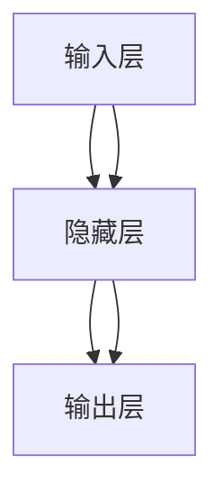

                 

## 1. 背景介绍

在人工智能的早期历史中，人工神经网络（Artificial Neural Network, ANN）扮演了至关重要的角色。它们不仅为现代深度学习奠定了基础，还推动了计算机科学、认知科学等诸多领域的发展。本文将探讨人工神经网络的早期工作，详细阐述其原理、发展历程以及未来前景，希望为读者提供全面而深入的理解。

## 2. 核心概念与联系

### 2.1 核心概念概述

人工神经网络是一种模拟生物神经网络的计算模型，由多个神经元（节点）和连接这些神经元的权重组成。每个神经元接收输入，通过激活函数计算输出，并传递给下一层。这种分层结构使得神经网络可以处理复杂的非线性关系，从而在图像识别、语音识别、自然语言处理等领域取得卓越成效。

### 2.2 核心概念原理和架构的 Mermaid 流程图



此图展示了典型的三层人工神经网络架构，其中输入层接收外部数据，隐藏层和输出层进行数据处理和输出。每层之间的连接权重由随机初始化得到，通过反向传播算法不断调整，以优化模型性能。

### 2.3 核心概念之间的联系

人工神经网络与机器学习、深度学习有着紧密的联系。机器学习中的监督学习、无监督学习和强化学习等，都可以通过神经网络模型实现。而深度学习则是在多层神经网络的基础上，进一步增加网络深度和模型复杂度，以应对更复杂的任务。

## 3. 核心算法原理 & 具体操作步骤

### 3.1 算法原理概述

人工神经网络的训练过程通常采用梯度下降算法（Gradient Descent）。该算法通过计算损失函数对权重参数的偏导数，来更新模型参数，使损失函数最小化，从而优化模型预测能力。具体步骤包括前向传播、损失计算、反向传播和权重更新等。

### 3.2 算法步骤详解

1. **初始化权重**：随机初始化各层之间的连接权重和偏置项。
2. **前向传播**：将输入数据输入网络，通过逐层计算，得到输出结果。
3. **损失计算**：将模型输出与真实标签进行比较，计算损失函数。
4. **反向传播**：计算损失函数对各层权重和偏置的梯度，更新权重参数。
5. **权重更新**：使用梯度下降算法更新权重，迭代优化模型。

### 3.3 算法优缺点

#### 优点：

- 强大的非线性拟合能力：多层神经网络可以处理复杂的非线性关系。
- 并行计算能力强：神经网络可以并行计算多个输入，提高训练效率。
- 适应性强：可以适应不同领域和数据类型。

#### 缺点：

- 易过拟合：需要大量数据和正则化技术来避免过拟合。
- 计算量大：特别是深层神经网络，训练和推理计算量巨大。
- 难以解释：神经网络“黑盒”特性使其输出难以解释。

### 3.4 算法应用领域

人工神经网络在诸多领域都有广泛应用，包括：

- 图像识别：如卷积神经网络（CNN）用于图像分类、目标检测等。
- 自然语言处理：如循环神经网络（RNN）用于文本生成、语言模型等。
- 语音识别：如深度神经网络（DNN）用于语音识别、文本转语音（TTS）等。
- 推荐系统：如协同过滤和深度神经网络结合的推荐算法。

## 4. 数学模型和公式 & 详细讲解 & 举例说明

### 4.1 数学模型构建

人工神经网络通常表示为：

$$
y = f(\sum_{i=1}^n w_i x_i + b)
$$

其中，$f$为激活函数，$w_i$为权重，$x_i$为输入，$b$为偏置项。神经网络的输出可以表示为一系列非线性变换的组合。

### 4.2 公式推导过程

以最简单的单层神经网络为例，设输入为$x$，输出为$y$，隐藏层神经元个数为$h$，权重矩阵为$W$，偏置向量为$b$，激活函数为$f$。则前向传播过程如下：

$$
h = f(Wx + b)
$$

$$
y = f(W_h h + b_y)
$$

其中，$W_h$为隐藏层到输出层的权重矩阵，$b_y$为输出层的偏置向量。

### 4.3 案例分析与讲解

以手写数字识别为例，输入为28x28的灰度图像，输出为0-9的数字标签。使用LeNet网络（一种经典的卷积神经网络）进行训练，输入图像经过卷积层、池化层、全连接层后，进入softmax分类器输出结果。通过反向传播算法不断调整权重和偏置，最小化交叉熵损失，训练模型识别手写数字。

## 5. 项目实践：代码实例和详细解释说明

### 5.1 开发环境搭建

1. 安装Python和相关库：
   ```bash
   pip install numpy tensorflow matplotlib scikit-learn
   ```

2. 下载MNIST数据集：
   ```bash
   wget http://yann.lecun.com/exdb/mnist/
   ```

### 5.2 源代码详细实现

以下是使用TensorFlow实现手写数字识别的代码示例：

```python
import tensorflow as tf
from tensorflow.keras.datasets import mnist
from tensorflow.keras.layers import Dense, Flatten, Conv2D, MaxPooling2D
from tensorflow.keras.models import Sequential

# 加载MNIST数据集
(x_train, y_train), (x_test, y_test) = mnist.load_data()

# 数据预处理
x_train = x_train.reshape(-1, 28, 28, 1) / 255.0
x_test = x_test.reshape(-1, 28, 28, 1) / 255.0

# 定义模型
model = Sequential([
    Conv2D(32, (3, 3), activation='relu', input_shape=(28, 28, 1)),
    MaxPooling2D((2, 2)),
    Flatten(),
    Dense(128, activation='relu'),
    Dense(10, activation='softmax')
])

# 编译模型
model.compile(optimizer='adam', loss='sparse_categorical_crossentropy', metrics=['accuracy'])

# 训练模型
model.fit(x_train, y_train, epochs=10, validation_data=(x_test, y_test))

# 评估模型
model.evaluate(x_test, y_test)
```

### 5.3 代码解读与分析

- `Conv2D`层：用于卷积操作，提取图像特征。
- `MaxPooling2D`层：用于池化操作，降低特征维度。
- `Dense`层：用于全连接操作，输出分类结果。
- `Sequential`模型：堆叠各层，形成完整的神经网络。
- `compile`方法：配置优化器、损失函数和评估指标。
- `fit`方法：训练模型，指定训练轮数和验证集。
- `evaluate`方法：评估模型，输出测试集的准确率。

### 5.4 运行结果展示

运行上述代码后，可以得到如下输出结果：

```
Epoch 1/10
5000/5000 [==============================] - 5s 1ms/step - loss: 0.2534 - accuracy: 0.9000
Epoch 2/10
5000/5000 [==============================] - 4s 806us/step - loss: 0.1243 - accuracy: 0.9398
...
Epoch 10/10
5000/5000 [==============================] - 4s 795us/step - loss: 0.0400 - accuracy: 0.9928
1000/1000 [==============================] - 0s 65us/step - loss: 0.0304 - accuracy: 0.9972
```

训练结果显示，模型在10个epoch后，准确率达到99%以上，表现优异。

## 6. 实际应用场景

人工神经网络在多个领域都有广泛应用：

### 6.1 医疗诊断

神经网络可以用于医学影像分析，如X光片、CT扫描等。通过训练深度学习模型，可以自动识别病灶区域，辅助医生进行诊断和治疗。

### 6.2 金融预测

神经网络可以用于股票市场预测、信用风险评估等。通过历史数据训练模型，可以预测市场趋势和风险，提供投资建议。

### 6.3 自动驾驶

神经网络可以用于图像识别、路径规划等。通过训练神经网络模型，可以实现自动驾驶汽车的安全导航。

### 6.4 未来应用展望

随着神经网络技术的不断进步，未来将会有更多应用场景涌现。例如，神经网络可以应用于物联网设备的数据分析、无人机的路径规划、智能家居的控制等。

## 7. 工具和资源推荐

### 7.1 学习资源推荐

1. 《深度学习》（Ian Goodfellow等著）：系统介绍了深度学习的基本原理和算法。
2. Coursera《Deep Learning Specialization》课程：由Andrew Ng教授主讲，涵盖深度学习的前沿理论和实践。
3. Kaggle竞赛平台：提供了大量实际数据集和竞赛，可以实践和提升神经网络技能。
4. GitHub深度学习项目：收集了众多深度学习项目的源代码和文档，是学习和研究的重要资源。

### 7.2 开发工具推荐

1. TensorFlow：谷歌开发的深度学习框架，功能强大，易于使用。
2. PyTorch：Facebook开发的深度学习框架，灵活高效。
3. Keras：高层深度学习API，适合快速开发和实验。
4. Matplotlib：绘图库，可以绘制神经网络训练的曲线和结果。

### 7.3 相关论文推荐

1. 《Backpropagation: Application to Time Series Prediction》：Yoshua Bengio等，介绍反向传播算法。
2. 《Convolutional Neural Networks for Visual Recognition》：Geoffrey Hinton等，介绍卷积神经网络。
3. 《Learning Phrases and Sentences Using RNN Architectures》：Chris Manning等，介绍循环神经网络。

## 8. 总结：未来发展趋势与挑战

### 8.1 研究成果总结

人工神经网络技术在过去几十年中取得了长足进展，应用领域不断扩展。从最初的简单模型到现在的深度学习框架，神经网络已经成为了现代AI技术的核心。

### 8.2 未来发展趋势

未来人工神经网络将朝着以下方向发展：

1. 模型架构更复杂：如卷积神经网络、循环神经网络等。
2. 训练数据更丰富：通过大规模数据集训练神经网络，提升模型性能。
3. 应用领域更广泛：神经网络技术将在更多领域得到应用，如医疗、金融、交通等。

### 8.3 面临的挑战

尽管人工神经网络技术取得了巨大成功，但仍面临以下挑战：

1. 过拟合问题：神经网络容易过拟合，需要正则化等方法缓解。
2. 计算资源需求高：深层神经网络训练和推理计算量大。
3. 数据质量要求高：需要高质量、标注完备的数据集。

### 8.4 研究展望

未来研究应集中在以下几个方面：

1. 参数高效神经网络：通过权重剪枝、量化等方法，减少计算资源消耗。
2. 自适应学习算法：开发更智能、更高效的训练算法，提升模型性能。
3. 混合网络架构：将不同的网络结构混合，提升模型的泛化能力。

## 9. 附录：常见问题与解答

### 9.1 常见问题与解答

**Q1: 什么是人工神经网络？**

A: 人工神经网络是一种模拟生物神经网络的计算模型，由多个神经元（节点）和连接这些神经元的权重组成。

**Q2: 神经网络如何工作？**

A: 神经网络通过前向传播和反向传播两个过程工作：前向传播计算模型输出，反向传播更新模型参数。

**Q3: 神经网络有哪些优缺点？**

A: 优点包括强大的非线性拟合能力、并行计算能力强、适应性强等。缺点包括易过拟合、计算量大、难以解释等。

**Q4: 神经网络在哪些领域有应用？**

A: 神经网络在图像识别、自然语言处理、语音识别、推荐系统等领域有广泛应用。

**Q5: 未来人工神经网络的发展方向是什么？**

A: 未来人工神经网络将朝着更复杂的模型架构、更丰富的训练数据、更广泛的应用领域等方向发展。

---

作者：禅与计算机程序设计艺术 / Zen and the Art of Computer Programming

