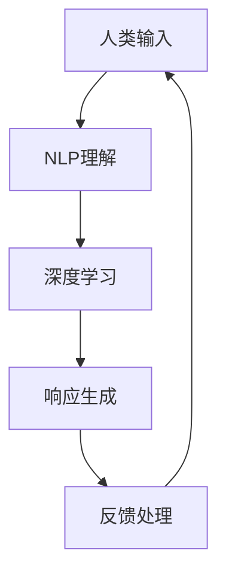

                 

# 人机交互：未来趋势与展望

## 1. 背景介绍

### 1.1 问题由来
近年来，随着人工智能（AI）技术的发展，人机交互（Human-Computer Interaction, HCI）领域迎来了新的变革。传统的人机交互依赖于菜单、图标、键盘和鼠标等设备，而AI技术的引入，尤其是深度学习和大模型技术，为实现更自然、更高效的人机交互方式提供了新的可能。大模型如GPT、BERT等，以其强大的语言生成和理解能力，成为人机交互领域的新宠。

### 1.2 问题核心关键点
人机交互的核心在于如何使得计算机能够理解人类的语言和行为，并以自然、高效的方式进行响应。基于大模型的自然语言处理技术，使得计算机能够通过语言理解人类的意图和需求，实现更加自然、流畅的交流。但目前大模型在实际应用中还存在一些挑战，如上下文理解不足、情感识别不准确、多模态交互困难等。如何克服这些挑战，实现更加智能、人性化的交互体验，成为当前研究的重点。

## 2. 核心概念与联系

### 2.1 核心概念概述

为了更好地理解人机交互的未来发展方向，本节将介绍几个关键的概念：

- 人机交互（HCI）：研究如何让计算机更好地理解和响应人类的语言、行为等输入，提升人机互动的自然性和效率。

- 自然语言处理（NLP）：通过计算机自动处理和理解人类语言的技术，包括文本生成、语言理解、情感分析等。

- 深度学习（DL）：利用多层神经网络进行模式识别的技术，使得计算机能够学习数据的内在规律，并根据规律进行预测或生成。

- 大模型（Large Models）：如GPT、BERT等，通过在大规模数据上进行自监督或监督学习训练，具备强大的语言理解与生成能力。

- 多模态交互（Multimodal Interaction）：结合文本、图像、声音等多种信息源，实现更自然、更全面的交互体验。

- 交互设计（Interaction Design）：通过用户研究、界面设计等手段，优化交互流程，提升用户体验。

这些概念构成了人机交互领域的基本框架，使得计算机能够通过深度学习和自然语言处理技术，实现更加智能化、人性化的交互方式。

### 2.2 核心概念原理和架构的 Mermaid 流程图



这个流程图展示了人机交互的基本流程：人类通过输入进行交互，NLP技术理解输入内容，深度学习模型进行复杂的推理和生成，生成交互响应后通过反馈机制进行迭代改进，形成一个闭环的交互过程。

## 3. 核心算法原理 & 具体操作步骤
### 3.1 算法原理概述

基于大模型的自然语言处理技术，人机交互的核心算法可以概括为以下几个步骤：

1. **自然语言理解（NLU）**：通过预训练语言模型如BERT、GPT等，对用户输入的自然语言进行解析和理解，提取关键信息。
2. **意图识别**：分析用户输入的语言内容，识别用户的意图，如查询信息、发起对话等。
3. **响应生成**：根据用户意图，结合知识库、上下文等，生成自然、流畅的交互响应。
4. **反馈和迭代**：根据用户对交互响应的反馈，不断调整和优化交互模型，提升用户体验。

### 3.2 算法步骤详解

基于上述原理，以下是人机交互的具体操作步骤：

1. **数据预处理**：收集和整理用户输入的自然语言数据，进行分词、去除停用词等预处理操作。

2. **模型选择**：选择合适的预训练语言模型，如BERT、GPT-3等，作为自然语言理解的初始模型。

3. **模型微调**：在特定的交互任务上，使用少量标注数据对预训练模型进行微调，使其能够适应特定任务。

4. **意图识别**：通过微调后的模型，提取用户输入中的关键信息，识别用户的意图。

5. **响应生成**：根据用户意图和上下文信息，使用深度学习模型生成自然、流畅的交互响应。

6. **反馈收集**：收集用户对交互响应的反馈，如点击、评分等，用于后续模型的训练和优化。

7. **模型优化**：根据用户反馈，不断调整和优化交互模型，提升用户体验。

### 3.3 算法优缺点

基于大模型的自然语言处理技术在提升人机交互的智能化和自然性方面具有显著优势，但也存在一些局限性：

**优点：**

- 强大的语言理解能力：预训练模型如BERT、GPT等，具备强大的语言理解能力，能够自动理解复杂的语言结构和语义关系。
- 高效的交互响应生成：深度学习模型可以快速生成自然、流畅的交互响应，提升用户体验。
- 多模态支持：大模型不仅能够处理文本信息，还能结合图像、声音等非文本信息，实现更全面的交互体验。

**缺点：**

- 数据依赖性强：模型需要大量的标注数据进行微调，数据获取成本较高。
- 上下文理解不足：尽管大模型在语言理解上表现出色，但对于长文本或复杂上下文，理解能力可能有所欠缺。
- 鲁棒性不足：大模型在处理噪声或异常输入时，鲁棒性较差，容易产生误导性输出。
- 可解释性差：大模型的决策过程难以解释，用户难以理解其背后的逻辑和机制。

### 3.4 算法应用领域

基于大模型的自然语言处理技术，已在多个领域得到广泛应用：

- **客户服务**：智能客服机器人，通过理解客户输入，生成自然回应，提升客户满意度。
- **智能助手**：智能语音助手，如Siri、Alexa等，通过语音交互，提供信息查询、日程管理等功能。
- **健康咨询**：医疗智能问答系统，通过自然语言理解，解答患者疑问，提供健康建议。
- **教育辅助**：智能教育平台，通过理解学生提问，提供个性化辅导和建议。
- **新闻推荐**：智能新闻推荐系统，通过理解用户兴趣，推荐个性化新闻内容。

这些应用场景展示了大模型在提升人机交互的智能化和自然性方面的巨大潜力。未来，随着技术的不断进步，人机交互将变得更加智能、自然和高效。

## 4. 数学模型和公式 & 详细讲解 & 举例说明

### 4.1 数学模型构建

在人机交互中，常用的数学模型包括自然语言处理模型和深度学习模型。以BERT为例，其数学模型构建如下：

**BERT模型**：
- 输入层：将输入文本进行分词、嵌入等处理，生成词向量表示。
- 编码层：通过多个自注意力层和前馈神经网络层，对词向量进行编码。
- 输出层：根据任务类型，选择合适的输出层和损失函数。

**深度学习模型**：
- 输入层：将用户输入的数据进行预处理，生成特征向量。
- 隐藏层：通过多个神经网络层进行特征提取和模式学习。
- 输出层：根据任务类型，选择合适的输出层和损失函数。

### 4.2 公式推导过程

以BERT模型的输入层为例，其数学推导过程如下：

**输入层公式**：
- 设输入文本为 $x=(x_1,x_2,...,x_n)$，每个词 $x_i$ 的嵌入向量为 $e_i \in \mathbb{R}^d$，其中 $d$ 为嵌入向量维度。
- 对于长文本，通常使用分段编码方式，将文本分成若干个固定长度的句子 $x_i=[x_{i_1},x_{i_2},...,x_{i_k}]$。
- 对于每个句子，通过掩码语言模型对每个词 $x_{i_j}$ 进行编码，生成表示向量 $v_{i_j} \in \mathbb{R}^d$。

其中，掩码语言模型可以表示为：
$$
v_{i_j} = \text{MLM}(e_{i_1},e_{i_2},...,e_{i_k})
$$

**编码层公式**：
- 编码层由多个自注意力层和前馈神经网络层构成，通过多次迭代，生成表示向量 $h_i \in \mathbb{R}^d$。
- 自注意力层公式：
$$
\text{Attention}(Q,K,V) = \text{Softmax}(\frac{QK^T}{\sqrt{d_k}})V
$$
其中 $Q,K,V$ 分别为查询矩阵、键矩阵、值矩阵，$d_k$ 为键向量维度。

**输出层公式**：
- 根据任务类型，选择合适的输出层和损失函数。以二分类任务为例，输出层公式为：
$$
\text{Output}(h_i) = \sigma(W_2[h_i;h_{i-1}])b_2
$$
其中 $W_2,b_2$ 为输出层权重和偏置，$\sigma$ 为激活函数。

### 4.3 案例分析与讲解

以智能客服系统为例，其基于BERT模型的自然语言处理过程如下：

1. **输入处理**：将客户输入的自然语言进行分词、去停用词等处理，生成词向量。

2. **编码层**：通过BERT模型对词向量进行编码，生成表示向量。

3. **意图识别**：通过编码层输出的表示向量，使用softmax层对意图进行分类，识别客户意图。

4. **响应生成**：根据客户意图和上下文信息，使用深度学习模型生成自然回应。

5. **反馈处理**：收集客户对回应的反馈，如满意度评分，用于后续模型的优化。

通过上述过程，智能客服系统能够自然地理解客户需求，并生成合适的回应，提升客户满意度。

## 5. 项目实践：代码实例和详细解释说明
### 5.1 开发环境搭建

要进行人机交互项目的开发，需要搭建相应的开发环境。以下是一个基于Python的开发环境搭建流程：

1. **安装Python**：从官网下载并安装Python，建议使用3.6及以上版本。

2. **安装依赖包**：安装所需的依赖包，如TensorFlow、Keras、NLTK等。

3. **配置环境**：使用conda或virtualenv创建虚拟环境，避免与系统其他项目冲突。

4. **数据准备**：收集并准备交互任务所需的数据，如对话记录、客户反馈等。

### 5.2 源代码详细实现

以下是使用TensorFlow和Keras框架实现智能客服系统的代码示例：

```python
import tensorflow as tf
from tensorflow.keras.layers import Input, Dense, Dropout, Embedding, Bidirectional, LSTM, Softmax
from tensorflow.keras.models import Model
from tensorflow.keras.optimizers import Adam
from tensorflow.keras.losses import categorical_crossentropy

# 定义输入层
input_seq = Input(shape=(None, ), name='input_seq')
input_word = Input(shape=(None, ), name='input_word')

# 定义编码器
encoder = Embedding(input_dim=vocab_size, output_dim=embedding_dim, input_length=max_length)(input_word)
encoder = Bidirectional(LSTM(256))(encoder)
encoder = Dropout(0.5)(encoder)

# 定义解码器
decoder = LSTM(256)(encoder)
decoder = Dense(vocab_size, activation='softmax')(decoder)

# 定义模型
model = Model(inputs=[input_seq, input_word], outputs=decoder)

# 定义损失函数和优化器
model.compile(loss=categorical_crossentropy, optimizer=Adam(learning_rate=0.001))

# 训练模型
model.fit([train_seq, train_word], train_labels, epochs=10, batch_size=32, validation_split=0.2)
```

### 5.3 代码解读与分析

在上述代码中，我们定义了一个基于LSTM的交互模型，用于智能客服系统的开发。

- **输入层**：定义了输入序列和词向量输入，用于接收用户输入的文本和词向量。
- **编码器**：使用嵌入层和双向LSTM层对输入文本进行编码，生成表示向量。
- **解码器**：使用LSTM层和全连接层对编码器的输出进行解码，生成自然回应。
- **模型**：将输入序列、词向量输入和解码器的输出组成完整的模型。
- **损失函数和优化器**：定义了交叉熵损失函数和Adam优化器，用于训练模型。

### 5.4 运行结果展示

在训练完成后，可以通过以下代码进行测试和评估：

```python
test_loss, test_acc = model.evaluate([test_seq, test_word], test_labels, batch_size=32)
print('Test loss:', test_loss)
print('Test accuracy:', test_acc)
```

## 6. 实际应用场景
### 6.1 智能客服系统

智能客服系统是基于大模型的自然语言处理技术在客户服务中的应用。通过自然语言理解，智能客服能够自然地理解客户输入，提供及时、准确的回应，提升客户满意度。

- **客户需求理解**：通过自然语言处理技术，智能客服能够理解客户的意图和需求，快速响应客户问题。
- **个性化推荐**：根据客户历史行为和当前需求，智能客服能够提供个性化的产品和服务推荐。
- **智能调度和排班**：根据客户流量实时调整客服人员的工作负荷，提升客服系统的效率和稳定性。

### 6.2 智能助手

智能助手如Siri、Alexa等，通过自然语言理解和语音识别技术，实现了与用户的自然交互。

- **语音交互**：智能助手能够理解用户的语音命令，提供信息查询、日程管理等功能。
- **多模态支持**：智能助手不仅支持语音交互，还支持文本输入，提供更加灵活的交互方式。
- **个性化服务**：智能助手能够根据用户的习惯和偏好，提供个性化的服务，提升用户体验。

### 6.3 健康咨询

健康咨询系统通过自然语言处理技术，解答患者的健康问题，提供健康建议。

- **自然语言理解**：通过自然语言处理技术，健康咨询系统能够理解患者的症状和疑问，提供专业的健康建议。
- **知识库支持**：健康咨询系统结合医学知识库，提供更加准确、可靠的健康建议。
- **实时问答**：健康咨询系统能够实时回答患者的健康问题，提升医疗服务的效率和质量。

### 6.4 教育辅助

智能教育平台通过自然语言处理技术，提供个性化的教育辅导和建议。

- **自然语言理解**：智能教育平台能够理解学生的提问，提供个性化的学习建议。
- **学习内容推荐**：根据学生的学习进度和兴趣，智能教育平台推荐合适的学习内容和资源。
- **学习效果评估**：智能教育平台能够评估学生的学习效果，提供个性化的改进建议。

### 6.5 新闻推荐

智能新闻推荐系统通过自然语言处理技术，推荐个性化的新闻内容。

- **用户兴趣分析**：通过自然语言处理技术，智能新闻推荐系统分析用户的历史行为和兴趣，生成用户画像。
- **新闻内容推荐**：根据用户画像，智能新闻推荐系统推荐个性化的新闻内容，提升用户满意度。
- **实时更新**：智能新闻推荐系统能够实时更新新闻内容，提供最新的信息。

## 7. 工具和资源推荐
### 7.1 学习资源推荐

以下是一些优秀的学习资源，帮助你深入掌握人机交互的原理和实践技巧：

1. **《人机交互设计基础》**：介绍人机交互的基本概念、设计原则和用户研究方法。

2. **《自然语言处理综论》**：深入讲解自然语言处理的技术原理和应用实践。

3. **《深度学习》**：介绍深度学习的基本概念、模型架构和优化方法。

4. **Coursera《Human-Computer Interaction》课程**：由斯坦福大学开设，涵盖人机交互的各个方面。

5. **Udacity《AI for Everyone》课程**：介绍AI技术的基本原理和应用，适合初学者入门。

### 7.2 开发工具推荐

以下是一些常用的人机交互开发工具：

1. **TensorFlow**：谷歌开源的深度学习框架，支持大规模模型的训练和推理。

2. **Keras**：基于TensorFlow的高层API，适合快速原型开发和模型训练。

3. **NLTK**：自然语言处理工具包，提供丰富的文本处理和分析功能。

4. **PyTorch**：Facebook开源的深度学习框架，支持动态图和GPU加速。

5. **Jupyter Notebook**：交互式编程环境，支持Python代码的编写和运行。

### 7.3 相关论文推荐

以下是一些经典的人机交互论文，值得深入阅读：

1. **《A Survey on Human-Computer Interaction Systems Using Natural Language Processing》**：介绍自然语言处理在人机交互中的应用。

2. **《The Role of Multimodal Interaction in Next-Generation Human-Computer Interaction》**：探讨多模态交互在提升人机交互体验中的作用。

3. **《Natural Language Generation: A Survey》**：介绍自然语言生成技术的最新进展。

4. **《Human-Computer Interaction Design with Data-Driven Principles》**：介绍基于数据的人机交互设计方法。

## 8. 总结：未来发展趋势与挑战
### 8.1 研究成果总结

人机交互技术在近年来取得了显著进展，尤其是在大模型的推动下，自然语言处理能力得到了极大的提升。大模型不仅能够理解复杂的语言结构，还能生成自然、流畅的回应，极大地提升了人机交互的智能化和自然性。

### 8.2 未来发展趋势

未来，人机交互技术将在以下几个方面继续发展：

1. **多模态交互**：结合文本、图像、语音等多种信息源，实现更全面的交互体验。

2. **情感智能**：通过自然语言处理技术，识别和理解用户的情感状态，提升交互体验。

3. **跨领域应用**：将人机交互技术应用于更多的领域，如医疗、教育、娱乐等。

4. **个性化服务**：通过自然语言处理技术，提供更加个性化的服务，提升用户体验。

5. **交互设计优化**：通过用户研究和交互设计，提升交互系统的可用性和用户体验。

### 8.3 面临的挑战

尽管人机交互技术取得了显著进展，但仍面临一些挑战：

1. **数据获取成本高**：大规模标注数据的获取成本较高，限制了模型的应用范围。

2. **上下文理解不足**：大模型在处理长文本或复杂上下文时，理解能力有所欠缺。

3. **鲁棒性不足**：大模型在处理噪声或异常输入时，鲁棒性较差，容易产生误导性输出。

4. **可解释性差**：大模型的决策过程难以解释，用户难以理解其背后的逻辑和机制。

5. **隐私和安全问题**：在处理个人数据时，需要重视隐私和安全问题，确保用户数据的安全和隐私保护。

### 8.4 研究展望

未来，人机交互技术需要在以下几个方面进行进一步研究：

1. **无监督学习**：探索无监督学习在人机交互中的应用，降低数据依赖性。

2. **多任务学习**：结合多个任务，提升模型的泛化能力和适应性。

3. **因果推断**：引入因果推断方法，提升模型的解释能力和鲁棒性。

4. **伦理和法律问题**：加强伦理和法律研究，确保人机交互技术的公平、公正和安全。

5. **跨领域融合**：将人机交互技术与更多领域的技术进行融合，提升跨领域应用的能力。

通过不断的研究和创新，人机交互技术必将在未来实现更加智能化、自然化和高效化的发展，为人类带来更加美好的生活体验。

## 9. 附录：常见问题与解答

**Q1：如何提高人机交互系统的自然性？**

A: 提高人机交互系统的自然性，需要从多个方面入手：

1. **语言模型优化**：通过优化预训练语言模型，提高其理解能力和生成能力。

2. **多模态融合**：结合文本、图像、语音等多种信息源，提升交互系统的自然性。

3. **用户研究**：通过用户研究，了解用户的偏好和需求，优化交互设计。

4. **交互反馈**：根据用户反馈，不断优化交互系统的设计，提升用户体验。

**Q2：如何提高人机交互系统的鲁棒性？**

A: 提高人机交互系统的鲁棒性，需要从以下几个方面入手：

1. **数据增强**：通过数据增强技术，增加训练集的多样性，提高模型的鲁棒性。

2. **对抗训练**：引入对抗样本，提高模型的鲁棒性和泛化能力。

3. **鲁棒性评估**：在模型训练过程中，加入鲁棒性评估指标，监控模型的鲁棒性表现。

4. **参数优化**：通过参数优化，减少模型对噪声的敏感性。

**Q3：如何在人机交互中实现个性化服务？**

A: 实现个性化服务，需要从以下几个方面入手：

1. **用户画像**：通过分析用户的历史行为和偏好，生成用户画像。

2. **推荐系统**：结合推荐系统技术，根据用户画像推荐个性化的服务和内容。

3. **交互设计**：通过交互设计，提升个性化服务的可用性和用户体验。

4. **实时更新**：根据用户反馈和行为，实时更新推荐系统，提升个性化服务的准确性和时效性。

**Q4：如何保护用户隐私？**

A: 保护用户隐私，需要从以下几个方面入手：

1. **数据匿名化**：对用户数据进行匿名化处理，保护用户隐私。

2. **隐私保护技术**：采用隐私保护技术，如差分隐私、联邦学习等，保护用户数据隐私。

3. **合规性要求**：确保人机交互系统的设计符合相关隐私保护法规和标准。

4. **用户授权**：在收集和使用用户数据前，获得用户的明确授权。

---

作者：禅与计算机程序设计艺术 / Zen and the Art of Computer Programming

