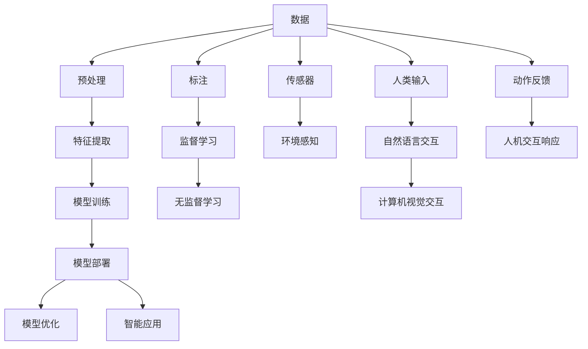

                 

# 人机协作新篇章：共创智能未来

在信息技术的浪潮中，人工智能(AI)技术以其惊人的速度和深度，正在重塑各行各业的运营模式和协作方式。人机协作，即AI与人类有机结合，共同完成智能任务，逐渐成为新时代的显著特征。本文将深入探讨人机协作的原理与实践，展望未来智能发展的广阔前景，力求为广大IT从业者提供深刻的见解与实用指导。

## 1. 背景介绍

### 1.1 人工智能的演化历史

人工智能的发展经历了多个阶段，从早期的符号推理系统，到20世纪80年代知识表示与推理的蓬勃发展，再到21世纪初机器学习的崛起，人类对智能的理解与实现不断深化。特别是深度学习技术的应用，使AI进入了深度学习的时代，以神经网络为基础的学习模型在图像识别、自然语言处理等领域取得了一系列突破。

但与此同时，AI的泛化能力、可解释性、安全性等问题也逐渐凸显。如何在人工智能的发展中找到智能与人的协作，成为亟需解决的关键问题。人机协作的出现，恰逢其时，将AI与人类有机结合，使智能系统能够更好地服务于人类，提升工作效率与生活品质。

### 1.2 人机协作的重要意义

人机协作的核心理念在于充分利用AI与人类各自的优势。AI擅长处理大量数据、进行模式识别和预测分析，而人类则在理解上下文、灵活应对复杂情况和创造性思考方面具有独特优势。结合AI与人类的优势，可以构建更高效、灵活、人性化的智能系统，推动各行各业的数字化转型和创新。

在人机协作中，AI被视作助手和伴侣，与人一起共同解决问题，提升决策的准确性和效率。这对于那些复杂、多变、高风险的行业尤其重要，如医疗、金融、航空等，AI可以辅助人类处理繁琐重复的任务，提供精准的预测和建议，最终由人类进行决策。

## 2. 核心概念与联系

### 2.1 核心概念概述

在人机协作的框架下，涉及多个关键概念，包括人工智能、自然语言处理(NLP)、计算机视觉(CV)、机器人、人机交互(HCI)等。这些概念通过各自的技术和算法，共同支撑着人机协作的实现。

**人工智能(AI)**：AI是机器通过数据和算法模拟人类智能行为的技术，包括学习、推理、决策等功能。

**自然语言处理(NLP)**：NLP专注于计算机对人类语言的处理，包括语言理解、生成、翻译等。它使人机协作能够基于自然语言进行信息交互和任务执行。

**计算机视觉(CV)**：CV使计算机能够理解图像和视频内容，与人类的视觉感知系统相媲美。它是人机协作中重要的一环，尤其是在视觉引导任务中。

**机器人**：机器人是执行物理操作的AI系统，与人协作完成各种自动化任务。

**人机交互(HCI)**：HCI研究如何设计用户界面，使AI系统能够与人类高效互动。它在人机协作中起到桥梁作用，使信息传递更加顺畅和自然。

这些概念通过算法和框架进行整合，形成了人机协作的基础。以下是一个简化的Mermaid流程图，展示了这些概念之间的联系：

```mermaid
graph TB
    A[人工智能(AI)] --> B[自然语言处理(NLP)]
    B --> C[计算机视觉(CV)]
    A --> D[机器人]
    A --> E[人机交互(HCI)]
    E --> F[用户界面(UI)]
    F --> G[互动]
    C --> H[视觉识别]
    B --> I[语言理解]
    A --> J[决策]
    J --> K[执行]
```

### 2.2 核心概念原理和架构的 Mermaid 流程图



该流程图展示了从数据输入到智能应用输出的完整过程，其中关键环节包括数据预处理、特征提取、模型训练、模型部署、模型优化和智能应用等。

## 3. 核心算法原理 & 具体操作步骤

### 3.1 算法原理概述

人机协作的核心算法可以归纳为以下几类：

1. **自然语言处理(NLP)**：包括文本分析、机器翻译、情感分析、问答系统等，使计算机能够理解并生成自然语言。

2. **计算机视觉(CV)**：包括图像分类、物体检测、图像分割等，使计算机能够理解和处理视觉信息。

3. **深度学习(DL)**：包括卷积神经网络(CNN)、循环神经网络(RNN)、Transformer等，提供强大的模型训练能力，实现复杂任务。

4. **强化学习(RL)**：使AI系统能够通过与环境的互动，逐步优化决策策略，提升任务执行的智能化水平。

5. **生成对抗网络(GAN)**：通过生成器和判别器的对抗训练，实现高质量的图像生成和数据增强。

6. **知识图谱(KG)**：构建领域内的知识网络，为智能系统提供丰富的先验知识。

这些算法和技术通过整合与优化，形成了人机协作的算法体系。以下简述几种常见算法：

- **Transformer**：基于自注意力机制，广泛应用于NLP任务中，如BERT、GPT等预训练模型。

- **CNN**：主要用于图像识别和处理，如图像分类、目标检测等。

- **RNN**：主要用于序列数据的处理，如自然语言生成、语音识别等。

- **强化学习**：通过策略梯度、Q-learning等方法，使AI系统能够在不断反馈中优化决策策略。

### 3.2 算法步骤详解

人机协作的算法步骤通常包括以下几个环节：

1. **数据采集**：从各种传感器、数据库等获取原始数据，如视频、图像、文本等。

2. **数据预处理**：清洗数据、标注数据、进行数据增强等，确保数据质量。

3. **特征提取**：将原始数据转换为模型可接受的特征向量，如通过CNN提取图像特征，通过NLP模型提取文本特征。

4. **模型训练**：在标注数据上训练模型，如使用深度学习模型进行端到端训练。

5. **模型优化**：通过正则化、dropout等技术，提升模型泛化能力，避免过拟合。

6. **模型部署**：将训练好的模型部署到实际应用中，如嵌入到手机App、工业机器人等。

7. **持续学习**：在实际应用中不断收集新数据，对模型进行微调，提升系统性能。

8. **人机交互**：设计用户界面(UI)，使人类能够直观地与智能系统交互，实现信息传递和任务执行。

### 3.3 算法优缺点

人机协作算法的优点包括：

- **泛化能力强**：利用深度学习等技术，模型可以处理多种复杂任务，适应不同的环境和数据。

- **灵活性强**：结合多种算法和技术，可以实现多样化的应用场景。

- **实时性好**：在云计算和边缘计算的支持下，能够实时响应和处理任务。

- **人性化设计**：通过人机交互技术，提供直观、易用的操作界面。

缺点包括：

- **数据依赖高**：高质量的数据是算法效果的关键，但获取和标注数据成本较高。

- **计算资源需求高**：深度学习等算法需要大量计算资源，初期投入较大。

- **模型复杂度**：复杂的模型可能难以解释，用户和开发者难以理解和调试。

- **安全性风险**：智能系统的决策可能存在漏洞，如对抗样本攻击、隐私泄露等。

### 3.4 算法应用领域

人机协作算法广泛应用于以下几个领域：

1. **智能医疗**：在医疗影像分析、病历记录处理、药物研发等场景中，AI辅助医生完成诊断和治疗决策。

2. **智能制造**：通过机器视觉和机器人技术，实现自动化生产线的监控和维护。

3. **智能交通**：利用计算机视觉和传感器技术，优化交通流量管理，提升道路安全。

4. **智能安防**：利用人脸识别、行为分析等技术，提升公共安全和监控效率。

5. **智能客服**：通过自然语言处理和机器学习技术，提升客户服务的智能化水平，提供个性化服务。

6. **智能家居**：利用语音识别、图像处理等技术，实现家庭设备的智能控制。

7. **智能推荐**：通过分析用户行为和兴趣，推荐个性化的产品和服务，提升用户体验。

这些应用场景展示了人机协作算法的广泛应用和巨大潜力。

## 4. 数学模型和公式 & 详细讲解 & 举例说明

### 4.1 数学模型构建

在人机协作中，常见的数学模型包括监督学习、无监督学习、半监督学习和强化学习等。以下以监督学习为例，展示数学模型的构建过程。

假设有一个数据集 $D = \{(x_i, y_i)\}_{i=1}^N$，其中 $x_i$ 为输入特征，$y_i$ 为标签。

监督学习的目标是通过训练一个模型 $f$，使得 $f(x_i) = y_i$。常用的模型包括线性回归、逻辑回归、决策树、支持向量机(SVM)等。

### 4.2 公式推导过程

以线性回归模型为例，其目标函数为：

$$
\min_{\theta} \frac{1}{2N} \sum_{i=1}^N (y_i - f(x_i; \theta))^2
$$

其中 $\theta$ 为模型参数，$f(x_i; \theta) = \theta^T x_i$。

通过梯度下降等优化算法，求解上述最小化问题，即可得到最优参数 $\theta^*$。

### 4.3 案例分析与讲解

以下以自然语言处理中的文本分类任务为例，展示监督学习的应用。

**数据预处理**：将文本转换为向量表示，如使用词袋模型或TF-IDF模型，得到训练集 $D_{train} = \{x_i, y_i\}_{i=1}^N$。

**模型选择**：选择适当的分类器，如逻辑回归、SVM等。

**模型训练**：在训练集 $D_{train}$ 上，通过梯度下降算法，更新模型参数 $\theta$，最小化损失函数。

**模型评估**：在测试集 $D_{test}$ 上，计算模型的准确率、精确率、召回率等指标，评估模型性能。

## 5. 项目实践：代码实例和详细解释说明

### 5.1 开发环境搭建

在人机协作的开发中，常用的开发工具包括Python、TensorFlow、PyTorch、Keras等。以下以TensorFlow为例，展示开发环境的搭建过程。

1. 安装Anaconda：
```bash
wget https://repo.anaconda.com/miniconda/Miniconda3-latest-Linux-x86_64.sh
bash Miniconda3-latest-Linux-x86_64.sh
```

2. 创建虚拟环境：
```bash
conda create -n tf-env python=3.7
conda activate tf-env
```

3. 安装TensorFlow：
```bash
conda install tensorflow
```

4. 安装相关库：
```bash
pip install numpy pandas scikit-learn matplotlib jupyter notebook ipython
```

### 5.2 源代码详细实现

以下以自然语言处理中的情感分析任务为例，展示TensorFlow模型的实现。

```python
import tensorflow as tf
import numpy as np
from tensorflow.keras.preprocessing.text import Tokenizer
from tensorflow.keras.preprocessing.sequence import pad_sequences

# 数据预处理
texts = ['I love this product', 'This product is terrible', 'This is the best movie I have ever seen']
labels = [1, 0, 1]
tokenizer = Tokenizer(num_words=10000, oov_token="<OOV>")
tokenizer.fit_on_texts(texts)
sequences = tokenizer.texts_to_sequences(texts)
padded_sequences = pad_sequences(sequences, padding='post', maxlen=50)
x_train = padded_sequences
y_train = np.array(labels)

# 构建模型
model = tf.keras.Sequential([
    tf.keras.layers.Embedding(10000, 16, input_length=50),
    tf.keras.layers.Bidirectional(tf.keras.layers.LSTM(16)),
    tf.keras.layers.Dense(1, activation='sigmoid')
])

# 编译模型
model.compile(loss='binary_crossentropy', optimizer='adam', metrics=['accuracy'])

# 训练模型
model.fit(x_train, y_train, epochs=10, batch_size=32, validation_split=0.2)

# 模型评估
x_test = tokenizer.texts_to_sequences(['This movie is great', 'I do not like this product'])
padded_test = pad_sequences(x_test, padding='post', maxlen=50)
y_test = np.array([1, 0])
loss, accuracy = model.evaluate(padded_test, y_test)
print(f'Loss: {loss:.4f}, Accuracy: {accuracy:.4f}')
```

### 5.3 代码解读与分析

- **数据预处理**：使用Tokenizer将文本转换为数字序列，并使用pad_sequences将序列填充到相同长度。
- **模型构建**：使用Embedding层将文本转换为向量表示，通过LSTM层进行特征提取，最后使用Dense层进行二分类预测。
- **模型训练**：在训练集上使用Adam优化器进行模型训练，使用准确率作为评价指标。
- **模型评估**：在测试集上评估模型性能，输出损失和准确率。

## 6. 实际应用场景

### 6.1 智能医疗

在人机协作中，智能医疗的应用场景包括影像分析、病历记录、疾病预测等。通过深度学习等技术，AI可以辅助医生完成诊断和治疗决策，提升医疗服务的智能化水平。

**影像分析**：利用卷积神经网络(CNN)，对医学影像进行分类和识别，如X光片、CT、MRI等。AI可以辅助医生快速识别异常部位，提高诊断准确率。

**病历记录**：通过自然语言处理(NLP)技术，自动提取和分类病历信息，如症状、诊断、治疗方案等。AI可以辅助医生快速整理病历，减少录入时间。

**疾病预测**：通过分析电子病历和健康数据，利用机器学习模型预测患者患病风险，如糖尿病、心脏病等。AI可以辅助医生制定个性化的预防和治疗方案。

### 6.2 智能制造

在智能制造中，人机协作的应用场景包括质量检测、设备维护、生产调度等。通过机器视觉和机器人技术，AI可以提升生产线的自动化水平，降低人力成本，提高生产效率。

**质量检测**：利用计算机视觉技术，对生产线的产品进行缺陷检测和质量分类，如自动检测组装零件的偏差、表面的划痕等。

**设备维护**：通过传感器和机器学习技术，实时监控设备运行状态，预测设备故障，进行维护和修理。AI可以辅助维护人员快速定位问题，提高维护效率。

**生产调度**：利用强化学习技术，优化生产线的调度策略，提高生产效率和资源利用率。AI可以辅助生产管理人员制定最优的生产计划。

### 6.3 智能交通

在智能交通中，人机协作的应用场景包括交通流量管理、交通事故预防、自动驾驶等。通过计算机视觉和传感器技术，AI可以提升交通系统的智能化水平，保障道路安全。

**交通流量管理**：利用摄像头和传感器技术，实时监控交通流量，优化信号灯的控制策略，缓解交通拥堵。

**交通事故预防**：通过车辆识别和行为分析技术，预测潜在的交通事故，提前采取预警和干预措施，降低交通事故的发生率。

**自动驾驶**：通过传感器、激光雷达和计算机视觉技术，实现自动驾驶汽车的操作，提升道路安全性和交通效率。

### 6.4 未来应用展望

未来，人机协作的应用前景将更加广阔，涉及的领域将更加多样化。以下是几个未来应用展望：

**智能教育**：通过自然语言处理和机器学习技术，AI可以辅助教师进行作业批改、学生评估、个性化学习推荐等。AI可以辅助教师识别学生的薄弱环节，制定个性化的教学方案，提升教学效果。

**智能安防**：利用人脸识别、行为分析等技术，提升公共安全和监控效率。AI可以辅助警方快速识别嫌疑人，提高破案效率，保护公共安全。

**智能家居**：通过语音识别、图像处理等技术，实现家庭设备的智能控制。AI可以辅助用户管理家庭设备，提高生活质量。

**智能推荐**：通过分析用户行为和兴趣，推荐个性化的产品和服务，提升用户体验。AI可以辅助电商平台进行个性化推荐，提升用户粘性和消费转化率。

## 7. 工具和资源推荐

### 7.1 学习资源推荐

1. **深度学习基础**：《深度学习》by Ian Goodfellow、Yoshua Bengio、Aaron Courville，涵盖了深度学习的基本概念和算法。

2. **自然语言处理**：《自然语言处理综论》by Daniel Jurafsky、James H. Martin，介绍了自然语言处理的各个方面，包括语音识别、文本分类、机器翻译等。

3. **计算机视觉**：《计算机视觉：算法与应用》by Richard Szeliski，介绍了计算机视觉的各个算法和应用。

4. **强化学习**：《强化学习：一种现代方法》by Richard S. Sutton、Andrew G. Barto，介绍了强化学习的理论基础和算法实现。

5. **人机交互**：《人机交互基础》by Jon B. Invoke、Jake R. Abel，介绍了人机交互的基本概念和设计原则。

### 7.2 开发工具推荐

1. **Python**：Python是深度学习、机器学习、自然语言处理等领域的主流编程语言，拥有丰富的开源库和工具支持。

2. **TensorFlow**：Google开源的深度学习框架，支持多种算法和模型，具有强大的分布式计算能力。

3. **PyTorch**：Facebook开源的深度学习框架，灵活易用，支持动态计算图。

4. **Keras**：高层次的深度学习框架，易于上手，适合快速原型开发。

5. **Jupyter Notebook**：开源的交互式编程环境，支持Python、R等语言，便于实验和分享。

6. **TensorBoard**：TensorFlow的可视化工具，支持模型训练和性能监测。

### 7.3 相关论文推荐

1. **深度学习**：《深度学习》by Yann LeCun、Yoshua Bengio、Geoffrey Hinton，介绍了深度学习的基本概念和应用。

2. **自然语言处理**：《Transformer论文》by Vaswani et al., 介绍Transformer模型的原理和实现。

3. **计算机视觉**：《ResNet论文》by He et al., 介绍ResNet模型的原理和实现。

4. **强化学习**：《AlphaGo论文》by Silver et al., 介绍AlphaGo的实现和应用。

5. **人机协作**：《人机协作技术综述》by G. Yi et al., 介绍了人机协作的各个技术和应用。

## 8. 总结：未来发展趋势与挑战

### 8.1 研究成果总结

人机协作技术在各个领域的应用已经取得了显著进展，包括自然语言处理、计算机视觉、机器人等。未来，随着技术的不断进步，人机协作将更加广泛和深入地融入各个行业，提升生产效率和生活品质。

### 8.2 未来发展趋势

1. **AI与人类的深度融合**：AI将与人类更加紧密地结合，形成人机协作的新模式，实现更加智能化的任务执行。

2. **多模态人机协作**：将语音、图像、文本等多模态信息融合，提升人机交互的丰富性和多样性。

3. **端到端人机协作**：将多个AI组件集成，实现端到端的人机协作流程，提升系统效率和用户体验。

4. **隐私保护和安全**：在数据收集和处理中，注重隐私保护和安全，确保用户数据的安全和透明。

5. **伦理和社会责任**：在AI技术的应用中，注重伦理和社会责任，确保AI技术的健康发展。

### 8.3 面临的挑战

人机协作技术虽然前景广阔，但也面临诸多挑战：

1. **数据获取和标注成本高**：高质量的数据是算法效果的关键，但获取和标注数据成本较高。

2. **算法复杂度和资源消耗高**：深度学习等算法需要大量计算资源，初期投入较大。

3. **模型可解释性和透明性不足**：复杂的模型可能难以解释，用户和开发者难以理解和调试。

4. **安全和隐私风险**：智能系统的决策可能存在漏洞，如对抗样本攻击、隐私泄露等。

5. **伦理和社会问题**：AI技术的应用可能带来新的伦理和社会问题，如就业替代、数据隐私等。

### 8.4 研究展望

未来，人机协作技术的研究方向包括：

1. **数据高效获取和标注**：探索自动标注、数据增强等技术，降低数据获取和标注成本。

2. **算法简化和优化**：优化算法结构和参数，提高模型效率和可解释性。

3. **多模态信息融合**：将语音、图像、文本等多种信息融合，提升人机交互的丰富性。

4. **隐私保护和安全**：探索数据加密、隐私保护等技术，确保用户数据的安全和透明。

5. **伦理和社会责任**：研究和制定AI技术的伦理和社会责任标准，确保AI技术的健康发展。

## 9. 附录：常见问题与解答

**Q1: 人机协作中的AI主要扮演什么角色？**

A: 在人机协作中，AI主要扮演以下角色：

1. **数据处理**：AI可以自动处理和清洗数据，减少人工工作量。

2. **特征提取**：AI可以从原始数据中提取有意义的特征，供后续分析使用。

3. **模型训练**：AI可以构建和训练复杂的模型，实现对复杂数据的处理和预测。

4. **决策支持**：AI可以辅助人类进行决策，提供准确的数据支持和智能建议。

5. **人机交互**：AI可以设计自然语言处理、计算机视觉等技术，实现人机之间的顺畅交流和互动。

**Q2: 人机协作中的主要挑战有哪些？**

A: 人机协作中的主要挑战包括：

1. **数据获取和标注成本高**：高质量的数据是算法效果的关键，但获取和标注数据成本较高。

2. **算法复杂度和资源消耗高**：深度学习等算法需要大量计算资源，初期投入较大。

3. **模型可解释性和透明性不足**：复杂的模型可能难以解释，用户和开发者难以理解和调试。

4. **安全和隐私风险**：智能系统的决策可能存在漏洞，如对抗样本攻击、隐私泄露等。

5. **伦理和社会问题**：AI技术的应用可能带来新的伦理和社会问题，如就业替代、数据隐私等。

**Q3: 人机协作的应用前景如何？**

A: 人机协作的应用前景非常广阔，涉及的领域将更加多样化。未来，随着技术的不断进步，人机协作将更加广泛和深入地融入各个行业，提升生产效率和生活品质。

**Q4: 如何提高人机协作中模型的可解释性？**

A: 提高人机协作中模型的可解释性，可以采取以下措施：

1. **模型简化**：使用简化模型结构，减少复杂度，提高可解释性。

2. **可视化工具**：使用可视化工具，如TensorBoard，展示模型的内部工作机制和决策过程。

3. **可解释性模型**：使用可解释性模型，如LIME、SHAP等，提供模型决策的可视化解释。

4. **多模态融合**：将多种模态信息融合，提高模型决策的透明性和可信度。

**Q5: 人机协作中的伦理和社会责任如何保障？**

A: 在人机协作中，保障伦理和社会责任可以采取以下措施：

1. **透明性**：确保算法和决策过程的透明性，提供可解释和可审计的系统。

2. **公平性**：避免算法中的偏见和歧视，确保系统公平性和公正性。

3. **隐私保护**：保护用户隐私，确保数据的安全和透明。

4. **伦理审查**：建立伦理审查机制，评估AI技术的伦理和社会影响。

5. **社会责任**：制定AI技术的伦理和社会责任标准，确保AI技术的健康发展。

---

作者：禅与计算机程序设计艺术 / Zen and the Art of Computer Programming

