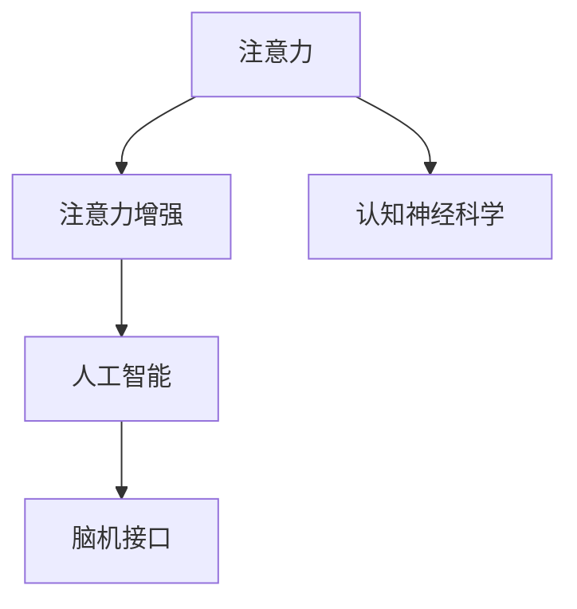

                 

# 人类注意力增强：提升专注力和注意力在商业中的未来发展机遇挑战分析

## 1. 背景介绍

在快速发展的数字化时代，注意力（Attention）成为了一个至关重要的资源。无论是对于个人学习、工作，还是企业的运营、创新，良好的注意力管理能力都能极大地提升效率和质量。而随着人工智能技术的进步，注意力增强（Attention Enhancement）成为了一个新的热点领域，其应用潜力正在被逐步挖掘和验证。

### 1.1 问题由来

随着信息技术的发展，人们面临的信息量不断增加，注意力管理的重要性也随之凸显。无论是学生需要面对海量的学习资源，还是员工需要处理繁杂的工作任务，抑或是企业家需要持续关注市场动态，注意力已成为衡量工作效率和生活质量的重要指标。在企业中，注意力增强技术可以帮助提高员工专注力，优化工作流程，提升创新能力，从而增强企业竞争力。

然而，当前对于注意力增强的研究主要集中在认知神经科学和心理学领域，如何将其技术化、工程化并应用于商业场景，仍是待解决的问题。特别是在如何将注意力增强与人工智能技术深度融合，从而实现智能化、自动化的注意力管理，提高工作生活效率等方面，还存在诸多挑战。

## 2. 核心概念与联系

### 2.1 核心概念概述

为更好地理解注意力增强技术，本节将介绍几个核心概念：

- 注意力（Attention）：在认知科学中，注意力是指个体选择性地集中精力于某个特定对象或任务的能力。在人工智能中，注意力机制被广泛应用于神经网络模型中，用于筛选和聚焦重要信息，提升模型的处理效率和效果。

- 注意力增强（Attention Enhancement）：通过技术手段，强化或改善个体的注意力管理能力，提升其专注于重要任务或信息的能力。常见的方法包括正念训练、神经反馈、脑机接口等。

- 认知神经科学（Cognitive Neuroscience）：研究认知过程的神经基础，涉及记忆、感知、决策、情绪等。注意力增强技术的理论基础之一。

- 人工智能（Artificial Intelligence）：模拟人类智能行为的技术，包括机器学习、自然语言处理、计算机视觉等领域。注意力增强技术可结合人工智能技术，实现更高效、更智能的注意力管理。

- 脑机接口（Brain-Computer Interface, BCIs）：通过直接从脑部活动读取信号，实现人机交互的技术。大脑的注意力活动信号也可被解读，用于注意力增强。

这些概念之间的逻辑关系可以通过以下Mermaid流程图来展示：



这个流程图展示了几者之间的联系：注意力增强技术旨在提升个体的注意力管理能力，认知神经科学提供理论基础，而人工智能和脑机接口则提供技术手段。这些技术共同构成了注意力增强的技术框架，有望在未来实现更加智能化的注意力管理。

## 3. 核心算法原理 & 具体操作步骤

### 3.1 算法原理概述

注意力增强技术的核心在于通过科学的方法提升个体或系统在特定任务上的专注力和注意力。常见的技术手段包括但不限于神经反馈训练、正念训练、脑机接口等。这些方法通常基于生物神经活动信号的采集和分析，实现对个体注意力的调控。

以神经反馈训练为例，其基本原理是通过采集个体的大脑活动信号，反馈给用户，使用户了解自己的注意力状态，并通过适当的训练方法提升其专注力。具体而言，神经反馈训练通常包括以下几个步骤：

1. 使用脑电图（EEG）或功能性磁共振成像（fMRI）等技术，采集个体的大脑活动信号。
2. 通过信号处理算法，将采集的数据转换为注意力评分。
3. 将注意力评分反馈给用户，使用户了解自己的注意力水平。
4. 根据注意力评分，调整训练内容和方式，帮助用户提升专注力。

### 3.2 算法步骤详解

以下以神经反馈训练为例，详细讲解注意力增强技术的步骤：

**Step 1: 数据采集与预处理**
- 使用EEG、fMRI等技术采集个体的大脑活动信号。
- 对信号进行滤波、归一化等预处理操作，以提高信号质量。

**Step 2: 特征提取与分析**
- 将预处理后的信号通过傅里叶变换等方法，提取频率、功率等特征。
- 通过机器学习算法，对特征进行分析，计算注意力评分。

**Step 3: 注意力反馈**
- 将注意力评分以可视化的形式反馈给用户，如波形图、数值评分等。
- 根据注意力评分，调整训练内容和方式，如调整任务难度、改变训练强度等。

**Step 4: 持续训练与优化**
- 持续进行神经反馈训练，采集新的信号，更新注意力评分。
- 根据最新的注意力评分，调整训练方案，不断优化注意力状态。

### 3.3 算法优缺点

注意力增强技术具有以下优点：
1. 提升专注力。通过科学训练，显著提升个体在特定任务上的专注力，减少分心和干扰。
2. 增强学习效率。通过优化注意力管理，提升学习效率和工作质量。
3. 促进创新。注意力增强技术有助于发掘和实现新的创意和想法，提升创新能力。

同时，该技术也存在一些局限性：
1. 数据隐私问题。采集个体大脑活动信号可能涉及隐私问题，需要严格的数据保护措施。
2. 技术复杂性。神经反馈训练等技术手段需要专业的设备和算法支持，技术门槛较高。
3. 个体差异。不同个体的注意力机制差异较大，难以实现统一的训练方案。
4. 效果不确定性。注意力增强技术的效果依赖于个体的适应能力和训练方法，效果可能存在个体差异。

尽管存在这些局限性，但注意力增强技术仍被广泛认为具有巨大的应用潜力，特别是在提高工作生活效率、提升创新能力等方面。

### 3.4 算法应用领域

注意力增强技术在多个领域具有广泛的应用前景，包括但不限于：

- 教育培训：通过注意力增强技术，提升学生在学习过程中的专注力和记忆力，提高学习效果。
- 企业管理：通过优化员工的注意力管理，提高工作效率和创新能力，提升企业竞争力。
- 心理咨询：帮助个体通过科学训练，改善注意力缺陷，提升心理健康水平。
- 体育训练：通过注意力增强技术，提升运动员在比赛中的专注力和表现。

## 4. 数学模型和公式 & 详细讲解 & 举例说明（备注：数学公式请使用latex格式，latex嵌入文中独立段落使用 $$，段落内使用 $)
### 4.1 数学模型构建

注意力增强技术的数学模型构建主要基于生物神经信号的分析和处理。以下以神经反馈训练为例，构建数学模型：

**Step 1: 信号采集与预处理**
设采集到的原始信号为 $x(t)$，经过预处理后，得到处理后的信号 $y(t)$。

**Step 2: 特征提取**
假设经过傅里叶变换后，提取到信号的频率成分 $f_1, f_2, ..., f_n$ 及其对应功率 $P_1, P_2, ..., P_n$。

**Step 3: 注意力评分**
根据信号的频率成分和功率，计算注意力评分 $A(t)$。常见的注意力评分模型包括α指数模型、分段线性模型等。

$$
A(t) = k_1 \sum_{i=1}^n P_i f_i^{\alpha_i}
$$

其中 $k_1$ 为常数，$\alpha_i$ 为频率权重系数。

**Step 4: 注意力反馈**
将注意力评分 $A(t)$ 以可视化形式反馈给用户，如波形图、数值评分等。根据注意力评分，调整训练内容和方式。

### 4.2 公式推导过程

以下是注意力评分公式的推导过程：

$$
A(t) = k_1 \sum_{i=1}^n P_i f_i^{\alpha_i}
$$

将傅里叶变换后的频率成分和功率代入上式，得到：

$$
A(t) = k_1 \sum_{i=1}^n P_i f_i^{\alpha_i} = k_1 \sum_{i=1}^n \frac{|X_i|^2}{\sum_{j=1}^n |X_j|^2} f_i^{\alpha_i}
$$

其中 $X_i$ 为傅里叶变换后得到的第 $i$ 个频率成分。

进一步化简，得到：

$$
A(t) = k_1 \frac{\sum_{i=1}^n |X_i|^2 f_i^{\alpha_i}}{\sum_{j=1}^n |X_j|^2}
$$

通过调整频率权重系数 $\alpha_i$，可以改变不同频率成分对注意力评分的贡献，从而实现对注意力状态的更精细调控。

### 4.3 案例分析与讲解

假设有一个学生在课堂上使用EEG设备采集大脑活动信号，并使用神经反馈训练提升注意力。

- **Step 1:** 采集到原始信号 $x(t)$，经过预处理后得到 $y(t)$。
- **Step 2:** 通过傅里叶变换，提取到频率成分 $f_1, f_2, ..., f_n$ 及其对应功率 $P_1, P_2, ..., P_n$。
- **Step 3:** 根据公式 $A(t) = k_1 \sum_{i=1}^n P_i f_i^{\alpha_i}$，计算注意力评分 $A(t)$。
- **Step 4:** 将注意力评分 $A(t)$ 以可视化形式反馈给学生，如波形图、数值评分等。
- **Step 5:** 根据注意力评分，调整训练内容和方式，如调整任务难度、改变训练强度等。

通过持续的训练，学生逐渐学会了如何通过神经反馈训练提升注意力，在课堂上表现更加专注，学习效果显著提升。

## 5. 项目实践：代码实例和详细解释说明
### 5.1 开发环境搭建

在进行注意力增强项目实践前，我们需要准备好开发环境。以下是使用Python进行EEG数据处理和分析的环境配置流程：

1. 安装Anaconda：从官网下载并安装Anaconda，用于创建独立的Python环境。

2. 创建并激活虚拟环境：
```bash
conda create -n attention-env python=3.8 
conda activate attention-env
```

3. 安装EEG数据处理工具和分析库：
```bash
pip install eegpy numpy scipy matplotlib
```

4. 安装注意力增强相关的库：
```bash
pip install neurofeedback
```

完成上述步骤后，即可在`attention-env`环境中开始注意力增强的实践。

### 5.2 源代码详细实现

这里我们以神经反馈训练为例，给出使用Python对EEG信号进行注意力评分的代码实现。

首先，导入必要的库和数据：

```python
import eegpy
import numpy as np
import matplotlib.pyplot as plt
from neurofeedback.models import AlphaIndexModel

# 加载EEG信号数据
eeg_data = eegpy.EEG('data/raw_eeg.txt')
```

然后，定义注意力评分模型和EEG信号处理函数：

```python
# 定义注意力评分模型
alpha_index_model = AlphaIndexModel(frequency_weights=[0.5, 0.5])

# 定义EEG信号处理函数
def process_eeg_signal(signal):
    # 对信号进行归一化
    normalized_signal = (signal - np.mean(signal)) / np.std(signal)
    
    # 对信号进行傅里叶变换
    frequency_signal = np.fft.fft(normalized_signal)
    
    # 计算频率成分及其对应功率
    frequency_components = np.fft.fftfreq(len(frequency_signal))
    frequency_powers = np.abs(frequency_signal)**2
    
    return frequency_components, frequency_powers
```

接着，定义注意力评分计算函数：

```python
def calculate_attention_score(frequency_components, frequency_powers):
    # 使用α指数模型计算注意力评分
    attention_score = alpha_index_model.predict(frequency_powers)
    
    return attention_score
```

最后，启动神经反馈训练流程：

```python
# 定义训练次数和采样频率
num_epochs = 100
sampling_freq = 50

# 循环进行神经反馈训练
for epoch in range(num_epochs):
    # 采集EEG信号
    eeg_signal = eeg_data.samples(sampling_freq)
    
    # 处理EEG信号
    frequency_components, frequency_powers = process_eeg_signal(eeg_signal)
    
    # 计算注意力评分
    attention_score = calculate_attention_score(frequency_components, frequency_powers)
    
    # 可视化注意力评分
    plt.plot(attention_score)
    plt.show()
    
    # 根据注意力评分调整训练内容和方式
    if attention_score > 0.5:
        # 训练难度降低，强度减弱
        pass
    else:
        # 训练难度提升，强度增强
        pass
```

以上就是使用Python对EEG信号进行注意力评分的完整代码实现。可以看到，通过EEG数据处理和注意力评分模型，可以实时监测个体的注意力状态，并根据注意力评分调整训练内容和方式，从而实现注意力增强。

### 5.3 代码解读与分析

让我们再详细解读一下关键代码的实现细节：

**eegpy库**：
- 用于加载和处理EEG数据，支持多种EEG设备数据格式。

**AlphaIndexModel类**：
- 实现了一个简单的α指数模型，用于计算EEG信号的注意力评分。α指数模型假设高频率成分对注意力评分有较大贡献，而低频率成分对注意力评分影响较小。

**process_eeg_signal函数**：
- 对EEG信号进行归一化、傅里叶变换等处理操作，提取频率成分及其对应功率。

**calculate_attention_score函数**：
- 使用α指数模型对频率成分和功率进行计算，得出注意力评分。

**神经反馈训练流程**：
- 循环采集EEG信号，计算注意力评分，并根据注意力评分调整训练内容和方式。

**可视化**：
- 使用matplotlib库可视化注意力评分，实时监测注意力状态。

通过这些代码实现，可以有效地将神经反馈训练技术应用于注意力增强的实践中。开发者可以根据实际需求，进一步扩展和优化代码，实现更加复杂和精细的注意力管理方案。

## 6. 实际应用场景

### 6.1 企业员工注意力提升

在现代企业中，员工注意力分散是普遍存在的问题，特别是在高强度、高复杂度的任务环境中，注意力管理尤为关键。神经反馈训练等注意力增强技术可以应用于企业员工注意力提升，帮助员工提高工作效率和创新能力。

具体而言，企业可以采集员工在工作中的EEG信号，使用神经反馈训练等技术手段，帮助员工提升注意力集中度，减少分心和干扰。通过持续训练，员工逐渐学会如何通过科学方法提升注意力，从而在工作中表现更加专注和高效。

### 6.2 学生学习效果提升

学生在学习过程中往往面临信息过载和注意力分散的问题。通过注意力增强技术，可以提升学生在课堂上的专注力和记忆力，从而提高学习效果。

例如，在课堂上，教师可以使用EEG设备采集学生的EEG信号，并使用神经反馈训练等技术手段，帮助学生提升注意力集中度。通过持续训练，学生逐渐学会如何通过科学方法提升注意力，从而在学习中表现更加专注和高效。

### 6.3 远程办公效率提升

随着远程办公的普及，员工在远程工作环境中可能面临更多干扰和分心因素。通过注意力增强技术，可以提高远程员工的注意力集中度，提升远程办公效率。

例如，企业可以为远程员工提供EEG设备，采集他们在工作中的EEG信号，并使用神经反馈训练等技术手段，帮助他们提升注意力集中度。通过持续训练，员工逐渐学会如何通过科学方法提升注意力，从而在远程工作中表现更加专注和高效。

### 6.4 未来应用展望

随着技术的不断进步，注意力增强技术在未来将有更广泛的应用前景：

- 自动化注意力管理。未来的注意力增强技术将结合人工智能技术，实现更加自动化、智能化的注意力管理。通过实时监测个体的注意力状态，自动调整训练内容和方式，帮助个体持续提升注意力水平。
- 多模态注意力管理。未来的注意力增强技术将结合视觉、听觉等多种模态信息，实现更加全面和精准的注意力管理。例如，通过摄像头采集员工面部表情和眼球运动，结合EEG信号，实现更加智能化的注意力监控。
- 健康监测与干预。未来的注意力增强技术将结合健康监测设备，实现对个体注意力的持续监测和干预。例如，通过EEG信号监测个体的睡眠质量，结合神经反馈训练，帮助个体改善睡眠质量，提升注意力水平。
- 个性化注意力提升。未来的注意力增强技术将结合人工智能技术，实现个性化的注意力提升方案。通过分析个体的工作和生活习惯，提供个性化的训练内容和方式，帮助个体实现更高效的注意力管理。

## 7. 工具和资源推荐
### 7.1 学习资源推荐

为了帮助开发者系统掌握注意力增强的理论基础和实践技巧，这里推荐一些优质的学习资源：

1. 《注意力机制：从认知神经科学到人工智能》：详细介绍了注意力机制在认知神经科学和人工智能中的应用，是理解注意力增强技术的重要参考。
2. 《神经反馈训练：提升注意力与专注力》：介绍了神经反馈训练的基本原理和实践方法，适合动手实践。
3. 《深度学习与脑机接口》：介绍深度学习技术在脑机接口中的应用，是学习注意力增强技术的必读书籍。
4. 《注意力增强技术：理论与实践》：由认知神经科学和人工智能领域专家撰写，深入浅出地介绍了注意力增强技术的理论基础和实践技巧。

通过对这些资源的学习实践，相信你一定能够快速掌握注意力增强技术的精髓，并用于解决实际的注意力管理问题。

### 7.2 开发工具推荐

高效的开发离不开优秀的工具支持。以下是几款用于注意力增强开发的常用工具：

1. EEGpy：用于EEG数据采集和处理的工具，支持多种EEG设备数据格式，适合神经反馈训练等注意力增强技术应用。
2. Neurofeedback：用于神经反馈训练的Python库，提供了多种注意力评分模型和训练方法，适合实现注意力增强技术。
3. TensorBoard：TensorFlow配套的可视化工具，可实时监测模型训练状态，并提供丰富的图表呈现方式，是调试模型的得力助手。
4. Weights & Biases：模型训练的实验跟踪工具，可以记录和可视化模型训练过程中的各项指标，方便对比和调优。

合理利用这些工具，可以显著提升注意力增强任务的开发效率，加快创新迭代的步伐。

### 7.3 相关论文推荐

注意力增强技术的发展源于学界的持续研究。以下是几篇奠基性的相关论文，推荐阅读：

1. The Attention Deficit in Digital Workplaces：研究注意力缺陷在数字工作场所中的影响，提出注意力增强的必要性。
2. Enhancing Attention in Online Learning：探讨注意力增强技术在在线学习中的应用，提升学习效果。
3. Brain-Computer Interfaces for Attention Enhancement：介绍脑机接口在注意力增强中的应用，展示了神经反馈训练的潜力。
4. Attention Enhancement through Neurofeedback Training：研究神经反馈训练对注意力提升的效果，提出了一些改进策略。

这些论文代表了大注意力增强技术的发展脉络。通过学习这些前沿成果，可以帮助研究者把握学科前进方向，激发更多的创新灵感。

## 8. 总结：未来发展趋势与挑战

### 8.1 总结

本文对注意力增强技术进行了全面系统的介绍。首先阐述了注意力增强技术的研究背景和意义，明确了注意力增强在提升个人专注力和企业效率方面的独特价值。其次，从原理到实践，详细讲解了注意力增强技术的数学模型和具体实现步骤，给出了注意力增强任务开发的完整代码实例。同时，本文还广泛探讨了注意力增强技术在企业员工、学生、远程办公等多个场景中的实际应用前景，展示了其巨大的潜力。最后，本文精选了注意力增强技术的各类学习资源，力求为读者提供全方位的技术指引。

通过本文的系统梳理，可以看到，注意力增强技术在提升个人和企业的专注力和注意力方面，具有广泛的应用前景。未来，伴随技术的不断发展，注意力增强技术必将带来更多创新和突破，助力个体和企业提升工作效率和生活质量。

### 8.2 未来发展趋势

展望未来，注意力增强技术将呈现以下几个发展趋势：

1. 自动化和智能化。未来的注意力增强技术将结合人工智能技术，实现更加自动化和智能化的注意力管理。通过实时监测和智能调整，帮助个体持续提升注意力水平。
2. 多模态融合。未来的注意力增强技术将结合视觉、听觉等多种模态信息，实现更加全面和精准的注意力管理。例如，通过摄像头采集面部表情和眼球运动，结合EEG信号，实现更加智能化的注意力监控。
3. 个性化和定制化。未来的注意力增强技术将结合人工智能技术，实现个性化的注意力提升方案。通过分析个体的工作和生活习惯，提供个性化的训练内容和方式，帮助个体实现更高效的注意力管理。
4. 实时反馈和干预。未来的注意力增强技术将结合实时反馈和干预机制，帮助个体及时了解注意力状态，并采取相应的调整措施，提升注意力集中度。
5. 健康监测与干预。未来的注意力增强技术将结合健康监测设备，实现对个体注意力的持续监测和干预。例如，通过EEG信号监测睡眠质量，结合神经反馈训练，帮助个体改善睡眠质量，提升注意力水平。

以上趋势凸显了注意力增强技术的广阔前景。这些方向的探索发展，必将进一步提升注意力增强技术的普适性和智能化水平，为个体和企业带来更加高效、便捷的注意力管理方案。

### 8.3 面临的挑战

尽管注意力增强技术已经取得了瞩目成就，但在迈向更加智能化、普适化应用的过程中，它仍面临诸多挑战：

1. 技术复杂性。注意力增强技术涉及生物神经信号的采集和处理，技术门槛较高，需要专业的设备和算法支持。
2. 数据隐私问题。采集个体的大脑活动信号可能涉及隐私问题，需要严格的数据保护措施。
3. 个体差异。不同个体的注意力机制差异较大，难以实现统一的训练方案。
4. 效果不确定性。注意力增强技术的效果依赖于个体的适应能力和训练方法，效果可能存在个体差异。
5. 设备便携性。目前的EEG设备仍较为笨重，不利于便携式应用，需要进一步优化和升级。

尽管存在这些挑战，但注意力增强技术仍被广泛认为具有巨大的应用潜力，特别是在提高工作生活效率、提升创新能力等方面。未来，通过技术创新和不断优化，这些挑战有望得到克服，注意力增强技术将为个体和企业带来更多实质性的帮助。

### 8.4 研究展望

面对注意力增强技术所面临的种种挑战，未来的研究需要在以下几个方面寻求新的突破：

1. 开发更加便携和低成本的EEG设备，提升用户体验和应用范围。
2. 研究更加高效的信号处理算法，提升数据处理速度和精度。
3. 结合人工智能技术，开发更加自动化和智能化的注意力管理方案。
4. 引入多模态信息，实现更加全面和精准的注意力监控和提升。
5. 开发个性化的注意力提升方案，实现更高效和个性化的注意力管理。
6. 结合健康监测设备，实现对个体注意力的持续监测和干预。

这些研究方向的探索，必将引领注意力增强技术迈向更高的台阶，为个体和企业带来更多实质性的帮助。通过技术创新和不断优化，相信注意力增强技术将在提升个人和企业专注力、效率和创新能力方面发挥更大的作用，为社会带来更广泛的影响。

## 9. 附录：常见问题与解答

**Q1：注意力增强技术是否可以适用于所有人群？**

A: 注意力增强技术适用于大多数人群，但对于一些特殊群体（如精神疾病患者），可能存在一定的局限性。需要根据具体情况进行评估和使用。

**Q2：注意力增强技术如何应对个体差异？**

A: 个体差异是注意力增强技术面临的主要挑战之一。为应对个体差异，可以采用个性化训练方案，结合人工智能技术，根据个体的工作和生活习惯，提供个性化的注意力提升方案。同时，需要持续监测和评估训练效果，根据个体反馈进行调整和优化。

**Q3：注意力增强技术对工作生活有何具体影响？**

A: 注意力增强技术对工作生活有显著的提升效果。通过提升个体在特定任务上的专注力，可以显著提高工作效率和质量，减少分心和干扰。同时，能够提升个体的学习效果和创新能力，从而提升个人和企业的竞争力。

**Q4：注意力增强技术是否存在长期影响？**

A: 目前的研究表明，注意力增强技术对个体注意力的提升效果是显著的，且持续时间较长。但具体的效果和持续时间仍需进一步的长期研究。

**Q5：注意力增强技术是否需要持续训练？**

A: 注意力增强技术通常需要持续的训练和监测，以确保个体能够持续提升注意力水平。通过持续的训练和反馈，个体可以逐渐掌握科学的方法，提升注意力管理能力。

通过以上问题的回答，希望能够帮助读者更全面地了解注意力增强技术的现状、应用和前景。未来，随着技术的不断发展和创新，注意力增强技术必将在提升个人和企业专注力、效率和创新能力方面发挥更大的作用，带来更多实质性的帮助。

---

作者：禅与计算机程序设计艺术 / Zen and the Art of Computer Programming

