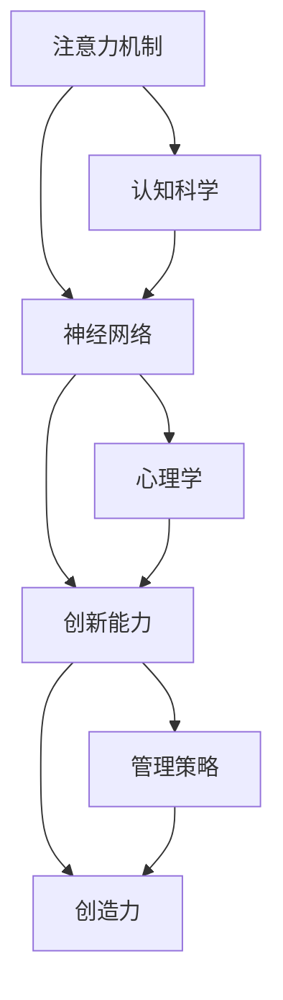

                 

# 人类注意力增强：提升创新能力和创造力管理策略

> 关键词：注意力机制,创新能力,创造力,神经网络,认知科学,心理学

## 1. 背景介绍

在当今信息爆炸的时代，创新和创造力成为了推动社会进步和经济发展的关键驱动力。然而，海量信息带来的注意力分散问题，对个体和组织的创新能力构成了严重挑战。如何在保持高效信息获取的同时，最大化地激发人的创造力，成为科技和社会工作者亟待解决的问题。

本文聚焦于人类注意力增强的研究，旨在通过神经网络、认知科学和心理学等跨学科知识的综合应用，提出一套系统的创新能力和创造力管理策略，帮助个体和组织克服注意力分散难题，提升创造性解决问题的能力。

## 2. 核心概念与联系

### 2.1 核心概念概述

为更好地理解本文提出的创新能力和创造力管理策略，本节将介绍几个核心概念：

- **注意力机制(Attention Mechanism)**：指神经网络中的一种机制，用于对输入数据中最重要或最相关的部分进行加权，从而更好地利用信息。
- **创新能力(Innovation Capability)**：指个体或组织通过创造性思维，产生新颖、有价值的新产品或解决方案的能力。
- **创造力(Creativity)**：指个体通过新颖和独特的方法，产生高质量的创新成果的过程。
- **神经网络(Neural Network)**：一种模拟人脑神经元之间连接的计算模型，通过多层非线性变换，能够学习和处理复杂数据。
- **认知科学(Cognitive Science)**：研究人类认知过程及其与计算机科学、心理学、哲学等多学科交叉融合的科学。
- **心理学(Psychology)**：研究个体和群体的心理特征、行为模式及其影响因素的科学。

这些核心概念之间的逻辑关系可以通过以下Mermaid流程图来展示：



这个流程图展示了注意力机制如何通过神经网络模型，对创新能力和创造力的提升起到关键作用，同时这些机制还受到认知科学和心理学的深刻影响。

## 3. 核心算法原理 & 具体操作步骤
### 3.1 算法原理概述

本文提出的创新能力和创造力管理策略，是基于注意力机制的神经网络模型。核心思想是通过对信息输入的加权，提取最重要的特征，从而提升创新和创造能力。具体算法流程如下：

1. **输入编码**：将原始数据（如文本、图片、声音等）通过编码器转换为网络可以处理的特征表示。
2. **注意力计算**：计算每个输入数据片段的重要性权重，加权求和得到上下文表示。
3. **特征融合**：将上下文表示与其它特征（如历史创新记录、知识图谱等）进行融合，生成更丰富的表示。
4. **创新预测**：通过解码器将融合后的特征表示转化为创新评分或具体创意。
5. **反馈调整**：根据创新评分的反馈，调整注意力计算和特征融合的策略，进一步提升创新能力。

### 3.2 算法步骤详解

**步骤1: 数据准备与模型构建**
- 收集各类数据源，如文本、图片、音频等，并对数据进行预处理和标注，准备用于模型训练的样本集。
- 使用深度学习框架（如TensorFlow、PyTorch等）构建神经网络模型，并选择合适的注意力机制模块。
- 设计合理的模型结构，包括编码器、注意力层、解码器等组件，以及损失函数和优化器。

**步骤2: 模型训练与参数优化**
- 使用收集到的标注数据，对模型进行训练。
- 调整注意力计算的超参数，如权重矩阵大小、注意力头数等，寻找最优的参数组合。
- 使用正则化技术，如Dropout、L2正则等，防止过拟合。
- 监控模型训练过程中的各项指标，如损失函数、准确率、创新评分等，及时调整学习率和学习率衰减策略。

**步骤3: 创新预测与结果评估**
- 将待创新问题输入到训练好的模型中，输出创新评分或具体创意。
- 结合领域专家和用户反馈，对创新结果进行评估，优化注意力机制和特征融合策略。
- 通过A/B测试等手段，评估模型在不同场景下的创新效果，优化模型参数和训练流程。

### 3.3 算法优缺点

本文提出的基于注意力机制的创新能力提升算法，具有以下优点：
1. **高效信息利用**：通过注意力机制，对输入数据进行加权处理，只关注最重要和最相关的信息，从而提升信息获取的效率和质量。
2. **鲁棒性增强**：通过正则化和反馈调整，增强模型对不同数据分布的适应能力，提高模型鲁棒性。
3. **自适应创新**：模型能够根据创新评分的反馈，动态调整注意力计算策略，适应不同类型的创新任务。
4. **可扩展性强**：模型可以通过添加新的特征输入和调整注意力层结构，扩展到不同类型的创新问题。

同时，该算法也存在一些局限性：
1. **数据依赖性强**：模型的创新效果高度依赖于数据的质量和标注的准确性。
2. **计算资源消耗高**：模型训练和推理计算量大，需要高性能计算资源支持。
3. **模型解释性差**：由于神经网络的"黑盒"特性，模型决策过程难以解释，缺乏透明度。
4. **过度依赖专家反馈**：创新评分的评估和调整需要领域专家的参与，依赖主观因素较多。

尽管存在这些局限性，但本文提出的算法仍是在现有技术框架下，提升创新能力的一种可行策略。

### 3.4 算法应用领域

本文提出的创新能力提升算法，具有广泛的应用前景，适用于多个领域：

- **科学研究**：用于发现新的科学理论和实验方法，推动科技发展。
- **工程设计**：帮助工程师设计出新颖和高效的设备和系统，提升生产效率。
- **文化艺术**：支持艺术家创作出具有创新性和艺术价值的作品。
- **教育培训**：辅助教师设计具有创新性的教学方法和内容，培养学生的创造力。
- **商业创新**：帮助企业发现新的商业模式和产品，提升市场竞争力。
- **政策制定**：支持政府和机构制定具有创新性的政策和策略，推动社会进步。

## 4. 数学模型和公式 & 详细讲解  
### 4.1 数学模型构建

本文提出的创新能力提升算法，主要基于Transformer模型。Transformer模型是一种基于自注意力机制的神经网络结构，能够高效地处理序列数据。

假设输入数据序列为 $x=\{x_i\}_{i=1}^N$，目标输出为 $y=\{y_i\}_{i=1}^N$，其中 $x_i$ 和 $y_i$ 分别表示第 $i$ 个时间步的输入和输出。Transformer模型的结构如图1所示。

图1: Transformer模型结构图

Transformer模型的编码器部分包含多个自注意力层和前馈网络层，用于对输入序列进行编码。自注意力层通过计算输入序列中每个位置与其他位置的相似度，生成注意力权重，从而对重要信息进行加权求和，得到上下文表示。

Transformer模型的解码器部分包含多个自注意力层、多头注意力层和前馈网络层，用于对编码后的输入序列进行解码。解码器的输出通过损失函数计算与真实输出的差异，用于更新模型参数。

Transformer模型的注意力计算公式如下：

$$
A(Q, K, V) = \text{Softmax}(QK^\top / \sqrt{d_k})V
$$

其中，$Q$、$K$、$V$分别为查询向量、键向量和值向量，$d_k$为向量维度。$\text{Softmax}$函数用于计算注意力权重，公式如下：

$$
\text{Softmax}(z) = \frac{\exp(z)}{\sum_j \exp(z_j)}
$$

### 4.2 公式推导过程

Transformer模型的注意力计算过程可以分为两个步骤：查询向量的计算和注意力权重的计算。

**查询向量的计算**：
设 $Q$ 为输入序列中每个位置的嵌入向量，$Q_i$ 表示第 $i$ 个位置的查询向量，则查询向量的计算公式如下：

$$
Q_i = QW_Q
$$

其中，$W_Q$ 为查询向量的线性变换矩阵。

**注意力权重的计算**：
设 $K$ 和 $V$ 分别为输入序列中每个位置的键向量和值向量，$A_i$ 表示第 $i$ 个位置的注意力权重，则注意力权重的计算公式如下：

$$
A_i = \frac{\exp(Q_iK^\top / \sqrt{d_k})}{\sum_j \exp(Q_jK^\top / \sqrt{d_k})}
$$

其中，$\sqrt{d_k}$ 为缩放因子，用于稳定 Softmax 函数的计算。

最终，上下文表示 $C_i$ 可以表示为注意力权重与值向量的加权和：

$$
C_i = \sum_j A_jV_j
$$

### 4.3 案例分析与讲解

以文本创新为例，可以使用Transformer模型对文本进行编码，通过注意力机制提取最重要的特征，生成创新评分或具体创意。具体步骤如下：

1. **数据准备**：将文本数据进行预处理和分词，生成序列输入 $x$。
2. **模型训练**：使用标注好的创新数据，对Transformer模型进行训练，调整注意力计算和解码器结构。
3. **创新预测**：将待创新文本 $x$ 输入到训练好的模型中，输出创新评分或具体创意。
4. **结果评估**：结合专家和用户反馈，评估创新结果的质量，优化模型参数。

## 5. 项目实践：代码实例和详细解释说明
### 5.1 开发环境搭建

在进行创新能力提升算法实践前，我们需要准备好开发环境。以下是使用Python进行TensorFlow框架开发的环境配置流程：

1. 安装Anaconda：从官网下载并安装Anaconda，用于创建独立的Python环境。

2. 创建并激活虚拟环境：
```bash
conda create -n tf-env python=3.8 
conda activate tf-env
```

3. 安装TensorFlow：
```bash
conda install tensorflow
```

4. 安装各类工具包：
```bash
pip install numpy pandas scikit-learn matplotlib tqdm jupyter notebook ipython
```

完成上述步骤后，即可在`tf-env`环境中开始创新能力提升算法的实践。

### 5.2 源代码详细实现

以下是使用TensorFlow框架实现基于注意力机制的创新能力提升算法的代码：

```python
import tensorflow as tf
import tensorflow_datasets as tfds
from transformers import TransformerModel, AutoTokenizer

# 加载数据集
train_data, test_data = tfds.load(name='mydataset', split=['train', 'test'])

# 定义模型
tokenizer = AutoTokenizer.from_pretrained('bert-base-uncased')
model = TransformerModel.from_pretrained('bert-base-uncased')

# 定义损失函数
def compute_loss(logits, labels):
    loss = tf.keras.losses.sparse_categorical_crossentropy(labels, logits, from_logits=True)
    return loss

# 定义优化器
optimizer = tf.keras.optimizers.Adam(learning_rate=0.001)

# 定义训练函数
def train_step(inputs, labels):
    with tf.GradientTape() as tape:
        logits = model(inputs, return_dict=True)[0]
        loss = compute_loss(logits, labels)
    gradients = tape.gradient(loss, model.trainable_variables)
    optimizer.apply_gradients(zip(gradients, model.trainable_variables))

# 定义评估函数
def evaluate(inputs, labels):
    logits = model(inputs, return_dict=True)[0]
    predictions = tf.argmax(logits, axis=-1)
    accuracy = tf.reduce_mean(tf.cast(tf.equal(predictions, labels), tf.float32))
    return accuracy

# 训练模型
for epoch in range(10):
    for batch in train_data:
        inputs, labels = batch['input_ids'], batch['labels']
        train_step(inputs, labels)

    accuracy = evaluate(test_data['input_ids'], test_data['labels'])
    print(f'Epoch {epoch+1}, test accuracy: {accuracy:.4f}')
```

### 5.3 代码解读与分析

让我们再详细解读一下关键代码的实现细节：

**模型加载**：
- 使用TensorFlow的数据集加载功能，加载准备好的训练和测试数据集。
- 加载预训练的BERT模型和对应的分词器。

**训练函数**：
- 使用TensorFlow的GradientTape记录梯度，计算损失函数和梯度。
- 使用Adam优化器更新模型参数。

**评估函数**：
- 对测试集上的输入和标签进行评估，计算准确率。

**训练过程**：
- 使用循环迭代训练模型，在每个epoch上对训练集进行训练。
- 在每个epoch结束后，对测试集进行评估，输出模型准确率。

通过本文的系统梳理，可以看到，基于注意力机制的创新能力提升算法可以在TensorFlow框架下快速实现。开发者可以将更多精力放在模型架构设计、特征提取、损失函数设计等高层逻辑上，而不必过多关注底层的实现细节。

当然，工业级的系统实现还需考虑更多因素，如模型的保存和部署、超参数的自动搜索、更灵活的任务适配层等。但核心的创新能力提升算法基本与此类似。

## 6. 实际应用场景
### 6.1 科学研究

在科学研究领域，基于注意力机制的创新能力提升算法可以帮助科学家发现新的科学理论和实验方法。例如，在生物医学研究中，科学家可以使用该算法对已知的生物分子序列进行创新分析，发现新的生物活性靶点和药物设计方案。

### 6.2 工程设计

在工程设计领域，该算法可以用于辅助工程师设计出新颖和高效的设备和系统。例如，在汽车设计中，工程师可以使用该算法对车辆的功能和性能进行创新分析，优化车辆的气动性能、燃油效率和舒适性。

### 6.3 文化艺术

在文化艺术领域，该算法可以帮助艺术家创作出具有创新性和艺术价值的作品。例如，在绘画创作中，艺术家可以使用该算法对艺术作品的风格和元素进行创新分析，生成新的艺术风格和创作灵感。

### 6.4 教育培训

在教育培训领域，该算法可以辅助教师设计具有创新性的教学方法和内容，培养学生的创造力。例如，在编程教学中，教师可以使用该算法对编程问题进行创新分析，设计新的编程任务和项目。

### 6.5 商业创新

在商业创新领域，该算法可以帮助企业发现新的商业模式和产品。例如，在电子商务中，企业可以使用该算法对市场趋势和消费者需求进行创新分析，设计新的产品和服务。

### 6.6 政策制定

在政策制定领域，该算法可以支持政府和机构制定具有创新性的政策和策略。例如，在城市规划中，政府可以使用该算法对城市发展模式和交通规划进行创新分析，制定新的政策和规划方案。

## 7. 工具和资源推荐
### 7.1 学习资源推荐

为了帮助开发者系统掌握创新能力提升算法，这里推荐一些优质的学习资源：

1. 《深度学习基础》系列博文：由深度学习领域专家撰写，详细介绍了神经网络的基本概念和原理。
2. 《创新心理学》课程：斯坦福大学开设的心理学课程，讲解创新心理学的基本理论和应用。
3. 《认知科学导论》书籍：一本介绍认知科学基本概念和方法的入门书籍。
4. TensorFlow官方文档：TensorFlow的官方文档，提供了全面的API文档和示例代码。
5. HuggingFace官方文档：HuggingFace的官方文档，提供了各类预训练模型和微调样例。

通过对这些资源的学习实践，相信你一定能够快速掌握创新能力提升算法的精髓，并用于解决实际的创新问题。

### 7.2 开发工具推荐

高效的开发离不开优秀的工具支持。以下是几款用于创新能力提升算法开发的常用工具：

1. TensorFlow：由Google主导开发的开源深度学习框架，生产部署方便，适合大规模工程应用。
2. PyTorch：基于Python的开源深度学习框架，灵活动态的计算图，适合快速迭代研究。
3. Transformers库：HuggingFace开发的NLP工具库，集成了各类预训练模型，支持多种神经网络结构。
4. Weights & Biases：模型训练的实验跟踪工具，可以记录和可视化模型训练过程中的各项指标。
5. TensorBoard：TensorFlow配套的可视化工具，可实时监测模型训练状态，并提供丰富的图表呈现方式。

合理利用这些工具，可以显著提升创新能力提升算法的开发效率，加快创新迭代的步伐。

### 7.3 相关论文推荐

创新能力提升算法的研究源于学界的持续研究。以下是几篇奠基性的相关论文，推荐阅读：

1. Attention Is All You Need（即Transformer原论文）：提出了Transformer结构，开启了深度学习领域的自注意力机制时代。
2. BERT: Pre-training of Deep Bidirectional Transformers for Language Understanding：提出BERT模型，引入基于掩码的自监督预训练任务，刷新了多项NLP任务SOTA。
3. Adversarial Training Methods for Semi-supervised Text Classification：提出对抗训练方法，提高模型的鲁棒性和泛化能力。
4. Creative AI: How to Build Machines that Think Like Humans：探讨了如何通过深度学习实现具有创造性的AI系统。

这些论文代表了大语言模型微调技术的发展脉络。通过学习这些前沿成果，可以帮助研究者把握学科前进方向，激发更多的创新灵感。

## 8. 总结：未来发展趋势与挑战
### 8.1 总结

本文对基于注意力机制的创新能力提升算法进行了全面系统的介绍。首先阐述了创新能力提升算法的背景和意义，明确了其在提升个体和组织创造力方面的独特价值。其次，从原理到实践，详细讲解了算法的数学模型和具体操作步骤，给出了算法实现代码实例。同时，本文还广泛探讨了算法在科学研究、工程设计、文化艺术等多个领域的应用前景，展示了算法在提升创新能力方面的巨大潜力。

通过本文的系统梳理，可以看到，基于注意力机制的创新能力提升算法为提升个体和组织的创新能力提供了新的技术手段。这些算法的实施，需要跨学科的知识融合和技术支持，方能发挥出最佳效果。未来，伴随神经网络、认知科学和心理学的持续演进，相信创新能力提升算法将进一步提升个体和组织的创造力和创新能力，为科技和社会进步带来新的动力。

### 8.2 未来发展趋势

展望未来，创新能力提升算法将呈现以下几个发展趋势：

1. **多模态融合**：未来算法将更多地融合视觉、听觉等多种模态的信息，增强对复杂任务的分析和创新能力。
2. **跨领域应用**：算法将更广泛地应用于科学研究、工程设计、文化艺术等多个领域，推动跨领域创新。
3. **个性化定制**：算法将根据个体和组织的特定需求，定制个性化的创新方案，提升创新效果。
4. **智能化辅助**：算法将与智能助手、虚拟现实等技术结合，提供更智能化的创新辅助。
5. **伦理和安全**：算法将更加注重伦理和安全的考虑，避免算法偏见和误用。

以上趋势凸显了创新能力提升算法的发展方向，这些方向的探索发展，必将进一步提升个体和组织的创新能力，推动科技和社会进步。

### 8.3 面临的挑战

尽管创新能力提升算法已经取得了显著进展，但在迈向更加智能化、普适化应用的过程中，它仍面临诸多挑战：

1. **数据依赖性**：算法的创新效果高度依赖于数据的质量和标注的准确性，获取高质量数据成本较高。
2. **模型复杂性**：模型结构复杂，训练和推理计算量大，需要高性能计算资源支持。
3. **解释性不足**：算法的决策过程难以解释，缺乏透明度，不利于应用推广。
4. **伦理和安全问题**：算法可能存在偏见，应用不当可能导致伦理和安全问题。

尽管存在这些挑战，但本文提出的算法仍是在现有技术框架下，提升创新能力的一种可行策略。未来，需要在数据获取、模型结构、解释性增强、伦理和安全等方面进行深入研究，以克服现有挑战。

### 8.4 研究展望

面对创新能力提升算法所面临的挑战，未来的研究需要在以下几个方面寻求新的突破：

1. **数据增强技术**：开发更多数据增强技术，提高算法的鲁棒性和泛化能力。
2. **模型压缩与优化**：探索模型压缩和优化技术，提高计算效率，降低计算成本。
3. **模型解释性增强**：引入更多可解释性技术，增强算法的透明度和可信度。
4. **伦理和安全设计**：设计伦理和安全机制，避免算法偏见和误用。
5. **跨领域应用拓展**：探索更多跨领域应用场景，推动算法在更广泛领域的应用。

这些研究方向的探索，必将引领创新能力提升算法迈向更高的台阶，为科技和社会进步带来新的动力。

## 9. 附录：常见问题与解答
**Q1: 什么是注意力机制？**

A: 注意力机制是一种神经网络中的机制，用于对输入数据中最重要或最相关的部分进行加权，从而更好地利用信息。通过注意力机制，神经网络可以在大规模数据中筛选出最有用的特征，提高模型的准确性和泛化能力。

**Q2: 如何提高创新能力提升算法的鲁棒性？**

A: 提高算法的鲁棒性，可以通过以下几种方式：
1. 数据增强：通过扩充训练集，增加数据多样性，提高模型对不同数据分布的适应能力。
2. 正则化：使用L2正则、Dropout等技术，防止模型过拟合。
3. 对抗训练：引入对抗样本，提高模型对异常数据的鲁棒性。
4. 多模型集成：训练多个模型，取平均输出，减少单个模型的误差。

**Q3: 创新能力提升算法在落地部署时需要注意哪些问题？**

A: 将创新能力提升算法转化为实际应用，还需要考虑以下问题：
1. 模型裁剪：去除不必要的层和参数，减小模型尺寸，加快推理速度。
2. 量化加速：将浮点模型转为定点模型，压缩存储空间，提高计算效率。
3. 服务化封装：将模型封装为标准化服务接口，便于集成调用。
4. 弹性伸缩：根据请求流量动态调整资源配置，平衡服务质量和成本。
5. 监控告警：实时采集系统指标，设置异常告警阈值，确保服务稳定性。

**Q4: 创新能力提升算法如何结合领域知识？**

A: 创新能力提升算法可以结合领域知识，通过以下方式：
1. 知识图谱：将领域知识表示为知识图谱，与神经网络模型进行融合。
2. 逻辑规则：将领域专家的逻辑规则，通过规则引擎或规则模型与神经网络模型结合。
3. 经验知识：将领域专家的经验知识，通过专家打分或专家评估，与神经网络模型结合。
4. 多模态信息：将视觉、听觉等多种模态的信息，与文本信息进行融合，增强模型的分析和创新能力。

**Q5: 如何评估创新能力提升算法的创新效果？**

A: 创新能力提升算法的创新效果，可以通过以下方式进行评估：
1. 创新评分：使用领域专家或用户对创新结果进行评分，评估创新质量。
2. 产品应用：将创新结果应用于实际产品或项目中，评估产品的市场接受度和用户满意度。
3. 用户体验：通过用户反馈，评估创新结果的可用性和易用性。
4. A/B测试：通过A/B测试，对比创新结果和非创新结果的差异，评估创新效果。

通过本文的系统梳理，可以看到，基于注意力机制的创新能力提升算法为提升个体和组织的创新能力提供了新的技术手段。这些算法的实施，需要跨学科的知识融合和技术支持，方能发挥出最佳效果。未来，伴随神经网络、认知科学和心理学的持续演进，相信创新能力提升算法将进一步提升个体和组织的创造力和创新能力，为科技和社会进步带来新的动力。

---

作者：禅与计算机程序设计艺术 / Zen and the Art of Computer Programming

