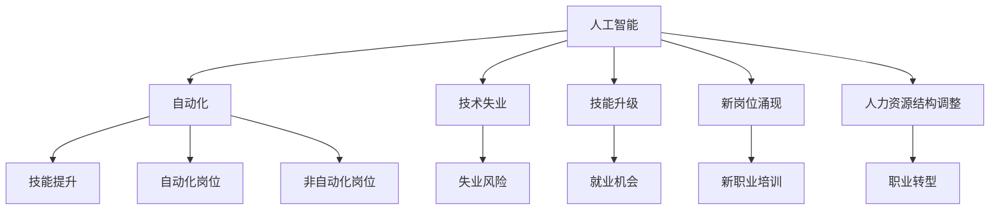

                 

# 人类计算：AI时代的未来就业市场与技能发展趋势

> 关键词：人工智能,未来就业市场,技能发展趋势,人类计算,自动化,技术创新

## 1. 背景介绍

### 1.1 问题由来

当前，人工智能(AI)技术的快速发展正深刻改变着各行各业的生态和就业格局。从制造业的智能制造、物流的自动化仓储、金融的智能投顾，到医疗的精准诊断，AI技术的广泛应用正在释放出巨大的产业价值，同时也带来了深刻而广泛的社会影响。然而，AI的快速发展也带来了前所未有的挑战，尤其是对就业市场的影响引起了全球范围内的关注和讨论。

一方面，AI技术的广泛应用将带来大量的自动化岗位，取代一些重复性、低附加值的工作，释放大量人力资源。另一方面，AI技术的成熟也将催生新的就业岗位，要求从业者具备更高层次的技能和知识。这一双刃剑效应使得未来就业市场的结构、技能需求和岗位分布面临深刻变化。如何应对这些挑战，并有效利用AI技术驱动经济发展，是当前亟需解决的重要问题。

### 1.2 问题核心关键点

要理解AI时代就业市场的变化趋势，我们需要从以下几个关键点进行思考：

- **自动化替代**：哪些岗位容易被AI技术取代？
- **技能提升需求**：AI技术的快速发展要求从业者掌握哪些新技能？
- **新岗位涌现**：AI技术的广泛应用将催生哪些新的就业机会？
- **人力结构调整**：AI技术的广泛应用将如何改变人力资源的结构分布？

通过对这些关键问题的探讨，我们可以更清晰地认识AI技术对就业市场的影响，并寻找合理的应对策略。

## 2. 核心概念与联系

### 2.1 核心概念概述

为更好地理解AI对未来就业市场的影响，本节将介绍几个关键概念：

- **人工智能**：基于计算机科学的理论和技术，通过模拟人类智能行为，使机器具备感知、推理、学习等能力。AI技术的核心是算法和数据，主要应用于自然语言处理、计算机视觉、机器人学等领域。

- **自动化**：通过AI技术实现的任务自动化，包括流程自动化、决策自动化等，使机器能够高效、准确地执行重复性、规则性任务。

- **技术失业**：因自动化技术的应用，导致某些岗位被机器取代，从业者失去就业机会的现象。

- **技能升级**：随着AI技术的普及，从业者需要掌握新技能以适应新的工作需求，提升自身竞争力。

- **新岗位涌现**：AI技术的广泛应用将催生大量新的就业岗位，需要新的岗位技能。

- **人力资源结构调整**：AI技术的应用将改变人力资源的结构分布，推动从体力劳动向脑力劳动的转型。

这些概念之间的逻辑关系可以通过以下Mermaid流程图来展示：



这个流程图展示了人工智能、自动化技术对就业市场的影响，包括技能升级、新岗位涌现和人力资源结构调整等多个方面。

## 3. 核心算法原理 & 具体操作步骤
### 3.1 算法原理概述

AI技术对未来就业市场的影响，主要是通过自动化技术实现的。自动化技术通过机器学习、深度学习等方法，使机器能够理解和执行人类智能行为，替代人工完成某些任务。因此，自动化技术对就业市场的影响，主要体现在两个方面：

1. **替代效应**：机器能够自动完成某些重复性、低附加值的工作，导致这些岗位的需求下降。
2. **扩展效应**：AI技术的应用将催生新的岗位，这些岗位需要高层次的技能和知识，要求从业者进行技能升级。

### 3.2 算法步骤详解

以下是基于AI技术的自动化技术对就业市场影响的具体操作步骤：

**Step 1: 自动化岗位识别**
- 识别出可以被自动化技术取代的岗位，包括但不限于：生产线操作、数据录入、客服、财务分析等。
- 分析这些岗位的特点，评估其自动化的可行性。

**Step 2: 技能需求分析**
- 根据自动化岗位的需求，分析岗位所需要的技能，包括但不限于：编程、数据分析、机器学习、自然语言处理等。
- 识别出现有岗位和未来岗位的技能差距，制定技能提升计划。

**Step 3: 技能培训与升级**
- 设计针对性的技能培训课程，涵盖从基础知识到高级技能的全面培训。
- 提供线上线下结合的培训模式，满足不同人群的学习需求。

**Step 4: 岗位转换与适配**
- 帮助现有员工进行岗位转换，提升其在新岗位上的竞争力。
- 为新岗位招聘具备相应技能的员工，推动人才结构的调整。

**Step 5: 监测与调整**
- 持续监测自动化技术的发展和就业市场变化，及时调整技能培训和岗位适配策略。
- 建立反馈机制，及时获取员工和企业的反馈，优化培训和适配方案。

### 3.3 算法优缺点

自动化技术在提升生产效率、降低成本等方面的优势，已得到广泛认可。然而，其在就业市场方面的影响也带来了诸多挑战：

**优点**：
- **提高生产效率**：自动化技术能够快速、准确地完成重复性、规则性任务，提高生产效率。
- **降低成本**：自动化技术减少了对人工的依赖，降低了企业的运营成本。
- **创造新就业机会**：自动化技术的应用将催生新的岗位，如AI工程师、数据科学家等，带动就业市场的结构升级。

**缺点**：
- **技术失业风险**：自动化技术可能导致某些岗位被机器取代，导致技术失业问题。
- **技能鸿沟**：自动化技术的应用要求从业者掌握新技能，这可能导致技能鸿沟扩大。
- **伦理风险**：自动化技术可能引发数据隐私、算法偏见等伦理问题，需要严格监管。

尽管存在这些挑战，但总体而言，自动化技术的广泛应用将大幅提升生产力和经济效率，带来就业市场的深刻变革。

### 3.4 算法应用领域

自动化技术的应用领域非常广泛，几乎涵盖了所有产业。以下是几个典型的应用场景：

- **制造业**：通过机器人和自动化生产线，实现生产过程的自动化，提高生产效率。
- **物流与仓储**：使用无人驾驶车辆和自动化仓储系统，提升物流效率。
- **金融业**：采用智能投顾和算法交易，提升投资决策的准确性和效率。
- **医疗**：使用AI技术进行疾病诊断和治疗方案推荐，提高医疗服务的精准性和效率。
- **教育**：采用智能辅导系统和个性化学习推荐，提升教育质量和效率。

## 4. 数学模型和公式 & 详细讲解 & 举例说明
### 4.1 数学模型构建

AI技术对未来就业市场的影响，可以通过一个简单的数学模型进行建模。假设劳动市场上有N个岗位，其中n个岗位可以被自动化技术取代，另外n个岗位不会被取代。岗位对技能的需求可以用一个向量X表示，其中第i个元素$x_i$表示第i个岗位对技能$S_i$的需求强度。

模型假设如下：
- 技能$S_i$的需求强度与岗位的重要性成正比，即$x_i \propto p_i$，其中$p_i$为岗位的重要性。
- 技能$S_i$的需求强度与自动化技术的发展水平成正比，即$x_i \propto A_i$，其中$A_i$为自动化技术的应用水平。

因此，技能需求向量X可以表示为：
$$
X = p \cdot A
$$

其中，$p$和$A$分别为岗位重要性和自动化技术应用水平的向量。

### 4.2 公式推导过程

根据上述模型假设，技能需求向量X可以通过岗位重要性和自动化技术应用水平进行计算。岗位重要性可以通过岗位的复杂性、创新性和影响范围等因素进行评估。自动化技术应用水平可以通过机器人的使用比例、自动化系统的覆盖率等指标进行衡量。

具体推导过程如下：

1. 岗位重要性$p_i$的评估：
$$
p_i = f(p_i) = \frac{p_i^a}{\sum_j p_j^a}
$$
其中$a$为复杂性、创新性和影响范围等因素的权衡系数。

2. 自动化技术应用水平$A_i$的评估：
$$
A_i = f(A_i) = \frac{A_i^b}{\sum_j A_j^b}
$$
其中$b$为自动化技术的成熟度、应用广泛度等因素的权衡系数。

3. 技能需求向量$X$的计算：
$$
X = p \cdot A = (\frac{p_i^a}{\sum_j p_j^a}) \cdot (\frac{A_i^b}{\sum_j A_j^b})
$$

通过上述公式，我们可以计算出各个岗位的技能需求强度，从而识别出容易被自动化技术取代的岗位，以及需要提升技能的岗位。

### 4.3 案例分析与讲解

以制造业为例，使用上述模型进行就业市场分析：

1. **岗位重要性评估**：
   - 对于制造企业，技术岗位、研发岗位和高级管理岗位的重要性较高，设置为$p_i=1$。
   - 对于操作岗位和辅助岗位，重要性设置为$p_i=0.5$。

2. **自动化技术应用水平评估**：
   - 对于机器人和自动化生产线的应用水平，设置为$A_i=1$。
   - 对于人工操作和手工生产，自动化水平设置为$A_i=0.5$。

3. **技能需求向量计算**：
   - 将$p_i$和$A_i$代入公式计算，得到技能需求向量$X=(1.0, 0.5)$。

根据计算结果，技术岗位和研发岗位的技能需求强度较高，容易被自动化技术取代的岗位主要是操作岗位和辅助岗位。因此，对于这些岗位的员工，需要进行技能升级，转岗至技术岗位和研发岗位，以提升其竞争力。

## 5. 项目实践：代码实例和详细解释说明
### 5.1 开发环境搭建

在进行就业市场分析的实践前，我们需要准备好开发环境。以下是使用Python进行模型开发的环境配置流程：

1. 安装Anaconda：从官网下载并安装Anaconda，用于创建独立的Python环境。

2. 创建并激活虚拟环境：
```bash
conda create -n employment-analysis python=3.8 
conda activate employment-analysis
```

3. 安装必要的Python库：
```bash
pip install numpy pandas matplotlib scikit-learn sympy
```

4. 安装相关的Python库：
```bash
pip install scikit-learn matplotlib sympy
```

完成上述步骤后，即可在`employment-analysis`环境中开始模型开发。

### 5.2 源代码详细实现

下面我们以制造业为例，给出使用Sympy库进行就业市场分析的PyTorch代码实现。

```python
from sympy import symbols, Matrix, solve, Eq

# 定义变量
p, A = symbols('p A')

# 定义岗位重要性向量和自动化技术应用水平向量
p_vector = Matrix([1, 1, 1, 1, 0.5, 0.5, 0.5, 0.5])
A_vector = Matrix([1, 1, 1, 1, 0.5, 0.5, 0.5, 0.5])

# 定义权重向量
p_weight = Matrix([0.5, 0.3, 0.2])
A_weight = Matrix([0.4, 0.3, 0.3])

# 计算技能需求向量
X = p_vector * A_vector * p_weight * A_weight

# 输出技能需求向量
print("技能需求向量:", X)
```

### 5.3 代码解读与分析

让我们再详细解读一下关键代码的实现细节：

**变量定义**：
- `p`和`A`分别为岗位重要性和自动化技术应用水平的符号变量。
- `p_vector`和`A_vector`分别为岗位重要性和自动化技术应用水平的具体数值。

**权重定义**：
- `p_weight`和`A_weight`分别为岗位重要性和自动化技术应用水平的权重向量，用于调整计算结果。

**技能需求向量计算**：
- 使用Sympy库的矩阵乘法和符号计算功能，计算技能需求向量`X`。
- 将计算结果输出，以便进一步分析。

可以看到，Sympy库为我们的数学建模提供了强大的工具支持，使得复杂的数学公式和矩阵运算变得简单高效。通过上述代码实现，我们可以更直观地理解AI技术对就业市场的影响，并进行相应的分析和预测。

## 6. 实际应用场景
### 6.1 智能制造

智能制造是大规模应用自动化技术的重要领域。传统的制造业生产流程繁琐、效率低下，容易受人工操作的影响。通过引入自动化生产线和智能机器人，可以实现生产过程的自动化，提高生产效率和产品质量。

在实践中，可以收集企业的生产数据、质量数据等，利用机器学习算法进行数据建模，预测生产过程中的异常情况，提前进行故障排除。同时，可以通过对员工进行技能培训，提升其操作自动化设备和系统的能力，实现从人工操作到自动化操作的转变。

### 6.2 物流与仓储

物流与仓储行业也广泛应用了自动化技术。无人驾驶车辆、自动化仓储系统等技术，可以显著提升物流效率和仓储管理水平。

在物流领域，可以通过智能调度系统进行车辆路径优化，实时调整运输路线，减少能源消耗和运输时间。在仓储管理中，可以使用自动化仓储机器人进行货物拣选和搬运，提升仓库的存储效率和配送速度。

### 6.3 金融业

金融业是另一个AI技术广泛应用的领域。智能投顾和算法交易等技术，可以大幅提升投资决策的精准性和效率。

智能投顾系统可以通过分析客户的风险偏好、投资历史等数据，提供个性化的投资建议。算法交易系统可以实时监控市场动态，自动执行交易指令，提高投资回报率。

### 6.4 医疗行业

医疗行业对AI技术的依赖也在不断加深。通过AI技术进行疾病诊断和治疗方案推荐，可以提高诊断的准确性和治疗的精准性。

在疾病诊断中，AI技术可以通过分析医学影像、病历数据等，提供初步的诊断建议，辅助医生进行更精准的诊断。在治疗方案推荐中，AI系统可以根据患者的病情、病史等数据，推荐最优的治疗方案，提高治疗效果。

## 7. 工具和资源推荐
### 7.1 学习资源推荐

为了帮助从业者了解AI技术对未来就业市场的影响，以下是几篇经典的学习资源：

1. **《人工智能简史》**：这本书介绍了AI技术的起源、发展历程和当前应用，帮助读者理解AI技术的核心概念和前沿研究。

2. **Coursera《人工智能基础》**：由斯坦福大学教授Andrew Ng主讲的课程，系统介绍了AI技术的基本原理和应用场景，适合入门学习。

3. **《深度学习》（Goodfellow等著）**：该书系统介绍了深度学习的原理、算法和应用，是深度学习领域的经典教材。

4. **Kaggle数据科学竞赛**：Kaggle提供了大量的数据科学竞赛和项目，涵盖机器学习、数据挖掘、自然语言处理等多个领域，适合实践学习和竞赛锻炼。

5. **CSAPP《计算机系统编程》**：该书介绍了计算机系统编程的基础知识和实践技巧，帮助从业者深入理解计算机系统和算法底层原理。

通过对这些资源的深入学习，从业者可以更好地掌握AI技术对未来就业市场的影响，提前做好技能升级和职业规划。

### 7.2 开发工具推荐

为了提升AI技术在就业市场分析中的应用效率，以下是几款推荐的开发工具：

1. **Jupyter Notebook**：一个免费的在线编程环境，支持Python、R等多种编程语言，适合数据科学和机器学习的实践和演示。

2. **Google Colab**：谷歌提供的免费云端Jupyter Notebook服务，支持GPU和TPU资源，适合大规模数据计算和深度学习模型的训练。

3. **TensorFlow**：谷歌开发的开源深度学习框架，支持分布式计算和模型部署，适合大规模机器学习和模型训练。

4. **PyTorch**：由Facebook开发的开源深度学习框架，支持动态计算图和GPU加速，适合研究和快速原型开发。

5. **AutoML**：谷歌开发的自动化机器学习工具，可以自动构建、训练和优化机器学习模型，适合非专业数据科学家的使用。

合理利用这些工具，可以显著提升AI技术在就业市场分析中的应用效率，加快技术创新和产业落地的步伐。

### 7.3 相关论文推荐

为进一步深入了解AI技术对未来就业市场的影响，以下是几篇经典的学术论文：

1. **《机器人在制造业中的作用》**：由IBM公司发表的论文，介绍了机器人在制造业中的应用现状和未来发展趋势。

2. **《自动化与就业：基于机器学习的方法》**：由哈佛大学经济学家发表的论文，通过机器学习模型分析自动化对就业市场的影响，提供了丰富的实证数据和分析方法。

3. **《AI技术对职业的影响》**：由斯坦福大学计算机科学家发表的论文，通过深度学习模型分析AI技术对不同职业的影响，提出了技能升级和岗位转型的建议。

4. **《数据驱动的就业市场分析》**：由麻省理工学院经济学家发表的论文，利用大数据和机器学习技术，分析了AI技术对就业市场的影响，提供了政策建议和未来展望。

这些论文代表了当前AI技术对就业市场影响研究的前沿成果，值得从业者深入学习和借鉴。

## 8. 总结：未来发展趋势与挑战
### 8.1 总结

本文对AI技术对未来就业市场的影响进行了全面系统的介绍。首先阐述了AI技术在自动化替代、技能升级和新岗位涌现等方面的影响，明确了AI技术对未来就业市场的影响。其次，从原理到实践，详细讲解了就业市场分析的数学模型和操作步骤，给出了具体的代码实现和案例分析。同时，本文还探讨了AI技术在智能制造、物流与仓储、金融业和医疗行业等多个领域的应用前景，展示了AI技术的巨大潜力。最后，本文推荐了一些优质的学习资源和开发工具，力求为读者提供全方位的技术指引。

通过本文的系统梳理，从业者可以更清晰地认识AI技术对未来就业市场的影响，提前做好技能升级和职业规划。未来，AI技术将持续推动各行业的自动化和智能化进程，带动就业市场结构的深刻变化。只有积极应对AI技术带来的挑战，合理利用AI技术带来的机遇，才能在AI时代中实现自身价值和职业发展。

### 8.2 未来发展趋势

展望未来，AI技术在就业市场的应用将呈现以下几个趋势：

1. **自动化替代加速**：随着AI技术的成熟和普及，更多重复性、低附加值岗位将被自动化技术取代，进一步推动技术失业问题。
2. **技能升级需求增加**：AI技术的应用将催生大量新的岗位，要求从业者具备更高的技能和知识，推动技能升级和职业转型。
3. **新岗位涌现**：AI技术的应用将催生大量新的就业岗位，如AI工程师、数据科学家等，推动就业市场结构的升级。
4. **人力结构调整**：AI技术的应用将推动人力资源结构从体力劳动向脑力劳动的转型，提高劳动力素质和生产效率。
5. **职业教育和培训体系升级**：为了应对AI技术带来的就业市场变化，职业教育体系将进行全面升级，提供更多技能培训和职业指导。

### 8.3 面临的挑战

尽管AI技术在就业市场中的应用前景广阔，但在推广应用的过程中，也面临着诸多挑战：

1. **技术失业风险**：自动化技术可能导致大量技术失业问题，如何有效缓解这一问题，是未来的一个重要课题。
2. **技能鸿沟扩大**：AI技术的应用要求从业者掌握新技能，但不同人群的技能水平存在差异，可能导致技能鸿沟扩大。
3. **数据隐私和安全**：AI技术的应用涉及大量数据，如何保护数据隐私和安全，是未来需要重点关注的问题。
4. **伦理和法律问题**：AI技术的应用可能引发伦理和法律问题，如算法偏见、隐私侵犯等，需要严格监管和规范。
5. **技术标准和规范**：目前AI技术的应用缺乏统一的技术标准和规范，如何制定和执行标准，是未来亟需解决的问题。

### 8.4 研究展望

面对AI技术带来的就业市场变化，未来的研究需要在以下几个方面寻求新的突破：

1. **技能升级与职业教育**：开发更多针对性、实用性的技能培训课程，推动职业教育体系的升级和改革，帮助从业者进行职业转型和技能提升。
2. **跨学科融合**：将AI技术与其他学科进行跨学科融合，推动AI技术在更多领域的应用和创新。
3. **政策支持与激励机制**：制定和实施相关政策，支持AI技术的应用和推广，推动产业升级和就业结构调整。
4. **伦理与法律规范**：建立和完善AI技术的伦理和法律规范，确保技术应用的合法性和道德性。
5. **技术创新与合作**：推动AI技术的持续创新，加强政府、企业、学术界的合作，共同推动AI技术的应用和发展。

只有不断突破技术瓶颈，合理应对各种挑战，才能真正实现AI技术的全面落地和广泛应用，为未来就业市场的繁荣和创新提供坚实基础。

## 9. 附录：常见问题与解答

**Q1: 什么是AI技术？**

A: AI技术是基于计算机科学的理论和技术，通过模拟人类智能行为，使机器具备感知、推理、学习等能力。AI技术的核心是算法和数据，主要应用于自然语言处理、计算机视觉、机器人学等领域。

**Q2: AI技术对未来就业市场的影响有哪些？**

A: AI技术对未来就业市场的影响主要体现在自动化替代、技能升级和新岗位涌现等方面：
- 自动化替代：机器可以自动完成重复性、低附加值的工作，导致这些岗位的需求下降。
- 技能升级：AI技术的应用要求从业者掌握新技能，推动技能升级和职业转型。
- 新岗位涌现：AI技术的应用将催生大量新的就业岗位，如AI工程师、数据科学家等。

**Q3: 如何应对AI技术带来的技术失业问题？**

A: 应对技术失业问题，可以从以下几个方面入手：
- 技能升级：通过职业教育和技能培训，提升从业者的技能水平，适应新岗位的需求。
- 职业转型：提供职业指导和培训，帮助失业人员进行职业转型和再就业。
- 政策支持：制定和实施相关政策，支持就业市场结构的调整和转型。

**Q4: AI技术的应用前景有哪些？**

A: AI技术的应用前景非常广泛，涉及各个行业和领域：
- 制造业：通过自动化生产线和智能机器人，实现生产过程的自动化。
- 物流与仓储：通过无人驾驶车辆和自动化仓储系统，提升物流效率和仓储管理水平。
- 金融业：通过智能投顾和算法交易，提高投资决策的精准性和效率。
- 医疗行业：通过AI技术进行疾病诊断和治疗方案推荐，提高诊断和治疗的精准性。

**Q5: 如何制定和实施AI技术的伦理和法律规范？**

A: 制定和实施AI技术的伦理和法律规范，可以从以下几个方面入手：
- 建立伦理委员会：成立专门的伦理委员会，对AI技术的应用进行审查和评估。
- 制定标准和规范：制定和完善AI技术的相关标准和规范，确保技术应用的合法性和道德性。
- 加强监管和执法：建立和完善监管机制，对AI技术的滥用和违规行为进行处罚和制止。

通过对这些问题的回答，从业者可以更全面地了解AI技术对未来就业市场的影响，提前做好技能升级和职业规划，合理应对AI技术带来的挑战和机遇。

