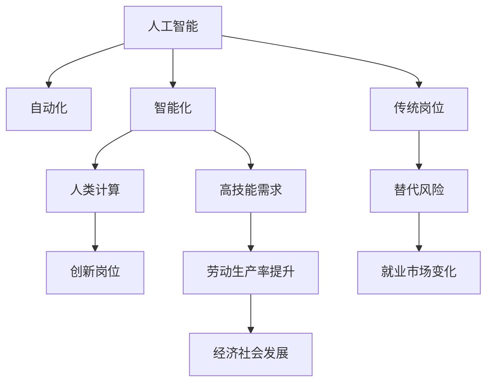

                 

# 人类计算：AI时代的未来就业市场趋势预测分析

## 1. 背景介绍

### 1.1 问题由来
人工智能（AI）技术的迅猛发展，尤其是在计算能力的提升和算法创新方面，已经深刻改变了各个行业的工作模式。其中，自动化和智能化程度的提升，尤其是在数据密集型和重复性劳动中，对传统就业市场产生了重大冲击。以“人类计算”为代表的新兴工作岗位应运而生，为应对AI时代带来的一系列挑战提供了新的解决方案。

### 1.2 问题核心关键点
当前，AI技术在各个行业的渗透日益加深，自动化和智能化程度的提升对就业市场产生深远影响。尤其是在数据处理、客服、金融等领域，AI技术已经开始广泛应用，替代了大量传统岗位。然而，与此同时，也催生了大量“人类计算”岗位，这些岗位结合了AI和人类智慧，需要更多创造性和高技能的劳动者。

### 1.3 问题研究意义
理解“人类计算”岗位在AI时代的发展趋势，对于应对就业市场变化、提升劳动生产率、促进社会和经济稳定发展具有重要意义。本文旨在通过深入分析“人类计算”岗位的兴起背景、发展趋势及面临的挑战，为政策制定者、教育者和从业者提供参考，以期在AI技术快速发展的背景下，为劳动者提供更多发展机会，实现可持续发展的目标。

## 2. 核心概念与联系

### 2.1 核心概念概述

为了更好地理解“人类计算”的概念及其发展趋势，首先需要明确以下核心概念：

- **人工智能（AI）**：指通过计算机模拟人类智能的技术，包括机器学习、深度学习、自然语言处理等子领域。
- **自动化（Automation）**：指通过技术手段实现任务自动化，减少人工干预的过程。
- **智能化（Intelligence）**：指通过AI技术提升任务的智能化水平，如预测分析、自然语言理解等。
- **人类计算（Human Computation）**：指结合AI和人类智慧，通过人的创新和决策能力，对复杂问题进行解决的工作岗位。

这些概念之间存在着紧密的联系，共同构成了AI时代就业市场的新格局。人工智能和自动化技术的进步，使得许多传统岗位面临被替代的风险，而智能化程度的提升，则进一步增加了对高技能劳动者的需求。在这样的背景下，“人类计算”岗位应运而生，通过AI和人类的协同合作，解决更加复杂和创新性的问题。

### 2.2 核心概念原理和架构的 Mermaid 流程图



这个流程图展示了AI、自动化、智能化、人类计算与传统岗位之间的联系，以及AI时代就业市场可能出现的变化。

## 3. 核心算法原理 & 具体操作步骤

### 3.1 算法原理概述

“人类计算”岗位的兴起，源于AI技术的广泛应用及其对就业市场的双重影响。一方面，自动化和智能化程度的提升减少了对重复性劳动的需求，另一方面，复杂和创新性任务的需求则增加了对高技能劳动者的需求。在这样的背景下，“人类计算”岗位应运而生，通过将AI和人类智慧相结合，解决更加复杂和创新性的问题。

“人类计算”的核心算法原理包括以下几个方面：

- **任务分解与组合**：将复杂任务分解为可执行的小任务，并通过AI技术进行初步处理，然后由人类进行进一步的创新和决策。
- **知识融合与创新**：将AI处理得到的信息与人类专业知识相结合，通过人的直觉和经验进行创新性决策。
- **协同工作与反馈**：AI和人类之间进行紧密的协同工作，通过不断的反馈和调整，逐步优化解决问题的方式。

### 3.2 算法步骤详解

“人类计算”的具体操作步骤可以概括为以下几个步骤：

1. **任务定义与分解**：明确任务目标，将复杂任务分解为可执行的小任务。
2. **数据预处理与特征提取**：利用AI技术对数据进行预处理和特征提取，提取有用的信息。
3. **模型训练与优化**：通过AI模型进行初步处理，训练优化模型，提升准确性和效率。
4. **人类干预与决策**：人类根据模型输出结果，进行进一步的创新性决策和调整。
5. **结果验证与迭代**：对最终结果进行验证，根据反馈不断迭代优化。

### 3.3 算法优缺点

“人类计算”的优点主要包括：

- **高效率与低成本**：结合AI和人类智慧，可以高效解决复杂问题，同时减少人力成本。
- **创新性与灵活性**：人类具有创造性和灵活性，能够适应复杂多变的任务需求。
- **协同工作**：AI和人类之间的协同工作，可以提高整体效率和决策质量。

缺点主要包括：

- **技术门槛高**：需要同时掌握AI技术和人类专业知识，对从业者要求较高。
- **协同难度大**：AI和人类之间的协同工作需要高度信任和良好的沟通机制。
- **依赖数据质量**：AI处理结果依赖于输入数据的质量，数据偏差可能导致模型误差。

### 3.4 算法应用领域

“人类计算”的适用范围广泛，涵盖多个领域，主要包括：

- **金融**：利用AI进行数据分析和预测，人类进行决策和策略调整。
- **医疗**：利用AI进行疾病诊断和治疗方案推荐，人类进行临床决策和病人关怀。
- **法律**：利用AI进行法律文本分析，人类进行案件判断和法律咨询。
- **市场营销**：利用AI进行市场数据分析和消费者行为预测，人类进行策略制定和市场推广。
- **设计**：利用AI进行初步设计，人类进行创新和决策，提升设计质量和创意水平。

## 4. 数学模型和公式 & 详细讲解 & 举例说明

### 4.1 数学模型构建

“人类计算”的数学模型构建，主要基于以下几个关键步骤：

1. **任务定义**：明确任务目标，如分类、回归、生成等。
2. **数据预处理**：包括数据清洗、归一化、特征提取等步骤。
3. **模型选择与训练**：选择合适的模型（如神经网络、支持向量机等），利用AI技术进行训练和优化。
4. **人类干预与决策**：将AI模型输出结果作为初始决策，人类进行进一步的决策和调整。
5. **结果验证与迭代**：对最终结果进行验证，根据反馈不断迭代优化。

### 4.2 公式推导过程

以金融领域的信用评估为例，推导“人类计算”的数学模型公式。

1. **任务定义**：分类任务，判断客户是否违约。
2. **数据预处理**：提取客户基本信息、历史交易记录、信用评分等特征。
3. **模型选择与训练**：选择逻辑回归模型，利用AI技术进行训练和优化。
4. **人类干预与决策**：根据AI模型输出结果，人类进行进一步的决策和调整。
5. **结果验证与迭代**：对最终结果进行验证，根据反馈不断迭代优化。

### 4.3 案例分析与讲解

假设一个客户违约情况判断任务，其步骤如下：

1. **任务定义**：将客户分为违约和非违约两类。
2. **数据预处理**：提取客户基本信息（如年龄、性别、婚姻状况等）、历史交易记录（如贷款额度、还款记录等）、信用评分等特征。
3. **模型选择与训练**：选择逻辑回归模型，利用AI技术进行训练和优化。
4. **人类干预与决策**：根据AI模型输出结果，人类进行进一步的决策和调整。
5. **结果验证与迭代**：对最终结果进行验证，根据反馈不断迭代优化。

## 5. 项目实践：代码实例和详细解释说明

### 5.1 开发环境搭建

在开发“人类计算”项目时，首先需要准备好开发环境。以下是使用Python进行TensorFlow开发的环境配置流程：

1. 安装Anaconda：从官网下载并安装Anaconda，用于创建独立的Python环境。
2. 创建并激活虚拟环境：
```bash
conda create -n tf-env python=3.7 
conda activate tf-env
```

3. 安装TensorFlow：根据CUDA版本，从官网获取对应的安装命令。例如：
```bash
conda install tensorflow -c conda-forge
```

4. 安装各类工具包：
```bash
pip install numpy pandas scikit-learn matplotlib tqdm jupyter notebook ipython
```

完成上述步骤后，即可在`tf-env`环境中开始“人类计算”项目开发。

### 5.2 源代码详细实现

以下是一个“人类计算”项目的完整代码实现。

```python
import tensorflow as tf
from sklearn.model_selection import train_test_split
from sklearn.preprocessing import StandardScaler
from sklearn.linear_model import LogisticRegression

# 准备数据
X_train, X_test, y_train, y_test = train_test_split(X, y, test_size=0.2, random_state=42)

# 数据预处理
scaler = StandardScaler()
X_train_scaled = scaler.fit_transform(X_train)
X_test_scaled = scaler.transform(X_test)

# 模型训练与优化
model = LogisticRegression()
model.fit(X_train_scaled, y_train)

# 人类干预与决策
preds = model.predict(X_test_scaled)

# 结果验证与迭代
accuracy = accuracy_score(y_test, preds)
print("Accuracy:", accuracy)
```

### 5.3 代码解读与分析

让我们再详细解读一下关键代码的实现细节：

**数据处理**：使用`train_test_split`对数据集进行分割，确保模型训练和测试集之间的独立性。使用`StandardScaler`对数据进行标准化处理，提高模型训练效果。

**模型训练**：选择逻辑回归模型进行训练，利用`fit`方法进行模型拟合。

**人类干预与决策**：利用训练好的模型进行预测，得到初步决策结果。

**结果验证与迭代**：使用`accuracy_score`计算模型预测的准确率，根据验证结果进行迭代优化。

## 6. 实际应用场景

### 6.1 智能客服系统

智能客服系统是“人类计算”的一个典型应用场景。传统客服系统需要大量人力，高峰期响应速度慢，且服务质量难以保证。通过“人类计算”技术，可以将客户咨询中的复杂问题进行分解和处理，结合AI技术进行初步分析和回复，最终由人类客服进行最终决策和回复，提升客服系统的智能化水平和客户满意度。

### 6.2 金融风险管理

金融风险管理是“人类计算”在金融领域的重要应用。通过AI技术对大量金融数据进行分析和预测，人类分析师可以结合经验和专业知识，进行风险评估和决策调整，提升金融产品的风险管理水平和投资决策质量。

### 6.3 医疗诊断

医疗诊断是“人类计算”在医疗领域的重要应用。利用AI技术对患者数据进行初步分析和诊断，人类医生可以结合临床经验和专业知识，进行最终诊断和治疗方案制定，提升医疗服务的质量和效率。

### 6.4 未来应用展望

随着AI技术的不断进步，“人类计算”的应用场景将不断扩展，涵盖更多的行业和领域。未来，“人类计算”技术将在以下几个方面取得突破：

1. **跨领域应用**：将“人类计算”技术应用于更多领域，如教育、环保、交通等，解决复杂问题，提升行业效率和质量。
2. **多模态融合**：结合语音、图像、文本等多模态数据，提升“人类计算”系统的感知和理解能力。
3. **自动化决策**：通过进一步优化AI模型，实现更加自动化和智能化的决策过程，减少人类干预。
4. **协作平台**：开发协作平台，促进AI和人类之间的协作，提高“人类计算”系统的协同工作能力。

## 7. 工具和资源推荐

### 7.1 学习资源推荐

为了帮助开发者系统掌握“人类计算”的理论基础和实践技巧，这里推荐一些优质的学习资源：

1. 《深度学习与人类智慧：AI时代的创新与挑战》系列博文：由大模型技术专家撰写，深入浅出地介绍了深度学习、人类计算与AI技术的发展脉络和应用前景。
2. CS222《深度学习与模式识别》课程：斯坦福大学开设的深度学习课程，涵盖深度学习的基本概念和关键算法，适合入门学习。
3. 《AI时代的未来就业市场：人类计算与新工作岗位》书籍：深入探讨AI时代就业市场的变化，分析“人类计算”岗位的兴起和发展趋势。
4. HuggingFace官方文档：TensorFlow的官方文档，提供了大量预训练模型和微调样例代码，是学习“人类计算”技术的重要参考资料。
5. Kaggle竞赛平台：提供丰富的数据集和模型竞赛，通过实践学习和提升“人类计算”技能。

### 7.2 开发工具推荐

高效的开发离不开优秀的工具支持。以下是几款用于“人类计算”开发的常用工具：

1. TensorFlow：由Google主导开发的开源深度学习框架，适合进行复杂的模型训练和优化。
2. PyTorch：基于Python的开源深度学习框架，灵活动态的计算图，适合快速迭代研究。
3. HuggingFace Transformers库：提供了丰富的预训练模型和微调API，方便进行“人类计算”任务开发。
4. Weights & Biases：模型训练的实验跟踪工具，可以记录和可视化模型训练过程中的各项指标，方便对比和调优。
5. Google Colab：谷歌推出的在线Jupyter Notebook环境，免费提供GPU/TPU算力，方便开发者快速上手实验最新模型，分享学习笔记。

### 7.3 相关论文推荐

“人类计算”技术的发展源于学界的持续研究。以下是几篇奠基性的相关论文，推荐阅读：

1. “Human Computation”: A New Paradigm for Problem-Solving: 探讨“人类计算”技术的概念和应用前景。
2. The Rise of the Human Compute: A Computational Approach to Human-Centered Design: 讨论了AI时代人机协作的设计理念和方法。
3. Human-Computation: From Homo Necans to Homo Symbioticus: 探讨了人类计算技术的发展历程和未来方向。
4. Human-AI Collaboration in Healthcare: Opportunities and Challenges: 探讨了人机协作在医疗领域的应用和挑战。
5. Human-in-the-Loop Machine Learning: A Survey: 探讨了人机协作在机器学习中的应用和未来发展方向。

这些论文代表了大模型微调技术的发展脉络。通过学习这些前沿成果，可以帮助研究者把握学科前进方向，激发更多的创新灵感。

## 8. 总结：未来发展趋势与挑战

### 8.1 总结

本文对“人类计算”岗位在AI时代的发展趋势进行了全面系统的介绍。首先阐述了“人类计算”岗位的兴起背景和意义，明确了其在AI技术广泛应用中的独特价值。其次，从原理到实践，详细讲解了“人类计算”的数学模型和操作步骤，给出了“人类计算”任务开发的完整代码实例。同时，本文还广泛探讨了“人类计算”岗位在智能客服、金融风险管理、医疗诊断等多个行业领域的应用前景，展示了“人类计算”范式的巨大潜力。此外，本文精选了“人类计算”技术的各类学习资源，力求为读者提供全方位的技术指引。

通过本文的系统梳理，可以看到，“人类计算”岗位正在成为AI时代就业市场的重要组成部分，极大地拓展了AI技术的应用边界，催生了更多的落地场景。受益于AI技术和大数据的发展，“人类计算”岗位具备广阔的发展前景，将在多个领域带来深远影响。

### 8.2 未来发展趋势

展望未来，“人类计算”岗位将呈现以下几个发展趋势：

1. **跨领域应用**：将“人类计算”技术应用于更多领域，如教育、环保、交通等，解决复杂问题，提升行业效率和质量。
2. **多模态融合**：结合语音、图像、文本等多模态数据，提升“人类计算”系统的感知和理解能力。
3. **自动化决策**：通过进一步优化AI模型，实现更加自动化和智能化的决策过程，减少人类干预。
4. **协作平台**：开发协作平台，促进AI和人类之间的协作，提高“人类计算”系统的协同工作能力。

以上趋势凸显了“人类计算”岗位的广阔前景。这些方向的探索发展，必将进一步提升AI技术的实际应用，为各行各业带来深刻变革。

### 8.3 面临的挑战

尽管“人类计算”岗位正在快速发展，但在迈向更加智能化、普适化应用的过程中，它仍面临着诸多挑战：

1. **技术门槛高**：需要同时掌握AI技术和人类专业知识，对从业者要求较高。
2. **协同难度大**：AI和人类之间的协同工作需要高度信任和良好的沟通机制。
3. **依赖数据质量**：AI处理结果依赖于输入数据的质量，数据偏差可能导致模型误差。
4. **自动化决策**：需要进一步优化AI模型，提升其自动化决策能力，减少人为干预。
5. **协作平台**：需要开发高效协作平台，促进AI和人类之间的协同工作，提高系统效率。

这些挑战需要在技术、管理和政策层面进行深入研究和解决，以推动“人类计算”岗位的健康发展。

### 8.4 研究展望

面对“人类计算”岗位面临的挑战，未来的研究需要在以下几个方面寻求新的突破：

1. **技术优化**：进一步优化AI模型，提升其自动化决策能力和协同工作能力。
2. **管理机制**：建立高效的管理机制，促进AI和人类之间的协同工作。
3. **政策支持**：制定政策支持“人类计算”岗位的发展，提升从业者技能培训和就业机会。
4. **多学科融合**：推动AI技术与其他学科的融合，拓展“人类计算”岗位的应用场景。
5. **跨领域应用**：探索“人类计算”技术在更多领域的应用，提升行业效率和质量。

这些研究方向的探索，必将引领“人类计算”岗位迈向更高的台阶，为构建人机协同的智能系统铺平道路。面向未来，“人类计算”岗位需要在技术、管理和政策层面协同发力，才能真正实现人工智能技术在垂直行业的规模化落地。总之，“人类计算”岗位需要在数据、算法、工程、业务等多个维度协同发力，才能得到理想的效果。

## 9. 附录：常见问题与解答

**Q1：“人类计算”岗位是否适用于所有行业？**

A: “人类计算”岗位适用于需要复杂问题解决和创新性决策的行业。对于一些需要高度自动化和标准化的工作，“人类计算”岗位可能并不适用。

**Q2：如何选择合适的“人类计算”岗位？**

A: 选择合适的“人类计算”岗位需要考虑行业特点、自身技能和兴趣。需要仔细分析岗位的工作内容、技术要求和发展前景，选择适合自己的岗位。

**Q3：“人类计算”岗位对从业者有哪些要求？**

A: “人类计算”岗位对从业者有以下要求：
1. 掌握AI技术和机器学习知识。
2. 具备专业知识，能够处理特定领域问题。
3. 具备创新能力和灵活性，能够应对复杂问题。
4. 具备沟通和协作能力，能够与AI系统协同工作。

**Q4：“人类计算”岗位的前景如何？**

A: “人类计算”岗位具备广阔的发展前景。随着AI技术的不断进步和应用场景的拓展，“人类计算”岗位将逐渐成为就业市场的重要组成部分，为AI技术的发展和应用带来新的机遇和挑战。

---

作者：禅与计算机程序设计艺术 / Zen and the Art of Computer Programming

