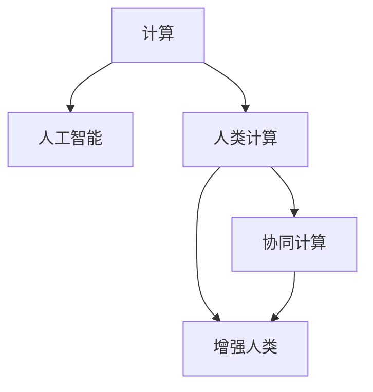

                 

# 人类计算：连接人与技术的纽带

## 1. 背景介绍

### 1.1 问题由来

随着信息技术的迅猛发展，人类社会的数字化进程不断加快，智能技术开始深入到生活的方方面面。从家庭、教育、医疗到交通、金融、制造等各个领域，智能化解决方案日益普及。然而，这些智能系统在带来便利的同时，也引发了一些思考：

- **技术与人的关系**：智能化是否能够真正理解和满足人的需求？
- **技术与人的协同**：人类如何与技术形成良性互动？
- **技术的可理解性**：智能技术能否被人类所理解和掌控？

这些问题的答案，将决定智能技术是否能够真正为人类社会带来福祉。基于此，本文将从“人类计算”这一概念出发，探讨技术与人的连接机制，研究人类如何通过计算技术实现自我价值，从而构建人与技术的新型关系。

### 1.2 问题核心关键点

“人类计算”是指人类利用计算机技术，实现对信息的组织、处理和应用的过程。这一过程不仅涉及技术实现，更涉及对人的理解与尊重，以及人与技术之间的互动与协同。核心关键点包括：

- **技术与人的互动**：如何使计算机技术更好地服务于人的需求？
- **计算与人类认知的整合**：如何将计算技术与人类认知进行融合？
- **人类计算的价值**：人类计算在提升人类生活质量中的作用。
- **计算伦理与社会责任**：计算技术在应用过程中应遵循的伦理原则。

理解这些关键点，将有助于我们把握人类计算的本质，构建更加人性化、智能化的技术应用环境。

## 2. 核心概念与联系

### 2.1 核心概念概述

为更好地理解“人类计算”，我们首先需要明确一些关键概念：

- **计算**：指通过数学、逻辑、物理等方法，对信息进行量化、处理和分析的过程。
- **人工智能(AI)**：一种通过算法和计算实现智能化的技术，旨在使计算机系统能够模拟人类的认知和决策能力。
- **人类计算**：指人类利用计算技术，实现自我价值的过程。它不仅包括技术的运用，更强调人与技术之间的互动和协同。
- **协同计算**：指计算机技术与人类的合作过程，通过共同解决问题，实现技术与人类的双赢。
- **增强人类**：指通过计算技术，增强人类的能力，如提高认知、提升效率、优化决策等。

这些概念共同构成了人类计算的基本框架，帮助我们理解计算技术如何服务于人类，以及人类如何通过计算技术提升自我。

### 2.2 核心概念原理和架构的 Mermaid 流程图



这个流程图展示了计算、人工智能、人类计算、协同计算和增强人类之间的关系：

1. 计算是人工智能的基础。
2. 人类计算强调计算技术与人类的互动。
3. 协同计算是人机互动的具体实现。
4. 增强人类是计算技术应用的终极目标。

## 3. 核心算法原理 & 具体操作步骤

### 3.1 算法原理概述

人类计算的核心算法原理，可以从以下几个方面进行理解：

- **数据驱动的决策**：通过收集和分析大量数据，计算机可以辅助人类进行决策。
- **模型学习和优化**：利用机器学习算法，计算机可以学习人类行为和偏好，优化决策过程。
- **计算辅助认知**：通过增强现实(AR)、虚拟现实(VR)等技术，计算机可以扩展人类的认知边界。
- **协同问题求解**：通过人机交互，共同解决复杂问题，实现1+1>2的效果。
- **知识图谱和语义网**：构建知识图谱和语义网，使计算机能够理解和应用人类知识。

### 3.2 算法步骤详解

基于上述原理，人类计算的具体操作步骤可以分为以下几个步骤：

**Step 1: 数据收集与预处理**
- 收集相关的数据，包括结构化数据和非结构化数据，如文本、图像、视频等。
- 对数据进行清洗、去重、标准化等预处理操作，确保数据质量和一致性。

**Step 2: 模型选择与训练**
- 根据具体问题选择合适的机器学习算法或深度学习模型，如分类、聚类、回归、神经网络等。
- 使用预处理后的数据对模型进行训练，优化模型参数，提升模型性能。

**Step 3: 模型评估与优化**
- 使用测试集对模型进行评估，检查模型的准确率、召回率、F1值等指标。
- 根据评估结果对模型进行调优，如调整超参数、增加正则化等，提升模型效果。

**Step 4: 人机交互与反馈**
- 将训练好的模型嵌入到应用系统中，供人类使用。
- 通过人机交互界面，收集用户反馈，进一步优化模型和应用体验。

**Step 5: 结果应用与迭代**
- 根据用户反馈，不断迭代优化模型和应用。
- 将优化后的模型应用于实际问题解决，提升用户体验和问题解决效率。

### 3.3 算法优缺点

人类计算作为一种新兴技术，具有以下优点：

1. **高效性**：计算机处理数据的速度远超人类，能够快速处理大量信息，提高工作效率。
2. **准确性**：计算机可以避免人为错误，提升决策的准确性和可靠性。
3. **可扩展性**：计算机技术可以轻松扩展应用范围，满足不同领域的需求。

同时，人类计算也存在一些局限性：

1. **依赖数据质量**：计算结果的准确性高度依赖于数据的质量和完整性，数据偏差可能导致计算错误。
2. **缺乏情感理解**：计算机难以理解和处理人类的情感和主观判断，限制了计算在情感类问题的应用。
3. **技术壁垒**：计算技术的开发和应用需要较高的专业技能，普通人难以掌握和应用。
4. **伦理和隐私问题**：计算技术在收集和处理数据时，可能侵犯隐私和伦理规范。

理解这些优缺点，有助于我们更好地利用人类计算，避免其潜在风险。

### 3.4 算法应用领域

人类计算的应用领域广泛，涵盖了从医疗、教育、金融到交通、制造等多个领域。以下是几个典型应用场景：

- **医疗**：通过分析医疗数据，辅助医生进行疾病诊断和治疗方案选择。
- **教育**：利用个性化学习系统，根据学生的学习习惯和能力，提供定制化教学方案。
- **金融**：通过大数据分析和预测模型，帮助投资者做出更明智的投资决策。
- **交通**：通过实时交通数据分析，优化交通流量，减少交通拥堵。
- **制造**：通过智能制造系统，提高生产效率，降低生产成本。

这些应用场景展示了人类计算在不同领域中的强大潜力和广泛应用。

## 4. 数学模型和公式 & 详细讲解 & 举例说明

### 4.1 数学模型构建

人类计算的数学模型构建，通常包括以下几个步骤：

1. **问题建模**：将实际问题抽象为数学模型，确定输入变量和输出变量。
2. **数据准备**：收集和预处理数据，准备模型训练和评估所需的数据集。
3. **模型设计**：选择和设计合适的模型结构，如线性回归、决策树、神经网络等。
4. **模型训练**：使用训练集对模型进行训练，优化模型参数。
5. **模型评估**：使用测试集对模型进行评估，检查模型性能。
6. **模型应用**：将优化后的模型应用于实际问题解决，提升用户体验和问题解决效率。

### 4.2 公式推导过程

以线性回归为例，推导人类计算的数学模型。

假设我们有一组数据点 $(x_i, y_i)$，其中 $x_i$ 为输入变量，$y_i$ 为输出变量，$i=1,2,...,N$。我们的目标是找到一条直线 $y=w_0+w_1x$，使得所有数据点尽可能接近这条直线。根据最小二乘法，我们可以求解出 $w_0$ 和 $w_1$：

$$
\min_{w_0, w_1} \sum_{i=1}^N (y_i - w_0 - w_1x_i)^2
$$

使用矩阵形式表示为：

$$
\min_{w_0, w_1} \frac{1}{2} ||Xw - y||^2_2
$$

其中 $X=[x_1, x_2,...,x_N]$，$w=[w_0, w_1]^T$，$y=[y_1, y_2,...,y_N]^T$。

通过求导并令导数为0，可以解得：

$$
w = (X^TX)^{-1}X^Ty
$$

这就是线性回归模型的参数求解公式。

### 4.3 案例分析与讲解

以医疗诊断为例，分析人类计算的应用。

假设我们有大量病人的医疗数据，包括年龄、性别、病史、体检指标等，目标是预测病人是否患有某种疾病。我们可以构建一个分类模型，如逻辑回归或神经网络，使用医疗数据进行训练，得到一个预测模型。

在实际应用中，将病人的新数据输入模型，模型可以输出该病人患病的概率。医生根据模型输出，结合专业知识，作出诊断决策。

## 5. 项目实践：代码实例和详细解释说明

### 5.1 开发环境搭建

要进行人类计算项目开发，首先需要搭建开发环境。以下是使用Python和TensorFlow进行开发的典型流程：

1. 安装Python和相关库，如numpy、pandas、scikit-learn、TensorFlow等。
2. 使用Anaconda或Miniconda创建虚拟环境。
3. 安装所需的GPU驱动和CUDA库，如NVIDIA的cuDNN和cuBLAS库。
4. 安装TensorFlow及其相关组件，如TensorBoard、tf.data等。
5. 配置好环境后，使用Jupyter Notebook或PyCharm等IDE进行开发。

### 5.2 源代码详细实现

以医疗诊断为例，使用TensorFlow实现逻辑回归模型：

```python
import tensorflow as tf
import numpy as np

# 准备数据
X = np.array([[1, 2], [2, 3], [3, 4]])
y = np.array([0, 1, 0])

# 构建模型
model = tf.keras.models.Sequential([
    tf.keras.layers.Dense(1, activation='sigmoid')
])

# 编译模型
model.compile(optimizer='adam', loss='binary_crossentropy', metrics=['accuracy'])

# 训练模型
model.fit(X, y, epochs=50, batch_size=2, verbose=0)

# 评估模型
loss, accuracy = model.evaluate(X, y)
print('Loss:', loss)
print('Accuracy:', accuracy)
```

以上代码展示了使用TensorFlow构建和训练逻辑回归模型的基本流程。

### 5.3 代码解读与分析

**X和y**：
- `X`为输入特征矩阵，每一行表示一个样本，每一列表示一个特征。
- `y`为输出标签向量，每一元素表示样本的标签。

**模型构建**：
- `Sequential`模型是TensorFlow中的线性模型，通过`Dense`层实现全连接神经网络。
- `sigmoid`激活函数将输出映射到0-1之间，适合二分类问题。

**模型编译**：
- `adam`优化器是TensorFlow常用的优化算法。
- `binary_crossentropy`损失函数适合二分类问题。
- `accuracy`指标用于评估模型分类准确率。

**模型训练**：
- `fit`方法用于训练模型，`epochs`和`batch_size`参数分别表示训练轮数和批大小。
- `verbose=0`表示训练过程中不输出日志。

**模型评估**：
- `evaluate`方法用于评估模型，输出损失和准确率。

## 6. 实际应用场景

### 6.1 医疗诊断

医疗诊断是人类计算的重要应用场景之一。通过分析病人的各项指标，模型可以辅助医生进行疾病诊断。

以癌症诊断为例，假设我们有大量病人的癌症数据，包括病理学指标、影像学指标、基因表达谱等。使用这些数据对模型进行训练，可以得到一个癌症诊断模型。

在实际应用中，将新病人的数据输入模型，模型可以输出该病人患有癌症的概率。医生根据模型输出，结合专业知识，作出诊断决策。

### 6.2 金融风控

金融风控是人类计算的另一重要应用场景。通过分析历史交易数据，模型可以预测客户是否存在信用风险。

以信用卡风控为例，假设我们有大量信用卡交易数据，包括交易金额、时间、地点等。使用这些数据对模型进行训练，可以得到一个信用风险预测模型。

在实际应用中，将新客户的交易数据输入模型，模型可以输出该客户存在信用风险的概率。金融机构根据模型输出，决定是否批准信用卡申请。

### 6.3 智能推荐

智能推荐是人类计算的重要应用之一。通过分析用户的行为数据，模型可以推荐用户可能感兴趣的商品或内容。

以电商推荐为例，假设我们有大量用户的历史购物数据，包括浏览记录、购买记录等。使用这些数据对模型进行训练，可以得到一个商品推荐模型。

在实际应用中，将新用户的浏览数据输入模型，模型可以推荐该用户可能感兴趣的商品。电商平台根据模型输出，向用户推荐商品。

## 7. 工具和资源推荐

### 7.1 学习资源推荐

为了更好地掌握人类计算的知识，这里推荐一些优质的学习资源：

1. **《Deep Learning》（《深度学习》）**：由Ian Goodfellow等人合著的经典教材，全面介绍了深度学习的基本概念和算法。
2. **《Pattern Recognition and Machine Learning》（《模式识别与机器学习》）**：由Christopher Bishop合著的入门级教材，介绍了机器学习的核心算法和应用。
3. **Coursera上的《Machine Learning》课程**：由Andrew Ng主讲，系统讲解了机器学习的基本概念和算法，适合初学者学习。
4. **Kaggle竞赛**：Kaggle是一个数据科学竞赛平台，通过参与竞赛，可以获得实战经验，提升技能。
5. **GitHub上的开源项目**：GitHub上有大量开源项目，可以学习其他开发者在实际应用中如何解决具体问题，积累经验。

### 7.2 开发工具推荐

高效的开发离不开优秀的工具支持。以下是几款用于人类计算开发的常用工具：

1. **Python**：Python是一种高级编程语言，拥有丰富的库和框架，适合进行数据处理、机器学习等任务。
2. **TensorFlow**：由Google开发的深度学习框架，支持GPU加速，适合大规模模型训练。
3. **PyTorch**：由Facebook开发的深度学习框架，支持动态计算图，适合研究和实验。
4. **Jupyter Notebook**：一种交互式开发环境，可以实时展示代码运行结果，适合进行数据分析和模型训练。
5. **Git**：一种版本控制系统，方便团队协作和代码管理。

### 7.3 相关论文推荐

人类计算的研究源于学界的持续探索。以下是几篇奠基性的相关论文，推荐阅读：

1. **《Pattern Recognition and Machine Learning》**：Christopher Bishop合著，介绍了模式识别和机器学习的基本概念和算法。
2. **《Deep Learning》**：Ian Goodfellow等人合著，全面介绍了深度学习的基本概念和算法。
3. **《Human-Centered Computational Modeling for Complex Health Systems》**：探讨了如何利用计算技术处理复杂健康系统问题。
4. **《The Human Computer Interfaces Handbook》**：探讨了人机交互界面的理论和技术，适合设计人性化的计算系统。

## 8. 总结：未来发展趋势与挑战

### 8.1 研究成果总结

人类计算作为一种新兴技术，已经展现出强大的应用潜力。它在医疗、金融、电商等多个领域得到了广泛应用，提升了决策的准确性和效率。未来，人类计算将进一步发展，逐步实现计算与人类认知的深度整合，推动智能化技术在更多领域的应用。

### 8.2 未来发展趋势

展望未来，人类计算将呈现以下几个发展趋势：

1. **计算与人类认知的深度整合**：计算技术将更加紧密地与人类的认知能力结合，实现更高效、更人性化的应用。
2. **多模态计算的兴起**：计算技术将不仅限于数据处理和算法优化，还将结合语音、视觉等多种模态信息，实现更全面、更智能的计算。
3. **计算伦理和社会责任**：计算技术在应用过程中，将更加注重伦理和社会责任，确保技术的公平性和安全性。
4. **计算与人类协作**：计算技术将更加强调人与技术的协同，通过共同解决问题，实现更好的效果。

### 8.3 面临的挑战

尽管人类计算带来了诸多便利，但在应用过程中也面临一些挑战：

1. **数据隐私和安全**：计算技术在收集和处理数据时，可能侵犯隐私和伦理规范，需要采取有效的数据保护措施。
2. **计算与人类认知的差异**：计算技术与人类认知存在本质差异，如何在计算系统中融入人类主观判断和情感，仍然是一个难题。
3. **计算技术的可理解性**：计算系统的决策过程难以解释，缺乏可理解性，可能导致用户信任度低。
4. **计算技术的普及性**：计算技术的专业性强，需要高水平的开发和维护，难以普及到普通用户。

### 8.4 研究展望

为了应对上述挑战，未来的研究需要在以下几个方面进行深入探索：

1. **数据隐私保护**：通过加密、匿名化等技术，保护用户隐私，确保数据安全。
2. **计算与人类认知的融合**：将计算技术与人类主观判断和情感相结合，实现更智能、更人性化的计算。
3. **计算系统的可解释性**：通过逻辑推理、因果分析等技术，增强计算系统的可解释性，提高用户信任度。
4. **计算技术的普及**：开发简单易用的计算工具和平台，降低计算技术的门槛，普及到更多用户。

## 9. 附录：常见问题与解答

**Q1：人类计算与传统计算有何区别？**

A: 人类计算强调计算技术与人类的互动和协同，不仅仅是数据处理和算法优化。传统计算往往忽视人类因素，缺乏人机交互和协同设计。

**Q2：人类计算能否实现真正的智能化？**

A: 人类计算通过计算技术提升人类的能力，但真正的智能化需要更广泛的智能范式和技术手段。人类计算只是其中的一个环节，不能完全替代人类智能。

**Q3：人类计算的应用前景如何？**

A: 人类计算在医疗、金融、电商等多个领域展现出强大的应用潜力，未来还将拓展到更多领域。计算技术与人类协作，将带来更多创新和机会。

**Q4：计算伦理和社会责任如何保障？**

A: 计算伦理和社会责任的保障需要多方面的努力，包括法律法规、技术手段、社会监督等。只有在各方共同努力下，才能确保计算技术的公平和安全。

**Q5：未来人类计算的发展方向是什么？**

A: 未来人类计算将更加注重计算与人类认知的深度整合，实现多模态计算，保障计算伦理和社会责任，开发更易用的计算工具。

---

作者：禅与计算机程序设计艺术 / Zen and the Art of Computer Programming

