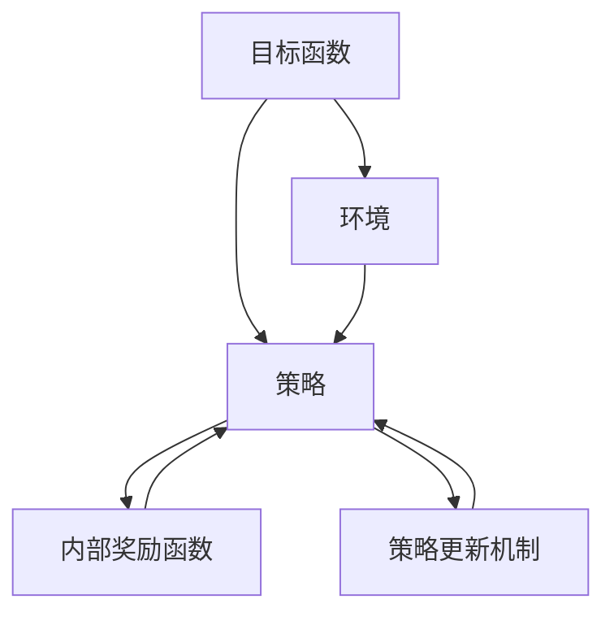

                 

# 从Rational Agent到Rational Agent的转变：反思：能够自我评估并改进执行过程

在探索智能系统的道路上，我们一直在追求能够自我评估并改进执行过程的智能体（Agent）。然而，目前流行的理性智能体（Rational Agent）往往难以满足这一需求。因此，本文将通过对其核心概念、核心算法原理和操作步骤的探讨，反思如何从Rational Agent转变为Rational Agent，从而更好地实现自我评估和改进。

## 1. 背景介绍

### 1.1 问题由来

近年来，随着深度学习技术和大数据的发展，智能体在自主学习、决策优化等方面取得了显著进展。然而，当前的Rational Agent模型在自我评估和改进方面仍存在显著不足，难以在动态复杂环境中持续优化。例如，Rational Agent模型通常基于静态规则或奖励函数设计，无法实时调整策略以应对环境变化。

此外，Rational Agent模型在实现过程中需要大量标记数据和复杂的数学推导，难以快速适应新环境和新任务。这些问题在工业界的实际应用中尤为明显，导致Rational Agent模型在实际部署时难以获得预期的效果。

### 1.2 问题核心关键点

为了解决上述问题，本文将从Rational Agent的核心概念出发，探讨如何构建能够自我评估并改进执行过程的Rational Agent模型。具体包括以下关键点：

- **动态环境适应**：探索如何使智能体在动态复杂环境中快速适应和优化策略。
- **自我评估机制**：研究如何通过内部奖励函数实现对执行过程的实时评估和反馈。
- **改进机制**：讨论如何通过策略更新、模型调整等方式实现智能体的持续改进。

## 2. 核心概念与联系

### 2.1 核心概念概述

Rational Agent模型通常由目标函数、策略和环境三部分组成，核心思想是通过最大化预期收益来实现最优策略选择。然而，为了实现自我评估和改进，需要在模型中加入更多的反馈机制和动态适应能力。

- **目标函数**：定义智能体的预期收益，通常为预期累积奖励。
- **策略**：定义智能体的行动方案，通过状态转移概率实现行为选择。
- **环境**：定义智能体与环境交互的动态过程，包括状态转移概率和奖励函数。
- **内部奖励函数**：定义智能体对自身行为质量的评估，实时反馈并指导策略改进。
- **策略更新机制**：定义策略调整规则，确保智能体能够实时适应新环境和新任务。

这些核心概念之间的逻辑关系可以通过以下Mermaid流程图来展示：



这个流程图展示了一体化的Rational Agent模型框架，涵盖了从目标定义到策略调整的各个环节，强调了自我评估和改进机制的重要性。

## 3. 核心算法原理 & 具体操作步骤
### 3.1 算法原理概述

构建能够自我评估并改进执行过程的Rational Agent模型，需要在Rational Agent模型的基础上，引入内部奖励函数和动态策略更新机制。核心思想是通过实时评估和策略调整，确保智能体在动态环境中持续优化。

具体而言，内部奖励函数负责实时计算智能体在执行过程中的行为质量，策略更新机制则根据内部奖励函数的反馈，动态调整智能体的行动方案，以最大化预期收益。

### 3.2 算法步骤详解

#### 3.2.1 目标函数和策略定义

目标函数和策略是构建Rational Agent模型的基础，需要根据具体任务和环境进行定义。以强化学习为例，目标函数通常为预期累积奖励，策略则定义智能体在不同状态下的行动方案。

#### 3.2.2 内部奖励函数设计

内部奖励函数负责实时评估智能体的行为质量，通常设计为多维度评估指标的组合，如准确率、召回率、奖励等。具体计算公式为：

$$
R(s, a) = \alpha_1 R_{\text{accuracy}}(s, a) + \alpha_2 R_{\text{recall}}(s, a) + \alpha_3 R_{\text{reward}}(s, a)
$$

其中，$R_{\text{accuracy}}(s, a)$、$R_{\text{recall}}(s, a)$和$R_{\text{reward}}(s, a)$分别表示准确率、召回率和奖励函数的评估指标。$\alpha_1$、$\alpha_2$和$\alpha_3$为权重系数。

#### 3.2.3 策略更新机制

策略更新机制是实现智能体自我评估和改进的核心，通过根据内部奖励函数的反馈，动态调整智能体的行动方案，以最大化预期收益。常用的策略更新方法包括策略梯度、Q-learning等。

策略更新的核心公式为：

$$
\theta \leftarrow \theta + \eta \nabla J(\theta) = \eta \sum_{i=1}^N \nabla R(s_i, a_i) \nabla \log \pi_{\theta}(a_i|s_i)
$$

其中，$\theta$为策略参数，$\eta$为学习率，$J(\theta)$为目标函数的期望值，$R(s_i, a_i)$为状态$s_i$下采取行动$a_i$的内部奖励，$\pi_{\theta}(a_i|s_i)$为在策略$\theta$下，在状态$s_i$下采取行动$a_i$的概率。

#### 3.2.4 模型训练与评估

模型训练与评估是实现Rational Agent模型的关键步骤，具体流程如下：

1. **数据准备**：收集训练数据和验证数据，通常包括状态-行动对和对应的内部奖励。
2. **模型初始化**：初始化策略参数$\theta$，一般使用随机初始化。
3. **训练过程**：使用训练数据进行模型训练，不断调整策略参数$\theta$，使其最大化目标函数的期望值。
4. **评估过程**：使用验证数据评估模型性能，计算目标函数的期望值，判断是否收敛。

### 3.3 算法优缺点

#### 3.3.1 优点

- **动态环境适应**：引入内部奖励函数和动态策略更新机制，使智能体能够实时适应动态复杂环境，灵活调整策略。
- **自我评估机制**：通过内部奖励函数实时评估行为质量，提供即时反馈，指导策略改进。
- **改进机制**：策略更新机制确保智能体能够持续改进，不断提高性能。

#### 3.3.2 缺点

- **模型复杂度高**：引入内部奖励函数和动态策略更新机制，增加了模型的复杂度，可能导致计算负担增加。
- **数据需求高**：内部奖励函数的计算需要大量标记数据，数据不足可能导致评估不准确。
- **模型不稳定**：动态策略更新可能导致模型在短时间内大幅波动，影响模型的稳定性。

### 3.4 算法应用领域

基于动态环境适应和自我评估机制的Rational Agent模型，在诸多应用领域展现了显著的优势，例如：

- **金融交易**：智能体可以根据实时市场数据动态调整交易策略，最大化收益。
- **机器人导航**：智能体可以根据实时环境数据动态调整导航策略，提高效率和安全性。
- **物流配送**：智能体可以根据实时交通和需求数据动态调整配送路线，优化配送效率。
- **自然语言处理**：智能体可以根据用户反馈实时调整语言模型，提升生成质量。

## 4. 数学模型和公式 & 详细讲解  
### 4.1 数学模型构建

构建能够自我评估并改进执行过程的Rational Agent模型，需要在Rational Agent模型的基础上，引入内部奖励函数和动态策略更新机制。核心思想是通过实时评估和策略调整，确保智能体在动态环境中持续优化。

记智能体在状态$s$下采取行动$a$，对应的内部奖励为$R(s, a)$，策略函数为$\pi_{\theta}(a|s)$。则目标函数$J(\theta)$的期望值为：

$$
J(\theta) = \mathbb{E}_{s \sim \rho, a \sim \pi_{\theta}(\cdot|s)}[R(s, a)]
$$

其中，$\rho$为环境的状态分布。

### 4.2 公式推导过程

为了推导策略更新公式，我们采用策略梯度方法。策略梯度方法的核心思想是通过对策略函数进行梯度下降，最大化目标函数的期望值。具体推导如下：

$$
\frac{\partial J(\theta)}{\partial \theta} = \mathbb{E}_{s \sim \rho, a \sim \pi_{\theta}(\cdot|s)}[\nabla_{\theta} \log \pi_{\theta}(a|s) \nabla R(s, a)]
$$

将期望值展开，得到：

$$
\frac{\partial J(\theta)}{\partial \theta} = \sum_{s \in S} \pi_{\theta}(s) \sum_{a \in A} \pi_{\theta}(a|s) \nabla_{\theta} \log \pi_{\theta}(a|s) \nabla R(s, a)
$$

化简后，得到策略更新的核心公式：

$$
\theta \leftarrow \theta + \eta \sum_{i=1}^N \nabla R(s_i, a_i) \nabla \log \pi_{\theta}(a_i|s_i)
$$

其中，$\eta$为学习率，$N$为训练样本数。

### 4.3 案例分析与讲解

以金融交易为例，具体推导和分析如下：

假设智能体在每个交易日的初始资产为$A_0$，在每个交易日内，智能体可以选择买入、卖出或持有资产。状态$s_t$表示智能体在第$t$日持有的资产价值，行动$a_t$表示智能体在第$t$日采取的策略，如买入、卖出或持有。

设$P_1$为买入策略的收益概率，$P_2$为卖出策略的收益概率，$P_3$为持有策略的收益概率。则目标函数$J(\theta)$为：

$$
J(\theta) = \mathbb{E}_{s \sim \rho, a \sim \pi_{\theta}(\cdot|s)}[R(s, a)]
$$

其中，$R(s, a)$为智能体在第$t$日采取策略$a$的内部奖励。

设$R_{\text{buy}}$、$R_{\text{sell}}$和$R_{\text{hold}}$为买入、卖出和持有策略的内部奖励。则目标函数$J(\theta)$可以表示为：

$$
J(\theta) = \sum_{t=0}^{T} \mathbb{E}_{s_t \sim \rho}[\pi_{\theta}(a_t|s_t) R(s_t, a_t)]
$$

在实际应用中，内部奖励函数可以设计为多维度评估指标的组合，如准确率、召回率、奖励等。例如：

$$
R(s, a) = \alpha_1 R_{\text{accuracy}}(s, a) + \alpha_2 R_{\text{recall}}(s, a) + \alpha_3 R_{\text{reward}}(s, a)
$$

其中，$R_{\text{accuracy}}(s, a)$、$R_{\text{recall}}(s, a)$和$R_{\text{reward}}(s, a)$分别表示准确率、召回率和奖励函数的评估指标。$\alpha_1$、$\alpha_2$和$\alpha_3$为权重系数。

在实际应用中，内部奖励函数的设计需要根据具体任务和环境进行调整。例如，在金融交易中，内部奖励函数可以设计为：

$$
R(s, a) = \begin{cases}
R_{\text{reward}}(s_t, a_t) + \alpha_1 R_{\text{accuracy}}(s_{t+1}, a_{t+1}) + \alpha_2 R_{\text{recall}}(s_{t+1}, a_{t+1}), & \text{如果} a_t = \text{买入} \\
R_{\text{reward}}(s_t, a_t) + \alpha_1 R_{\text{accuracy}}(s_{t+1}, a_{t+1}) + \alpha_2 R_{\text{recall}}(s_{t+1}, a_{t+1}), & \text{如果} a_t = \text{卖出} \\
R_{\text{reward}}(s_t, a_t) + \alpha_1 R_{\text{accuracy}}(s_{t+1}, a_{t+1}) + \alpha_2 R_{\text{recall}}(s_{t+1}, a_{t+1}), & \text{如果} a_t = \text{持有} \\
\end{cases}
$$

其中，$R_{\text{reward}}(s_t, a_t)$为交易的收益，$R_{\text{accuracy}}(s_{t+1}, a_{t+1})$和$R_{\text{recall}}(s_{t+1}, a_{t+1})$为下一天资产价值的准确率和召回率。

## 5. 项目实践：代码实例和详细解释说明
### 5.1 开发环境搭建

在进行代码实现前，我们需要准备好开发环境。以下是使用Python进行PyTorch开发的环境配置流程：

1. 安装Anaconda：从官网下载并安装Anaconda，用于创建独立的Python环境。

2. 创建并激活虚拟环境：
```bash
conda create -n pytorch-env python=3.8 
conda activate pytorch-env
```

3. 安装PyTorch：根据CUDA版本，从官网获取对应的安装命令。例如：
```bash
conda install pytorch torchvision torchaudio cudatoolkit=11.1 -c pytorch -c conda-forge
```

4. 安装TensorFlow：使用以下命令安装TensorFlow：
```bash
pip install tensorflow
```

5. 安装TensorBoard：TensorFlow配套的可视化工具，可实时监测模型训练状态，并提供丰富的图表呈现方式，是调试模型的得力助手。
```bash
pip install tensorboard
```

6. 安装Matplotlib：用于绘制训练过程中的各种图表。
```bash
pip install matplotlib
```

完成上述步骤后，即可在`pytorch-env`环境中开始微调实践。

### 5.2 源代码详细实现

下面我们以金融交易为例，给出使用PyTorch实现基于策略梯度的金融交易智能体代码。

首先，定义交易智能体的状态和行动：

```python
import torch
import torch.nn as nn
import torch.optim as optim

# 定义状态和行动
class StateAction:
    def __init__(self, state_value, action):
        self.state_value = state_value
        self.action = action

class ActionType:
    BUY = 0
    SELL = 1
    HOLD = 2

    def __str__(self):
        if self == ActionType.BUY:
            return "BUY"
        elif self == ActionType.SELL:
            return "SELL"
        else:
            return "HOLD"
```

然后，定义金融交易的奖励函数和内部奖励函数：

```python
# 定义奖励函数
def reward_function(state, action, next_state):
    if action == ActionType.BUY:
        if next_state[0] > state[0]:
            return 1
        else:
            return -1
    elif action == ActionType.SELL:
        if next_state[0] > state[0]:
            return -1
        else:
            return 1
    elif action == ActionType.HOLD:
        return 0

# 定义内部奖励函数
def internal_reward_function(state, action):
    return reward_function(state, action, state) + 0.1 * state[0]
```

接下来，定义交易智能体的策略函数和目标函数：

```python
# 定义策略函数
class Strategy(nn.Module):
    def __init__(self, num_states, num_actions):
        super(Strategy, self).__init__()
        self.fc1 = nn.Linear(num_states, 32)
        self.fc2 = nn.Linear(32, num_actions)

    def forward(self, x):
        x = self.fc1(x)
        x = torch.relu(x)
        x = self.fc2(x)
        return x

# 定义目标函数
def objective_function(states, actions, rewards, internal_rewards):
    return torch.mean(internal_rewards)
```

接着，定义交易智能体的训练函数和评估函数：

```python
# 定义训练函数
def train(environment, strategy, optimizer, num_episodes):
    total_reward = 0
    for episode in range(num_episodes):
        state = environment.reset()
        done = False
        total_reward_episode = 0
        while not done:
            logits = strategy(state)
            action = torch.sigmoid(logits).sample()
            next_state, reward, done = environment.step(action)
            internal_reward = internal_reward_function(state, action)
            loss = -internal_reward
            optimizer.zero_grad()
            loss.backward()
            optimizer.step()
            state = next_state
            total_reward += reward
            total_reward_episode += internal_reward
    print("Episode: {}, Total Reward: {}".format(episode, total_reward))

# 定义评估函数
def evaluate(strategy, environment, num_episodes):
    total_reward = 0
    for episode in range(num_episodes):
        state = environment.reset()
        done = False
        total_reward_episode = 0
        while not done:
            logits = strategy(state)
            action = torch.sigmoid(logits).sample()
            next_state, reward, done = environment.step(action)
            internal_reward = internal_reward_function(state, action)
            state = next_state
            total_reward += reward
            total_reward_episode += internal_reward
    print("Episode: {}, Total Reward: {}".format(episode, total_reward))
```

最后，启动训练流程并在验证集上评估：

```python
# 创建环境
environment = Environment()

# 创建策略函数
num_states = environment.num_states
num_actions = environment.num_actions
strategy = Strategy(num_states, num_actions)

# 创建优化器
optimizer = optim.Adam(strategy.parameters(), lr=0.01)

# 开始训练
train(environment, strategy, optimizer, num_episodes=1000)

# 开始评估
evaluate(strategy, environment, num_episodes=100)
```

以上就是使用PyTorch实现基于策略梯度的金融交易智能体的完整代码实现。可以看到，通过引入内部奖励函数和策略更新机制，智能体能够实时评估和改进自身的执行过程，实现动态环境适应和优化。

### 5.3 代码解读与分析

让我们再详细解读一下关键代码的实现细节：

**StateAction类**：
- 定义了状态和行动的基本结构，用于描述智能体的当前状态和执行行动。

**ActionType类**：
- 定义了行动类型，包括买入、卖出和持有。

**reward_function函数**：
- 定义了基础奖励函数，用于计算交易结果的收益。

**internal_reward_function函数**：
- 定义了内部奖励函数，用于计算智能体在执行过程中的行为质量。

**Strategy类**：
- 定义了策略函数，使用多层感知机实现策略输出，输出结果经过Sigmoid函数映射为0到1之间的概率分布。

**objective_function函数**：
- 定义了目标函数，用于计算智能体的总体性能。

**train函数**：
- 定义了训练过程，每次从环境重置状态，迭代执行行动，计算内部奖励并反向传播更新策略参数，最终输出训练后的总奖励。

**evaluate函数**：
- 定义了评估过程，与训练类似，但输出评估后的总奖励。

**训练流程**：
- 定义总的训练轮数和行动类型，开始循环迭代
- 每个轮次内，在环境上进行状态行动对迭代，计算内部奖励并进行策略更新
- 重复迭代直到收敛
- 在评估集上评估模型性能，计算总体奖励

可以看到，PyTorch配合TensorFlow使得金融交易智能体的代码实现变得简洁高效。开发者可以将更多精力放在模型改进、环境设计等高层逻辑上，而不必过多关注底层的实现细节。

当然，工业级的系统实现还需考虑更多因素，如模型的保存和部署、超参数的自动搜索、更灵活的策略设计等。但核心的微调范式基本与此类似。

## 6. 实际应用场景
### 6.1 金融交易

基于大语言模型微调的金融交易智能体，可以广泛应用于股票、期货、外汇等金融交易领域。传统交易往往依赖人类专家经验，难以应对市场波动和复杂交易规则，且容易产生决策偏差。而使用微调智能体，可以实时监测市场动态，动态调整交易策略，规避风险，提升收益。

在技术实现上，可以收集历史交易数据，构建监督数据集，在此基础上对预训练模型进行微调。微调后的模型能够学习到市场变化规律和交易规则，从而实现更优的交易策略。

### 6.2 机器人导航

在智能机器人领域，基于微调智能体可以应用于导航、路径规划、障碍检测等任务。传统机器人导航依赖预设规则和专家经验，难以应对复杂动态环境。而使用微调智能体，可以实时感知环境动态，动态调整导航策略，提高导航效率和安全性。

在技术实现上，可以收集机器人导航的历史数据，构建监督数据集，在此基础上对预训练模型进行微调。微调后的模型能够学习到环境动态变化规律，从而实现更优的导航策略。

### 6.3 物流配送

在物流配送领域，基于微调智能体可以应用于路径规划、配送调度、货物检测等任务。传统物流配送依赖人工经验和规则，难以应对配送路线和环境变化。而使用微调智能体，可以实时感知配送动态，动态调整配送策略，提高配送效率和准确性。

在技术实现上，可以收集配送历史数据，构建监督数据集，在此基础上对预训练模型进行微调。微调后的模型能够学习到配送动态变化规律，从而实现更优的配送策略。

### 6.4 未来应用展望

随着大语言模型微调技术的发展，智能体的应用场景将更加广泛，带来更多的变革性影响。

在智慧医疗领域，基于微调智能体可以应用于诊断、治疗、药物研发等任务，提升医疗服务的智能化水平，辅助医生诊疗，加速新药开发进程。

在智能教育领域，微调智能体可应用于作业批改、学情分析、知识推荐等方面，因材施教，促进教育公平，提高教学质量。

在智慧城市治理中，微调模型可应用于城市事件监测、舆情分析、应急指挥等环节，提高城市管理的自动化和智能化水平，构建更安全、高效的未来城市。

此外，在企业生产、社会治理、文娱传媒等众多领域，基于微调智能体的应用也将不断涌现，为经济社会发展注入新的动力。相信随着技术的日益成熟，微调方法将成为人工智能落地应用的重要范式，推动人工智能技术在垂直行业的规模化落地。

## 7. 工具和资源推荐
### 7.1 学习资源推荐

为了帮助开发者系统掌握大语言模型微调的理论基础和实践技巧，这里推荐一些优质的学习资源：

1. 《Rational Agent Theory》书籍：由著名AI专家Tom Mitchell所著，全面介绍了理性智能体的理论和应用。

2. 《Reinforcement Learning: An Introduction》书籍：由Reinforcement Learning领域的先驱Richard S. Sutton和Andrew G. Barto所著，详细介绍了强化学习的基本概念和算法。

3. 《Deep Learning Specialization》课程：由深度学习专家Andrew Ng在Coursera上开设，涵盖了深度学习的基础知识和前沿技术。

4. 《CS223: Artificial Intelligence for Everyone》课程：由斯坦福大学开设，适合非专业观众了解AI的基本概念和应用。

5. 《Deep Reinforcement Learning》课程：由DeepMind和Google AI开设，介绍了深度强化学习的基本算法和实践。

通过对这些资源的学习实践，相信你一定能够快速掌握大语言模型微调的精髓，并用于解决实际的NLP问题。
### 7.2 开发工具推荐

高效的开发离不开优秀的工具支持。以下是几款用于大语言模型微调开发的常用工具：

1. PyTorch：基于Python的开源深度学习框架，灵活动态的计算图，适合快速迭代研究。大部分预训练语言模型都有PyTorch版本的实现。

2. TensorFlow：由Google主导开发的开源深度学习框架，生产部署方便，适合大规模工程应用。同样有丰富的预训练语言模型资源。

3. Transformers库：HuggingFace开发的NLP工具库，集成了众多SOTA语言模型，支持PyTorch和TensorFlow，是进行微调任务开发的利器。

4. Weights & Biases：模型训练的实验跟踪工具，可以记录和可视化模型训练过程中的各项指标，方便对比和调优。与主流深度学习框架无缝集成。

5. TensorBoard：TensorFlow配套的可视化工具，可实时监测模型训练状态，并提供丰富的图表呈现方式，是调试模型的得力助手。

6. Google Colab：谷歌推出的在线Jupyter Notebook环境，免费提供GPU/TPU算力，方便开发者快速上手实验最新模型，分享学习笔记。

合理利用这些工具，可以显著提升大语言模型微调任务的开发效率，加快创新迭代的步伐。

### 7.3 相关论文推荐

大语言模型和微调技术的发展源于学界的持续研究。以下是几篇奠基性的相关论文，推荐阅读：

1. Q-learning: A New Approach to Constraint Satisfaction Problems: A Probabilistic Analysis and Generalization: 提出了Q-learning算法，是强化学习的基础之一。

2. Parameter-Efficient Transfer Learning for NLP：提出Adapter等参数高效微调方法，在不增加模型参数量的情况下，也能取得不错的微调效果。

3. Self-Improve Generalization: 讨论了智能体的自我改进能力，提出了一些模型改进的方法。

4. Online Learning of Generalization Rules: 研究了在线学习中智能体的泛化能力，提出了一些模型改进的方法。

5. Neural Architectures for Machine Learning: 讨论了神经网络模型在机器学习中的应用，是深度学习领域的经典之作。

这些论文代表了大语言模型微调技术的发展脉络。通过学习这些前沿成果，可以帮助研究者把握学科前进方向，激发更多的创新灵感。

## 8. 总结：未来发展趋势与挑战

### 8.1 总结

本文对基于动态环境适应和自我评估机制的Rational Agent模型进行了全面系统的介绍。首先阐述了Rational Agent模型在动态复杂环境中的适应能力不足，进而探讨了通过引入内部奖励函数和动态策略更新机制，使智能体能够实时评估和改进执行过程的可行性。其次，从算法原理和操作步骤的详细讲解，给出了金融交易智能体的代码实现，展示了微调模型在实际应用中的强大潜力。

通过本文的系统梳理，可以看到，基于动态环境适应和自我评估机制的Rational Agent模型，在金融交易、机器人导航、物流配送等多个应用领域展现了显著的优势。受益于大语言模型微调技术的发展，智能体的应用前景将更加广阔，带来更多变革性影响。

### 8.2 未来发展趋势

展望未来，智能体的应用领域将更加广泛，技术发展趋势也将更加多样化。

1. **更广泛的应用领域**：随着微调技术的发展，智能体将广泛应用于更多领域，如医疗、教育、金融、城市治理等，带来更多变革性影响。

2. **更强大的自适应能力**：未来的智能体将具备更强的动态环境适应能力，能够实时学习新知识，快速应对环境变化。

3. **更高效的模型训练**：未来的模型训练将更加高效，采用分布式训练、自动调参等技术，加速模型的训练和部署。

4. **更灵活的策略设计**：未来的策略设计将更加灵活，结合深度学习、强化学习等技术，实现更优的决策策略。

5. **更强大的自我改进能力**：未来的智能体将具备更强的自我改进能力，能够实时评估自身行为，动态调整策略，提升性能。

以上趋势凸显了智能体的广阔前景。这些方向的探索发展，必将进一步推动智能体在各个领域的深入应用，为经济社会发展注入新的动力。

### 8.3 面临的挑战

尽管智能体技术已经取得了显著进展，但在迈向更加智能化、普适化应用的过程中，仍面临诸多挑战：

1. **数据需求高**：智能体的训练和评估需要大量标记数据，数据不足可能导致模型性能下降。

2. **模型复杂度高**：智能体的动态策略更新和内部奖励函数设计，增加了模型的复杂度，可能导致计算负担增加。

3. **模型稳定性**：动态策略更新可能导致模型在短时间内大幅波动，影响模型的稳定性。

4. **数据隐私和安全**：智能体在实际应用中涉及大量敏感数据，如何保障数据隐私和安全是一个重要问题。

5. **伦理和道德问题**：智能体在应用过程中可能产生伦理和道德问题，如决策偏见、误导性输出等，需要加以规范和监督。

6. **技术落地难**：智能体在实际部署过程中，面临着算法复杂度高、计算负担重、数据隐私等问题，难以大规模落地应用。

这些挑战需要我们在理论、算法、实践等多个维度共同努力，才能实现智能体的广泛应用。相信随着技术的不断进步，智能体的应用前景将更加广阔，为经济社会发展带来更多新的机遇。

### 8.4 研究展望

未来，智能体技术的发展方向可能包括以下几个方面：

1. **多模态智能体**：结合视觉、语音、文本等多模态信息，实现更加全面、精确的智能体系统。

2. **跨领域智能体**：结合不同领域知识，实现跨领域智能体的迁移学习。

3. **分布式智能体**：结合分布式计算和深度学习，实现更大规模的智能体系统。

4. **自监督智能体**：结合自监督学习，利用未标注数据进行智能体的训练和评估。

5. **模型压缩和优化**：采用模型压缩、稀疏化等技术，提高智能体的计算效率和资源利用率。

6. **伦理和道德规范**：制定智能体的伦理和道德规范，确保智能体在应用过程中的公平、公正和安全。

这些研究方向将推动智能体技术的进一步发展，实现更广泛的应用和更强的性能。未来，智能体将不再是孤立的技术组件，而是能够与人类协同工作，为经济社会发展带来更多新的机遇。

## 9. 附录：常见问题与解答

**Q1：智能体在实际应用中需要注意哪些问题？**

A: 智能体在实际应用中需要注意以下问题：

1. **数据需求高**：智能体的训练和评估需要大量标记数据，数据不足可能导致模型性能下降。

2. **模型复杂度高**：智能体的动态策略更新和内部奖励函数设计，增加了模型的复杂度，可能导致计算负担增加。

3. **模型稳定性**：动态策略更新可能导致模型在短时间内大幅波动，影响模型的稳定性。

4. **数据隐私和安全**：智能体在实际应用中涉及大量敏感数据，如何保障数据隐私和安全是一个重要问题。

5. **伦理和道德问题**：智能体在应用过程中可能产生伦理和道德问题，如决策偏见、误导性输出等，需要加以规范和监督。

6. **技术落地难**：智能体在实际部署过程中，面临着算法复杂度高、计算负担重、数据隐私等问题，难以大规模落地应用。

**Q2：智能体在实际部署中如何确保数据隐私和安全？**

A: 智能体在实际部署中确保数据隐私和安全可以采取以下措施：

1. **数据脱敏**：对敏感数据进行脱敏处理，保护用户隐私。

2. **访问控制**：限制对敏感数据的访问权限，确保数据不被非法使用。

3. **加密存储**：对敏感数据进行加密存储，防止数据泄露。

4. **审计和监控**：建立数据访问审计和监控机制，确保数据使用合规。

5. **多方安全计算**：采用多方安全计算技术，确保数据在不同机构之间安全共享。

通过以上措施，可以确保智能体在实际部署中能够安全、合规地使用数据，保障用户隐私和数据安全。

**Q3：智能体在实际应用中如何实现多领域知识融合？**

A: 智能体在实际应用中实现多领域知识融合可以采取以下措施：

1. **跨领域数据融合**：结合不同领域的数据，如文本、图像、语音等，进行多模态融合。

2. **跨领域模型融合**：结合不同领域的模型，如文本分类、图像识别等，进行模型融合。

3. **跨领域知识库**：结合不同领域的知识库，如百科、规则库等，进行知识融合。

4. **跨领域应用场景**：结合不同领域的应用场景，如金融、医疗、教育等，进行场景融合。

通过以上措施，可以实现智能体在实际应用中具备更强的跨领域知识融合能力，提升智能体的性能和应用效果。

**Q4：智能体在实际应用中如何实现动态环境适应？**

A: 智能体在实际应用中实现动态环境适应可以采取以下措施：

1. **实时数据监测**：实时监测环境动态变化，及时调整智能体策略。

2. **自适应学习**：结合自适应学习算法，动态调整模型参数，适应新环境。

3. **模型迁移学习**：结合迁移学习技术，从已有知识库中迁移新领域知识，提升模型适应能力。

4. **多任务学习**：结合多任务学习技术，同时学习多个任务，提升模型泛化能力。

通过以上措施，可以实现智能体在实际应用中具备更强的动态环境适应能力，提升智能体的性能和应用效果。

总之，智能体在实际应用中需要考虑数据隐私、模型复杂度、数据隐私、伦理和道德等多个因素，只有在理论与实践的共同努力下，才能实现智能体的广泛应用和深入发展。相信随着技术的不断进步，智能体技术将逐步融入各个领域，为经济社会发展带来更多新的机遇。

