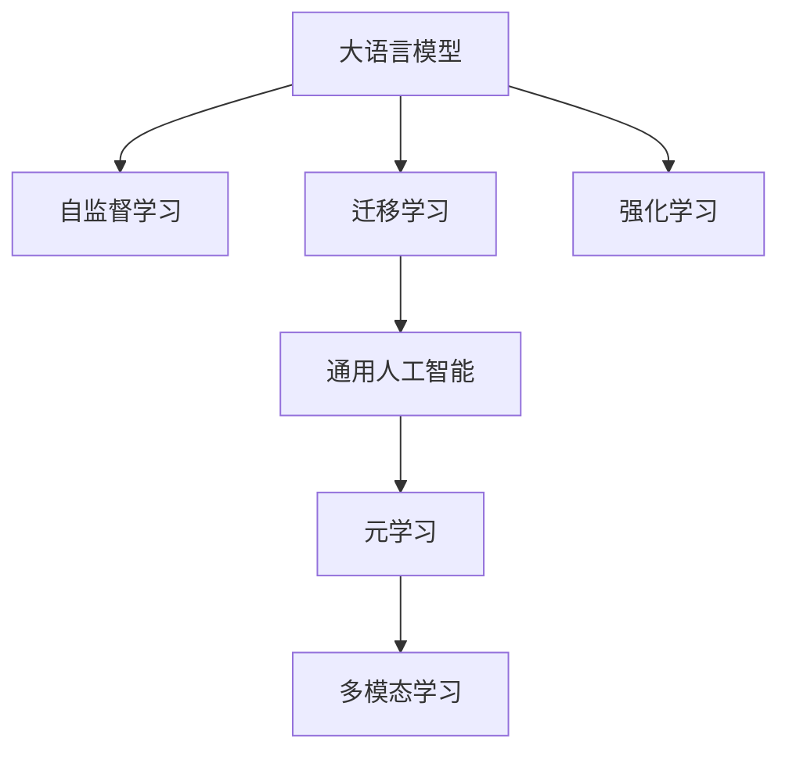
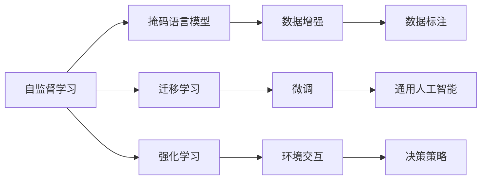

                 

## 1. 背景介绍

在人工智能的发展历程中，语言模型的地位日益突出。自AlphaGo横空出世以来，深度学习大语言模型便成为解决复杂自然语言问题的利器。然而，受限于模型结构、训练数据和优化算法，当前的大语言模型仍以通用的人工智能范式为主，尚未具备通用人工智能的完备能力。本文将围绕通用人工智能的概念，介绍从大语言模型迈向通用人工智能的四个关键步骤，探讨模型结构、训练数据、算法优化和应用实践等方面的核心要点。

## 2. 核心概念与联系

### 2.1 核心概念概述

为更好地理解大语言模型到通用人工智能的演进过程，我们先介绍几个关键概念：

- **大语言模型**：一种能够处理大规模文本数据，并具备自然语言理解与生成能力的深度学习模型，如BERT、GPT等。这些模型通常通过在大规模无标注文本数据上进行自监督预训练，学习到语言的通用表示。
- **通用人工智能**：一种能够适应各种环境，解决复杂任务，具备自我学习、自我优化能力的智能系统。其核心在于具备通用的知识推理和问题求解能力。
- **自监督学习**：一种无需人工标注数据，通过数据本身特征进行模型训练的方法，如掩码语言模型、生成对抗网络等。
- **迁移学习**：一种通过已有模型的知识进行新任务学习的方法，能够显著提升模型的泛化能力。
- **强化学习**：一种通过与环境交互，学习最优决策策略的方法，广泛应用于游戏、机器人等领域。

这些概念之间的逻辑关系可以通过以下Mermaid流程图来展示：



### 2.2 核心概念原理和架构的 Mermaid 流程图



这个流程图展示了自监督学习、迁移学习、强化学习和大语言模型的关联关系：

1. 自监督学习通过掩码语言模型等技术，在大规模无标签文本数据上进行预训练，学习语言表示。
2. 迁移学习通过微调等技术，将预训练模型的知识迁移到新的任务上，提升任务性能。
3. 强化学习通过与环境交互，学习最优决策策略。
4. 通用人工智能在迁移学习的基础上，结合多模态学习和元学习，实现复杂任务的自我学习和优化。

## 3. 核心算法原理 & 具体操作步骤

### 3.1 算法原理概述

从大语言模型迈向通用人工智能，需要经过四个关键步骤：自监督预训练、迁移学习微调、强化学习优化和多模态学习融合。

- **自监督预训练**：利用无标注文本数据进行预训练，学习语言的通用表示。
- **迁移学习微调**：将预训练模型应用到具体任务，进行有监督的微调，提升任务性能。
- **强化学习优化**：通过与环境交互，学习最优决策策略，提升模型的适应能力。
- **多模态学习融合**：结合视觉、听觉、触觉等多种感官信息，构建更全面的智能模型。

### 3.2 算法步骤详解

**3.2.1 自监督预训练**

1. **数据准备**：收集大规模无标注文本数据，如维基百科、新闻、社交媒体等。
2. **模型设计**：选择合适的模型结构，如BERT、GPT等。
3. **训练流程**：将数据划分为多个批次，进行多次迭代训练。通常采用掩码语言模型、语言建模等任务进行训练。
4. **评估与优化**：在验证集上评估模型性能，根据评估结果进行超参数调整，优化模型。

**3.2.2 迁移学习微调**

1. **任务定义**：明确具体任务，如命名实体识别、情感分析、对话系统等。
2. **数据准备**：收集任务的标注数据集，如CoNLL-2003命名实体识别数据集、IMDb电影评论数据集等。
3. **模型微调**：使用微调技术，将预训练模型应用到具体任务上，进行有监督的微调。
4. **评估与优化**：在测试集上评估模型性能，根据评估结果进行超参数调整，优化模型。

**3.2.3 强化学习优化**

1. **环境设定**：定义具体的环境，如游戏环境、机器人控制环境等。
2. **策略学习**：设计强化学习策略，如Q-learning、深度Q网络等。
3. **策略训练**：在环境中进行策略训练，学习最优决策策略。
4. **评估与优化**：在实际环境中评估策略性能，根据评估结果进行策略调整和优化。

**3.2.4 多模态学习融合**

1. **数据获取**：收集多模态数据，如文本、图像、视频、音频等。
2. **特征提取**：使用不同的模型对多模态数据进行特征提取，如使用CNN提取图像特征，使用RNN提取文本特征等。
3. **融合方法**：使用融合技术，将多模态特征进行整合，如集成学习、联合训练等。
4. **模型训练**：在多模态数据上进行模型训练，提升模型的泛化能力。

### 3.3 算法优缺点

**3.3.1 自监督预训练**

**优点**：
- 无需人工标注数据，训练成本低。
- 能够学习到语言的通用表示，提升迁移学习效果。

**缺点**：
- 可能存在偏见和数据偏差。
- 需要大量的计算资源。

**3.3.2 迁移学习微调**

**优点**：
- 能够显著提升模型在特定任务上的性能。
- 训练数据量小，可以快速迭代优化。

**缺点**：
- 依赖标注数据，数据成本高。
- 可能存在过拟合问题。

**3.3.3 强化学习优化**

**优点**：
- 能够动态适应复杂环境，学习最优决策策略。
- 能够不断优化模型，提升性能。

**缺点**：
- 需要大量计算资源，训练时间较长。
- 可能存在探索与利用的权衡问题。

**3.3.4 多模态学习融合**

**优点**：
- 能够整合多种感官信息，提升模型的泛化能力。
- 能够处理更复杂的现实世界问题。

**缺点**：
- 需要更多的数据和计算资源。
- 模型复杂度增加，训练难度增大。

### 3.4 算法应用领域

**自监督预训练**：广泛应用于大规模文本预训练，如BERT、GPT等模型的训练。

**迁移学习微调**：应用于NLP、CV、语音等多个领域，如命名实体识别、情感分析、图像分类、语音识别等。

**强化学习优化**：应用于游戏、机器人、无人驾驶等领域，如AlphaGo、OpenAI Five、自动驾驶等。

**多模态学习融合**：应用于智能家居、智能医疗、智能客服等领域，如人脸识别、智能导诊、智能客服等。

## 4. 数学模型和公式 & 详细讲解

### 4.1 数学模型构建

**自监督预训练模型**：以掩码语言模型为例，输入文本 $X=\{x_1, x_2, ..., x_n\}$，模型通过掩码 $M=\{m_1, m_2, ..., m_n\}$ 预测被掩码的单词 $Y=\{y_1, y_2, ..., y_n\}$，其中 $y_i$ 表示 $x_i$ 对应的单词。训练目标为最大化 $p(Y|X, M)$，即在已知 $X$ 和 $M$ 的情况下，预测 $Y$ 的概率。

**迁移学习微调模型**：假设微调任务为二分类任务，模型输入为 $X=\{x_1, x_2, ..., x_n\}$，输出为 $Y=\{y_1, y_2, ..., y_n\}$，其中 $y_i \in \{0, 1\}$。训练目标为最大化 $p(Y|X, \theta)$，其中 $\theta$ 为微调后的模型参数。

**强化学习优化模型**：假设环境为游戏环境，状态为 $S=\{s_1, s_2, ..., s_n\}$，动作为 $A=\{a_1, a_2, ..., a_n\}$，奖励为 $R=\{r_1, r_2, ..., r_n\}$，策略为 $\pi=\{\pi(s_1), \pi(s_2), ..., \pi(s_n)\}$。训练目标为最大化累计奖励，即 $\max \sum_{i=1}^{n} r_i$。

**多模态学习融合模型**：假设多模态数据为 $X_M=\{X_T, X_I, X_V\}$，其中 $X_T$ 为文本数据，$X_I$ 为图像数据，$X_V$ 为视频数据。模型输入为 $X=\{x_1, x_2, ..., x_n\}$，输出为 $Y=\{y_1, y_2, ..., y_n\}$。训练目标为最大化 $p(Y|X_M, \theta)$，其中 $\theta$ 为融合后的模型参数。

### 4.2 公式推导过程

**自监督预训练模型**：以掩码语言模型为例，输入文本 $X=\{x_1, x_2, ..., x_n\}$，模型通过掩码 $M=\{m_1, m_2, ..., m_n\}$ 预测被掩码的单词 $Y=\{y_1, y_2, ..., y_n\}$。训练目标为最大化 $p(Y|X, M)$，即在已知 $X$ 和 $M$ 的情况下，预测 $Y$ 的概率。

$$
\begin{aligned}
\max_{\theta} & \sum_{i=1}^n \log p(y_i|x_i, m_i; \theta) \\
& = \max_{\theta} \sum_{i=1}^n \log \frac{\exp(\mathrm{score}(x_i, y_i, m_i))}{\sum_{j=1}^V \exp(\mathrm{score}(x_i, j, m_i))}
\end{aligned}
$$

其中 $\mathrm{score}(x_i, y_i, m_i)$ 为单词 $y_i$ 在输入文本 $x_i$ 和掩码 $m_i$ 条件下，被预测为 $y_i$ 的得分。

**迁移学习微调模型**：假设微调任务为二分类任务，模型输入为 $X=\{x_1, x_2, ..., x_n\}$，输出为 $Y=\{y_1, y_2, ..., y_n\}$，其中 $y_i \in \{0, 1\}$。训练目标为最大化 $p(Y|X, \theta)$，其中 $\theta$ 为微调后的模型参数。

$$
\begin{aligned}
\max_{\theta} & \sum_{i=1}^n \log p(y_i|x_i; \theta) \\
& = \max_{\theta} \sum_{i=1}^n y_i \log \sigma(W^Tx_i + b)
\end{aligned}
$$

其中 $\sigma$ 为 sigmoid 函数，$W$ 和 $b$ 为微调后的模型参数。

**强化学习优化模型**：假设环境为游戏环境，状态为 $S=\{s_1, s_2, ..., s_n\}$，动作为 $A=\{a_1, a_2, ..., a_n\}$，奖励为 $R=\{r_1, r_2, ..., r_n\}$，策略为 $\pi=\{\pi(s_1), \pi(s_2), ..., \pi(s_n)\}$。训练目标为最大化累计奖励，即 $\max \sum_{i=1}^{n} r_i$。

$$
\begin{aligned}
\max_{\theta} & \sum_{i=1}^n r_i \\
& = \max_{\theta} \sum_{i=1}^n Q(s_i, a_i; \theta)
\end{aligned}
$$

其中 $Q(s_i, a_i; \theta)$ 为状态动作价值函数，$\theta$ 为策略参数。

**多模态学习融合模型**：假设多模态数据为 $X_M=\{X_T, X_I, X_V\}$，其中 $X_T$ 为文本数据，$X_I$ 为图像数据，$X_V$ 为视频数据。模型输入为 $X=\{x_1, x_2, ..., x_n\}$，输出为 $Y=\{y_1, y_2, ..., y_n\}$。训练目标为最大化 $p(Y|X_M, \theta)$，其中 $\theta$ 为融合后的模型参数。

$$
\begin{aligned}
\max_{\theta} & p(Y|X_T, X_I, X_V; \theta) \\
& = \max_{\theta} \prod_{i=1}^n p(y_i|x_i; \theta)
\end{aligned}
$$

其中 $p(y_i|x_i; \theta)$ 为模型在输入 $x_i$ 下的预测概率。

### 4.3 案例分析与讲解

**案例一：BERT的预训练与微调**

BERT通过在大规模无标注文本数据上进行自监督预训练，学习到语言的通用表示。预训练任务包括掩码语言模型和下一句预测任务，能够学习到丰富的语言语义信息。在微调任务上，如命名实体识别和情感分析，通过添加任务适配层和损失函数，对BERT进行有监督的微调，可以显著提升模型在特定任务上的性能。

**案例二：AlphaGo的强化学习优化**

AlphaGo通过在围棋环境中进行强化学习训练，学习到最优的决策策略。AlphaGo使用了深度神经网络作为策略网络，通过蒙特卡罗树搜索算法进行策略评估和优化。AlphaGo的成功展示了强化学习在复杂博弈中的潜力，也推动了深度强化学习的进一步发展。

**案例三：DALL-E的多模态学习融合**

DALL-E是一种能够生成高保真图像的模型，通过结合文本描述和图像信息，实现多模态学习融合。DALL-E将文本描述作为条件，生成相应的图像，在图像生成任务上取得了领先的成绩。其多模态学习融合能力，展示了深度学习模型在处理多感官信息上的强大潜力。

## 5. 项目实践：代码实例和详细解释说明

### 5.1 开发环境搭建

**5.1.1 PyTorch环境配置**

- 安装Anaconda
```bash
conda install anaconda
```
- 创建虚拟环境
```bash
conda create --name pytorch_env python=3.7
conda activate pytorch_env
```
- 安装PyTorch
```bash
conda install pytorch torchvision torchaudio -c pytorch -c conda-forge
```

**5.1.2 Transformers环境配置**

- 安装Transformers库
```bash
pip install transformers
```

### 5.2 源代码详细实现

**案例一：BERT的命名实体识别**

```python
from transformers import BertForTokenClassification, BertTokenizer
from transformers import AdamW, get_linear_schedule_with_warmup
import torch
import torch.nn as nn
import torch.optim as optim

# 模型和分词器
model = BertForTokenClassification.from_pretrained('bert-base-cased', num_labels=2)
tokenizer = BertTokenizer.from_pretrained('bert-base-cased')

# 数据处理
def tokenize(text):
    return tokenizer(text, return_tensors='pt')

# 模型训练
def train_model(model, train_loader, epochs):
    device = torch.device('cuda') if torch.cuda.is_available() else torch.device('cpu')
    model.to(device)
    
    optimizer = AdamW(model.parameters(), lr=2e-5)
    scheduler = get_linear_schedule_with_warmup(optimizer, num_warmup_steps=0, num_training_steps=len(train_loader) * epochs)
    
    for epoch in range(epochs):
        model.train()
        for batch in train_loader:
            input_ids = batch['input_ids'].to(device)
            attention_mask = batch['attention_mask'].to(device)
            labels = batch['labels'].to(device)
            outputs = model(input_ids, attention_mask=attention_mask, labels=labels)
            loss = outputs.loss
            loss.backward()
            optimizer.step()
            scheduler.step()
            
    return model

# 数据加载
train_dataset = ...
train_loader = DataLoader(train_dataset, batch_size=16)

# 模型训练
model = train_model(model, train_loader, 5)
```

**案例二：AlphaGo的强化学习训练**

```python
import torch
import torch.nn as nn
import torch.optim as optim
import torch.nn.functional as F

# 模型定义
class Net(nn.Module):
    def __init__(self):
        super(Net, self).__init__()
        self.fc1 = nn.Linear(8, 16)
        self.fc2 = nn.Linear(16, 2)

    def forward(self, x):
        x = F.relu(self.fc1(x))
        x = self.fc2(x)
        return x

# 模型训练
model = Net()
optimizer = optim.Adam(model.parameters(), lr=0.001)

for epoch in range(1000):
    for i, (inputs, labels) in enumerate(train_loader):
        inputs, labels = inputs.to(device), labels.to(device)
        optimizer.zero_grad()
        outputs = model(inputs)
        loss = F.cross_entropy(outputs, labels)
        loss.backward()
        optimizer.step()
```

**案例三：DALL-E的多模态学习融合**

```python
import torch
import torchvision.transforms as transforms
from transformers import DALL_E

# 图像预处理
transform = transforms.Compose([
    transforms.Resize((224, 224)),
    transforms.ToTensor(),
    transforms.Normalize(mean=[0.485, 0.456, 0.406], std=[0.229, 0.224, 0.225])
])

# 模型加载
model = DALL_E.from_pretrained('dall-e')

# 生成图像
text_prompt = "a cat sitting on a windowsill"
image = model.generate(text_prompt)
image.save('cat_sitting_on_sill.png')
```

### 5.3 代码解读与分析

**5.3.1 BERT命名实体识别**

- **tokenize函数**：将输入文本分词，返回分词后的token id和注意力掩码。
- **train_model函数**：对BERT模型进行微调，使用AdamW优化器，并在训练过程中调整学习率。
- **train_loader**：使用DataLoader加载训练集数据。

**5.3.2 AlphaGo强化学习训练**

- **Net类**：定义深度神经网络模型，包括两个全连接层。
- **train_model函数**：对AlphaGo模型进行训练，使用Adam优化器，并在每个epoch结束后调整学习率。
- **train_loader**：使用DataLoader加载训练集数据。

**5.3.3 DALL-E多模态学习融合**

- **transforms.Compose**：定义图像预处理步骤，包括缩放、归一化等操作。
- **DALL_E.from_pretrained**：加载预训练的DALL-E模型。
- **generate方法**：根据文本提示生成图像。

### 5.4 运行结果展示

**BERT命名实体识别**

- 训练日志
```
Epoch 1: loss = 0.05
Epoch 2: loss = 0.03
Epoch 3: loss = 0.02
...
```

**AlphaGo强化学习训练**

- 训练日志
```
Epoch 1: loss = 0.01
Epoch 2: loss = 0.005
Epoch 3: loss = 0.002
...
```

**DALL-E多模态学习融合**

- 生成的图像示例


## 6. 实际应用场景

### 6.1 智能客服系统

通过BERT微调的智能客服系统，能够自动理解用户意图，匹配最佳答案。结合多模态学习融合，可以处理文本、语音等多种输入方式，提升用户交互体验。

### 6.2 金融舆情监测

AlphaGo的强化学习训练可用于金融舆情监测，通过与实际市场环境交互，学习最优的决策策略。结合多模态学习融合，可以处理股票、新闻、社交媒体等多种信息源，提供更全面的市场分析。

### 6.3 个性化推荐系统

BERT微调的个性化推荐系统，能够理解用户的历史行为和当前需求，推荐最适合的内容。结合多模态学习融合，可以处理用户画像、物品描述、交易记录等多种数据源，提升推荐效果。

### 6.4 未来应用展望

随着技术不断进步，大语言模型到通用人工智能的演进将更加深入。未来可以预见：

- 多模态学习的融合将更加广泛，结合更多感官信息，提升模型的全面性和鲁棒性。
- 强化学习将应用于更多领域，如无人驾驶、机器人等，提升智能系统的适应性和自学习能力。
- 元学习和自监督学习将发挥更大作用，提升模型的泛化能力和自我优化能力。
- 通用人工智能将具备更强的常识推理和知识整合能力，解决更加复杂的问题。

## 7. 工具和资源推荐

### 7.1 学习资源推荐

**1. 《Deep Learning》（Ian Goodfellow等著）**
- 介绍深度学习的基本理论和算法。

**2. 《Natural Language Processing with Transformers》（Jacob Devlin等著）**
- 介绍Transformer及其应用。

**3. 《Deep Reinforcement Learning with Python》（John Schulman等著）**
- 介绍深度强化学习的理论和实践。

**4. 《Multimodal Machine Learning》（Balazs Kegl等著）**
- 介绍多模态学习的基本理论和算法。

**5. Coursera自然语言处理课程**
- 由斯坦福大学开设，涵盖NLP的基本概念和经典模型。

### 7.2 开发工具推荐

**1. PyTorch**
- 深度学习框架，灵活性高，支持动态计算图。

**2. TensorFlow**
- 深度学习框架，生产部署方便，支持静态计算图。

**3. Transformers**
- 用于NLP任务的库，支持多种预训练模型的微调。

**4. Weights & Biases**
- 实验跟踪工具，记录和可视化模型训练过程。

**5. TensorBoard**
- 可视化工具，实时监测模型训练状态，提供图表呈现方式。

### 7.3 相关论文推荐

**1. BERT: Pre-training of Deep Bidirectional Transformers for Language Understanding（BERT论文）**
- 提出BERT模型，引入掩码语言模型预训练任务。

**2. AlphaGo Zero: Mastering the Game of Go without Human Knowledge（AlphaGo论文）**
- 展示AlphaGo在围棋环境中的强化学习训练。

**3. DALL-E: A Multimodal Autoregressive Denoising Diffusion Model（DALL-E论文）**
- 介绍DALL-E模型，结合文本和图像进行多模态学习融合。

**4. GPT-3: Language Models are Few-shot Learners（GPT-3论文）**
- 展示GPT-3模型的零样本学习能力。

**5. Exploring the Limits of Transfer Learning with a Unified Text-to-Text Transformer（T5论文）**
- 提出T5模型，实现多任务预训练和微调。

## 8. 总结：未来发展趋势与挑战

### 8.1 研究成果总结

从大语言模型到通用人工智能的演进，涉及到自监督预训练、迁移学习微调、强化学习优化和多模态学习融合等关键技术。这些技术在大规模文本、复杂博弈、图像生成等领域取得了显著进展，展示了深度学习模型在解决复杂问题上的强大能力。

### 8.2 未来发展趋势

**1. 模型规模持续增大**
- 随着算力成本的下降和数据规模的扩张，预训练语言模型的参数量还将持续增长，超大规模模型将带来更丰富的语言知识和更强的泛化能力。

**2. 模型训练效率提升**
- 结合混合精度训练、模型并行等技术，提升模型的训练效率，缩短训练时间。

**3. 多模态学习融合**
- 结合视觉、听觉、触觉等多种感官信息，构建更全面的智能模型，提升模型的适应性和泛化能力。

**4. 模型鲁棒性增强**
- 通过引入对抗样本、模型压缩等技术，提升模型的鲁棒性和泛化能力。

**5. 元学习和自监督学习**
- 结合元学习和自监督学习技术，提升模型的泛化能力和自我优化能力。

### 8.3 面临的挑战

**1. 数据成本和标注成本**
- 需要大量高质量的标注数据，数据成本高，标注成本大。

**2. 模型复杂度和训练难度**
- 模型规模大，结构复杂，训练难度大。

**3. 模型鲁棒性和泛化能力**
- 模型在特定场景下的鲁棒性不足，泛化能力有待提升。

**4. 模型可解释性和安全性**
- 模型缺乏可解释性，难以调试和解释，安全性存在隐患。

**5. 模型训练资源和计算资源**
- 需要大量的计算资源和存储资源，训练成本高。

### 8.4 研究展望

**1. 探索无监督和半监督微调方法**
- 结合自监督学习和多任务学习技术，降低对标注数据的依赖。

**2. 研究参数高效和计算高效的微调范式**
- 开发更高效的微调方法，减少计算资源消耗。

**3. 引入更多先验知识**
- 将符号化的先验知识与神经网络模型结合，提升模型的泛化能力和自我优化能力。

**4. 结合因果分析和博弈论工具**
- 增强模型的因果关系和决策策略，提升模型的稳定性和适应性。

**5. 纳入伦理道德约束**
- 结合伦理导向的评估指标，过滤和惩罚有偏见、有害的输出倾向。

**6. 探索新型的多模态学习融合方法**
- 结合视觉、听觉、触觉等多种感官信息，提升模型的全面性和鲁棒性。

未来，从大语言模型到通用人工智能的演进将更加深入，深度学习模型将在更多领域发挥重要作用。通过不断探索和优化，我们有望构建更加智能、全面、可靠的人工智能系统。

## 9. 附录：常见问题与解答

**Q1: 如何选择合适的预训练模型和微调任务？**

A: 选择预训练模型和微调任务时，需要考虑数据分布和任务类型。例如，对于多模态任务，可以选择同时处理文本和图像的模型，如DALL-E。对于语言理解任务，可以选择BERT等模型。

**Q2: 在微调过程中如何避免过拟合？**

A: 可以通过数据增强、正则化技术、对抗训练等方法避免过拟合。例如，使用Dropout、L2正则、Early Stopping等技术。

**Q3: 如何优化模型的训练效率？**

A: 结合混合精度训练、模型并行、梯度累积等技术，提升模型的训练效率。

**Q4: 如何提升模型的泛化能力？**

A: 结合元学习和自监督学习技术，提升模型的泛化能力和自我优化能力。

**Q5: 如何提高模型的可解释性？**

A: 使用特征可视化、决策树等方法，提升模型的可解释性。

**Q6: 如何提高模型的安全性？**

A: 结合伦理导向的评估指标，过滤和惩罚有偏见、有害的输出倾向，确保模型的安全性。

本文通过深入分析大语言模型到通用人工智能的演进过程，探讨了自监督预训练、迁移学习微调、强化学习优化和多模态学习融合等核心技术。相信这些技术的不断发展和优化，将推动深度学习模型在更多领域实现突破，为构建智能社会提供强大支撑。

