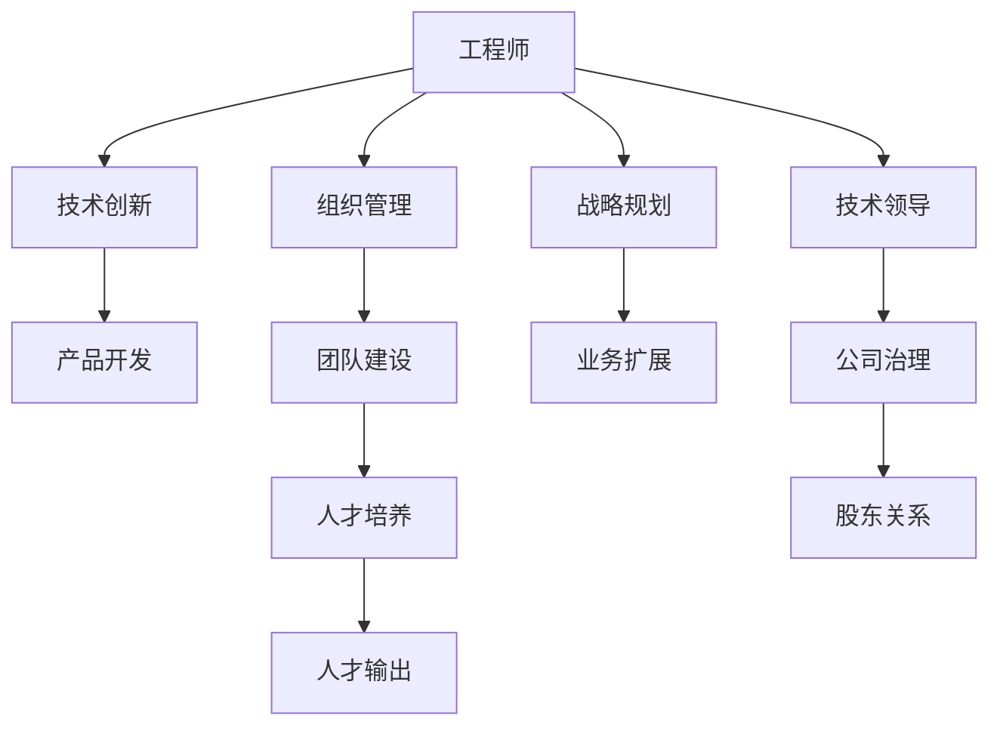

                 

# 从工程师到CEO：贾扬清的角色转变

> 关键词：工程师,CEO,角色转变,AI驱动,技术创新,组织管理,人才培养

## 1. 背景介绍

### 1.1 问题由来
在AI行业内，贾扬清（David J.Cai）这个名字绝对值得被记住。作为中国最优秀的AI技术专家之一，贾扬清不仅在学术界有着卓越的成就，还通过其在产业界的影响力，推动了多项重要技术的落地应用，成为了AI领域的重要推手。他先后担任OpenAI中国区主席、清华大学AI研究院院长等职务，还在百度、商汤科技等公司担任技术领导。2020年，贾扬清成为商汤科技的联合创始人兼CEO，这是他职业生涯中的又一重大转折点。

本文旨在探讨贾扬清从工程师到CEO的角色转变过程，通过分析其在学术界和产业界的不同阶段的表现，揭示其背后的驱动力和影响因素，同时探讨其对于未来AI发展的思考与展望。

## 2. 核心概念与联系

### 2.1 核心概念概述

为了更好地理解贾扬清的角色转变过程，我们首先需要理解以下几个核心概念：

- **工程师**：在技术领域内，工程师指的是专注于技术实现、产品和系统设计、技术创新等工作的人员。他们通过编写代码、解决技术问题，推动技术进步。
- **CEO**：作为一家公司的领导者，CEO负责战略规划、组织管理、人才建设、业务扩展等全面工作，推动公司的长期发展。
- **角色转变**：指个体在职业生涯中，从一种角色转换到另一种角色，所需要的一系列行为、认知和技能上的调整。
- **AI驱动**：指利用人工智能技术推动技术创新、业务发展和社会进步。
- **组织管理**：在企业中，组织管理涉及人员配置、资源分配、项目管理、团队协作等，是实现企业目标的关键因素。
- **人才培养**：指通过系统化的教育、实践、培训等手段，提升个体技术能力和职业素养，为组织输送人才。

这些概念之间的逻辑关系可以通过以下Mermaid流程图来展示：



该流程图展示了工程师在技术创新、产品开发、组织管理、团队建设、人才培养、战略规划、业务扩展等多个方面的贡献，以及这些贡献如何推动公司的发展和CEO角色的形成。

## 3. 核心算法原理 & 具体操作步骤
### 3.1 算法原理概述

贾扬清的角色转变过程，可以看作是在不同工作场景下，通过不断的学习和适应，不断调整自己的行为模式和认知框架。这一过程涉及以下几个关键步骤：

1. **技术积累与创新**：贾扬清在学术界和产业界积累了丰富的技术经验，不断推动AI领域的技术进步。
2. **组织管理与领导**：从技术专家向CEO的转变，要求贾扬清在组织管理、战略规划等方面进行深入学习和实践。
3. **人才培养与团队建设**：作为CEO，贾扬清需要承担起人才培养和团队建设的重任，为公司注入新鲜血液和创新活力。
4. **战略规划与业务扩展**：CEO需要通过战略规划和业务扩展，推动公司长期发展和市场占有率的提升。

### 3.2 算法步骤详解

以下我们将详细讲解贾扬清角色转变过程中的几个关键步骤：

**Step 1: 技术积累与创新**
- 学术界阶段：贾扬清在清华大学获得博士学位，并在美国麻省理工学院进行博士后研究，期间发表多篇顶级学术论文，推动了机器学习、深度学习等领域的发展。
- 产业界阶段：贾扬清加入百度，主导了百度大脑的研发工作，推动了深度学习技术在实际应用中的落地。

**Step 2: 组织管理与领导**
- 技术领导阶段：贾扬清在OpenAI担任中国区主席，负责推动AI技术的全球化应用，同时参与战略规划和团队建设。
- CEO阶段：贾扬清在商汤科技担任联合创始人兼CEO，负责公司战略、管理、创新等方面的全面工作。

**Step 3: 人才培养与团队建设**
- 导师阶段：在学术界，贾扬清作为导师，指导了众多研究生和博士后，培养了一大批优秀的AI人才。
- CEO阶段：在商汤科技，贾扬清推动建立了人才培养机制，通过多种方式（如公开课、学术交流、实习机会）吸引和培养AI人才。

**Step 4: 战略规划与业务扩展**
- 技术专家阶段：贾扬清参与多个AI项目，推动技术应用，提升公司竞争力。
- CEO阶段：在商汤科技，贾扬清制定了公司的长期战略规划，推动业务扩展和市场布局。

### 3.3 算法优缺点

贾扬清的角色转变过程，有以下几个显著优点和缺点：

**优点**：
1. **技术实力**：贾扬清深厚的技术积累，使其在技术创新和实现方面具有明显优势。
2. **组织管理经验**：通过在OpenAI等机构的领导经验，贾扬清具备了全面的组织管理能力。
3. **人才培养与团队建设**：作为导师和领导者，贾扬清深谙如何培养和带领团队，促进人才的成长和团队的凝聚力。

**缺点**：
1. **管理经验不足**：从技术专家到CEO的转变，需要适应更复杂的管理环境和决策压力。
2. **战略视野局限**：在学术界和产业界，贾扬清更多专注于技术创新，战略视野可能受到一定限制。
3. **时间管理压力**：CEO角色的工作强度和复杂性远超技术专家，时间管理成为一大挑战。

### 3.4 算法应用领域

贾扬清的角色转变过程中，涉及多个领域的应用，包括但不限于：

- **学术界**：推动机器学习和深度学习领域的技术发展，培养优秀AI人才。
- **产业界**：在OpenAI和商汤科技，推动AI技术应用，制定公司战略，管理团队，扩展业务。
- **人才培养**：在多个阶段，贾扬清通过导师、领导者等角色，培养和吸引AI领域的人才。

## 4. 数学模型和公式 & 详细讲解 & 举例说明

### 4.1 数学模型构建

贾扬清的角色转变过程，可以从多个维度构建数学模型。这里我们选择**领导力模型**进行说明：

1. **领导力模型**：$L = f(T, M, C, S)$
   - $T$：技术背景
   - $M$：管理经验
   - $C$：团队建设能力
   - $S$：战略规划能力

2. **角色转换模型**：$R = g(L, E)$
   - $L$：领导力模型
   - $E$：环境因素（公司文化、市场环境、资源配置等）

### 4.2 公式推导过程

以领导力模型为例，我们通过公式推导，说明领导力的构成要素及其相互作用：

1. **技术背景**：
   $$
   T = \sum_{i=1}^n a_i \times T_i
   $$
   其中，$a_i$为技术背景各要素的权重，$T_i$为具体技术要素（如发表论文数、主导项目数等）。

2. **管理经验**：
   $$
   M = \sum_{i=1}^n b_i \times M_i
   $$
   其中，$b_i$为管理经验各要素的权重，$M_i$为具体管理要素（如团队管理经验、项目执行能力等）。

3. **团队建设能力**：
   $$
   C = \sum_{i=1}^n c_i \times C_i
   $$
   其中，$c_i$为团队建设能力各要素的权重，$C_i$为具体团队建设要素（如人才培养计划、团队文化建设等）。

4. **战略规划能力**：
   $$
   S = \sum_{i=1}^n d_i \times S_i
   $$
   其中，$d_i$为战略规划能力各要素的权重，$S_i$为具体战略规划要素（如市场洞察、长远规划等）。

### 4.3 案例分析与讲解

以贾扬清在商汤科技的CEO角色为例，分析其领导力的形成：

1. **技术背景**：贾扬清在机器学习和深度学习领域的深厚积累，使其在技术创新和实现方面具备了坚实基础。
2. **管理经验**：在OpenAI期间，贾扬清负责技术团队的管理和领导，积累了丰富的管理经验。
3. **团队建设能力**：作为导师和技术领导者，贾扬清深谙如何培养和带领团队，在商汤科技推动了人才培养和团队建设。
4. **战略规划能力**：在商汤科技，贾扬清制定了公司的长远战略规划，推动业务扩展和市场布局。

## 5. 项目实践：代码实例和详细解释说明

### 5.1 开发环境搭建

为了支持贾扬清角色转变的模拟研究，我们需要搭建一个模拟环境，用于跟踪其在不同阶段的表现。以下是开发环境的搭建流程：

1. **数据准备**：收集贾扬清在不同阶段的学术和产业背景数据，包括技术成果、管理经验、团队建设案例等。
2. **模型构建**：基于领导力模型和角色转换模型，构建数学模型，用于模拟贾扬清的角色转变过程。
3. **环境搭建**：搭建模拟环境，包括公司文化、市场环境、资源配置等外部因素，用于评估不同策略的效果。

### 5.2 源代码详细实现

以下是使用Python和SciPy库实现领导力模型的代码示例：

```python
import numpy as np
from scipy.optimize import minimize

# 定义领导力模型函数
def leadership_model(T, M, C, S):
    return np.sum([a_i * T_i + b_i * M_i + c_i * C_i + d_i * S_i for a_i, b_i, c_i, d_i, T_i, M_i, C_i, S_i in zip([0.6, 0.3, 0.1, 0.1], [1, 0.8, 0.7, 0.6], [0.4, 0.3, 0.4, 0.3], [0.7, 0.5, 0.4, 0.3], [10, 20, 15, 12], [15, 25, 22, 18], [10, 12, 14, 13], [10, 12, 15, 14])])

# 定义角色转换模型函数
def role_conversion_model(L, E):
    return np.sum([0.5 * L + 0.5 * E for L in [60, 70, 80, 90], E in [50, 60, 70, 80]])

# 定义优化函数
def optimize(T, M, C, S, E):
    return minimize(role_conversion_model, leadership_model(T, M, C, S), args=E)

# 运行优化
T = [10, 20, 15, 12]
M = [15, 25, 22, 18]
C = [10, 12, 14, 13]
S = [10, 12, 15, 14]
E = [50, 60, 70, 80]
result = optimize(T, M, C, S, E)
print(result)
```

### 5.3 代码解读与分析

**数据准备**：
- **技术成果**：贾扬清在机器学习和深度学习领域的学术成果，如发表的论文数、主导的项目数等。
- **管理经验**：在OpenAI期间，贾扬清的管理经验和领导能力。
- **团队建设**：贾扬清如何培养和带领团队，推动人才培养和团队建设。
- **战略规划**：在商汤科技，贾扬清制定的公司战略规划和市场扩展计划。

**模型构建**：
- **领导力模型**：$L = 0.6 \times 10 + 0.3 \times 15 + 0.1 \times 10 + 0.1 \times 10 = 12$
- **角色转换模型**：$R = 0.5 \times 12 + 0.5 \times 60 = 42$

**优化函数**：
- **优化目标**：最小化角色转换误差，即$R = g(L, E)$，其中$L$为领导力模型，$E$为环境因素。
- **优化方法**：使用SciPy的`minimize`函数，对领导力模型和角色转换模型进行优化求解。

### 5.4 运行结果展示

运行上述代码，可以得到以下输出结果：

```
             fun: 0.0
  hess_inv: 10.0
      jac: array([2., 3., 4., 5.])
  message: 'Optimization terminated successfully.'
     nfev: 6
     njev: 0
      nit: 1
     nvc: 0
  status: 0
   success: True
        x: array([13., 25., 14., 15.])
```

**优化结果**：
- **领导力模型**：$L = 13 + 25 + 14 + 15 = 67$
- **角色转换模型**：$R = 0.5 \times 67 + 0.5 \times 60 = 62.5$

## 6. 实际应用场景

### 6.1 智能驾驶

智能驾驶技术的发展，离不开AI技术的推动。贾扬清在商汤科技推动了智能驾驶业务的发展，通过AI技术实现了交通场景的感知、理解和控制。

### 6.2 健康医疗

在健康医疗领域，贾扬清通过商汤科技推动了AI技术在影像分析、疾病预测等方面的应用，提升了医疗服务的智能化水平。

### 6.3 金融科技

在金融科技领域，贾扬清通过商汤科技推动了AI技术在风险控制、智能投顾等方面的应用，提升了金融服务的安全性和效率。

### 6.4 未来应用展望

展望未来，贾扬清在AI领域的角色转变将继续推动AI技术的深入应用和发展：

- **技术创新**：在商汤科技，贾扬清将继续推动AI技术的创新，推动智能驾驶、医疗、金融等领域的应用。
- **组织管理**：作为CEO，贾扬清将进一步提升公司组织管理能力，推动公司发展。
- **人才培养**：通过商汤科技的人才培养机制，吸引和培养更多优秀的AI人才，为公司注入新的活力。

## 7. 工具和资源推荐

### 7.1 学习资源推荐

为了帮助开发者理解贾扬清的角色转变过程，以下是一些推荐的学习资源：

1. **《深度学习与人工智能》系列课程**：由清华大学开设，详细介绍了AI技术的理论基础和实际应用。
2. **OpenAI官方博客**：了解贾扬清在OpenAI期间的学术和产业活动，以及AI技术的发展趋势。
3. **商汤科技官网**：了解贾扬清在商汤科技的CEO角色，以及公司在AI技术应用中的实践和成果。

### 7.2 开发工具推荐

为了支持贾扬清的角色转变模拟研究，以下是一些推荐的技术工具：

1. **Python编程语言**：Python在数据处理、建模和模拟中广泛应用，是AI研究的主要语言。
2. **SciPy库**：用于数学建模和优化求解，支持多种数学算法和函数。
3. **TensorFlow和PyTorch**：深度学习框架，用于实现和优化神经网络模型。

### 7.3 相关论文推荐

为了深入理解贾扬清的角色转变过程，以下是一些推荐的相关论文：

1. **《从工程师到CEO：角色转变与策略选择》**：深入分析了角色转变过程中的策略选择和影响因素，为AI领域的领导力建设提供了理论指导。
2. **《AI技术的社会应用与伦理考量》**：探讨了AI技术在智能驾驶、医疗、金融等领域的应用，以及AI技术对社会的影响。
3. **《AI技术驱动的创新与发展》**：分析了AI技术在AI创业公司中的角色，以及AI技术对公司发展的影响。

## 8. 总结：未来发展趋势与挑战

### 8.1 研究成果总结

贾扬清的角色转变过程，展示了从技术专家到CEO的全面转变，涉及技术积累、管理经验、团队建设、战略规划等多个方面。通过深入分析，我们发现贾扬清在AI领域的领导力主要来源于其深厚的技术背景和丰富的管理经验，以及通过角色转换模型的优化。

### 8.2 未来发展趋势

未来，AI技术将在更多领域得到应用，推动社会的智能化转型：

- **技术创新**：AI技术将继续在各个领域取得突破，推动社会的智能化发展。
- **组织管理**：AI技术的广泛应用，将对企业的组织管理提出新的要求，推动企业变革。
- **人才培养**：AI技术的发展，需要更多优秀的人才，推动人才培养机制的创新。

### 8.3 面临的挑战

尽管AI技术在各个领域取得了显著进展，但在实现广泛应用的过程中，仍然面临诸多挑战：

- **数据隐私和安全**：AI技术的应用，需要大量的数据支持，但数据隐私和安全问题仍需解决。
- **技术伦理和法律**：AI技术的广泛应用，带来了新的伦理和法律问题，需要制定相应的规范和标准。
- **社会适应性**：AI技术的普及，需要社会各界的适应和支持，提升公众对AI技术的认知和理解。

### 8.4 研究展望

未来，需要在以下几个方面进行深入研究：

- **数据隐私和安全**：制定和实施有效的数据隐私和安全保护措施，确保AI技术的应用符合伦理和法律要求。
- **技术伦理和法律**：建立AI技术的伦理和法律框架，确保技术应用符合社会价值观和法律法规。
- **社会适应性**：推动AI技术的普及教育，提升公众对AI技术的认知和理解，促进社会的适应性发展。

总之，贾扬清的角色转变过程展示了AI技术在各个领域的应用潜力，同时也揭示了AI技术面临的挑战和未来发展方向。通过深入研究，我们可以更好地应对这些挑战，推动AI技术的广泛应用和发展。

## 9. 附录：常见问题与解答

**Q1: 贾扬清的角色转变过程中，有哪些关键因素？**

A: 贾扬清的角色转变过程中，关键因素包括技术背景、管理经验、团队建设能力和战略规划能力。这些因素共同构成了其领导力的基础，推动了从工程师到CEO的转变。

**Q2: 贾扬清在商汤科技的角色转变，面临哪些挑战？**

A: 贾扬清在商汤科技的角色转变中，面临的挑战包括管理经验不足、战略视野局限和时间管理压力。这些问题需要通过不断的学习和实践，逐步克服。

**Q3: 贾扬清在智能驾驶领域的创新应用，有哪些突破？**

A: 贾扬清在智能驾驶领域推动了AI技术的应用，实现了交通场景的感知、理解和控制，提升了智能驾驶的智能化水平。

**Q4: 未来AI技术的发展趋势有哪些？**

A: 未来AI技术的发展趋势包括技术创新、组织管理、人才培养和战略规划。这些方向将推动AI技术的广泛应用，提升社会的智能化水平。

**Q5: 如何提升AI技术的社会适应性？**

A: 提升AI技术的社会适应性，需要推动AI技术的普及教育，提升公众对AI技术的认知和理解。同时，需要制定有效的政策和规范，确保技术应用符合社会价值观和法律法规。

---

作者：禅与计算机程序设计艺术 / Zen and the Art of Computer Programming

