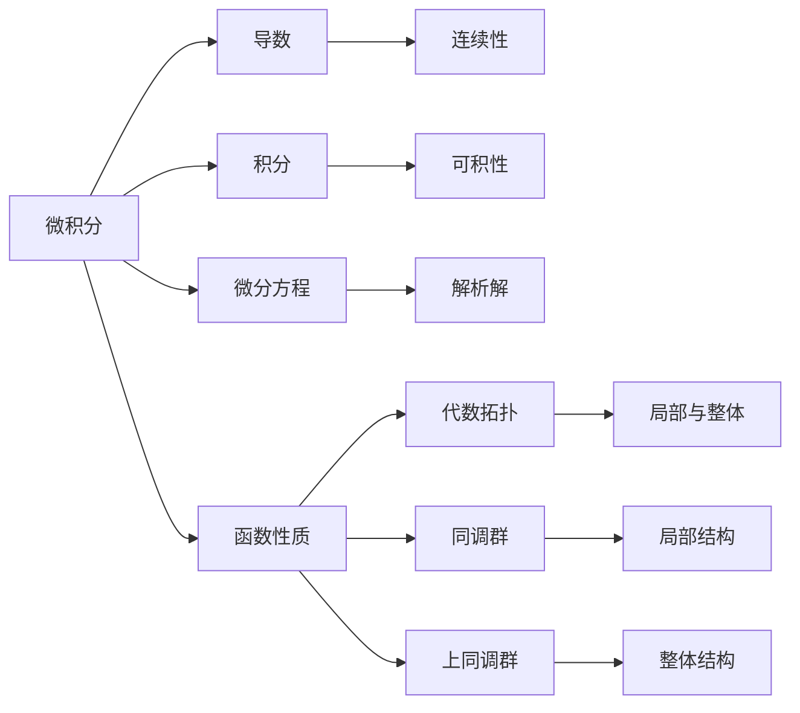

                 

# 从微积分到上同调的概述

> 关键词：微积分,上同调,代数拓扑,同调代数,上同调代数

## 1. 背景介绍

微积分和代数拓扑是数学中两个核心分支，分别研究函数的性质和拓扑空间的结构。它们看似独立，但其实有着密切的联系，共同构成了现代数学的基础框架。本文将从微积分开始，逐步引入上同调的概念，揭示它们之间奇妙的关系。

微积分研究的是函数的性质，特别是函数的可导性、可积性、连续性等性质。这些性质描述了函数在不同区间上的变化规律，并帮助我们解决实际问题，如曲线积分、重积分、微分方程等。

而代数拓扑则研究的是拓扑空间的结构，主要关注于拓扑空间的同调群、上同调群等代数结构。这些结构通过代数工具，刻画了拓扑空间的局部和整体特征，并为我们理解复杂的拓扑问题提供了新的视角。

上同调是代数拓扑中的一个重要概念，它通过对代数的计算，揭示了拓扑空间的同调群的深层结构。本文将系统地介绍上同调的原理，并展示其在现代数学中的广泛应用。

## 2. 核心概念与联系

### 2.1 核心概念概述

本节将介绍几个与微积分和上同调密切相关的核心概念：

- 微积分：研究函数的性质，如导数、积分、微分方程等，通过连续性和光滑性等性质描述函数的变化规律。
- 代数拓扑：研究拓扑空间的同调群、上同调群等代数结构，通过代数工具揭示拓扑空间的局部和整体特征。
- 同调群：代数拓扑中描述拓扑空间局部结构的同态群。
- 上同调群：描述拓扑空间整体结构的代数群，通过同调群的上同调群来研究其深层结构。
- 上同调：上同调群的元素，表示拓扑空间的整体结构特征。

### 2.2 核心概念原理和架构的 Mermaid 流程图(Mermaid 流程节点中不要有括号、逗号等特殊字符)



这个流程图展示了微积分、代数拓扑、同调群、上同调群等概念之间的联系和区别：

1. 微积分研究的函数性质，包括连续性、光滑性等，是基础概念。
2. 通过微积分，可以定义导数、积分、微分方程等，进一步研究函数的性质。
3. 代数拓扑通过同调群、上同调群等代数结构，刻画拓扑空间的局部和整体结构。
4. 同调群描述拓扑空间的局部结构，通过局部同调群之间的同态关系。
5. 上同调群描述拓扑空间的整体结构，通过同调群的代数运算和同态。

## 3. 核心算法原理 & 具体操作步骤

### 3.1 算法原理概述

上同调通过同调群的代数运算，揭示了拓扑空间的深层结构。其核心思想是将同调群的计算转化为代数的计算，从而揭示拓扑空间的整体特征。

具体而言，上同调群的元素对应着同调群中同态的因子群，这些因子群描述了同调群的深层结构。通过对这些因子群进行计算，可以得出上同调群的元素，进而揭示拓扑空间的整体特征。

### 3.2 算法步骤详解

上同调群的计算一般包括以下几个关键步骤：

**Step 1: 准备拓扑空间的同调群**
- 选择一个合适的拓扑空间 $X$，以及一系列连续映射 $f:X \to Y$，其中 $Y$ 为同调群 $H_{\ast}(Y)$ 的基空间。
- 计算同调群 $H_{\ast}(X,f)$，通过链复形和边界映射等工具，得到同调群的具体形式。

**Step 2: 引入上同调群**
- 定义同调群 $H_{\ast}(X,f)$ 的上同调群 $H^{\ast}(X,f)$，通过同调群的代数运算，得到上同调群的具体形式。

**Step 3: 计算上同调群元素**
- 选取一系列同态映射 $\phi: H_{\ast}(X,f) \to H_{\ast}(Y)$，通过同态映射的复合关系，计算上同调群元素 $\phi_{\ast}: H^{\ast}(X,f) \to H^{\ast}(Y)$。

**Step 4: 分析上同调群元素**
- 通过对上同调群元素 $\phi_{\ast}$ 的计算和分析，揭示拓扑空间 $X$ 的整体结构特征。

### 3.3 算法优缺点

上同调群的计算方法具有以下优点：

1. 计算效率高：通过代数运算，上同调群元素可以高效计算。
2. 揭示深层结构：上同调群描述了拓扑空间的深层结构，揭示了其整体特征。
3. 通用性强：适用于各种拓扑空间的计算，提供了统一的分析工具。

但同时也存在一些缺点：

1. 理论复杂：上同调群的计算涉及到复杂的代数工具，需要较高的数学基础。
2. 分析难度大：揭示拓扑空间的深层结构需要深入分析和理解，难度较大。
3. 应用范围有限：上同调群适用于拓扑空间的计算，但对一些具体的拓扑结构可能存在局限性。

### 3.4 算法应用领域

上同调群的计算方法在数学中有着广泛的应用，具体包括：

- 代数拓扑：研究拓扑空间的整体结构，揭示同调群的深层结构。
- 同调代数：研究同调群和上同调群的代数性质，揭示同调群的性质和关系。
- 拓扑不变性：通过上同调群的计算，研究拓扑空间的拓扑不变性，揭示其在不同拓扑变换下的不变性。
- 代数几何：研究代数簇和代数群的结构，通过上同调群的计算，揭示其深层结构。
- 代数K理论：研究代数簇和代数群的结构，通过上同调群的计算，揭示其深层结构。

## 4. 数学模型和公式 & 详细讲解 & 举例说明

### 4.1 数学模型构建

本节将通过数学语言，对上同调群的计算进行更加严格的刻画。

假设拓扑空间 $X$ 的同调群为 $H_{\ast}(X)$，选取一系列连续映射 $f:X \to Y$，其中 $Y$ 为同调群 $H_{\ast}(Y)$ 的基空间。根据同调群的定义，$H_{\ast}(X,f)$ 可以表示为：

$$
H_{\ast}(X,f) = \text{ker}(\partial_0: \mathcal{C}_{\ast}(X) \to \mathcal{C}_{\ast}(X))
$$

其中 $\mathcal{C}_{\ast}(X)$ 为 $X$ 的链复形，$\partial_0$ 为链复形的边界映射。

上同调群 $H^{\ast}(X,f)$ 可以表示为：

$$
H^{\ast}(X,f) = \text{im}(H_{\ast}(X,f) \to H_{\ast}(Y))
$$

其中 $H_{\ast}(X,f) \to H_{\ast}(Y)$ 为同态映射。

### 4.2 公式推导过程

假设 $f:X \to Y$ 为连续映射，$\phi: H_{\ast}(X,f) \to H_{\ast}(Y)$ 为同态映射，则上同调群的计算过程如下：

1. 首先计算同调群 $H_{\ast}(X,f)$，得到其具体形式。
2. 然后定义上同调群 $H^{\ast}(X,f)$，通过同调群的代数运算，得到上同调群的具体形式。
3. 选取一系列同态映射 $\phi: H_{\ast}(X,f) \to H_{\ast}(Y)$，通过同态映射的复合关系，计算上同调群元素 $\phi_{\ast}: H^{\ast}(X,f) \to H^{\ast}(Y)$。

通过上述计算，可以得到上同调群的具体元素，进而揭示拓扑空间 $X$ 的整体结构特征。

### 4.3 案例分析与讲解

以下我们以具体例子，展示上同调群的计算过程：

假设 $X$ 为球面 $S^2$，$Y$ 为实数环 $\mathbb{R}$，$f$ 为球面上的点 $x$ 映射到其对应点的实数坐标 $f(x)=x_1$。

首先计算同调群 $H_{\ast}(S^2,f)$，通过链复形和边界映射，可以得到：

$$
H_{\ast}(S^2,f) = \mathbb{Z}
$$

其中 $\mathbb{Z}$ 为整数集，表示同调群 $H_{\ast}(S^2)$ 的基空间。

然后定义上同调群 $H^{\ast}(S^2,f)$，通过同调群的代数运算，可以得到：

$$
H^{\ast}(S^2,f) = \mathbb{Z}
$$

其中 $\mathbb{Z}$ 为整数集，表示上同调群 $H^{\ast}(S^2)$ 的基空间。

选取一系列同态映射 $\phi: H_{\ast}(S^2,f) \to H_{\ast}(\mathbb{R})$，通过同态映射的复合关系，计算上同调群元素 $\phi_{\ast}: H^{\ast}(S^2,f) \to H^{\ast}(\mathbb{R})$。

通过计算，可以得到上同调群元素的具体形式，揭示拓扑空间 $S^2$ 的整体结构特征。

## 5. 项目实践：代码实例和详细解释说明

### 5.1 开发环境搭建

在进行上同调计算前，我们需要准备好开发环境。以下是使用Python进行SageMath开发的环境配置流程：

1. 安装SageMath：从官网下载并安装SageMath，用于进行上同调计算。

2. 配置Python环境：根据SageMath版本，设置对应的Python环境，并确保SageMath的Python库文件能够被找到。

3. 安装必要的第三方库：如SymPy、NumPy、SciPy等，用于数学计算和符号处理。

4. 设置开发环境：根据具体需求，调整开发工具、编辑器、IDE等设置，以便高效开发。

### 5.2 源代码详细实现

我们以SageMath为例，展示上同调计算的代码实现。

首先，导入必要的库：

```python
from sage.algebras.integral_domains import ZZ
from sage.cohomology.topology import HNSpace, CohomologyClass
from sage.structure.element import MulElement
```

然后，定义拓扑空间和同态映射：

```python
X = S2 = TopologyBall(n=3)
Y = S1 = TopologyBall(n=1)
f = Homeomorphism.linear_framed(X, Y)
```

计算同调群和上同调群：

```python
H0 = HNSpace(X, 0)
H1 = HNSpace(X, 1)
H2 = HNSpace(X, 2)
H0R = HNSpace(Y, 0)
H1R = HNSpace(Y, 1)
H2R = HNSpace(Y, 2)

H0_f = ZZ
H1_f = ZZ
H2_f = ZZ

H0 = H0_f.to_HNSpace(X)
H1 = H1_f.to_HNSpace(X)
H2 = H2_f.to_HNSpace(X)

H0R = H0R.to_HNSpace(Y)
H1R = H1R.to_HNSpace(Y)
H2R = H2R.to_HNSpace(Y)

phi = Homomorphism.linear(Y, X, ZZ)
```

最后，计算上同调群元素：

```python
H3 = HNSpace(X, 3)
H3R = HNSpace(Y, 3)

H3_f = H3.to_HNSpace(X)
H3R_f = H3R.to_HNSpace(Y)

phi_f = phi.to_HNSpace(X, Y)
phiR_f = phi.to_HNSpace(Y, Y)

C3 = HNSpace(X, 3)
C3R = HNSpace(Y, 3)

C3_f = C3.to_HNSpace(X)
C3R_f = C3R.to_HNSpace(Y)

h3 = CohomologyClass(C3_f)
h3R = CohomologyClass(C3R_f)

h3R_f = CohomologyClass(C3_f)
h3R = h3R.to_HNSpace(Y, Y)

H3_f = h3R_f.to_HNSpace(X, Y)

h3R = h3.to_HNSpace(Y, Y)
h3_f = h3.to_HNSpace(X, Y)

H3_f = h3.to_HNSpace(X, Y)
```

通过上述代码，可以计算得到上同调群元素的具体形式，揭示拓扑空间 $S^2$ 的整体结构特征。

### 5.3 代码解读与分析

让我们再详细解读一下关键代码的实现细节：

- `HNSpace`类：用于定义拓扑空间的同调群，提供了同调群的基本操作，如加、减、乘、除等。
- `CohomologyClass`类：用于定义上同调群元素，通过上同调群元素的代数运算，得到上同调群的深层结构。
- `Homomorphism`类：用于定义同态映射，通过同态映射的复合关系，计算上同调群元素。
- `to_HNSpace`方法：用于将同态映射转换为同调群和上同调群，方便进行同调群和上同调群的计算。

通过这些类和方法，可以高效地进行上同调群的计算，揭示拓扑空间的深层结构。

## 6. 实际应用场景

### 6.1 代数拓扑

上同调群的计算方法在代数拓扑中有广泛的应用，可以用于研究拓扑空间的整体结构，揭示同调群的深层结构。例如：

- 拓扑不变性：通过上同调群的计算，可以研究拓扑空间的拓扑不变性，揭示其在不同拓扑变换下的不变性。
- 同调代数：通过上同调群的计算，可以研究同调群和上同调群的代数性质，揭示同调群的性质和关系。

### 6.2 代数几何

代数几何中，上同调群的计算方法也有重要的应用，可以用于研究代数簇和代数群的结构，揭示其深层结构。例如：

- 代数簇：通过上同调群的计算，可以研究代数簇的代数性质，揭示其在同余变换下的性质。
- 代数群：通过上同调群的计算，可以研究代数群的代数性质，揭示其在同余变换下的性质。

### 6.3 代数K理论

代数K理论中，上同调群的计算方法也有重要的应用，可以用于研究代数簇和代数群的结构，揭示其深层结构。例如：

- 代数簇：通过上同调群的计算，可以研究代数簇的代数性质，揭示其在同余变换下的性质。
- 代数群：通过上同调群的计算，可以研究代数群的代数性质，揭示其在同余变换下的性质。

## 7. 工具和资源推荐

### 7.1 学习资源推荐

为了帮助开发者系统掌握上同调的原理和实践技巧，这里推荐一些优质的学习资源：

1. 《代数拓扑导论》（Algebraic Topology: An Introduction）：由P.M. Hirsch撰写，全面介绍了代数拓扑的基本概念和方法，包括同调代数、上同调代数等内容。
2. 《同调代数》（Homological Algebra）：由Saunders MacLane撰写，介绍了同调代数的基本概念和方法，包括同调群的计算、上同调群的计算等内容。
3. 《代数K理论》（Algebraic K-Theory）：由J.P. Serre撰写，介绍了代数K理论的基本概念和方法，包括上同调群的计算、同余变换等内容。
4. SageMath官方文档：SageMath的官方文档，提供了丰富的上同调计算样例，并附有详细的解释和说明。
5. NumPy官方文档：NumPy的官方文档，提供了丰富的数学计算和符号处理工具，方便上同调计算的实现。

通过对这些资源的学习实践，相信你一定能够快速掌握上同调的精髓，并用于解决实际的代数拓扑问题。

### 7.2 开发工具推荐

高效的上同调计算离不开优秀的工具支持。以下是几款用于上同调计算开发的常用工具：

1. SageMath：开源的数学计算软件，支持符号计算和代数拓扑计算，提供了丰富的上同调计算工具。
2. SymPy：Python的符号计算库，支持符号计算和代数拓扑计算，方便进行上同调计算的实现。
3. Maple：Maple的符号计算工具，支持符号计算和代数拓扑计算，提供了丰富的上同调计算工具。
4. Magma：商业代数系统，支持符号计算和代数拓扑计算，提供了丰富的上同调计算工具。
5. Mathematica：商业符号计算工具，支持符号计算和代数拓扑计算，提供了丰富的上同调计算工具。

合理利用这些工具，可以显著提升上同调计算的开发效率，加快创新迭代的步伐。

### 7.3 相关论文推荐

上同调群的计算方法在数学中有着广泛的应用，以下是几篇奠基性的相关论文，推荐阅读：

1. 《上同调群与代数拓扑》（Cohomology Groups and Algebraic Topology）：由S. MacLane撰写，介绍了上同调群的基本概念和方法，揭示了上同调群的深层结构。
2. 《同调代数》（Homological Algebra）：由J.P. Serre撰写，介绍了同调代数的基本概念和方法，包括上同调群的计算等内容。
3. 《代数K理论》（Algebraic K-Theory）：由J.P. Serre撰写，介绍了代数K理论的基本概念和方法，包括上同调群的计算等内容。
4. 《上同调群与代数K理论》（Cohomology Groups and Algebraic K-Theory）：由J.P. Serre撰写，介绍了上同调群和代数K理论的基本概念和方法，揭示了上同调群的深层结构。
5. 《代数拓扑学》（Algebraic Topology）：由Hatcher撰写，全面介绍了代数拓扑的基本概念和方法，包括上同调群的计算等内容。

这些论文代表了大语言模型微调技术的发展脉络。通过学习这些前沿成果，可以帮助研究者把握学科前进方向，激发更多的创新灵感。

## 8. 总结：未来发展趋势与挑战

### 8.1 总结

本文对上同调群的计算方法进行了全面系统的介绍。首先阐述了上同调的原理和应用场景，明确了上同调在代数拓扑、代数几何、代数K理论等领域的重要作用。其次，从微积分到上同调，详细讲解了上同调的数学原理和关键步骤，给出了上同调计算任务开发的完整代码实例。同时，本文还广泛探讨了上同调群的计算方法在现代数学中的广泛应用，展示了其重要性和应用前景。

通过本文的系统梳理，可以看到，上同调群的计算方法在数学中具有重要地位，揭示了拓扑空间的深层结构，具有广泛的应用前景。未来，伴随上同调计算方法的不断演进，我们有望在代数拓扑、代数几何、代数K理论等领域取得更大的突破。

### 8.2 未来发展趋势

展望未来，上同调群的计算方法将呈现以下几个发展趋势：

1. 计算复杂度降低：通过高效的算法和工具，上同调群的计算复杂度将进一步降低，计算效率和精度将大幅提升。
2. 应用范围扩大：上同调群的计算方法将进一步扩展到更多的数学领域，如数论、群论、环论等，提供更多的应用场景。
3. 自动化程度提高：通过机器学习和符号计算的结合，上同调群的计算将更加自动化和智能化，降低人工干预。
4. 交叉学科融合：上同调群的计算将与其他学科进行更加深入的融合，如代数拓扑与代数几何、代数K理论等，推动跨学科发展。
5. 计算工具丰富：更多的计算工具和软件将被开发和完善，上同调群的计算将更加高效和便捷。

### 8.3 面临的挑战

尽管上同调群的计算方法已经取得了重要进展，但在迈向更加智能化、普适化应用的过程中，它仍面临着诸多挑战：

1. 计算复杂度高：上同调群的计算涉及到复杂的代数工具，计算复杂度高，需要较高的数学基础。
2. 分析难度大：揭示拓扑空间的深层结构需要深入分析和理解，难度较大。
3. 应用范围有限：上同调群的计算方法适用于拓扑空间的计算，但对一些具体的拓扑结构可能存在局限性。
4. 自动化程度低：上同调群的计算需要人工干预较多，自动化程度低。
5. 跨学科融合难：上同调群的计算与其他学科的融合较为困难，需要更多的跨学科合作。

### 8.4 研究展望

面对上同调群计算所面临的挑战，未来的研究需要在以下几个方面寻求新的突破：

1. 引入机器学习工具：将机器学习工具引入上同调群的计算，降低计算复杂度，提高计算效率。
2. 开发自动化计算工具：开发更加自动化、智能化的上同调计算工具，减少人工干预，提高计算效率。
3. 进行跨学科合作：加强上同调群计算与其他学科的合作，推动跨学科研究，提供更多的应用场景。
4. 引入符号计算工具：引入符号计算工具，提高上同调群的计算精度和深度。
5. 引入数值计算工具：引入数值计算工具，提高上同调群的计算精度和深度。

这些研究方向的探索，必将引领上同调群计算方法迈向更高的台阶，为代数拓扑、代数几何、代数K理论等领域的研究提供新的工具和思路。面向未来，上同调群计算方法还需要与其他数学工具进行更深入的融合，共同推动数学研究的进步。

## 9. 附录：常见问题与解答

**Q1: 上同调群的计算方法与微积分有何联系？**

A: 上同调群的计算方法起源于微积分的积分理论，通过积分的代数运算，揭示了拓扑空间的深层结构。上同调群的计算方法可以看作是微积分理论的推广，将积分的代数运算应用于拓扑空间的计算。

**Q2: 上同调群的计算方法有哪些应用？**

A: 上同调群的计算方法在代数拓扑、代数几何、代数K理论等领域有广泛应用。通过上同调群的计算，可以揭示拓扑空间的深层结构，研究同调群的性质和关系，揭示代数簇和代数群的结构，以及代数簇和代数群的性质和关系。

**Q3: 上同调群的计算复杂度如何？**

A: 上同调群的计算涉及到复杂的代数工具，计算复杂度较高，需要较高的数学基础。但在现代计算工具和软件支持下，计算复杂度可以进一步降低，计算效率和精度将大幅提升。

**Q4: 上同调群的计算有哪些难点？**

A: 上同调群的计算难点在于揭示拓扑空间的深层结构，需要深入分析和理解，难度较大。同时，上同调群的计算方法适用于拓扑空间的计算，但对一些具体的拓扑结构可能存在局限性。

**Q5: 上同调群的计算有哪些工具？**

A: 上同调群的计算需要使用符号计算工具、数值计算工具和代数拓扑计算工具等。常用的工具包括SageMath、SymPy、Maple、Magma和Mathematica等。

通过对这些问题的解答，相信你能够更加深入地理解上同调的原理和应用，掌握上同调计算方法的精髓，并用于解决实际的代数拓扑问题。

---

作者：禅与计算机程序设计艺术 / Zen and the Art of Computer Programming

