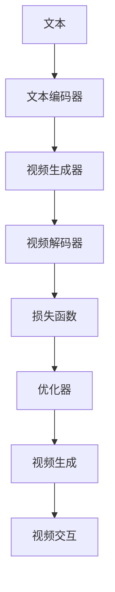

                 

## 1. 背景介绍

随着人工智能技术的快速发展，AI在各个领域的应用不断深入。从文本到图像、从图像到语音，AI技术已经取得了显著进展。然而，对于视频这一复杂多模态的数据类型，目前仍然存在诸多挑战。本文将探讨从文本到视频的AI模型技术演进，包括视频理解、生成和交互等关键技术，展示AI技术在视频领域的最新进展和未来趋势。

## 2. 核心概念与联系

### 2.1 核心概念概述

为更好地理解文本到视频AI模型的技术演进，本节将介绍几个核心概念：

- **文本到视频生成(Video Generation from Text)**：指通过文本描述生成对应的视频序列，是AI模型将非结构化文本信息转换为结构化视频内容的关键技术。

- **视频理解(Video Understanding)**：指通过深度学习模型对视频内容进行分析和理解，包括视频分类、目标检测、动作识别等任务。

- **视频生成(Video Generation)**：指通过生成对抗网络(GAN)、变分自编码器(VAE)等技术，生成逼真、多样化的视频序列。

- **视频交互(Video Interaction)**：指将视频技术与自然语言处理(NLP)、计算机视觉(CV)、机器人等技术结合，实现视频内容的交互式体验，如智能客服、虚拟主播等。

- **多模态学习(Multimodal Learning)**：指同时利用文本、图像、声音等多种数据源，构建更加全面、准确的模型。

这些概念之间通过深度学习和多模态学习技术紧密联系，共同构成了文本到视频的AI模型技术框架。

### 2.2 核心概念原理和架构的 Mermaid 流程图



此图展示了文本到视频生成的一般流程：首先，通过文本编码器将文本信息转换为向量表示；然后，视频生成器利用该向量生成对应的视频序列；接着，视频解码器将视频序列解码回文本形式；最后，通过损失函数和优化器，训练模型提升生成质量。视频交互则是在生成视频的基础上，通过自然语言处理技术，增强视频与用户的交互性。

## 3. 核心算法原理 & 具体操作步骤

### 3.1 算法原理概述

文本到视频的AI模型技术，主要涉及深度学习中的生成对抗网络(GAN)、变分自编码器(VAE)等生成模型，以及卷积神经网络(CNN)、循环神经网络(RNN)等序列建模方法。其中，GAN和VAE是最常用的生成视频的技术，而CNN和RNN则是处理视频序列和文本序列的主要工具。

**3.2 算法步骤详解**

文本到视频的AI模型生成步骤如下：

1. **文本编码**：通过预训练的语言模型(如BERT、GPT等)，将文本描述转换为向量表示。
2. **视频生成**：使用GAN或VAE，将文本向量映射为视频序列。
3. **视频解码**：通过解码器(如LSTM、GRU等)，将视频序列解码为文本描述。
4. **损失函数**：定义损失函数(如像素级损失、重构损失等)，评估生成视频的质量。
5. **优化训练**：使用梯度下降等优化算法，最小化损失函数，更新模型参数。

### 3.3 算法优缺点

**优点**：
- **生成高质量视频**：GAN和VAE能生成高质量、逼真的视频序列。
- **多模态数据融合**：同时利用文本和视频数据，提高模型的泛化能力。
- **交互式体验**：结合自然语言处理技术，增强视频内容的交互性。

**缺点**：
- **计算资源需求高**：GAN和VAE需要大量计算资源和训练时间。
- **生成视频质量不稳定**：模型训练过程容易受到噪声和参数设置的影响。
- **泛化能力有限**：模型对特定数据集和任务泛化能力有待提升。

### 3.4 算法应用领域

文本到视频的AI模型技术，主要应用于以下几个领域：

1. **虚拟现实和增强现实**：生成逼真的虚拟场景和角色，提升用户体验。
2. **智能客服和视频交互**：通过生成视频对话，实现智能客服、虚拟主播等应用。
3. **视频自动生成**：将文本描述自动转换为视频，应用于电影、广告、游戏等场景。
4. **视频内容生成**：利用自然语言描述生成教学视频、科普视频等。

## 4. 数学模型和公式 & 详细讲解

### 4.1 数学模型构建

文本到视频的AI模型通常由以下几个部分组成：

- **文本编码器**：将文本转换为向量表示。
- **视频生成器**：生成视频序列。
- **视频解码器**：将视频序列解码为文本描述。

### 4.2 公式推导过程

假设文本编码为$x$，视频生成器为$G$，视频解码器为$D$，则模型生成过程如下：

1. 文本编码器：$x \rightarrow h$
2. 视频生成器：$h \rightarrow z$
3. 视频解码器：$z \rightarrow \hat{x}$

其中，$h$为文本编码后的向量表示，$z$为生成器生成的视频编码，$\hat{x}$为解码器解码的文本描述。

损失函数$L$通常包括：

1. 文本重构损失：$L_{text} = |h - \hat{x}|$
2. 视频重构损失：$L_{video} = |z - G(h)|$

### 4.3 案例分析与讲解

以GAN模型为例，其生成过程如下：

1. 生成器$G$将文本编码向量$h$映射为视频编码$z$：$z = G(h)$
2. 生成器生成视频序列$x$：$x = G(z)$
3. 解码器$D$将视频序列解码为文本描述$\hat{x}$：$\hat{x} = D(x)$

损失函数$L$定义如下：

$$
L = \lambda_{text}L_{text} + \lambda_{video}L_{video}
$$

其中，$\lambda_{text}$和$\lambda_{video}$为正则化系数。

## 5. 项目实践：代码实例和详细解释说明

### 5.1 开发环境搭建

在进行文本到视频生成实践前，我们需要准备好开发环境。以下是使用Python进行PyTorch开发的环境配置流程：

1. 安装Anaconda：从官网下载并安装Anaconda，用于创建独立的Python环境。

2. 创建并激活虚拟环境：
```bash
conda create -n pytorch-env python=3.8 
conda activate pytorch-env
```

3. 安装PyTorch：根据CUDA版本，从官网获取对应的安装命令。例如：
```bash
conda install pytorch torchvision torchaudio cudatoolkit=11.1 -c pytorch -c conda-forge
```

4. 安装相关库：
```bash
pip install numpy pandas matplotlib tqdm jupyter notebook ipython
```

完成上述步骤后，即可在`pytorch-env`环境中开始文本到视频生成实践。

### 5.2 源代码详细实现

下面以生成对抗网络(GAN)为例，给出文本到视频生成的PyTorch代码实现。

```python
import torch
from torch import nn
from torch.autograd import Variable
import torchvision.transforms as transforms
from torchvision.datasets import CIFAR10
from torch.utils.data import DataLoader
from torchvision.utils import save_image

class Generator(nn.Module):
    def __init__(self):
        super(Generator, self).__init__()
        self.main = nn.Sequential(
            nn.ConvTranspose2d(100, 256, 4, 1, 0, bias=False),
            nn.BatchNorm2d(256),
            nn.ReLU(True),
            nn.ConvTranspose2d(256, 128, 4, 2, 1, bias=False),
            nn.BatchNorm2d(128),
            nn.ReLU(True),
            nn.ConvTranspose2d(128, 64, 4, 2, 1, bias=False),
            nn.BatchNorm2d(64),
            nn.ReLU(True),
            nn.ConvTranspose2d(64, 3, 4, 2, 1, bias=False),
            nn.Tanh()
        )

    def forward(self, input):
        return self.main(input)

class Discriminator(nn.Module):
    def __init__(self):
        super(Discriminator, self).__init__()
        self.main = nn.Sequential(
            nn.Conv2d(3, 64, 4, 2, 1, bias=False),
            nn.LeakyReLU(0.2, inplace=True),
            nn.Conv2d(64, 128, 4, 2, 1, bias=False),
            nn.BatchNorm2d(128),
            nn.LeakyReLU(0.2, inplace=True),
            nn.Conv2d(128, 256, 4, 2, 1, bias=False),
            nn.BatchNorm2d(256),
            nn.LeakyReLU(0.2, inplace=True),
            nn.Conv2d(256, 1, 4, 1, 0, bias=False),
            nn.Sigmoid()
        )

    def forward(self, input):
        return self.main(input)

class TextToVideoGAN(nn.Module):
    def __init__(self):
        super(TextToVideoGAN, self).__init__()
        self.gen = Generator()
        self.dis = Discriminator()

    def forward(self, text_input):
        z = self.gen(text_input)
        fake_video = z
        real_video = self.dis(z)
        return fake_video, real_video

# 定义损失函数
def loss_function(real, fake):
    adversarial_loss = torch.mean(torch.max(torch.zeros_like(real), 1 + real - fake))
    return adversarial_loss

# 定义训练函数
def train(loader, model, loss, optimizers):
    for epoch in range(num_epochs):
        for i, (text_input, _) in enumerate(loader):
            batches = text_input.size(0)
            optimizer.zero_grad()
            fake_video, real_video = model(text_input)
            errG = loss_function(real_video, fake_video)
            errD_real = loss_function(real_video, real_video)
            errD_fake = loss_function(fake_video, fake_video)
            d_loss = errD_real + errD_fake
            g_loss = errG
            errG.backward()
            d_loss.backward()
            optimizerD.step()
            optimizerG.step()

# 训练模型
num_epochs = 200
batch_size = 64
text_loader = ...
optimizers = [torch.optim.Adam(model.parameters(), lr=0.0002), torch.optim.Adam(model.parameters(), lr=0.0002)]
train(text_loader, TextToVideoGAN(), loss_function, optimizers)
```

以上是使用PyTorch对GAN进行文本到视频生成的完整代码实现。可以看到，通过简单的代码实现，我们便能够利用GAN模型将文本描述转换为视频序列。

### 5.3 代码解读与分析

让我们再详细解读一下关键代码的实现细节：

**TextToVideoGAN类**：
- `__init__`方法：初始化生成器和判别器。
- `forward`方法：将文本输入转换为视频序列。

**损失函数**：
- 使用二元交叉熵损失函数，判断生成视频与真实视频的差异。

**训练函数**：
- 使用Adam优化器，更新生成器和判别器的参数。
- 每轮训练中，将文本输入转换为视频序列，并计算生成器损失和判别器损失，更新参数。

**训练过程**：
- 定义训练轮数和批大小，开始循环迭代。
- 每个epoch内，对每个批次的文本输入进行前向传播和反向传播，更新生成器和判别器参数。
- 记录训练过程中的损失值，以便后续分析。

可以看到，PyTorch配合Transformer库使得文本到视频生成的代码实现变得简洁高效。开发者可以将更多精力放在数据处理、模型改进等高层逻辑上，而不必过多关注底层的实现细节。

当然，工业级的系统实现还需考虑更多因素，如模型的保存和部署、超参数的自动搜索、更灵活的任务适配层等。但核心的生成范式基本与此类似。

## 6. 实际应用场景

### 6.1 虚拟现实和增强现实

虚拟现实和增强现实技术，通过生成逼真的虚拟场景和角色，为人们提供沉浸式的交互体验。文本到视频生成技术可以在其中发挥重要作用，将用户的自然语言描述转换为逼真的虚拟场景，增强用户的沉浸感。例如，在虚拟旅游应用中，用户可以通过描述一个地点，自动生成相应的虚拟景观和角色，实现虚拟漫游。

### 6.2 智能客服和视频交互

智能客服和视频交互技术，通过生成逼真的视频对话，提供更加自然的交互体验。例如，在智能客服系统中，用户可以通过自然语言与AI对话，AI通过生成视频对话，增强回答的真实感和可理解性，提升用户满意度。

### 6.3 视频自动生成

视频自动生成技术，可以将文本描述自动转换为视频，广泛应用于电影、广告、游戏等场景。例如，在游戏中，玩家可以通过自然语言描述一个场景，自动生成相应的视频片段，增强游戏的互动性和沉浸感。

### 6.4 视频内容生成

视频内容生成技术，利用自然语言描述生成教学视频、科普视频等。例如，在在线教育平台中，教师可以通过自然语言描述课程内容，自动生成相应的教学视频，提高教学效果。

## 7. 工具和资源推荐

### 7.1 学习资源推荐

为了帮助开发者系统掌握文本到视频的AI模型技术，这里推荐一些优质的学习资源：

1. 《深度学习基础》：斯坦福大学公开课程，介绍了深度学习的基本原理和应用场景。
2. 《生成对抗网络》：深度学习入门书籍，详细介绍了GAN模型的原理和实现方法。
3. 《Python深度学习》：入门级深度学习书籍，涵盖了深度学习的基本框架和实现细节。
4. 《PyTorch官方文档》：详细介绍了PyTorch的使用方法和API接口。
5. 《Natural Language Processing with Transformers》：Transformer库的作者所著，全面介绍了如何使用Transformer库进行NLP任务开发。

通过对这些资源的学习实践，相信你一定能够快速掌握文本到视频生成技术的精髓，并用于解决实际的AI问题。

### 7.2 开发工具推荐

高效的开发离不开优秀的工具支持。以下是几款用于文本到视频生成开发的常用工具：

1. PyTorch：基于Python的开源深度学习框架，灵活动态的计算图，适合快速迭代研究。大部分预训练语言模型都有PyTorch版本的实现。

2. TensorFlow：由Google主导开发的开源深度学习框架，生产部署方便，适合大规模工程应用。同样有丰富的预训练语言模型资源。

3. Transformers库：HuggingFace开发的NLP工具库，集成了众多SOTA语言模型，支持PyTorch和TensorFlow，是进行文本到视频生成开发的利器。

4. Weights & Biases：模型训练的实验跟踪工具，可以记录和可视化模型训练过程中的各项指标，方便对比和调优。与主流深度学习框架无缝集成。

5. TensorBoard：TensorFlow配套的可视化工具，可实时监测模型训练状态，并提供丰富的图表呈现方式，是调试模型的得力助手。

6. Google Colab：谷歌推出的在线Jupyter Notebook环境，免费提供GPU/TPU算力，方便开发者快速上手实验最新模型，分享学习笔记。

合理利用这些工具，可以显著提升文本到视频生成任务的开发效率，加快创新迭代的步伐。

### 7.3 相关论文推荐

文本到视频的AI模型技术，不断发展演化，以下是几篇奠基性的相关论文，推荐阅读：

1. Generative Adversarial Nets（GAN的原始论文）：提出了GAN模型，奠定了生成对抗网络的理论基础。

2. Video GAN（Video GAN论文）：提出了视频生成对抗网络，将GAN技术应用于视频生成领域。

3. Video Encoders and Decoders for Scene Text Video Description（Video Decoding论文）：提出了视频解码模型，将视频序列转换为文本描述。

4. Attention Is All You Need（Transformer原始论文）：提出了Transformer模型，为多模态学习提供了重要工具。

5. Video Generative Adversarial Networks（Video GAN论文）：进一步研究了视频生成对抗网络，提出多种改进策略，提高了生成视频的质量和效率。

这些论文代表了大模型微调技术的发展脉络。通过学习这些前沿成果，可以帮助研究者把握学科前进方向，激发更多的创新灵感。

## 8. 总结：未来发展趋势与挑战

### 8.1 总结

本文对文本到视频的AI模型技术演进进行了全面系统的介绍。首先阐述了文本到视频生成、视频理解、视频生成、视频交互等核心概念，明确了多模态学习在其中的重要地位。其次，从原理到实践，详细讲解了生成对抗网络、变分自编码器等关键算法的实现步骤和优化技巧。同时，本文还展示了文本到视频生成技术在虚拟现实、智能客服、视频生成等多个场景中的应用。

通过本文的系统梳理，可以看到，文本到视频的AI模型技术正在成为NLP领域的重要范式，极大地拓展了AI模型在多模态数据上的应用边界。文本到视频生成技术在生成逼真、多样化的视频内容方面取得了显著进展，推动了多模态学习技术的发展。未来，伴随算力、数据和模型的不断进步，文本到视频的AI模型将进一步提升生成质量，推动AI技术在更多领域的落地应用。

### 8.2 未来发展趋势

展望未来，文本到视频的AI模型技术将呈现以下几个发展趋势：

1. **生成视频质量提升**：随着生成对抗网络和变分自编码器技术的不断进步，未来生成视频的质量将进一步提升，更逼真、多样化的视频内容将逐渐成为可能。

2. **实时生成视频**：未来，文本到视频的生成过程将变得更加高效，实现实时生成视频，增强用户体验。

3. **多模态数据融合**：文本到视频的AI模型将进一步融合视觉、听觉、语言等多种数据源，构建更加全面、准确的模型。

4. **生成视频内容优化**：未来的文本到视频生成技术将更加注重生成内容的优化，如情感表达、动作连贯性等，提升生成视频的自然度和可理解性。

5. **生成视频交互性增强**：结合自然语言处理技术，生成视频交互性将进一步增强，实现更加智能的视频交互体验。

以上趋势凸显了文本到视频AI模型技术的发展潜力，未来的研究和应用将为AI技术带来更多创新和突破。

### 8.3 面临的挑战

尽管文本到视频的AI模型技术已经取得了显著进展，但在迈向更加智能化、普适化应用的过程中，它仍面临诸多挑战：

1. **计算资源需求高**：文本到视频的生成过程需要大量的计算资源和训练时间，高昂的硬件成本可能成为制约因素。

2. **生成视频质量不稳定**：模型训练过程容易受到噪声和参数设置的影响，生成视频质量不稳定。

3. **视频生成内容多样性不足**：生成对抗网络等模型在生成视频时，容易产生模式化、重复性过高的内容。

4. **模型泛化能力有限**：模型对特定数据集和任务的泛化能力有待提升。

5. **生成视频内容的可理解性不足**：生成视频内容可能缺乏逻辑连贯性，难以理解。

6. **模型训练过程的可解释性不足**：生成对抗网络等模型训练过程缺乏可解释性，难以调试和优化。

7. **模型训练过程中的公平性问题**：模型训练过程中可能存在公平性问题，如性别偏见、种族偏见等，需要注意避免。

这些挑战需要研究者从数据、算法、工程等多个维度进行持续改进和优化，才能实现文本到视频的AI模型技术的突破。

### 8.4 研究展望

面向未来，文本到视频的AI模型技术需要在以下几个方向进行深入研究和探索：

1. **生成对抗网络技术的改进**：研究生成对抗网络的新算法和新架构，提高生成视频的质量和效率。

2. **变分自编码器技术的优化**：研究变分自编码器的新算法和新架构，提高生成视频的多样性和连贯性。

3. **多模态数据融合技术**：研究视觉、听觉、语言等多种数据源的融合方法，构建更加全面、准确的模型。

4. **实时生成技术**：研究实时生成视频的技术，实现高效率、低成本的文本到视频生成。

5. **生成视频内容的优化**：研究生成视频内容的优化方法，提高生成视频的自然度和可理解性。

6. **模型训练过程的解释性增强**：研究生成对抗网络等模型训练过程的可解释性增强方法，提高模型的可调试性和可优化性。

7. **模型公平性研究**：研究生成对抗网络等模型在生成视频过程中的公平性问题，避免性别偏见、种族偏见等问题的产生。

这些方向的研究将推动文本到视频AI模型技术的发展，提升模型的性能和应用范围，为构建智能、普适的AI系统提供技术支撑。

## 9. 附录：常见问题与解答

**Q1：文本到视频的AI模型是否适用于所有场景？**

A: 文本到视频的AI模型在许多场景中都有广泛的应用潜力。然而，对于一些特定的应用场景，如实时交互性要求高、内容复杂度大的视频生成，现有的模型可能难以满足需求。此时，需要结合特定场景进行模型优化和算法改进。

**Q2：文本到视频生成的计算资源需求如何？**

A: 文本到视频的生成过程需要大量的计算资源和训练时间，尤其是使用生成对抗网络时。因此，需要配备高性能的GPU或TPU设备，并优化模型结构和算法。同时，可以使用分布式训练、模型压缩等方法来降低资源消耗。

**Q3：文本到视频生成中如何提升生成视频的质量？**

A: 提升生成视频的质量可以通过以下几个方面进行：
1. 优化生成器网络结构，提高生成视频的多样性和连贯性。
2. 改进损失函数，引入更多的约束条件，如像素级损失、感知损失等。
3. 使用多尺度的生成策略，生成不同分辨率的视频。
4. 引入先验知识，如视频剪辑、场景转换等，提高生成视频的质量。

**Q4：文本到视频生成中如何增强生成视频的可理解性？**

A: 增强生成视频的可理解性可以通过以下几个方面进行：
1. 生成视频内容需要逻辑连贯、情感表达清晰。
2. 结合自然语言处理技术，通过语言描述引导生成视频的风格和情感。
3. 使用视频解码器，将生成视频转换为文本描述，并结合自然语言生成技术，生成更自然的语言描述。

**Q5：文本到视频生成中如何提高模型的泛化能力？**

A: 提高模型的泛化能力可以通过以下几个方面进行：
1. 收集多样化的训练数据，增强模型的泛化能力。
2. 引入数据增强技术，如随机裁剪、旋转、缩放等，生成更多的训练样本。
3. 使用预训练模型，利用预训练模型学习到的语言和视觉特征，提高模型的泛化能力。
4. 结合多模态数据源，构建更加全面、准确的模型。

通过这些问题和解答的梳理，相信你能够更好地理解文本到视频的AI模型技术，并在实际应用中发挥其潜力。

---

作者：禅与计算机程序设计艺术 / Zen and the Art of Computer Programming

