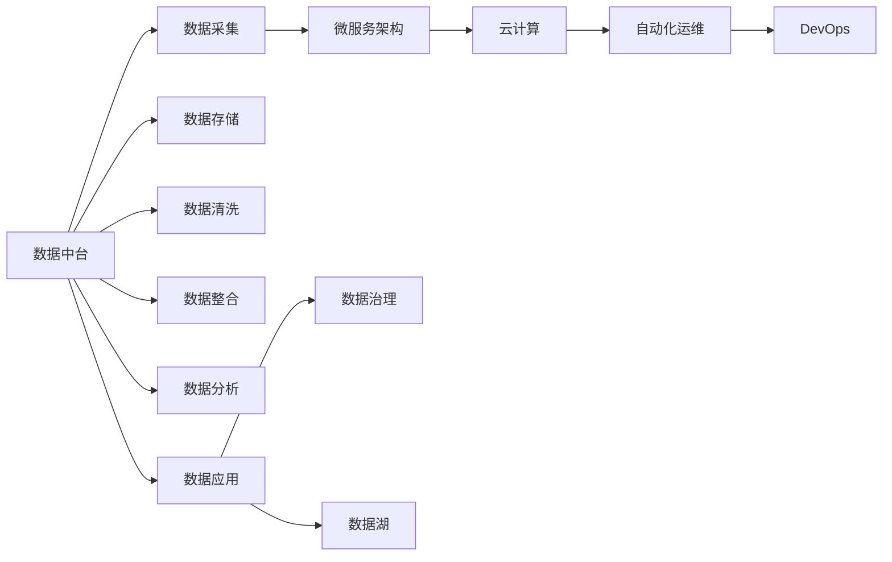

                 

# 从编写代码到准备数据:软件开发重心的转移

> 关键词：软件开发, 数据准备, 微服务架构, 数据中台, 云计算, 自动化运维, DevOps, 数据治理, 数据湖

## 1. 背景介绍

### 1.1 问题由来

软件开发行业正经历着一场深刻的变革。传统以代码为中心的软件开发范式正在逐渐被以数据为中心的开发范式所取代。这一趋势在近年来愈发明显，尤其是在数据驱动型应用、人工智能、大数据等新兴领域。随着技术的进步和应用场景的拓展，数据的作用日益凸显，软件开发重心逐渐从代码转向数据。

### 1.2 问题核心关键点

当前软件开发面临的核心问题是如何在数据驱动的背景下，高效、可靠地准备和利用数据。数据准备与利用涉及数据采集、存储、清洗、整合、分析和应用等多个环节，需要跨部门、跨技术的协作。为此，需要建立一套完整的数据中台体系，并结合云计算、微服务架构、自动化运维等技术手段，提升数据驱动型应用的开发效率和质量。

### 1.3 问题研究意义

开发重心向数据转移，不仅有助于提升应用性能和用户体验，还能推动业务创新和智能化升级。通过系统地管理和利用数据，可以挖掘出更多有价值的业务洞见，加速产品迭代和市场竞争。此外，数据驱动的应用还具备更高的可扩展性和可维护性，更容易应对快速变化的市场需求。

## 2. 核心概念与联系

### 2.1 核心概念概述

为更好地理解从代码到数据的软件开发转变，本节将介绍几个关键概念：

- 数据中台(Data Platform)：一个集中管理数据资源的平台，用于数据的采集、存储、清洗、整合、分析和应用。
- 微服务架构(Microservices Architecture)：将应用拆分为多个独立的服务单元，每个服务单元负责特定的业务逻辑，可以独立部署和扩展。
- 云计算(Cloud Computing)：通过网络提供可扩展的计算资源和存储资源，支持大规模应用和高性能计算。
- 自动化运维(Automated Operations)：通过自动化工具和流程，持续监控和维护应用，减少人为干预，提升系统稳定性。
- DevOps：软件开发与运维的协同工作，强调协作、交付速度和质量。
- 数据治理(Data Governance)：确保数据的质量、安全性和合规性，是数据中台体系的重要组成部分。
- 数据湖(Data Lake)：大规模、异构数据存储平台，支持数据的实时分析和长期保存。

这些概念之间存在紧密联系，共同构成了现代软件开发的基础框架。下面将通过一个Mermaid流程图展示这些概念之间的联系：



## 3. 核心算法原理 & 具体操作步骤

### 3.1 算法原理概述

从代码到数据的转变，本质上是从以功能为中心的软件设计转向以数据为中心的设计。这种转变要求开发团队重新审视应用架构和开发流程，关注数据的采集、存储、处理和应用，而不仅仅是代码的编写和调试。

具体来说，开发重心向数据转移的关键在于：
- 数据的完整性和一致性。数据的准备和处理是确保应用准确性和可靠性的基础。
- 数据的可访问性和可操作性。数据中台和数据湖为开发团队提供了集中管理和应用数据的基础设施。
- 数据驱动的业务决策。通过分析和应用数据，支持业务策略的制定和优化。

### 3.2 算法步骤详解

基于数据驱动的软件开发范式，我们提出以下核心步骤：

**Step 1: 数据采集与清洗**

数据采集是数据驱动应用的第一步。通过API接口、数据库导出、第三方数据服务等方式，将所需数据采集到数据平台。

数据清洗是确保数据质量的重要环节。通过数据校验、数据去重、数据填充等方式，剔除异常数据和噪声，保证数据的一致性和准确性。

**Step 2: 数据存储与整合**

数据存储是数据平台的基础功能。选择合适的存储介质（如关系型数据库、NoSQL数据库、数据湖），确保数据的安全性和可访问性。

数据整合是将不同来源的数据进行统一和转换的过程。通过ETL（Extract, Transform, Load）技术，将异构数据转换成标准格式，方便后续分析和应用。

**Step 3: 数据分析与可视化**

数据分析是数据驱动应用的核心功能。通过数据挖掘、统计分析、机器学习等技术手段，挖掘数据的价值，发现业务洞见。

数据可视化是将分析结果直观呈现的过程。通过图表、报表等方式，将数据洞见转化为可理解、可操作的信息。

**Step 4: 数据应用与反馈**

数据应用是将分析结果转化为业务决策的过程。通过数据驱动的应用系统，将业务洞见转化为具体的行动方案。

数据反馈是将应用效果反馈到数据平台的过程。通过应用效果评估、用户反馈收集等方式，持续改进数据平台和应用系统。

### 3.3 算法优缺点

从代码到数据的转变，虽然带来了数据驱动的灵活性和智能化，但也存在以下挑战：

**优点：**
1. 提升应用性能和用户体验。数据驱动的应用能够更准确地反映业务需求和用户行为。
2. 支持业务创新和智能化升级。通过数据洞察，可以发现新的业务机会和市场趋势。
3. 提高系统的可扩展性和可维护性。数据驱动的应用更易于进行分布式部署和迭代更新。

**缺点：**
1. 数据准备和清洗工作量大。需要跨部门协作，处理复杂的数据质量问题。
2. 数据安全和合规风险高。数据泄露和滥用可能带来严重的法律和业务风险。
3. 数据驱动的决策需要技术支持。需要具备较强的数据科学和分析能力。

## 4. 数学模型和公式 & 详细讲解 & 举例说明

### 4.1 数学模型构建

数据驱动的软件开发涉及到数据平台的设计和优化，可以通过以下数学模型进行建模：

设 $D$ 为数据集， $F$ 为数据分析模型， $S$ 为数据存储系统， $P$ 为数据处理流程， $U$ 为数据应用系统，则数据驱动的软件开发可以建模为：

$$
D \rightarrow F \rightarrow S \rightarrow P \rightarrow U
$$

其中， $F$ 表示数据分析模型，可以包括统计分析、机器学习、知识图谱等多种技术手段。 $S$ 表示数据存储系统，可以是关系型数据库、NoSQL数据库、数据湖等。 $P$ 表示数据处理流程，可以包括ETL、数据清洗、数据整合等步骤。 $U$ 表示数据应用系统，可以包括前端应用、后端服务、集成平台等多种形式。

### 4.2 公式推导过程

以数据清洗为例，假设原始数据集为 $D=\{(x_i,y_i)\}_{i=1}^N$，其中 $x_i$ 为特征向量， $y_i$ 为标签。数据清洗的目标是剔除异常数据和噪声，生成干净的数据集 $D'$。

设 $T$ 为清洗函数，则数据清洗过程可以表示为：

$$
D' = T(D)
$$

其中， $T$ 可以包括数据去重、数据填充、数据校验等操作。

### 4.3 案例分析与讲解

假设我们有一家电商平台，需要分析用户购买行为，以优化推荐系统。数据采集的第一步是通过API接口获取用户行为数据：

```python
import requests

response = requests.get('https://api.example.com/user_behavior')
data = response.json()
```

接下来，我们需要对数据进行清洗，剔除重复记录和噪声数据：

```python
import pandas as pd

df = pd.DataFrame(data)
df = df.drop_duplicates()
df = df.dropna()
```

数据清洗完成后，可以将其存储到数据湖中：

```python
import boto3

client = boto3.client('s3')
client.upload_file('cleaned_data.csv', 'my-bucket', 'cleaned_data.csv')
```

最后，我们可以使用机器学习模型对用户行为进行分析：

```python
from sklearn.ensemble import RandomForestRegressor

model = RandomForestRegressor()
model.fit(X_train, y_train)
```

## 5. 项目实践：代码实例和详细解释说明

### 5.1 开发环境搭建

在进行数据驱动的应用开发前，我们需要搭建开发环境。以下是使用Python进行微服务架构开发的环境配置流程：

1. 安装Anaconda：从官网下载并安装Anaconda，用于创建独立的Python环境。

2. 创建并激活虚拟环境：
```bash
conda create -n microservices-env python=3.8 
conda activate microservices-env
```

3. 安装必要的开发库：
```bash
pip install flask django boto3 pandas sqlalchemy psycopg2
```

4. 安装微服务架构所需的库：
```bash
pip install apiflow click awscli
```

5. 安装自动化运维所需的工具：
```bash
pip install ansible
```

完成上述步骤后，即可在`microservices-env`环境中开始微服务架构的开发。

### 5.2 源代码详细实现

下面我们以电商平台推荐系统为例，给出使用微服务架构开发的应用实例。

首先，定义微服务架构的基本组件：

```python
from flask import Flask
from flask_sqlalchemy import SQLAlchemy
from flask_marshmallow import Marshmallow
from flask_restful import Api, Resource

app = Flask(__name__)
app.config['SQLALCHEMY_DATABASE_URI'] = 'sqlite:///recommendations.db'
db = SQLAlchemy(app)
ma = Marshmallow(app)
api = Api(app)

class User(db.Model):
    id = db.Column(db.Integer, primary_key=True)
    name = db.Column(db.String(50))
    age = db.Column(db.Integer)
    gender = db.Column(db.String(10))

    def __init__(self, name, age, gender):
        self.name = name
        self.age = age
        self.gender = gender

class UserSchema(ma.SQLAlchemyAutoSchema):
    class Meta:
        model = User
        fields = ('id', 'name', 'age', 'gender')

user_schema = UserSchema()
user_list_schema = UserSchema(many=True)

@app.route('/users', methods=['GET'])
def get_users():
    all_users = User.query.all()
    result = user_list_schema.dump(all_users)
    return jsonify(result)

@app.route('/user/<int:user_id>', methods=['GET'])
def get_user(user_id):
    user = User.query.get(user_id)
    result = user_schema.dump(user)
    return jsonify(result)

@app.route('/user', methods=['POST'])
def create_user():
    name = request.json['name']
    age = request.json['age']
    gender = request.json['gender']
    new_user = User(name, age, gender)
    db.session.add(new_user)
    db.session.commit()
    return jsonify(user_schema.dump(new_user))

if __name__ == '__main__':
    app.run(debug=True)
```

然后，使用Docker容器化微服务架构：

```Dockerfile
FROM python:3.8-slim

WORKDIR /app

COPY requirements.txt .
RUN pip install -r requirements.txt

COPY . .

EXPOSE 5000

CMD ["python", "main.py"]
```

最后，使用Jenkins等CI/CD工具进行自动化部署和运维：

```yaml
pipelines:
  default:
    stages:
      - stage: Prepare
        steps:
          - stage: Install Dependencies
            script: |
              pip install -r requirements.txt

      - stage: Build
        steps:
          - stage: Build Docker Image
            script: |
              docker build -t myapp .
              docker push myapp:latest

      - stage: Deploy
        steps:
          - stage: Deploy to Kubernetes
            script: |
              kubectl apply -f deployment.yaml
              kubectl apply -f service.yaml

      - stage: Test
        steps:
          - stage: Test Microservice
            script: |
              kubectl run test --image=myapp:latest --container-name=test --restart=Never --command=["python","myapp.py"] -p 5000:5000
              kubectl exec -it test -- sh -c "curl http://localhost:5000/users"

      - stage: Monitor
        steps:
          - stage: Deploy Prometheus and Grafana
            script: |
              helm repo add prometheus https://helm.charts/stable
              helm install prometheus stable/prometheus --set-prometheus.rules.configFile=prometheus_rules.yml --set-prometheus.grafana.enabled=true --set-prometheus.listeners=0.0.0.0:9090 --set-prometheus.adminPassword=prometheus --set-prometheus.supportsActiveGateways=true --set-prometheus.replicaCount=2
              helm install grafana stable/grafana
```

### 5.3 代码解读与分析

让我们再详细解读一下关键代码的实现细节：

**定义微服务组件**：
- `User`类：定义了用户数据模型，包括用户ID、姓名、年龄、性别等属性。
- `UserSchema`类：使用Flask-Marshmallow库定义了用户数据Schema，支持数据序列化和反序列化。
- `get_users`、`get_user`、`create_user`方法：分别实现了获取用户列表、获取单个用户、创建新用户的功能。

**微服务架构实现**：
- `Flask`框架：基于Python开发的Web框架，支持RESTful API开发。
- `SQLAlchemy`库：Python ORM库，支持关系型数据库操作。
- `Marshmallow`库：用于序列化和反序列化Python对象和JSON格式数据的库。

**Docker容器化**：
- `Dockerfile`：定义了Docker镜像的构建过程，包括安装依赖、拷贝代码、暴露端口等步骤。
- `docker build`命令：构建Docker镜像，并上传到Docker Hub。
- `docker push`命令：将Docker镜像推送到Docker Hub，以便部署到Kubernetes集群。

**CI/CD流程**：
- `Jenkins`：CI/CD工具，用于自动化构建、测试和部署微服务应用。
- `prometheus`和`grafana`：监控和可视化工具，用于实时监控微服务应用性能和状态。

## 6. 实际应用场景

### 6.1 电商推荐系统

基于微服务架构的电商平台推荐系统，可以提供个性化推荐服务，提升用户体验和销售转化率。通过数据分析和机器学习，对用户行为和偏好进行建模，推荐系统可以实时生成个性化商品推荐，满足用户需求。

在技术实现上，可以搭建微服务架构，将用户行为数据、商品数据、推荐模型等组件独立部署。每个微服务负责特定功能，通过API接口进行协同。同时，可以使用Prometheus和Grafana等工具，实时监控推荐系统性能和健康状态，保证推荐效果和系统稳定性。

### 6.2 金融风险控制系统

金融行业对数据驱动的应用需求尤为强烈，通过数据分析和模型训练，可以识别出异常交易行为，及时发现并防范金融风险。基于微服务架构的金融风险控制系统，可以高效处理海量交易数据，实时分析风险特征，生成风险预警。

在技术实现上，可以搭建微服务架构，将数据采集、数据清洗、模型训练、风险预警等组件独立部署。每个微服务负责特定功能，通过API接口进行协同。同时，可以使用Elasticsearch和Kibana等工具，实时监控金融风险数据和预警系统性能，保证风险防范和系统稳定。

### 6.3 智慧医疗健康平台

智慧医疗健康平台通过数据驱动的分析和应用，可以提升医疗服务质量，优化医疗资源配置，实现个性化医疗。基于微服务架构的智慧医疗平台，可以高效处理和分析患者数据、医疗记录、健康监测数据等，生成个性化健康建议和治疗方案。

在技术实现上，可以搭建微服务架构，将患者数据、医疗记录、健康监测数据、医疗建议等组件独立部署。每个微服务负责特定功能，通过API接口进行协同。同时，可以使用Amazon S3和Databricks等工具，实时监控智慧医疗平台数据和应用性能，保证医疗服务质量和系统稳定性。

### 6.4 未来应用展望

随着微服务架构和大数据技术的不断成熟，基于数据驱动的应用将越来越普及。未来，微服务架构将与云计算、容器化、自动化运维等技术深度融合，提升应用开发和部署的效率和质量。同时，数据驱动的应用将拓展到更多行业，带来新的业务模式和增长点。

## 7. 工具和资源推荐

### 7.1 学习资源推荐

为了帮助开发者系统掌握数据驱动的软件开发，这里推荐一些优质的学习资源：

1. 《微服务架构设计与开发》系列博文：介绍微服务架构的基本概念、设计原则和实现技术，适合初学者入门。
2. 《数据科学基础》课程：从数据采集、数据清洗、数据分析到数据可视化，系统介绍数据驱动的开发流程。
3. 《DevOps实践指南》书籍：介绍DevOps的基本理念、工具链和最佳实践，帮助开发者提升自动化运维能力。
4. 《数据治理框架》书籍：介绍数据治理的基本框架和实践指南，帮助开发者构建可靠的数据中台体系。
5. 《数据湖技术白皮书》：介绍数据湖的基本概念、技术栈和应用场景，适合深度学习领域开发者。

通过对这些资源的学习实践，相信你一定能够快速掌握数据驱动的软件开发，并用于解决实际的业务问题。

### 7.2 开发工具推荐

高效的开发离不开优秀的工具支持。以下是几款用于数据驱动应用开发的常用工具：

1. Flask和Django：Python Web框架，支持RESTful API开发和数据库操作。
2. SQLAlchemy：Python ORM库，支持关系型数据库操作。
3. Marshmallow：用于序列化和反序列化Python对象和JSON格式数据的库。
4. Docker：容器化工具，支持微服务架构的部署和扩展。
5. Jenkins：CI/CD工具，支持自动化构建、测试和部署。
6. Prometheus和Grafana：监控和可视化工具，支持微服务应用的性能和状态监控。

合理利用这些工具，可以显著提升数据驱动应用开发的效率，加快创新迭代的步伐。

### 7.3 相关论文推荐

数据驱动的软件开发涉及数据平台、微服务架构、云计算、自动化运维等前沿技术，以下是几篇奠基性的相关论文，推荐阅读：

1. 《微服务架构：构建可扩展的应用系统》：介绍微服务架构的基本概念、设计原则和实现技术。
2. 《数据驱动的决策支持系统》：介绍数据驱动决策的基本流程和技术手段。
3. 《云计算和微服务架构》：介绍云计算和微服务架构的基本概念、技术和应用案例。
4. 《自动化运维：DevOps的实践》：介绍DevOps的基本理念、工具链和最佳实践。
5. 《数据治理：构建可靠的数据中台》：介绍数据治理的基本框架和实践指南。

这些论文代表了大数据驱动的应用开发发展脉络。通过学习这些前沿成果，可以帮助研究者把握学科前进方向，激发更多的创新灵感。

## 8. 总结：未来发展趋势与挑战

### 8.1 总结

本文对从代码到数据的软件开发范式进行了全面系统的介绍。首先阐述了数据驱动的应用开发背景和意义，明确了数据驱动在提升应用性能、支持业务创新和智能化升级方面的独特价值。其次，从原理到实践，详细讲解了数据驱动应用开发的数学模型和关键步骤，给出了微服务架构的完整代码实例。同时，本文还广泛探讨了数据驱动应用在电商推荐、金融风险控制、智慧医疗等众多领域的应用前景，展示了数据驱动范式的巨大潜力。此外，本文精选了数据驱动应用的各类学习资源，力求为读者提供全方位的技术指引。

通过本文的系统梳理，可以看到，从代码到数据的转变，不仅是对软件开发范式的颠覆，更是对企业数字化转型的深刻影响。通过系统地管理和利用数据，可以挖掘出更多有价值的业务洞见，加速产品迭代和市场竞争。未来，伴随数据中台、微服务架构、云计算等技术的不断发展，数据驱动的应用将进一步拓展，为社会带来更加智能化和高效化的解决方案。

### 8.2 未来发展趋势

展望未来，数据驱动的应用开发将呈现以下几个发展趋势：

1. 微服务架构的普及。微服务架构将不断深化，结合DevOps、自动化运维等技术，提升应用的开发和部署效率。
2. 数据中台和数据湖的广泛应用。数据中台和数据湖将成为企业数据治理的核心工具，支持数据的全生命周期管理和应用。
3. 人工智能和机器学习的广泛应用。基于数据驱动的应用将更加智能化，通过数据分析和模型训练，提升业务决策的科学性和精准性。
4. 实时数据处理和分析的普及。通过流式处理和实时计算技术，支持数据的实时分析和应用，满足实时业务需求。
5. 多模态数据的融合。数据驱动的应用将不再局限于结构化数据，将拓展到图像、视频、语音等多模态数据，提升应用的表现力和泛化能力。

以上趋势凸显了数据驱动应用开发的广阔前景。这些方向的探索发展，必将进一步提升应用性能和用户体验，推动业务创新和智能化升级。

### 8.3 面临的挑战

尽管数据驱动的应用开发已经取得了显著成就，但在迈向更加智能化、普适化应用的过程中，它仍面临着诸多挑战：

1. 数据隐私和安全问题。数据泄露和滥用可能带来严重的法律和业务风险。如何确保数据隐私和安全，是数据驱动应用开发的重要挑战。
2. 数据质量和一致性问题。数据清洗和整合工作量大，需要跨部门协作，处理复杂的数据质量问题。如何提升数据质量和一致性，是数据驱动应用开发的难点。
3. 数据驱动的决策需要技术支持。需要具备较强的数据科学和分析能力，对数据驱动的应用开发提出了更高的技术要求。

### 8.4 研究展望

面对数据驱动应用开发所面临的种种挑战，未来的研究需要在以下几个方面寻求新的突破：

1. 探索无监督和半监督数据处理技术。摆脱对大规模标注数据的依赖，利用自监督学习、主动学习等无监督和半监督范式，最大限度利用非结构化数据，实现更加灵活高效的数据处理。
2. 研究参数高效和计算高效的数据处理范式。开发更加参数高效的算法，在固定大部分预训练参数的同时，只更新极少量的任务相关参数。同时优化数据处理算法的计算图，减少前向传播和反向传播的资源消耗，实现更加轻量级、实时性的处理。
3. 融合因果推断和机器学习技术。通过引入因果推断技术，增强数据驱动应用的因果推理能力，学习更加普适、鲁棒的数据表示，从而提升应用泛化性和抗干扰能力。

这些研究方向的探索，必将引领数据驱动应用开发迈向更高的台阶，为构建安全、可靠、可解释、可控的数据驱动应用提供新的技术路径。面向未来，数据驱动的应用开发还需要与其他人工智能技术进行更深入的融合，如知识表示、因果推理、强化学习等，多路径协同发力，共同推动数据驱动应用技术的进步。只有勇于创新、敢于突破，才能不断拓展数据驱动应用的边界，让智能技术更好地造福人类社会。

## 9. 附录：常见问题与解答

**Q1：微服务架构有哪些优缺点？**

A: 微服务架构的主要优点包括：
1. 高可扩展性：每个微服务可以独立部署和扩展，支持系统的弹性伸缩。
2. 高可维护性：微服务架构将系统拆分为多个独立组件，每个组件负责特定的业务逻辑，便于维护和迭代。
3. 高可复用性：微服务组件可以独立部署和复用，支持快速开发和集成。

微服务架构的主要缺点包括：
1. 开发和运维复杂度增加：微服务架构需要跨部门协作，增加了开发和运维的复杂度。
2. 网络延迟和通信开销增加：微服务架构需要通过网络通信实现组件间的协同，可能带来网络延迟和通信开销。
3. 服务间依赖关系复杂：微服务架构的服务间依赖关系复杂，增加了系统的复杂性和维护难度。

**Q2：数据驱动的应用开发需要哪些关键技术？**

A: 数据驱动的应用开发需要以下关键技术：
1. 微服务架构：将系统拆分为多个独立组件，每个组件负责特定的业务逻辑，支持系统的弹性伸缩和快速迭代。
2. 数据中台：集中管理数据资源，支持数据的采集、存储、清洗、整合和应用，提供统一的数据访问接口。
3. 云计算：通过网络提供可扩展的计算资源和存储资源，支持大规模应用和高性能计算。
4. 自动化运维：通过自动化工具和流程，持续监控和维护应用，减少人为干预，提升系统稳定性。
5. DevOps：软件开发与运维的协同工作，强调协作、交付速度和质量，提升开发和运维效率。
6. 数据治理：确保数据的质量、安全性和合规性，是数据中台体系的重要组成部分。

**Q3：数据驱动的应用开发需要注意哪些问题？**

A: 数据驱动的应用开发需要注意以下问题：
1. 数据隐私和安全问题：数据泄露和滥用可能带来严重的法律和业务风险，需要加强数据隐私和安全保护。
2. 数据质量和一致性问题：数据清洗和整合工作量大，需要跨部门协作，处理复杂的数据质量问题，确保数据的一致性和准确性。
3. 数据驱动的决策需要技术支持：需要具备较强的数据科学和分析能力，对数据驱动的应用开发提出了更高的技术要求。

**Q4：如何构建可靠的数据中台体系？**

A: 构建可靠的数据中台体系，需要以下关键步骤：
1. 数据集成：将不同来源的数据进行统一和转换，确保数据的完整性和一致性。
2. 数据清洗：通过数据校验、数据去重、数据填充等方式，剔除异常数据和噪声，保证数据的一致性和准确性。
3. 数据存储：选择合适的存储介质，确保数据的安全性和可访问性。
4. 数据治理：制定数据治理策略，确保数据的合规性和安全性和性能。
5. 数据应用：通过数据分析、机器学习等技术手段，挖掘数据的价值，支持业务决策。

**Q5：如何提升数据驱动应用的性能和用户体验？**

A: 提升数据驱动应用的性能和用户体验，需要以下关键步骤：
1. 实时数据处理：通过流式处理和实时计算技术，支持数据的实时分析和应用，满足实时业务需求。
2. 数据可视化：将数据分析结果直观呈现，提供可视化报表和仪表盘，支持用户快速理解和应用数据洞见。
3. 个性化推荐：通过数据分析和机器学习，生成个性化推荐，提升用户体验和销售转化率。
4. 自动化运维：通过自动化工具和流程，持续监控和维护应用，减少人为干预，提升系统稳定性。

综上所述，数据驱动的应用开发需要跨部门协作，综合运用多种技术和工具，确保数据的完整性、一致性和可用性，提升应用性能和用户体验。只有系统地管理和利用数据，才能实现数据驱动的应用开发，推动业务创新和智能化升级。

---

作者：禅与计算机程序设计艺术 / Zen and the Art of Computer Programming

