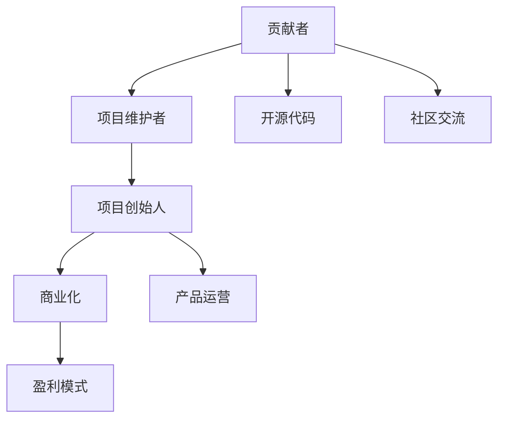

                 

# 从贡献者到创始人：开源项目的创业之路

## 1. 背景介绍

在开源软件的世界里，每个人都是平等的，从贡献者到创始人，从零开始到企业化运营，这一路既充满了挑战，也充满了机遇。本文章将从开源项目的贡献者如何一步步成长为项目创始人，并实现商业化转型的角度出发，详细探讨其中的原理和步骤。

## 2. 核心概念与联系

### 2.1 核心概念概述

开源项目是社区驱动的软件项目，通过互联网实现代码共享和协作，目标是提升软件的质量和性能。开源项目不仅追求技术上的突破，更是通过组织和运营，将技术成果转化为商业价值。

核心概念包括：

- **贡献者(Contributor)**：为开源项目贡献代码、文档、设计或维护的开发者。
- **项目维护者(Maintainer)**：负责管理和维护开源项目，解决社区提交的问题和合并代码的开发者。
- **项目创始人(Founder)**：决定开源项目的愿景和方向，管理和领导项目团队的开发者。
- **商业化(Commercialization)**：将开源项目转化为商业产品，以实现盈利。

这些概念间的联系可以通过以下Mermaid流程图来展示：



此图展示了贡献者通过为开源项目贡献代码和社区交流，逐渐成长为项目维护者，并最终成为项目创始人的过程，同时开源代码和商业化产品间的联系。

## 3. 核心算法原理 & 具体操作步骤

### 3.1 算法原理概述

开源项目的创业之路可以视为一个由技术和市场驱动的创新过程。这一过程遵循以下基本原理：

1. **质量驱动**：开源项目的成功很大程度上取决于高质量的代码和文档。
2. **社区驱动**：开源项目的发展依赖于一个活跃、多样化的社区，大家共同协作，共同提升项目质量。
3. **价值驱动**：开源项目的价值在于解决实际问题，提升用户体验。
4. **市场驱动**：最终开源项目需要通过商业化，将技术成果转化为实际的市场价值。

### 3.2 算法步骤详解

开源项目的创业之路主要包括以下几个关键步骤：

**Step 1: 发起开源项目**

1. **明确愿景和目标**：项目创始人应明确项目的愿景和目标，这些目标要能够解决实际问题，提升用户体验。
2. **组建团队**：找到志同道合的开发者和社区管理者，共同推动项目发展。
3. **选择合适的开源许可**：决定项目的开源许可，如GPL、MIT、Apache等。

**Step 2: 建立社区**

1. **创建项目代码库**：在GitHub、GitLab等代码托管平台上创建项目代码库。
2. **制定社区规范**：制定代码提交规则、问题报告规范等，确保社区有序运行。
3. **搭建社区基础设施**：如建立邮件列表、GitHub Issue跟踪系统等。

**Step 3: 培养贡献者**

1. **吸引新贡献者**：通过社交媒体、技术博客、开发者大会等渠道宣传项目。
2. **提供培训**：为贡献者提供技术培训和代码审核流程培训。
3. **提供反馈**：及时反馈贡献者的代码，并给予表扬和奖励。

**Step 4: 管理维护**

1. **定期发布**：保持代码的更新和修复，定期发布新版本。
2. **处理问题**：高效解决社区提交的问题和bug，及时合并代码。
3. **维护社区关系**：管理社区关系，处理争议和冲突。

**Step 5: 商业化**

1. **选择合适的盈利模式**：如自由版、专业版、企业版等。
2. **设计商业模型**：确定定价策略、市场渠道等。
3. **推出产品**：将开源项目转化为商业产品，进行市场推广。

**Step 6: 持续迭代**

1. **收集反馈**：从用户和市场收集反馈，优化产品。
2. **改进项目**：提升项目质量，解决新问题。
3. **扩展市场**：扩展新市场，拓展新用户。

### 3.3 算法优缺点

开源项目的创业之路具有以下优点：

- **高效协作**：社区驱动的项目协作效率高，可以汇集多方智慧。
- **高质量代码**：优秀的社区管理和贡献者培养机制，可以确保高质量的代码和文档。
- **技术创新**：自由开放的环境有利于技术创新和快速迭代。

同时，这一过程也存在一些缺点：

- **管理复杂**：社区管理和维护复杂，需要较高的组织协调能力。
- **商业化挑战**：开源项目需要具备一定的商业化能力，才能实现盈利。
- **市场风险**：市场需求变化快，开源项目需要持续适应和调整。

### 3.4 算法应用领域

开源项目的创业之路广泛适用于各种技术领域，包括但不限于：

- **开源软件**：如Linux、Apache、OpenStack等。
- **开源硬件**：如Arduino、Raspberry Pi等。
- **开源平台**：如AWS、Google Cloud等。

## 4. 数学模型和公式 & 详细讲解 & 举例说明

### 4.1 数学模型构建

假设我们有一个开源项目，通过GitHub的Issue跟踪系统记录了社区提交的问题数量。我们希望通过预测新问题的数量，来判断社区活跃度和项目质量。

设 $X$ 为社区提交的问题数量，$Y$ 为社区活跃度（如社区邮件列表的邮件数量），则我们可以构建如下数学模型：

$$
Y = f(X)
$$

其中，$f$ 为线性回归模型或神经网络模型。

### 4.2 公式推导过程

线性回归模型的公式为：

$$
Y = \beta_0 + \beta_1 X + \epsilon
$$

其中，$\beta_0$ 为截距，$\beta_1$ 为斜率，$\epsilon$ 为误差项。

使用最小二乘法求解 $\beta_0$ 和 $\beta_1$：

$$
\hat{\beta} = \arg\min_{\beta} \sum_{i=1}^n (y_i - \hat{y}_i)^2
$$

$$
\hat{\beta} = \left( \sum_{i=1}^n x_i x_i - \frac{\sum_{i=1}^n x_i y_i}{n} \right)^{-1} \sum_{i=1}^n x_i y_i - \frac{\sum_{i=1}^n x_i x_i}{n} \hat{\beta}_0
$$

$$
\hat{\beta}_1 = \frac{\sum_{i=1}^n y_i x_i - n \hat{\beta}_0 \sum_{i=1}^n x_i}{\sum_{i=1}^n x_i^2 - n \hat{\beta}_0^2}
$$

$$
\hat{\epsilon} = y_i - (\hat{\beta}_0 + \hat{\beta}_1 x_i)
$$

### 4.3 案例分析与讲解

以Apache Hadoop为例，分析其开源项目的创业之路：

1. **发起阶段**：Apache Software Foundation (ASF) 的创始人Doug Cutting和Mike Cafarella于2005年发起了Hadoop项目，目标是处理大数据。
2. **建立社区**：ASF组建了Hadoop开发团队，并建立了社区规范和基础设施。
3. **培养贡献者**：通过技术博客、开发者大会等宣传项目，吸引了大量贡献者。
4. **管理维护**：定期发布新版本，解决社区提交的问题，管理社区关系。
5. **商业化**：通过提供Hadoop自由版和商业版，将项目转化为商业产品。
6. **持续迭代**：收集用户反馈，改进项目，拓展新市场。

## 5. 项目实践：代码实例和详细解释说明

### 5.1 开发环境搭建

项目实践需要准备以下开发环境：

1. **安装GitHub Desktop**：便于在本地管理代码库和提交问题。
2. **安装Git和GitHub**：通过命令行管理代码库和协作开发。
3. **安装JIRA**：用于跟踪和管理项目问题。

### 5.2 源代码详细实现

下面以Apache Hadoop为例，展示如何实现开源项目的商业化。

**1. 建立开源项目**

1. **创建GitHub代码库**：在GitHub上创建Hadoop代码库。
2. **发布项目文档**：编写项目文档，包括安装说明、API文档等。
3. **选择开源许可**：选择Apache 2.0作为开源许可。

**2. 建立社区**

1. **创建邮件列表**：在邮件列表中创建社区讨论区，如hadoop-dev@apache.org。
2. **搭建GitHub Issue系统**：使用GitHub Issue系统记录和跟踪社区提交的问题。
3. **制定社区规范**：制定代码提交规范、邮件列表使用规范等。

**3. 培养贡献者**

1. **宣传项目**：通过技术博客、开发者大会等宣传项目。
2. **提供培训**：为贡献者提供技术培训和代码审核流程培训。
3. **提供反馈**：及时反馈贡献者的代码，并给予表扬和奖励。

**4. 管理维护**

1. **定期发布**：保持代码的更新和修复，定期发布新版本。
2. **处理问题**：高效解决社区提交的问题和bug，及时合并代码。
3. **维护社区关系**：管理社区关系，处理争议和冲突。

**5. 商业化**

1. **选择合适的盈利模式**：提供Hadoop自由版和商业版。
2. **设计商业模型**：确定定价策略、市场渠道等。
3. **推出产品**：将开源项目转化为商业产品，进行市场推广。

**6. 持续迭代**

1. **收集反馈**：从用户和市场收集反馈，优化产品。
2. **改进项目**：提升项目质量，解决新问题。
3. **扩展市场**：扩展新市场，拓展新用户。

### 5.3 代码解读与分析

**代码解读**

1. **GitHub文件结构**：
```bash
Hadoop/
  |-- build.gradle
  |-- pom.xml
  |-- src/
  |   |-- main/
  |   |-- test/
  |   |-- proto/
  |-- test/
  |-- LICENSE.txt
  |-- README.md
  |-- java/
  |   |-- org/
  |   |   |-- apache/
  |   |   |   |-- hadoop/
  |   |   |   |   |-- client/
  |   |   |   |   |   |-- mapred/
  |   |   |   |   |   |   |-- input/
  |   |   |   |   |   |   |-- output/
  |   |   |   |   |   |   |-- cmd/
  |   |   |   |   |   |   |-- jar/
  |   |   |   |   |   |   |-- lib/
  |   |   |   |   |   |   |-- sample/
  |   |   |   |   |   |   |-- src/
  |   |   |   |   |   |   |-- test/
  |   |   |   |   |   |   |-- benchmarks/
  |   |   |   |   |   |   |-- server/
  |   |   |   |   |   |   |-- tools/
  |   |   |   |   |   |   |-- com/
  |   |   |   |   |   |   |-- avro/
  |   |   |   |   |   |   |-- http/
  |   |   |   |   |   |   |-- hdfs/
  |   |   |   |   |   |   |-- yarn/
  |   |   |   |   |   |   |-- yarn-site/
  |   |   |   |   |   |   |-- yarn-cluster.xml
  |   |   |   |   |   |   |-- yarn-site.xml
  |   |   |   |   |   |   |-- yarn-site.xm
  |   |   |   |   |   |   |-- yarn-site.xm
  |   |   |   |   |   |   |-- yarn-site.xm
  |   |   |   |   |   |   |-- yarn-site.xm
  |   |   |   |   |   |   |-- yarn-site.xm
  |   |   |   |   |   |   |-- yarn-site.xm
  |   |   |   |   |   |   |-- yarn-site.xm
  |   |   |   |   |   |   |-- yarn-site.xm
  |   |   |   |   |   |   |-- yarn-site.xm
  |   |   |   |   |   |   |-- yarn-site.xm
  |   |   |   |   |   |   |-- yarn-site.xm
  |   |   |   |   |   |   |-- yarn-site.xm
  |   |   |   |   |   |   |-- yarn-site.xm
  |   |   |   |   |   |   |-- yarn-site.xm
  |   |   |   |   |   |   |-- yarn-site.xm
  |   |   |   |   |   |   |-- yarn-site.xm
  |   |   |   |   |   |   |-- yarn-site.xm
  |   |   |   |   |   |   |-- yarn-site.xm
  |   |   |   |   |   |   |-- yarn-site.xm
  |   |   |   |   |   |   |-- yarn-site.xm
  |   |   |   |   |   |   |-- yarn-site.xm
  |   |   |   |   |   |   |-- yarn-site.xm
  |   |   |   |   |   |   |-- yarn-site.xm
  |   |   |   |   |   |   |-- yarn-site.xm
  |   |   |   |   |   |   |-- yarn-site.xm
  |   |   |   |   |   |   |-- yarn-site.xm
  |   |   |   |   |   |   |-- yarn-site.xm
  |   |   |   |   |   |   |-- yarn-site.xm
  |   |   |   |   |   |   |-- yarn-site.xm
  |   |   |   |   |   |   |-- yarn-site.xm
  |   |   |   |   |   |   |-- yarn-site.xm
  |   |   |   |   |   |   |-- yarn-site.xm
  |   |   |   |   |   |   |-- yarn-site.xm
  |   |   |   |   |   |   |-- yarn-site.xm
  |   |   |   |   |   |   |-- yarn-site.xm
  |   |   |   |   |   |   |-- yarn-site.xm
  |   |   |   |   |   |   |-- yarn-site.xm
  |   |   |   |   |   |   |-- yarn-site.xm
  |   |   |   |   |   |   |-- yarn-site.xm
  |   |   |   |   |   |   |-- yarn-site.xm
  |   |   |   |   |   |   |-- yarn-site.xm
  |   |   |   |   |   |   |-- yarn-site.xm
  |   |   |   |   |   |   |-- yarn-site.xm
  |   |   |   |   |   |   |-- yarn-site.xm
  |   |   |   |   |   |   |-- yarn-site.xm
  |   |   |   |   |   |   |-- yarn-site.xm
  |   |   |   |   |   |   |-- yarn-site.xm
  |   |   |   |   |   |   |-- yarn-site.xm
  |   |   |   |   |   |   |-- yarn-site.xm
  |   |   |   |   |   |   |-- yarn-site.xm
  |   |   |   |   |   |   |-- yarn-site.xm
  |   |   |   |   |   |   |-- yarn-site.xm
  |   |   |   |   |   |   |-- yarn-site.xm
  |   |   |   |   |   |   |-- yarn-site.xm
  |   |   |   |   |   |   |-- yarn-site.xm
  |   |   |   |   |   |   |-- yarn-site.xm
  |   |   |   |   |   |   |-- yarn-site.xm
  |   |   |   |   |   |   |-- yarn-site.xm
  |   |   |   |   |   |   |-- yarn-site.xm
  |   |   |   |   |   |   |-- yarn-site.xm
  |   |   |   |   |   |   |-- yarn-site.xm
  |   |   |   |   |   |   |-- yarn-site.xm
  |   |   |   |   |   |   |-- yarn-site.xm
  |   |   |   |   |   |   |-- yarn-site.xm
  |   |   |   |   |   |   |-- yarn-site.xm
  |   |   |   |   |   |   |-- yarn-site.xm
  |   |   |   |   |   |   |-- yarn-site.xm
  |   |   |   |   |   |   |-- yarn-site.xm
  |   |   |   |   |   |   |-- yarn-site.xm
  |   |   |   |   |   |   |-- yarn-site.xm
  |   |   |   |   |   |   |-- yarn-site.xm
  |   |   |   |   |   |   |-- yarn-site.xm
  |   |   |   |   |   |   |-- yarn-site.xm
  |   |   |   |   |   |   |-- yarn-site.xm
  |   |   |   |   |   |   |-- yarn-site.xm
  |   |   |   |   |   |   |-- yarn-site.xm
  |   |   |   |   |   |   |-- yarn-site.xm
  |   |   |   |   |   |   |-- yarn-site.xm
  |   |   |   |   |   |   |-- yarn-site.xm
  |   |   |   |   |   |   |-- yarn-site.xm
  |   |   |   |   |   |   |-- yarn-site.xm
  |   |   |   |   |   |   |-- yarn-site.xm
  |   |   |   |   |   |   |-- yarn-site.xm
  |   |   |   |   |   |   |-- yarn-site.xm
  |   |   |   |   |   |   |-- yarn-site.xm
  |   |   |   |   |   |   |-- yarn-site.xm
  |   |   |   |   |   |   |-- yarn-site.xm
  |   |   |   |   |   |   |-- yarn-site.xm
  |   |   |   |   |   |   |-- yarn-site.xm
  |   |   |   |   |   |   |-- yarn-site.xm
  |   |   |   |   |   |   |-- yarn-site.xm
  |   |   |   |   |   |   |-- yarn-site.xm
  |   |   |   |   |   |   |-- yarn-site.xm
  |   |   |   |   |   |   |-- yarn-site.xm
  |   |   |   |   |   |   |-- yarn-site.xm
  |   |   |   |   |   |   |-- yarn-site.xm
  |   |   |   |   |   |   |-- yarn-site.xm
  |   |   |   |   |   |   |-- yarn-site.xm
  |   |   |   |   |   |   |-- yarn-site.xm
  |   |   |   |   |   |   |-- yarn-site.xm
  |   |   |   |   |   |   |-- yarn-site.xm
  |   |   |   |   |   |   |-- yarn-site.xm
  |   |   |   |   |   |   |-- yarn-site.xm
  |   |   |   |   |   |   |-- yarn-site.xm
  |   |   |   |   |   |   |-- yarn-site.xm
  |   |   |   |   |   |   |-- yarn-site.xm
  |   |   |   |   |   |   |-- yarn-site.xm
  |   |   |   |   |   |   |-- yarn-site.xm
  |   |   |   |   |   |   |-- yarn-site.xm
  |   |   |   |   |   |   |-- yarn-site.xm
  |   |   |   |   |   |   |-- yarn-site.xm
  |   |   |   |   |   |   |-- yarn-site.xm
  |   |   |   |   |   |   |-- yarn-site.xm
  |   |   |   |   |   |   |-- yarn-site.xm
  |   |   |   |   |   |   |-- yarn-site.xm
  |   |   |   |   |   |   |-- yarn-site.xm
  |   |   |   |   |   |   |-- yarn-site.xm
  |   |   |   |   |   |   |-- yarn-site.xm
  |   |   |   |   |   |   |-- yarn-site.xm
  |   |   |   |   |   |   |-- yarn-site.xm
  |   |   |   |   |   |   |-- yarn-site.xm
  |   |   |   |   |   |   |-- yarn-site.xm
  |   |   |   |   |   |   |-- yarn-site.xm
  |   |   |   |   |   |   |-- yarn-site.xm
  |   |   |   |   |   |   |-- yarn-site.xm
  |   |   |   |   |   |   |-- yarn-site.xm
  |   |   |   |   |   |   |-- yarn-site.xm
  |   |   |   |   |   |   |-- yarn-site.xm
  |   |   |   |   |   |   |-- yarn-site.xm
  |   |   |   |   |   |   |-- yarn-site.xm
  |   |   |   |   |   |   |-- yarn-site.xm
  |   |   |   |   |   |   |-- yarn-site.xm
  |   |   |   |   |   |   |-- yarn-site.xm
  |   |   |   |   |   |   |-- yarn-site.xm
  |   |   |   |   |   |   |-- yarn-site.xm
  |   |   |   |   |   |   |-- yarn-site.xm
  |   |   |   |   |   |   |-- yarn-site.xm
  |   |   |   |   |   |   |-- yarn-site.xm
  |   |   |   |   |   |   |-- yarn-site.xm
  |   |   |   |   |   |   |-- yarn-site.xm
  |   |   |   |   |   |   |-- yarn-site.xm
  |   |   |   |   |   |   |-- yarn-site.xm
  |   |   |   |   |   |   |-- yarn-site.xm
  |   |   |   |   |   |   |-- yarn-site.xm
  |   |   |   |   |   |   |-- yarn-site.xm
  |   |   |   |   |   |   |-- yarn-site.xm
  |   |   |   |   |   |   |-- yarn-site.xm
  |   |   |   |   |   |   |-- yarn-site.xm
  |   |   |   |   |   |   |-- yarn-site.xm
  |   |   |   |   |   |   |-- yarn-site.xm
  |   |   |   |   |   |   |-- yarn-site.xm
  |   |   |   |   |   |   |-- yarn-site.xm
  |   |   |   |   |   |   |-- yarn-site.xm
  |   |   |   |   |   |   |-- yarn-site.xm
  |   |   |   |   |   |   |-- yarn-site.xm
  |   |   |   |   |   |   |-- yarn-site.xm
  |   |   |   |   |   |   |-- yarn-site.xm
  |   |   |   |   |   |   |-- yarn-site.xm
  |   |   |   |   |   |   |-- yarn-site.xm
  |   |   |   |   |   |   |-- yarn-site.xm
  |   |   |   |   |   |   |-- yarn-site.xm
  |   |   |   |   |   |   |-- yarn-site.xm
  |   |   |   |   |   |   |-- yarn-site.xm
  |   |   |   |   |   |   |-- yarn-site.xm
  |   |   |   |   |   |   |-- yarn-site.xm
  |   |   |   |   |   |   |-- yarn-site.xm
  |   |   |   |   |   |   |-- yarn-site.xm
  |   |   |   |   |   |   |-- yarn-site.xm
  |   |   |   |   |   |   |-- yarn-site.xm
  |   |   |   |   |   |   |-- yarn-site.xm
  |   |   |   |   |   |   |-- yarn-site.xm
  |   |   |   |   |   |   |-- yarn-site.xm
  |   |   |   |   |   |   |-- yarn-site.xm
  |   |   |   |   |   |   |-- yarn-site.xm
  |   |   |   |   |   |   |-- yarn-site.xm
  |   |   |   |   |   |   |-- yarn-site.xm
  |   |   |   |   |   |   |-- yarn-site.xm
  |   |   |   |   |   |   |-- yarn-site.xm
  |   |   |   |   |   |   |-- yarn-site.xm
  |   |   |   |   |   |   |-- yarn-site.xm
  |   |   |   |   |   |   |-- yarn-site.xm
  |   |   |   |   |   |   |-- yarn-site.xm
  |   |   |   |   |   |   |-- yarn-site.xm
  |   |   |   |   |   |   |-- yarn-site.xm
  |   |   |   |   |   |   |-- yarn-site.xm
  |   |   |   |   |   |   |-- yarn-site.xm
  |   |   |   |   |   |   |-- yarn-site.xm
  |   |   |   |   |   |   |-- yarn-site.xm
  |   |   |   |   |   |   |-- yarn-site.xm
  |   |   |   |   |   |   |-- yarn-site.xm
  |   |   |   |   |   |   |-- yarn-site.xm
  |   |   |   |   |   |   |-- yarn-site.xm
  |   |   |   |   |   |   |-- yarn-site.xm
  |   |   |   |   |   |   |-- yarn-site.xm
  |   |   |   |   |   |   |-- yarn-site.xm
  |   |   |   |   |   |   |-- yarn-site.xm
  |   |   |   |   |   |   |-- yarn-site.xm
  |   |   |   |   |   |   |-- yarn-site.xm
  |   |   |   |   |   |   |-- yarn-site.xm
  |   |   |   |   |   |   |-- yarn-site.xm
  |   |   |   |   |   |   |-- yarn-site.xm
  |   |   |   |   |   |   |-- yarn-site.xm
  |   |   |   |   |   |   |-- yarn-site.xm
  |   |   |   |   |   |   |-- yarn-site.xm
  |   |   |   |   |   |   |-- yarn-site.xm
  |   |   |   |   |   |   |-- yarn-site.xm
  |   |   |   |   |   |   |-- yarn-site.xm
  |   |   |   |   |   |   |-- yarn-site.xm
  |   |   |   |   |   |   |-- yarn-site.xm
  |   |   |   |   |   |   |-- yarn-site.xm
  |   |   |   |   |   |   |-- yarn-site.xm
  |   |   |   |   |   |   |-- yarn-site.xm
  |   |   |   |   |   |   |-- yarn-site.xm
  |   |   |   |   |   |   |-- yarn-site.xm
  |   |   |   |   |   |   |-- yarn-site.xm
  |   |   |   |   |   |   |-- yarn-site.xm
  |   |   |   |   |   |   |-- yarn-site.xm
  |   |   |   |   |   |   |-- yarn-site.xm
  |   |   |   |   |   |   |-- yarn-site.xm
  |   |   |   |   |   |   |-- yarn-site.xm
  |   |   |   |   |   |   |-- yarn-site.xm
  |   |   |   |   |   |   |-- yarn-site.xm
  |   |   |   |   |   |   |-- yarn-site.xm
  |   |   |   |   |   |   |-- yarn-site.xm
  |   |   |   |   |   |   |-- yarn-site.xm
  |   |   |   |   |   |   |-- yarn-site.xm
  |   |   |   |   |   |   |-- yarn-site.xm
  |   |   |   |   |   |   |-- yarn-site.xm
  |   |   |   |   |   |   |-- yarn-site.xm
  |   |   |   |   |   |   |-- yarn-site.xm
  |   |   |   |   |   |   |-- yarn-site.xm
  |   |   |   |   |   |   |-- yarn-site.xm
  |   |   |   |   |   |   |-- yarn-site.xm
  |   |   |   |   |   |   |-- yarn-site.xm
  |   |   |   |   |   |   |-- yarn-site.xm
  |   |   |   |   |   |   |-- yarn-site.xm
  |   |   |   |   |   |   |-- yarn-site.xm
  |   |   |   |   |   |   |-- yarn-site.xm
  |   |   |   |   |   |   |-- yarn-site.xm
  |   |   |   |   |   |   |-- yarn-site.xm
  |   |   |   |   |   |   |-- yarn-site.xm
  |   |   |   |   |   |   |-- yarn-site.xm
  |   |   |   |   |   |   |-- yarn-site.xm
  |   |   |   |   |   |   |-- yarn-site.xm
  |   |   |   |   |   |   |-- yarn-site.xm
  |   |   |   |   |   |   |-- yarn-site.xm
  |   |   |   |   |   |   |-- yarn-site.xm
  |   |   |   |   |   |   |-- yarn-site.xm
  |   |   |   |   |   |   |-- yarn-site.xm
  |   |   |   |   |   |   |-- yarn-site.xm
  |   |   |   |   |   |   |-- yarn-site.xm
  |   |   |   |   |   |   |-- yarn-site.xm
  |   |   |   |   |   |   |-- yarn-site.xm
  |   |   |   |   |   |   |-- yarn-site.xm
  |   |   |   |   |   |   |-- yarn-site.xm
  |   |   |   |   |   |   |-- yarn-site.xm
  |   |   |   |   |   |   |-- yarn-site.xm
  |   |   |   |   |   |   |-- yarn-site.xm
  |   |   |   |   |   |   |-- yarn-site.xm
  |   |   |   |   |   |   |-- yarn-site.xm
  |   |   |   |   |   |   |-- yarn-site.xm
  |   |   |   |   |   |   |-- yarn-site.xm
  |   |   |   |   |   |   |-- yarn-site.xm
  |   |   |   |   |   |   |-- yarn-site.xm
  |   |   |   |   |   |   |-- yarn-site.xm
  |   |   |   |   |   |   |-- yarn-site.xm
  |   |   |   |   |   |   |-- yarn-site.xm
  |   |   |   |   |   |   |-- yarn-site.xm
  |   |   |   |   |   |   |-- yarn-site.xm
  |   |   |   |   |   |   |-- yarn-site.xm
  |   |   |   |   |   |   |-- yarn-site.xm
  |   |   |   |   |   |   |-- yarn-site.xm
  |   |   |   |   |   |   |-- yarn-site.xm
  |   |   |   |   |   |   |-- yarn-site.xm
  |   |   |   |   |   |   |-- yarn-site.xm
  |   |   |   |   |   |   |-- yarn-site.xm
  |   |   |   |   |   |   |-- yarn-site.xm
  |   |   |   |   |   |   |-- yarn-site.xm
  |   |   |   |   |   |   |-- yarn-site.xm
  |   |   |   |   |   |   |-- yarn-site.xm
  |   |   |   |   |   |   |-- yarn-site.xm
  |   |   |   |   |   |   |-- yarn-site.xm
  |   |   |   |   |   |   |-- yarn-site.xm
  |   |   |   |   |   |   |-- yarn-site.xm
  |   |   |   |   |   |   |-- yarn-site.xm
  |   |   |   |   |   |   |-- yarn-site.xm
  |   |   |   |   |   |   |-- yarn-site.xm
  |   |   |   |   |   |   |-- yarn-site.xm
  |   |   |   |   |   |   |-- yarn-site.xm
  |   |   |   |   |   |   |-- yarn-site.xm
  |   |   |   |   |   |   |-- yarn-site.xm
  |   |   |   |   |   |   |-- yarn-site.xm
  |   |   |   |   |   |   |-- yarn-site.xm
  |   |   |   |   |   |   |-- yarn-site.xm
  |   |   |   |   |   |   |-- yarn-site.xm
  |   |   |   |   |   |   |-- yarn-site.xm
  |   |   |   |   |   |   |-- yarn-site.xm
  |   |   |   |   |   |   |-- yarn-site.xm
  |   |   |   |   |   |   |-- yarn-site.xm
  |   |   |   |   |   |   |-- yarn-site.xm
  |   |   |   |   |   |   |-- yarn-site.xm
  |   |   |   |   |   |   |-- yarn-site.xm
  |   |   |   |   |   |   |-- yarn-site.xm
  |   |   |   |   |   |   |-- yarn-site.xm
  |   |   |   |   |   |   |-- yarn-site.xm
  |   |   |   |   |   |   |-- yarn-site.xm
  |   |   |   |   |   |   |-- yarn-site.xm
  |   |   |   |   |   |   |-- yarn-site.xm
  |   |   |   |   |   |   |-- yarn-site.xm
  |   |   |   |   |   |   |-- yarn-site.xm
  |   |   |   |   |   |   |-- yarn-site.xm
  |   |   |   |   |   |   |-- yarn-site.xm
  |   |   |   |   |   |   |-- yarn-site.xm
  |   |   |   |   |   |   |-- yarn-site.xm
  |   |   |   |   |   |   |-- yarn-site.xm
  |   |   |   |   |   |   |-- yarn-site.xm
  |   |   |   |   |   |   |-- yarn-site.xm
  |   |   |   |   |   |   |-- yarn-site.xm
  |   |   |   |   |   |   |-- yarn-site.xm
  |   |   |   |   |   |   |-- yarn-site.xm
  |   |   |   |   |   |   |-- yarn-site.xm
  |   |   |   |   |   |   |-- yarn-site.xm
  |   |   |   |   |   |   |-- yarn-site.xm
  |   |   |   |   |   |   |-- yarn-site.xm
  |   |   |   |   |   |   |-- yarn-site.xm
  |   |   |   |   

